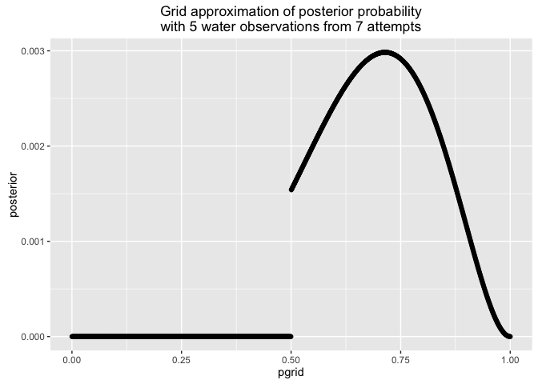

# Statistical Rethinking Chapter 2, sections 2.1 - 2.3

Name: __Julin Maloof__

## 2E1

(2) "Pr(rain|Monday)"

## 2E2

(3) "The probability that it is Monday, given that it is raining"

## 2E3

(1) "Pr(Monday|rain)"
And also (4)??

## 2E4

I think the point is that we are making many assumptions in our globe tossing, for example that the globe is equally weighted and that its landing orientation is truly random.  So what we really can learn in the globe tossing example is just that the probability of observing water after a toss.

## 2M1

Create a function to do the compitations and plot

```r
globe.gridapprox <- function(water, attempts,points=1000,prior=1,main=NULL) {
  
  library(ggplot2)
  
  #define grid
  pgrid <- seq(0,1,length.out = points)
  
  #compute likelihood
  likelihood <- dbinom(water,attempts,prob=pgrid)
  
  #compute prior
  if(is.numeric(prior) & length(prior)==1) {
    prior <- rep(prior,points)
  } else if (is.character(prior)) {
    prior <- eval(parse(text=prior))
  }
  stopifnot(length(prior)==points)
  
  #compute unstandardized posterior
  unstd.posterior <- likelihood * prior
  
  #standardize it
  posterior <- unstd.posterior/sum(unstd.posterior)
  
  #create title if needed
  if(is.null(main)) main <- paste("Grid approximation of posterior probability\nwith",water,"water observations from",attempts,"attempts")
  
  qplot(pgrid,posterior,main=main)

}
```


```r
globe.gridapprox(3,3)
```

```
## Warning: package 'ggplot2' was built under R version 3.2.3
```


```r
globe.gridapprox(3,4)
```


```r
globe.gridapprox(5,7)
```


## 2M2


```r
globe.gridapprox(3,3,prior="ifelse(pgrid<0.5,0,1)")
```


```r
globe.gridapprox(3,4,prior="ifelse(pgrid<0.5,0,1)")
```


```r
globe.gridapprox(5,7,prior="ifelse(pgrid<0.5,0,1)")
```



This prior essentially is saying that we think either there is no water or a _lot_ of water


## 2M3

Posterior = Likelihood * Prior / Average Likelihood

Pr(Earth|land) = Pr(land | earth) * Pr (earth) / Pr(land)

Pr(land | earth) = 0.3
Pr(earth) = 0.5
Pr(land) = (1+0.3) / 2 = 0.65

Pr(Earth|land) = 0.3 * 0.5 / 0.65 = 0.2307692

## 2M4

Basically we need to count the possible paths to B/B

There are 3 ways to get a B side up on the first draw

B/B
B/B
B/W

Two of these three ways will give B on the second side.

## 2M5

As before, we start by thinking about all pulls that could have given black up and what is on the other side of those cards

B1a/B1b
B1b/B1a
B2a/B2b
B2b/B2a
B/W

4 of the 5 ways will give black, so the probability is 4/5

## 2M6

Now the prior probability for B/B is 1, for B/W is 2, and for W/W is 3

We can ignore the W/W becuase we didn't see it

We multiply the number of ways to get B/B or B/W by this prior

B/B * 1
B/B * 1
B/W * 2

So now 50/50

## 2M7 

Like 2M4 but we pull a second card that is white

First Card |Ways to see black |  Second Card | Ways to see white | Ways to see black then white 
-----------|------------------|--------------|-------------------|--------
B/W        |        1         | W/W          | 2                 | 2
B/B        |        2         | W/B or W/W   | 3                 | 6
W/W        |        0         | W/B          | 1                 | 0

## 2H1

I think we want to first determine the relative probability of species A vs Species B given first birth of twins, and the calculate the probabilty of twins in the second birth given that information.

Pr(A|twins) = Pr(twins|A) * Pr(A) / Pr(twins)

Pr(A|twins) = 0.1 * 0.5 / sum(0.1*0.5, 0.2*0.5) = 0.3333333

Pr(B|twins) = 1 - Pr(A|twins) = 0.6666667

So now we can sum the probability of twins if A or B

Pr(twins2) = Pr(A,twins) + Pr(twins) = 0.1*1/3 + 0.2*2/3 = 0.1666667

## 2H2

I already calculated this for the above.  Maybe that means I could have done 2H1 easier

Pr(A|twins) = 0.1 * 0.5 / sum(0.1*0.5, 0.2*0.5) = 0.3333333

## 2H3

Probability that Panda A given twins 1st and no twins.  Use prior information for A vs B from above.

Pr(A|no_twins) = Pr(no_twins|A) * Pr(A) / Pr(no_twins)

Pr(A|no_twins) = 0.9 * 1/3 / sum(0.9*1/3, 0.8*2/3) = 0.36

## 2H4

Pr(A|test) = Pr(test|A) * Pr(A) / Pr(test)

For average likelihood we are summing up the probability of observing A for a Panda A or B

using only the test info:

Pr(A|test) = 0.8 * 0.5 / sum(.8*.5, .35 * .5) = 0.6956522

using our prior info on the likelihood of A and B from 2H3

Pr(A|test) = 0.8 * 0.36 / sum(.8*.36, .35 * .64) = 0.5625
