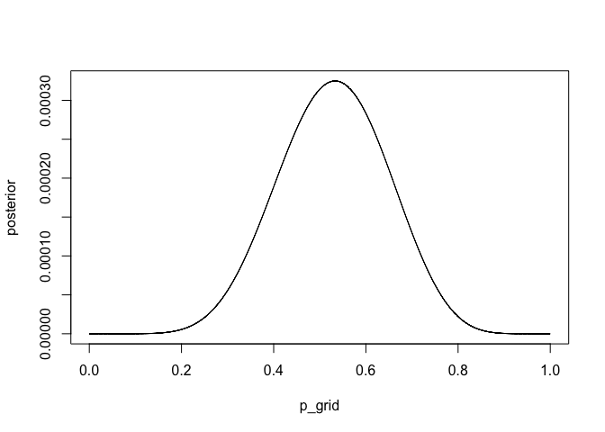
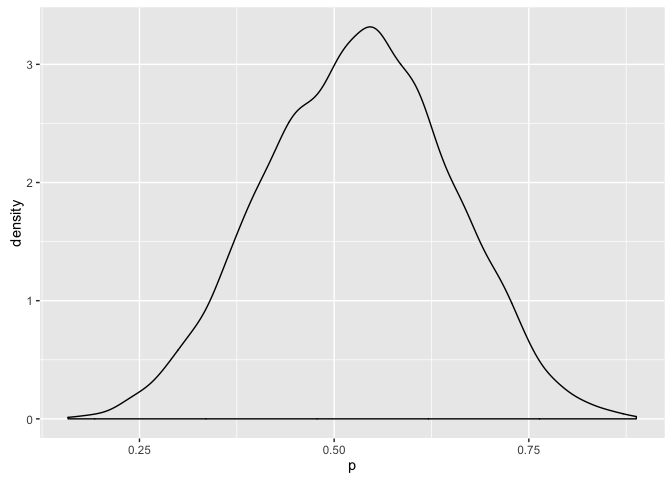
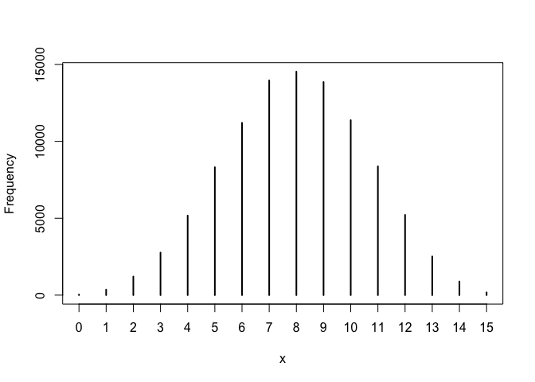
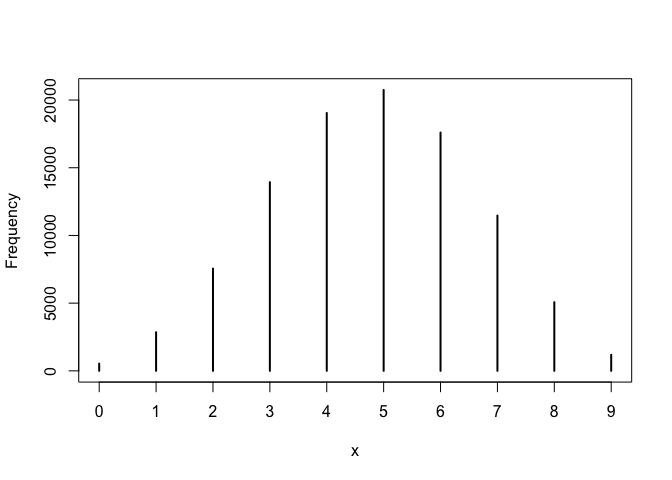
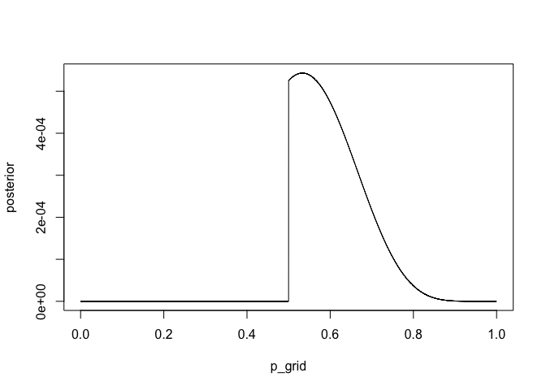
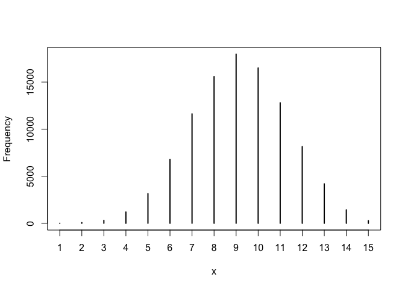
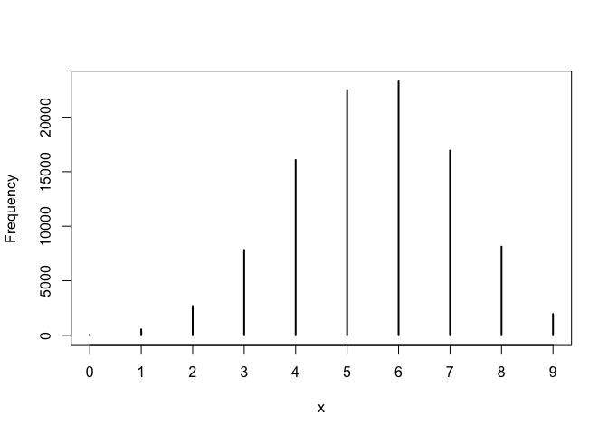

# Statistical Rethinking Chapter 3 problems

__Name:__ _Julin Maloof_

## Set up


```r
p_grid <- seq( from=0 , to=1 , length.out=1000 )
prior <- rep( 1 , 1000 )
likelihood <- dbinom( 6 , size=9 , prob=p_grid )
posterior <- likelihood * prior
posterior <- posterior / sum(posterior)
set.seed(100)
samples <- sample( p_grid , prob=posterior , size=1e4 , replace=TRUE )
library(rethinking)
```

```
## Loading required package: rstan
```

```
## Loading required package: ggplot2
```

```
## rstan (Version 2.9.0-3, packaged: 2016-02-11 15:54:41 UTC, GitRev: 05c3d0058b6a)
```

```
## For execution on a local, multicore CPU with excess RAM we recommend calling
## rstan_options(auto_write = TRUE)
## options(mc.cores = parallel::detectCores())
```

```
## Loading required package: parallel
```

```
## rethinking (Version 1.58)
```

## 3E1
How much posterior probability lies below _p_ = 0.2?  
For this we count the number of samples with _p_ < 0.2 and compare that to the total number of samples

```r
sum(samples < 0.2) / length(samples)
```

```
## [1] 5e-04
```

## 3E2
How much posterior probability lies above _p_ = 0.8?

```r
sum(samples > 0.8) / length(samples)
```

```
## [1] 0.1117
```

## 3E3
How much posterior probability lies between 0.2 and 0.8?

```r
sum(samples > 0.2 & samples < 0.8) / length(samples)
```

```
## [1] 0.8878
```

## 3E4
20% of the posterior probability lies below which value of p?

```r
quantile(samples,.2)
```

```
##       20% 
## 0.5195195
```

## 3E5
20% of the posterior probability lies above which value of p?

```r
quantile(samples,.8)
```

```
##       80% 
## 0.7567568
```

## 3E6
Which values of _p_ contain the narrowest interval equal to 66% of the posterior probability?

```r
HPDI(samples,0.66)
```

```
##     |0.66     0.66| 
## 0.5205205 0.7847848
```

## 3E7
Which calues of p contain 66% of the posterior probability, assuming equal posterior probabilities both below and above the interval?

```r
PI(samples,0.66)
```

```
##       17%       83% 
## 0.5005005 0.7687688
```

## 3M1


```r
p_grid <- seq(0,1,length.out=10000)
prior <- rep(1,length(p_grid))
unstd.posterior <- dbinom(8,15,p_grid) * prior
posterior <- unstd.posterior / sum(unstd.posterior)
plot(p_grid,posterior,type="l")
```



## 3M2


```r
samples <- sample(p_grid,size=10000,prob=posterior,replace=TRUE)
library(ggplot2)
qplot(samples,geom="density") + xlab("p")
```



```r
HPDI(samples,p=0.9)
```

```
##      |0.9      0.9| 
## 0.3345335 0.7229723
```

## 3M3

Construct a posterior predictive check for the model and data in 3M1 and 3M2.

We have sampled from the posterior distribution.  We can use these samples to weight the probabilities in rbinom

```r
water_simulation <- rbinom(1e5,size=15,prob=samples)
head(water_simulation) #number of water in 15 tosses
```

```
## [1] 11  6  5 10  8  8
```

To calculate the probability of 8 waters in 15 tosses we can just ask what proportion of the samples have a value of 8.


```r
sum(water_simulation==8) / length(water_simulation)
```

```
## [1] 0.14538
```

```r
simplehist(water_simulation)
```



## 3M4

Using the new posterior distribution (3M1) calculate the probability of 6 waters in 9 tosses.


```r
water_simulation2 <- rbinom(1e5, size = 9, prob = samples)
sum(water_simulation2==6) / length(water_simulation2)
```

```
## [1] 0.176
```

```r
simplehist(water_simulation2)
```



## 3M5

now use a prior with 0 below p = 0.5 and constant above


```r
p_grid <- seq(0,1,length.out=10000)
prior <- ifelse(p_grid < 0.5 , 0, 1)
unstd.posterior <- dbinom(8,15,p_grid) * prior
posterior <- unstd.posterior / sum(unstd.posterior)
plot(p_grid,posterior,type="l")
```



```r
samples2 <- sample(p_grid,size=10000,prob=posterior,replace=TRUE)
library(ggplot2)
qplot(samples,geom="density") + xlab("p")
```


```r
HPDI(samples,p=0.9)
```

```
##      |0.9      0.9| 
## 0.3345335 0.7229723
```


```r
water_simulation <- rbinom(1e5,size=15,prob=samples2)
sum(water_simulation==8) / length(water_simulation)
```

```
## [1] 0.15586
```

```r
simplehist(water_simulation)
```




```r
water_simulation2 <- rbinom(1e5, size = 9, prob = samples2)
sum(water_simulation2==6) / length(water_simulation2)
```

```
## [1] 0.23283
```

```r
simplehist(water_simulation2)
```




```r
median(samples)
```

```
## [1] 0.5329533
```

```r
median(samples2)
```

```
## [1] 0.5964096
```


## 3H1

## 3H2

## 3H3

## 3H4

## 3H5
