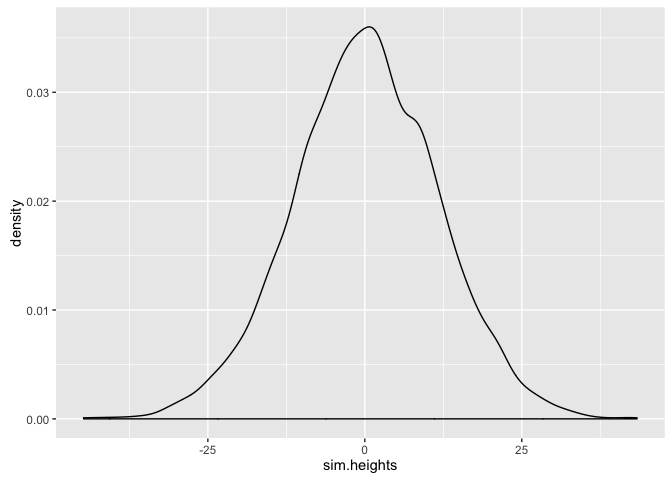

# Statistical Rethinking Chapter 4 problems

__Name:__ Julin Maloof


# For 03/17/16

## 4E1

$$ y_i~\tilde{}~Normal(\mu, \sigma) $$ 

## 4E2

2 parameters are on the posterior distribution

## 4E3

## 4M1

Simulate heights from the prior


```r
library(ggplot2)
library(rethinking)
```

```
## Loading required package: rstan
```

```
## rstan (Version 2.9.0-3, packaged: 2016-02-11 15:54:41 UTC, GitRev: 05c3d0058b6a)
```

```
## For execution on a local, multicore CPU with excess RAM we recommend calling
## rstan_options(auto_write = TRUE)
## options(mc.cores = parallel::detectCores())
```

```
## Loading required package: parallel
```

```
## rethinking (Version 1.58)
```

```r
sim.heights <- rnorm(1e4,
                     mean = rnorm(1e4, mean=0, sd = 10),
                     sd = runif(1e4, min = 0, max=10)
)
qplot(sim.heights,geom="density")
```




## 4M2


```r
flist <- alist(
  y ~ dnorm(mu, sigma),
  mu ~ dnorm(0,10),
  sigma ~ dunif(0,10)
)
#map(flist,data.frame(y = sim.heights),start=list(mu=0,sigma=5)) #nonsensical but I want to test my language
#error in fit...why?
```

# For 03/24/16

## 4E4

$$ \mu_i = \alpha + \beta x_i $$

## 4E5

Three

## 4M3

$$ 
\begin{align} 
y_i &\tilde ~~ Normal(\mu _i, \sigma) \\
\mu _i &= \alpha + \beta * x_i \\
\alpha &\tilde ~~ Normal(0,50) \\
\beta &\tilde ~~ Uniform(0,10) \\
\sigma &\tilde ~~ Uniform(0,50) \\
\end{align}
$$

## 4M4

## 4M5

## 4M6

# For 03/31/16

## 4H1

## 4H2

## 4H3
