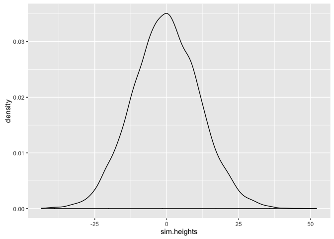
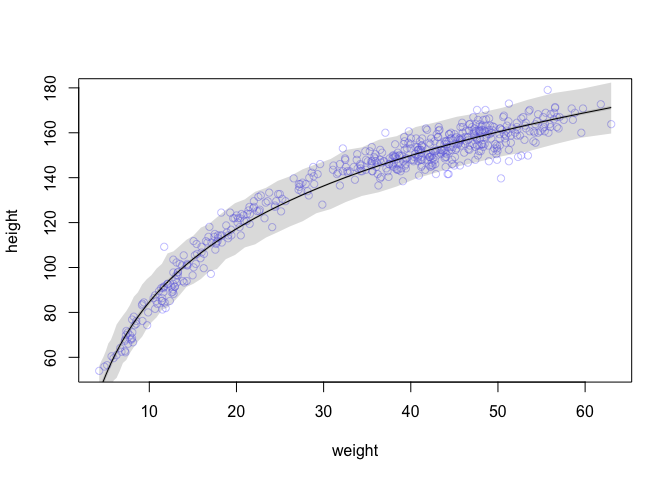

# Statistical Rethinking Chapter 4 problems

__Name:__ Julin Maloof


# For 03/17/16

## 4E1

$$ y_i~\tilde{}~Normal(\mu, \sigma) $$ 

## 4E2

2 parameters are on the posterior distribution

## 4E3

## 4M1

Simulate heights from the prior


```r
library(ggplot2)
library(rethinking)
```

```
## Loading required package: rstan
```

```
## rstan (Version 2.9.0-3, packaged: 2016-02-11 15:54:41 UTC, GitRev: 05c3d0058b6a)
```

```
## For execution on a local, multicore CPU with excess RAM we recommend calling
## rstan_options(auto_write = TRUE)
## options(mc.cores = parallel::detectCores())
```

```
## Loading required package: parallel
```

```
## rethinking (Version 1.58)
```

```r
library(knitr)
sim.heights <- rnorm(1e4,
                     mean = rnorm(1e4, mean=0, sd = 10),
                     sd = runif(1e4, min = 0, max=10)
)
qplot(sim.heights,geom="density")
```




## 4M2


```r
flist <- alist(
  y ~ dnorm(mu, sigma),
  mu ~ dnorm(0,10),
  sigma ~ dunif(0,10)
)
#map(flist,data.frame(y = sim.heights),start=list(mu=0,sigma=5)) #nonsensical but I want to test my language
#error in fit...why?
```

# For 03/24/16

## 4E4

$$ \mu_i = \alpha + \beta x_i $$

## 4E5

Three

## 4M3

$$ 
\begin{align} 
y_i &\tilde ~~ Normal(\mu _i, \sigma) \\
\mu _i &= \alpha + \beta * x_i \\
\alpha &\tilde ~~ Normal(0,50) \\
\beta &\tilde ~~ Uniform(0,10) \\
\sigma &\tilde ~~ Uniform(0,50) \\
\end{align}
$$

## 4M4

We don't know how old the students are.  I assume they are at least in 1st grade (years old).  A quick google suggests that the average height of a 6 year old is 107cm.

The best prior would be one that is broad but does not got below 0, but we haven't learned those yet.  Since we really don't know how old these students are I will use a uniform prior.

Rate of growth must be quite age dependent also and we don't know where we are.  But average growth from 6 to 18 must be around (177 - 42) / 12 = 11.25 cm per year.  So I use that as a normal distributed prior with relative wide standard deviaiton.

Thinking about height variation, a sd of about 30 seems reasonable.

$$ 
\begin{align} 
height_i &\tilde ~~ Normal(\mu _i, \sigma) \\
\mu _i &= \alpha + \beta * year_i \\
\alpha &\tilde ~~ Uniform(50,200) \\
\beta &\tilde ~~ normal(11.25,5) \\
\sigma &\tilde ~~ Uniform(0,30) \\
\end{align}
$$

## 4M5

In this case I would change my alpha to be Normal(120,10)

## 4M6

Variance of 64 means a standard deviation of 8.  So I would change sigma to be Uniform(0,8)

# For 03/31/16

## 4H1

Basically we can follow along what was done in section 4.5.  I will use the quadratic fit.

First we make a model for the data, then we use the sim() function.  The expected height is probably best calculated from the link() function


```r
library(rethinking)
data(Howell1)
d <- Howell1
#standardize weight:
d$weight.s <- (d$weight - mean(d$weight)) / sd(d$weight)

d$weight.s2 <- d$weight.s^2
m4.5 <- map(
  alist(
    height ~ dnorm( mu , sigma ) ,
    mu <- a + b1*weight.s + b2*weight.s2 ,
    a ~ dnorm( 178 , 100 ) ,
    b1 ~ dnorm( 0 , 10 ) ,
    b2 ~ dnorm( 0 , 10 ) ,
    sigma ~ dunif( 0 , 50 )
  ), data=d )

precis( m4.5 )
```

```
##         Mean StdDev   5.5%  94.5%
## a     146.66   0.37 146.07 147.26
## b1     21.40   0.29  20.94  21.86
## b2     -8.42   0.28  -8.87  -7.97
## sigma   5.75   0.17   5.47   6.03
```

```r
#standardize the weights using the scale used for the other observations
weight.pred <- c(46.96,43.72,64.78,32.59,54.63)
weight.pred.s <- (weight.pred - mean(d$weight)) / sd(d$weight)
pred_dat <- list( weight.s=weight.pred.s , weight.s2=weight.pred.s^2 )
mu <- link( m4.5 , data=pred_dat,n=1000 )
```

```
## [ 100 / 1000 ]
[ 200 / 1000 ]
[ 300 / 1000 ]
[ 400 / 1000 ]
[ 500 / 1000 ]
[ 600 / 1000 ]
[ 700 / 1000 ]
[ 800 / 1000 ]
[ 900 / 1000 ]
[ 1000 / 1000 ]
```

```r
mu.mean <- apply( mu , 2 , mean )
sim.height <- sim( m4.5 , data=pred_dat,n=1000 )
```

```
## [ 100 / 1000 ]
[ 200 / 1000 ]
[ 300 / 1000 ]
[ 400 / 1000 ]
[ 500 / 1000 ]
[ 600 / 1000 ]
[ 700 / 1000 ]
[ 800 / 1000 ]
[ 900 / 1000 ]
[ 1000 / 1000 ]
```

```r
#height.mean <- apply(sim.height,2,mean)
height.PI <- apply( sim.height , 2 , PI , prob=0.89 )
kable(data.frame(individual=1:5,
                 weight=weight.pred,
                 expected_height=round(mu.mean,2),
                 interval.89=apply(round(height.PI,1), 2, paste,collapse=" - ")),
      col.names=c("Individual","weight","expected height","89% interval"),
      align="c")
```


 Individual    weight    expected height    89% interval  
------------  --------  -----------------  ---------------
     1         46.96         158.16         148.6 - 167.8 
     2         43.72         155.90         146.9 - 164.7 
     3         64.78         156.04         146.1 - 165.6 
     4         32.59         141.92         133.2 - 150.9 
     5         54.63         160.27         151.7 - 169.1 


## 4H2

### a

```r
d2 <- Howell1[Howell1$age<18,]
dim(d2)
```

```
## [1] 192   4
```

```r
summary(d2)
```

```
##      height           weight            age              male       
##  Min.   : 53.98   Min.   : 4.252   Min.   : 0.000   Min.   :0.0000  
##  1st Qu.: 89.13   1st Qu.:11.708   1st Qu.: 3.000   1st Qu.:0.0000  
##  Median :111.12   Median :16.981   Median : 7.000   Median :0.0000  
##  Mean   :108.32   Mean   :18.414   Mean   : 7.722   Mean   :0.4792  
##  3rd Qu.:127.72   3rd Qu.:23.417   3rd Qu.:12.000   3rd Qu.:1.0000  
##  Max.   :158.12   Max.   :44.736   Max.   :17.000   Max.   :1.0000
```

```r
m.4h2 <- map (
  alist(
    height ~ dnorm(mu, sigma),
    mu <- a + b1*weight,
    a ~ dnorm(80,40),
    b1 ~ dnorm(5,3),
    sigma ~ dunif(0,50)
  ), data=d2)

precis(m.4h2)
```

```
##        Mean StdDev  5.5% 94.5%
## a     58.24   1.40 56.00 60.47
## b1     2.72   0.07  2.61  2.83
## sigma  8.44   0.43  7.75  9.13
```

a is the predicted height when weight = 0 (!) 
b1 is the increase in height per unit increase weight
sigma reflects the sample variation around the mean

### b

```r
#sample from the posterior distribution of mean values
weight.pred <- seq(from=min(d2$weight),to=max(d2$weight),length.out=50)
pred.data <- list(weight=weight.pred)
mu <- link(fit = m.4h2, data = pred.data,n = 1000)
```

```
## [ 100 / 1000 ]
[ 200 / 1000 ]
[ 300 / 1000 ]
[ 400 / 1000 ]
[ 500 / 1000 ]
[ 600 / 1000 ]
[ 700 / 1000 ]
[ 800 / 1000 ]
[ 900 / 1000 ]
[ 1000 / 1000 ]
```

```r
dim(mu)
```

```
## [1] 1000   50
```

```r
mu.mean <- apply(mu, 2, mean)
mu.PI <- apply(mu, 2, PI, prob=.89)
sim.height <- sim(m.4h2,data = pred.data,n = 1000)
```

```
## [ 100 / 1000 ]
[ 200 / 1000 ]
[ 300 / 1000 ]
[ 400 / 1000 ]
[ 500 / 1000 ]
[ 600 / 1000 ]
[ 700 / 1000 ]
[ 800 / 1000 ]
[ 900 / 1000 ]
[ 1000 / 1000 ]
```

```r
height.PI <- apply(sim.height, 2, PI, prob=0.89)

plot(d2$weight,d2$height,col="skyblue")
lines(weight.pred,mu.mean)
shade(mu.PI,pred.data$weight)
shade(height.PI,pred.data$weight)
```


### c

The model does not fit the tails very well at all.  It might have been a bad assumption that height varys linearly with respect to weight.


## 4H3

### a

```r
d <- Howell1

d$log.weight <- log(d$weight)

m.4h3 <- map (
  alist(
    height ~ dnorm(mu, sigma),
    mu <- a + b1*log.weight,
    a ~ dnorm(178,100),
    b1 ~ dnorm(0,100),
    sigma ~ dunif(0,50)
  ), data=d)

precis(m.4h3)
```

```
##         Mean StdDev   5.5%  94.5%
## a     -23.78   1.34 -25.92 -21.65
## b1     47.08   0.38  46.46  47.69
## sigma   5.13   0.16   4.89   5.38
```

### b


```r
#sample from the posterior distribution of mean values
log.weight.pred <- seq(from=min(d$log.weight),to=max(d$log.weight),length.out=50)
pred.data <- list(log.weight=log.weight.pred)
mu <- link(fit = m.4h3, data = pred.data,n = 1000)
```

```
## [ 100 / 1000 ]
[ 200 / 1000 ]
[ 300 / 1000 ]
[ 400 / 1000 ]
[ 500 / 1000 ]
[ 600 / 1000 ]
[ 700 / 1000 ]
[ 800 / 1000 ]
[ 900 / 1000 ]
[ 1000 / 1000 ]
```

```r
dim(mu)
```

```
## [1] 1000   50
```

```r
mu.mean <- apply(mu, 2, mean)
mu.PI <- apply(mu, 2, PI, prob=.97)
sim.height <- sim(m.4h3,data = pred.data,n = 1000)
```

```
## [ 100 / 1000 ]
[ 200 / 1000 ]
[ 300 / 1000 ]
[ 400 / 1000 ]
[ 500 / 1000 ]
[ 600 / 1000 ]
[ 700 / 1000 ]
[ 800 / 1000 ]
[ 900 / 1000 ]
[ 1000 / 1000 ]
```

```r
height.PI <- apply(sim.height, 2, PI, prob=0.97)

plot( height ~ weight , data=Howell1 ,col=col.alpha(rangi2,0.4) )
lines(exp(log.weight.pred),mu.mean)
shade(mu.PI,exp(pred.data$log.weight))
shade(height.PI,exp(pred.data$log.weight))
```



__Nice!__
