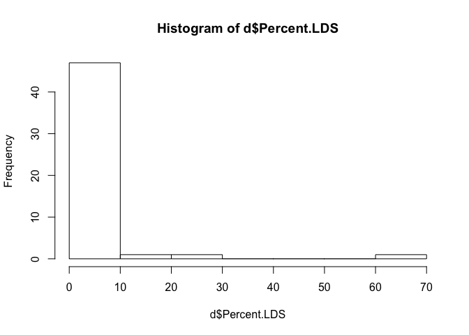
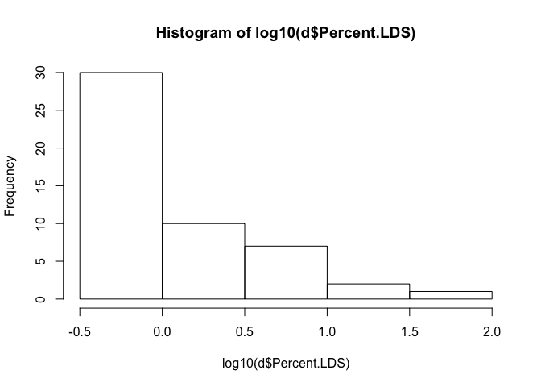
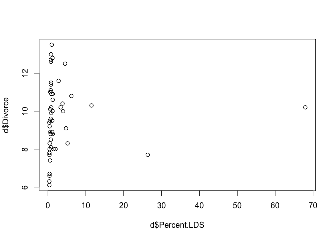
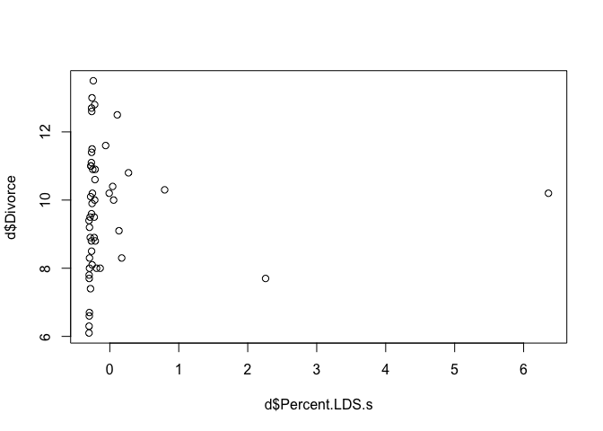
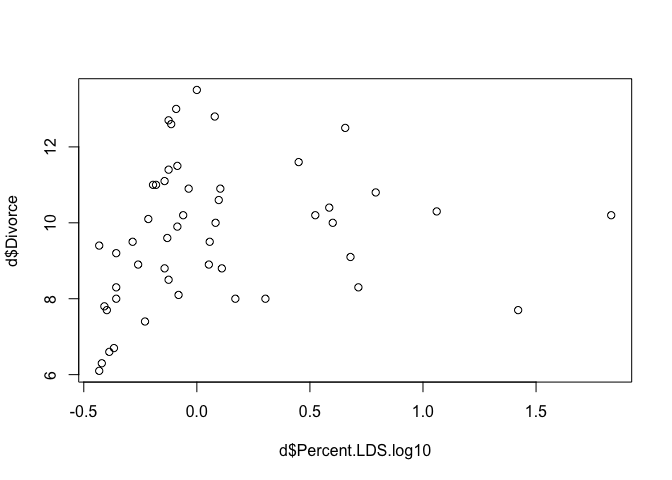
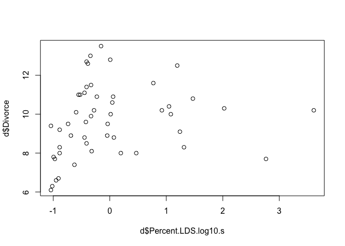
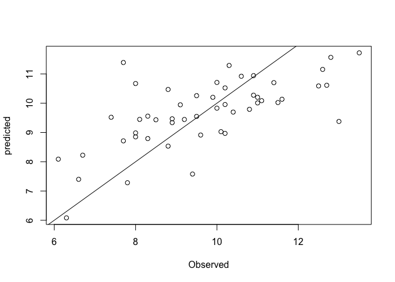
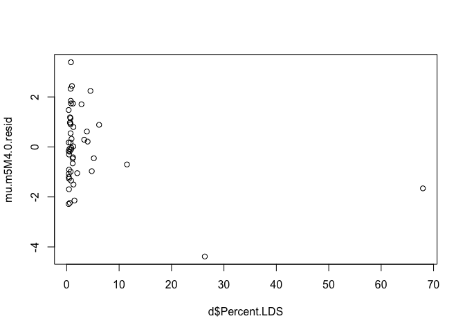

# Statistical Rethinking Chapter 4 problems

__Name:__ _Julin Maloof_


# For 04/11/2016

## 5E1

_Which of the linear models below are multiple linear regressions?_

Two and Four

## 5E2

_Write down a multiple regression to evaluate the claim: Animal diversity is linearly related to latitude, but only after controlling for plant diversity_

I am not sure if we have full covered this, but:

$$
Diversity_i = \alpha + \beta_{lat}*lat_i + \beta_{plant}*plant_i
$$

## 5M1

_Invent your own example of a spurious correlation_

Air density is a predictor of Julin's average speed on the bicycle

Average miles ridden in the previous month is a predictor of Julin's speed on the bicycles

## 5M3

_How might a high divorce rate cause a high marriage rate? Can you think of a way to evaluate this using multiple regression?_

A high divorce rate could cause a high marriage rate because of there being more single people available for marriage

To test for this using multiple regression one could include a factor for the proprtion of marriage that are second marriages.

## 5M4

_Include %Mormons in the divorce rate model_

LDS data from the [wikipedia page](https://en.wikipedia.org/wiki/The_Church_of_Jesus_Christ_of_Latter-day_Saints_membership_statistics_(United_States)#Table)


```r
library(rethinking)
```

```
## Loading required package: rstan
```

```
## Loading required package: ggplot2
```

```
## Warning: package 'ggplot2' was built under R version 3.2.4
```

```
## rstan (Version 2.9.0-3, packaged: 2016-02-11 15:54:41 UTC, GitRev: 05c3d0058b6a)
```

```
## For execution on a local, multicore CPU with excess RAM we recommend calling
## rstan_options(auto_write = TRUE)
## options(mc.cores = parallel::detectCores())
```

```
## Loading required package: parallel
```

```
## rethinking (Version 1.58)
```

```r
data(WaffleDivorce)
d <- WaffleDivorce
LDS <- read.csv("LDS.csv")
head(LDS)
```

```
##        State Percent.LDS
## 1    Alabama        0.75
## 2     Alaska        4.53
## 3    Arizona        6.18
## 4   Arkansas        1.00
## 5 California        2.01
## 6   Colorado        2.82
```

```r
summary(LDS)
```

```
##         State     Percent.LDS    
##  Alabama   : 1   Min.   : 0.370  
##  Alaska    : 1   1st Qu.: 0.600  
##  Arizona   : 1   Median : 0.820  
##  Arkansas  : 1   Mean   : 3.486  
##  California: 1   3rd Qu.: 1.745  
##  Colorado  : 1   Max.   :67.970  
##  (Other)   :45
```

```r
summary(d)
```

```
##        Location       Loc       Population     MedianAgeMarriage
##  Alabama   : 1   AK     : 1   Min.   : 0.560   Min.   :23.20    
##  Alaska    : 1   AL     : 1   1st Qu.: 1.635   1st Qu.:25.32    
##  Arizona   : 1   AR     : 1   Median : 4.435   Median :25.90    
##  Arkansas  : 1   AZ     : 1   Mean   : 6.120   Mean   :26.05    
##  California: 1   CA     : 1   3rd Qu.: 6.678   3rd Qu.:26.75    
##  Colorado  : 1   CO     : 1   Max.   :37.250   Max.   :29.70    
##  (Other)   :44   (Other):44                                     
##     Marriage      Marriage.SE       Divorce         Divorce.SE    
##  Min.   :13.50   Min.   :0.390   Min.   : 6.100   Min.   :0.2400  
##  1st Qu.:17.12   1st Qu.:0.810   1st Qu.: 8.300   1st Qu.:0.5725  
##  Median :19.70   Median :1.185   Median : 9.750   Median :0.7950  
##  Mean   :20.11   Mean   :1.399   Mean   : 9.688   Mean   :0.9618  
##  3rd Qu.:22.10   3rd Qu.:1.768   3rd Qu.:10.900   3rd Qu.:1.2575  
##  Max.   :30.70   Max.   :3.920   Max.   :13.500   Max.   :2.5000  
##                                                                   
##   WaffleHouses        South        Slaves1860     Population1860   
##  Min.   :  0.00   Min.   :0.00   Min.   :     0   Min.   :      0  
##  1st Qu.:  0.00   1st Qu.:0.00   1st Qu.:     0   1st Qu.:  43321  
##  Median :  1.00   Median :0.00   Median :     0   Median : 407722  
##  Mean   : 32.34   Mean   :0.28   Mean   : 79378   Mean   : 628729  
##  3rd Qu.: 39.75   3rd Qu.:1.00   3rd Qu.: 80828   3rd Qu.: 920977  
##  Max.   :381.00   Max.   :1.00   Max.   :490865   Max.   :3880735  
##                                                                    
##  PropSlaves1860   
##  Min.   :0.00000  
##  1st Qu.:0.00000  
##  Median :0.00000  
##  Mean   :0.09405  
##  3rd Qu.:0.08500  
##  Max.   :0.57000  
## 
```

```r
d <- merge(d,LDS,by.x="Location",by.y="State")
summary(d)
```

```
##        Location       Loc       Population     MedianAgeMarriage
##  Alabama   : 1   AK     : 1   Min.   : 0.560   Min.   :23.20    
##  Alaska    : 1   AL     : 1   1st Qu.: 1.635   1st Qu.:25.32    
##  Arizona   : 1   AR     : 1   Median : 4.435   Median :25.90    
##  Arkansas  : 1   AZ     : 1   Mean   : 6.120   Mean   :26.05    
##  California: 1   CA     : 1   3rd Qu.: 6.678   3rd Qu.:26.75    
##  Colorado  : 1   CO     : 1   Max.   :37.250   Max.   :29.70    
##  (Other)   :44   (Other):44                                     
##     Marriage      Marriage.SE       Divorce         Divorce.SE    
##  Min.   :13.50   Min.   :0.390   Min.   : 6.100   Min.   :0.2400  
##  1st Qu.:17.12   1st Qu.:0.810   1st Qu.: 8.300   1st Qu.:0.5725  
##  Median :19.70   Median :1.185   Median : 9.750   Median :0.7950  
##  Mean   :20.11   Mean   :1.399   Mean   : 9.688   Mean   :0.9618  
##  3rd Qu.:22.10   3rd Qu.:1.768   3rd Qu.:10.900   3rd Qu.:1.2575  
##  Max.   :30.70   Max.   :3.920   Max.   :13.500   Max.   :2.5000  
##                                                                   
##   WaffleHouses        South        Slaves1860     Population1860   
##  Min.   :  0.00   Min.   :0.00   Min.   :     0   Min.   :      0  
##  1st Qu.:  0.00   1st Qu.:0.00   1st Qu.:     0   1st Qu.:  43321  
##  Median :  1.00   Median :0.00   Median :     0   Median : 407722  
##  Mean   : 32.34   Mean   :0.28   Mean   : 79378   Mean   : 628729  
##  3rd Qu.: 39.75   3rd Qu.:1.00   3rd Qu.: 80828   3rd Qu.: 920977  
##  Max.   :381.00   Max.   :1.00   Max.   :490865   Max.   :3880735  
##                                                                    
##  PropSlaves1860     Percent.LDS    
##  Min.   :0.00000   Min.   : 0.370  
##  1st Qu.:0.00000   1st Qu.: 0.595  
##  Median :0.00000   Median : 0.820  
##  Mean   :0.09405   Mean   : 3.428  
##  3rd Qu.:0.08500   3rd Qu.: 1.433  
##  Max.   :0.57000   Max.   :67.970  
## 
```


```r
hist(d$Percent.LDS)
```



```r
hist(log10(d$Percent.LDS))
```



```r
d$Percent.LDS.s <- (d$Percent.LDS-mean(d$Percent.LDS)) / sd(d$Percent.LDS)
d$Percent.LDS.log10 <- log10(d$Percent.LDS)
d$Percent.LDS.log10.s <- (d$Percent.LDS.log10-mean(d$Percent.LDS.log10)) / sd(d$Percent.LDS.log10)
d$Marriage.s <- (d$Marriage - mean(d$Marriage))/sd(d$Marriage)
d$MedianAgeMarriage.s <- (d$MedianAgeMarriage - mean(d$MedianAgeMarriage)) / sd(d$MedianAgeMarriage)
```


```r
plot(d$Divorce ~ d$Percent.LDS)
```



```r
plot(d$Divorce ~ d$Percent.LDS.s)
```



```r
plot(d$Divorce ~ d$Percent.LDS.log10)
```



```r
plot(d$Divorce ~ d$Percent.LDS.log10.s)
```




```r
m5M4.1 <- map(alist(
  Divorce ~ dnorm(mu, sigma),
  mu <- a + bR*Marriage.s + bA*MedianAgeMarriage.s + bLDS*Percent.LDS.s,
  a ~ dnorm(10,10),
  bR ~ dnorm(0,1),
  bA ~ dnorm(0,1),
  bLDS ~ dnorm(0,1),
  sigma ~ dunif(0,20)),
  data=d)

precis(m5M4.1)
```

```
##        Mean StdDev  5.5% 94.5%
## a      9.69   0.19  9.38  9.99
## bR     0.06   0.27 -0.38  0.49
## bA    -1.27   0.27 -1.70 -0.85
## bLDS  -0.58   0.22 -0.93 -0.23
## sigma  1.34   0.13  1.13  1.56
```

```r
mu.m5M4.1 <- link(m5M4.1)
```

```
## [ 100 / 1000 ]
[ 200 / 1000 ]
[ 300 / 1000 ]
[ 400 / 1000 ]
[ 500 / 1000 ]
[ 600 / 1000 ]
[ 700 / 1000 ]
[ 800 / 1000 ]
[ 900 / 1000 ]
[ 1000 / 1000 ]
```

```r
mu.m5M41.mean <- apply(mu.m5M4.1,2,mean)
mu.m5M41.PI <- apply(mu.m5M4.1,2,PI)
plot(d$Divorce, mu.m5M41.mean, xlab="Observed",ylab="predicted")
abline(a=0,b=1)
```




```r
m5M4.2 <- map(alist(
  Divorce ~ dnorm(mu, sigma),
  mu <- a + bR*Marriage.s + bA*MedianAgeMarriage.s + bLDS*Percent.LDS.log10.s,
  a ~ dnorm(10,10),
  bR ~ dnorm(0,1),
  bA ~ dnorm(0,1),
  bLDS ~ dnorm(0,1),
  sigma ~ dunif(0,20)),
  data=d)

precis(m5M4.2)
```

```
##        Mean StdDev  5.5% 94.5%
## a      9.69   0.19  9.38 10.00
## bR     0.13   0.30 -0.35  0.60
## bA    -1.29   0.28 -1.74 -0.85
## bLDS  -0.54   0.27 -0.98 -0.10
## sigma  1.38   0.14  1.16  1.60
```

```r
mu.m5M4.2 <- link(m5M4.2)
```

```
## [ 100 / 1000 ]
[ 200 / 1000 ]
[ 300 / 1000 ]
[ 400 / 1000 ]
[ 500 / 1000 ]
[ 600 / 1000 ]
[ 700 / 1000 ]
[ 800 / 1000 ]
[ 900 / 1000 ]
[ 1000 / 1000 ]
```

```r
mu.m5M41.mean <- apply(mu.m5M4.2,2,mean)
mu.m5M41.PI <- apply(mu.m5M4.2,2,PI)
plot(d$Divorce, mu.m5M41.mean, xlab="Observed",ylab="predicted")
abline(a=0,b=1)
```



#need plots, comments, and interpretation
