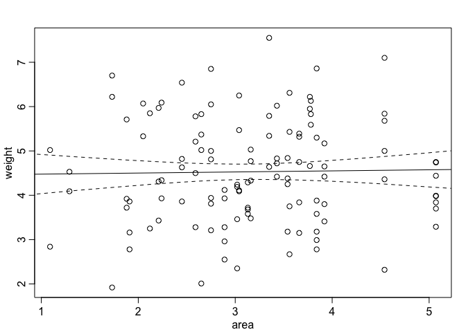
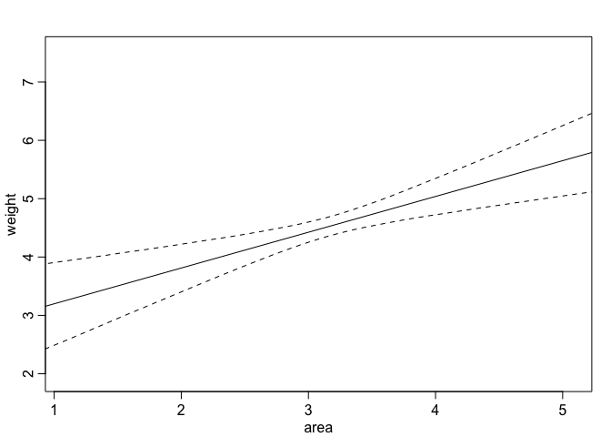

# Chapter-05-part2-assignment
# Statistical Rethinking Chapter 4 problems

__Name: Julin Maloof__


# For 04/18/2016

## 5M2

My example of a masked relationship is predicting energy usage (kW pulled from PG&E) for the Brady/Koch househould.  Because they have solar, this should be predictable by number pf sunny hours in the day.  However, long, sunny days also correlate with heat, and they have an air conditioner, which will affect energy use in the opposite way.

## 5H1


```r
library(rethinking)
```

```
## Loading required package: rstan
```

```
## Loading required package: ggplot2
```

```
## Warning: package 'ggplot2' was built under R version 3.2.4
```

```
## rstan (Version 2.9.0-3, packaged: 2016-02-11 15:54:41 UTC, GitRev: 05c3d0058b6a)
```

```
## For execution on a local, multicore CPU with excess RAM we recommend calling
## rstan_options(auto_write = TRUE)
## options(mc.cores = parallel::detectCores())
```

```
## Loading required package: parallel
```

```
## rethinking (Version 1.58)
```

```r
data(foxes)
data <- foxes
summary(data)
```

```
##      group          avgfood         groupsize          area      
##  Min.   : 1.00   Min.   :0.3700   Min.   :2.000   Min.   :1.090  
##  1st Qu.:11.75   1st Qu.:0.6600   1st Qu.:3.000   1st Qu.:2.590  
##  Median :18.00   Median :0.7350   Median :4.000   Median :3.130  
##  Mean   :17.21   Mean   :0.7517   Mean   :4.345   Mean   :3.169  
##  3rd Qu.:24.00   3rd Qu.:0.8000   3rd Qu.:5.000   3rd Qu.:3.772  
##  Max.   :30.00   Max.   :1.2100   Max.   :8.000   Max.   :5.070  
##      weight     
##  Min.   :1.920  
##  1st Qu.:3.720  
##  Median :4.420  
##  Mean   :4.530  
##  3rd Qu.:5.375  
##  Max.   :7.550
```

```r
head(data)
```

```
##   group avgfood groupsize area weight
## 1     1    0.37         2 1.09   5.02
## 2     1    0.37         2 1.09   2.84
## 3     2    0.53         2 2.05   5.33
## 4     2    0.53         2 2.05   6.07
## 5     3    0.49         2 2.12   5.85
## 6     3    0.49         2 2.12   3.25
```

```r
m5h1.a <- map(
  alist(
    weight ~ dnorm(mu, sigma),
    mu <- a + b.area*area,
    a <- dnorm(4.5, 2),
    b.area <- dnorm(0,5),
    sigma <- dunif(0,10)),
    data=data)

precis(m5h1.a)
```

```
##        Mean StdDev  5.5% 94.5%
## a      4.45   0.38  3.84  5.06
## b.area 0.02   0.12 -0.16  0.21
## sigma  1.18   0.08  1.05  1.30
```

```r
plot(precis(m5h1.a))
```


```r
pred.data.5h1.a <- data.frame(area=seq(0,10,length.out=100))

mu.5h1.a <- link(m5h1.a,pred.data.5h1.a,1e4)
```

```
## [ 1000 / 10000 ]
[ 2000 / 10000 ]
[ 3000 / 10000 ]
[ 4000 / 10000 ]
[ 5000 / 10000 ]
[ 6000 / 10000 ]
[ 7000 / 10000 ]
[ 8000 / 10000 ]
[ 9000 / 10000 ]
[ 10000 / 10000 ]
```

```r
mu.5h1.a.mean <- apply(mu.5h1.a,2,mean)
mu.5h1.a.PI <- apply(mu.5h1.a,2,PI)

plot(weight~area,data=data)
lines(pred.data.5h1.a$area,mu.5h1.a.mean)
lines(pred.data.5h1.a$area,mu.5h1.a.PI[1,],lty=2)
lines(pred.data.5h1.a$area,mu.5h1.a.PI[2,],lty=2)
```


```r
m5h1.b <- map(
  alist(
    weight ~ dnorm(mu, sigma),
    mu <- a + b.groupsize*groupsize,
    a <- dnorm(4.5, 2),
    b.groupsize <- dnorm(0,5),
    sigma <- dunif(0,10)),
    data=data)

precis(m5h1.b)
```

```
##              Mean StdDev  5.5% 94.5%
## a            5.05   0.32  4.54  5.57
## b.groupsize -0.12   0.07 -0.23 -0.01
## sigma        1.16   0.08  1.04  1.29
```

```r
plot(precis(m5h1.b))
```


```r
pred.data.5h1.b <- data.frame(groupsize=seq(0,10,length.out=100))

mu.5h1.b <- link(m5h1.b,pred.data.5h1.b,1e4)
```

```
## [ 1000 / 10000 ]
[ 2000 / 10000 ]
[ 3000 / 10000 ]
[ 4000 / 10000 ]
[ 5000 / 10000 ]
[ 6000 / 10000 ]
[ 7000 / 10000 ]
[ 8000 / 10000 ]
[ 9000 / 10000 ]
[ 10000 / 10000 ]
```

```r
mu.5h1.b.mean <- apply(mu.5h1.b,2,mean)
mu.5h1.b.PI <- apply(mu.5h1.b,2,PI)

plot(weight~groupsize,data=data)
lines(pred.data.5h1.b$groupsize,mu.5h1.b.mean)
lines(pred.data.5h1.b$groupsize,mu.5h1.b.PI[1,],lty=2)
lines(pred.data.5h1.b$groupsize,mu.5h1.b.PI[2,],lty=2)
```


Neither variable is particularly important for predicting body weight

## 5H2

```r
m5h2 <- map(
  alist(
    weight ~ dnorm(mu, sigma),
    mu <- a + b.area*area + b.groupsize*groupsize,
    a <- dnorm(4.5, 2),
    b.groupsize <- dnorm(0,5),
    b.area <- dnorm(0,5),
    sigma <- dunif(0,10)),
    data=data)

precis(m5h2)
```

```
##              Mean StdDev  5.5% 94.5%
## a            4.45   0.36  3.87  5.04
## b.groupsize -0.43   0.12 -0.62 -0.24
## b.area       0.62   0.20  0.30  0.93
## sigma        1.12   0.07  1.00  1.24
```

```r
plot(precis(m5h2))
```


```r
pred.data.5h2.gs <- data.frame(groupsize=seq(0,10,length.out=100),
                                      area=mean(data$area))

mu.5h2.gs <- link(m5h2,pred.data.5h2.gs,1e4)
```

```
## [ 1000 / 10000 ]
[ 2000 / 10000 ]
[ 3000 / 10000 ]
[ 4000 / 10000 ]
[ 5000 / 10000 ]
[ 6000 / 10000 ]
[ 7000 / 10000 ]
[ 8000 / 10000 ]
[ 9000 / 10000 ]
[ 10000 / 10000 ]
```

```r
mu.5h2.gs.mean <- apply(mu.5h2.gs,2,mean)
mu.5h2.gs.PI <- apply(mu.5h2.gs,2,PI)

plot(weight~groupsize,data=data,type="n")
lines(pred.data.5h2.gs$groupsize,mu.5h2.gs.mean)
lines(pred.data.5h2.gs$groupsize,mu.5h2.gs.PI[1,],lty=2)
lines(pred.data.5h2.gs$groupsize,mu.5h2.gs.PI[2,],lty=2)
```



```r
pred.data.5h2.area <- data.frame(groupsize=mean(data$groupsize),
                                      area=seq(0,10,length.out=100))

mu.5h2.area <- link(m5h2,pred.data.5h2.area,1e4)
```

```
## [ 1000 / 10000 ]
[ 2000 / 10000 ]
[ 3000 / 10000 ]
[ 4000 / 10000 ]
[ 5000 / 10000 ]
[ 6000 / 10000 ]
[ 7000 / 10000 ]
[ 8000 / 10000 ]
[ 9000 / 10000 ]
[ 10000 / 10000 ]
```

```r
mu.5h2.area.mean <- apply(mu.5h2.area,2,mean)
mu.5h2.area.PI <- apply(mu.5h2.area,2,PI)

plot(weight~area,data=data,type="n")
lines(pred.data.5h2.area$area,mu.5h2.area.mean)
lines(pred.data.5h2.area$area,mu.5h2.area.PI[1,],lty=2)
lines(pred.data.5h2.area$area,mu.5h2.area.PI[2,],lty=2)
```



```r
plot(groupsize~area,data=data)
```


## 5H3
