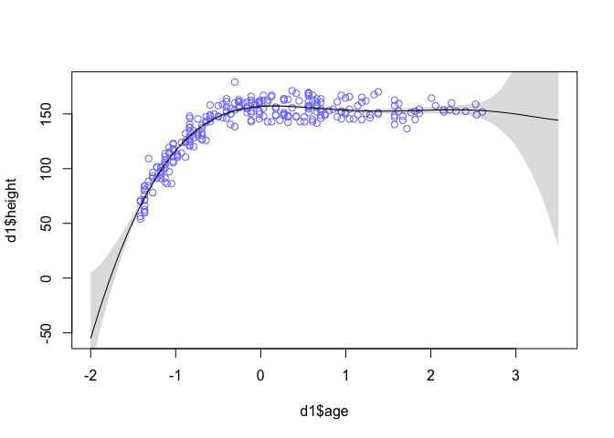

# Chapter 6 part 1

_Julin Maloof_


```r
knitr::opts_chunk$set(cache=TRUE,autodep = TRUE)
```


## 6E1

The three motivating criteria for information entropy are:

1. The scale should be continuous such that small changes in probability don't result in jumps in our measure of uncertainty.
2. Uncertainty should increase as the number of possible outcome increases.  This makes sense because if there are more choices it is of course less certain which one will happen.
3. Uncertainty should be additive.  If there are different combinations of outcomes the uncertainty associated with their combinations should be the sum of the uncertainty of each outcome.

## 6E2

_What is the entropy of a coin that is 70% Heads?_


```r
probs <- c(.7,.3)
-sum(probs*log(probs))
```

```
## [1] 0.6108643
```

## 6E3

_A four sided die with probs 20%, 25%, 25%, 30%.  What is the entropy?_


```r
probs <- c(.2,.25,.25,.3)
-sum(probs*log(probs))
```

```
## [1] 1.376227
```

## 6E4

_What is the enrtopy of a four-sided die where the fourth side never shows and the other three are equal_


```r
probs <- rep(1/3,3)
-sum(probs*log(probs))
```

```
## [1] 1.098612
```

## 6M1

_Write down and compare the defintions of AIC, DIC, and WAIC.  Which one is most general?  Which assumptions are required to transform a more general criteria into a less general one?_

AIC is the training training deviance + 2 * the number of parameters in the model

DIC is average training Deviance across the posterior + the difference between the average training deviance and the deviance calculate using the posterior mean.

WAIC is negative 2 times (the sum of the log average posterior likelihood of each observation minus the sum of the variance of average posterior likelihoods).

WAIC is most general, then DIC, then AIC.  DIC assumes that the posterior likelihood is multivariate Gaussian; AIC assumes this and the priors are uninformative.

## 6M2

Model selection is where you try to use information criteria to pick the one best model.  In model averaging you take the information across all the models, weighting it by the model's probability.  Model selection loses information about other possilbe outcomes.  I am not sure what is loss under model averaging.


## 6M3

_When comparing models with IC why must the same number of samples be used?_

Because these criteria all in some way sum likelihoods across samples.  So more samples means more deviance even for the same model.

### test it


```r
library(rethinking)
```

```
## Loading required package: rstan
```

```
## Loading required package: ggplot2
```

```
## Warning: package 'ggplot2' was built under R version 3.2.4
```

```
## rstan (Version 2.9.0-3, packaged: 2016-02-11 15:54:41 UTC, GitRev: 05c3d0058b6a)
```

```
## For execution on a local, multicore CPU with excess RAM we recommend calling
## rstan_options(auto_write = TRUE)
## options(mc.cores = parallel::detectCores())
```

```
## Loading required package: parallel
```

```
## rethinking (Version 1.58)
```

```r
data(cars)
m <- map(
  alist(
    dist ~ dnorm(mu,sigma),
    mu <- a + b*speed,
    a ~ dnorm(0,100),
    b ~ dnorm(0,10),
    sigma ~ dunif(0,30)
  ) , data=cars )
DIC(m)
```

```
## [1] 419.1978
## attr(,"pD")
## [1] 3.020238
```

```r
WAIC(m)
```

```
## Constructing posterior predictions
```

```
## [ 100 / 1000 ]
[ 200 / 1000 ]
[ 300 / 1000 ]
[ 400 / 1000 ]
[ 500 / 1000 ]
[ 600 / 1000 ]
[ 700 / 1000 ]
[ 800 / 1000 ]
[ 900 / 1000 ]
[ 1000 / 1000 ]
```

```
## [1] 420.4034
## attr(,"lppd")
## [1] -206.4979
## attr(,"pWAIC")
## [1] 3.703807
## attr(,"se")
## [1] 13.86629
```

```r
cars.small <- cars[sample(1:nrow(cars),25,replace=FALSE),]

m.small <- map(
  alist(
    dist ~ dnorm(mu,sigma),
    mu <- a + b*speed,
    a ~ dnorm(0,100),
    b ~ dnorm(0,10),
    sigma ~ dunif(0,30)
  ) , data=cars.small )
DIC(m.small)
```

```
## [1] 212.4884
## attr(,"pD")
## [1] 3.326845
```

```r
WAIC(m.small)
```

```
## Constructing posterior predictions
```

```
## [ 100 / 1000 ]
[ 200 / 1000 ]
[ 300 / 1000 ]
[ 400 / 1000 ]
[ 500 / 1000 ]
[ 600 / 1000 ]
[ 700 / 1000 ]
[ 800 / 1000 ]
[ 900 / 1000 ]
[ 1000 / 1000 ]
```

```
## [1] 214.4959
## attr(,"lppd")
## [1] -102.8871
## attr(,"pWAIC")
## [1] 4.36085
## attr(,"se")
## [1] 13.07232
```

Yes, reducing sample size reduced DIC and WAIC

## 6M4 

_What happens to the effective number of parameters in WAIC and DIC as the prior becomes more concentrated?_ 

The effective number of parameters will decrease

test it

```r
m.narrow <- map(
  alist(
    dist ~ dnorm(mu,sigma),
    mu <- a + b*speed,
    a ~ dnorm(0,10),
    b ~ dnorm(0,1),
    sigma ~ dunif(0,30)
  ) , data=cars )
attr(DIC(m),"pD")
```

```
## [1] 3.08813
```

```r
attr(DIC(m.narrow),"pD")
```

```
## [1] 2.766978
```

```r
attr(WAIC(m),"pWAIC")
```

```
## Constructing posterior predictions
```

```
## [ 100 / 1000 ]
[ 200 / 1000 ]
[ 300 / 1000 ]
[ 400 / 1000 ]
[ 500 / 1000 ]
[ 600 / 1000 ]
[ 700 / 1000 ]
[ 800 / 1000 ]
[ 900 / 1000 ]
[ 1000 / 1000 ]
```

```
## [1] 3.848396
```

```r
attr(WAIC(m.narrow),"pWAIC")
```

```
## Constructing posterior predictions
```

```
## [ 100 / 1000 ]
[ 200 / 1000 ]
[ 300 / 1000 ]
[ 400 / 1000 ]
[ 500 / 1000 ]
[ 600 / 1000 ]
[ 700 / 1000 ]
[ 800 / 1000 ]
[ 900 / 1000 ]
[ 1000 / 1000 ]
```

```
## [1] 3.813057
```

does it matter what the mean of the priors is?


```r
m.narrow1 <- map(
  alist(
    dist ~ dnorm(mu,sigma),
    mu <- a + b*speed,
    a ~ dnorm(-17,10),
    b ~ dnorm(4,1),
    sigma ~ dunif(0,30)
  ) , data=cars )
attr(DIC(m),"pD")
```

```
## [1] 3.153473
```

```r
attr(DIC(m.narrow),"pD")
```

```
## [1] 2.873543
```

```r
attr(DIC(m.narrow1),"pD")
```

```
## [1] 2.482848
```

```r
attr(WAIC(m),"pWAIC")
```

```
## Constructing posterior predictions
```

```
## [ 100 / 1000 ]
[ 200 / 1000 ]
[ 300 / 1000 ]
[ 400 / 1000 ]
[ 500 / 1000 ]
[ 600 / 1000 ]
[ 700 / 1000 ]
[ 800 / 1000 ]
[ 900 / 1000 ]
[ 1000 / 1000 ]
```

```
## [1] 4.350523
```

```r
attr(WAIC(m.narrow),"pWAIC")
```

```
## Constructing posterior predictions
```

```
## [ 100 / 1000 ]
[ 200 / 1000 ]
[ 300 / 1000 ]
[ 400 / 1000 ]
[ 500 / 1000 ]
[ 600 / 1000 ]
[ 700 / 1000 ]
[ 800 / 1000 ]
[ 900 / 1000 ]
[ 1000 / 1000 ]
```

```
## [1] 3.925328
```

```r
attr(WAIC(m.narrow1),"pWAIC")
```

```
## Constructing posterior predictions
```

```
## [ 100 / 1000 ]
[ 200 / 1000 ]
[ 300 / 1000 ]
[ 400 / 1000 ]
[ 500 / 1000 ]
[ 600 / 1000 ]
[ 700 / 1000 ]
[ 800 / 1000 ]
[ 900 / 1000 ]
[ 1000 / 1000 ]
```

```
## [1] 3.738695
```

not so much

## 6M5

_provide an informal explanation of why informative priors reduce overfitting_

Because they are less likely to be influenced by the particulars of the training set.

## 6M6

_provide an informal explanation of why overly informative priors may cause underfitting_

Because they coefficients are too constrained and may not adequately fit the data.


## 6H1


```r
library(rethinking)
data(Howell1)
d <- Howell1
d$age <- (d$age - mean(d$age))/sd(d$age)
head(d)
```

```
##    height   weight       age male
## 1 151.765 47.82561 1.6222002    1
## 2 139.700 36.48581 1.6222002    0
## 3 136.525 31.86484 1.7186002    0
## 4 156.845 53.04191 0.5618002    1
## 5 145.415 41.27687 1.0438002    0
## 6 163.830 62.99259 0.2726002    1
```

```r
set.seed( 1000 )
i <- sample(1:nrow(d),size=nrow(d)/2)
d1 <- d[ i , ]
d2 <- d[ -i , ]

M1 <- map(alist(
  height ~ dnorm(mu, sigma),
  mu <- a + b1*age,
  a ~ dnorm(mean(height),50),
  b1 ~ dnorm(0,20),
  sigma ~ dunif(0,50)),
  data=d1)
precis(M1)
```

```
##         Mean StdDev   5.5%  94.5%
## a     138.45   1.18 136.55 140.34
## b1     18.59   1.19  16.68  20.49
## sigma  19.54   0.84  18.20  20.88
```

```r
M2 <- map(alist(
  height ~ dnorm(mu, sigma),
  mu <- a + b1*age +b2*age^2,
  a ~ dnorm(mean(height),50),
  c(b1, b2) ~ dnorm(0,20),
  sigma ~ dunif(0,50)),
  data=d1)
precis(M2)
```

```
##         Mean StdDev   5.5%  94.5%
## a     152.35   1.02 150.72 153.98
## b1     25.74   0.84  24.40  27.07
## b2    -14.08   0.70 -15.19 -12.96
## sigma  12.38   0.53  11.53  13.23
```

```r
M3 <- map(alist(
  height ~ dnorm(mu, sigma),
  mu <- a + b1*age + b2*age^2 +b3*age^3,
  a ~ dnorm(mean(height),50),
  c(b1,b2,b3) ~ dnorm(0,20),
  sigma ~ dunif(0,50)),
  data=d1)
precis(M3)
```

```
##         Mean StdDev   5.5%  94.5%
## a     158.09   0.78 156.83 159.34
## b1     11.36   1.02   9.73  12.99
## b2    -24.08   0.76 -25.29 -22.87
## b3      8.07   0.47   7.31   8.82
## sigma   8.59   0.37   8.00   9.18
```

```r
M4 <- map(alist(
  height ~ dnorm(mu, sigma),
  mu <- a + b1*age + b2*age^2 + b3*age^3 + b4*age^4,
  a ~ dnorm(mean(height),50),
  c(b1,b2,b3,b4) ~ dnorm(0,20),
  sigma ~ dunif(0,50)),
  data=d1)
precis(M4)
```

```
##         Mean StdDev   5.5%  94.5%
## a     156.66   0.79 155.40 157.93
## b1      5.94   1.39   3.72   8.17
## b2    -19.23   1.15 -21.06 -17.39
## b3     12.36   0.91  10.91  13.81
## b4     -2.32   0.43  -3.00  -1.64
## sigma   8.17   0.35   7.61   8.73
```

```r
M5 <- map(alist(
  height ~ dnorm(mu, sigma),
  mu <- a + b1*age + b2*age^2 + b3*age^3 + b4*age^4 + b5*age^5,
  a ~ dnorm(mean(height),50),
  c(b1,b2,b3,b4,b5) ~ dnorm(0,20),
  sigma ~ dunif(0,50)),
  data=d1)
precis(M5)
```

```
##         Mean StdDev   5.5%  94.5%
## a     156.90   0.92 155.43 158.37
## b1      5.71   1.47   3.36   8.06
## b2    -20.26   2.35 -24.02 -16.50
## b3     12.79   1.25  10.79  14.78
## b4     -1.81   1.10  -3.57  -0.05
## b5     -0.21   0.41  -0.87   0.45
## sigma   8.16   0.35   7.60   8.72
```

```r
M6 <- map(alist(
  height ~ dnorm(mu, sigma),
  mu <- a + b1*age + b2*age^2 + b3*age^3 + b4*age^4 + b5*age^5 + b6*age^6,
  a ~ dnorm(mean(height),50),
  c(b1,b2,b3,b4,b5,b6) ~ dnorm(0,20),
  sigma ~ dunif(0,50)),
  data=d1)
precis(M6)
```

```
##         Mean StdDev   5.5%  94.5%
## a     156.89   0.92 155.43 158.36
## b1      3.71   2.25   0.11   7.31
## b2    -19.96   2.36 -23.73 -16.19
## b3     16.60   3.50  11.01  22.19
## b4     -2.65   1.32  -4.75  -0.55
## b5     -1.64   1.29  -3.71   0.43
## b6      0.48   0.41  -0.18   1.13
## sigma   8.14   0.35   7.58   8.69
```

```r
(model.comp <- compare(M1,M2,M3,M4,M5,M6))
```

```
##      WAIC pWAIC dWAIC weight    SE   dSE
## M4 1926.0   5.6   0.0   0.56 25.45    NA
## M5 1927.4   6.4   1.4   0.28 25.33  0.92
## M6 1928.5   7.7   2.5   0.16 25.08  2.53
## M3 1952.3   5.4  26.3   0.00 24.19 10.85
## M2 2150.0   5.3 224.0   0.00 22.64 26.70
## M1 2395.4   3.4 469.4   0.00 23.00 31.04
```

```r
plot(model.comp)
```


  
The 4, 5, and 6 factor models perform similarly by WAIC and each carry a substatial proportion of the weight.  The simpler models perform much less well.

## 6H2


```r
range(d1$age)

pred.df <- data.frame(age=seq(-2,3.5,length.out=50))

for(model in ls(pattern="^M[1-6]$")) {
  pred.M <- link(get(model),data=pred.df)
  mu <- apply(pred.M,2,mean)
  mu.PI <- apply(pred.M,2,PI,prob=0.97)
  print(plot(d1$height~d1$age,xlim=range(pred.df$age),ylim=range(c(mu,d1$height)),main=model,col=rangi2))
  print(lines(mu ~ pred.df$age))
  print(lines(mu.PI[1,] ~ pred.df$age,lty=2))
  print(lines(mu.PI[2,] ~ pred.df$age,lty=2))
}
```


M1 does a poor job fitting the actual data throughout its range.  
M2 is better through much of the data but does poorly at both ends.  
M3 does well, but perhaps a bit too much of a dip at older ages and quickly goes off range as soon as age increases beyond the observations
M4 - M6 all fit the observations nicely.  M4 has the added bonus of being stable for a bit longer after age extends beyond our observations.

## 6H3


```r
height.ensemble <- ensemble(M1,M2,M3,M4,M5,M6,data = pred.df)
```

```
## Constructing posterior predictions
## Constructing posterior predictions
## Constructing posterior predictions
## Constructing posterior predictions
## Constructing posterior predictions
## Constructing posterior predictions
```

```r
mu <- apply(height.ensemble$link,2,mean)    
mu.PI <- apply(height.ensemble$link,2,PI)
plot(d1$height~d1$age,xlim=range(pred.df$age),ylim=range(c(d1$height,mu)),col=rangi2)
lines(mu ~ pred.df$age)
shade(mu.PI,pred.df$age)
```



So the nice thing about this is that the predictions do not go haywire once we are out of the observed range.

## 6H4


```r
models <- ls(pattern="^M[1-6]$")
test.dev <- sapply(models,function(m) {
  model <- get(m)
  input <- as.list(coef(model))
  input$age <- d2$age
  equation <- model@links[[1]][[2]]
  mu <- eval(parse(text=equation),envir = input)
  dev <- -2*sum(dnorm(d2$height,mu,input$sigma,log=T))
  dev
})

test.dev
```

```
##       M1       M2       M3       M4       M5       M6 
## 2422.144 2137.620 1932.263 1876.463 1877.858 1877.040
```

## 6H5

```r
model.WAIC <- sapply(models,function(m) {
  WAIC(get(m))
})
```

```
## Constructing posterior predictions
```

```
## [ 100 / 1000 ]
[ 200 / 1000 ]
[ 300 / 1000 ]
[ 400 / 1000 ]
[ 500 / 1000 ]
[ 600 / 1000 ]
[ 700 / 1000 ]
[ 800 / 1000 ]
[ 900 / 1000 ]
[ 1000 / 1000 ]
```

```
## Constructing posterior predictions
```

```
## [ 100 / 1000 ]
[ 200 / 1000 ]
[ 300 / 1000 ]
[ 400 / 1000 ]
[ 500 / 1000 ]
[ 600 / 1000 ]
[ 700 / 1000 ]
[ 800 / 1000 ]
[ 900 / 1000 ]
[ 1000 / 1000 ]
```

```
## Constructing posterior predictions
```

```
## [ 100 / 1000 ]
[ 200 / 1000 ]
[ 300 / 1000 ]
[ 400 / 1000 ]
[ 500 / 1000 ]
[ 600 / 1000 ]
[ 700 / 1000 ]
[ 800 / 1000 ]
[ 900 / 1000 ]
[ 1000 / 1000 ]
```

```
## Constructing posterior predictions
```

```
## [ 100 / 1000 ]
[ 200 / 1000 ]
[ 300 / 1000 ]
[ 400 / 1000 ]
[ 500 / 1000 ]
[ 600 / 1000 ]
[ 700 / 1000 ]
[ 800 / 1000 ]
[ 900 / 1000 ]
[ 1000 / 1000 ]
```

```
## Constructing posterior predictions
```

```
## [ 100 / 1000 ]
[ 200 / 1000 ]
[ 300 / 1000 ]
[ 400 / 1000 ]
[ 500 / 1000 ]
[ 600 / 1000 ]
[ 700 / 1000 ]
[ 800 / 1000 ]
[ 900 / 1000 ]
[ 1000 / 1000 ]
```

```
## Constructing posterior predictions
```

```
## [ 100 / 1000 ]
[ 200 / 1000 ]
[ 300 / 1000 ]
[ 400 / 1000 ]
[ 500 / 1000 ]
[ 600 / 1000 ]
[ 700 / 1000 ]
[ 800 / 1000 ]
[ 900 / 1000 ]
[ 1000 / 1000 ]
```

```r
model.WAIC
```

```
##       M1       M2       M3       M4       M5       M6 
## 2395.662 2150.271 1953.023 1926.019 1927.787 1928.279
```

```r
knitr::kable(rbind("Test Deviance"=test.dev-min(test.dev),"WAIC"=model.WAIC-min(model.WAIC)),digits=2)
```

                     M1       M2     M3   M4     M5     M6
--------------  -------  -------  -----  ---  -----  -----
Test Deviance    545.68   261.16   55.8    0   1.39   0.58
WAIC             469.64   224.25   27.0    0   1.77   2.26

Overall the WAIC does a good job of estimating the test deviance, especially for the purpose of model comparisoins.  In both cases M4,5,and 6 have similar scores.  Test deviance is relatively greater for the simpler models M1, M2 and M3, but  in terms of choosing a model we would get similar results from these two methods.

## 6H7

Fit the model

```r
M7 <- map(alist(
  height ~ dnorm(mu, sigma),
  mu <- a + b1*age + b2*age^2 + b3*age^3 + b4*age^4 + b5*age^5 + b6*age^6,
  a ~ dnorm(mean(height),50),
  c(b1,b2,b3,b4,b5,b6) ~ dnorm(0,5),
  sigma ~ dunif(0,50)),
  data=d1)
```

plot predictions

```r
pred.df <- data.frame(age=seq(-2,3.5,length.out=50))
pred.M7 <- link(M7,pred.df)
```

```
## [ 100 / 1000 ]
[ 200 / 1000 ]
[ 300 / 1000 ]
[ 400 / 1000 ]
[ 500 / 1000 ]
[ 600 / 1000 ]
[ 700 / 1000 ]
[ 800 / 1000 ]
[ 900 / 1000 ]
[ 1000 / 1000 ]
```

```r
mu <- apply(pred.M7,2,mean)
mu.PI <- apply(pred.M7,2,PI)
plot(d1$height~d1$age,xlim=range(pred.df$age),ylim=range(c(mu,d1$height)),main="M7",col=rangi2)
lines(mu ~ pred.df$age)
lines(mu.PI[1,] ~ pred.df$age,lty=2)
lines(mu.PI[2,] ~ pred.df$age,lty=2)
```


Similar to M6 but does not diverge as much at off-scale age

Compare to the model with more relaxed priors (M6)

```r
coeftab(M6,M7)
```

```
##       M6      M7     
## a      156.89  155.85
## b1       3.71    5.97
## b2     -19.96  -16.59
## b3      16.60   12.09
## b4      -2.65   -3.51
## b5      -1.64    0.23
## b6       0.48    0.05
## sigma    8.14    8.20
## nobs      272     272
```

```r
plot(coeftab(M6,M7))
```


We see that the b5 and b6 coefficients are closer to 0 in the model with more regularizing priors.

compute test deviance

```r
input <- as.list(coef(M7))
input$age <- d2$age
equation <- M7@links[[1]][[2]]
mu <- eval(parse(text=equation),envir = input)
dev <- -2*sum(dnorm(d2$height,mu,input$sigma,log=T))
dev
```

```
## [1] 1875.45
```

```r
test.dev
```

```
##       M1       M2       M3       M4       M5       M6 
## 2422.144 2137.620 1932.263 1876.463 1877.858 1877.040
```

This model does slightly better than the best WAIC model with less informative priors.
