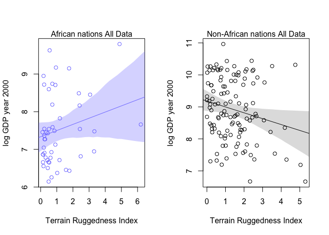
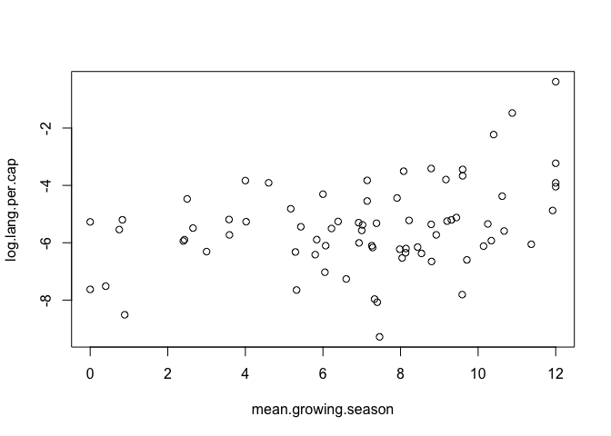
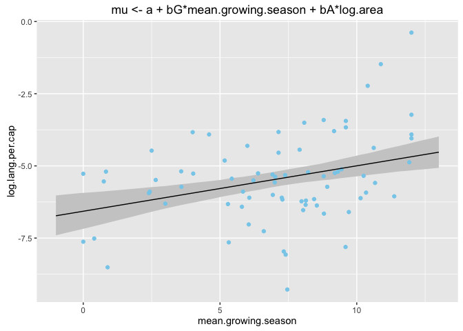
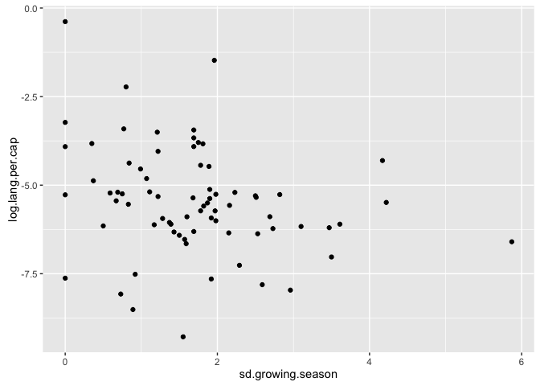

# Chapter_7


## 7E1
_For each of the causal relationships below, name a hypothetical third variable that would lead to an interaction effect._

(1) _Bread Dough rises because of yeast._  
Interaction: the amount of salt in the dough (because salt inhibits yeast activity).

(2) _Education leads to higher income._  
Possible interactions: country, ethnicity, field of study

(3) _Gasline makes a car go._  
Interactions: Battery; whether or not car is started.

## 7E2
_Which of the following explanations invokes an interaction_

(1) _Carmelizing onions requires cooking over low heat and making sure the onions do not dry out._  
interaction between heat and moisture content.  low heat only works if they are also moist, and vice versa.

(2) _A car will go faster when it has more cylinders or when it has a bettor fuel injector_
Can't decide.  Maybe these are additive?  But the or implies, not; more cylinders won't matter if it already has a fuel injector?

(3) _Most people aquire their political beliefs from their parents, unless they get them instead from their friends._  
No interaction implied

(4) _Intelligent animal species tend to be either highly social or have manipulative appendages._  
Like (2) I am really not sure here.  

## 7E3
_Write a linear model that expresses the relationsihps for each explantion in 7E2_

(1) Carmelization ~ Intercept + heat + moisture + heat:moisture

(2) Speed ~ intercept + cylinders + innjectors + cylinders:injectors

(3) Beliefs ~ source

(4) Intelligence ~ intercept + appendages + social + appendages:social

## 7M1
_No tulips bloom at high temperature.  Explain._

Temperature inhibits blooming at all water and shade conditions

## 7M2
_Invent a regression equation for above_

blooms ~ Intercept + water * shade * cool

where cool=1 in cool temperatures and 0 at warm temps.  Intercept would have to be zero (Take it away?)

## 7M3
_In some parts of North America, ravens depends on wolves for food.  Species interaction.  invent a hypothetical set of data.  Linear?  why or why not_

Hmmm... I don't see the interaction here.  From the information given isn't it just Ravens ~ wolves?  But I guess not becuase "in some parts of the country"  Still not sure what to do here.  Model is something like

Ravens ~ Intercept + wolves + region + wolves:region

## 7H1
_Return to the tulip data set and include `bed` as a variable in the modle_


```r
library(rethinking)
```

```
## Loading required package: rstan
```

```
## Loading required package: ggplot2
```

```
## rstan (Version 2.9.0-3, packaged: 2016-02-11 15:54:41 UTC, GitRev: 05c3d0058b6a)
```

```
## For execution on a local, multicore CPU with excess RAM we recommend calling
## rstan_options(auto_write = TRUE)
## options(mc.cores = parallel::detectCores())
```

```
## Loading required package: parallel
```

```
## rethinking (Version 1.58)
```

```r
data("tulips")
head(tulips)
```

```
##   bed water shade blooms
## 1   a     1     1   0.00
## 2   a     1     2   0.00
## 3   a     1     3 111.04
## 4   a     2     1 183.47
## 5   a     2     2  59.16
## 6   a     2     3  76.75
```

```r
tulips$bed_id <- coerce_index(tulips$bed)

tulips$shade.c <- tulips$shade - mean(tulips$shade)
tulips$water.c <- tulips$water - mean(tulips$water)

#I set up a loop to allow the map() call to be made repeatedly until a fit is made.  Needed because randomly chosen start values may not allow model convergence.
m7h1 <- NULL
while(is.null(m7h1) | class(m7h1)=="try-error") {
  m7h1 <- try( #catch the error if fit doesn't work
    map(
      alist(
        blooms ~ dnorm(mu, sigma),
        mu <- a[bed_id] + bW*water.c + bS*shade.c + bWS*water.c*shade.c,
        a[bed_id] ~ dnorm(mean(tulips$bloom),50),
        c(bW,bS,bWS) ~ dnorm(0,100),
        sigma ~ dunif(0,100)),
      data=tulips,
      control=list(maxit=1000)
    )
  )
}
```


## 7H2
_Compare tulip bloom models with and without bed.  Is the WAIC result consistent with the posterior distribution of coefficients?_


```r
m7h2 <- NULL
while(is.null(m7h2) | class(m7h2)=="try-error") {
  m7h2 <- try(
    map(
      alist(
        blooms ~ dnorm(mu, sigma),
        mu <- a + bW*water.c + bS*shade.c + bWS*water.c*shade.c,
        a ~ dnorm(mean(tulips$bloom),sd(tulips$blooms)),
        c(bW,bS,bWS) ~ dnorm(0,100),
        sigma ~ dunif(0,100)),
      data=tulips,
      #start=list(a=100,bW=0,bS=0,bWS=0,sigma=sd(tulips$blooms)),
      control=list(maxit=1000)
    )
  )
}


precis(m7h1,depth=2)
```

```
##         Mean StdDev   5.5%  94.5%
## a[1]   99.16  12.66  78.94 119.39
## a[2]  141.71  12.65 121.50 161.93
## a[3]  146.11  12.65 125.89 166.32
## bW     75.16   9.20  60.45  89.87
## bS    -41.25   9.20 -55.96 -26.55
## bWS   -52.18  11.25 -70.15 -34.20
## sigma  39.21   5.34  30.67  47.75
```

```r
precis(m7h2)
```

```
##         Mean StdDev   5.5%  94.5%
## a     128.95   8.67 115.09 142.81
## bW     74.95  10.61  57.99  91.90
## bS    -41.13  10.61 -58.09 -24.18
## bWS   -51.89  12.96 -72.59 -31.18
## sigma  45.25   6.16  35.40  55.10
```

```r
compare(m7h1,m7h2)
```

```
##       WAIC pWAIC dWAIC weight    SE  dSE
## m7h1 294.4   9.6     0   0.62  9.98   NA
## m7h2 295.4   6.2     1   0.38 10.16 7.84
```

The model with the bed information has the lower WAIC, although not by much.  But it makes sense because the mean of each bed is pretty different.  We also see that sigma is lower in the first model.

## 7H3
_Drop Seycelles from the rugged vs GDP analysis.  Does Africa still have an opposite relationship?_

**A** _fit ineraction model with and without Seychelles and compare_


```r
data(rugged)
rugged$log_gdp <- log(rugged$rgdppc_2000)

dd <- rugged[ complete.cases(rugged$rgdppc_2000) , ]

m7h3full <- NULL
while(is.null(m7h3full) | class(m7h3full)=="try-error") {
  m7h3full <- try(
    map(
      alist(
        log_gdp ~ dnorm( mu , sigma ) ,
        mu <- a + bR*rugged + bAR*rugged*cont_africa + bA*cont_africa,
        a ~ dnorm( 8 , 100 ) ,
        bA ~ dnorm( 0 , 1 ) ,
        bR ~ dnorm( 0 , 1 ) ,
        bAR ~ dnorm( 0 , 1 ) ,
        sigma ~ dunif( 0 , 10 )
      ), data=dd )
  )
}

dd.small <- dd[dd$country!="Seychelles",]

m7h3small <- NULL
while(is.null(m7h3small) | class(m7h3small)=="try-error") {
  m7h3small <- try(
    map(
      alist(
        log_gdp ~ dnorm( mu , sigma ) ,
        mu <- a + bR*rugged + bAR*rugged*cont_africa + bA*cont_africa,
        a ~ dnorm( 8 , 100 ) ,
        bA ~ dnorm( 0 , 1 ) ,
        bR ~ dnorm( 0 , 1 ) ,
        bAR ~ dnorm( 0 , 1 ) ,
        sigma ~ dunif( 0 , 10 )
      ), data=dd.small )
  )
}
precis(m7h3full)
```

```
##        Mean StdDev  5.5% 94.5%
## a      9.18   0.14  8.97  9.40
## bA    -1.85   0.22 -2.20 -1.50
## bR    -0.18   0.08 -0.31 -0.06
## bAR    0.35   0.13  0.14  0.55
## sigma  0.93   0.05  0.85  1.01
```

```r
precis(m7h3small)
```

```
##        Mean StdDev  5.5% 94.5%
## a      9.19   0.14  8.97  9.40
## bA    -1.78   0.22 -2.13 -1.43
## bR    -0.19   0.08 -0.31 -0.07
## bAR    0.25   0.14  0.04  0.47
## sigma  0.93   0.05  0.85  1.01
```

Without Seychelles the interaction effect is smaller but it is still positive and the 89% confidence intervals are above 0.  Thus it does still seem that the effect of ruggedness on GDP depends on the continent.

**B** _Plot the predictions of the interaction model, with and without Seychelles._

Plot predictons, full model

```r
rugged.seq <- seq(from=-1,to=8,by=0.25)
mu.Africa <- link( m7h3full , data=data.frame(cont_africa=1,rugged=rugged.seq),refresh=0 )
mu.Africa.mean <- apply( mu.Africa , 2 , mean )
mu.Africa.PI <- apply( mu.Africa , 2 , PI , prob=0.97 )
mu.NotAfrica <- link( m7h3full , data=data.frame(cont_africa=0,rugged=rugged.seq),refresh=0 )
mu.NotAfrica.mean <- apply( mu.NotAfrica , 2 , mean )
mu.NotAfrica.PI <- apply( mu.NotAfrica , 2 , PI , prob=0.97 )

# plot African nations with regression
op <- par(mfrow=c(1,2))
d.A1 <- dd[dd$cont_africa==1,]
plot( log(rgdppc_2000) ~ rugged , data=d.A1 ,
      col=rangi2 , ylab="log GDP year 2000" ,
      xlab="Terrain Ruggedness Index" )
mtext( "African nations All Data" , 3 )
lines( rugged.seq , mu.Africa.mean , col=rangi2 )
shade( mu.Africa.PI , rugged.seq , col=col.alpha(rangi2,0.3) )
# plot non-African nations with regression
d.A0 <- dd[dd$cont_africa==0,]
plot( log(rgdppc_2000) ~ rugged , data=d.A0 ,
      col="black" , ylab="log GDP year 2000" ,
      xlab="Terrain Ruggedness Index" )
mtext( "Non-African nations All Data" , 3 )
lines( rugged.seq , mu.NotAfrica.mean )
shade( mu.NotAfrica.PI , rugged.seq )
```



now plot from smaller model

```r
op <- par(mfrow=c(1,2))
rugged.seq <- seq(from=-1,to=8,by=0.25)
mu.Africa <- link( m7h3small , data=data.frame(cont_africa=1,rugged=rugged.seq),refresh=0 )
mu.Africa.mean <- apply( mu.Africa , 2 , mean )
mu.Africa.PI <- apply( mu.Africa , 2 , PI , prob=0.97 )
mu.NotAfrica <- link( m7h3small , data=data.frame(cont_africa=0,rugged=rugged.seq),refresh=0 )
mu.NotAfrica.mean <- apply( mu.NotAfrica , 2 , mean )
mu.NotAfrica.PI <- apply( mu.NotAfrica , 2 , PI , prob=0.97 )

# plot African nations with regression
d.A1.small <- dd.small[dd.small$cont_africa==1,]
plot( log(rgdppc_2000) ~ rugged , data=d.A1.small ,
      col=rangi2 , ylab="log GDP year 2000" ,
      xlab="Terrain Ruggedness Index" )
mtext( "African nations no Seychelles" , 3 )
lines( rugged.seq , mu.Africa.mean , col=rangi2 )
shade( mu.Africa.PI , rugged.seq , col=col.alpha(rangi2,0.3) )
# plot non-African nations with regression
d.A0.small <- dd.small[dd.small$cont_africa==0,]
plot( log(rgdppc_2000) ~ rugged , data=d.A0.small ,
      col="black" , ylab="log GDP year 2000" ,
      xlab="Terrain Ruggedness Index" )
mtext( "Non-African nations no Seychelles" , 3 )
lines( rugged.seq , mu.NotAfrica.mean )
shade( mu.NotAfrica.PI , rugged.seq )
```


```r
par(op)
```

**(C)** _Fit 3 models to the data without Seychelles and conduct a model comparison.  Ploy the model-averaged predictions of the model set.  Does this change inferences relatvie to part B?_


```r
m7h3small.R <- NULL
while(is.null(m7h3small.R) | class(m7h3small.R)=="try-error") {
  m7h3small.R <- try(
    map(
      alist(
        log_gdp ~ dnorm( mu , sigma ) ,
        mu <- a + bR*rugged,
        a ~ dnorm( 8 , 100 ) ,
        bR ~ dnorm( 0 , 1 ) ,
        sigma ~ dunif( 0 , 10 )
      ), data=dd.small )
  )
}

m7h3small.R.A <- NULL
while(is.null(m7h3small.R.A) | class(m7h3small.R.A)=="try-error") {
  m7h3small.R.A <- try(
    map(
      alist(
        log_gdp ~ dnorm( mu , sigma ) ,
        mu <- a + bR*rugged + bA*cont_africa,
        a ~ dnorm( 8 , 100 ) ,
        bA ~ dnorm( 0 , 1 ) ,
        bR ~ dnorm( 0 , 1 ) ,
        sigma ~ dunif( 0 , 10 )
      ), data=dd.small )
  )
}

compare(m7h3small,m7h3small.R,m7h3small.R.A)
```

```
##                WAIC pWAIC dWAIC weight    SE   dSE
## m7h3small     463.5   4.7   0.0   0.79 15.14    NA
## m7h3small.R.A 466.1   3.9   2.6   0.21 14.23  3.53
## m7h3small.R   536.1   2.7  72.6   0.00 13.46 15.39
```

```r
plot(compare(m7h3small,m7h3small.R,m7h3small.R.A))
```


The interaction model is still the best, but not by as much.

Plot predictions:


```r
op <- par(mfrow=c(1,2))
rugged.seq <- seq(from=-1,to=8,by=0.25)
mu.Africa <- ensemble( m7h3small,m7h3small.R,m7h3small.R.A , data=data.frame(cont_africa=1,rugged=rugged.seq),refresh=0 )
```

```
## Constructing posterior predictions
## Constructing posterior predictions
## Constructing posterior predictions
```

```r
mu.Africa.mean <- apply( mu.Africa$link , 2 , mean )
mu.Africa.PI <- apply( mu.Africa$link , 2 , PI , prob=0.97 )
mu.NotAfrica <- ensemble( m7h3small,m7h3small.R,m7h3small.R.A , data=data.frame(cont_africa=0,rugged=rugged.seq),refresh=0 )
```

```
## Constructing posterior predictions
## Constructing posterior predictions
## Constructing posterior predictions
```

```r
mu.NotAfrica.mean <- apply( mu.NotAfrica$link , 2 , mean )
mu.NotAfrica.PI <- apply( mu.NotAfrica$link , 2 , PI , prob=0.97 )

# plot African nations with regression
d.A1.small <- dd.small[dd.small$cont_africa==1,]
plot( log(rgdppc_2000) ~ rugged , data=d.A1.small ,
      col=rangi2 , ylab="log GDP year 2000" ,
      xlab="Terrain Ruggedness Index" )
mtext( "African nations no Seychelles" , 3 )
lines( rugged.seq , mu.Africa.mean , col=rangi2 )
shade( mu.Africa.PI , rugged.seq , col=col.alpha(rangi2,0.3) )
# plot non-African nations with regression
d.A0.small <- dd.small[dd.small$cont_africa==0,]
plot( log(rgdppc_2000) ~ rugged , data=d.A0.small ,
      col="black" , ylab="log GDP year 2000" ,
      xlab="Terrain Ruggedness Index" )
mtext( "Non-African nations no Seychelles" , 3 )
lines( rugged.seq , mu.NotAfrica.mean )
shade( mu.NotAfrica.PI , rugged.seq )
```


```r
par(op)
```


## 7H4

_Evaluate the relationship between language diversity and food security_

```r
data(nettle)
nettle$lang.per.cap <- nettle$num.lang / nettle$k.pop
nettle$log.lang.per.cap <- log(nettle$lang.per.cap)
```

**(A)** _length of growing season_

Look at some plots of the data

```r
library(ggplot2)
plot(log.lang.per.cap ~ mean.growing.season, data=nettle) #looks like positive association
```



```r
plot(log.lang.per.cap ~ log(area), data=nettle) #looks like no association
```


```r
plot(mean.growing.season ~ log(area), data=nettle) # negative assocaition?
```


Fit a model with `mean.growing.season` as a predictor


```r
m.grow <- NULL
while(is.null(m.grow) | class(m.grow)=="try-error") {
  m.grow <- try(
    map(
      alist(log.lang.per.cap ~ dnorm(mu, sigma),
            mu <- a + bG*mean.growing.season,
            a ~ dnorm(mean(log.lang.per.cap), sd(log.lang.per.cap)),
            bG ~ dnorm(0,5),
            sigma ~ dunif(0,50)),
      data=nettle)
  )
}

precis(m.grow)
```

```
##        Mean StdDev  5.5% 94.5%
## a     -6.60   0.39 -7.23 -5.98
## bG     0.16   0.05  0.08  0.25
## sigma  1.41   0.12  1.22  1.60
```

```r
grow.seq <- seq(-1,13,length.out = 50)
pred.df <- data.frame(mean.growing.season=grow.seq)

mu.m.grow <- link(m.grow,data = pred.df,refresh=0)
pred.df$log.lang.per.cap <- apply(mu.m.grow,2,mean)
pred.df <- cbind(pred.df,t(apply(mu.m.grow,2,PI)))
colnames(pred.df) <- make.names(colnames(pred.df))
head(pred.df)
```

```
##   mean.growing.season log.lang.per.cap       X5.      X94.
## 1          -1.0000000        -6.779914 -7.466038 -6.057481
## 2          -0.7142857        -6.732559 -7.398491 -6.030749
## 3          -0.4285714        -6.685205 -7.326912 -6.005893
## 4          -0.1428571        -6.637851 -7.257837 -5.986292
## 5           0.1428571        -6.590497 -7.191936 -5.956959
## 6           0.4285714        -6.543142 -7.122367 -5.931443
```

```r
pl <- ggplot(data=NULL,aes(x=mean.growing.season,y=log.lang.per.cap))
pl <- pl + geom_ribbon(data=pred.df,aes(ymin=X5.,ymax=X94.),fill="gray80")
pl <- pl + geom_point(data=nettle,color="skyblue")
pl <- pl + geom_line(data=pred.df)
pl + ggtitle("mu <- a + bG*mean.growing.season")
```


This first model does a pretty nice job of fitting the data (although misses a bit at the high end).  At the 89% confidence intervals the coefficient for mean.growing.season is above 0.

Now fit a model that includes `log(area)` as a covariate


```r
nettle$log.area <- log(nettle$area)

m.grow.area <- NULL
while(is.null(m.grow.area) | class(m.grow.area)=="try-error") {
  m.grow.area <- try(
    map(
      alist(log.lang.per.cap ~ dnorm(mu, sigma),
            mu <- a + bG*mean.growing.season + bA*log.area,
            a ~ dnorm(mean(log.lang.per.cap), sd(log.lang.per.cap)),
            bG ~ dnorm(0,5),
            bA ~ dnorm(0,5),
            sigma ~ dunif(0,50)),
      data=nettle)
  )
}

precis(m.grow.area)
```

```
##        Mean StdDev  5.5% 94.5%
## a     -4.86   1.20 -6.78 -2.93
## bG     0.16   0.05  0.08  0.24
## bA    -0.13   0.09 -0.27  0.01
## sigma  1.39   0.11  1.21  1.57
```

```r
grow.seq <- seq(-1,13,length.out = 50)
pred.df <- data.frame(mean.growing.season=grow.seq,
                      log.area=mean(nettle$log.area))

mu.m.grow.area <- link(m.grow.area,data = pred.df,refresh=0)
pred.df$log.lang.per.cap <- apply(mu.m.grow.area,2,mean)
pred.df <- cbind(pred.df,t(apply(mu.m.grow.area,2,PI)))
colnames(pred.df) <- make.names(colnames(pred.df))

pl <- ggplot(data=NULL,aes(x=mean.growing.season,y=log.lang.per.cap))
pl <- pl + geom_ribbon(data=pred.df,aes(ymin=X5.,ymax=X94.),fill="gray80")
pl <- pl + geom_point(data=nettle,color="skyblue")
pl <- pl + geom_line(data=pred.df)
pl + ggtitle("mu <- a + bG*mean.growing.season + bA*log.area")
```



The fits look pretty similar.  The 89% confidence intervals just barely have the log.area coefficient < 0.  The estimate for the coefficient on growth are almost exactly the same in both models.

Next, compare modely using WAIC


```r
(compare.out <- compare(m.grow,m.grow.area))
```

```
##              WAIC pWAIC dWAIC weight    SE  dSE
## m.grow.area 267.3   4.4     0   0.62 15.59   NA
## m.grow      268.3   3.9     1   0.38 15.59 2.56
```

```r
plot(compare.out)
```


```r
coeftab(m.grow,m.grow.area)
```

```
##       m.grow  m.grow.area
## a       -6.60   -4.86    
## bG       0.16    0.16    
## sigma    1.41    1.39    
## bA         NA   -0.13    
## nobs       74      74
```

```r
plot(coeftab(m.grow,m.grow.area))
```


The coefficients in these models are similar except for the intercept, which is closer to 0 and more variable when log.area is included.  I'd be inclined to stick wtih the simpler model, although goes against the philosophy that McElreath advocates.

**(B)** _Now consider sd as a predictor_


```r
qplot(x=sd.growing.season,y=log.lang.per.cap,data=nettle) # possible negative correlation.
```



```r
m.sd <- NULL
while(is.null(m.sd) | class(m.sd)=="try-error") {
  m.sd <- try(
    map(
      alist(log.lang.per.cap ~ dnorm(mu, sigma),
            mu <- a + bS*sd.growing.season,
            a ~ dnorm(mean(log.lang.per.cap), sd(log.lang.per.cap)),
            bS ~ dnorm(0,5),
            sigma ~ dunif(0,50)),
      data=nettle)
  )
}

precis(m.sd)
```

```
##        Mean StdDev  5.5% 94.5%
## a     -4.87   0.31 -5.37 -4.37
## bS    -0.35   0.16 -0.60 -0.10
## sigma  1.46   0.12  1.27  1.65
```

```r
sd.seq <- seq(0,6.5,length.out = 50)
pred.df <- data.frame(sd.growing.season=sd.seq)

mu.m.sd <- link(m.sd,data = pred.df,refresh=0)
pred.df$log.lang.per.cap <- apply(mu.m.sd,2,mean)
pred.df <- cbind(pred.df,t(apply(mu.m.sd,2,PI)))
colnames(pred.df) <- make.names(colnames(pred.df))

pl <- ggplot(data=NULL,aes(x=sd.growing.season,y=log.lang.per.cap))
pl <- pl + geom_ribbon(data=pred.df,aes(ymin=X5.,ymax=X94.),fill="gray80")
pl <- pl + geom_point(data=nettle,color="skyblue")
pl <- pl + geom_line(data=pred.df)
pl + ggtitle("mu <- a + bS*sd.growing.season")
```


This  model does a pretty nice job of fitting the data (although there are pretty large residuals).  At the 89% confidence intervals the coefficient for sd.growing.season is below 0.

Now fit a model that includes `log(area)` as a covariate


```r
nettle$log.area <- log(nettle$area)
m.sd.area <- NULL
while(is.null(m.sd.area) | class(m.sd.area)=="try-error") {
  m.sd.area <- try(
    map(
      alist(log.lang.per.cap ~ dnorm(mu, sigma),
            mu <- a + bS*sd.growing.season + bA*log.area,
            a ~ dnorm(mean(log.lang.per.cap), sd(log.lang.per.cap)),
            bS ~ dnorm(0,5),
            bA ~ dnorm(0,5),
            sigma ~ dunif(0,50)),
      data=nettle)
  )
}

precis(m.sd.area)
```

```
##        Mean StdDev  5.5% 94.5%
## a     -4.10   1.19 -6.01 -2.20
## bS    -0.29   0.18 -0.58 -0.01
## bA    -0.07   0.10 -0.23  0.09
## sigma  1.45   0.12  1.26  1.64
```

```r
pred.df <- data.frame(sd.growing.season=sd.seq,
                      log.area=mean(nettle$log.area))

mu.m.sd.area <- link(m.sd.area,data = pred.df,refresh=0)
pred.df$log.lang.per.cap <- apply(mu.m.sd.area,2,mean)
pred.df <- cbind(pred.df,t(apply(mu.m.sd.area,2,PI)))
colnames(pred.df) <- make.names(colnames(pred.df))

pl <- ggplot(data=NULL,aes(x=sd.growing.season,y=log.lang.per.cap))
pl <- pl + geom_ribbon(data=pred.df,aes(ymin=X5.,ymax=X94.),fill="gray80")
pl <- pl + geom_point(data=nettle,color="skyblue")
pl <- pl + geom_line(data=pred.df)
pl + ggtitle("mu <- a + bS*sd.growing.season + bA*log.area")
```


Here the bS predictor is somewhat closer to 0 and the 89% confidence interval is very close to 0.  the 89% CI on the bA predictor includes zero.

Next, compare models using WAIC


```r
(compare.out <- compare(m.sd,m.sd.area))
```

```
##            WAIC pWAIC dWAIC weight    SE  dSE
## m.sd      273.3   3.8   0.0   0.56 16.95   NA
## m.sd.area 273.7   4.6   0.4   0.44 17.19 1.09
```

```r
plot(compare.out)
```


```r
coeftab(m.sd,m.sd.area)
```

```
##       m.sd    m.sd.area
## a       -4.87   -4.10  
## bS      -0.35   -0.29  
## sigma    1.46    1.45  
## bA         NA   -0.07  
## nobs       74      74
```

```r
plot(coeftab(m.sd,m.sd.area))
```


The coefficients in these models are similar except for the intercept, which is closer to 0 and more variable when log.area is included.  I'd be inclined to stick wtih the simpler model, although that goes against the philosophy that McElreath advocates.

**(C)** Consider the interaction model


```r
# probably should center first?
m.sd.grow <- NULL
while(is.null(m.sd.grow) | class(m.sd.grow)=="try-error") {
  m.sd.grow <- try(
    map(
      alist(log.lang.per.cap ~ dnorm(mu, sigma),
            mu <- a + 
              bS*sd.growing.season + 
              bG*mean.growing.season + 
              bSbG*mean.growing.season*sd.growing.season,
            a ~ dnorm(mean(log.lang.per.cap), sd(log.lang.per.cap)),
            c(bS,bG,bSbG) ~ dnorm(0,5),
            sigma ~ dunif(0,50)),
      data=nettle)
  )
}

precis(m.sd.grow)
```

```
##        Mean StdDev  5.5% 94.5%
## a     -6.77   0.55 -7.65 -5.89
## bS     0.32   0.36 -0.25  0.90
## bG     0.28   0.07  0.17  0.39
## bSbG  -0.10   0.05 -0.17 -0.03
## sigma  1.31   0.11  1.14  1.48
```

Now fit a model that includes `log(area)` as a covariate


```r
m.sd.grow.area <- NULL
while(is.null(m.sd.grow.area) | class(m.sd.grow.area)=="try-error") {
  m.sd.grow.area <- try(
    map(
      alist(log.lang.per.cap ~ dnorm(mu, sigma),
            mu <- a + 
              bS*sd.growing.season + 
              bG*mean.growing.season + 
              bSbG*mean.growing.season*sd.growing.season +
              bA*log.area,
            a ~ dnorm(mean(log.lang.per.cap), sd(log.lang.per.cap)),
            c(bS,bG,bSbG,bA) ~ dnorm(0,5),
            sigma ~ dunif(0,50)),
      data=nettle)
  )
}

precis(m.sd.grow.area)
```

```
##        Mean StdDev  5.5% 94.5%
## a     -5.94   1.24 -7.93 -3.96
## bS     0.43   0.38 -0.18  1.04
## bG     0.28   0.07  0.17  0.39
## bSbG  -0.10   0.05 -0.18 -0.03
## bA    -0.07   0.10 -0.23  0.08
## sigma  1.31   0.11  1.14  1.48
```

Next, compare models using WAIC


```r
(compare.out <- compare(m.grow,m.grow.area,m.sd,m.sd.area,m.sd.grow,m.sd.grow.area))
```

```
##                 WAIC pWAIC dWAIC weight    SE  dSE
## m.sd.grow      261.7   6.0   0.0   0.54 16.25   NA
## m.sd.grow.area 262.3   6.2   0.5   0.41 16.39 1.01
## m.grow.area    267.6   4.5   5.9   0.03 15.68 5.67
## m.grow         268.4   4.0   6.6   0.02 15.63 6.76
## m.sd.area      273.8   4.7  12.0   0.00 17.34 7.32
## m.sd           273.9   4.1  12.2   0.00 17.10 7.96
```

```r
plot(compare.out)
```


```r
coeftab(m.grow,m.grow.area,m.sd,m.sd.area,m.sd.grow,m.sd.grow.area)
```

```
##       m.grow  m.grow.area m.sd    m.sd.area m.sd.grow m.sd.grow.area
## a       -6.60   -4.86       -4.87   -4.10     -6.77     -5.94       
## bG       0.16    0.16          NA      NA      0.28      0.28       
## sigma    1.41    1.39        1.46    1.45      1.31      1.31       
## bA         NA   -0.13          NA   -0.07        NA     -0.07       
## bS         NA      NA       -0.35   -0.29      0.32      0.43       
## bSbG       NA      NA          NA      NA      -0.1      -0.1       
## nobs       74      74          74      74        74        74
```

```r
plot(coeftab(m.grow,m.grow.area,m.sd,m.sd.area,m.sd.grow,m.sd.grow.area))
```


