# Chapter 8

# Chapter 8


```r
knitr::opts_chunk$set(cache = TRUE,autodep = TRUE)
library(rethinking)
```

```
## Loading required package: rstan
```

```
## Loading required package: ggplot2
```

```
## Loading required package: StanHeaders
```

```
## rstan (Version 2.10.1, packaged: 2016-06-24 13:22:16 UTC, GitRev: 85f7a56811da)
```

```
## For execution on a local, multicore CPU with excess RAM we recommend calling
## rstan_options(auto_write = TRUE)
## options(mc.cores = parallel::detectCores())
```

```
## Loading required package: parallel
```

```
## rethinking (Version 1.59)
```

```r
library(ggplot2)
library(reshape2)
```


## 8E1

The simple Metropolis algorhithim requires that the proposal distribution be symmetric

## 8E2

Gibbs sampling achieves its efficiency by using conjugate priors.  Maybe you don't want to use conjugate priors. Also becomes very ineffecient with large numbers of parameters.

## 8E3

HMC requires cannot handle discrete parameters.  This is because it is sampling the probability space by gliding through it, and it is unclear how to glide between discrete points.

## 8E4

Because there is autocorrelation in MCMC chains samples are not independent and the effective number of samples is reduced.  Neff estimates this.

## 8E5

Rhat should approach 1 (from above)

## 8E6

Should stabilize

## 8M1

Re-estimate the terrain ruggedness model from the chapter but now using a uniform prior and an exponential prior for sigma.  Any difference in postieror distribition?


```r
library(rethinking)
data(rugged)
d <- rugged
d$log_gdp <- log(d$rgdppc_2000)
dd <- d[ complete.cases(d$rgdppc_2000) , ]

dd.trim <- dd[ , c("log_gdp","rugged","cont_africa") ]

m8m1A.stan <- map2stan(
  alist(
    log_gdp ~ dnorm( mu , sigma ) ,
    mu <- a + bR*rugged + bA*cont_africa + bAR*rugged*cont_africa ,
    a ~ dnorm(0,100),
    bR ~ dnorm(0,10),
    bA ~ dnorm(0,10),
    bAR ~ dnorm(0,10),
    sigma ~ dcauchy(0,2)
  ), data=dd.trim )
```

```
## 
## SAMPLING FOR MODEL 'log_gdp ~ dnorm(mu, sigma)' NOW (CHAIN 1).
## 
## Chain 1, Iteration:    1 / 2000 [  0%]  (Warmup)
## Chain 1, Iteration:  200 / 2000 [ 10%]  (Warmup)
## Chain 1, Iteration:  400 / 2000 [ 20%]  (Warmup)
## Chain 1, Iteration:  600 / 2000 [ 30%]  (Warmup)
## Chain 1, Iteration:  800 / 2000 [ 40%]  (Warmup)
## Chain 1, Iteration: 1000 / 2000 [ 50%]  (Warmup)
## Chain 1, Iteration: 1001 / 2000 [ 50%]  (Sampling)
## Chain 1, Iteration: 1200 / 2000 [ 60%]  (Sampling)
## Chain 1, Iteration: 1400 / 2000 [ 70%]  (Sampling)
## Chain 1, Iteration: 1600 / 2000 [ 80%]  (Sampling)
## Chain 1, Iteration: 1800 / 2000 [ 90%]  (Sampling)
## Chain 1, Iteration: 2000 / 2000 [100%]  (Sampling)
##  Elapsed Time: 0.210605 seconds (Warm-up)
##                0.221099 seconds (Sampling)
##                0.431704 seconds (Total)
```

```
## The following numerical problems occured the indicated number of times after warmup on chain 1
```

```
##                                                                                 count
## Exception thrown at line 24: normal_log: Scale parameter is 0, but must be > 0!     2
```

```
## When a numerical problem occurs, the Metropolis proposal gets rejected.
```

```
## However, by design Metropolis proposals sometimes get rejected even when there are no numerical problems.
```

```
## Thus, if the number in the 'count' column is small, do not ask about this message on stan-users.
```

```
## 
## SAMPLING FOR MODEL 'log_gdp ~ dnorm(mu, sigma)' NOW (CHAIN 1).
## WARNING: No variance estimation is
##          performed for num_warmup < 20
## 
## 
## Chain 1, Iteration: 1 / 1 [100%]  (Sampling)
##  Elapsed Time: 4e-06 seconds (Warm-up)
##                7.2e-05 seconds (Sampling)
##                7.6e-05 seconds (Total)
```

```
## Computing WAIC
```

```
## Constructing posterior predictions
```

```
## [ 100 / 1000 ]
[ 200 / 1000 ]
[ 300 / 1000 ]
[ 400 / 1000 ]
[ 500 / 1000 ]
[ 600 / 1000 ]
[ 700 / 1000 ]
[ 800 / 1000 ]
[ 900 / 1000 ]
[ 1000 / 1000 ]
```

```r
m8m1_dunif.stan <- map2stan(
  alist(
    log_gdp ~ dnorm( mu , sigma ) ,
    mu <- a + bR*rugged + bA*cont_africa + bAR*rugged*cont_africa ,
    a ~ dnorm(0,100),
    bR ~ dnorm(0,10),
    bA ~ dnorm(0,10),
    bAR ~ dnorm(0,10),
    sigma ~ dunif(0,10)
  ), data=dd.trim )
```

```
## 
## SAMPLING FOR MODEL 'log_gdp ~ dnorm(mu, sigma)' NOW (CHAIN 1).
## 
## Chain 1, Iteration:    1 / 2000 [  0%]  (Warmup)
## Chain 1, Iteration:  200 / 2000 [ 10%]  (Warmup)
## Chain 1, Iteration:  400 / 2000 [ 20%]  (Warmup)
## Chain 1, Iteration:  600 / 2000 [ 30%]  (Warmup)
## Chain 1, Iteration:  800 / 2000 [ 40%]  (Warmup)
## Chain 1, Iteration: 1000 / 2000 [ 50%]  (Warmup)
## Chain 1, Iteration: 1001 / 2000 [ 50%]  (Sampling)
## Chain 1, Iteration: 1200 / 2000 [ 60%]  (Sampling)
## Chain 1, Iteration: 1400 / 2000 [ 70%]  (Sampling)
## Chain 1, Iteration: 1600 / 2000 [ 80%]  (Sampling)
## Chain 1, Iteration: 1800 / 2000 [ 90%]  (Sampling)
## Chain 1, Iteration: 2000 / 2000 [100%]  (Sampling)
##  Elapsed Time: 0.205815 seconds (Warm-up)
##                0.258518 seconds (Sampling)
##                0.464333 seconds (Total)
## 
## 
## SAMPLING FOR MODEL 'log_gdp ~ dnorm(mu, sigma)' NOW (CHAIN 1).
## WARNING: No variance estimation is
##          performed for num_warmup < 20
## 
## 
## Chain 1, Iteration: 1 / 1 [100%]  (Sampling)
##  Elapsed Time: 3e-06 seconds (Warm-up)
##                6.8e-05 seconds (Sampling)
##                7.1e-05 seconds (Total)
```

```
## Computing WAIC
## Constructing posterior predictions
```

```
## [ 100 / 1000 ]
[ 200 / 1000 ]
[ 300 / 1000 ]
[ 400 / 1000 ]
[ 500 / 1000 ]
[ 600 / 1000 ]
[ 700 / 1000 ]
[ 800 / 1000 ]
[ 900 / 1000 ]
[ 1000 / 1000 ]
```

```r
m8m1_exp.stan <- map2stan(
  alist(
    log_gdp ~ dnorm( mu , sigma ) ,
    mu <- a + bR*rugged + bA*cont_africa + bAR*rugged*cont_africa ,
    a ~ dnorm(0,100),
    bR ~ dnorm(0,10),
    bA ~ dnorm(0,10),
    bAR ~ dnorm(0,10),
    sigma ~ dexp(1)
  ), data=dd.trim )
```

```
## 
## SAMPLING FOR MODEL 'log_gdp ~ dnorm(mu, sigma)' NOW (CHAIN 1).
## 
## Chain 1, Iteration:    1 / 2000 [  0%]  (Warmup)
## Chain 1, Iteration:  200 / 2000 [ 10%]  (Warmup)
## Chain 1, Iteration:  400 / 2000 [ 20%]  (Warmup)
## Chain 1, Iteration:  600 / 2000 [ 30%]  (Warmup)
## Chain 1, Iteration:  800 / 2000 [ 40%]  (Warmup)
## Chain 1, Iteration: 1000 / 2000 [ 50%]  (Warmup)
## Chain 1, Iteration: 1001 / 2000 [ 50%]  (Sampling)
## Chain 1, Iteration: 1200 / 2000 [ 60%]  (Sampling)
## Chain 1, Iteration: 1400 / 2000 [ 70%]  (Sampling)
## Chain 1, Iteration: 1600 / 2000 [ 80%]  (Sampling)
## Chain 1, Iteration: 1800 / 2000 [ 90%]  (Sampling)
## Chain 1, Iteration: 2000 / 2000 [100%]  (Sampling)
##  Elapsed Time: 0.278348 seconds (Warm-up)
##                0.245408 seconds (Sampling)
##                0.523756 seconds (Total)
## 
## 
## SAMPLING FOR MODEL 'log_gdp ~ dnorm(mu, sigma)' NOW (CHAIN 1).
## WARNING: No variance estimation is
##          performed for num_warmup < 20
## 
## 
## Chain 1, Iteration: 1 / 1 [100%]  (Sampling)
##  Elapsed Time: 5e-06 seconds (Warm-up)
##                7e-05 seconds (Sampling)
##                7.5e-05 seconds (Total)
```

```
## Computing WAIC
## Constructing posterior predictions
```

```
## [ 100 / 1000 ]
[ 200 / 1000 ]
[ 300 / 1000 ]
[ 400 / 1000 ]
[ 500 / 1000 ]
[ 600 / 1000 ]
[ 700 / 1000 ]
[ 800 / 1000 ]
[ 900 / 1000 ]
[ 1000 / 1000 ]
```

```r
precis(m8m1A.stan)
```

```
##        Mean StdDev lower 0.89 upper 0.89 n_eff Rhat
## a      9.23   0.13       8.99       9.42   208 1.01
## bR    -0.21   0.07      -0.32      -0.08   217 1.01
## bA    -1.95   0.21      -2.28      -1.60   193 1.00
## bAR    0.40   0.13       0.19       0.59   268 1.00
## sigma  0.95   0.05       0.87       1.03   672 1.01
```

```r
precis(m8m1_dunif.stan)
```

```
##        Mean StdDev lower 0.89 upper 0.89 n_eff Rhat
## a      9.22   0.13       9.02       9.43   400 1.00
## bR    -0.20   0.07      -0.30      -0.07   431 1.00
## bA    -1.95   0.22      -2.28      -1.60   395 1.01
## bAR    0.39   0.12       0.21       0.59   382 1.01
## sigma  0.95   0.05       0.87       1.02   720 1.00
```

```r
precis(m8m1_exp.stan)
```

```
##        Mean StdDev lower 0.89 upper 0.89 n_eff Rhat
## a      9.23   0.14       8.99       9.44   336    1
## bR    -0.20   0.08      -0.32      -0.09   308    1
## bA    -1.94   0.23      -2.28      -1.57   340    1
## bAR    0.39   0.13       0.19       0.60   373    1
## sigma  0.95   0.05       0.87       1.02   625    1
```

```r
sigmas <- data.frame(
  cauchy=extract.samples(m8m1A.stan)$sigma,
  unif=extract.samples(m8m1_dunif.stan)$sigma,
  exp=extract.samples(m8m1_exp.stan)$sigma)

sigmas.m <- melt(sigmas,variable.name="prior.function",value.name="sigma")
```

```
## No id variables; using all as measure variables
```

```r
# summary(sigmas.m)
dim(sigmas.m$sigma) <- 3000 #strange that I need to do this!!
summary(sigmas.m)
```

```
##  prior.function     sigma       
##  cauchy:1000    Min.   :0.7817  
##  unif  :1000    1st Qu.:0.9167  
##  exp   :1000    Median :0.9482  
##                 Mean   :0.9503  
##                 3rd Qu.:0.9805  
##                 Max.   :1.1390
```

```r
pl <- ggplot(sigmas.m, aes(sigma,color=prior.function,fill=prior.function))
pl + geom_density(alpha=.2)
```

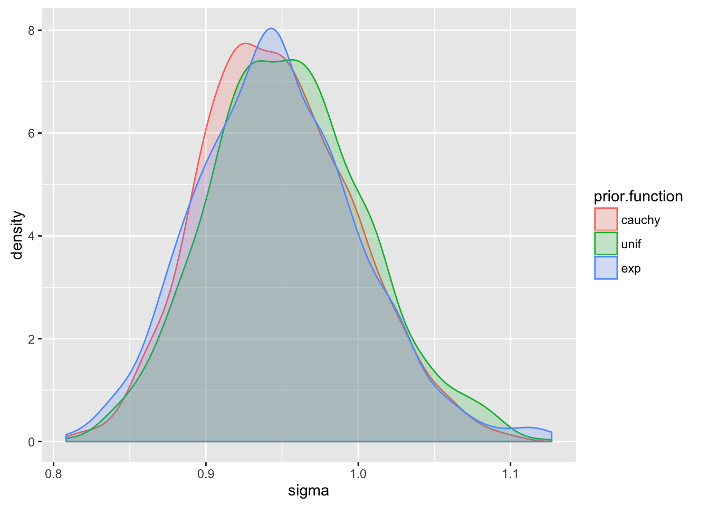<!-- -->

```r
pl + geom_density() + facet_grid(prior.function ~ .)
```

<!-- -->

Look very similar.  I *assume* the differences are due to sampling.

## 8M2 Use smaller values of scaling parameter for sigma prior to see how that changes things...

### First the cauchy model

What happends to cauchy distribution at different scales?

```r
x <- seq(-10,10,.1)
scale <- c(2,1,.5,.2)
cauchy.dist <- as.data.frame(cbind(x,sapply(scale,function(s) dcauchy(x,location=0,scale = s))))
colnames(cauchy.dist)[2:5] <- as.character(scale)
head(cauchy.dist)
```

```
##       x           2           1         0.5          0.2
## 1 -10.0 0.006121344 0.003151583 0.001587580 0.0006363652
## 2  -9.9 0.006240758 0.003214927 0.001619733 0.0006492807
## 3  -9.8 0.006363652 0.003280193 0.001652871 0.0006625934
## 4  -9.7 0.006490160 0.003347459 0.001687036 0.0006763197
## 5  -9.6 0.006620422 0.003416809 0.001722270 0.0006904770
## 6  -9.5 0.006754586 0.003488328 0.001758618 0.0007050834
```

```r
cauchy.dist.m <- melt(cauchy.dist,id.vars="x",variable.name="scale.value",value.name="y")
head(cauchy.dist.m)
```

```
##       x scale.value           y
## 1 -10.0           2 0.006121344
## 2  -9.9           2 0.006240758
## 3  -9.8           2 0.006363652
## 4  -9.7           2 0.006490160
## 5  -9.6           2 0.006620422
## 6  -9.5           2 0.006754586
```

```r
pl <- ggplot(cauchy.dist.m,aes(x=x,y=y,fill=scale.value,color=scale.value))
pl <- pl + geom_density(stat="identity",alpha=0.1)
pl + ggtitle("cauchy distribution at different scales")
```

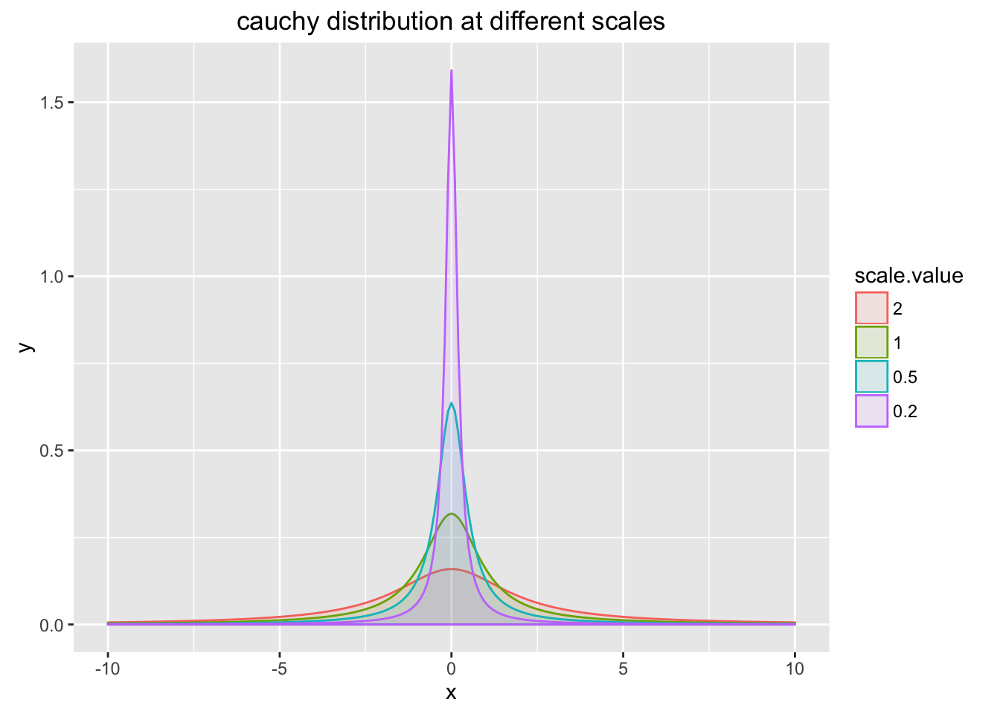<!-- -->

What happends to exp distribution at different rates?

```r
x <- seq(-10,10,.1)
rate <- c(2,1,.5,.2)
exp.dist <- as.data.frame(cbind(x,sapply(rate,function(r) dexp(x,rate = r))))
colnames(exp.dist)[2:5] <- as.character(rate)
head(exp.dist)
```

```
##       x 2 1 0.5 0.2
## 1 -10.0 0 0   0   0
## 2  -9.9 0 0   0   0
## 3  -9.8 0 0   0   0
## 4  -9.7 0 0   0   0
## 5  -9.6 0 0   0   0
## 6  -9.5 0 0   0   0
```

```r
exp.dist.m <- melt(exp.dist,id.vars="x",variable.name="rate.value",value.name="y")
head(exp.dist.m)
```

```
##       x rate.value y
## 1 -10.0          2 0
## 2  -9.9          2 0
## 3  -9.8          2 0
## 4  -9.7          2 0
## 5  -9.6          2 0
## 6  -9.5          2 0
```

```r
pl <- ggplot(exp.dist.m,aes(x=x,y=y,fill=rate.value,color=rate.value))
pl <- pl + geom_density(stat="identity",alpha=0.1)
pl + ggtitle("exponential distribution at different rates")
```

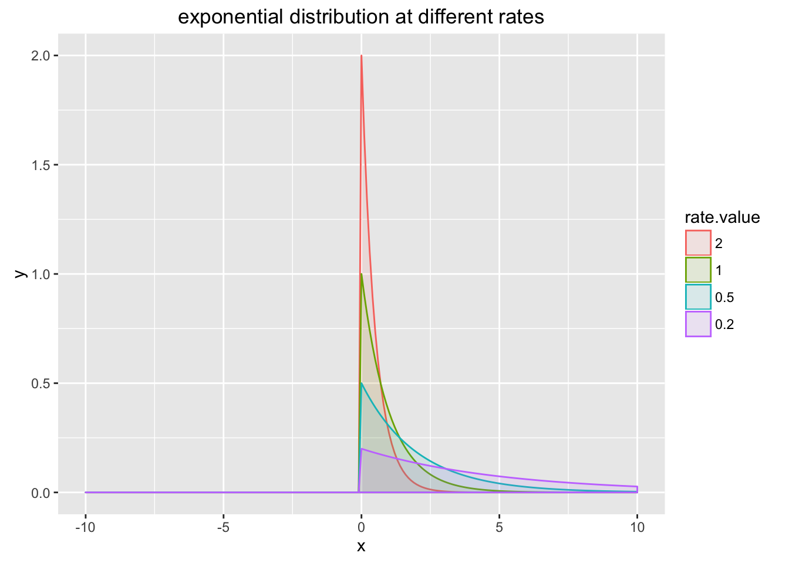


Fit a series of cauchy models with smaller scales

```r
m8M2.stan.cauchy2 <- map2stan(
  alist(
    log_gdp ~ dnorm( mu , sigma ) ,
    mu <- a + bR*rugged + bA*cont_africa + bAR*rugged*cont_africa ,
    a ~ dnorm(0,100),
    bR ~ dnorm(0,10),
    bA ~ dnorm(0,10),
    bAR ~ dnorm(0,10),
    sigma ~ dcauchy(0,2)
  ), data=dd.trim )
```

```
## 
## SAMPLING FOR MODEL 'log_gdp ~ dnorm(mu, sigma)' NOW (CHAIN 1).
## 
## Chain 1, Iteration:    1 / 2000 [  0%]  (Warmup)
## Chain 1, Iteration:  200 / 2000 [ 10%]  (Warmup)
## Chain 1, Iteration:  400 / 2000 [ 20%]  (Warmup)
## Chain 1, Iteration:  600 / 2000 [ 30%]  (Warmup)
## Chain 1, Iteration:  800 / 2000 [ 40%]  (Warmup)
## Chain 1, Iteration: 1000 / 2000 [ 50%]  (Warmup)
## Chain 1, Iteration: 1001 / 2000 [ 50%]  (Sampling)
## Chain 1, Iteration: 1200 / 2000 [ 60%]  (Sampling)
## Chain 1, Iteration: 1400 / 2000 [ 70%]  (Sampling)
## Chain 1, Iteration: 1600 / 2000 [ 80%]  (Sampling)
## Chain 1, Iteration: 1800 / 2000 [ 90%]  (Sampling)
## Chain 1, Iteration: 2000 / 2000 [100%]  (Sampling)
##  Elapsed Time: 0.234389 seconds (Warm-up)
##                0.194093 seconds (Sampling)
##                0.428482 seconds (Total)
## 
## 
## SAMPLING FOR MODEL 'log_gdp ~ dnorm(mu, sigma)' NOW (CHAIN 1).
## WARNING: No variance estimation is
##          performed for num_warmup < 20
## 
## 
## Chain 1, Iteration: 1 / 1 [100%]  (Sampling)
##  Elapsed Time: 4e-06 seconds (Warm-up)
##                6.9e-05 seconds (Sampling)
##                7.3e-05 seconds (Total)
```

```
## Computing WAIC
```

```
## Constructing posterior predictions
```

```
## [ 100 / 1000 ]
[ 200 / 1000 ]
[ 300 / 1000 ]
[ 400 / 1000 ]
[ 500 / 1000 ]
[ 600 / 1000 ]
[ 700 / 1000 ]
[ 800 / 1000 ]
[ 900 / 1000 ]
[ 1000 / 1000 ]
```

```r
m8M2.stan.cauchy1 <- map2stan(
  alist(
    log_gdp ~ dnorm( mu , sigma ) ,
    mu <- a + bR*rugged + bA*cont_africa + bAR*rugged*cont_africa ,
    a ~ dnorm(0,100),
    bR ~ dnorm(0,10),
    bA ~ dnorm(0,10),
    bAR ~ dnorm(0,10),
    sigma ~ dcauchy(0,1)
  ), data=dd.trim )
```

```
## 
## SAMPLING FOR MODEL 'log_gdp ~ dnorm(mu, sigma)' NOW (CHAIN 1).
## 
## Chain 1, Iteration:    1 / 2000 [  0%]  (Warmup)
## Chain 1, Iteration:  200 / 2000 [ 10%]  (Warmup)
## Chain 1, Iteration:  400 / 2000 [ 20%]  (Warmup)
## Chain 1, Iteration:  600 / 2000 [ 30%]  (Warmup)
## Chain 1, Iteration:  800 / 2000 [ 40%]  (Warmup)
## Chain 1, Iteration: 1000 / 2000 [ 50%]  (Warmup)
## Chain 1, Iteration: 1001 / 2000 [ 50%]  (Sampling)
## Chain 1, Iteration: 1200 / 2000 [ 60%]  (Sampling)
## Chain 1, Iteration: 1400 / 2000 [ 70%]  (Sampling)
## Chain 1, Iteration: 1600 / 2000 [ 80%]  (Sampling)
## Chain 1, Iteration: 1800 / 2000 [ 90%]  (Sampling)
## Chain 1, Iteration: 2000 / 2000 [100%]  (Sampling)
##  Elapsed Time: 0.277818 seconds (Warm-up)
##                0.19977 seconds (Sampling)
##                0.477588 seconds (Total)
## 
## 
## SAMPLING FOR MODEL 'log_gdp ~ dnorm(mu, sigma)' NOW (CHAIN 1).
## WARNING: No variance estimation is
##          performed for num_warmup < 20
## 
## 
## Chain 1, Iteration: 1 / 1 [100%]  (Sampling)
##  Elapsed Time: 4e-06 seconds (Warm-up)
##                7e-05 seconds (Sampling)
##                7.4e-05 seconds (Total)
```

```
## Computing WAIC
## Constructing posterior predictions
```

```
## [ 100 / 1000 ]
[ 200 / 1000 ]
[ 300 / 1000 ]
[ 400 / 1000 ]
[ 500 / 1000 ]
[ 600 / 1000 ]
[ 700 / 1000 ]
[ 800 / 1000 ]
[ 900 / 1000 ]
[ 1000 / 1000 ]
```

```r
m8M2.stan.cauchy.5 <- map2stan(
  alist(
    log_gdp ~ dnorm( mu , sigma ) ,
    mu <- a + bR*rugged + bA*cont_africa + bAR*rugged*cont_africa ,
    a ~ dnorm(0,100),
    bR ~ dnorm(0,10),
    bA ~ dnorm(0,10),
    bAR ~ dnorm(0,10),
    sigma ~ dcauchy(0,.5)
  ), data=dd.trim )
```

```
## 
## SAMPLING FOR MODEL 'log_gdp ~ dnorm(mu, sigma)' NOW (CHAIN 1).
## 
## Chain 1, Iteration:    1 / 2000 [  0%]  (Warmup)
## Chain 1, Iteration:  200 / 2000 [ 10%]  (Warmup)
## Chain 1, Iteration:  400 / 2000 [ 20%]  (Warmup)
## Chain 1, Iteration:  600 / 2000 [ 30%]  (Warmup)
## Chain 1, Iteration:  800 / 2000 [ 40%]  (Warmup)
## Chain 1, Iteration: 1000 / 2000 [ 50%]  (Warmup)
## Chain 1, Iteration: 1001 / 2000 [ 50%]  (Sampling)
## Chain 1, Iteration: 1200 / 2000 [ 60%]  (Sampling)
## Chain 1, Iteration: 1400 / 2000 [ 70%]  (Sampling)
## Chain 1, Iteration: 1600 / 2000 [ 80%]  (Sampling)
## Chain 1, Iteration: 1800 / 2000 [ 90%]  (Sampling)
## Chain 1, Iteration: 2000 / 2000 [100%]  (Sampling)
##  Elapsed Time: 0.218251 seconds (Warm-up)
##                0.230333 seconds (Sampling)
##                0.448584 seconds (Total)
## 
## 
## SAMPLING FOR MODEL 'log_gdp ~ dnorm(mu, sigma)' NOW (CHAIN 1).
## WARNING: No variance estimation is
##          performed for num_warmup < 20
## 
## 
## Chain 1, Iteration: 1 / 1 [100%]  (Sampling)
##  Elapsed Time: 4e-06 seconds (Warm-up)
##                8.6e-05 seconds (Sampling)
##                9e-05 seconds (Total)
```

```
## Computing WAIC
## Constructing posterior predictions
```

```
## [ 100 / 1000 ]
[ 200 / 1000 ]
[ 300 / 1000 ]
[ 400 / 1000 ]
[ 500 / 1000 ]
[ 600 / 1000 ]
[ 700 / 1000 ]
[ 800 / 1000 ]
[ 900 / 1000 ]
[ 1000 / 1000 ]
```

```r
m8M2.stan.cauchy.2 <- map2stan(
  alist(
    log_gdp ~ dnorm( mu , sigma ) ,
    mu <- a + bR*rugged + bA*cont_africa + bAR*rugged*cont_africa ,
    a ~ dnorm(0,100),
    bR ~ dnorm(0,10),
    bA ~ dnorm(0,10),
    bAR ~ dnorm(0,10),
    sigma ~ dcauchy(0,.2)
  ), data=dd.trim )
```

```
## 
## SAMPLING FOR MODEL 'log_gdp ~ dnorm(mu, sigma)' NOW (CHAIN 1).
## 
## Chain 1, Iteration:    1 / 2000 [  0%]  (Warmup)
## Chain 1, Iteration:  200 / 2000 [ 10%]  (Warmup)
## Chain 1, Iteration:  400 / 2000 [ 20%]  (Warmup)
## Chain 1, Iteration:  600 / 2000 [ 30%]  (Warmup)
## Chain 1, Iteration:  800 / 2000 [ 40%]  (Warmup)
## Chain 1, Iteration: 1000 / 2000 [ 50%]  (Warmup)
## Chain 1, Iteration: 1001 / 2000 [ 50%]  (Sampling)
## Chain 1, Iteration: 1200 / 2000 [ 60%]  (Sampling)
## Chain 1, Iteration: 1400 / 2000 [ 70%]  (Sampling)
## Chain 1, Iteration: 1600 / 2000 [ 80%]  (Sampling)
## Chain 1, Iteration: 1800 / 2000 [ 90%]  (Sampling)
## Chain 1, Iteration: 2000 / 2000 [100%]  (Sampling)
##  Elapsed Time: 0.268034 seconds (Warm-up)
##                0.221456 seconds (Sampling)
##                0.48949 seconds (Total)
## 
## 
## SAMPLING FOR MODEL 'log_gdp ~ dnorm(mu, sigma)' NOW (CHAIN 1).
## WARNING: No variance estimation is
##          performed for num_warmup < 20
## 
## 
## Chain 1, Iteration: 1 / 1 [100%]  (Sampling)
##  Elapsed Time: 5e-06 seconds (Warm-up)
##                6.8e-05 seconds (Sampling)
##                7.3e-05 seconds (Total)
```

```
## Computing WAIC
## Constructing posterior predictions
```

```
## [ 100 / 1000 ]
[ 200 / 1000 ]
[ 300 / 1000 ]
[ 400 / 1000 ]
[ 500 / 1000 ]
[ 600 / 1000 ]
[ 700 / 1000 ]
[ 800 / 1000 ]
[ 900 / 1000 ]
[ 1000 / 1000 ]
```

look at posteriors

```r
precis(m8M2.stan.cauchy2)
```

```
##        Mean StdDev lower 0.89 upper 0.89 n_eff Rhat
## a      9.23   0.14       9.02       9.46   445    1
## bR    -0.21   0.07      -0.34      -0.10   440    1
## bA    -1.96   0.23      -2.36      -1.63   483    1
## bAR    0.40   0.13       0.19       0.59   480    1
## sigma  0.95   0.05       0.88       1.05   715    1
```

```r
precis(m8M2.stan.cauchy1)
```

```
##        Mean StdDev lower 0.89 upper 0.89 n_eff Rhat
## a      9.22   0.14       9.01       9.44   329 1.00
## bR    -0.20   0.08      -0.33      -0.07   317 1.00
## bA    -1.95   0.22      -2.32      -1.62   408 1.01
## bAR    0.39   0.13       0.19       0.60   379 1.00
## sigma  0.95   0.05       0.88       1.04   809 1.00
```

```r
precis(m8M2.stan.cauchy.5)
```

```
##        Mean StdDev lower 0.89 upper 0.89 n_eff Rhat
## a      9.23   0.13       9.02       9.43   381    1
## bR    -0.21   0.07      -0.32      -0.09   377    1
## bA    -1.96   0.22      -2.30      -1.62   373    1
## bAR    0.40   0.12       0.21       0.60   389    1
## sigma  0.95   0.05       0.87       1.02   751    1
```

```r
precis(m8M2.stan.cauchy.2)
```

```
##        Mean StdDev lower 0.89 upper 0.89 n_eff Rhat
## a      9.23   0.14       9.04       9.46   382    1
## bR    -0.21   0.08      -0.33      -0.08   336    1
## bA    -1.96   0.22      -2.32      -1.62   438    1
## bAR    0.40   0.14       0.19       0.62   404    1
## sigma  0.95   0.05       0.87       1.04   484    1
```

plot posteriors

```r
fits <- ls(pattern="m8M2.stan.cauch")
sigmas <- sapply(fits, function(x) extract.samples(get(x))$sigma)
colnames(sigmas) <- fits
sigmas.m <- melt(sigmas)
pl <- ggplot(sigmas.m,aes(x=value,color=Var2,fill=Var2))
pl <- pl + geom_density(alpha=0.1)
pl
```

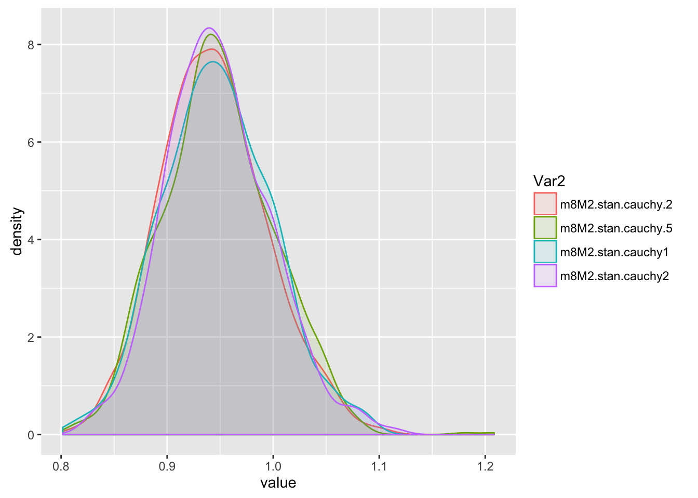

exp models with smaller scales:


```r
m8M2.stan.exp1 <- map2stan(
  alist(
    log_gdp ~ dnorm( mu , sigma ) ,
    mu <- a + bR*rugged + bA*cont_africa + bAR*rugged*cont_africa ,
    a ~ dnorm(0,100),
    bR ~ dnorm(0,10),
    bA ~ dnorm(0,10),
    bAR ~ dnorm(0,10),
    sigma ~ dexp(1)
  ), data=dd.trim )
```

```
## 
## SAMPLING FOR MODEL 'log_gdp ~ dnorm(mu, sigma)' NOW (CHAIN 1).
## 
## Chain 1, Iteration:    1 / 2000 [  0%]  (Warmup)
## Chain 1, Iteration:  200 / 2000 [ 10%]  (Warmup)
## Chain 1, Iteration:  400 / 2000 [ 20%]  (Warmup)
## Chain 1, Iteration:  600 / 2000 [ 30%]  (Warmup)
## Chain 1, Iteration:  800 / 2000 [ 40%]  (Warmup)
## Chain 1, Iteration: 1000 / 2000 [ 50%]  (Warmup)
## Chain 1, Iteration: 1001 / 2000 [ 50%]  (Sampling)
## Chain 1, Iteration: 1200 / 2000 [ 60%]  (Sampling)
## Chain 1, Iteration: 1400 / 2000 [ 70%]  (Sampling)
## Chain 1, Iteration: 1600 / 2000 [ 80%]  (Sampling)
## Chain 1, Iteration: 1800 / 2000 [ 90%]  (Sampling)
## Chain 1, Iteration: 2000 / 2000 [100%]  (Sampling)
##  Elapsed Time: 0.173244 seconds (Warm-up)
##                0.153594 seconds (Sampling)
##                0.326838 seconds (Total)
## 
## 
## SAMPLING FOR MODEL 'log_gdp ~ dnorm(mu, sigma)' NOW (CHAIN 1).
## WARNING: No variance estimation is
##          performed for num_warmup < 20
## 
## 
## Chain 1, Iteration: 1 / 1 [100%]  (Sampling)
##  Elapsed Time: 3e-06 seconds (Warm-up)
##                5.9e-05 seconds (Sampling)
##                6.2e-05 seconds (Total)
```

```
## Computing WAIC
```

```
## Constructing posterior predictions
```

```
## [ 100 / 1000 ]
[ 200 / 1000 ]
[ 300 / 1000 ]
[ 400 / 1000 ]
[ 500 / 1000 ]
[ 600 / 1000 ]
[ 700 / 1000 ]
[ 800 / 1000 ]
[ 900 / 1000 ]
[ 1000 / 1000 ]
```

```r
m8M2.stan.exp.5 <- map2stan(
  alist(
    log_gdp ~ dnorm( mu , sigma ) ,
    mu <- a + bR*rugged + bA*cont_africa + bAR*rugged*cont_africa ,
    a ~ dnorm(0,100),
    bR ~ dnorm(0,10),
    bA ~ dnorm(0,10),
    bAR ~ dnorm(0,10),
    sigma ~ dexp(.5)
  ), data=dd.trim )
```

```
## 
## SAMPLING FOR MODEL 'log_gdp ~ dnorm(mu, sigma)' NOW (CHAIN 1).
## 
## Chain 1, Iteration:    1 / 2000 [  0%]  (Warmup)
## Chain 1, Iteration:  200 / 2000 [ 10%]  (Warmup)
## Chain 1, Iteration:  400 / 2000 [ 20%]  (Warmup)
## Chain 1, Iteration:  600 / 2000 [ 30%]  (Warmup)
## Chain 1, Iteration:  800 / 2000 [ 40%]  (Warmup)
## Chain 1, Iteration: 1000 / 2000 [ 50%]  (Warmup)
## Chain 1, Iteration: 1001 / 2000 [ 50%]  (Sampling)
## Chain 1, Iteration: 1200 / 2000 [ 60%]  (Sampling)
## Chain 1, Iteration: 1400 / 2000 [ 70%]  (Sampling)
## Chain 1, Iteration: 1600 / 2000 [ 80%]  (Sampling)
## Chain 1, Iteration: 1800 / 2000 [ 90%]  (Sampling)
## Chain 1, Iteration: 2000 / 2000 [100%]  (Sampling)
##  Elapsed Time: 0.162335 seconds (Warm-up)
##                0.216932 seconds (Sampling)
##                0.379267 seconds (Total)
## 
## 
## SAMPLING FOR MODEL 'log_gdp ~ dnorm(mu, sigma)' NOW (CHAIN 1).
## WARNING: No variance estimation is
##          performed for num_warmup < 20
## 
## 
## Chain 1, Iteration: 1 / 1 [100%]  (Sampling)
##  Elapsed Time: 3e-06 seconds (Warm-up)
##                0.000133 seconds (Sampling)
##                0.000136 seconds (Total)
```

```
## Computing WAIC
## Constructing posterior predictions
```

```
## [ 100 / 1000 ]
[ 200 / 1000 ]
[ 300 / 1000 ]
[ 400 / 1000 ]
[ 500 / 1000 ]
[ 600 / 1000 ]
[ 700 / 1000 ]
[ 800 / 1000 ]
[ 900 / 1000 ]
[ 1000 / 1000 ]
```

```r
m8M2.stan.exp.2 <- map2stan(
  alist(
    log_gdp ~ dnorm( mu , sigma ) ,
    mu <- a + bR*rugged + bA*cont_africa + bAR*rugged*cont_africa ,
    a ~ dnorm(0,100),
    bR ~ dnorm(0,10),
    bA ~ dnorm(0,10),
    bAR ~ dnorm(0,10),
    sigma ~ dexp(.2)
  ), data=dd.trim )
```

```
## 
## SAMPLING FOR MODEL 'log_gdp ~ dnorm(mu, sigma)' NOW (CHAIN 1).
## 
## Chain 1, Iteration:    1 / 2000 [  0%]  (Warmup)
## Chain 1, Iteration:  200 / 2000 [ 10%]  (Warmup)
## Chain 1, Iteration:  400 / 2000 [ 20%]  (Warmup)
## Chain 1, Iteration:  600 / 2000 [ 30%]  (Warmup)
## Chain 1, Iteration:  800 / 2000 [ 40%]  (Warmup)
## Chain 1, Iteration: 1000 / 2000 [ 50%]  (Warmup)
## Chain 1, Iteration: 1001 / 2000 [ 50%]  (Sampling)
## Chain 1, Iteration: 1200 / 2000 [ 60%]  (Sampling)
## Chain 1, Iteration: 1400 / 2000 [ 70%]  (Sampling)
## Chain 1, Iteration: 1600 / 2000 [ 80%]  (Sampling)
## Chain 1, Iteration: 1800 / 2000 [ 90%]  (Sampling)
## Chain 1, Iteration: 2000 / 2000 [100%]  (Sampling)
##  Elapsed Time: 0.22576 seconds (Warm-up)
##                0.198774 seconds (Sampling)
##                0.424534 seconds (Total)
## 
## 
## SAMPLING FOR MODEL 'log_gdp ~ dnorm(mu, sigma)' NOW (CHAIN 1).
## WARNING: No variance estimation is
##          performed for num_warmup < 20
## 
## 
## Chain 1, Iteration: 1 / 1 [100%]  (Sampling)
##  Elapsed Time: 4e-06 seconds (Warm-up)
##                5.8e-05 seconds (Sampling)
##                6.2e-05 seconds (Total)
```

```
## Computing WAIC
## Constructing posterior predictions
```

```
## [ 100 / 1000 ]
[ 200 / 1000 ]
[ 300 / 1000 ]
[ 400 / 1000 ]
[ 500 / 1000 ]
[ 600 / 1000 ]
[ 700 / 1000 ]
[ 800 / 1000 ]
[ 900 / 1000 ]
[ 1000 / 1000 ]
```

```r
m8M2.stan.exp.1 <- map2stan(
  alist(
    log_gdp ~ dnorm( mu , sigma ) ,
    mu <- a + bR*rugged + bA*cont_africa + bAR*rugged*cont_africa ,
    a ~ dnorm(0,100),
    bR ~ dnorm(0,10),
    bA ~ dnorm(0,10),
    bAR ~ dnorm(0,10),
    sigma ~ dexp(.1)
  ), data=dd.trim )
```

```
## 
## SAMPLING FOR MODEL 'log_gdp ~ dnorm(mu, sigma)' NOW (CHAIN 1).
## 
## Chain 1, Iteration:    1 / 2000 [  0%]  (Warmup)
## Chain 1, Iteration:  200 / 2000 [ 10%]  (Warmup)
## Chain 1, Iteration:  400 / 2000 [ 20%]  (Warmup)
## Chain 1, Iteration:  600 / 2000 [ 30%]  (Warmup)
## Chain 1, Iteration:  800 / 2000 [ 40%]  (Warmup)
## Chain 1, Iteration: 1000 / 2000 [ 50%]  (Warmup)
## Chain 1, Iteration: 1001 / 2000 [ 50%]  (Sampling)
## Chain 1, Iteration: 1200 / 2000 [ 60%]  (Sampling)
## Chain 1, Iteration: 1400 / 2000 [ 70%]  (Sampling)
## Chain 1, Iteration: 1600 / 2000 [ 80%]  (Sampling)
## Chain 1, Iteration: 1800 / 2000 [ 90%]  (Sampling)
## Chain 1, Iteration: 2000 / 2000 [100%]  (Sampling)
##  Elapsed Time: 0.22654 seconds (Warm-up)
##                0.185079 seconds (Sampling)
##                0.411619 seconds (Total)
## 
## 
## SAMPLING FOR MODEL 'log_gdp ~ dnorm(mu, sigma)' NOW (CHAIN 1).
## WARNING: No variance estimation is
##          performed for num_warmup < 20
## 
## 
## Chain 1, Iteration: 1 / 1 [100%]  (Sampling)
##  Elapsed Time: 4e-06 seconds (Warm-up)
##                0.000104 seconds (Sampling)
##                0.000108 seconds (Total)
```

```
## Computing WAIC
## Constructing posterior predictions
```

```
## [ 100 / 1000 ]
[ 200 / 1000 ]
[ 300 / 1000 ]
[ 400 / 1000 ]
[ 500 / 1000 ]
[ 600 / 1000 ]
[ 700 / 1000 ]
[ 800 / 1000 ]
[ 900 / 1000 ]
[ 1000 / 1000 ]
```

```r
m8M2.stan.exp.001 <- map2stan(
  alist(
    log_gdp ~ dnorm( mu , sigma ) ,
    mu <- a + bR*rugged + bA*cont_africa + bAR*rugged*cont_africa ,
    a ~ dnorm(0,100),
    bR ~ dnorm(0,10),
    bA ~ dnorm(0,10),
    bAR ~ dnorm(0,10),
    sigma ~ dexp(.001)
  ), data=dd.trim )
```

```
## 
## SAMPLING FOR MODEL 'log_gdp ~ dnorm(mu, sigma)' NOW (CHAIN 1).
## 
## Chain 1, Iteration:    1 / 2000 [  0%]  (Warmup)
## Chain 1, Iteration:  200 / 2000 [ 10%]  (Warmup)
## Chain 1, Iteration:  400 / 2000 [ 20%]  (Warmup)
## Chain 1, Iteration:  600 / 2000 [ 30%]  (Warmup)
## Chain 1, Iteration:  800 / 2000 [ 40%]  (Warmup)
## Chain 1, Iteration: 1000 / 2000 [ 50%]  (Warmup)
## Chain 1, Iteration: 1001 / 2000 [ 50%]  (Sampling)
## Chain 1, Iteration: 1200 / 2000 [ 60%]  (Sampling)
## Chain 1, Iteration: 1400 / 2000 [ 70%]  (Sampling)
## Chain 1, Iteration: 1600 / 2000 [ 80%]  (Sampling)
## Chain 1, Iteration: 1800 / 2000 [ 90%]  (Sampling)
## Chain 1, Iteration: 2000 / 2000 [100%]  (Sampling)
##  Elapsed Time: 0.242452 seconds (Warm-up)
##                0.219984 seconds (Sampling)
##                0.462436 seconds (Total)
## 
## 
## SAMPLING FOR MODEL 'log_gdp ~ dnorm(mu, sigma)' NOW (CHAIN 1).
## WARNING: No variance estimation is
##          performed for num_warmup < 20
## 
## 
## Chain 1, Iteration: 1 / 1 [100%]  (Sampling)
##  Elapsed Time: 5e-06 seconds (Warm-up)
##                9.3e-05 seconds (Sampling)
##                9.8e-05 seconds (Total)
```

```
## Computing WAIC
## Constructing posterior predictions
```

```
## [ 100 / 1000 ]
[ 200 / 1000 ]
[ 300 / 1000 ]
[ 400 / 1000 ]
[ 500 / 1000 ]
[ 600 / 1000 ]
[ 700 / 1000 ]
[ 800 / 1000 ]
[ 900 / 1000 ]
[ 1000 / 1000 ]
```

look at posteriors

```r
precis(m8M2.stan.exp1)
```

```
##        Mean StdDev lower 0.89 upper 0.89 n_eff Rhat
## a      9.22   0.13       9.01       9.43   334 1.01
## bR    -0.20   0.07      -0.32      -0.09   326 1.02
## bA    -1.94   0.22      -2.26      -1.57   365 1.01
## bAR    0.39   0.13       0.19       0.60   393 1.01
## sigma  0.95   0.05       0.87       1.03   749 1.00
```

```r
precis(m8M2.stan.exp.5)
```

```
##        Mean StdDev lower 0.89 upper 0.89 n_eff Rhat
## a      9.22   0.14       9.01       9.45   389    1
## bR    -0.20   0.08      -0.32      -0.08   390    1
## bA    -1.94   0.22      -2.28      -1.58   349    1
## bAR    0.39   0.12       0.19       0.58   276    1
## sigma  0.95   0.05       0.87       1.03   550    1
```

```r
precis(m8M2.stan.exp.2)
```

```
##        Mean StdDev lower 0.89 upper 0.89 n_eff Rhat
## a      9.21   0.13       9.03       9.43   390    1
## bR    -0.20   0.07      -0.32      -0.09   391    1
## bA    -1.93   0.21      -2.28      -1.61   447    1
## bAR    0.38   0.12       0.17       0.56   456    1
## sigma  0.95   0.05       0.87       1.03   798    1
```

```r
precis(m8M2.stan.exp.1)
```

```
##        Mean StdDev lower 0.89 upper 0.89 n_eff Rhat
## a      9.22   0.15       8.95       9.42   267 1.01
## bR    -0.20   0.08      -0.34      -0.08   261 1.01
## bA    -1.93   0.24      -2.28      -1.52   353 1.00
## bAR    0.38   0.13       0.18       0.61   335 1.01
## sigma  0.95   0.05       0.87       1.03   619 1.00
```

```r
precis(m8M2.stan.exp.001) #rhat going up?
```

```
##        Mean StdDev lower 0.89 upper 0.89 n_eff Rhat
## a      9.23   0.15       8.99       9.46   338    1
## bR    -0.21   0.08      -0.34      -0.08   422    1
## bA    -1.95   0.23      -2.33      -1.60   359    1
## bAR    0.40   0.13       0.20       0.62   411    1
## sigma  0.95   0.05       0.87       1.03   514    1
```

plot posteriors

```r
fits <- ls(pattern="m8M2.stan.exp")
sigmas <- sapply(fits, function(x) extract.samples(get(x))$sigma)
colnames(sigmas) <- fits
sigmas.m <- melt(sigmas)
pl <- ggplot(sigmas.m,aes(x=value,color=Var2,fill=Var2))
pl <- pl + geom_density(alpha=0.1)
pl
```

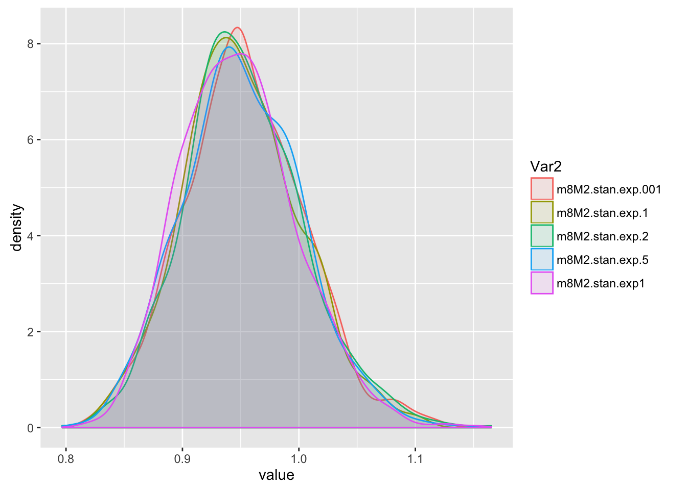

## 8M3

Restimate a stan model at different number of warm up samples.


```r
m8m3.stan.warm1000 <- map2stan(
  alist(
    log_gdp ~ dnorm( mu , sigma ) ,
    mu <- a + bR*rugged + bA*cont_africa + bAR*rugged*cont_africa ,
    a ~ dnorm(0,100),
    bR ~ dnorm(0,10),
    bA ~ dnorm(0,10),
    bAR ~ dnorm(0,10),
    sigma ~ dcauchy(0,2)
  ), data=dd.trim )
```

```
## 
## SAMPLING FOR MODEL 'log_gdp ~ dnorm(mu, sigma)' NOW (CHAIN 1).
## 
## Chain 1, Iteration:    1 / 2000 [  0%]  (Warmup)
## Chain 1, Iteration:  200 / 2000 [ 10%]  (Warmup)
## Chain 1, Iteration:  400 / 2000 [ 20%]  (Warmup)
## Chain 1, Iteration:  600 / 2000 [ 30%]  (Warmup)
## Chain 1, Iteration:  800 / 2000 [ 40%]  (Warmup)
## Chain 1, Iteration: 1000 / 2000 [ 50%]  (Warmup)
## Chain 1, Iteration: 1001 / 2000 [ 50%]  (Sampling)
## Chain 1, Iteration: 1200 / 2000 [ 60%]  (Sampling)
## Chain 1, Iteration: 1400 / 2000 [ 70%]  (Sampling)
## Chain 1, Iteration: 1600 / 2000 [ 80%]  (Sampling)
## Chain 1, Iteration: 1800 / 2000 [ 90%]  (Sampling)
## Chain 1, Iteration: 2000 / 2000 [100%]  (Sampling)
##  Elapsed Time: 0.196442 seconds (Warm-up)
##                0.173775 seconds (Sampling)
##                0.370217 seconds (Total)
## 
## 
## SAMPLING FOR MODEL 'log_gdp ~ dnorm(mu, sigma)' NOW (CHAIN 1).
## WARNING: No variance estimation is
##          performed for num_warmup < 20
## 
## 
## Chain 1, Iteration: 1 / 1 [100%]  (Sampling)
##  Elapsed Time: 4e-06 seconds (Warm-up)
##                5.9e-05 seconds (Sampling)
##                6.3e-05 seconds (Total)
```

```
## Computing WAIC
```

```
## Constructing posterior predictions
```

```
## [ 100 / 1000 ]
[ 200 / 1000 ]
[ 300 / 1000 ]
[ 400 / 1000 ]
[ 500 / 1000 ]
[ 600 / 1000 ]
[ 700 / 1000 ]
[ 800 / 1000 ]
[ 900 / 1000 ]
[ 1000 / 1000 ]
```

```r
m8m3.stan.warm100 <- map2stan(
  alist(
    log_gdp ~ dnorm( mu , sigma ) ,
    mu <- a + bR*rugged + bA*cont_africa + bAR*rugged*cont_africa ,
    a ~ dnorm(0,100),
    bR ~ dnorm(0,10),
    bA ~ dnorm(0,10),
    bAR ~ dnorm(0,10),
    sigma ~ dcauchy(0,2)
  ), data=dd.trim, warmup = 100, iter = 1100 )
```

```
## 
## SAMPLING FOR MODEL 'log_gdp ~ dnorm(mu, sigma)' NOW (CHAIN 1).
## WARNING: The initial buffer, adaptation window, and terminal buffer
##          overflow the total number of warmup iterations.
##          Defaulting to a 15%/75%/10% partition,
##            init_buffer = 15
##            adapt_window = 75
##            term_buffer = 10
## 
## 
## Chain 1, Iteration:    1 / 1100 [  0%]  (Warmup)
## Chain 1, Iteration:  101 / 1100 [  9%]  (Sampling)
## Chain 1, Iteration:  210 / 1100 [ 19%]  (Sampling)
## Chain 1, Iteration:  320 / 1100 [ 29%]  (Sampling)
## Chain 1, Iteration:  430 / 1100 [ 39%]  (Sampling)
## Chain 1, Iteration:  540 / 1100 [ 49%]  (Sampling)
## Chain 1, Iteration:  650 / 1100 [ 59%]  (Sampling)
## Chain 1, Iteration:  760 / 1100 [ 69%]  (Sampling)
## Chain 1, Iteration:  870 / 1100 [ 79%]  (Sampling)
## Chain 1, Iteration:  980 / 1100 [ 89%]  (Sampling)
## Chain 1, Iteration: 1090 / 1100 [ 99%]  (Sampling)
## Chain 1, Iteration: 1100 / 1100 [100%]  (Sampling)
##  Elapsed Time: 0.036044 seconds (Warm-up)
##                0.18035 seconds (Sampling)
##                0.216394 seconds (Total)
```

```
## The following numerical problems occured the indicated number of times after warmup on chain 1
```

```
##                                                                                 count
## Exception thrown at line 24: normal_log: Scale parameter is 0, but must be > 0!     2
```

```
## When a numerical problem occurs, the Metropolis proposal gets rejected.
```

```
## However, by design Metropolis proposals sometimes get rejected even when there are no numerical problems.
```

```
## Thus, if the number in the 'count' column is small, do not ask about this message on stan-users.
```

```
## 
## SAMPLING FOR MODEL 'log_gdp ~ dnorm(mu, sigma)' NOW (CHAIN 1).
## WARNING: No variance estimation is
##          performed for num_warmup < 20
## 
## 
## Chain 1, Iteration: 1 / 1 [100%]  (Sampling)
##  Elapsed Time: 6e-06 seconds (Warm-up)
##                0.000188 seconds (Sampling)
##                0.000194 seconds (Total)
```

```
## Computing WAIC
```

```
## Constructing posterior predictions
```

```
## [ 100 / 1000 ]
[ 200 / 1000 ]
[ 300 / 1000 ]
[ 400 / 1000 ]
[ 500 / 1000 ]
[ 600 / 1000 ]
[ 700 / 1000 ]
[ 800 / 1000 ]
[ 900 / 1000 ]
[ 1000 / 1000 ]
```

```r
m8m3.stan.warm50 <- map2stan(
  alist(
    log_gdp ~ dnorm( mu , sigma ) ,
    mu <- a + bR*rugged + bA*cont_africa + bAR*rugged*cont_africa ,
    a ~ dnorm(0,100),
    bR ~ dnorm(0,10),
    bA ~ dnorm(0,10),
    bAR ~ dnorm(0,10),
    sigma ~ dcauchy(0,2)
  ), data=dd.trim, warmup = 50, iter = 1050 )
```

```
## 
## SAMPLING FOR MODEL 'log_gdp ~ dnorm(mu, sigma)' NOW (CHAIN 1).
## WARNING: The initial buffer, adaptation window, and terminal buffer
##          overflow the total number of warmup iterations.
##          Defaulting to a 15%/75%/10% partition,
##            init_buffer = 7
##            adapt_window = 38
##            term_buffer = 5
## 
## 
## Chain 1, Iteration:    1 / 1050 [  0%]  (Warmup)
## Chain 1, Iteration:   51 / 1050 [  4%]  (Sampling)
## Chain 1, Iteration:  155 / 1050 [ 14%]  (Sampling)
## Chain 1, Iteration:  260 / 1050 [ 24%]  (Sampling)
## Chain 1, Iteration:  365 / 1050 [ 34%]  (Sampling)
## Chain 1, Iteration:  470 / 1050 [ 44%]  (Sampling)
## Chain 1, Iteration:  575 / 1050 [ 54%]  (Sampling)
## Chain 1, Iteration:  680 / 1050 [ 64%]  (Sampling)
## Chain 1, Iteration:  785 / 1050 [ 74%]  (Sampling)
## Chain 1, Iteration:  890 / 1050 [ 84%]  (Sampling)
## Chain 1, Iteration:  995 / 1050 [ 94%]  (Sampling)
## Chain 1, Iteration: 1050 / 1050 [100%]  (Sampling)
##  Elapsed Time: 0.012384 seconds (Warm-up)
##                0.208543 seconds (Sampling)
##                0.220927 seconds (Total)
## 
## 
## SAMPLING FOR MODEL 'log_gdp ~ dnorm(mu, sigma)' NOW (CHAIN 1).
## WARNING: No variance estimation is
##          performed for num_warmup < 20
## 
## 
## Chain 1, Iteration: 1 / 1 [100%]  (Sampling)
##  Elapsed Time: 2e-06 seconds (Warm-up)
##                6.3e-05 seconds (Sampling)
##                6.5e-05 seconds (Total)
```

```
## Computing WAIC
## Constructing posterior predictions
```

```
## [ 100 / 1000 ]
[ 200 / 1000 ]
[ 300 / 1000 ]
[ 400 / 1000 ]
[ 500 / 1000 ]
[ 600 / 1000 ]
[ 700 / 1000 ]
[ 800 / 1000 ]
[ 900 / 1000 ]
[ 1000 / 1000 ]
```

```r
m8m3.stan.warm10 <- map2stan(
  alist(
    log_gdp ~ dnorm( mu , sigma ) ,
    mu <- a + bR*rugged + bA*cont_africa + bAR*rugged*cont_africa ,
    a ~ dnorm(0,100),
    bR ~ dnorm(0,10),
    bA ~ dnorm(0,10),
    bAR ~ dnorm(0,10),
    sigma ~ dcauchy(0,2)
  ), data=dd.trim, warmup = 10, iter = 1010 )
```

```
## 
## SAMPLING FOR MODEL 'log_gdp ~ dnorm(mu, sigma)' NOW (CHAIN 1).
## WARNING: No variance estimation is
##          performed for num_warmup < 20
## 
## 
## Chain 1, Iteration:    1 / 1010 [  0%]  (Warmup)
## Chain 1, Iteration:   11 / 1010 [  1%]  (Sampling)
## Chain 1, Iteration:  111 / 1010 [ 10%]  (Sampling)
## Chain 1, Iteration:  212 / 1010 [ 20%]  (Sampling)
## Chain 1, Iteration:  313 / 1010 [ 30%]  (Sampling)
## Chain 1, Iteration:  414 / 1010 [ 40%]  (Sampling)
## Chain 1, Iteration:  515 / 1010 [ 50%]  (Sampling)
## Chain 1, Iteration:  616 / 1010 [ 60%]  (Sampling)
## Chain 1, Iteration:  717 / 1010 [ 70%]  (Sampling)
## Chain 1, Iteration:  818 / 1010 [ 80%]  (Sampling)
## Chain 1, Iteration:  919 / 1010 [ 90%]  (Sampling)
## Chain 1, Iteration: 1010 / 1010 [100%]  (Sampling)
##  Elapsed Time: 0.000596 seconds (Warm-up)
##                0.066447 seconds (Sampling)
##                0.067043 seconds (Total)
## 
## 
## SAMPLING FOR MODEL 'log_gdp ~ dnorm(mu, sigma)' NOW (CHAIN 1).
## WARNING: No variance estimation is
##          performed for num_warmup < 20
## 
## 
## Chain 1, Iteration: 1 / 1 [100%]  (Sampling)
##  Elapsed Time: 2e-06 seconds (Warm-up)
##                5.9e-05 seconds (Sampling)
##                6.1e-05 seconds (Total)
```

```
## Computing WAIC
## Constructing posterior predictions
```

```
## [ 100 / 1000 ]
[ 200 / 1000 ]
[ 300 / 1000 ]
[ 400 / 1000 ]
[ 500 / 1000 ]
[ 600 / 1000 ]
[ 700 / 1000 ]
[ 800 / 1000 ]
[ 900 / 1000 ]
[ 1000 / 1000 ]
```

```
## Warning in map2stan(alist(log_gdp ~ dnorm(mu, sigma), mu <- a + bR * rugged + : There were 1000 divergent iterations during sampling.
## Check the chains (trace plots, n_eff, Rhat) carefully to ensure they are valid.
```

```r
m8m3.stan.warm2 <- map2stan(
  alist(
    log_gdp ~ dnorm( mu , sigma ) ,
    mu <- a + bR*rugged + bA*cont_africa + bAR*rugged*cont_africa ,
    a ~ dnorm(0,100),
    bR ~ dnorm(0,10),
    bA ~ dnorm(0,10),
    bAR ~ dnorm(0,10),
    sigma ~ dcauchy(0,2)
  ), data=dd.trim, warmup = 2, iter = 1002 )
```

```
## 
## SAMPLING FOR MODEL 'log_gdp ~ dnorm(mu, sigma)' NOW (CHAIN 1).
## WARNING: No variance estimation is
##          performed for num_warmup < 20
## 
## 
## Chain 1, Iteration:    1 / 1002 [  0%]  (Warmup)
## Chain 1, Iteration:    3 / 1002 [  0%]  (Sampling)
## Chain 1, Iteration:  102 / 1002 [ 10%]  (Sampling)
## Chain 1, Iteration:  202 / 1002 [ 20%]  (Sampling)
## Chain 1, Iteration:  302 / 1002 [ 30%]  (Sampling)
## Chain 1, Iteration:  402 / 1002 [ 40%]  (Sampling)
## Chain 1, Iteration:  502 / 1002 [ 50%]  (Sampling)
## Chain 1, Iteration:  602 / 1002 [ 60%]  (Sampling)
## Chain 1, Iteration:  702 / 1002 [ 70%]  (Sampling)
## Chain 1, Iteration:  802 / 1002 [ 80%]  (Sampling)
## Chain 1, Iteration:  902 / 1002 [ 90%]  (Sampling)
## Chain 1, Iteration: 1002 / 1002 [100%]  (Sampling)
##  Elapsed Time: 0.000724 seconds (Warm-up)
##                0.047806 seconds (Sampling)
##                0.04853 seconds (Total)
## 
## 
## SAMPLING FOR MODEL 'log_gdp ~ dnorm(mu, sigma)' NOW (CHAIN 1).
## WARNING: No variance estimation is
##          performed for num_warmup < 20
## 
## 
## Chain 1, Iteration: 1 / 1 [100%]  (Sampling)
##  Elapsed Time: 3e-06 seconds (Warm-up)
##                5.9e-05 seconds (Sampling)
##                6.2e-05 seconds (Total)
```

```
## Computing WAIC
## Constructing posterior predictions
```

```
## [ 100 / 1000 ]
[ 200 / 1000 ]
[ 300 / 1000 ]
[ 400 / 1000 ]
[ 500 / 1000 ]
[ 600 / 1000 ]
[ 700 / 1000 ]
[ 800 / 1000 ]
[ 900 / 1000 ]
[ 1000 / 1000 ]
```

```
## Warning in map2stan(alist(log_gdp ~ dnorm(mu, sigma), mu <- a + bR * rugged + : There were 1000 divergent iterations during sampling.
## Check the chains (trace plots, n_eff, Rhat) carefully to ensure they are valid.
```


```r
precis(m8m3.stan.warm1000)
```

```
##        Mean StdDev lower 0.89 upper 0.89 n_eff Rhat
## a      9.22   0.14       8.99       9.44   274    1
## bR    -0.20   0.08      -0.32      -0.07   261    1
## bA    -1.94   0.22      -2.31      -1.59   312    1
## bAR    0.39   0.12       0.20       0.59   289    1
## sigma  0.95   0.05       0.87       1.02   534    1
```

```r
precis(m8m3.stan.warm100)
```

```
##        Mean StdDev lower 0.89 upper 0.89 n_eff Rhat
## a      9.22   0.14       9.00       9.45   272    1
## bR    -0.20   0.08      -0.33      -0.08   366    1
## bA    -1.93   0.23      -2.29      -1.56   239    1
## bAR    0.39   0.14       0.19       0.64   299    1
## sigma  0.95   0.05       0.86       1.03  1000    1
```

```r
precis(m8m3.stan.warm50)
```

```
##        Mean StdDev lower 0.89 upper 0.89 n_eff Rhat
## a      9.22   0.13       9.03       9.43   371    1
## bR    -0.20   0.07      -0.31      -0.08   517    1
## bA    -1.93   0.20      -2.20      -1.60   311    1
## bAR    0.38   0.12       0.20       0.58   374    1
## sigma  0.95   0.05       0.86       1.03  1000    1
```

```r
precis(m8m3.stan.warm10)
```

```
## Warning in precis(m8m3.stan.warm10): There were 1000 divergent iterations during sampling.
## Check the chains (trace plots, n_eff, Rhat) carefully to ensure they are valid.
```

```
##        Mean StdDev lower 0.89 upper 0.89 n_eff Rhat
## a     38.73      0      38.73      38.73     1    1
## bR    -1.99      0      -1.99      -1.99     1    1
## bA    -4.42      0      -4.42      -4.42     1    1
## bAR    8.47      0       8.47       8.47     1    1
## sigma  6.85      0       6.85       6.85     1    1
```

```r
precis(m8m3.stan.warm2)
```

```
## Warning in precis(m8m3.stan.warm2): There were 1000 divergent iterations during sampling.
## Check the chains (trace plots, n_eff, Rhat) carefully to ensure they are valid.
```

```
##         Mean StdDev lower 0.89 upper 0.89 n_eff Rhat
## a     -55.83      0     -55.83     -55.83     1    1
## bR    -14.56      0     -14.56     -14.56     1    1
## bA     26.00      0      26.00      26.00     1    1
## bAR    21.25      0      21.25      21.25     1    1
## sigma   1.67      0       1.67       1.67     1    1
```

```r
plot(m8m3.stan.warm1000)
plot(m8m3.stan.warm100)
```

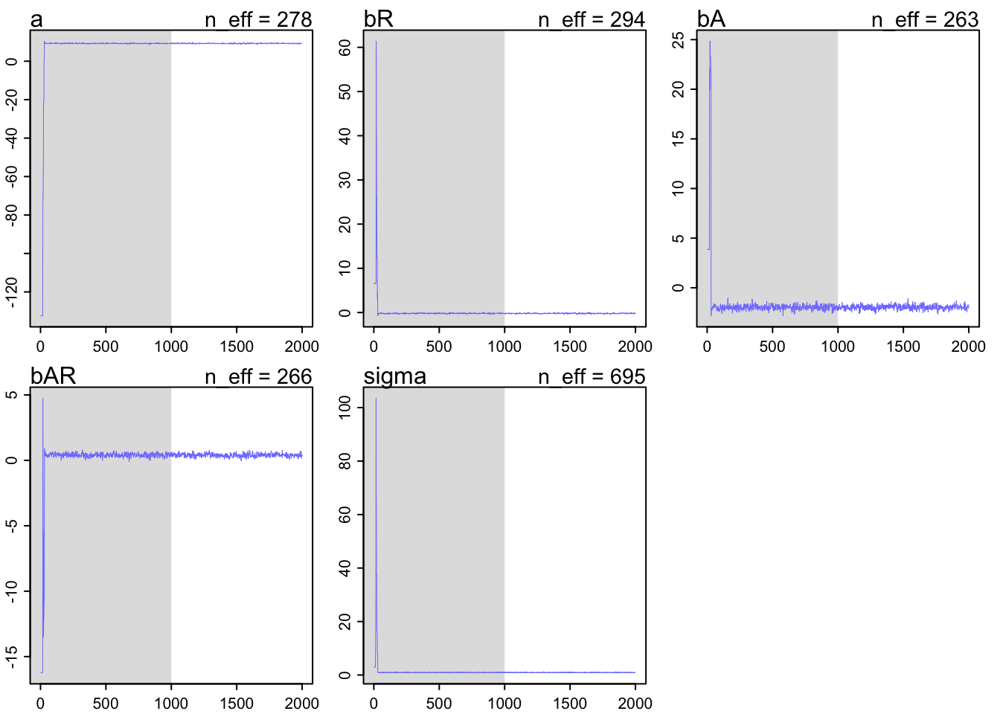

```r
plot(m8m3.stan.warm50)
```

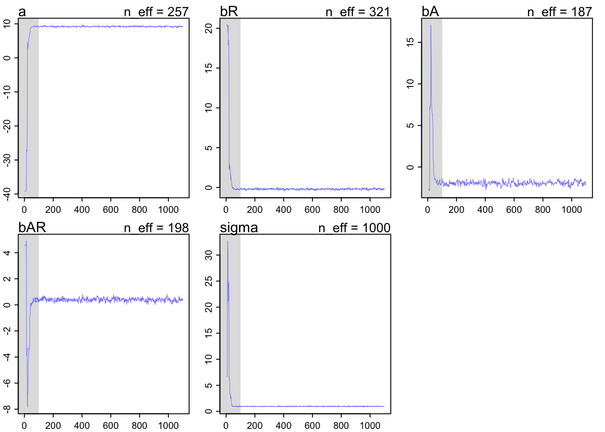

```r
plot(m8m3.stan.warm10)
```

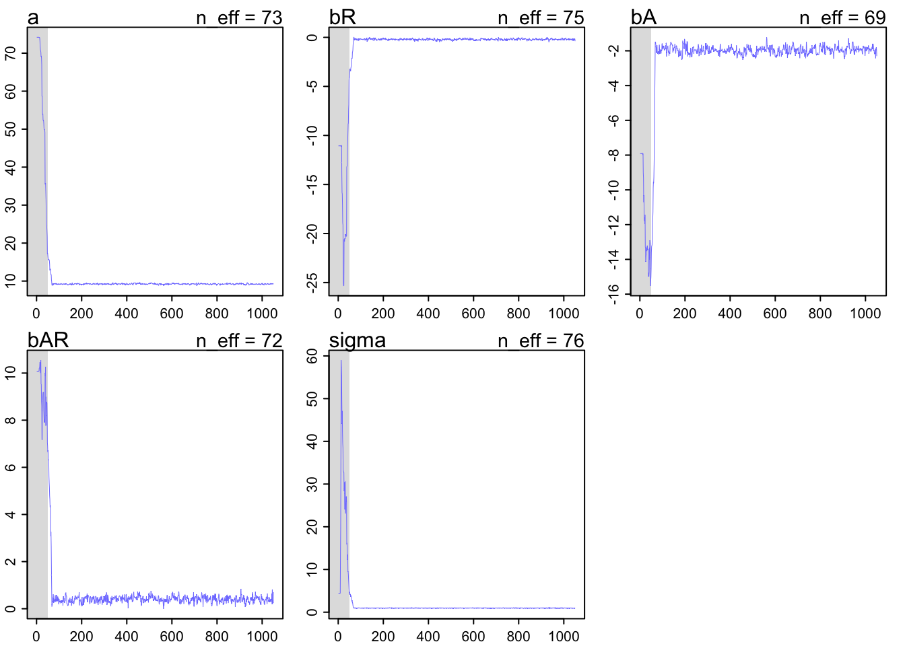

```r
plot(m8m3.stan.warm2)
```

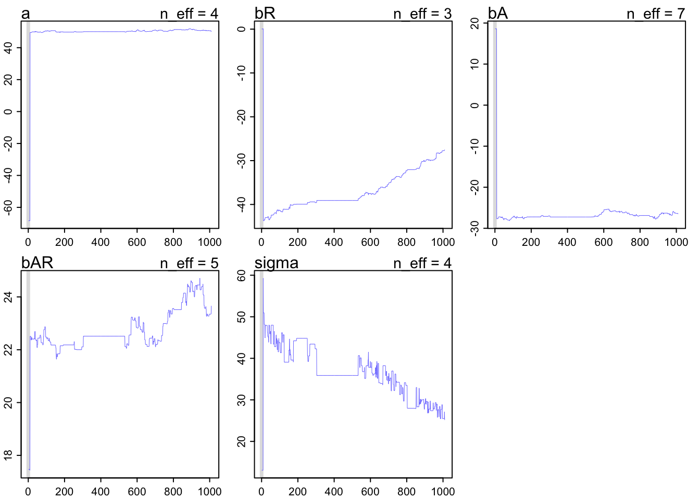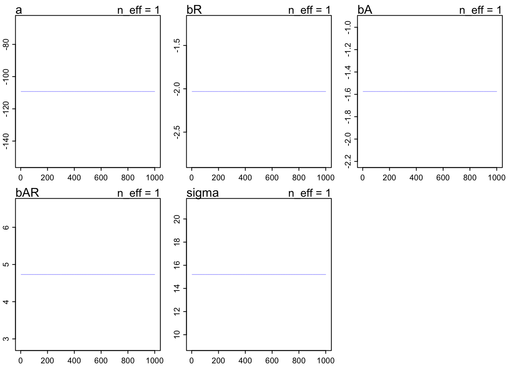


```r
compare(m8m3.stan.warm1000,m8m3.stan.warm100,m8m3.stan.warm50,m8m3.stan.warm10,m8m3.stan.warm2)
```

```
##                        WAIC pWAIC    dWAIC weight       SE      dSE
## m8m3.stan.warm50      468.2   4.6      0.0   0.45    14.76       NA
## m8m3.stan.warm1000    468.6   4.8      0.4   0.36    14.70     0.30
## m8m3.stan.warm100     469.8   5.4      1.7   0.19    14.76     0.35
## m8m3.stan.warm10     4134.5   0.0   3666.3   0.00   122.80   123.82
## m8m3.stan.warm2    345309.3   0.0 344841.2   0.00 18414.24 18466.36
```


Things seem good with 100 warmups and even 50 but certinly not with 10 or 2; the number of effective samples drops to 1 and this is also clear from the chain traces


## 8H1

Run the model below and then inspect the posterior distubition and explain what it is accomplishing.  Compare the samples for the parameters a and b.  Can you explain the difference given what you know about the Cauchy distribution.


```r
mp <- map2stan(
    alist(
        a ~ dnorm(0,1),
        b ~ dcauchy(0,1)
    ),
    data=list(y=1),
    start=list(a=0,b=0),
    iter=1e4, warmup=100 , WAIC=FALSE )
```

```
## 
## SAMPLING FOR MODEL 'a ~ dnorm(0, 1)' NOW (CHAIN 1).
## WARNING: The initial buffer, adaptation window, and terminal buffer
##          overflow the total number of warmup iterations.
##          Defaulting to a 15%/75%/10% partition,
##            init_buffer = 15
##            adapt_window = 75
##            term_buffer = 10
## 
## 
## Chain 1, Iteration:    1 / 10000 [  0%]  (Warmup)
## Chain 1, Iteration:  101 / 10000 [  1%]  (Sampling)
## Chain 1, Iteration: 1100 / 10000 [ 11%]  (Sampling)
## Chain 1, Iteration: 2100 / 10000 [ 21%]  (Sampling)
## Chain 1, Iteration: 3100 / 10000 [ 31%]  (Sampling)
## Chain 1, Iteration: 4100 / 10000 [ 41%]  (Sampling)
## Chain 1, Iteration: 5100 / 10000 [ 51%]  (Sampling)
## Chain 1, Iteration: 6100 / 10000 [ 61%]  (Sampling)
## Chain 1, Iteration: 7100 / 10000 [ 71%]  (Sampling)
## Chain 1, Iteration: 8100 / 10000 [ 81%]  (Sampling)
## Chain 1, Iteration: 9100 / 10000 [ 91%]  (Sampling)
## Chain 1, Iteration: 10000 / 10000 [100%]  (Sampling)
##  Elapsed Time: 0.002679 seconds (Warm-up)
##                0.394272 seconds (Sampling)
##                0.396951 seconds (Total)
## 
## 
## SAMPLING FOR MODEL 'a ~ dnorm(0, 1)' NOW (CHAIN 1).
## WARNING: No variance estimation is
##          performed for num_warmup < 20
## 
## 
## Chain 1, Iteration: 1 / 1 [100%]  (Sampling)
##  Elapsed Time: 5e-06 seconds (Warm-up)
##                2.5e-05 seconds (Sampling)
##                3e-05 seconds (Total)
```

For starters this is a wierd little setup.  data is define as y=1 but this is not references in a formula.  I assume that the value of y does not actually matter.  So I think this is just giving us the normal and Cauchy distributions for a and b.  Will check...


```r
precis(mp)
```

```
##     Mean  StdDev lower 0.89 upper 0.89 n_eff Rhat
## a  -0.02    1.05      -1.67       1.67  9900 1.00
## b 360.51 2200.82      -7.67      11.09    39 1.03
```

```r
plot(precis(mp))
```

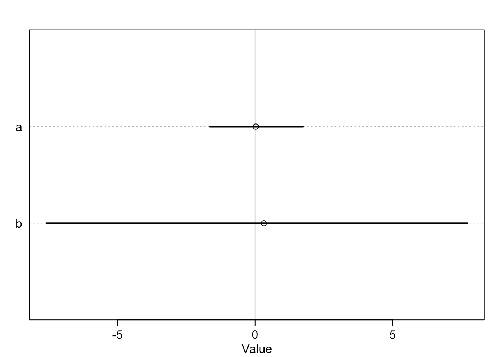

These show us that a has a mean of ~0 and a SD of ~1, as expected from the normal distribution.  b also has a mean of 0 but a much broader SD. This fits with Cauchy being a "thick-tailed" distribution.

Looking at the traces...


```r
plot(mp)
```

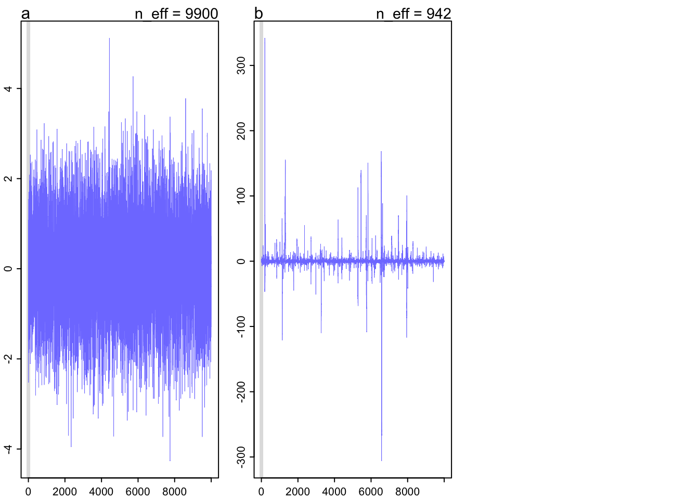

We see that the Cauchy distribution has some very extreme values.  This fits of it being equivalent to the ratio of random draws from two Guassian distributions.  It is easy to obtain an "extreme" value.

Compare to the respective random functions.

```r
norm.df <- melt(data.frame(posterior=extract.samples(mp)$a,
                           rnorm=rnorm(9900,0,1)))
```

```
## No id variables; using all as measure variables
```

```
## Warning: attributes are not identical across measure variables; they will
## be dropped
```

```r
qplot(x=value,fill=variable,alpha=0.1,data=norm.df,geom="density",main="normal")
```

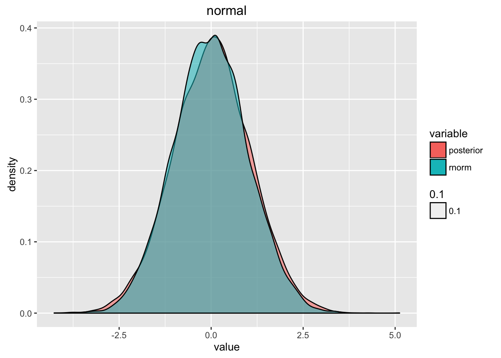

```r
cauchy.df <- melt(data.frame(posterior=extract.samples(mp)$b,
                             rcauchy=rcauchy(9900,0,1)))
```

```
## No id variables; using all as measure variables
```

```
## Warning: attributes are not identical across measure variables; they will
## be dropped
```

```r
qplot(x=value,fill=variable,alpha=0.1,data=cauchy.df,geom="density",main="normal")
```

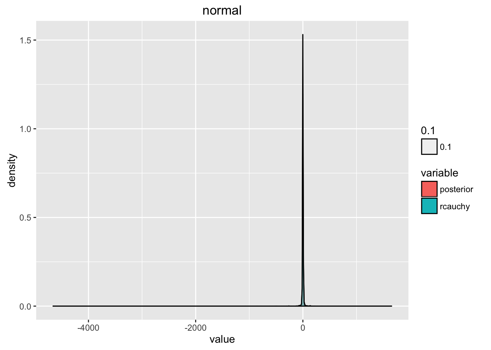

```r
qplot(x=value,fill=variable,alpha=0.1,data=cauchy.df,geom="density",main="cauchy") + scale_x_log10()
```

```
## Warning in self$trans$transform(x): NaNs produced
```

```
## Warning: Removed 9750 rows containing non-finite values (stat_density).
```

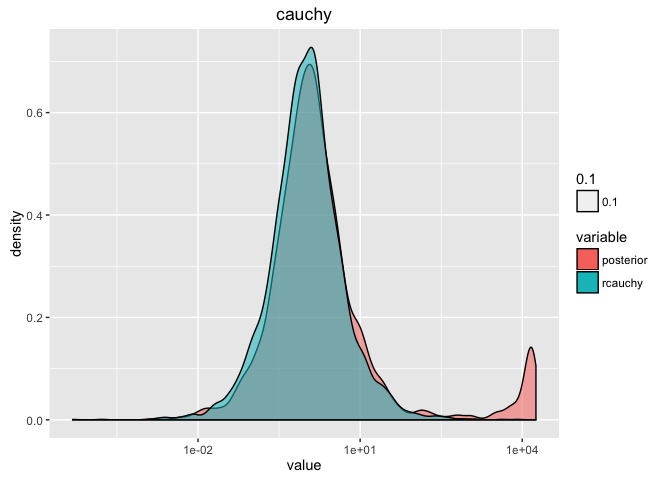

Note that the last plot is not really correct; samples near 0 were dropped due to the log transformation.

## 8H2

Recall the Divorce Rate data set.  Repeat the analyses of models 5.1, 5.2, and 5.3, but with map2stan.  Use compare to compare the fits on WAIC.  Explain.


```r
data(WaffleDivorce)
d <- WaffleDivorce
# standardize predictor
d$MedianAgeMarriage.s <- (d$MedianAgeMarriage-mean(d$MedianAgeMarriage))/
  sd(d$MedianAgeMarriage)
  d$Marriage.s <- (d$Marriage - mean(d$Marriage))/sd(d$Marriage)
```


fit model map models

```r
m5.1 <- map(
  alist(
    Divorce ~ dnorm( mu , sigma ) ,
    mu <- a + bA * MedianAgeMarriage.s ,
    a ~ dnorm( 10 , 10 ) ,
    bA ~ dnorm( 0 , 1 ) ,
    sigma ~ dunif( 0 , 10 )
  ) , data = d )

m5.2 <- map(
  alist(
    Divorce ~ dnorm( mu , sigma ) ,
    mu <- a + bR * Marriage.s ,
    a ~ dnorm( 10 , 10 ) ,
    bR ~ dnorm( 0 , 1 ) ,
    sigma ~ dunif( 0 , 10 )
  ) , data = d )

m5.3 <- map(
  alist(
    Divorce ~ dnorm( mu , sigma ) ,
    mu <- a + bR*Marriage.s + bA*MedianAgeMarriage.s ,
    a ~ dnorm( 10 , 10 ) ,
    bR ~ dnorm( 0 , 1 ) ,
    bA ~ dnorm( 0 , 1 ) ,
    sigma ~ dunif( 0 , 10 )
  ),
  data = d )
```

fit stan models

```r
m5.1.stan <- map2stan(
  alist(
    Divorce ~ dnorm( mu , sigma ) ,
    mu <- a + bA * MedianAgeMarriage.s ,
    a ~ dnorm( 10 , 10 ) ,
    bA ~ dnorm( 0 , 1 ) ,
    sigma ~ dunif( 0 , 10 )
  ) , data = d, chains=4 )
```

```
## Warning: Variable 'Marriage.SE' contains dots '.'.
## Will attempt to remove dots internally.
```

```
## Warning: Variable 'Divorce.SE' contains dots '.'.
## Will attempt to remove dots internally.
```

```
## Warning: Variable 'MedianAgeMarriage.s' contains dots '.'.
## Will attempt to remove dots internally.
```

```
## Warning: Variable 'Marriage.s' contains dots '.'.
## Will attempt to remove dots internally.
```

```
## Warning in FUN(X[[i]], ...): data with name Location is not numeric and not
## used
```

```
## Warning in FUN(X[[i]], ...): data with name Loc is not numeric and not used
```

```
## 
## SAMPLING FOR MODEL 'Divorce ~ dnorm(mu, sigma)' NOW (CHAIN 1).
## 
## Chain 1, Iteration:    1 / 2000 [  0%]  (Warmup)
## Chain 1, Iteration:  200 / 2000 [ 10%]  (Warmup)
## Chain 1, Iteration:  400 / 2000 [ 20%]  (Warmup)
## Chain 1, Iteration:  600 / 2000 [ 30%]  (Warmup)
## Chain 1, Iteration:  800 / 2000 [ 40%]  (Warmup)
## Chain 1, Iteration: 1000 / 2000 [ 50%]  (Warmup)
## Chain 1, Iteration: 1001 / 2000 [ 50%]  (Sampling)
## Chain 1, Iteration: 1200 / 2000 [ 60%]  (Sampling)
## Chain 1, Iteration: 1400 / 2000 [ 70%]  (Sampling)
## Chain 1, Iteration: 1600 / 2000 [ 80%]  (Sampling)
## Chain 1, Iteration: 1800 / 2000 [ 90%]  (Sampling)
## Chain 1, Iteration: 2000 / 2000 [100%]  (Sampling)
##  Elapsed Time: 0.020953 seconds (Warm-up)
##                0.023324 seconds (Sampling)
##                0.044277 seconds (Total)
## 
## 
## SAMPLING FOR MODEL 'Divorce ~ dnorm(mu, sigma)' NOW (CHAIN 2).
## 
## Chain 2, Iteration:    1 / 2000 [  0%]  (Warmup)
## Chain 2, Iteration:  200 / 2000 [ 10%]  (Warmup)
## Chain 2, Iteration:  400 / 2000 [ 20%]  (Warmup)
## Chain 2, Iteration:  600 / 2000 [ 30%]  (Warmup)
## Chain 2, Iteration:  800 / 2000 [ 40%]  (Warmup)
## Chain 2, Iteration: 1000 / 2000 [ 50%]  (Warmup)
## Chain 2, Iteration: 1001 / 2000 [ 50%]  (Sampling)
## Chain 2, Iteration: 1200 / 2000 [ 60%]  (Sampling)
## Chain 2, Iteration: 1400 / 2000 [ 70%]  (Sampling)
## Chain 2, Iteration: 1600 / 2000 [ 80%]  (Sampling)
## Chain 2, Iteration: 1800 / 2000 [ 90%]  (Sampling)
## Chain 2, Iteration: 2000 / 2000 [100%]  (Sampling)
##  Elapsed Time: 0.023005 seconds (Warm-up)
##                0.019616 seconds (Sampling)
##                0.042621 seconds (Total)
## 
## 
## SAMPLING FOR MODEL 'Divorce ~ dnorm(mu, sigma)' NOW (CHAIN 3).
## 
## Chain 3, Iteration:    1 / 2000 [  0%]  (Warmup)
## Chain 3, Iteration:  200 / 2000 [ 10%]  (Warmup)
## Chain 3, Iteration:  400 / 2000 [ 20%]  (Warmup)
## Chain 3, Iteration:  600 / 2000 [ 30%]  (Warmup)
## Chain 3, Iteration:  800 / 2000 [ 40%]  (Warmup)
## Chain 3, Iteration: 1000 / 2000 [ 50%]  (Warmup)
## Chain 3, Iteration: 1001 / 2000 [ 50%]  (Sampling)
## Chain 3, Iteration: 1200 / 2000 [ 60%]  (Sampling)
## Chain 3, Iteration: 1400 / 2000 [ 70%]  (Sampling)
## Chain 3, Iteration: 1600 / 2000 [ 80%]  (Sampling)
## Chain 3, Iteration: 1800 / 2000 [ 90%]  (Sampling)
## Chain 3, Iteration: 2000 / 2000 [100%]  (Sampling)
##  Elapsed Time: 0.021403 seconds (Warm-up)
##                0.019855 seconds (Sampling)
##                0.041258 seconds (Total)
## 
## 
## SAMPLING FOR MODEL 'Divorce ~ dnorm(mu, sigma)' NOW (CHAIN 4).
## 
## Chain 4, Iteration:    1 / 2000 [  0%]  (Warmup)
## Chain 4, Iteration:  200 / 2000 [ 10%]  (Warmup)
## Chain 4, Iteration:  400 / 2000 [ 20%]  (Warmup)
## Chain 4, Iteration:  600 / 2000 [ 30%]  (Warmup)
## Chain 4, Iteration:  800 / 2000 [ 40%]  (Warmup)
## Chain 4, Iteration: 1000 / 2000 [ 50%]  (Warmup)
## Chain 4, Iteration: 1001 / 2000 [ 50%]  (Sampling)
## Chain 4, Iteration: 1200 / 2000 [ 60%]  (Sampling)
## Chain 4, Iteration: 1400 / 2000 [ 70%]  (Sampling)
## Chain 4, Iteration: 1600 / 2000 [ 80%]  (Sampling)
## Chain 4, Iteration: 1800 / 2000 [ 90%]  (Sampling)
## Chain 4, Iteration: 2000 / 2000 [100%]  (Sampling)
##  Elapsed Time: 0.022668 seconds (Warm-up)
##                0.019391 seconds (Sampling)
##                0.042059 seconds (Total)
```

```
## Warning in FUN(X[[i]], ...): data with name Location is not numeric and not
## used

## Warning in FUN(X[[i]], ...): data with name Loc is not numeric and not used
```

```
## 
## SAMPLING FOR MODEL 'Divorce ~ dnorm(mu, sigma)' NOW (CHAIN 1).
## WARNING: No variance estimation is
##          performed for num_warmup < 20
## 
## 
## Chain 1, Iteration: 1 / 1 [100%]  (Sampling)
##  Elapsed Time: 3e-06 seconds (Warm-up)
##                2.6e-05 seconds (Sampling)
##                2.9e-05 seconds (Total)
```

```
## Computing WAIC
```

```
## Constructing posterior predictions
```

```
## [ 400 / 4000 ]
[ 800 / 4000 ]
[ 1200 / 4000 ]
[ 1600 / 4000 ]
[ 2000 / 4000 ]
[ 2400 / 4000 ]
[ 2800 / 4000 ]
[ 3200 / 4000 ]
[ 3600 / 4000 ]
[ 4000 / 4000 ]
```

```r
m5.2.stan <- map2stan(
  alist(
    Divorce ~ dnorm( mu , sigma ) ,
    mu <- a + bR * Marriage.s ,
    a ~ dnorm( 10 , 10 ) ,
    bR ~ dnorm( 0 , 1 ) ,
    sigma ~ dunif( 0 , 10 )
  ) , data = d, chains=4 )
```

```
## Warning: Variable 'Marriage.SE' contains dots '.'.
## Will attempt to remove dots internally.
```

```
## Warning: Variable 'Divorce.SE' contains dots '.'.
## Will attempt to remove dots internally.
```

```
## Warning: Variable 'MedianAgeMarriage.s' contains dots '.'.
## Will attempt to remove dots internally.
```

```
## Warning: Variable 'Marriage.s' contains dots '.'.
## Will attempt to remove dots internally.
```

```
## Warning in FUN(X[[i]], ...): data with name Location is not numeric and not
## used

## Warning in FUN(X[[i]], ...): data with name Loc is not numeric and not used
```

```
## 
## SAMPLING FOR MODEL 'Divorce ~ dnorm(mu, sigma)' NOW (CHAIN 1).
## 
## Chain 1, Iteration:    1 / 2000 [  0%]  (Warmup)
## Chain 1, Iteration:  200 / 2000 [ 10%]  (Warmup)
## Chain 1, Iteration:  400 / 2000 [ 20%]  (Warmup)
## Chain 1, Iteration:  600 / 2000 [ 30%]  (Warmup)
## Chain 1, Iteration:  800 / 2000 [ 40%]  (Warmup)
## Chain 1, Iteration: 1000 / 2000 [ 50%]  (Warmup)
## Chain 1, Iteration: 1001 / 2000 [ 50%]  (Sampling)
## Chain 1, Iteration: 1200 / 2000 [ 60%]  (Sampling)
## Chain 1, Iteration: 1400 / 2000 [ 70%]  (Sampling)
## Chain 1, Iteration: 1600 / 2000 [ 80%]  (Sampling)
## Chain 1, Iteration: 1800 / 2000 [ 90%]  (Sampling)
## Chain 1, Iteration: 2000 / 2000 [100%]  (Sampling)
##  Elapsed Time: 0.023494 seconds (Warm-up)
##                0.019531 seconds (Sampling)
##                0.043025 seconds (Total)
## 
## 
## SAMPLING FOR MODEL 'Divorce ~ dnorm(mu, sigma)' NOW (CHAIN 2).
## 
## Chain 2, Iteration:    1 / 2000 [  0%]  (Warmup)
## Chain 2, Iteration:  200 / 2000 [ 10%]  (Warmup)
## Chain 2, Iteration:  400 / 2000 [ 20%]  (Warmup)
## Chain 2, Iteration:  600 / 2000 [ 30%]  (Warmup)
## Chain 2, Iteration:  800 / 2000 [ 40%]  (Warmup)
## Chain 2, Iteration: 1000 / 2000 [ 50%]  (Warmup)
## Chain 2, Iteration: 1001 / 2000 [ 50%]  (Sampling)
## Chain 2, Iteration: 1200 / 2000 [ 60%]  (Sampling)
## Chain 2, Iteration: 1400 / 2000 [ 70%]  (Sampling)
## Chain 2, Iteration: 1600 / 2000 [ 80%]  (Sampling)
## Chain 2, Iteration: 1800 / 2000 [ 90%]  (Sampling)
## Chain 2, Iteration: 2000 / 2000 [100%]  (Sampling)
##  Elapsed Time: 0.021688 seconds (Warm-up)
##                0.019894 seconds (Sampling)
##                0.041582 seconds (Total)
## 
## 
## SAMPLING FOR MODEL 'Divorce ~ dnorm(mu, sigma)' NOW (CHAIN 3).
## 
## Chain 3, Iteration:    1 / 2000 [  0%]  (Warmup)
## Chain 3, Iteration:  200 / 2000 [ 10%]  (Warmup)
## Chain 3, Iteration:  400 / 2000 [ 20%]  (Warmup)
## Chain 3, Iteration:  600 / 2000 [ 30%]  (Warmup)
## Chain 3, Iteration:  800 / 2000 [ 40%]  (Warmup)
## Chain 3, Iteration: 1000 / 2000 [ 50%]  (Warmup)
## Chain 3, Iteration: 1001 / 2000 [ 50%]  (Sampling)
## Chain 3, Iteration: 1200 / 2000 [ 60%]  (Sampling)
## Chain 3, Iteration: 1400 / 2000 [ 70%]  (Sampling)
## Chain 3, Iteration: 1600 / 2000 [ 80%]  (Sampling)
## Chain 3, Iteration: 1800 / 2000 [ 90%]  (Sampling)
## Chain 3, Iteration: 2000 / 2000 [100%]  (Sampling)
##  Elapsed Time: 0.021286 seconds (Warm-up)
##                0.020528 seconds (Sampling)
##                0.041814 seconds (Total)
## 
## 
## SAMPLING FOR MODEL 'Divorce ~ dnorm(mu, sigma)' NOW (CHAIN 4).
## 
## Chain 4, Iteration:    1 / 2000 [  0%]  (Warmup)
## Chain 4, Iteration:  200 / 2000 [ 10%]  (Warmup)
## Chain 4, Iteration:  400 / 2000 [ 20%]  (Warmup)
## Chain 4, Iteration:  600 / 2000 [ 30%]  (Warmup)
## Chain 4, Iteration:  800 / 2000 [ 40%]  (Warmup)
## Chain 4, Iteration: 1000 / 2000 [ 50%]  (Warmup)
## Chain 4, Iteration: 1001 / 2000 [ 50%]  (Sampling)
## Chain 4, Iteration: 1200 / 2000 [ 60%]  (Sampling)
## Chain 4, Iteration: 1400 / 2000 [ 70%]  (Sampling)
## Chain 4, Iteration: 1600 / 2000 [ 80%]  (Sampling)
## Chain 4, Iteration: 1800 / 2000 [ 90%]  (Sampling)
## Chain 4, Iteration: 2000 / 2000 [100%]  (Sampling)
##  Elapsed Time: 0.021274 seconds (Warm-up)
##                0.021162 seconds (Sampling)
##                0.042436 seconds (Total)
```

```
## Warning in FUN(X[[i]], ...): data with name Location is not numeric and not
## used

## Warning in FUN(X[[i]], ...): data with name Loc is not numeric and not used
```

```
## 
## SAMPLING FOR MODEL 'Divorce ~ dnorm(mu, sigma)' NOW (CHAIN 1).
## WARNING: No variance estimation is
##          performed for num_warmup < 20
## 
## 
## Chain 1, Iteration: 1 / 1 [100%]  (Sampling)
##  Elapsed Time: 4e-06 seconds (Warm-up)
##                0.000142 seconds (Sampling)
##                0.000146 seconds (Total)
```

```
## Computing WAIC
```

```
## Constructing posterior predictions
```

```
## [ 400 / 4000 ]
[ 800 / 4000 ]
[ 1200 / 4000 ]
[ 1600 / 4000 ]
[ 2000 / 4000 ]
[ 2400 / 4000 ]
[ 2800 / 4000 ]
[ 3200 / 4000 ]
[ 3600 / 4000 ]
[ 4000 / 4000 ]
```

```r
m5.3.stan <- map2stan(
  alist(
    Divorce ~ dnorm( mu , sigma ) ,
    mu <- a + bR*Marriage.s + bA*MedianAgeMarriage.s ,
    a ~ dnorm( 10 , 10 ) ,
    bR ~ dnorm( 0 , 1 ) ,
    bA ~ dnorm( 0 , 1 ) ,
    sigma ~ dunif( 0 , 10 )
  ),
  data = d,chains=4 )
```

```
## Warning: Variable 'Marriage.SE' contains dots '.'.
## Will attempt to remove dots internally.
```

```
## Warning: Variable 'Divorce.SE' contains dots '.'.
## Will attempt to remove dots internally.
```

```
## Warning: Variable 'MedianAgeMarriage.s' contains dots '.'.
## Will attempt to remove dots internally.
```

```
## Warning: Variable 'Marriage.s' contains dots '.'.
## Will attempt to remove dots internally.
```

```
## Warning in FUN(X[[i]], ...): data with name Location is not numeric and not
## used

## Warning in FUN(X[[i]], ...): data with name Loc is not numeric and not used
```

```
## 
## SAMPLING FOR MODEL 'Divorce ~ dnorm(mu, sigma)' NOW (CHAIN 1).
## 
## Chain 1, Iteration:    1 / 2000 [  0%]  (Warmup)
## Chain 1, Iteration:  200 / 2000 [ 10%]  (Warmup)
## Chain 1, Iteration:  400 / 2000 [ 20%]  (Warmup)
## Chain 1, Iteration:  600 / 2000 [ 30%]  (Warmup)
## Chain 1, Iteration:  800 / 2000 [ 40%]  (Warmup)
## Chain 1, Iteration: 1000 / 2000 [ 50%]  (Warmup)
## Chain 1, Iteration: 1001 / 2000 [ 50%]  (Sampling)
## Chain 1, Iteration: 1200 / 2000 [ 60%]  (Sampling)
## Chain 1, Iteration: 1400 / 2000 [ 70%]  (Sampling)
## Chain 1, Iteration: 1600 / 2000 [ 80%]  (Sampling)
## Chain 1, Iteration: 1800 / 2000 [ 90%]  (Sampling)
## Chain 1, Iteration: 2000 / 2000 [100%]  (Sampling)
##  Elapsed Time: 0.03842 seconds (Warm-up)
##                0.038609 seconds (Sampling)
##                0.077029 seconds (Total)
## 
## 
## SAMPLING FOR MODEL 'Divorce ~ dnorm(mu, sigma)' NOW (CHAIN 2).
## 
## Chain 2, Iteration:    1 / 2000 [  0%]  (Warmup)
## Chain 2, Iteration:  200 / 2000 [ 10%]  (Warmup)
## Chain 2, Iteration:  400 / 2000 [ 20%]  (Warmup)
## Chain 2, Iteration:  600 / 2000 [ 30%]  (Warmup)
## Chain 2, Iteration:  800 / 2000 [ 40%]  (Warmup)
## Chain 2, Iteration: 1000 / 2000 [ 50%]  (Warmup)
## Chain 2, Iteration: 1001 / 2000 [ 50%]  (Sampling)
## Chain 2, Iteration: 1200 / 2000 [ 60%]  (Sampling)
## Chain 2, Iteration: 1400 / 2000 [ 70%]  (Sampling)
## Chain 2, Iteration: 1600 / 2000 [ 80%]  (Sampling)
## Chain 2, Iteration: 1800 / 2000 [ 90%]  (Sampling)
## Chain 2, Iteration: 2000 / 2000 [100%]  (Sampling)
##  Elapsed Time: 0.038474 seconds (Warm-up)
##                0.035733 seconds (Sampling)
##                0.074207 seconds (Total)
## 
## 
## SAMPLING FOR MODEL 'Divorce ~ dnorm(mu, sigma)' NOW (CHAIN 3).
## 
## Chain 3, Iteration:    1 / 2000 [  0%]  (Warmup)
## Chain 3, Iteration:  200 / 2000 [ 10%]  (Warmup)
## Chain 3, Iteration:  400 / 2000 [ 20%]  (Warmup)
## Chain 3, Iteration:  600 / 2000 [ 30%]  (Warmup)
## Chain 3, Iteration:  800 / 2000 [ 40%]  (Warmup)
## Chain 3, Iteration: 1000 / 2000 [ 50%]  (Warmup)
## Chain 3, Iteration: 1001 / 2000 [ 50%]  (Sampling)
## Chain 3, Iteration: 1200 / 2000 [ 60%]  (Sampling)
## Chain 3, Iteration: 1400 / 2000 [ 70%]  (Sampling)
## Chain 3, Iteration: 1600 / 2000 [ 80%]  (Sampling)
## Chain 3, Iteration: 1800 / 2000 [ 90%]  (Sampling)
## Chain 3, Iteration: 2000 / 2000 [100%]  (Sampling)
##  Elapsed Time: 0.037325 seconds (Warm-up)
##                0.035289 seconds (Sampling)
##                0.072614 seconds (Total)
## 
## 
## SAMPLING FOR MODEL 'Divorce ~ dnorm(mu, sigma)' NOW (CHAIN 4).
## 
## Chain 4, Iteration:    1 / 2000 [  0%]  (Warmup)
## Chain 4, Iteration:  200 / 2000 [ 10%]  (Warmup)
## Chain 4, Iteration:  400 / 2000 [ 20%]  (Warmup)
## Chain 4, Iteration:  600 / 2000 [ 30%]  (Warmup)
## Chain 4, Iteration:  800 / 2000 [ 40%]  (Warmup)
## Chain 4, Iteration: 1000 / 2000 [ 50%]  (Warmup)
## Chain 4, Iteration: 1001 / 2000 [ 50%]  (Sampling)
## Chain 4, Iteration: 1200 / 2000 [ 60%]  (Sampling)
## Chain 4, Iteration: 1400 / 2000 [ 70%]  (Sampling)
## Chain 4, Iteration: 1600 / 2000 [ 80%]  (Sampling)
## Chain 4, Iteration: 1800 / 2000 [ 90%]  (Sampling)
## Chain 4, Iteration: 2000 / 2000 [100%]  (Sampling)
##  Elapsed Time: 0.036913 seconds (Warm-up)
##                0.036544 seconds (Sampling)
##                0.073457 seconds (Total)
```

```
## Warning in FUN(X[[i]], ...): data with name Location is not numeric and not
## used

## Warning in FUN(X[[i]], ...): data with name Loc is not numeric and not used
```

```
## 
## SAMPLING FOR MODEL 'Divorce ~ dnorm(mu, sigma)' NOW (CHAIN 1).
## WARNING: No variance estimation is
##          performed for num_warmup < 20
## 
## 
## Chain 1, Iteration: 1 / 1 [100%]  (Sampling)
##  Elapsed Time: 3e-06 seconds (Warm-up)
##                2.8e-05 seconds (Sampling)
##                3.1e-05 seconds (Total)
```

```
## Computing WAIC
```

```
## Constructing posterior predictions
```

```
## [ 400 / 4000 ]
[ 800 / 4000 ]
[ 1200 / 4000 ]
[ 1600 / 4000 ]
[ 2000 / 4000 ]
[ 2400 / 4000 ]
[ 2800 / 4000 ]
[ 3200 / 4000 ]
[ 3600 / 4000 ]
[ 4000 / 4000 ]
```

Not clear if the problem asks us to compare from stan to map or to compare within each engine type.  Do both.

map vs stan

```r
compare(m5.1,m5.1.stan)
```

```
## Warning in compare(m5.1, m5.1.stan): Not all model fits of same class.
## This is usually a bad idea, because it implies they were fit by different algorithms.
## Check yourself, before you wreck yourself.
```

```
##            WAIC pWAIC dWAIC weight    SE  dSE
## m5.1.stan 186.6   4.0   0.0   0.58 12.42   NA
## m5.1      187.3   4.6   0.7   0.42 14.06 1.66
```

```r
compare(m5.2,m5.2.stan)
```

```
## Warning in compare(m5.2, m5.2.stan): Not all model fits of same class.
## This is usually a bad idea, because it implies they were fit by different algorithms.
## Check yourself, before you wreck yourself.
```

```
##            WAIC pWAIC dWAIC weight    SE  dSE
## m5.2.stan 200.6   3.5   0.0   0.52  9.58   NA
## m5.2      200.8   3.9   0.2   0.48 10.92 1.37
```

```r
compare(m5.3,m5.3.stan)
```

```
## Warning in compare(m5.3, m5.3.stan): Not all model fits of same class.
## This is usually a bad idea, because it implies they were fit by different algorithms.
## Check yourself, before you wreck yourself.
```

```
##            WAIC pWAIC dWAIC weight    SE  dSE
## m5.3.stan 187.9   4.8   0.0   0.67 12.44   NA
## m5.3      189.3   5.8   1.4   0.33 14.46 2.08
```

different models

```r
compare(m5.1,m5.2,m5.3)
```

```
##       WAIC pWAIC dWAIC weight    SE   dSE
## m5.1 187.7   4.8   0.0   0.79 14.34    NA
## m5.3 190.4   6.5   2.7   0.21 15.07  1.13
## m5.2 201.0   4.0  13.3   0.00 10.92 10.60
```

```r
compare(m5.1.stan,m5.2.stan,m5.3.stan)
```

```
##            WAIC pWAIC dWAIC weight    SE  dSE
## m5.1.stan 186.6   4.0   0.0   0.65 12.42   NA
## m5.3.stan 187.9   4.8   1.2   0.35 12.44 0.77
## m5.2.stan 200.6   3.5  14.0   0.00  9.58 9.16
```

Either way the fits and conclusions are pretty comparable.  Is this what the point was?

## 8H3

Sometimes changes a prior for one parameter has unanticipated effects on other parameters. This can occur when the parameters are highly correlated in the posterior. Work and think through the following example.

Simulate leg length and height for 100 individuals

```r
N <- 100
height <- rnorm(N,10,2)
leg_prop <- runif(N,0.4,0.5)
leg_left <- leg_prop*height +
    rnorm( N , 0 , 0.02 )
leg_right <- leg_prop*height +
    rnorm( N , 0 , 0.02 )
d <- data.frame(height,leg_left,leg_right)
```

Original priors, now fit with Stan

```r
m5.8s <- map2stan(
    alist(
        height ~ dnorm( mu , sigma ) ,
        mu <- a + bl*leg_left + br*leg_right ,
        a ~ dnorm( 10 , 100 ) ,
        bl ~ dnorm( 2 , 10 ) ,
        br ~ dnorm( 2 , 10 ) ,
        sigma ~ dcauchy( 0 , 1 )
),
data=d, chains=4, start=list(a=10,bl=0,br=0,sigma=1) )
```

```
## 
## SAMPLING FOR MODEL 'height ~ dnorm(mu, sigma)' NOW (CHAIN 1).
## 
## Chain 1, Iteration:    1 / 2000 [  0%]  (Warmup)
## Chain 1, Iteration:  200 / 2000 [ 10%]  (Warmup)
## Chain 1, Iteration:  400 / 2000 [ 20%]  (Warmup)
## Chain 1, Iteration:  600 / 2000 [ 30%]  (Warmup)
## Chain 1, Iteration:  800 / 2000 [ 40%]  (Warmup)
## Chain 1, Iteration: 1000 / 2000 [ 50%]  (Warmup)
## Chain 1, Iteration: 1001 / 2000 [ 50%]  (Sampling)
## Chain 1, Iteration: 1200 / 2000 [ 60%]  (Sampling)
## Chain 1, Iteration: 1400 / 2000 [ 70%]  (Sampling)
## Chain 1, Iteration: 1600 / 2000 [ 80%]  (Sampling)
## Chain 1, Iteration: 1800 / 2000 [ 90%]  (Sampling)
## Chain 1, Iteration: 2000 / 2000 [100%]  (Sampling)
##  Elapsed Time: 3.08304 seconds (Warm-up)
##                4.73228 seconds (Sampling)
##                7.81531 seconds (Total)
## 
## 
## SAMPLING FOR MODEL 'height ~ dnorm(mu, sigma)' NOW (CHAIN 2).
## 
## Chain 2, Iteration:    1 / 2000 [  0%]  (Warmup)
## Chain 2, Iteration:  200 / 2000 [ 10%]  (Warmup)
## Chain 2, Iteration:  400 / 2000 [ 20%]  (Warmup)
## Chain 2, Iteration:  600 / 2000 [ 30%]  (Warmup)
## Chain 2, Iteration:  800 / 2000 [ 40%]  (Warmup)
## Chain 2, Iteration: 1000 / 2000 [ 50%]  (Warmup)
## Chain 2, Iteration: 1001 / 2000 [ 50%]  (Sampling)
## Chain 2, Iteration: 1200 / 2000 [ 60%]  (Sampling)
## Chain 2, Iteration: 1400 / 2000 [ 70%]  (Sampling)
## Chain 2, Iteration: 1600 / 2000 [ 80%]  (Sampling)
## Chain 2, Iteration: 1800 / 2000 [ 90%]  (Sampling)
## Chain 2, Iteration: 2000 / 2000 [100%]  (Sampling)
##  Elapsed Time: 3.07835 seconds (Warm-up)
##                4.53165 seconds (Sampling)
##                7.61 seconds (Total)
## 
## 
## SAMPLING FOR MODEL 'height ~ dnorm(mu, sigma)' NOW (CHAIN 3).
## 
## Chain 3, Iteration:    1 / 2000 [  0%]  (Warmup)
## Chain 3, Iteration:  200 / 2000 [ 10%]  (Warmup)
## Chain 3, Iteration:  400 / 2000 [ 20%]  (Warmup)
## Chain 3, Iteration:  600 / 2000 [ 30%]  (Warmup)
## Chain 3, Iteration:  800 / 2000 [ 40%]  (Warmup)
## Chain 3, Iteration: 1000 / 2000 [ 50%]  (Warmup)
## Chain 3, Iteration: 1001 / 2000 [ 50%]  (Sampling)
## Chain 3, Iteration: 1200 / 2000 [ 60%]  (Sampling)
## Chain 3, Iteration: 1400 / 2000 [ 70%]  (Sampling)
## Chain 3, Iteration: 1600 / 2000 [ 80%]  (Sampling)
## Chain 3, Iteration: 1800 / 2000 [ 90%]  (Sampling)
## Chain 3, Iteration: 2000 / 2000 [100%]  (Sampling)
##  Elapsed Time: 3.24873 seconds (Warm-up)
##                4.51947 seconds (Sampling)
##                7.7682 seconds (Total)
## 
## 
## SAMPLING FOR MODEL 'height ~ dnorm(mu, sigma)' NOW (CHAIN 4).
## 
## Chain 4, Iteration:    1 / 2000 [  0%]  (Warmup)
## Chain 4, Iteration:  200 / 2000 [ 10%]  (Warmup)
## Chain 4, Iteration:  400 / 2000 [ 20%]  (Warmup)
## Chain 4, Iteration:  600 / 2000 [ 30%]  (Warmup)
## Chain 4, Iteration:  800 / 2000 [ 40%]  (Warmup)
## Chain 4, Iteration: 1000 / 2000 [ 50%]  (Warmup)
## Chain 4, Iteration: 1001 / 2000 [ 50%]  (Sampling)
## Chain 4, Iteration: 1200 / 2000 [ 60%]  (Sampling)
## Chain 4, Iteration: 1400 / 2000 [ 70%]  (Sampling)
## Chain 4, Iteration: 1600 / 2000 [ 80%]  (Sampling)
## Chain 4, Iteration: 1800 / 2000 [ 90%]  (Sampling)
## Chain 4, Iteration: 2000 / 2000 [100%]  (Sampling)
##  Elapsed Time: 3.30181 seconds (Warm-up)
##                4.72257 seconds (Sampling)
##                8.02438 seconds (Total)
## 
## 
## SAMPLING FOR MODEL 'height ~ dnorm(mu, sigma)' NOW (CHAIN 1).
## WARNING: No variance estimation is
##          performed for num_warmup < 20
## 
## 
## Chain 1, Iteration: 1 / 1 [100%]  (Sampling)
##  Elapsed Time: 3e-06 seconds (Warm-up)
##                3.8e-05 seconds (Sampling)
##                4.1e-05 seconds (Total)
```

```
## Computing WAIC
```

```
## Constructing posterior predictions
```

```
## [ 400 / 4000 ]
[ 800 / 4000 ]
[ 1200 / 4000 ]
[ 1600 / 4000 ]
[ 2000 / 4000 ]
[ 2400 / 4000 ]
[ 2800 / 4000 ]
[ 3200 / 4000 ]
[ 3600 / 4000 ]
[ 4000 / 4000 ]
```

Change prior for bR so that it is alway positive:


```r
m5.8s2 <- map2stan(
    alist(
        height ~ dnorm( mu , sigma ) ,
        mu <- a + bl*leg_left + br*leg_right ,
        a ~ dnorm( 10 , 100 ) ,
        bl ~ dnorm( 2 , 10 ) ,
        br ~ dnorm( 2 , 10 ) & T[0,] ,
        sigma ~ dcauchy( 0 , 1 )
),
data=d, chains=4, start=list(a=10,bl=0,br=0,sigma=1) )
```

```
## 
## SAMPLING FOR MODEL 'height ~ dnorm(mu, sigma)' NOW (CHAIN 1).
## 
## Chain 1, Iteration:    1 / 2000 [  0%]  (Warmup)
## Chain 1, Iteration:  200 / 2000 [ 10%]  (Warmup)
## Chain 1, Iteration:  400 / 2000 [ 20%]  (Warmup)
## Chain 1, Iteration:  600 / 2000 [ 30%]  (Warmup)
## Chain 1, Iteration:  800 / 2000 [ 40%]  (Warmup)
## Chain 1, Iteration: 1000 / 2000 [ 50%]  (Warmup)
## Chain 1, Iteration: 1001 / 2000 [ 50%]  (Sampling)
## Chain 1, Iteration: 1200 / 2000 [ 60%]  (Sampling)
## Chain 1, Iteration: 1400 / 2000 [ 70%]  (Sampling)
## Chain 1, Iteration: 1600 / 2000 [ 80%]  (Sampling)
## Chain 1, Iteration: 1800 / 2000 [ 90%]  (Sampling)
## Chain 1, Iteration: 2000 / 2000 [100%]  (Sampling)
##  Elapsed Time: 1.4456 seconds (Warm-up)
##                1.52795 seconds (Sampling)
##                2.97355 seconds (Total)
## 
## 
## SAMPLING FOR MODEL 'height ~ dnorm(mu, sigma)' NOW (CHAIN 2).
## 
## Chain 2, Iteration:    1 / 2000 [  0%]  (Warmup)
## Chain 2, Iteration:  200 / 2000 [ 10%]  (Warmup)
## Chain 2, Iteration:  400 / 2000 [ 20%]  (Warmup)
## Chain 2, Iteration:  600 / 2000 [ 30%]  (Warmup)
## Chain 2, Iteration:  800 / 2000 [ 40%]  (Warmup)
## Chain 2, Iteration: 1000 / 2000 [ 50%]  (Warmup)
## Chain 2, Iteration: 1001 / 2000 [ 50%]  (Sampling)
## Chain 2, Iteration: 1200 / 2000 [ 60%]  (Sampling)
## Chain 2, Iteration: 1400 / 2000 [ 70%]  (Sampling)
## Chain 2, Iteration: 1600 / 2000 [ 80%]  (Sampling)
## Chain 2, Iteration: 1800 / 2000 [ 90%]  (Sampling)
## Chain 2, Iteration: 2000 / 2000 [100%]  (Sampling)
##  Elapsed Time: 1.36797 seconds (Warm-up)
##                1.60056 seconds (Sampling)
##                2.96853 seconds (Total)
## 
## 
## SAMPLING FOR MODEL 'height ~ dnorm(mu, sigma)' NOW (CHAIN 3).
## 
## Chain 3, Iteration:    1 / 2000 [  0%]  (Warmup)
## Chain 3, Iteration:  200 / 2000 [ 10%]  (Warmup)
## Chain 3, Iteration:  400 / 2000 [ 20%]  (Warmup)
## Chain 3, Iteration:  600 / 2000 [ 30%]  (Warmup)
## Chain 3, Iteration:  800 / 2000 [ 40%]  (Warmup)
## Chain 3, Iteration: 1000 / 2000 [ 50%]  (Warmup)
## Chain 3, Iteration: 1001 / 2000 [ 50%]  (Sampling)
## Chain 3, Iteration: 1200 / 2000 [ 60%]  (Sampling)
## Chain 3, Iteration: 1400 / 2000 [ 70%]  (Sampling)
## Chain 3, Iteration: 1600 / 2000 [ 80%]  (Sampling)
## Chain 3, Iteration: 1800 / 2000 [ 90%]  (Sampling)
## Chain 3, Iteration: 2000 / 2000 [100%]  (Sampling)
##  Elapsed Time: 1.52547 seconds (Warm-up)
##                1.36465 seconds (Sampling)
##                2.89012 seconds (Total)
## 
## 
## SAMPLING FOR MODEL 'height ~ dnorm(mu, sigma)' NOW (CHAIN 4).
## 
## Chain 4, Iteration:    1 / 2000 [  0%]  (Warmup)
## Chain 4, Iteration:  200 / 2000 [ 10%]  (Warmup)
## Chain 4, Iteration:  400 / 2000 [ 20%]  (Warmup)
## Chain 4, Iteration:  600 / 2000 [ 30%]  (Warmup)
## Chain 4, Iteration:  800 / 2000 [ 40%]  (Warmup)
## Chain 4, Iteration: 1000 / 2000 [ 50%]  (Warmup)
## Chain 4, Iteration: 1001 / 2000 [ 50%]  (Sampling)
## Chain 4, Iteration: 1200 / 2000 [ 60%]  (Sampling)
## Chain 4, Iteration: 1400 / 2000 [ 70%]  (Sampling)
## Chain 4, Iteration: 1600 / 2000 [ 80%]  (Sampling)
## Chain 4, Iteration: 1800 / 2000 [ 90%]  (Sampling)
## Chain 4, Iteration: 2000 / 2000 [100%]  (Sampling)
##  Elapsed Time: 1.30523 seconds (Warm-up)
##                1.67044 seconds (Sampling)
##                2.97567 seconds (Total)
## 
## 
## SAMPLING FOR MODEL 'height ~ dnorm(mu, sigma)' NOW (CHAIN 1).
## WARNING: No variance estimation is
##          performed for num_warmup < 20
## 
## 
## Chain 1, Iteration: 1 / 1 [100%]  (Sampling)
##  Elapsed Time: 3e-06 seconds (Warm-up)
##                3.8e-05 seconds (Sampling)
##                4.1e-05 seconds (Total)
```

```
## Computing WAIC
```

```
## Constructing posterior predictions
```

```
## [ 400 / 4000 ]
[ 800 / 4000 ]
[ 1200 / 4000 ]
[ 1600 / 4000 ]
[ 2000 / 4000 ]
[ 2400 / 4000 ]
[ 2800 / 4000 ]
[ 3200 / 4000 ]
[ 3600 / 4000 ]
[ 4000 / 4000 ]
```

```
## Warning in map2stan(alist(height ~ dnorm(mu, sigma), mu <- a + bl * leg_left + : There were 1581 divergent iterations during sampling.
## Check the chains (trace plots, n_eff, Rhat) carefully to ensure they are valid.
```

A bunch of warnings for m5.8s2...

Take a look

```r
precis(m5.8s)
```

```
##        Mean StdDev lower 0.89 upper 0.89 n_eff Rhat
## a      1.12   0.32       0.62       1.63  1915    1
## bl     2.90   2.62      -1.04       7.24  1484    1
## br    -0.92   2.62      -5.27       2.99  1481    1
## sigma  0.66   0.05       0.58       0.73  1831    1
```

```r
precis(m5.8s2)
```

```
## Warning in precis(m5.8s2): There were 1581 divergent iterations during sampling.
## Check the chains (trace plots, n_eff, Rhat) carefully to ensure they are valid.
```

```
##       Mean StdDev lower 0.89 upper 0.89 n_eff Rhat
## a     1.09   0.32       0.52       1.54   757 1.00
## bl    0.16   1.48      -1.64       2.04   254 1.02
## br    1.84   1.48       0.01       3.66   252 1.02
## sigma 0.66   0.05       0.58       0.73   666 1.00
```

```r
op <- par(mfrow=c(1,2))
plot(precis(m5.8s))
plot(precis(m5.8s2))
```

```
## Warning in precis(m5.8s2): There were 1581 divergent iterations during sampling.
## Check the chains (trace plots, n_eff, Rhat) carefully to ensure they are valid.
```

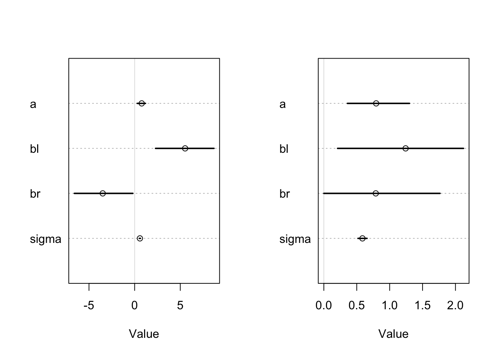<!-- -->

```r
par(op)
```

The paramter estimates and SD are really quite similar.  Of course bR remains positive on the right.  I suspect that the sampling problem in the second version arises when bl is proposed to be positive, then br can not be negative.

I also do not understand why, in the first model, bl is mostly negative.

more diagnostics


```r
plot(m5.8s)
plot(m5.8s2)
```

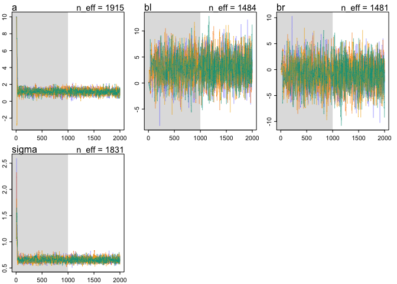<!-- -->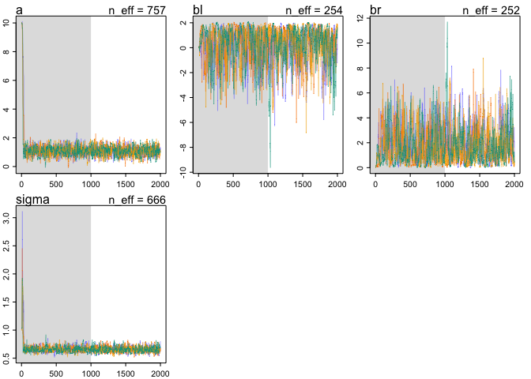<!-- -->
Here it is more clear that the fits are behaving differently, with the posterior sampleing bR and bL differently in the second version.


```r
pairs(m5.8s)
```

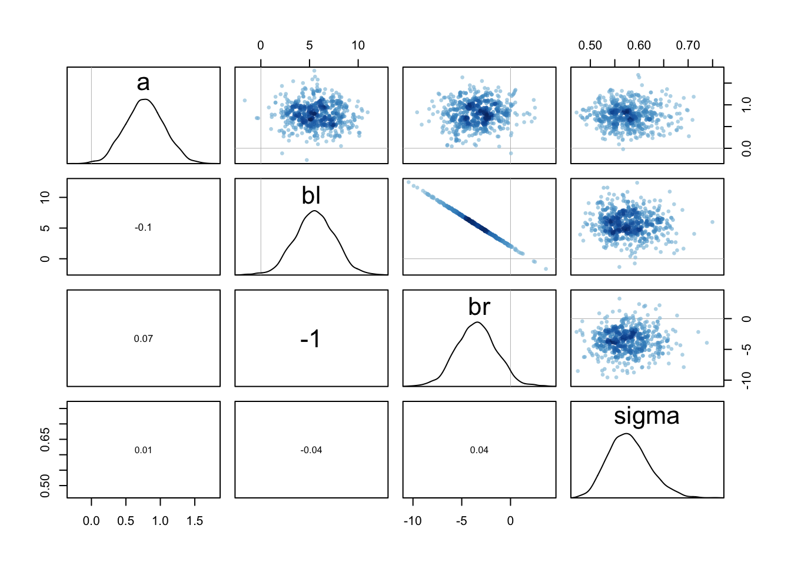<!-- -->

```r
pairs(m5.8s2)
```

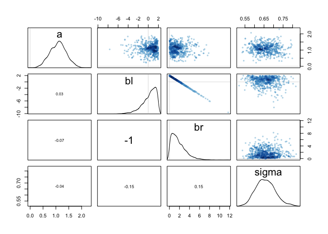<!-- -->
This shows that the posterior for bl and br are skewed in the second fit but not in the first.

Comparing the distributions...

```r
post.df <- melt(data.frame(bl.m1=extract.samples(m5.8s)$bl,
                           br.m1=extract.samples(m5.8s)$br,
                           bl.m2=extract.samples(m5.8s2)$bl,
                           br.m2=extract.samples(m5.8s2)$br))
```

```
## No id variables; using all as measure variables
```

```r
post.df$model=substr(post.df$variable,4,5)
post.df$parameter=substr(post.df$variable,1,2)
pl <- ggplot(post.df,aes(x=value,fill=model))
pl <- pl + geom_density(alpha=0.2)
pl <- pl + facet_wrap(~ parameter,ncol=2)
pl
```

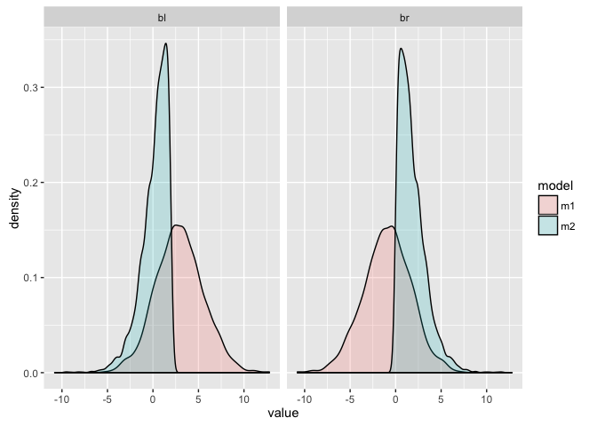<!-- -->

