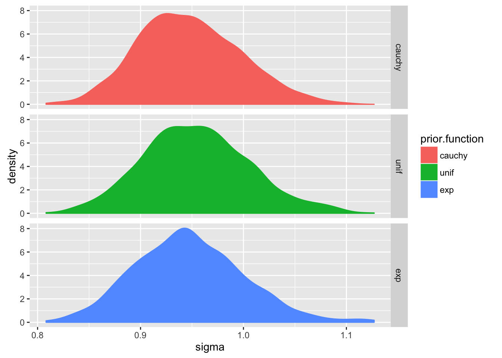

# Chapter 8

# Chapter 8


```r
knitr::opts_chunk$set(cache = TRUE,autodep = TRUE)
library(rethinking)
```

```
## Loading required package: rstan
```

```
## Warning: package 'rstan' was built under R version 3.2.5
```

```
## Loading required package: ggplot2
```

```
## Warning: package 'ggplot2' was built under R version 3.2.4
```

```
## Loading required package: StanHeaders
```

```
## Warning: package 'StanHeaders' was built under R version 3.2.5
```

```
## rstan (Version 2.10.1, packaged: 2016-06-24 13:22:16 UTC, GitRev: 85f7a56811da)
```

```
## For execution on a local, multicore CPU with excess RAM we recommend calling
## rstan_options(auto_write = TRUE)
## options(mc.cores = parallel::detectCores())
```

```
## Loading required package: parallel
```

```
## rethinking (Version 1.58)
```

```r
library(ggplot2)
library(reshape2)
```


## 8E1

The simple Metropolis algorhithim requires that the proposal distribution be symmetric

## 8E2

Gibbs sampling achieves its efficiency by using conjugate priors.  Maybe you don't want to use conjugate priors. Also becomes very ineffecient with large numbers of parameters.

## 8E3

HMC requires cannot handle discrete parameters.  This is because it is sampling the probability space by gliding through it, and it is unclear how to glide between discrete points.

## 8E4

Because there is autocorrelation in MCMC chains samples are not independent and the effective number of samples is reduced.  Neff estimates this.

## 8E5

Rhat should approach 1 (from above)

## 8E6

Should stabilize

## 8M1

Re-estimate the terrain ruggedness model from the chapter but now using a uniform prior and an exponential prior for sigma.  Any difference in postieror distribition?


```r
library(rethinking)
data(rugged)
d <- rugged
d$log_gdp <- log(d$rgdppc_2000)
dd <- d[ complete.cases(d$rgdppc_2000) , ]

dd.trim <- dd[ , c("log_gdp","rugged","cont_africa") ]

m8m1A.stan <- map2stan(
  alist(
    log_gdp ~ dnorm( mu , sigma ) ,
    mu <- a + bR*rugged + bA*cont_africa + bAR*rugged*cont_africa ,
    a ~ dnorm(0,100),
    bR ~ dnorm(0,10),
    bA ~ dnorm(0,10),
    bAR ~ dnorm(0,10),
    sigma ~ dcauchy(0,2)
  ), data=dd.trim )
```

```
## 
## SAMPLING FOR MODEL 'log_gdp ~ dnorm(mu, sigma)' NOW (CHAIN 1).
## 
## Chain 1, Iteration:    1 / 2000 [  0%]  (Warmup)
## Chain 1, Iteration:  200 / 2000 [ 10%]  (Warmup)
## Chain 1, Iteration:  400 / 2000 [ 20%]  (Warmup)
## Chain 1, Iteration:  600 / 2000 [ 30%]  (Warmup)
## Chain 1, Iteration:  800 / 2000 [ 40%]  (Warmup)
## Chain 1, Iteration: 1000 / 2000 [ 50%]  (Warmup)
## Chain 1, Iteration: 1001 / 2000 [ 50%]  (Sampling)
## Chain 1, Iteration: 1200 / 2000 [ 60%]  (Sampling)
## Chain 1, Iteration: 1400 / 2000 [ 70%]  (Sampling)
## Chain 1, Iteration: 1600 / 2000 [ 80%]  (Sampling)
## Chain 1, Iteration: 1800 / 2000 [ 90%]  (Sampling)
## Chain 1, Iteration: 2000 / 2000 [100%]  (Sampling)
##  Elapsed Time: 0.210605 seconds (Warm-up)
##                0.221099 seconds (Sampling)
##                0.431704 seconds (Total)
```

```
## The following numerical problems occured the indicated number of times after warmup on chain 1
```

```
##                                                                                 count
## Exception thrown at line 24: normal_log: Scale parameter is 0, but must be > 0!     2
```

```
## When a numerical problem occurs, the Metropolis proposal gets rejected.
```

```
## However, by design Metropolis proposals sometimes get rejected even when there are no numerical problems.
```

```
## Thus, if the number in the 'count' column is small, do not ask about this message on stan-users.
```

```
## 
## SAMPLING FOR MODEL 'log_gdp ~ dnorm(mu, sigma)' NOW (CHAIN 1).
## WARNING: No variance estimation is
##          performed for num_warmup < 20
## 
## 
## Chain 1, Iteration: 1 / 1 [100%]  (Sampling)
##  Elapsed Time: 4e-06 seconds (Warm-up)
##                7.2e-05 seconds (Sampling)
##                7.6e-05 seconds (Total)
```

```
## Computing WAIC
```

```
## Constructing posterior predictions
```

```
## [ 100 / 1000 ]
[ 200 / 1000 ]
[ 300 / 1000 ]
[ 400 / 1000 ]
[ 500 / 1000 ]
[ 600 / 1000 ]
[ 700 / 1000 ]
[ 800 / 1000 ]
[ 900 / 1000 ]
[ 1000 / 1000 ]
```

```r
m8m1_dunif.stan <- map2stan(
  alist(
    log_gdp ~ dnorm( mu , sigma ) ,
    mu <- a + bR*rugged + bA*cont_africa + bAR*rugged*cont_africa ,
    a ~ dnorm(0,100),
    bR ~ dnorm(0,10),
    bA ~ dnorm(0,10),
    bAR ~ dnorm(0,10),
    sigma ~ dunif(0,10)
  ), data=dd.trim )
```

```
## 
## SAMPLING FOR MODEL 'log_gdp ~ dnorm(mu, sigma)' NOW (CHAIN 1).
## 
## Chain 1, Iteration:    1 / 2000 [  0%]  (Warmup)
## Chain 1, Iteration:  200 / 2000 [ 10%]  (Warmup)
## Chain 1, Iteration:  400 / 2000 [ 20%]  (Warmup)
## Chain 1, Iteration:  600 / 2000 [ 30%]  (Warmup)
## Chain 1, Iteration:  800 / 2000 [ 40%]  (Warmup)
## Chain 1, Iteration: 1000 / 2000 [ 50%]  (Warmup)
## Chain 1, Iteration: 1001 / 2000 [ 50%]  (Sampling)
## Chain 1, Iteration: 1200 / 2000 [ 60%]  (Sampling)
## Chain 1, Iteration: 1400 / 2000 [ 70%]  (Sampling)
## Chain 1, Iteration: 1600 / 2000 [ 80%]  (Sampling)
## Chain 1, Iteration: 1800 / 2000 [ 90%]  (Sampling)
## Chain 1, Iteration: 2000 / 2000 [100%]  (Sampling)
##  Elapsed Time: 0.205815 seconds (Warm-up)
##                0.258518 seconds (Sampling)
##                0.464333 seconds (Total)
## 
## 
## SAMPLING FOR MODEL 'log_gdp ~ dnorm(mu, sigma)' NOW (CHAIN 1).
## WARNING: No variance estimation is
##          performed for num_warmup < 20
## 
## 
## Chain 1, Iteration: 1 / 1 [100%]  (Sampling)
##  Elapsed Time: 3e-06 seconds (Warm-up)
##                6.8e-05 seconds (Sampling)
##                7.1e-05 seconds (Total)
```

```
## Computing WAIC
## Constructing posterior predictions
```

```
## [ 100 / 1000 ]
[ 200 / 1000 ]
[ 300 / 1000 ]
[ 400 / 1000 ]
[ 500 / 1000 ]
[ 600 / 1000 ]
[ 700 / 1000 ]
[ 800 / 1000 ]
[ 900 / 1000 ]
[ 1000 / 1000 ]
```

```r
m8m1_exp.stan <- map2stan(
  alist(
    log_gdp ~ dnorm( mu , sigma ) ,
    mu <- a + bR*rugged + bA*cont_africa + bAR*rugged*cont_africa ,
    a ~ dnorm(0,100),
    bR ~ dnorm(0,10),
    bA ~ dnorm(0,10),
    bAR ~ dnorm(0,10),
    sigma ~ dexp(1)
  ), data=dd.trim )
```

```
## 
## SAMPLING FOR MODEL 'log_gdp ~ dnorm(mu, sigma)' NOW (CHAIN 1).
## 
## Chain 1, Iteration:    1 / 2000 [  0%]  (Warmup)
## Chain 1, Iteration:  200 / 2000 [ 10%]  (Warmup)
## Chain 1, Iteration:  400 / 2000 [ 20%]  (Warmup)
## Chain 1, Iteration:  600 / 2000 [ 30%]  (Warmup)
## Chain 1, Iteration:  800 / 2000 [ 40%]  (Warmup)
## Chain 1, Iteration: 1000 / 2000 [ 50%]  (Warmup)
## Chain 1, Iteration: 1001 / 2000 [ 50%]  (Sampling)
## Chain 1, Iteration: 1200 / 2000 [ 60%]  (Sampling)
## Chain 1, Iteration: 1400 / 2000 [ 70%]  (Sampling)
## Chain 1, Iteration: 1600 / 2000 [ 80%]  (Sampling)
## Chain 1, Iteration: 1800 / 2000 [ 90%]  (Sampling)
## Chain 1, Iteration: 2000 / 2000 [100%]  (Sampling)
##  Elapsed Time: 0.278348 seconds (Warm-up)
##                0.245408 seconds (Sampling)
##                0.523756 seconds (Total)
## 
## 
## SAMPLING FOR MODEL 'log_gdp ~ dnorm(mu, sigma)' NOW (CHAIN 1).
## WARNING: No variance estimation is
##          performed for num_warmup < 20
## 
## 
## Chain 1, Iteration: 1 / 1 [100%]  (Sampling)
##  Elapsed Time: 5e-06 seconds (Warm-up)
##                7e-05 seconds (Sampling)
##                7.5e-05 seconds (Total)
```

```
## Computing WAIC
## Constructing posterior predictions
```

```
## [ 100 / 1000 ]
[ 200 / 1000 ]
[ 300 / 1000 ]
[ 400 / 1000 ]
[ 500 / 1000 ]
[ 600 / 1000 ]
[ 700 / 1000 ]
[ 800 / 1000 ]
[ 900 / 1000 ]
[ 1000 / 1000 ]
```

```r
precis(m8m1A.stan)
```

```
##        Mean StdDev lower 0.89 upper 0.89 n_eff Rhat
## a      9.23   0.13       8.99       9.42   208 1.01
## bR    -0.21   0.07      -0.32      -0.08   217 1.01
## bA    -1.95   0.21      -2.28      -1.60   193 1.00
## bAR    0.40   0.13       0.19       0.59   268 1.00
## sigma  0.95   0.05       0.87       1.03   672 1.01
```

```r
precis(m8m1_dunif.stan)
```

```
##        Mean StdDev lower 0.89 upper 0.89 n_eff Rhat
## a      9.22   0.13       9.02       9.43   400 1.00
## bR    -0.20   0.07      -0.30      -0.07   431 1.00
## bA    -1.95   0.22      -2.28      -1.60   395 1.01
## bAR    0.39   0.12       0.21       0.59   382 1.01
## sigma  0.95   0.05       0.87       1.02   720 1.00
```

```r
precis(m8m1_exp.stan)
```

```
##        Mean StdDev lower 0.89 upper 0.89 n_eff Rhat
## a      9.23   0.14       8.99       9.44   336    1
## bR    -0.20   0.08      -0.32      -0.09   308    1
## bA    -1.94   0.23      -2.28      -1.57   340    1
## bAR    0.39   0.13       0.19       0.60   373    1
## sigma  0.95   0.05       0.87       1.02   625    1
```

```r
sigmas <- data.frame(
  cauchy=extract.samples(m8m1A.stan)$sigma,
  unif=extract.samples(m8m1_dunif.stan)$sigma,
  exp=extract.samples(m8m1_exp.stan)$sigma)

sigmas.m <- melt(sigmas,variable.name="prior.function",value.name="sigma")
```

```
## No id variables; using all as measure variables
```

```r
# summary(sigmas.m)
dim(sigmas.m$sigma) <- 3000 #strange that I need to do this!!
summary(sigmas.m)
```

```
##  prior.function     sigma       
##  cauchy:1000    Min.   :0.7817  
##  unif  :1000    1st Qu.:0.9167  
##  exp   :1000    Median :0.9482  
##                 Mean   :0.9503  
##                 3rd Qu.:0.9805  
##                 Max.   :1.1390
```

```r
pl <- ggplot(sigmas.m, aes(sigma,color=prior.function,fill=prior.function))
pl + geom_density(alpha=.2)
```

<!-- -->

```r
pl + geom_density() + facet_grid(prior.function ~ .)
```

<!-- -->

Look very similar.  I *assume* the differences are due to sampling.

## 8M2 Use smaller values of scaling parameter for sigma prior to see how that changes things...

### First the cauchy model

What happends to cauchy distribution at different scales?

```r
x <- seq(-10,10,.1)
scale <- c(2,1,.5,.2)
cauchy.dist <- as.data.frame(cbind(x,sapply(scale,function(s) dcauchy(x,location=0,scale = s))))
colnames(cauchy.dist)[2:5] <- as.character(scale)
head(cauchy.dist)
```

```
##       x           2           1         0.5          0.2
## 1 -10.0 0.006121344 0.003151583 0.001587580 0.0006363652
## 2  -9.9 0.006240758 0.003214927 0.001619733 0.0006492807
## 3  -9.8 0.006363652 0.003280193 0.001652871 0.0006625934
## 4  -9.7 0.006490160 0.003347459 0.001687036 0.0006763197
## 5  -9.6 0.006620422 0.003416809 0.001722270 0.0006904770
## 6  -9.5 0.006754586 0.003488328 0.001758618 0.0007050834
```

```r
cauchy.dist.m <- melt(cauchy.dist,id.vars="x",variable.name="scale.value",value.name="y")
head(cauchy.dist.m)
```

```
##       x scale.value           y
## 1 -10.0           2 0.006121344
## 2  -9.9           2 0.006240758
## 3  -9.8           2 0.006363652
## 4  -9.7           2 0.006490160
## 5  -9.6           2 0.006620422
## 6  -9.5           2 0.006754586
```

```r
pl <- ggplot(cauchy.dist.m,aes(x=x,y=y,fill=scale.value,color=scale.value))
pl <- pl + geom_density(stat="identity",alpha=0.1)
pl + ggtitle("cauchy distribution at different scales")
```

<!-- -->

What happends to exp distribution at different rates?

```r
x <- seq(-10,10,.1)
rate <- c(2,1,.5,.2)
exp.dist <- as.data.frame(cbind(x,sapply(rate,function(r) dexp(x,rate = r))))
colnames(exp.dist)[2:5] <- as.character(rate)
head(exp.dist)
```

```
##       x 2 1 0.5 0.2
## 1 -10.0 0 0   0   0
## 2  -9.9 0 0   0   0
## 3  -9.8 0 0   0   0
## 4  -9.7 0 0   0   0
## 5  -9.6 0 0   0   0
## 6  -9.5 0 0   0   0
```

```r
exp.dist.m <- melt(exp.dist,id.vars="x",variable.name="rate.value",value.name="y")
head(exp.dist.m)
```

```
##       x rate.value y
## 1 -10.0          2 0
## 2  -9.9          2 0
## 3  -9.8          2 0
## 4  -9.7          2 0
## 5  -9.6          2 0
## 6  -9.5          2 0
```

```r
pl <- ggplot(exp.dist.m,aes(x=x,y=y,fill=rate.value,color=rate.value))
pl <- pl + geom_density(stat="identity",alpha=0.1)
pl + ggtitle("exponential distribution at different rates")
```


Fit a series of cauchy models with smaller scales

```r
m8M2.stan.cauchy2 <- map2stan(
  alist(
    log_gdp ~ dnorm( mu , sigma ) ,
    mu <- a + bR*rugged + bA*cont_africa + bAR*rugged*cont_africa ,
    a ~ dnorm(0,100),
    bR ~ dnorm(0,10),
    bA ~ dnorm(0,10),
    bAR ~ dnorm(0,10),
    sigma ~ dcauchy(0,2)
  ), data=dd.trim )
```

```
## 
## SAMPLING FOR MODEL 'log_gdp ~ dnorm(mu, sigma)' NOW (CHAIN 1).
## 
## Chain 1, Iteration:    1 / 2000 [  0%]  (Warmup)
## Chain 1, Iteration:  200 / 2000 [ 10%]  (Warmup)
## Chain 1, Iteration:  400 / 2000 [ 20%]  (Warmup)
## Chain 1, Iteration:  600 / 2000 [ 30%]  (Warmup)
## Chain 1, Iteration:  800 / 2000 [ 40%]  (Warmup)
## Chain 1, Iteration: 1000 / 2000 [ 50%]  (Warmup)
## Chain 1, Iteration: 1001 / 2000 [ 50%]  (Sampling)
## Chain 1, Iteration: 1200 / 2000 [ 60%]  (Sampling)
## Chain 1, Iteration: 1400 / 2000 [ 70%]  (Sampling)
## Chain 1, Iteration: 1600 / 2000 [ 80%]  (Sampling)
## Chain 1, Iteration: 1800 / 2000 [ 90%]  (Sampling)
## Chain 1, Iteration: 2000 / 2000 [100%]  (Sampling)
##  Elapsed Time: 0.234389 seconds (Warm-up)
##                0.194093 seconds (Sampling)
##                0.428482 seconds (Total)
## 
## 
## SAMPLING FOR MODEL 'log_gdp ~ dnorm(mu, sigma)' NOW (CHAIN 1).
## WARNING: No variance estimation is
##          performed for num_warmup < 20
## 
## 
## Chain 1, Iteration: 1 / 1 [100%]  (Sampling)
##  Elapsed Time: 4e-06 seconds (Warm-up)
##                6.9e-05 seconds (Sampling)
##                7.3e-05 seconds (Total)
```

```
## Computing WAIC
```

```
## Constructing posterior predictions
```

```
## [ 100 / 1000 ]
[ 200 / 1000 ]
[ 300 / 1000 ]
[ 400 / 1000 ]
[ 500 / 1000 ]
[ 600 / 1000 ]
[ 700 / 1000 ]
[ 800 / 1000 ]
[ 900 / 1000 ]
[ 1000 / 1000 ]
```

```r
m8M2.stan.cauchy1 <- map2stan(
  alist(
    log_gdp ~ dnorm( mu , sigma ) ,
    mu <- a + bR*rugged + bA*cont_africa + bAR*rugged*cont_africa ,
    a ~ dnorm(0,100),
    bR ~ dnorm(0,10),
    bA ~ dnorm(0,10),
    bAR ~ dnorm(0,10),
    sigma ~ dcauchy(0,1)
  ), data=dd.trim )
```

```
## 
## SAMPLING FOR MODEL 'log_gdp ~ dnorm(mu, sigma)' NOW (CHAIN 1).
## 
## Chain 1, Iteration:    1 / 2000 [  0%]  (Warmup)
## Chain 1, Iteration:  200 / 2000 [ 10%]  (Warmup)
## Chain 1, Iteration:  400 / 2000 [ 20%]  (Warmup)
## Chain 1, Iteration:  600 / 2000 [ 30%]  (Warmup)
## Chain 1, Iteration:  800 / 2000 [ 40%]  (Warmup)
## Chain 1, Iteration: 1000 / 2000 [ 50%]  (Warmup)
## Chain 1, Iteration: 1001 / 2000 [ 50%]  (Sampling)
## Chain 1, Iteration: 1200 / 2000 [ 60%]  (Sampling)
## Chain 1, Iteration: 1400 / 2000 [ 70%]  (Sampling)
## Chain 1, Iteration: 1600 / 2000 [ 80%]  (Sampling)
## Chain 1, Iteration: 1800 / 2000 [ 90%]  (Sampling)
## Chain 1, Iteration: 2000 / 2000 [100%]  (Sampling)
##  Elapsed Time: 0.277818 seconds (Warm-up)
##                0.19977 seconds (Sampling)
##                0.477588 seconds (Total)
## 
## 
## SAMPLING FOR MODEL 'log_gdp ~ dnorm(mu, sigma)' NOW (CHAIN 1).
## WARNING: No variance estimation is
##          performed for num_warmup < 20
## 
## 
## Chain 1, Iteration: 1 / 1 [100%]  (Sampling)
##  Elapsed Time: 4e-06 seconds (Warm-up)
##                7e-05 seconds (Sampling)
##                7.4e-05 seconds (Total)
```

```
## Computing WAIC
## Constructing posterior predictions
```

```
## [ 100 / 1000 ]
[ 200 / 1000 ]
[ 300 / 1000 ]
[ 400 / 1000 ]
[ 500 / 1000 ]
[ 600 / 1000 ]
[ 700 / 1000 ]
[ 800 / 1000 ]
[ 900 / 1000 ]
[ 1000 / 1000 ]
```

```r
m8M2.stan.cauchy.5 <- map2stan(
  alist(
    log_gdp ~ dnorm( mu , sigma ) ,
    mu <- a + bR*rugged + bA*cont_africa + bAR*rugged*cont_africa ,
    a ~ dnorm(0,100),
    bR ~ dnorm(0,10),
    bA ~ dnorm(0,10),
    bAR ~ dnorm(0,10),
    sigma ~ dcauchy(0,.5)
  ), data=dd.trim )
```

```
## 
## SAMPLING FOR MODEL 'log_gdp ~ dnorm(mu, sigma)' NOW (CHAIN 1).
## 
## Chain 1, Iteration:    1 / 2000 [  0%]  (Warmup)
## Chain 1, Iteration:  200 / 2000 [ 10%]  (Warmup)
## Chain 1, Iteration:  400 / 2000 [ 20%]  (Warmup)
## Chain 1, Iteration:  600 / 2000 [ 30%]  (Warmup)
## Chain 1, Iteration:  800 / 2000 [ 40%]  (Warmup)
## Chain 1, Iteration: 1000 / 2000 [ 50%]  (Warmup)
## Chain 1, Iteration: 1001 / 2000 [ 50%]  (Sampling)
## Chain 1, Iteration: 1200 / 2000 [ 60%]  (Sampling)
## Chain 1, Iteration: 1400 / 2000 [ 70%]  (Sampling)
## Chain 1, Iteration: 1600 / 2000 [ 80%]  (Sampling)
## Chain 1, Iteration: 1800 / 2000 [ 90%]  (Sampling)
## Chain 1, Iteration: 2000 / 2000 [100%]  (Sampling)
##  Elapsed Time: 0.218251 seconds (Warm-up)
##                0.230333 seconds (Sampling)
##                0.448584 seconds (Total)
## 
## 
## SAMPLING FOR MODEL 'log_gdp ~ dnorm(mu, sigma)' NOW (CHAIN 1).
## WARNING: No variance estimation is
##          performed for num_warmup < 20
## 
## 
## Chain 1, Iteration: 1 / 1 [100%]  (Sampling)
##  Elapsed Time: 4e-06 seconds (Warm-up)
##                8.6e-05 seconds (Sampling)
##                9e-05 seconds (Total)
```

```
## Computing WAIC
## Constructing posterior predictions
```

```
## [ 100 / 1000 ]
[ 200 / 1000 ]
[ 300 / 1000 ]
[ 400 / 1000 ]
[ 500 / 1000 ]
[ 600 / 1000 ]
[ 700 / 1000 ]
[ 800 / 1000 ]
[ 900 / 1000 ]
[ 1000 / 1000 ]
```

```r
m8M2.stan.cauchy.2 <- map2stan(
  alist(
    log_gdp ~ dnorm( mu , sigma ) ,
    mu <- a + bR*rugged + bA*cont_africa + bAR*rugged*cont_africa ,
    a ~ dnorm(0,100),
    bR ~ dnorm(0,10),
    bA ~ dnorm(0,10),
    bAR ~ dnorm(0,10),
    sigma ~ dcauchy(0,.2)
  ), data=dd.trim )
```

```
## 
## SAMPLING FOR MODEL 'log_gdp ~ dnorm(mu, sigma)' NOW (CHAIN 1).
## 
## Chain 1, Iteration:    1 / 2000 [  0%]  (Warmup)
## Chain 1, Iteration:  200 / 2000 [ 10%]  (Warmup)
## Chain 1, Iteration:  400 / 2000 [ 20%]  (Warmup)
## Chain 1, Iteration:  600 / 2000 [ 30%]  (Warmup)
## Chain 1, Iteration:  800 / 2000 [ 40%]  (Warmup)
## Chain 1, Iteration: 1000 / 2000 [ 50%]  (Warmup)
## Chain 1, Iteration: 1001 / 2000 [ 50%]  (Sampling)
## Chain 1, Iteration: 1200 / 2000 [ 60%]  (Sampling)
## Chain 1, Iteration: 1400 / 2000 [ 70%]  (Sampling)
## Chain 1, Iteration: 1600 / 2000 [ 80%]  (Sampling)
## Chain 1, Iteration: 1800 / 2000 [ 90%]  (Sampling)
## Chain 1, Iteration: 2000 / 2000 [100%]  (Sampling)
##  Elapsed Time: 0.268034 seconds (Warm-up)
##                0.221456 seconds (Sampling)
##                0.48949 seconds (Total)
## 
## 
## SAMPLING FOR MODEL 'log_gdp ~ dnorm(mu, sigma)' NOW (CHAIN 1).
## WARNING: No variance estimation is
##          performed for num_warmup < 20
## 
## 
## Chain 1, Iteration: 1 / 1 [100%]  (Sampling)
##  Elapsed Time: 5e-06 seconds (Warm-up)
##                6.8e-05 seconds (Sampling)
##                7.3e-05 seconds (Total)
```

```
## Computing WAIC
## Constructing posterior predictions
```

```
## [ 100 / 1000 ]
[ 200 / 1000 ]
[ 300 / 1000 ]
[ 400 / 1000 ]
[ 500 / 1000 ]
[ 600 / 1000 ]
[ 700 / 1000 ]
[ 800 / 1000 ]
[ 900 / 1000 ]
[ 1000 / 1000 ]
```

look at posteriors

```r
precis(m8M2.stan.cauchy2)
```

```
##        Mean StdDev lower 0.89 upper 0.89 n_eff Rhat
## a      9.23   0.14       9.02       9.46   445    1
## bR    -0.21   0.07      -0.34      -0.10   440    1
## bA    -1.96   0.23      -2.36      -1.63   483    1
## bAR    0.40   0.13       0.19       0.59   480    1
## sigma  0.95   0.05       0.88       1.05   715    1
```

```r
precis(m8M2.stan.cauchy1)
```

```
##        Mean StdDev lower 0.89 upper 0.89 n_eff Rhat
## a      9.22   0.14       9.01       9.44   329 1.00
## bR    -0.20   0.08      -0.33      -0.07   317 1.00
## bA    -1.95   0.22      -2.32      -1.62   408 1.01
## bAR    0.39   0.13       0.19       0.60   379 1.00
## sigma  0.95   0.05       0.88       1.04   809 1.00
```

```r
precis(m8M2.stan.cauchy.5)
```

```
##        Mean StdDev lower 0.89 upper 0.89 n_eff Rhat
## a      9.23   0.13       9.02       9.43   381    1
## bR    -0.21   0.07      -0.32      -0.09   377    1
## bA    -1.96   0.22      -2.30      -1.62   373    1
## bAR    0.40   0.12       0.21       0.60   389    1
## sigma  0.95   0.05       0.87       1.02   751    1
```

```r
precis(m8M2.stan.cauchy.2)
```

```
##        Mean StdDev lower 0.89 upper 0.89 n_eff Rhat
## a      9.23   0.14       9.04       9.46   382    1
## bR    -0.21   0.08      -0.33      -0.08   336    1
## bA    -1.96   0.22      -2.32      -1.62   438    1
## bAR    0.40   0.14       0.19       0.62   404    1
## sigma  0.95   0.05       0.87       1.04   484    1
```

plot posteriors

```r
fits <- ls(pattern="m8M2.stan.cauch")
sigmas <- sapply(fits, function(x) extract.samples(get(x))$sigma)
colnames(sigmas) <- fits
sigmas.m <- melt(sigmas)
pl <- ggplot(sigmas.m,aes(x=value,color=Var2,fill=Var2))
pl <- pl + geom_density(alpha=0.1)
pl
```


exp models with smaller scales:


```r
m8M2.stan.exp1 <- map2stan(
  alist(
    log_gdp ~ dnorm( mu , sigma ) ,
    mu <- a + bR*rugged + bA*cont_africa + bAR*rugged*cont_africa ,
    a ~ dnorm(0,100),
    bR ~ dnorm(0,10),
    bA ~ dnorm(0,10),
    bAR ~ dnorm(0,10),
    sigma ~ dexp(1)
  ), data=dd.trim )
```

```
## 
## SAMPLING FOR MODEL 'log_gdp ~ dnorm(mu, sigma)' NOW (CHAIN 1).
## 
## Chain 1, Iteration:    1 / 2000 [  0%]  (Warmup)
## Chain 1, Iteration:  200 / 2000 [ 10%]  (Warmup)
## Chain 1, Iteration:  400 / 2000 [ 20%]  (Warmup)
## Chain 1, Iteration:  600 / 2000 [ 30%]  (Warmup)
## Chain 1, Iteration:  800 / 2000 [ 40%]  (Warmup)
## Chain 1, Iteration: 1000 / 2000 [ 50%]  (Warmup)
## Chain 1, Iteration: 1001 / 2000 [ 50%]  (Sampling)
## Chain 1, Iteration: 1200 / 2000 [ 60%]  (Sampling)
## Chain 1, Iteration: 1400 / 2000 [ 70%]  (Sampling)
## Chain 1, Iteration: 1600 / 2000 [ 80%]  (Sampling)
## Chain 1, Iteration: 1800 / 2000 [ 90%]  (Sampling)
## Chain 1, Iteration: 2000 / 2000 [100%]  (Sampling)
##  Elapsed Time: 0.173244 seconds (Warm-up)
##                0.153594 seconds (Sampling)
##                0.326838 seconds (Total)
## 
## 
## SAMPLING FOR MODEL 'log_gdp ~ dnorm(mu, sigma)' NOW (CHAIN 1).
## WARNING: No variance estimation is
##          performed for num_warmup < 20
## 
## 
## Chain 1, Iteration: 1 / 1 [100%]  (Sampling)
##  Elapsed Time: 3e-06 seconds (Warm-up)
##                5.9e-05 seconds (Sampling)
##                6.2e-05 seconds (Total)
```

```
## Computing WAIC
```

```
## Constructing posterior predictions
```

```
## [ 100 / 1000 ]
[ 200 / 1000 ]
[ 300 / 1000 ]
[ 400 / 1000 ]
[ 500 / 1000 ]
[ 600 / 1000 ]
[ 700 / 1000 ]
[ 800 / 1000 ]
[ 900 / 1000 ]
[ 1000 / 1000 ]
```

```r
m8M2.stan.exp.5 <- map2stan(
  alist(
    log_gdp ~ dnorm( mu , sigma ) ,
    mu <- a + bR*rugged + bA*cont_africa + bAR*rugged*cont_africa ,
    a ~ dnorm(0,100),
    bR ~ dnorm(0,10),
    bA ~ dnorm(0,10),
    bAR ~ dnorm(0,10),
    sigma ~ dexp(.5)
  ), data=dd.trim )
```

```
## 
## SAMPLING FOR MODEL 'log_gdp ~ dnorm(mu, sigma)' NOW (CHAIN 1).
## 
## Chain 1, Iteration:    1 / 2000 [  0%]  (Warmup)
## Chain 1, Iteration:  200 / 2000 [ 10%]  (Warmup)
## Chain 1, Iteration:  400 / 2000 [ 20%]  (Warmup)
## Chain 1, Iteration:  600 / 2000 [ 30%]  (Warmup)
## Chain 1, Iteration:  800 / 2000 [ 40%]  (Warmup)
## Chain 1, Iteration: 1000 / 2000 [ 50%]  (Warmup)
## Chain 1, Iteration: 1001 / 2000 [ 50%]  (Sampling)
## Chain 1, Iteration: 1200 / 2000 [ 60%]  (Sampling)
## Chain 1, Iteration: 1400 / 2000 [ 70%]  (Sampling)
## Chain 1, Iteration: 1600 / 2000 [ 80%]  (Sampling)
## Chain 1, Iteration: 1800 / 2000 [ 90%]  (Sampling)
## Chain 1, Iteration: 2000 / 2000 [100%]  (Sampling)
##  Elapsed Time: 0.162335 seconds (Warm-up)
##                0.216932 seconds (Sampling)
##                0.379267 seconds (Total)
## 
## 
## SAMPLING FOR MODEL 'log_gdp ~ dnorm(mu, sigma)' NOW (CHAIN 1).
## WARNING: No variance estimation is
##          performed for num_warmup < 20
## 
## 
## Chain 1, Iteration: 1 / 1 [100%]  (Sampling)
##  Elapsed Time: 3e-06 seconds (Warm-up)
##                0.000133 seconds (Sampling)
##                0.000136 seconds (Total)
```

```
## Computing WAIC
## Constructing posterior predictions
```

```
## [ 100 / 1000 ]
[ 200 / 1000 ]
[ 300 / 1000 ]
[ 400 / 1000 ]
[ 500 / 1000 ]
[ 600 / 1000 ]
[ 700 / 1000 ]
[ 800 / 1000 ]
[ 900 / 1000 ]
[ 1000 / 1000 ]
```

```r
m8M2.stan.exp.2 <- map2stan(
  alist(
    log_gdp ~ dnorm( mu , sigma ) ,
    mu <- a + bR*rugged + bA*cont_africa + bAR*rugged*cont_africa ,
    a ~ dnorm(0,100),
    bR ~ dnorm(0,10),
    bA ~ dnorm(0,10),
    bAR ~ dnorm(0,10),
    sigma ~ dexp(.2)
  ), data=dd.trim )
```

```
## 
## SAMPLING FOR MODEL 'log_gdp ~ dnorm(mu, sigma)' NOW (CHAIN 1).
## 
## Chain 1, Iteration:    1 / 2000 [  0%]  (Warmup)
## Chain 1, Iteration:  200 / 2000 [ 10%]  (Warmup)
## Chain 1, Iteration:  400 / 2000 [ 20%]  (Warmup)
## Chain 1, Iteration:  600 / 2000 [ 30%]  (Warmup)
## Chain 1, Iteration:  800 / 2000 [ 40%]  (Warmup)
## Chain 1, Iteration: 1000 / 2000 [ 50%]  (Warmup)
## Chain 1, Iteration: 1001 / 2000 [ 50%]  (Sampling)
## Chain 1, Iteration: 1200 / 2000 [ 60%]  (Sampling)
## Chain 1, Iteration: 1400 / 2000 [ 70%]  (Sampling)
## Chain 1, Iteration: 1600 / 2000 [ 80%]  (Sampling)
## Chain 1, Iteration: 1800 / 2000 [ 90%]  (Sampling)
## Chain 1, Iteration: 2000 / 2000 [100%]  (Sampling)
##  Elapsed Time: 0.22576 seconds (Warm-up)
##                0.198774 seconds (Sampling)
##                0.424534 seconds (Total)
## 
## 
## SAMPLING FOR MODEL 'log_gdp ~ dnorm(mu, sigma)' NOW (CHAIN 1).
## WARNING: No variance estimation is
##          performed for num_warmup < 20
## 
## 
## Chain 1, Iteration: 1 / 1 [100%]  (Sampling)
##  Elapsed Time: 4e-06 seconds (Warm-up)
##                5.8e-05 seconds (Sampling)
##                6.2e-05 seconds (Total)
```

```
## Computing WAIC
## Constructing posterior predictions
```

```
## [ 100 / 1000 ]
[ 200 / 1000 ]
[ 300 / 1000 ]
[ 400 / 1000 ]
[ 500 / 1000 ]
[ 600 / 1000 ]
[ 700 / 1000 ]
[ 800 / 1000 ]
[ 900 / 1000 ]
[ 1000 / 1000 ]
```

```r
m8M2.stan.exp.1 <- map2stan(
  alist(
    log_gdp ~ dnorm( mu , sigma ) ,
    mu <- a + bR*rugged + bA*cont_africa + bAR*rugged*cont_africa ,
    a ~ dnorm(0,100),
    bR ~ dnorm(0,10),
    bA ~ dnorm(0,10),
    bAR ~ dnorm(0,10),
    sigma ~ dexp(.1)
  ), data=dd.trim )
```

```
## 
## SAMPLING FOR MODEL 'log_gdp ~ dnorm(mu, sigma)' NOW (CHAIN 1).
## 
## Chain 1, Iteration:    1 / 2000 [  0%]  (Warmup)
## Chain 1, Iteration:  200 / 2000 [ 10%]  (Warmup)
## Chain 1, Iteration:  400 / 2000 [ 20%]  (Warmup)
## Chain 1, Iteration:  600 / 2000 [ 30%]  (Warmup)
## Chain 1, Iteration:  800 / 2000 [ 40%]  (Warmup)
## Chain 1, Iteration: 1000 / 2000 [ 50%]  (Warmup)
## Chain 1, Iteration: 1001 / 2000 [ 50%]  (Sampling)
## Chain 1, Iteration: 1200 / 2000 [ 60%]  (Sampling)
## Chain 1, Iteration: 1400 / 2000 [ 70%]  (Sampling)
## Chain 1, Iteration: 1600 / 2000 [ 80%]  (Sampling)
## Chain 1, Iteration: 1800 / 2000 [ 90%]  (Sampling)
## Chain 1, Iteration: 2000 / 2000 [100%]  (Sampling)
##  Elapsed Time: 0.22654 seconds (Warm-up)
##                0.185079 seconds (Sampling)
##                0.411619 seconds (Total)
## 
## 
## SAMPLING FOR MODEL 'log_gdp ~ dnorm(mu, sigma)' NOW (CHAIN 1).
## WARNING: No variance estimation is
##          performed for num_warmup < 20
## 
## 
## Chain 1, Iteration: 1 / 1 [100%]  (Sampling)
##  Elapsed Time: 4e-06 seconds (Warm-up)
##                0.000104 seconds (Sampling)
##                0.000108 seconds (Total)
```

```
## Computing WAIC
## Constructing posterior predictions
```

```
## [ 100 / 1000 ]
[ 200 / 1000 ]
[ 300 / 1000 ]
[ 400 / 1000 ]
[ 500 / 1000 ]
[ 600 / 1000 ]
[ 700 / 1000 ]
[ 800 / 1000 ]
[ 900 / 1000 ]
[ 1000 / 1000 ]
```

```r
m8M2.stan.exp.001 <- map2stan(
  alist(
    log_gdp ~ dnorm( mu , sigma ) ,
    mu <- a + bR*rugged + bA*cont_africa + bAR*rugged*cont_africa ,
    a ~ dnorm(0,100),
    bR ~ dnorm(0,10),
    bA ~ dnorm(0,10),
    bAR ~ dnorm(0,10),
    sigma ~ dexp(.001)
  ), data=dd.trim )
```

```
## 
## SAMPLING FOR MODEL 'log_gdp ~ dnorm(mu, sigma)' NOW (CHAIN 1).
## 
## Chain 1, Iteration:    1 / 2000 [  0%]  (Warmup)
## Chain 1, Iteration:  200 / 2000 [ 10%]  (Warmup)
## Chain 1, Iteration:  400 / 2000 [ 20%]  (Warmup)
## Chain 1, Iteration:  600 / 2000 [ 30%]  (Warmup)
## Chain 1, Iteration:  800 / 2000 [ 40%]  (Warmup)
## Chain 1, Iteration: 1000 / 2000 [ 50%]  (Warmup)
## Chain 1, Iteration: 1001 / 2000 [ 50%]  (Sampling)
## Chain 1, Iteration: 1200 / 2000 [ 60%]  (Sampling)
## Chain 1, Iteration: 1400 / 2000 [ 70%]  (Sampling)
## Chain 1, Iteration: 1600 / 2000 [ 80%]  (Sampling)
## Chain 1, Iteration: 1800 / 2000 [ 90%]  (Sampling)
## Chain 1, Iteration: 2000 / 2000 [100%]  (Sampling)
##  Elapsed Time: 0.242452 seconds (Warm-up)
##                0.219984 seconds (Sampling)
##                0.462436 seconds (Total)
## 
## 
## SAMPLING FOR MODEL 'log_gdp ~ dnorm(mu, sigma)' NOW (CHAIN 1).
## WARNING: No variance estimation is
##          performed for num_warmup < 20
## 
## 
## Chain 1, Iteration: 1 / 1 [100%]  (Sampling)
##  Elapsed Time: 5e-06 seconds (Warm-up)
##                9.3e-05 seconds (Sampling)
##                9.8e-05 seconds (Total)
```

```
## Computing WAIC
## Constructing posterior predictions
```

```
## [ 100 / 1000 ]
[ 200 / 1000 ]
[ 300 / 1000 ]
[ 400 / 1000 ]
[ 500 / 1000 ]
[ 600 / 1000 ]
[ 700 / 1000 ]
[ 800 / 1000 ]
[ 900 / 1000 ]
[ 1000 / 1000 ]
```

look at posteriors

```r
precis(m8M2.stan.exp1)
```

```
##        Mean StdDev lower 0.89 upper 0.89 n_eff Rhat
## a      9.22   0.13       9.01       9.43   334 1.01
## bR    -0.20   0.07      -0.32      -0.09   326 1.02
## bA    -1.94   0.22      -2.26      -1.57   365 1.01
## bAR    0.39   0.13       0.19       0.60   393 1.01
## sigma  0.95   0.05       0.87       1.03   749 1.00
```

```r
precis(m8M2.stan.exp.5)
```

```
##        Mean StdDev lower 0.89 upper 0.89 n_eff Rhat
## a      9.22   0.14       9.01       9.45   389    1
## bR    -0.20   0.08      -0.32      -0.08   390    1
## bA    -1.94   0.22      -2.28      -1.58   349    1
## bAR    0.39   0.12       0.19       0.58   276    1
## sigma  0.95   0.05       0.87       1.03   550    1
```

```r
precis(m8M2.stan.exp.2)
```

```
##        Mean StdDev lower 0.89 upper 0.89 n_eff Rhat
## a      9.21   0.13       9.03       9.43   390    1
## bR    -0.20   0.07      -0.32      -0.09   391    1
## bA    -1.93   0.21      -2.28      -1.61   447    1
## bAR    0.38   0.12       0.17       0.56   456    1
## sigma  0.95   0.05       0.87       1.03   798    1
```

```r
precis(m8M2.stan.exp.1)
```

```
##        Mean StdDev lower 0.89 upper 0.89 n_eff Rhat
## a      9.22   0.15       8.95       9.42   267 1.01
## bR    -0.20   0.08      -0.34      -0.08   261 1.01
## bA    -1.93   0.24      -2.28      -1.52   353 1.00
## bAR    0.38   0.13       0.18       0.61   335 1.01
## sigma  0.95   0.05       0.87       1.03   619 1.00
```

```r
precis(m8M2.stan.exp.001) #rhat going up?
```

```
##        Mean StdDev lower 0.89 upper 0.89 n_eff Rhat
## a      9.23   0.15       8.99       9.46   338    1
## bR    -0.21   0.08      -0.34      -0.08   422    1
## bA    -1.95   0.23      -2.33      -1.60   359    1
## bAR    0.40   0.13       0.20       0.62   411    1
## sigma  0.95   0.05       0.87       1.03   514    1
```

plot posteriors

```r
fits <- ls(pattern="m8M2.stan.exp")
sigmas <- sapply(fits, function(x) extract.samples(get(x))$sigma)
colnames(sigmas) <- fits
sigmas.m <- melt(sigmas)
pl <- ggplot(sigmas.m,aes(x=value,color=Var2,fill=Var2))
pl <- pl + geom_density(alpha=0.1)
pl
```


## 8M3

Restimate a stan model at different number of warm up samples.


```r
m8m3.stan.warm1000 <- map2stan(
  alist(
    log_gdp ~ dnorm( mu , sigma ) ,
    mu <- a + bR*rugged + bA*cont_africa + bAR*rugged*cont_africa ,
    a ~ dnorm(0,100),
    bR ~ dnorm(0,10),
    bA ~ dnorm(0,10),
    bAR ~ dnorm(0,10),
    sigma ~ dcauchy(0,2)
  ), data=dd.trim )
```

```
## 
## SAMPLING FOR MODEL 'log_gdp ~ dnorm(mu, sigma)' NOW (CHAIN 1).
## 
## Chain 1, Iteration:    1 / 2000 [  0%]  (Warmup)
## Chain 1, Iteration:  200 / 2000 [ 10%]  (Warmup)
## Chain 1, Iteration:  400 / 2000 [ 20%]  (Warmup)
## Chain 1, Iteration:  600 / 2000 [ 30%]  (Warmup)
## Chain 1, Iteration:  800 / 2000 [ 40%]  (Warmup)
## Chain 1, Iteration: 1000 / 2000 [ 50%]  (Warmup)
## Chain 1, Iteration: 1001 / 2000 [ 50%]  (Sampling)
## Chain 1, Iteration: 1200 / 2000 [ 60%]  (Sampling)
## Chain 1, Iteration: 1400 / 2000 [ 70%]  (Sampling)
## Chain 1, Iteration: 1600 / 2000 [ 80%]  (Sampling)
## Chain 1, Iteration: 1800 / 2000 [ 90%]  (Sampling)
## Chain 1, Iteration: 2000 / 2000 [100%]  (Sampling)
##  Elapsed Time: 0.196442 seconds (Warm-up)
##                0.173775 seconds (Sampling)
##                0.370217 seconds (Total)
## 
## 
## SAMPLING FOR MODEL 'log_gdp ~ dnorm(mu, sigma)' NOW (CHAIN 1).
## WARNING: No variance estimation is
##          performed for num_warmup < 20
## 
## 
## Chain 1, Iteration: 1 / 1 [100%]  (Sampling)
##  Elapsed Time: 4e-06 seconds (Warm-up)
##                5.9e-05 seconds (Sampling)
##                6.3e-05 seconds (Total)
```

```
## Computing WAIC
```

```
## Constructing posterior predictions
```

```
## [ 100 / 1000 ]
[ 200 / 1000 ]
[ 300 / 1000 ]
[ 400 / 1000 ]
[ 500 / 1000 ]
[ 600 / 1000 ]
[ 700 / 1000 ]
[ 800 / 1000 ]
[ 900 / 1000 ]
[ 1000 / 1000 ]
```

```r
m8m3.stan.warm100 <- map2stan(
  alist(
    log_gdp ~ dnorm( mu , sigma ) ,
    mu <- a + bR*rugged + bA*cont_africa + bAR*rugged*cont_africa ,
    a ~ dnorm(0,100),
    bR ~ dnorm(0,10),
    bA ~ dnorm(0,10),
    bAR ~ dnorm(0,10),
    sigma ~ dcauchy(0,2)
  ), data=dd.trim, warmup = 100, iter = 1100 )
```

```
## 
## SAMPLING FOR MODEL 'log_gdp ~ dnorm(mu, sigma)' NOW (CHAIN 1).
## WARNING: The initial buffer, adaptation window, and terminal buffer
##          overflow the total number of warmup iterations.
##          Defaulting to a 15%/75%/10% partition,
##            init_buffer = 15
##            adapt_window = 75
##            term_buffer = 10
## 
## 
## Chain 1, Iteration:    1 / 1100 [  0%]  (Warmup)
## Chain 1, Iteration:  101 / 1100 [  9%]  (Sampling)
## Chain 1, Iteration:  210 / 1100 [ 19%]  (Sampling)
## Chain 1, Iteration:  320 / 1100 [ 29%]  (Sampling)
## Chain 1, Iteration:  430 / 1100 [ 39%]  (Sampling)
## Chain 1, Iteration:  540 / 1100 [ 49%]  (Sampling)
## Chain 1, Iteration:  650 / 1100 [ 59%]  (Sampling)
## Chain 1, Iteration:  760 / 1100 [ 69%]  (Sampling)
## Chain 1, Iteration:  870 / 1100 [ 79%]  (Sampling)
## Chain 1, Iteration:  980 / 1100 [ 89%]  (Sampling)
## Chain 1, Iteration: 1090 / 1100 [ 99%]  (Sampling)
## Chain 1, Iteration: 1100 / 1100 [100%]  (Sampling)
##  Elapsed Time: 0.036044 seconds (Warm-up)
##                0.18035 seconds (Sampling)
##                0.216394 seconds (Total)
```

```
## The following numerical problems occured the indicated number of times after warmup on chain 1
```

```
##                                                                                 count
## Exception thrown at line 24: normal_log: Scale parameter is 0, but must be > 0!     2
```

```
## When a numerical problem occurs, the Metropolis proposal gets rejected.
```

```
## However, by design Metropolis proposals sometimes get rejected even when there are no numerical problems.
```

```
## Thus, if the number in the 'count' column is small, do not ask about this message on stan-users.
```

```
## 
## SAMPLING FOR MODEL 'log_gdp ~ dnorm(mu, sigma)' NOW (CHAIN 1).
## WARNING: No variance estimation is
##          performed for num_warmup < 20
## 
## 
## Chain 1, Iteration: 1 / 1 [100%]  (Sampling)
##  Elapsed Time: 6e-06 seconds (Warm-up)
##                0.000188 seconds (Sampling)
##                0.000194 seconds (Total)
```

```
## Computing WAIC
```

```
## Constructing posterior predictions
```

```
## [ 100 / 1000 ]
[ 200 / 1000 ]
[ 300 / 1000 ]
[ 400 / 1000 ]
[ 500 / 1000 ]
[ 600 / 1000 ]
[ 700 / 1000 ]
[ 800 / 1000 ]
[ 900 / 1000 ]
[ 1000 / 1000 ]
```

```r
m8m3.stan.warm50 <- map2stan(
  alist(
    log_gdp ~ dnorm( mu , sigma ) ,
    mu <- a + bR*rugged + bA*cont_africa + bAR*rugged*cont_africa ,
    a ~ dnorm(0,100),
    bR ~ dnorm(0,10),
    bA ~ dnorm(0,10),
    bAR ~ dnorm(0,10),
    sigma ~ dcauchy(0,2)
  ), data=dd.trim, warmup = 50, iter = 1050 )
```

```
## 
## SAMPLING FOR MODEL 'log_gdp ~ dnorm(mu, sigma)' NOW (CHAIN 1).
## WARNING: The initial buffer, adaptation window, and terminal buffer
##          overflow the total number of warmup iterations.
##          Defaulting to a 15%/75%/10% partition,
##            init_buffer = 7
##            adapt_window = 38
##            term_buffer = 5
## 
## 
## Chain 1, Iteration:    1 / 1050 [  0%]  (Warmup)
## Chain 1, Iteration:   51 / 1050 [  4%]  (Sampling)
## Chain 1, Iteration:  155 / 1050 [ 14%]  (Sampling)
## Chain 1, Iteration:  260 / 1050 [ 24%]  (Sampling)
## Chain 1, Iteration:  365 / 1050 [ 34%]  (Sampling)
## Chain 1, Iteration:  470 / 1050 [ 44%]  (Sampling)
## Chain 1, Iteration:  575 / 1050 [ 54%]  (Sampling)
## Chain 1, Iteration:  680 / 1050 [ 64%]  (Sampling)
## Chain 1, Iteration:  785 / 1050 [ 74%]  (Sampling)
## Chain 1, Iteration:  890 / 1050 [ 84%]  (Sampling)
## Chain 1, Iteration:  995 / 1050 [ 94%]  (Sampling)
## Chain 1, Iteration: 1050 / 1050 [100%]  (Sampling)
##  Elapsed Time: 0.012384 seconds (Warm-up)
##                0.208543 seconds (Sampling)
##                0.220927 seconds (Total)
## 
## 
## SAMPLING FOR MODEL 'log_gdp ~ dnorm(mu, sigma)' NOW (CHAIN 1).
## WARNING: No variance estimation is
##          performed for num_warmup < 20
## 
## 
## Chain 1, Iteration: 1 / 1 [100%]  (Sampling)
##  Elapsed Time: 2e-06 seconds (Warm-up)
##                6.3e-05 seconds (Sampling)
##                6.5e-05 seconds (Total)
```

```
## Computing WAIC
## Constructing posterior predictions
```

```
## [ 100 / 1000 ]
[ 200 / 1000 ]
[ 300 / 1000 ]
[ 400 / 1000 ]
[ 500 / 1000 ]
[ 600 / 1000 ]
[ 700 / 1000 ]
[ 800 / 1000 ]
[ 900 / 1000 ]
[ 1000 / 1000 ]
```

```r
m8m3.stan.warm10 <- map2stan(
  alist(
    log_gdp ~ dnorm( mu , sigma ) ,
    mu <- a + bR*rugged + bA*cont_africa + bAR*rugged*cont_africa ,
    a ~ dnorm(0,100),
    bR ~ dnorm(0,10),
    bA ~ dnorm(0,10),
    bAR ~ dnorm(0,10),
    sigma ~ dcauchy(0,2)
  ), data=dd.trim, warmup = 10, iter = 1010 )
```

```
## 
## SAMPLING FOR MODEL 'log_gdp ~ dnorm(mu, sigma)' NOW (CHAIN 1).
## WARNING: No variance estimation is
##          performed for num_warmup < 20
## 
## 
## Chain 1, Iteration:    1 / 1010 [  0%]  (Warmup)
## Chain 1, Iteration:   11 / 1010 [  1%]  (Sampling)
## Chain 1, Iteration:  111 / 1010 [ 10%]  (Sampling)
## Chain 1, Iteration:  212 / 1010 [ 20%]  (Sampling)
## Chain 1, Iteration:  313 / 1010 [ 30%]  (Sampling)
## Chain 1, Iteration:  414 / 1010 [ 40%]  (Sampling)
## Chain 1, Iteration:  515 / 1010 [ 50%]  (Sampling)
## Chain 1, Iteration:  616 / 1010 [ 60%]  (Sampling)
## Chain 1, Iteration:  717 / 1010 [ 70%]  (Sampling)
## Chain 1, Iteration:  818 / 1010 [ 80%]  (Sampling)
## Chain 1, Iteration:  919 / 1010 [ 90%]  (Sampling)
## Chain 1, Iteration: 1010 / 1010 [100%]  (Sampling)
##  Elapsed Time: 0.000596 seconds (Warm-up)
##                0.066447 seconds (Sampling)
##                0.067043 seconds (Total)
## 
## 
## SAMPLING FOR MODEL 'log_gdp ~ dnorm(mu, sigma)' NOW (CHAIN 1).
## WARNING: No variance estimation is
##          performed for num_warmup < 20
## 
## 
## Chain 1, Iteration: 1 / 1 [100%]  (Sampling)
##  Elapsed Time: 2e-06 seconds (Warm-up)
##                5.9e-05 seconds (Sampling)
##                6.1e-05 seconds (Total)
```

```
## Computing WAIC
## Constructing posterior predictions
```

```
## [ 100 / 1000 ]
[ 200 / 1000 ]
[ 300 / 1000 ]
[ 400 / 1000 ]
[ 500 / 1000 ]
[ 600 / 1000 ]
[ 700 / 1000 ]
[ 800 / 1000 ]
[ 900 / 1000 ]
[ 1000 / 1000 ]
```

```
## Warning in map2stan(alist(log_gdp ~ dnorm(mu, sigma), mu <- a + bR * rugged + : There were 1000 divergent iterations during sampling.
## Check the chains (trace plots, n_eff, Rhat) carefully to ensure they are valid.
```

```r
m8m3.stan.warm2 <- map2stan(
  alist(
    log_gdp ~ dnorm( mu , sigma ) ,
    mu <- a + bR*rugged + bA*cont_africa + bAR*rugged*cont_africa ,
    a ~ dnorm(0,100),
    bR ~ dnorm(0,10),
    bA ~ dnorm(0,10),
    bAR ~ dnorm(0,10),
    sigma ~ dcauchy(0,2)
  ), data=dd.trim, warmup = 2, iter = 1002 )
```

```
## 
## SAMPLING FOR MODEL 'log_gdp ~ dnorm(mu, sigma)' NOW (CHAIN 1).
## WARNING: No variance estimation is
##          performed for num_warmup < 20
## 
## 
## Chain 1, Iteration:    1 / 1002 [  0%]  (Warmup)
## Chain 1, Iteration:    3 / 1002 [  0%]  (Sampling)
## Chain 1, Iteration:  102 / 1002 [ 10%]  (Sampling)
## Chain 1, Iteration:  202 / 1002 [ 20%]  (Sampling)
## Chain 1, Iteration:  302 / 1002 [ 30%]  (Sampling)
## Chain 1, Iteration:  402 / 1002 [ 40%]  (Sampling)
## Chain 1, Iteration:  502 / 1002 [ 50%]  (Sampling)
## Chain 1, Iteration:  602 / 1002 [ 60%]  (Sampling)
## Chain 1, Iteration:  702 / 1002 [ 70%]  (Sampling)
## Chain 1, Iteration:  802 / 1002 [ 80%]  (Sampling)
## Chain 1, Iteration:  902 / 1002 [ 90%]  (Sampling)
## Chain 1, Iteration: 1002 / 1002 [100%]  (Sampling)
##  Elapsed Time: 0.000724 seconds (Warm-up)
##                0.047806 seconds (Sampling)
##                0.04853 seconds (Total)
## 
## 
## SAMPLING FOR MODEL 'log_gdp ~ dnorm(mu, sigma)' NOW (CHAIN 1).
## WARNING: No variance estimation is
##          performed for num_warmup < 20
## 
## 
## Chain 1, Iteration: 1 / 1 [100%]  (Sampling)
##  Elapsed Time: 3e-06 seconds (Warm-up)
##                5.9e-05 seconds (Sampling)
##                6.2e-05 seconds (Total)
```

```
## Computing WAIC
## Constructing posterior predictions
```

```
## [ 100 / 1000 ]
[ 200 / 1000 ]
[ 300 / 1000 ]
[ 400 / 1000 ]
[ 500 / 1000 ]
[ 600 / 1000 ]
[ 700 / 1000 ]
[ 800 / 1000 ]
[ 900 / 1000 ]
[ 1000 / 1000 ]
```

```
## Warning in map2stan(alist(log_gdp ~ dnorm(mu, sigma), mu <- a + bR * rugged + : There were 1000 divergent iterations during sampling.
## Check the chains (trace plots, n_eff, Rhat) carefully to ensure they are valid.
```


```r
precis(m8m3.stan.warm1000)
```

```
##        Mean StdDev lower 0.89 upper 0.89 n_eff Rhat
## a      9.22   0.14       8.99       9.44   274    1
## bR    -0.20   0.08      -0.32      -0.07   261    1
## bA    -1.94   0.22      -2.31      -1.59   312    1
## bAR    0.39   0.12       0.20       0.59   289    1
## sigma  0.95   0.05       0.87       1.02   534    1
```

```r
precis(m8m3.stan.warm100)
```

```
##        Mean StdDev lower 0.89 upper 0.89 n_eff Rhat
## a      9.22   0.14       9.00       9.45   272    1
## bR    -0.20   0.08      -0.33      -0.08   366    1
## bA    -1.93   0.23      -2.29      -1.56   239    1
## bAR    0.39   0.14       0.19       0.64   299    1
## sigma  0.95   0.05       0.86       1.03  1000    1
```

```r
precis(m8m3.stan.warm50)
```

```
##        Mean StdDev lower 0.89 upper 0.89 n_eff Rhat
## a      9.22   0.13       9.03       9.43   371    1
## bR    -0.20   0.07      -0.31      -0.08   517    1
## bA    -1.93   0.20      -2.20      -1.60   311    1
## bAR    0.38   0.12       0.20       0.58   374    1
## sigma  0.95   0.05       0.86       1.03  1000    1
```

```r
precis(m8m3.stan.warm10)
```

```
## Warning in precis(m8m3.stan.warm10): There were 1000 divergent iterations during sampling.
## Check the chains (trace plots, n_eff, Rhat) carefully to ensure they are valid.
```

```
##        Mean StdDev lower 0.89 upper 0.89 n_eff Rhat
## a     38.73      0      38.73      38.73     1    1
## bR    -1.99      0      -1.99      -1.99     1    1
## bA    -4.42      0      -4.42      -4.42     1    1
## bAR    8.47      0       8.47       8.47     1    1
## sigma  6.85      0       6.85       6.85     1    1
```

```r
precis(m8m3.stan.warm2)
```

```
## Warning in precis(m8m3.stan.warm2): There were 1000 divergent iterations during sampling.
## Check the chains (trace plots, n_eff, Rhat) carefully to ensure they are valid.
```

```
##         Mean StdDev lower 0.89 upper 0.89 n_eff Rhat
## a     -55.83      0     -55.83     -55.83     1    1
## bR    -14.56      0     -14.56     -14.56     1    1
## bA     26.00      0      26.00      26.00     1    1
## bAR    21.25      0      21.25      21.25     1    1
## sigma   1.67      0       1.67       1.67     1    1
```

```r
plot(m8m3.stan.warm1000)
plot(m8m3.stan.warm100)
```


```r
plot(m8m3.stan.warm50)
```


```r
plot(m8m3.stan.warm10)
```


```r
plot(m8m3.stan.warm2)
```


```r
compare(m8m3.stan.warm1000,m8m3.stan.warm100,m8m3.stan.warm50,m8m3.stan.warm10,m8m3.stan.warm2)
```

```
##                        WAIC pWAIC    dWAIC weight       SE      dSE
## m8m3.stan.warm50      468.2   4.6      0.0   0.45    14.76       NA
## m8m3.stan.warm1000    468.6   4.8      0.4   0.36    14.70     0.30
## m8m3.stan.warm100     469.8   5.4      1.7   0.19    14.76     0.35
## m8m3.stan.warm10     4134.5   0.0   3666.3   0.00   122.80   123.82
## m8m3.stan.warm2    345309.3   0.0 344841.2   0.00 18414.24 18466.36
```


Things seem good with 100 warmups and even 50 but certinly not with 10 or 2; the number of effective samples drops to 1 and this is also clear from the chain traces
