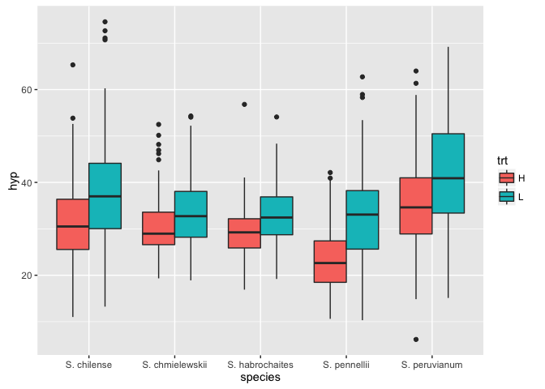
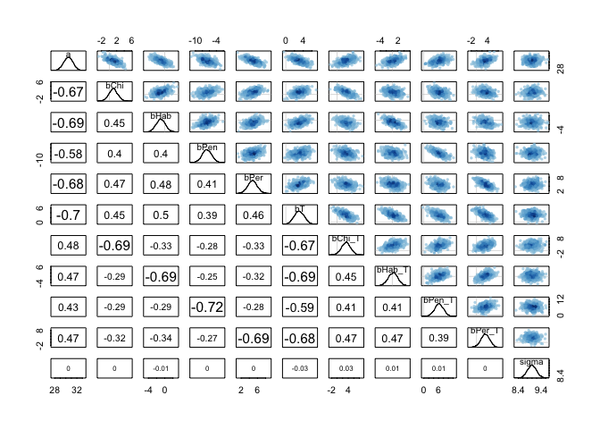
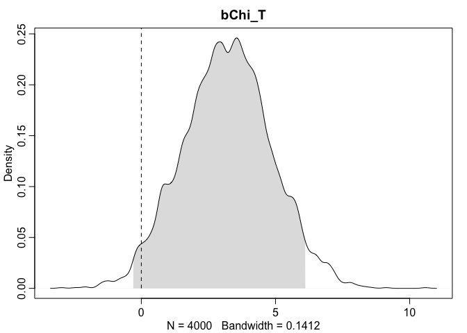
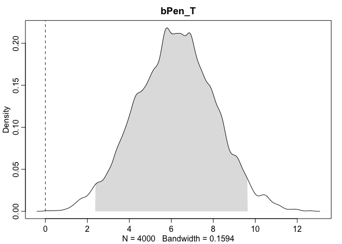

# Tomato Problem


## Problem from Julin

Do a Bayesian analysis of hypocotyl length (hyp) in the attached data sheet.


1) Does the best model include species, trt, or both?

2) Evaluate the hypothesis that trt has an effect on hypocotyl length

If you get stuck early, don't worry, come anyway abd we can work on it in R Club

## Load libraries and get the data

```r
library(rethinking)
```

```
## Loading required package: rstan
```

```
## Warning: package 'rstan' was built under R version 3.2.5
```

```
## Loading required package: ggplot2
```

```
## Warning: package 'ggplot2' was built under R version 3.2.4
```

```
## Loading required package: StanHeaders
```

```
## Warning: package 'StanHeaders' was built under R version 3.2.5
```

```
## rstan (Version 2.11.1, packaged: 2016-07-28 18:19:31 UTC, GitRev: 85f7a56811da)
```

```
## For execution on a local, multicore CPU with excess RAM we recommend calling
## rstan_options(auto_write = TRUE)
## options(mc.cores = parallel::detectCores())
```

```
## Loading required package: parallel
```

```
## rethinking (Version 1.59)
```

```r
library(ggplot2)
library(reshape2)
data <- read.csv("TomatoR2CSHL.csv")
head(data)
```

```
##   shelf flat col row    acs trt days   date   hyp int1 int2 int3 int4
## 1     Z    1   B   1 LA2580   H   28 5/5/08 19.46 2.37 1.59 1.87 0.51
## 2     Z    1   C   1 LA1305   H   28 5/5/08 31.28 3.34 0.01 9.19 1.62
## 3     Z    1   D   1 LA1973   H   28 5/5/08 56.65 8.43 2.39 6.70 3.69
## 4     Z    1   E   1 LA2748   H   28 5/5/08 35.18 0.56 0.00 1.60 0.61
## 5     Z    1   F   1 LA2931   H   28 5/5/08 35.32 0.82 0.02 1.49 0.46
## 6     Z    1   G   1 LA1317   H   28 5/5/08 28.74 1.07 6.69 5.72 4.76
##   intleng totleng petleng leafleng leafwid leafnum ndvi      lat      lon
## 1    6.34   25.80   15.78    30.53   34.44       5  111  -9.5167 -78.0083
## 2   14.16   45.44   12.36    22.93   13.99       4  120 -13.3833 -75.3583
## 3   21.21   77.86   13.05    46.71   43.78       5  110 -16.2333 -71.7000
## 4    2.77   37.95    8.08    26.82   33.28       5  105 -20.4833 -69.9833
## 5    2.79   38.11    7.68    22.40   23.61       5  106 -20.9167 -69.0667
## 6   18.24   46.98   23.66    42.35   42.35       5  132 -13.4167 -73.8417
##    alt         species who
## 1  740    S. pennellii Dan
## 2 3360   S. peruvianum Dan
## 3 2585   S. peruvianum Dan
## 4 1020     S. chilense Dan
## 5 2460     S. chilense Dan
## 6 2000 S. chmielewskii Dan
```

```r
summary(data)
```

```
##  shelf        flat            col           row            acs     
##  U:161   Min.   : 1.00   G      :133   Min.   :1.00   LA1954 : 40  
##  V:174   1st Qu.: 9.00   H      :127   1st Qu.:2.00   LA2695 : 39  
##  W:178   Median :17.00   F      :125   Median :3.00   LA1361 : 37  
##  X:174   Mean   :17.89   C      :117   Mean   :2.56   LA2167 : 37  
##  Y:125   3rd Qu.:28.00   D      :117   3rd Qu.:4.00   LA2773 : 37  
##  Z:196   Max.   :36.00   E      :107   Max.   :4.00   LA1474 : 36  
##                          (Other):282                  (Other):782  
##  trt          days           date          hyp             int1      
##  H:495   Min.   :28.00   5/5/08:716   Min.   : 6.17   Min.   : 0.00  
##  L:513   1st Qu.:28.00   5/6/08:292   1st Qu.:26.81   1st Qu.: 1.74  
##          Median :28.00                Median :32.02   Median : 3.59  
##          Mean   :28.29                Mean   :33.36   Mean   : 4.71  
##          3rd Qu.:29.00                3rd Qu.:38.56   3rd Qu.: 6.46  
##          Max.   :29.00                Max.   :74.60   Max.   :39.01  
##                                                       NA's   :1      
##       int2             int3             int4           intleng      
##  Min.   : 0.000   Min.   : 0.010   Min.   : 0.030   Min.   : 0.000  
##  1st Qu.: 1.060   1st Qu.: 2.975   1st Qu.: 2.163   1st Qu.: 9.637  
##  Median : 3.120   Median : 5.625   Median : 3.995   Median :17.255  
##  Mean   : 4.287   Mean   : 6.794   Mean   : 5.102   Mean   :20.340  
##  3rd Qu.: 6.320   3rd Qu.: 9.367   3rd Qu.: 7.018   3rd Qu.:28.145  
##  Max.   :28.980   Max.   :27.760   Max.   :23.280   Max.   :92.420  
##  NA's   :1        NA's   :4        NA's   :102                      
##     totleng          petleng         leafleng        leafwid     
##  Min.   : 13.59   Min.   : 1.53   Min.   : 9.74   Min.   : 8.29  
##  1st Qu.: 39.25   1st Qu.:11.20   1st Qu.:27.43   1st Qu.:29.48  
##  Median : 50.98   Median :15.13   Median :34.59   Median :39.62  
##  Mean   : 53.70   Mean   :15.92   Mean   :35.54   Mean   :39.29  
##  3rd Qu.: 64.76   3rd Qu.:20.48   3rd Qu.:42.98   3rd Qu.:47.75  
##  Max.   :129.43   Max.   :44.44   Max.   :95.19   Max.   :90.27  
##                   NA's   :2       NA's   :1       NA's   :1      
##     leafnum           ndvi          lat               lon        
##  Min.   :3.000   Min.   :100   Min.   :-25.400   Min.   :-78.52  
##  1st Qu.:5.000   1st Qu.:108   1st Qu.:-16.607   1st Qu.:-75.92  
##  Median :5.000   Median :115   Median :-14.152   Median :-73.63  
##  Mean   :5.063   Mean   :118   Mean   :-14.490   Mean   :-73.71  
##  3rd Qu.:6.000   3rd Qu.:128   3rd Qu.:-12.450   3rd Qu.:-71.70  
##  Max.   :8.000   Max.   :137   Max.   : -5.767   Max.   :-68.07  
##  NA's   :1                                                       
##       alt                  species      who     
##  Min.   :   0   S. chilense    :207   Dan :402  
##  1st Qu.:1020   S. chmielewskii:226   Pepe:606  
##  Median :2240   S. habrochaites:226             
##  Mean   :2035   S. pennellii   :132             
##  3rd Qu.:3110   S. peruvianum  :217             
##  Max.   :3540                                   
## 
```

## take a look at the data: boxplot

```r
pl <- ggplot(data,aes(y=hyp,x=species,fill=trt))
pl <- pl + geom_boxplot(position="dodge")
pl 
```

<!-- -->

## take a look at the data: histograms

```r
pl <- ggplot(data,aes(x=hyp,fill=trt))
pl <- pl + geom_density()
pl <- pl + facet_grid(species ~ trt)
pl
```

<!-- -->

## fit a model with trt

```r
mean(data$hyp) #33.35
data.trt <- data[,c("hyp","trt")]
data.trt$trt <- as.numeric(data$trt)-1
m.trt <- map2stan(
  alist(
    hyp ~ dnorm(mu,sigma),
    mu <- a + bT * trt,
    a ~ dnorm(mu=33,sd=10),
    bT ~ dnorm(0,10),
    sigma ~ dcauchy(0,1)),
    data=data.trt,chains = 4,cores = 1)
```

```
## Computing WAIC
```

```
## Constructing posterior predictions
```


```r
plot(m.trt)
```

<!-- -->

```r
par(mfrow=c(1,1),mfcol=c(1,1))
pairs(m.trt)
```

<!-- -->

```r
precis(m.trt)
```

```
##        Mean StdDev lower 0.89 upper 0.89 n_eff Rhat
## a     30.67   0.41      29.99      31.29  1885    1
## bT     5.29   0.57       4.31       6.14  1898    1
## sigma  9.58   0.20       9.24       9.89  2564    1
```

```r
plot(precis(m.trt))
```

<!-- -->

## fit a model with species

```r
data.species <- data[,c("hyp","species")]
data.species$id <- 1:nrow(data.species)
data.species <- dcast(data.species, hyp + id ~ species, value.var="species", fun.aggregate = length)
colnames(data.species) <- sub(". ","_",fixed = TRUE, colnames(data.species))
head(data.species)
data.species <- data.species[,c(-2,-4)]
m.species <- map2stan(
  alist(
    hyp ~ dnorm(mu,sigma),
    mu <- a + bChi * S_chilense + bHab * S_habrochaites + bPen * S_pennellii + bPer * S_peruvianum,
    a ~ dnorm(mu=33,sd=10),
    c(bChi, bHab, bPen, bPer) ~ dnorm(0,10),
    sigma ~ dcauchy(0,1)),
    data=data.species, chains=4, cores = 1)
```

```
## The following numerical problems occured the indicated number of times after warmup on chain 1
```

```
##                                                                                 count
## Exception thrown at line 28: normal_log: Scale parameter is 0, but must be > 0!     3
```

```
## When a numerical problem occurs, the Hamiltonian proposal gets rejected.
```

```
## If the number in the 'count' column is small, do not ask about this message on stan-users.
```

```
## Computing WAIC
```

```
## Constructing posterior predictions
```


```r
plot(m.species)
```

<!-- -->

```r
par(mfrow=c(1,1),mfcol=c(1,1))
pairs(m.species)
```

<!-- -->

```r
precis(m.species)
```

```
##        Mean StdDev lower 0.89 upper 0.89 n_eff Rhat
## a     32.08   0.59      31.15      33.03  1539    1
## bChi   2.68   0.85       1.25       3.97  1775    1
## bHab  -0.99   0.85      -2.27       0.45  1917    1
## bPen  -3.28   0.99      -4.94      -1.79  2210    1
## bPer   6.39   0.85       5.06       7.77  1838    1
## sigma  9.43   0.20       9.13       9.76  3186    1
```

```r
plot(precis(m.species))
```

<!-- -->

## fit a model with trt and species

```r
data.species.trt <- data[,c("hyp","species","trt")]
data.species.trt$id <- 1:nrow(data.species.trt)
data.species.trt <- dcast(data.species.trt, hyp + trt + id ~ species, value.var="species", fun.aggregate = length)
colnames(data.species.trt) <- sub(". ","_",fixed = TRUE, colnames(data.species.trt))
head(data.species.trt)
data.species.trt <- data.species.trt[,c(-3,-5)]
data.species.trt$trt <- as.numeric(data.species.trt$trt)-1
head(data.species.trt)
m.species.trt <- map2stan(
  alist(
    hyp ~ dnorm(mu,sigma),
    mu <- a + bT * trt + bChi * S_chilense + bHab * S_habrochaites + bPen * S_pennellii + bPer * S_peruvianum,
    a ~ dnorm(mu=33,sd=10),
    c(bChi, bHab, bPen, bPer, bT) ~ dnorm(0,10),
    sigma ~ dcauchy(0,1)),
    data=data.species.trt, chains=4, cores = 1)
```

```
## Computing WAIC
```

```
## Constructing posterior predictions
```


```r
plot(m.species.trt)
par(mfrow=c(1,1),mfcol=c(1,1))
```

<!-- -->

```r
pairs(m.species.trt)
```

<!-- -->

```r
precis(m.species.trt)
```

```
##        Mean StdDev lower 0.89 upper 0.89 n_eff Rhat
## a     29.36   0.64      28.35      30.38  1355    1
## bChi   2.70   0.83       1.29       3.97  1694    1
## bHab  -0.79   0.82      -2.12       0.50  1796    1
## bPen  -3.45   0.94      -4.91      -1.92  1951    1
## bPer   6.40   0.81       5.02       7.63  1817    1
## bT     5.30   0.55       4.40       6.14  3194    1
## sigma  9.05   0.19       8.74       9.36  3671    1
```

```r
plot(precis(m.species.trt))
```

<!-- -->

## compare models

```r
compare(m.trt,m.species,m.species.trt)
```

```
##                 WAIC pWAIC dWAIC weight    SE   dSE
## m.species.trt 7308.2   7.2   0.0      1 57.53    NA
## m.species     7390.2   6.3  82.0      0 57.31 17.65
## m.trt         7421.8   3.3 113.6      0 56.56 82.67
```

```r
plot(compare(m.trt,m.species,m.species.trt))
```

<!-- -->

```r
coeftab(m.trt,m.species,m.species.trt)
```

```
##       m.trt   m.species m.species.trt
## a       30.67   32.08     29.36      
## bT       5.29      NA      5.30      
## sigma    9.58    9.43      9.05      
## bChi       NA    2.68      2.70      
## bHab       NA   -0.99     -0.79      
## bPen       NA   -3.28     -3.45      
## bPer       NA    6.39      6.40      
## nobs     1008    1008      1008
```

```r
plot(coeftab(m.trt,m.species,m.species.trt))
```

<!-- -->

There is strong support for the model that includes both species and trt

This in and of itself is an indication that trt effects hypocotyl length.  Looking more closely, the 95% confidence intervals for bT are way above 0:

```r
precis(m.species.trt,prob = .95)
```

```
##        Mean StdDev lower 0.95 upper 0.95 n_eff Rhat
## a     29.36   0.64      28.11      30.62  1355    1
## bChi   2.70   0.83       1.07       4.28  1694    1
## bHab  -0.79   0.82      -2.53       0.68  1796    1
## bPen  -3.45   0.94      -5.23      -1.55  1951    1
## bPer   6.40   0.81       4.77       7.92  1817    1
## bT     5.30   0.55       4.22       6.37  3194    1
## sigma  9.05   0.19       8.66       9.42  3671    1
```

And none of the posterior samples for bT are less than or equal to zero.

```r
bT.post <- extract.samples(m.species.trt)$bT
dens(bT.post, show.zero = TRUE, show.HPDI = 0.95)
```

<!-- -->

```r
sum(bT.post<=0) / length(bT.post) * 100
```

```
## [1] 0
```

# Try sqrt transformation


## fit a model with trt and species, with sqrt tranformation

```r
data.species.trt.sqrt <- within(data.species.trt, hyp <- sqrt(hyp))

head(data.species.trt.sqrt)
m.species.trt.sqrt <- map2stan(
  alist(
    hyp ~ dnorm(mu,sigma),
    mu <- a + bT * trt + bChi * S_chilense + bHab * S_habrochaites + bPen * S_pennellii + bPer * S_peruvianum,
    a ~ dnorm(mu=5.7,sd=10),
    c(bChi, bHab, bPen, bPer, bT) ~ dnorm(0,10),
    sigma ~ dcauchy(0,1)),
    data=data.species.trt.sqrt, chains=4, cores = 1)
```

```
## The following numerical problems occured the indicated number of times after warmup on chain 3
```

```
##                                                                                 count
## Exception thrown at line 31: normal_log: Scale parameter is 0, but must be > 0!     3
```

```
## When a numerical problem occurs, the Hamiltonian proposal gets rejected.
```

```
## If the number in the 'count' column is small, do not ask about this message on stan-users.
```

```
## Computing WAIC
```

```
## Constructing posterior predictions
```


```r
plot(m.species.trt.sqrt)
par(mfrow=c(1,1),mfcol=c(1,1))
```

<!-- -->

```r
pairs(m.species.trt.sqrt)
```

<!-- -->

```r
precis(m.species.trt.sqrt)
```

```
##        Mean StdDev lower 0.89 upper 0.89 n_eff Rhat
## a      5.39   0.05       5.30       5.48  1331    1
## bChi   0.20   0.07       0.09       0.31  1713    1
## bHab  -0.06   0.07      -0.18       0.05  1773    1
## bPen  -0.36   0.08      -0.49      -0.23  2163    1
## bPer   0.51   0.07       0.39       0.61  1695    1
## bT     0.46   0.05       0.38       0.53  2963    1
## sigma  0.77   0.02       0.75       0.80  3781    1
```

```r
round(precis(m.species.trt.sqrt)@output[,1:4]^2,3)
```

```
##         Mean StdDev lower 0.89 upper 0.89
## a     29.076  0.003     28.110     30.000
## bChi   0.039  0.005      0.008      0.099
## bHab   0.004  0.005      0.031      0.002
## bPen   0.130  0.006      0.236      0.053
## bPer   0.257  0.005      0.154      0.373
## bT     0.208  0.002      0.148      0.284
## sigma  0.599  0.000      0.560      0.641
```

```r
precis(m.species.trt)
```

```
##        Mean StdDev lower 0.89 upper 0.89 n_eff Rhat
## a     29.36   0.64      28.35      30.38  1355    1
## bChi   2.70   0.83       1.29       3.97  1694    1
## bHab  -0.79   0.82      -2.12       0.50  1796    1
## bPen  -3.45   0.94      -4.91      -1.92  1951    1
## bPer   6.40   0.81       5.02       7.63  1817    1
## bT     5.30   0.55       4.40       6.14  3194    1
## sigma  9.05   0.19       8.74       9.36  3671    1
```

```r
plot(precis(m.species.trt.sqrt))
```

<!-- -->

## compare models

```r
compare(m.species.trt,m.species.trt.sqrt)
```

```
##                      WAIC pWAIC  dWAIC weight    SE   dSE
## m.species.trt.sqrt 2348.7   7.0    0.0      1 54.15    NA
## m.species.trt      7308.2   7.2 4959.5      0 57.53 18.94
```

There is strong support for the model that includes both species and trt

This in and of itself is an indication that trt effects hypocotyl length.  Looking more closely, the 95% confidence intervals for bT are way above 0:

```r
precis(m.species.trt.sqrt,prob = .95)
```

```
##        Mean StdDev lower 0.95 upper 0.95 n_eff Rhat
## a      5.39   0.05       5.28       5.49  1331    1
## bChi   0.20   0.07       0.06       0.33  1713    1
## bHab  -0.06   0.07      -0.19       0.08  1773    1
## bPen  -0.36   0.08      -0.52      -0.20  2163    1
## bPer   0.51   0.07       0.38       0.65  1695    1
## bT     0.46   0.05       0.37       0.55  2963    1
## sigma  0.77   0.02       0.74       0.81  3781    1
```

And none of the posterior samples for bT are less than or equal to zero.

```r
bT.post <- extract.samples(m.species.trt.sqrt)$bT
dens(bT.post, show.zero = TRUE, show.HPDI = 0.95)
```

<!-- -->

```r
sum(bT.post<=0) / length(bT.post) * 100
```

```
## [1] 0
```

## Is it really fair to compare the transformed and non-transformed models by WAIC?  Maybe the scale in and of itself matters?  Try fitting when data is divided by 10


```r
data.species.trt.10 <- within(data.species.trt, hyp <- hyp/10)

head(data.species.trt.10)
m.species.trt.10 <- map2stan(
  alist(
    hyp ~ dnorm(mu,sigma),
    mu <- a + bT * trt + bChi * S_chilense + bHab * S_habrochaites + bPen * S_pennellii + bPer * S_peruvianum,
    a ~ dnorm(mu=3.3,sd=10),
    c(bChi, bHab, bPen, bPer, bT) ~ dnorm(0,1),
    sigma ~ dcauchy(0,1)),
    data=data.species.trt.10, chains=4, cores = 1)
```

```
## The following numerical problems occured the indicated number of times after warmup on chain 3
```

```
##                                                                                 count
## Exception thrown at line 31: normal_log: Scale parameter is 0, but must be > 0!     2
```

```
## When a numerical problem occurs, the Hamiltonian proposal gets rejected.
```

```
## If the number in the 'count' column is small, do not ask about this message on stan-users.
```

```
## Computing WAIC
```

```
## Constructing posterior predictions
```


```r
plot(m.species.trt.10)
par(mfrow=c(1,1),mfcol=c(1,1))
```

<!-- -->

```r
pairs(m.species.trt.10)
```

<!-- -->

```r
precis(m.species.trt.10)
```

```
##        Mean StdDev lower 0.89 upper 0.89 n_eff Rhat
## a      2.94   0.06       2.83       3.04  1504    1
## bChi   0.27   0.08       0.14       0.40  2063    1
## bHab  -0.08   0.08      -0.21       0.05  1969    1
## bPen  -0.35   0.10      -0.50      -0.20  2016    1
## bPer   0.64   0.08       0.51       0.78  1918    1
## bT     0.53   0.05       0.44       0.61  3070    1
## sigma  0.90   0.02       0.88       0.94  3489    1
```

```r
plot(precis(m.species.trt.10))
```

<!-- -->

## compare models

```r
compare(m.species.trt,m.species.trt.10,m.species.trt.sqrt)
```

```
##                      WAIC pWAIC  dWAIC weight    SE   dSE
## m.species.trt.sqrt 2348.7   7.0    0.0      1 54.15    NA
## m.species.trt.10   2666.3   7.3  317.6      0 57.49 18.92
## m.species.trt      7308.2   7.2 4959.5      0 57.53 18.94
```

# model with interaction


```r
m.species.trt.int <- map2stan(
  alist(
    hyp ~ dnorm(mu,sigma),
    mu <- a + 
      bT * trt + 
      bChi * S_chilense + 
      bHab * S_habrochaites + 
      bPen * S_pennellii + 
      bPer * S_peruvianum +
      bChi_T * S_chilense * trt + 
      bHab_T * S_habrochaites * trt + 
      bPen_T * S_pennellii * trt + 
      bPer_T * S_peruvianum * trt
      ,
    a ~ dnorm(mu=33,sd=10),
    c(bChi, bHab, bPen, bPer, bT, bChi_T, bHab_T, bPen_T, bPer_T) ~ dnorm(0,10),
    sigma ~ dcauchy(0,1)),
    data=data.species.trt, chains=4, cores = 1)
```

```
## Computing WAIC
```

```
## Constructing posterior predictions
```


```r
plot(m.species.trt.int)
par(mfrow=c(1,1),mfcol=c(1,1))
```

<!-- -->

```r
pairs(m.species.trt.int)
```

<!-- -->

```r
precis(m.species.trt.int)
```

```
##         Mean StdDev lower 0.89 upper 0.89 n_eff Rhat
## a      30.46   0.83      29.15      31.78   979    1
## bChi    1.09   1.18      -0.84       2.97  1379    1
## bHab   -0.99   1.14      -2.72       0.88  1130    1
## bPen   -6.72   1.41      -8.99      -4.57  1721    1
## bPer    4.82   1.18       2.90       6.71  1228    1
## bT      3.11   1.15       1.22       4.86  1113    1
## bChi_T  3.20   1.65       0.65       5.90  1440    1
## bHab_T  0.29   1.62      -2.20       2.93  1306    1
## bPen_T  6.19   1.86       3.23       9.16  1677    1
## bPer_T  3.13   1.61       0.61       5.72  1346    1
## sigma   9.00   0.20       8.67       9.29  4000    1
```

```r
plot(precis(m.species.trt.int))
```

<!-- -->

## compare models

```r
compare(m.trt,m.species,m.species.trt,m.species.trt.int)
```

```
##                     WAIC pWAIC dWAIC weight    SE   dSE
## m.species.trt.int 7300.9  11.0   0.0   0.98 57.54    NA
## m.species.trt     7308.2   7.2   7.4   0.02 57.53  6.77
## m.species         7390.2   6.3  89.3   0.00 57.31 20.71
## m.trt             7421.8   3.3 121.0   0.00 56.56 82.67
```

```r
plot(compare(m.trt,m.species,m.species.trt,m.species.trt.int))
```

<!-- -->

```r
coeftab(m.trt,m.species,m.species.trt,m.species.trt.int)
```

```
##        m.trt   m.species m.species.trt m.species.trt.int
## a        30.67   32.08     29.36         30.46          
## bT        5.29      NA      5.30          3.11          
## sigma     9.58    9.43      9.05          9.00          
## bChi        NA    2.68      2.70          1.09          
## bHab        NA   -0.99     -0.79         -0.99          
## bPen        NA   -3.28     -3.45         -6.72          
## bPer        NA    6.39      6.40          4.82          
## bChi_T      NA      NA        NA           3.2          
## bHab_T      NA      NA        NA          0.29          
## bPen_T      NA      NA        NA          6.19          
## bPer_T      NA      NA        NA          3.13          
## nobs      1008    1008      1008          1008
```

```r
plot(coeftab(m.trt,m.species,m.species.trt,m.species.trt.int))
```

<!-- -->

## posterior distributions

```r
posterior.int <- extract.samples(m.species.trt.int)
posterior.int <- posterior.int[names(posterior.int)!="sigma"]
post.summary <- sapply(names(posterior.int),function(n) {
  dens(posterior.int[[n]],main=n,show.HPDI = .95, show.zero = TRUE)
  sum(posterior.int[[n]]<=0) / length(posterior.int[[n]]) * 100
})
```

<!-- --><!-- --><!-- --><!-- --><!-- --><!-- --><!-- --><!-- --><!-- --><!-- -->

Percentage of the posterior that is <= zero for each parameter:


```r
post.summary
```

```
##       a    bChi    bHab    bPen    bPer      bT  bChi_T  bHab_T  bPen_T 
##   0.000  17.550  81.100 100.000   0.000   0.300   2.550  43.400   0.000 
##  bPer_T 
##   2.625
```

## plot model predictions

First need data frame with appropriate combinations of 0s and 1s for the experimental factors.

```r
pred.df <- rbind(diag(nrow=5,ncol=4),diag(nrow=5,ncol=4))
pred.df <- as.data.frame(cbind(rep(c(0,1),each=5),pred.df))
colnames(pred.df) <- colnames(data.species.trt)[-1]
pred.df
```

```
##    trt S_chilense S_habrochaites S_pennellii S_peruvianum
## 1    0          1              0           0            0
## 2    0          0              1           0            0
## 3    0          0              0           1            0
## 4    0          0              0           0            1
## 5    0          0              0           0            0
## 6    1          1              0           0            0
## 7    1          0              1           0            0
## 8    1          0              0           1            0
## 9    1          0              0           0            1
## 10   1          0              0           0            0
```

I should come up with a more automated way of doing that...

One possibility: take unique combintaions from the original data frame


```r
pred.df2 <- unique(data.species.trt[,-1])
pred.df2 <- pred.df2[order(pred.df2$trt, pred.df2$S_chilense, pred.df2$S_habrochaites, pred.df2$S_pennellii, pred.df2$S_habrochaites,decreasing = TRUE),]
pred.df2
```

```
##    trt S_chilense S_habrochaites S_pennellii S_peruvianum
## 8    1          1              0           0            0
## 45   1          0              1           0            0
## 2    1          0              0           1            0
## 14   1          0              0           0            1
## 43   1          0              0           0            0
## 4    0          1              0           0            0
## 26   0          0              1           0            0
## 3    0          0              0           1            0
## 1    0          0              0           0            1
## 47   0          0              0           0            0
```

That also works...

Now get the predictions


```r
mu.int <- link(m.species.trt.int,pred.df)
```

```
## [ 100 / 1000 ]
[ 200 / 1000 ]
[ 300 / 1000 ]
[ 400 / 1000 ]
[ 500 / 1000 ]
[ 600 / 1000 ]
[ 700 / 1000 ]
[ 800 / 1000 ]
[ 900 / 1000 ]
[ 1000 / 1000 ]
```

```r
colnames(mu.int) <- c(
  paste(c("S_chilense", "S_habrochaites", "S_pennellii", "S_peruvianum", "S_chmielewskii"),"H",sep="."),
    paste(c("S_chilense", "S_habrochaites", "S_pennellii", "S_peruvianum", "S_chmielewskii"),"L",sep="."))
mu.mean <- colMeans(mu.int)
mu.mean
```

```
##     S_chilense.H S_habrochaites.H    S_pennellii.H   S_peruvianum.H 
##         31.55404         29.46633         23.72818         35.28888 
## S_chmielewskii.H     S_chilense.L S_habrochaites.L    S_pennellii.L 
##         30.42606         37.90952         32.88426         33.06394 
##   S_peruvianum.L S_chmielewskii.L 
##         41.52640         33.58850
```

```r
mu.PI <- apply(mu.int,2,HPDI,prob=0.95)
mu.PI
```

```
##       S_chilense.H S_habrochaites.H S_pennellii.H S_peruvianum.H
## |0.95     29.94661         27.90494      21.44710       33.73437
## 0.95|     33.29000         30.79252      25.89519       37.16713
##       S_chmielewskii.H S_chilense.L S_habrochaites.L S_pennellii.L
## |0.95         28.85198     36.20285         31.27906      31.15202
## 0.95|         32.11897     39.54799         34.47767      35.35570
##       S_peruvianum.L S_chmielewskii.L
## |0.95       39.99140         32.08852
## 0.95|       43.44892         35.11014
```

make a plot


```r
plot.df <- data.frame(
  species=unlist(strsplit(colnames(mu.int),split=".",fixed = TRUE))[c(TRUE,FALSE)],
  treatment=unlist(strsplit(colnames(mu.int),split=".",fixed = TRUE))[c(FALSE,TRUE)],
  hyp.length=mu.mean,
  PI.low=mu.PI[1,],
  PI.high=mu.PI[2,]
)

pl <- ggplot(plot.df,aes(x=species,fill=treatment,y=hyp.length,ymin=PI.low,ymax=PI.high))
pl <- pl + geom_bar(stat="identity",position="dodge")
pl <- pl + geom_errorbar(width=0.5,position=position_dodge(width=0.9))
pl
```

<!-- -->
