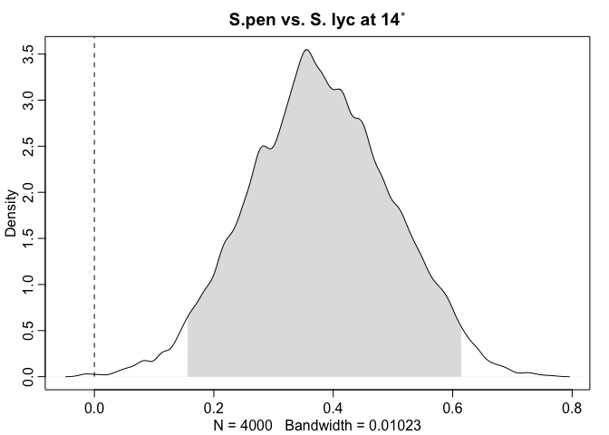

# Germination Analysis
Julin Maloof  
10/4/2016  


```r
d <- read.csv("LironDataTime1.csv")
summary(d)
```

```
##       Time    Temperature    Plate..    Species  Germination
##  Min.   :1   Min.   :14   Min.   :1.0   M82:60   No :38     
##  1st Qu.:1   1st Qu.:14   1st Qu.:2.0   pen:60   Yes:82     
##  Median :1   Median :18   Median :3.5                       
##  Mean   :1   Mean   :18   Mean   :3.5                       
##  3rd Qu.:1   3rd Qu.:22   3rd Qu.:5.0                       
##  Max.   :1   Max.   :22   Max.   :6.0                       
##   Root.length      Shoot.length   
##  Min.   :0.0000   Min.   :0.0000  
##  1st Qu.:0.0000   1st Qu.:0.0000  
##  Median :0.4650   Median :0.0000  
##  Mean   :0.6824   Mean   :0.2863  
##  3rd Qu.:1.1325   3rd Qu.:0.7025  
##  Max.   :2.9000   Max.   :1.5300
```

```r
head(d)
```

```
##   Time Temperature Plate.. Species Germination Root.length Shoot.length
## 1    1          22       1     M82         Yes        0.31         0.00
## 2    1          22       1     pen         Yes        1.36         0.23
## 3    1          22       1     M82         Yes        2.49         1.00
## 4    1          22       1     pen         Yes        1.77         0.86
## 5    1          22       1     M82          No        0.00         0.00
## 6    1          22       1     pen         Yes        1.62         1.13
```

```r
d$Germination2 <- as.numeric(d$Germination)-1 #0 = no, 1 = yes
d$pen <- as.numeric(d$Species)-1 # 1 = pen
d$Temperature_b <- d$Temperature-min(d$Temperature) # baselined temperature
d.stan <- d[,grepl("Germination2|pen|Temperature_b",colnames(d))]
head(d.stan)
```

```
##   Germination2 pen Temperature_b
## 1            1   0             8
## 2            1   1             8
## 3            1   0             8
## 4            1   1             8
## 5            0   0             8
## 6            1   1             8
```

plot the data


```r
pl <- ggplot(d,aes(x=Germination,fill=Germination))
pl + geom_bar() + facet_grid(Species ~ Temperature)
```

<!-- -->

Make an additive model


```r
m1 <- map2stan(alist(Germination2 ~ dbinom(1, p),
                     logit(p) <- a + bPen*pen + bTemp*Temperature_b,
                     c(a,bPen,bTemp) ~ dnorm(0,5)),
               data=d.stan,chains = 4)
```

```
## Computing WAIC
```

```
## Constructing posterior predictions
```


```r
plot(m1)
```

<!-- -->

```r
pairs(m1)
```

<!-- -->

```r
precis(m1)
```

```
##        Mean StdDev lower 0.89 upper 0.89 n_eff Rhat
## a     -0.60   0.34      -1.10       0.00  1543    1
## bPen   1.34   0.44       0.67       2.08  1815    1
## bTemp  0.23   0.06       0.14       0.33  1714    1
```

The PI for both coefficients are above 0 so it seems that both temperature and species have an effect

### Interaction model


```r
m2 <- map2stan(alist(Germination2 ~ dbinom(1, p),
                     logit(p) <- a + bPen*pen + bTemp*Temperature_b + bPen_Temp*pen*Temperature_b,
                     c(a,bPen,bTemp,bPen_Temp) ~ dnorm(0,5)),
               data=d.stan,chains = 4)
```

```
## Computing WAIC
```

```
## Constructing posterior predictions
```


```r
plot(m2)
pairs(m2)
```

<!-- --><!-- -->

```r
precis(m2)
```

```
##            Mean StdDev lower 0.89 upper 0.89 n_eff Rhat
## a         -0.86   0.39      -1.47      -0.23  1335    1
## bPen       1.90   0.56       0.96       2.76  1235    1
## bTemp      0.32   0.08       0.19       0.44  1230    1
## bPen_Temp -0.20   0.12      -0.38      -0.01  1248    1
```


### Species only model


```r
m3 <- map2stan(alist(Germination2 ~ dbinom(1, p),
                     logit(p) <- a + bPen*pen,
                     c(a,bPen) ~ dnorm(0,5)),
               data=d.stan,chains = 4) 
```

```
## Computing WAIC
```

```
## Constructing posterior predictions
```


```r
plot(m3)
pairs(m3)
```

<!-- --><!-- -->

```r
precis(m3)
```

```
##      Mean StdDev lower 0.89 upper 0.89 n_eff Rhat
## a    0.27   0.25      -0.12       0.69  2005    1
## bPen 1.15   0.40       0.58       1.84  2001    1
```

### Temperature only model


```r
m4 <- map2stan(alist(Germination2 ~ dbinom(1, p),
                     logit(p) <- a + bTemp*Temperature_b,
                     c(a,bTemp) ~ dnorm(0,5)),
               data=d.stan,chains = 4)
```

```
## Computing WAIC
```

```
## Constructing posterior predictions
```


```r
plot(m4)
pairs(m4)
```

<!-- --><!-- -->

```r
precis(m4)
```

```
##       Mean StdDev lower 0.89 upper 0.89 n_eff Rhat
## a     0.06   0.25      -0.36       0.44  2288    1
## bTemp 0.22   0.05       0.13       0.30  1619    1
```

### Compare models


```r
compare(m1,m2,m3,m4)
```

```
##     WAIC pWAIC dWAIC weight    SE  dSE
## m2 130.2   4.1   0.0   0.57 12.87   NA
## m1 130.9   3.0   0.7   0.41 12.57 3.63
## m4 137.8   2.0   7.6   0.01 10.58 7.05
## m3 146.0   1.9  15.8   0.00  9.47 9.19
```

```r
coeftab(m1,m2,m3,m4)
```

```
##           m1      m2      m3      m4     
## a           -0.60   -0.86    0.27    0.06
## bPen         1.34    1.90    1.15      NA
## bTemp        0.23    0.32      NA    0.22
## bPen_Temp      NA    -0.2      NA      NA
## nobs          120     120     120     120
```

The interactive and full additive models have a lot of support; the single factor models do not.

### Get predictions


```r
pred.df <- data.frame(
  pen=c(0,0,1,1),
  Temperature_b=c(0,8,0,8))
pred.df
```

```
##   pen Temperature_b
## 1   0             0
## 2   0             8
## 3   1             0
## 4   1             8
```

```r
p.link <- ensemble(m1,m2,data=pred.df,n=4000)$link #using 4000 to try to get smoother estimates
pred.df$p.mean <- apply(p.link,2,mean)
pred.df$p.PI.low <- apply(p.link,2,PI)[1,]
pred.df$p.PI.high <- apply(p.link,2,PI)[2,]

#add nice plotting columns

pred.df$temperature <- pred.df$Temperature_b+min(d$Temperature)
pred.df$species <- ifelse(pred.df$pen,"S.pen","S.lyc")

pl <- ggplot(pred.df,aes(y=p.mean,ymin=p.PI.low,ymax=p.PI.high,x=species,fill=as.factor(temperature)))
pl <- pl + geom_bar(stat = "identity",position="dodge")
pl <- pl + geom_errorbar(width=0.5, position=position_dodge(width=0.9))
pl <- pl + scale_fill_discrete(name="temperature")
pl + ggtitle("predicted germination percentages")
```

<!-- -->

### compare posterior estimates

Temperature difference in S.lyc

```r
S.lyc.temp <- p.link[,2]-p.link[,1]
dens(S.lyc.temp,show.HPDI = 0.95, show.zero = TRUE,xlim=c(-.1,.9),main="S.lyc 22 vs. 14")
```

<!-- -->
Clearly temp influences S.lyc

Temperature difference in S.pen

```r
S.pen.temp <- p.link[,4]-p.link[,3]
dens(S.pen.temp,show.HPDI = 0.95, show.zero = TRUE, main="S.pen 22 vs. 14")
```

<!-- -->

```r
sum(S.pen.temp > 0) / length(S.pen.temp)
```

```
## [1] 0.9565
```
Less clear

S.lyc vs S.pen at 14

```r
S.pen.lyc.14 <- p.link[,3]-p.link[,1]
dens(S.pen.lyc.14,show.HPDI = 0.95, show.zero = TRUE, main="S.pen vs. S. lyc at 14˚")
```

<!-- -->

```r
sum(S.pen.lyc.14 > 0) / length(S.pen.lyc.14)
```

```
## [1] 0.99925
```
Clear difference

S.lyc vs S.pen at 22

```r
S.pen.lyc.22 <- p.link[,4]-p.link[,2]
dens(S.pen.lyc.22,show.HPDI = 0.95, show.zero = TRUE, main="S.pen vs. S. lyc at 22˚")
```

<!-- -->

```r
sum(S.pen.lyc.22 > 0) / length(S.pen.lyc.14)
```

```
## [1] 0.79925
```
No evidence for a difference
