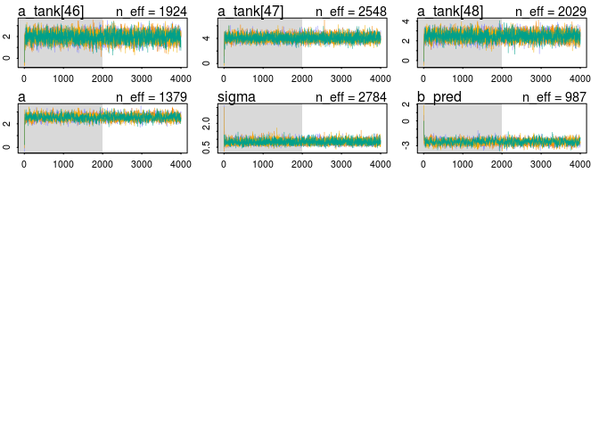
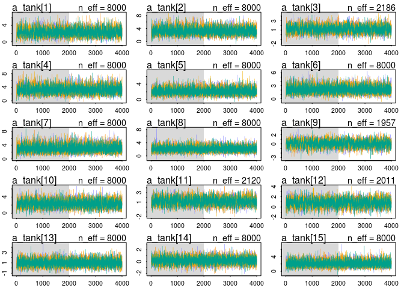
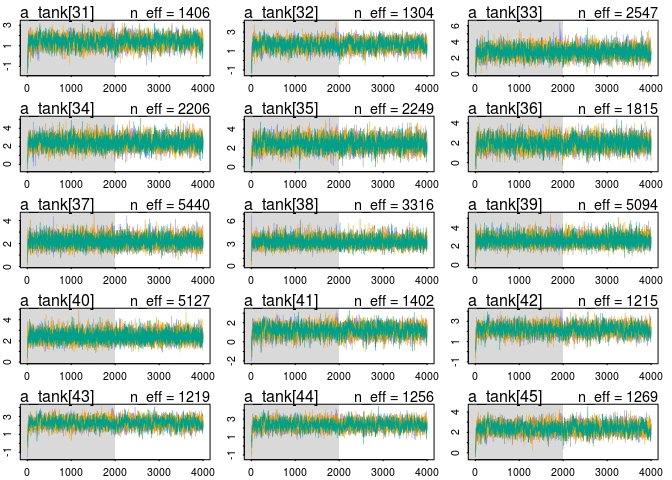

# Chapter 12 Problems
Julin Maloof  
10/27/2016  

## setup


```r
knitr::opts_chunk$set(cache = TRUE, autodep = TRUE)
library(rethinking)
```

```
## Loading required package: rstan
```

```
## Warning: package 'rstan' was built under R version 3.2.5
```

```
## Loading required package: ggplot2
```

```
## Warning: package 'ggplot2' was built under R version 3.2.4
```

```
## Loading required package: StanHeaders
```

```
## Warning: package 'StanHeaders' was built under R version 3.2.5
```

```
## rstan (Version 2.12.1, packaged: 2016-09-11 13:07:50 UTC, GitRev: 85f7a56811da)
```

```
## For execution on a local, multicore CPU with excess RAM we recommend calling
## rstan_options(auto_write = TRUE)
## options(mc.cores = parallel::detectCores())
```

```
## Loading required package: parallel
```

```
## rethinking (Version 1.59)
```

```r
library(brms)
```

```
## Warning: package 'brms' was built under R version 3.2.5
```

```
## Loading 'brms' package (version 1.1.0). Useful instructions 
## can be found by typing help('brms'). A more detailed introduction 
## to the package is available through vignette('brms').
```

```
## 
## Attaching package: 'brms'
```

```
## The following objects are masked from 'package:rethinking':
## 
##     LOO, stancode, WAIC
```

```r
rstan_options(auto_write = TRUE)
options(mc.cores = parallel::detectCores())
```

## 12E1

The prior of normal(0,1) will provide more shrinkage

## 12E2

Instead of 

a_group ~ Normal(0,10)

use 

a_group ~ normal(a,sigma)
a ~ (0,10)
sigma ~ cacuhy(0,1)

## 12M1

alpha only


```r
data(reedfrogs, results='hide')
```

```
## Warning in data(reedfrogs, results = "hide"): data set 'hide' not found
```

```r
d <- reedfrogs
d$tank <- 1:nrow(d)
m12m1.tank <- map2stan(
  alist(
    surv ~ dbinom( density , p ) ,
    logit(p) <- a_tank[tank] ,
    a_tank[tank] ~ dnorm( a , sigma ) ,
    a ~ dnorm(0,1) ,
    sigma ~ dcauchy(0,1)
  ), data=d , iter=4000 , chains=4 )
```

```
## Warning in FUN(X[[i]], ...): data with name pred is not numeric and not
## used
```

```
## Warning in FUN(X[[i]], ...): data with name size is not numeric and not
## used
```

```
## 
## SAMPLING FOR MODEL 'surv ~ dbinom(density, p)' NOW (CHAIN 1).
## 
## Chain 1, Iteration:    1 / 4000 [  0%]  (Warmup)
## Chain 1, Iteration:  400 / 4000 [ 10%]  (Warmup)
## Chain 1, Iteration:  800 / 4000 [ 20%]  (Warmup)
## Chain 1, Iteration: 1200 / 4000 [ 30%]  (Warmup)
## Chain 1, Iteration: 1600 / 4000 [ 40%]  (Warmup)
## Chain 1, Iteration: 2000 / 4000 [ 50%]  (Warmup)
## Chain 1, Iteration: 2001 / 4000 [ 50%]  (Sampling)
## Chain 1, Iteration: 2400 / 4000 [ 60%]  (Sampling)
## Chain 1, Iteration: 2800 / 4000 [ 70%]  (Sampling)
## Chain 1, Iteration: 3200 / 4000 [ 80%]  (Sampling)
## Chain 1, Iteration: 3600 / 4000 [ 90%]  (Sampling)
## Chain 1, Iteration: 4000 / 4000 [100%]  (Sampling)
##  Elapsed Time: 0.325623 seconds (Warm-up)
##                0.284301 seconds (Sampling)
##                0.609924 seconds (Total)
```

```
## The following numerical problems occured the indicated number of times after warmup on chain 1
```

```
##                                                                                 count
## Exception thrown at line 17: normal_log: Scale parameter is 0, but must be > 0!     1
```

```
## When a numerical problem occurs, the Hamiltonian proposal gets rejected.
```

```
## See http://mc-stan.org/misc/warnings.html#exception-hamiltonian-proposal-rejected
```

```
## If the number in the 'count' column is small, do not ask about this message on stan-users.
```

```
## 
## SAMPLING FOR MODEL 'surv ~ dbinom(density, p)' NOW (CHAIN 2).
## 
## Chain 2, Iteration:    1 / 4000 [  0%]  (Warmup)
## Chain 2, Iteration:  400 / 4000 [ 10%]  (Warmup)
## Chain 2, Iteration:  800 / 4000 [ 20%]  (Warmup)
## Chain 2, Iteration: 1200 / 4000 [ 30%]  (Warmup)
## Chain 2, Iteration: 1600 / 4000 [ 40%]  (Warmup)
## Chain 2, Iteration: 2000 / 4000 [ 50%]  (Warmup)
## Chain 2, Iteration: 2001 / 4000 [ 50%]  (Sampling)
## Chain 2, Iteration: 2400 / 4000 [ 60%]  (Sampling)
## Chain 2, Iteration: 2800 / 4000 [ 70%]  (Sampling)
## Chain 2, Iteration: 3200 / 4000 [ 80%]  (Sampling)
## Chain 2, Iteration: 3600 / 4000 [ 90%]  (Sampling)
## Chain 2, Iteration: 4000 / 4000 [100%]  (Sampling)
##  Elapsed Time: 0.307933 seconds (Warm-up)
##                0.283015 seconds (Sampling)
##                0.590948 seconds (Total)
```

```
## The following numerical problems occured the indicated number of times after warmup on chain 2
```

```
##                                                                                 count
## Exception thrown at line 17: normal_log: Scale parameter is 0, but must be > 0!     1
```

```
## When a numerical problem occurs, the Hamiltonian proposal gets rejected.
```

```
## See http://mc-stan.org/misc/warnings.html#exception-hamiltonian-proposal-rejected
```

```
## If the number in the 'count' column is small, do not ask about this message on stan-users.
```

```
## 
## SAMPLING FOR MODEL 'surv ~ dbinom(density, p)' NOW (CHAIN 3).
## 
## Chain 3, Iteration:    1 / 4000 [  0%]  (Warmup)
## Chain 3, Iteration:  400 / 4000 [ 10%]  (Warmup)
## Chain 3, Iteration:  800 / 4000 [ 20%]  (Warmup)
## Chain 3, Iteration: 1200 / 4000 [ 30%]  (Warmup)
## Chain 3, Iteration: 1600 / 4000 [ 40%]  (Warmup)
## Chain 3, Iteration: 2000 / 4000 [ 50%]  (Warmup)
## Chain 3, Iteration: 2001 / 4000 [ 50%]  (Sampling)
## Chain 3, Iteration: 2400 / 4000 [ 60%]  (Sampling)
## Chain 3, Iteration: 2800 / 4000 [ 70%]  (Sampling)
## Chain 3, Iteration: 3200 / 4000 [ 80%]  (Sampling)
## Chain 3, Iteration: 3600 / 4000 [ 90%]  (Sampling)
## Chain 3, Iteration: 4000 / 4000 [100%]  (Sampling)
##  Elapsed Time: 0.342051 seconds (Warm-up)
##                0.291322 seconds (Sampling)
##                0.633373 seconds (Total)
## 
## 
## SAMPLING FOR MODEL 'surv ~ dbinom(density, p)' NOW (CHAIN 4).
## 
## Chain 4, Iteration:    1 / 4000 [  0%]  (Warmup)
## Chain 4, Iteration:  400 / 4000 [ 10%]  (Warmup)
## Chain 4, Iteration:  800 / 4000 [ 20%]  (Warmup)
## Chain 4, Iteration: 1200 / 4000 [ 30%]  (Warmup)
## Chain 4, Iteration: 1600 / 4000 [ 40%]  (Warmup)
## Chain 4, Iteration: 2000 / 4000 [ 50%]  (Warmup)
## Chain 4, Iteration: 2001 / 4000 [ 50%]  (Sampling)
## Chain 4, Iteration: 2400 / 4000 [ 60%]  (Sampling)
## Chain 4, Iteration: 2800 / 4000 [ 70%]  (Sampling)
## Chain 4, Iteration: 3200 / 4000 [ 80%]  (Sampling)
## Chain 4, Iteration: 3600 / 4000 [ 90%]  (Sampling)
## Chain 4, Iteration: 4000 / 4000 [100%]  (Sampling)
##  Elapsed Time: 0.334983 seconds (Warm-up)
##                0.307648 seconds (Sampling)
##                0.642631 seconds (Total)
```

```
## The following numerical problems occured the indicated number of times after warmup on chain 4
```

```
##                                                                                 count
## Exception thrown at line 17: normal_log: Scale parameter is 0, but must be > 0!     1
```

```
## When a numerical problem occurs, the Hamiltonian proposal gets rejected.
```

```
## See http://mc-stan.org/misc/warnings.html#exception-hamiltonian-proposal-rejected
```

```
## If the number in the 'count' column is small, do not ask about this message on stan-users.
```

```
## Warning in FUN(X[[i]], ...): data with name pred is not numeric and not
## used

## Warning in FUN(X[[i]], ...): data with name size is not numeric and not
## used
```

```
## 
## SAMPLING FOR MODEL 'surv ~ dbinom(density, p)' NOW (CHAIN 1).
## WARNING: No variance estimation is
##          performed for num_warmup < 20
## 
## 
## Chain 1, Iteration: 1 / 1 [100%]  (Sampling)
##  Elapsed Time: 4e-06 seconds (Warm-up)
##                7.6e-05 seconds (Sampling)
##                8e-05 seconds (Total)
```

```
## Computing WAIC
```

```
## Constructing posterior predictions
```

```
## [ 800 / 8000 ]
[ 1600 / 8000 ]
[ 2400 / 8000 ]
[ 3200 / 8000 ]
[ 4000 / 8000 ]
[ 4800 / 8000 ]
[ 5600 / 8000 ]
[ 6400 / 8000 ]
[ 7200 / 8000 ]
[ 8000 / 8000 ]
```

```
## Aggregated binomial counts detected. Splitting to 0/1 outcome for WAIC calculation.
```


```r
plot(m12m1.tank,ask=FALSE)
```

```
## Waiting to draw page 2 of 4
```

<!-- -->

```
## Waiting to draw page 3 of 4
```

<!-- -->

```
## Waiting to draw page 4 of 4
```

<!-- -->

```r
precis(m12m1.tank)
```

```
## 48 vector or matrix parameters omitted in display. Use depth=2 to show them.
```

```
##       Mean StdDev lower 0.89 upper 0.89 n_eff Rhat
## a     1.30   0.25       0.93       1.71  8000    1
## sigma 1.62   0.22       1.29       1.97  5414    1
```

<!-- -->


with predation


```r
d$pred2 <- ifelse(d$pred=="pred",1,0)
m12m1.tank.pred <- map2stan(
  alist(
    surv ~ dbinom( density , p ) ,
    logit(p) <- a_tank[tank] + b_pred*pred2 ,
    a_tank[tank] ~ dnorm( a , sigma ) ,
    a ~ dnorm(0,1) ,
    sigma ~ dcauchy(0,1),
    b_pred ~ dnorm(0,5)
  ), data=d , iter=4000 , chains=4 )
```

```
## Warning in FUN(X[[i]], ...): data with name pred is not numeric and not
## used
```

```
## Warning in FUN(X[[i]], ...): data with name size is not numeric and not
## used
```

```
## The following numerical problems occured the indicated number of times after warmup on chain 4
```

```
##                                                                                 count
## Exception thrown at line 20: normal_log: Scale parameter is 0, but must be > 0!     1
```

```
## When a numerical problem occurs, the Hamiltonian proposal gets rejected.
```

```
## See http://mc-stan.org/misc/warnings.html#exception-hamiltonian-proposal-rejected
```

```
## If the number in the 'count' column is small, do not ask about this message on stan-users.
```

```
## Warning in FUN(X[[i]], ...): data with name pred is not numeric and not
## used

## Warning in FUN(X[[i]], ...): data with name size is not numeric and not
## used
```

```
## Computing WAIC
```

```
## Constructing posterior predictions
```

```
## Aggregated binomial counts detected. Splitting to 0/1 outcome for WAIC calculation.
```


```r
plot(m12m1.tank.pred,ask=FALSE)
```

```
## Waiting to draw page 2 of 4
```

<!-- -->

```
## Waiting to draw page 3 of 4
```

<!-- -->

```
## Waiting to draw page 4 of 4
```

<!-- -->

```r
precis(m12m1.tank.pred)
```

```
## 48 vector or matrix parameters omitted in display. Use depth=2 to show them.
```

```
##         Mean StdDev lower 0.89 upper 0.89 n_eff Rhat
## a       2.57   0.23       2.20       2.93  1385 1.01
## sigma   0.83   0.14       0.61       1.04  2997 1.00
## b_pred -2.54   0.30      -3.02      -2.07  1153 1.01
```

<!-- -->

with size


```r
d$big <- ifelse(d$size=="big",1,0)
m12m1.tank.size <- map2stan(
  alist(
    surv ~ dbinom( density , p ) ,
    logit(p) <- a_tank[tank] + b_big*big ,
    a_tank[tank] ~ dnorm( a , sigma ) ,
    a ~ dnorm(0,1) ,
    sigma ~ dcauchy(0,1),
    b_big ~ dnorm(0,5)
  ), data=d , iter=4000 , chains=4 )
```

```
## Warning in FUN(X[[i]], ...): data with name pred is not numeric and not
## used
```

```
## Warning in FUN(X[[i]], ...): data with name size is not numeric and not
## used
```

```
## The following numerical problems occured the indicated number of times after warmup on chain 2
```

```
##                                                                                 count
## Exception thrown at line 20: normal_log: Scale parameter is 0, but must be > 0!     1
```

```
## When a numerical problem occurs, the Hamiltonian proposal gets rejected.
```

```
## See http://mc-stan.org/misc/warnings.html#exception-hamiltonian-proposal-rejected
```

```
## If the number in the 'count' column is small, do not ask about this message on stan-users.
```

```
## The following numerical problems occured the indicated number of times after warmup on chain 3
```

```
##                                                                                 count
## Exception thrown at line 20: normal_log: Scale parameter is 0, but must be > 0!     1
```

```
## When a numerical problem occurs, the Hamiltonian proposal gets rejected.
```

```
## See http://mc-stan.org/misc/warnings.html#exception-hamiltonian-proposal-rejected
```

```
## If the number in the 'count' column is small, do not ask about this message on stan-users.
```

```
## Warning in FUN(X[[i]], ...): data with name pred is not numeric and not
## used

## Warning in FUN(X[[i]], ...): data with name size is not numeric and not
## used
```

```
## Computing WAIC
```

```
## Constructing posterior predictions
```

```
## Aggregated binomial counts detected. Splitting to 0/1 outcome for WAIC calculation.
```


```r
plot(m12m1.tank.size,ask=FALSE)
```

```
## Waiting to draw page 2 of 4
```

<!-- -->

```
## Waiting to draw page 3 of 4
```

<!-- -->

```
## Waiting to draw page 4 of 4
```

<!-- -->

```r
precis(m12m1.tank.size)
```

```
## 48 vector or matrix parameters omitted in display. Use depth=2 to show them.
```

```
##        Mean StdDev lower 0.89 upper 0.89 n_eff Rhat
## a      1.43   0.35       0.91       2.01  1366    1
## sigma  1.63   0.22       1.30       1.97  3941    1
## b_big -0.27   0.51      -1.09       0.55   802    1
```

<!-- -->

additive, with pred and size


```r
m12m1.tank.pred.size <- map2stan(
  alist(
    surv ~ dbinom( density , p ) ,
    logit(p) <- a_tank[tank] + b_big*big + b_pred*pred2,
    a_tank[tank] ~ dnorm( a , sigma ) ,
    a ~ dnorm(0,1) ,
    sigma ~ dcauchy(0,1),
    c(b_big,b_pred) ~ dnorm(0,5)
  ), data=d , iter=4000 , chains=4 )
```

```
## Warning in FUN(X[[i]], ...): data with name pred is not numeric and not
## used
```

```
## Warning in FUN(X[[i]], ...): data with name size is not numeric and not
## used
```

```
## The following numerical problems occured the indicated number of times after warmup on chain 2
```

```
##                                                                                 count
## Exception thrown at line 23: normal_log: Scale parameter is 0, but must be > 0!     2
```

```
## When a numerical problem occurs, the Hamiltonian proposal gets rejected.
```

```
## See http://mc-stan.org/misc/warnings.html#exception-hamiltonian-proposal-rejected
```

```
## If the number in the 'count' column is small, do not ask about this message on stan-users.
```

```
## The following numerical problems occured the indicated number of times after warmup on chain 3
```

```
##                                                                                 count
## Exception thrown at line 23: normal_log: Scale parameter is 0, but must be > 0!     2
```

```
## When a numerical problem occurs, the Hamiltonian proposal gets rejected.
```

```
## See http://mc-stan.org/misc/warnings.html#exception-hamiltonian-proposal-rejected
```

```
## If the number in the 'count' column is small, do not ask about this message on stan-users.
```

```
## The following numerical problems occured the indicated number of times after warmup on chain 4
```

```
##                                                                                 count
## Exception thrown at line 23: normal_log: Scale parameter is 0, but must be > 0!     1
```

```
## When a numerical problem occurs, the Hamiltonian proposal gets rejected.
```

```
## See http://mc-stan.org/misc/warnings.html#exception-hamiltonian-proposal-rejected
```

```
## If the number in the 'count' column is small, do not ask about this message on stan-users.
```

```
## Warning in FUN(X[[i]], ...): data with name pred is not numeric and not
## used

## Warning in FUN(X[[i]], ...): data with name size is not numeric and not
## used
```

```
## Computing WAIC
```

```
## Constructing posterior predictions
```

```
## Aggregated binomial counts detected. Splitting to 0/1 outcome for WAIC calculation.
```


```r
plot(m12m1.tank.pred.size,ask=FALSE)
```

```
## Waiting to draw page 2 of 4
```

<!-- -->

```
## Waiting to draw page 3 of 4
```

<!-- -->

```
## Waiting to draw page 4 of 4
```

<!-- -->

```r
precis(m12m1.tank.pred.size)
```

```
## 48 vector or matrix parameters omitted in display. Use depth=2 to show them.
```

```
##         Mean StdDev lower 0.89 upper 0.89 n_eff Rhat
## a       2.73   0.27       2.30       3.16   969    1
## sigma   0.78   0.14       0.55       0.99  2673    1
## b_big  -0.39   0.29      -0.85       0.08  1892    1
## b_pred -2.51   0.30      -2.97      -2.01  1149    1
```

<!-- -->

interaction, with pred and size


```r
m12m1.tank.pred.size.int <- map2stan(
  alist(
    surv ~ dbinom( density , p ) ,
    logit(p) <- a_tank[tank] + b_big*big + b_pred*pred2 + b_big_pred*big*pred2,
    a_tank[tank] ~ dnorm( a , sigma ) ,
    a ~ dnorm(0,1) ,
    sigma ~ dcauchy(0,1),
    c(b_big,b_pred,b_big_pred) ~ dnorm(0,5)
  ), data=d , iter=4000 , chains=4 )
```

```
## Warning in FUN(X[[i]], ...): data with name pred is not numeric and not
## used
```

```
## Warning in FUN(X[[i]], ...): data with name size is not numeric and not
## used
```

```
## The following numerical problems occured the indicated number of times after warmup on chain 2
```

```
##                                                                                 count
## Exception thrown at line 25: normal_log: Scale parameter is 0, but must be > 0!     1
```

```
## When a numerical problem occurs, the Hamiltonian proposal gets rejected.
```

```
## See http://mc-stan.org/misc/warnings.html#exception-hamiltonian-proposal-rejected
```

```
## If the number in the 'count' column is small, do not ask about this message on stan-users.
```

```
## The following numerical problems occured the indicated number of times after warmup on chain 3
```

```
##                                                                                 count
## Exception thrown at line 25: normal_log: Scale parameter is 0, but must be > 0!     1
```

```
## When a numerical problem occurs, the Hamiltonian proposal gets rejected.
```

```
## See http://mc-stan.org/misc/warnings.html#exception-hamiltonian-proposal-rejected
```

```
## If the number in the 'count' column is small, do not ask about this message on stan-users.
```

```
## The following numerical problems occured the indicated number of times after warmup on chain 4
```

```
##                                                                                 count
## Exception thrown at line 25: normal_log: Scale parameter is 0, but must be > 0!     1
```

```
## When a numerical problem occurs, the Hamiltonian proposal gets rejected.
```

```
## See http://mc-stan.org/misc/warnings.html#exception-hamiltonian-proposal-rejected
```

```
## If the number in the 'count' column is small, do not ask about this message on stan-users.
```

```
## Warning in FUN(X[[i]], ...): data with name pred is not numeric and not
## used

## Warning in FUN(X[[i]], ...): data with name size is not numeric and not
## used
```

```
## Computing WAIC
```

```
## Constructing posterior predictions
```

```
## Aggregated binomial counts detected. Splitting to 0/1 outcome for WAIC calculation.
```


```r
plot(m12m1.tank.pred.size.int,ask=FALSE)
```

```
## Waiting to draw page 2 of 4
```

<!-- -->

```
## Waiting to draw page 3 of 4
```

<!-- -->

```
## Waiting to draw page 4 of 4
```

<!-- -->

```r
precis(m12m1.tank.pred.size.int)
```

```
## 48 vector or matrix parameters omitted in display. Use depth=2 to show them.
```

```
##             Mean StdDev lower 0.89 upper 0.89 n_eff Rhat
## a           2.37   0.30       1.91       2.85   581 1.01
## sigma       0.76   0.15       0.51       0.97  1908 1.00
## b_big       0.41   0.45      -0.28       1.14  1006 1.01
## b_pred     -1.89   0.40      -2.50      -1.24   689 1.01
## b_big_pred -1.34   0.58      -2.22      -0.38  1247 1.00
```

```r
par(mfrow=c(1,1))
```

<!-- -->

_Focus on the inferred variation across tanks.  Explain why it changes as it does across models_

At first pass we can just look at the `sigma` parameter from each model as this is the estimate of adaptive estimate of standard deviation from tank to tank.


```r
precis(m12m1.tank)
```

```
## 48 vector or matrix parameters omitted in display. Use depth=2 to show them.
```

```
##       Mean StdDev lower 0.89 upper 0.89 n_eff Rhat
## a     1.30   0.25       0.93       1.71  8000    1
## sigma 1.62   0.22       1.29       1.97  5414    1
```

```r
precis(m12m1.tank.pred)
```

```
## 48 vector or matrix parameters omitted in display. Use depth=2 to show them.
```

```
##         Mean StdDev lower 0.89 upper 0.89 n_eff Rhat
## a       2.57   0.23       2.20       2.93  1385 1.01
## sigma   0.83   0.14       0.61       1.04  2997 1.00
## b_pred -2.54   0.30      -3.02      -2.07  1153 1.01
```

```r
precis(m12m1.tank.size)
```

```
## 48 vector or matrix parameters omitted in display. Use depth=2 to show them.
```

```
##        Mean StdDev lower 0.89 upper 0.89 n_eff Rhat
## a      1.43   0.35       0.91       2.01  1366    1
## sigma  1.63   0.22       1.30       1.97  3941    1
## b_big -0.27   0.51      -1.09       0.55   802    1
```

```r
precis(m12m1.tank.pred.size)
```

```
## 48 vector or matrix parameters omitted in display. Use depth=2 to show them.
```

```
##         Mean StdDev lower 0.89 upper 0.89 n_eff Rhat
## a       2.73   0.27       2.30       3.16   969    1
## sigma   0.78   0.14       0.55       0.99  2673    1
## b_big  -0.39   0.29      -0.85       0.08  1892    1
## b_pred -2.51   0.30      -2.97      -2.01  1149    1
```

```r
precis(m12m1.tank.pred.size.int)
```

```
## 48 vector or matrix parameters omitted in display. Use depth=2 to show them.
```

```
##             Mean StdDev lower 0.89 upper 0.89 n_eff Rhat
## a           2.37   0.30       1.91       2.85   581 1.01
## sigma       0.76   0.15       0.51       0.97  1908 1.00
## b_big       0.41   0.45      -0.28       1.14  1006 1.01
## b_pred     -1.89   0.40      -2.50      -1.24   689 1.01
## b_big_pred -1.34   0.58      -2.22      -0.38  1247 1.00
```

Basically we see that having predation in the model reduces variance among tanks.  This is because predation is a strong predicor of survival, so including it in the model reduces the otherwise unexplained tank to tank variance.

## 12M2

_Compare the models you fit just above, using WAIC.  Can you reconcile the differences in WAIC with the posterior distributions of the models?_


```r
compare(m12m1.tank,m12m1.tank.pred,m12m1.tank.size,m12m1.tank.pred.size,m12m1.tank.pred.size.int)
```

```
##                            WAIC pWAIC dWAIC weight    SE  dSE
## m12m1.tank.pred          1000.1  28.8   0.0   0.42 37.48   NA
## m12m1.tank.pred.size     1000.8  28.0   0.6   0.30 37.36 1.64
## m12m1.tank.pred.size.int 1001.0  28.2   0.8   0.27 37.73 2.92
## m12m1.tank               1009.1  37.5   8.9   0.00 37.96 6.54
## m12m1.tank.size          1009.8  37.9   9.7   0.00 38.14 6.61
```

Models that include `pred` have a smaller number of effective parameters and a lower WAIC.  This makes sense w.r.t. the posterior distributions; tanks 

## Fit one of these with brms


```r
m12m1.tank.pred.size.int.b <- 
  brm(surv | trials(density) ~ 0 + (1| tank) + pred*size,
               data=d,
               family=binomial(link = "logit"),
               prior=c(set_prior("cauchy(0,1)", class = "sd"),
                       set_prior("normal(0,5)", class = "b")))
```

```
## Compiling the C++ model
```


```r
plot(m12m1.tank.pred.size.int.b)
```

<!-- -->

```r
m12m1.tank.pred.size.int.b
```

```
##  Family: binomial (logit) 
## Formula: surv | trials(density) ~ 0 + (1 | tank) + pred * size 
##    Data: d (Number of observations: 48) 
## Samples: 4 chains, each with iter = 2000; warmup = 1000; thin = 1; 
##          total post-warmup samples = 4000
##    WAIC: Not computed
##  
## Group-Level Effects: 
## ~tank (Number of levels: 48) 
##               Estimate Est.Error l-95% CI u-95% CI Eff.Sample Rhat
## sd(Intercept)     0.74      0.14     0.49     1.06       1340    1
## 
## Population-Level Effects: 
##                    Estimate Est.Error l-95% CI u-95% CI Eff.Sample Rhat
## predno                 2.76      0.33     2.13     3.44       2333    1
## predpred              -0.44      0.25    -0.92     0.07       1999    1
## sizesmall             -0.15      0.44    -1.05     0.70       2287    1
## predpred:sizesmall     1.07      0.56    -0.02     2.15       1930    1
## 
## Samples were drawn using sampling(NUTS). For each parameter, Eff.Sample 
## is a crude measure of effective sample size, and Rhat is the potential 
## scale reduction factor on split chains (at convergence, Rhat = 1).
```

```r
precis(m12m1.tank.pred.size.int)
```

```
## 48 vector or matrix parameters omitted in display. Use depth=2 to show them.
```

```
##             Mean StdDev lower 0.89 upper 0.89 n_eff Rhat
## a           2.37   0.30       1.91       2.85   581 1.01
## sigma       0.76   0.15       0.51       0.97  1908 1.00
## b_big       0.41   0.45      -0.28       1.14  1006 1.01
## b_pred     -1.89   0.40      -2.50      -1.24   689 1.01
## b_big_pred -1.34   0.58      -2.22      -0.38  1247 1.00
```

