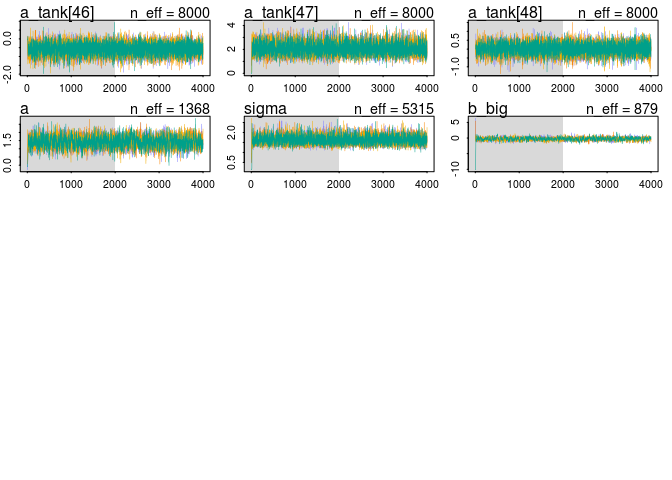
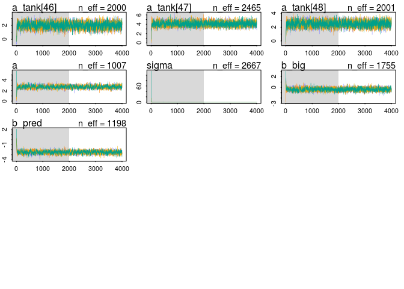
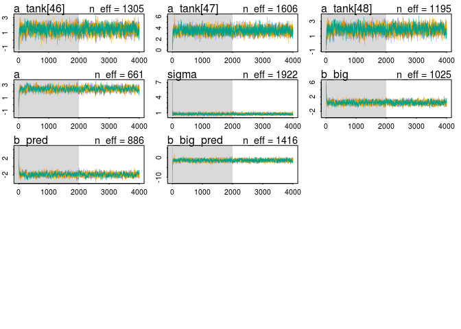
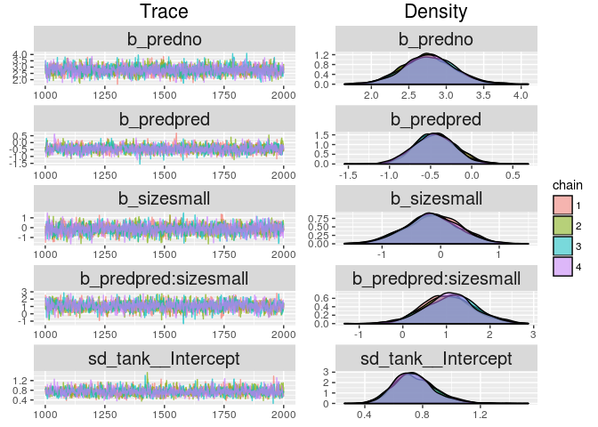
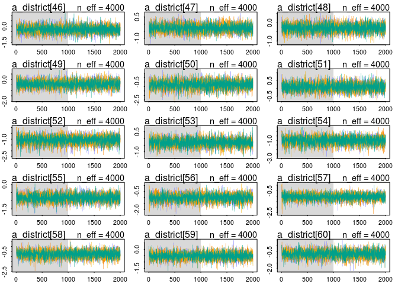
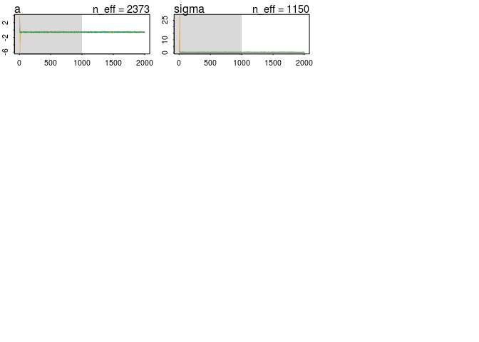

# Chapter 12 Problems
Julin Maloof  
10/27/2016  

## setup


```r
knitr::opts_chunk$set(cache = TRUE, autodep = TRUE)
library(rethinking)
```

```
## Loading required package: rstan
```

```
## Loading required package: ggplot2
```

```
## Loading required package: StanHeaders
```

```
## rstan (Version 2.12.1, packaged: 2016-09-11 13:07:50 UTC, GitRev: 85f7a56811da)
```

```
## For execution on a local, multicore CPU with excess RAM we recommend calling
## rstan_options(auto_write = TRUE)
## options(mc.cores = parallel::detectCores())
```

```
## Loading required package: parallel
```

```
## rethinking (Version 1.59)
```

```r
library(brms)
```

```
## Loading 'brms' package (version 1.1.0). Useful instructions 
## can be found by typing help('brms'). A more detailed introduction 
## to the package is available through vignette('brms').
```

```
## 
## Attaching package: 'brms'
```

```
## The following objects are masked from 'package:rethinking':
## 
##     LOO, stancode, WAIC
```

```r
rstan_options(auto_write = TRUE)
options(mc.cores = parallel::detectCores())
```

## 12E1

The prior of normal(0,1) will provide more shrinkage

## 12E2

Instead of 

a_group ~ Normal(0,10)

use 

a_group ~ normal(a,sigma)
a ~ (0,10)
sigma ~ cacuhy(0,1)

## 12M1

alpha only


```r
data(reedfrogs)
d <- reedfrogs
d$tank <- 1:nrow(d)
m12m1.tank <- map2stan(
  alist(
    surv ~ dbinom( density , p ) ,
    logit(p) <- a_tank[tank] ,
    a_tank[tank] ~ dnorm( a , sigma ) ,
    a ~ dnorm(0,1) ,
    sigma ~ dcauchy(0,1)
  ), data=d , iter=4000 , chains=4 )
```

```
## Warning in FUN(X[[i]], ...): data with name pred is not numeric and not
## used
```

```
## Warning in FUN(X[[i]], ...): data with name size is not numeric and not
## used
```

```
## Warning in FUN(X[[i]], ...): data with name pred is not numeric and not
## used
```

```
## Warning in FUN(X[[i]], ...): data with name size is not numeric and not
## used
```

```
## Computing WAIC
```

```
## Constructing posterior predictions
```

```
## Aggregated binomial counts detected. Splitting to 0/1 outcome for WAIC calculation.
```


```r
plot(m12m1.tank,ask=FALSE)
```

```
## Waiting to draw page 2 of 4
```

<!-- -->

```
## Waiting to draw page 3 of 4
```

<!-- -->

```
## Waiting to draw page 4 of 4
```

<!-- -->

```r
precis(m12m1.tank)
```

```
## 48 vector or matrix parameters omitted in display. Use depth=2 to show them.
```

```
##       Mean StdDev lower 0.89 upper 0.89 n_eff Rhat
## a     1.30   0.24       0.91       1.69  8000    1
## sigma 1.62   0.21       1.29       1.95  5464    1
```

<!-- -->


with predation


```r
d$pred2 <- ifelse(d$pred=="pred",1,0)
m12m1.tank.pred <- map2stan(
  alist(
    surv ~ dbinom( density , p ) ,
    logit(p) <- a_tank[tank] + b_pred*pred2 ,
    a_tank[tank] ~ dnorm( a , sigma ) ,
    a ~ dnorm(0,1) ,
    sigma ~ dcauchy(0,1),
    b_pred ~ dnorm(0,5)
  ), data=d , iter=4000 , chains=4 )
```

```
## Warning in FUN(X[[i]], ...): data with name pred is not numeric and not
## used
```

```
## Warning in FUN(X[[i]], ...): data with name size is not numeric and not
## used
```

```
## The following numerical problems occured the indicated number of times after warmup on chain 2
```

```
##                                                                                 count
## Exception thrown at line 20: normal_log: Scale parameter is 0, but must be > 0!     1
```

```
## When a numerical problem occurs, the Hamiltonian proposal gets rejected.
```

```
## See http://mc-stan.org/misc/warnings.html#exception-hamiltonian-proposal-rejected
```

```
## If the number in the 'count' column is small, do not ask about this message on stan-users.
```

```
## The following numerical problems occured the indicated number of times after warmup on chain 4
```

```
##                                                                                 count
## Exception thrown at line 20: normal_log: Scale parameter is 0, but must be > 0!     1
```

```
## When a numerical problem occurs, the Hamiltonian proposal gets rejected.
```

```
## See http://mc-stan.org/misc/warnings.html#exception-hamiltonian-proposal-rejected
```

```
## If the number in the 'count' column is small, do not ask about this message on stan-users.
```

```
## Warning in FUN(X[[i]], ...): data with name pred is not numeric and not
## used

## Warning in FUN(X[[i]], ...): data with name size is not numeric and not
## used
```

```
## Computing WAIC
```

```
## Constructing posterior predictions
```

```
## Aggregated binomial counts detected. Splitting to 0/1 outcome for WAIC calculation.
```


```r
plot(m12m1.tank.pred,ask=FALSE)
```

```
## Waiting to draw page 2 of 4
```

<!-- -->

```
## Waiting to draw page 3 of 4
```

<!-- -->

```
## Waiting to draw page 4 of 4
```

<!-- -->

```r
precis(m12m1.tank.pred)
```

```
## 48 vector or matrix parameters omitted in display. Use depth=2 to show them.
```

```
##         Mean StdDev lower 0.89 upper 0.89 n_eff Rhat
## a       2.56   0.23       2.21       2.94  1303 1.01
## sigma   0.82   0.14       0.61       1.04  2798 1.00
## b_pred -2.53   0.30      -3.02      -2.07  1059 1.01
```

<!-- -->

with size


```r
d$big <- ifelse(d$size=="big",1,0)
m12m1.tank.size <- map2stan(
  alist(
    surv ~ dbinom( density , p ) ,
    logit(p) <- a_tank[tank] + b_big*big ,
    a_tank[tank] ~ dnorm( a , sigma ) ,
    a ~ dnorm(0,1) ,
    sigma ~ dcauchy(0,1),
    b_big ~ dnorm(0,5)
  ), data=d , iter=4000 , chains=4 )
```

```
## Warning in FUN(X[[i]], ...): data with name pred is not numeric and not
## used
```

```
## Warning in FUN(X[[i]], ...): data with name size is not numeric and not
## used
```

```
## The following numerical problems occured the indicated number of times after warmup on chain 2
```

```
##                                                                                 count
## Exception thrown at line 20: normal_log: Scale parameter is 0, but must be > 0!     1
```

```
## When a numerical problem occurs, the Hamiltonian proposal gets rejected.
```

```
## See http://mc-stan.org/misc/warnings.html#exception-hamiltonian-proposal-rejected
```

```
## If the number in the 'count' column is small, do not ask about this message on stan-users.
```

```
## The following numerical problems occured the indicated number of times after warmup on chain 3
```

```
##                                                                                 count
## Exception thrown at line 20: normal_log: Scale parameter is 0, but must be > 0!     1
```

```
## When a numerical problem occurs, the Hamiltonian proposal gets rejected.
```

```
## See http://mc-stan.org/misc/warnings.html#exception-hamiltonian-proposal-rejected
```

```
## If the number in the 'count' column is small, do not ask about this message on stan-users.
```

```
## Warning in FUN(X[[i]], ...): data with name pred is not numeric and not
## used

## Warning in FUN(X[[i]], ...): data with name size is not numeric and not
## used
```

```
## Computing WAIC
```

```
## Constructing posterior predictions
```

```
## Aggregated binomial counts detected. Splitting to 0/1 outcome for WAIC calculation.
```


```r
plot(m12m1.tank.size,ask=FALSE)
```

```
## Waiting to draw page 2 of 4
```

<!-- -->

```
## Waiting to draw page 3 of 4
```

<!-- -->

```
## Waiting to draw page 4 of 4
```

<!-- -->

```r
precis(m12m1.tank.size)
```

```
## 48 vector or matrix parameters omitted in display. Use depth=2 to show them.
```

```
##        Mean StdDev lower 0.89 upper 0.89 n_eff Rhat
## a      1.41   0.34       0.90       2.00   974    1
## sigma  1.62   0.22       1.29       1.96  4322    1
## b_big -0.25   0.51      -1.08       0.54   829    1
```

<!-- -->

additive, with pred and size


```r
m12m1.tank.pred.size <- map2stan(
  alist(
    surv ~ dbinom( density , p ) ,
    logit(p) <- a_tank[tank] + b_big*big + b_pred*pred2,
    a_tank[tank] ~ dnorm( a , sigma ) ,
    a ~ dnorm(0,1) ,
    sigma ~ dcauchy(0,1),
    c(b_big,b_pred) ~ dnorm(0,5)
  ), data=d , iter=4000 , chains=4 )
```

```
## Warning in FUN(X[[i]], ...): data with name pred is not numeric and not
## used
```

```
## Warning in FUN(X[[i]], ...): data with name size is not numeric and not
## used
```

```
## The following numerical problems occured the indicated number of times after warmup on chain 2
```

```
##                                                                                 count
## Exception thrown at line 23: normal_log: Scale parameter is 0, but must be > 0!     2
```

```
## When a numerical problem occurs, the Hamiltonian proposal gets rejected.
```

```
## See http://mc-stan.org/misc/warnings.html#exception-hamiltonian-proposal-rejected
```

```
## If the number in the 'count' column is small, do not ask about this message on stan-users.
```

```
## Warning in FUN(X[[i]], ...): data with name pred is not numeric and not
## used

## Warning in FUN(X[[i]], ...): data with name size is not numeric and not
## used
```

```
## Computing WAIC
```

```
## Constructing posterior predictions
```

```
## Aggregated binomial counts detected. Splitting to 0/1 outcome for WAIC calculation.
```


```r
plot(m12m1.tank.pred.size,ask=FALSE)
```

```
## Waiting to draw page 2 of 4
```

<!-- -->

```
## Waiting to draw page 3 of 4
```

<!-- -->

```
## Waiting to draw page 4 of 4
```

<!-- -->

```r
precis(m12m1.tank.pred.size)
```

```
## 48 vector or matrix parameters omitted in display. Use depth=2 to show them.
```

```
##         Mean StdDev lower 0.89 upper 0.89 n_eff Rhat
## a       2.74   0.27       2.29       3.16   865    1
## sigma   0.78   0.14       0.57       1.00  2252    1
## b_big  -0.39   0.30      -0.86       0.07  1642    1
## b_pred -2.52   0.30      -3.01      -2.06  1081    1
```

<!-- -->

interaction, with pred and size


```r
m12m1.tank.pred.size.int <- map2stan(
  alist(
    surv ~ dbinom( density , p ) ,
    logit(p) <- a_tank[tank] + b_big*big + b_pred*pred2 + b_big_pred*big*pred2,
    a_tank[tank] ~ dnorm( a , sigma ) ,
    a ~ dnorm(0,1) ,
    sigma ~ dcauchy(0,1),
    c(b_big,b_pred,b_big_pred) ~ dnorm(0,5)
  ), data=d , iter=4000 , chains=4 )
```

```
## Warning in FUN(X[[i]], ...): data with name pred is not numeric and not
## used
```

```
## Warning in FUN(X[[i]], ...): data with name size is not numeric and not
## used
```

```
## The following numerical problems occured the indicated number of times after warmup on chain 1
```

```
##                                                                                 count
## Exception thrown at line 25: normal_log: Scale parameter is 0, but must be > 0!     1
```

```
## When a numerical problem occurs, the Hamiltonian proposal gets rejected.
```

```
## See http://mc-stan.org/misc/warnings.html#exception-hamiltonian-proposal-rejected
```

```
## If the number in the 'count' column is small, do not ask about this message on stan-users.
```

```
## The following numerical problems occured the indicated number of times after warmup on chain 2
```

```
##                                                                                 count
## Exception thrown at line 25: normal_log: Scale parameter is 0, but must be > 0!     1
```

```
## When a numerical problem occurs, the Hamiltonian proposal gets rejected.
```

```
## See http://mc-stan.org/misc/warnings.html#exception-hamiltonian-proposal-rejected
```

```
## If the number in the 'count' column is small, do not ask about this message on stan-users.
```

```
## The following numerical problems occured the indicated number of times after warmup on chain 4
```

```
##                                                                                 count
## Exception thrown at line 25: normal_log: Scale parameter is 0, but must be > 0!     1
```

```
## When a numerical problem occurs, the Hamiltonian proposal gets rejected.
```

```
## See http://mc-stan.org/misc/warnings.html#exception-hamiltonian-proposal-rejected
```

```
## If the number in the 'count' column is small, do not ask about this message on stan-users.
```

```
## Warning in FUN(X[[i]], ...): data with name pred is not numeric and not
## used

## Warning in FUN(X[[i]], ...): data with name size is not numeric and not
## used
```

```
## Computing WAIC
```

```
## Constructing posterior predictions
```

```
## Aggregated binomial counts detected. Splitting to 0/1 outcome for WAIC calculation.
```


```r
plot(m12m1.tank.pred.size.int,ask=FALSE)
```

```
## Waiting to draw page 2 of 4
```

<!-- -->

```
## Waiting to draw page 3 of 4
```

<!-- -->

```
## Waiting to draw page 4 of 4
```

<!-- -->

```r
precis(m12m1.tank.pred.size.int)
```

```
## 48 vector or matrix parameters omitted in display. Use depth=2 to show them.
```

```
##             Mean StdDev lower 0.89 upper 0.89 n_eff Rhat
## a           2.34   0.29       1.91       2.84   737 1.01
## sigma       0.74   0.15       0.50       0.96  1445 1.00
## b_big       0.44   0.44      -0.26       1.15  1193 1.00
## b_pred     -1.85   0.38      -2.45      -1.23   814 1.00
## b_big_pred -1.36   0.57      -2.22      -0.43  1504 1.00
```

```r
par(mfrow=c(1,1))
```

<!-- -->

_Focus on the inferred variation across tanks.  Explain why it changes as it does across models_

At first pass we can just look at the `sigma` parameter from each model as this is the estimate of adaptive estimate of standard deviation from tank to tank.


```r
precis(m12m1.tank)
```

```
## 48 vector or matrix parameters omitted in display. Use depth=2 to show them.
```

```
##       Mean StdDev lower 0.89 upper 0.89 n_eff Rhat
## a     1.30   0.24       0.91       1.69  8000    1
## sigma 1.62   0.21       1.29       1.95  5464    1
```

```r
precis(m12m1.tank.pred)
```

```
## 48 vector or matrix parameters omitted in display. Use depth=2 to show them.
```

```
##         Mean StdDev lower 0.89 upper 0.89 n_eff Rhat
## a       2.56   0.23       2.21       2.94  1303 1.01
## sigma   0.82   0.14       0.61       1.04  2798 1.00
## b_pred -2.53   0.30      -3.02      -2.07  1059 1.01
```

```r
precis(m12m1.tank.size)
```

```
## 48 vector or matrix parameters omitted in display. Use depth=2 to show them.
```

```
##        Mean StdDev lower 0.89 upper 0.89 n_eff Rhat
## a      1.41   0.34       0.90       2.00   974    1
## sigma  1.62   0.22       1.29       1.96  4322    1
## b_big -0.25   0.51      -1.08       0.54   829    1
```

```r
precis(m12m1.tank.pred.size)
```

```
## 48 vector or matrix parameters omitted in display. Use depth=2 to show them.
```

```
##         Mean StdDev lower 0.89 upper 0.89 n_eff Rhat
## a       2.74   0.27       2.29       3.16   865    1
## sigma   0.78   0.14       0.57       1.00  2252    1
## b_big  -0.39   0.30      -0.86       0.07  1642    1
## b_pred -2.52   0.30      -3.01      -2.06  1081    1
```

```r
precis(m12m1.tank.pred.size.int)
```

```
## 48 vector or matrix parameters omitted in display. Use depth=2 to show them.
```

```
##             Mean StdDev lower 0.89 upper 0.89 n_eff Rhat
## a           2.34   0.29       1.91       2.84   737 1.01
## sigma       0.74   0.15       0.50       0.96  1445 1.00
## b_big       0.44   0.44      -0.26       1.15  1193 1.00
## b_pred     -1.85   0.38      -2.45      -1.23   814 1.00
## b_big_pred -1.36   0.57      -2.22      -0.43  1504 1.00
```

Basically we see that having predation in the model reduces variance among tanks.  This is because predation is a strong predicor of survival, so including it in the model reduces the otherwise unexplained tank to tank variance.

## 12M2

_Compare the models you fit just above, using WAIC.  Can you reconcile the differences in WAIC with the posterior distributions of the models?_


```r
compare(m12m1.tank,m12m1.tank.pred,m12m1.tank.size,m12m1.tank.pred.size,m12m1.tank.pred.size.int)
```

```
##                            WAIC pWAIC dWAIC weight    SE  dSE
## m12m1.tank.pred           999.8  28.4   0.0   0.45 37.37   NA
## m12m1.tank.pred.size.int 1000.7  27.6   0.9   0.29 37.52 3.03
## m12m1.tank.pred.size     1000.9  28.2   1.1   0.26 37.44 1.62
## m12m1.tank.size          1009.6  37.8   9.8   0.00 38.03 6.60
## m12m1.tank               1009.9  37.9  10.0   0.00 38.00 6.56
```

Models that include `pred` have a smaller number of effective parameters and a lower WAIC.  This makes sense w.r.t. the posterior distributions; tanks 

## Fit one of these with brms


```r
m12m1.tank.pred.size.int.b <- 
  brm(surv | trials(density) ~ 0 + (1| tank) + pred*size,
               data=d,
               family=binomial(link = "logit"),
               prior=c(set_prior("cauchy(0,1)", class = "sd"),
                       set_prior("normal(0,5)", class = "b")))
```

```
## Compiling the C++ model
```


```r
plot(m12m1.tank.pred.size.int.b)
```

<!-- -->

```r
m12m1.tank.pred.size.int.b
```

```
##  Family: binomial (logit) 
## Formula: surv | trials(density) ~ 0 + (1 | tank) + pred * size 
##    Data: d (Number of observations: 48) 
## Samples: 4 chains, each with iter = 2000; warmup = 1000; thin = 1; 
##          total post-warmup samples = 4000
##    WAIC: Not computed
##  
## Group-Level Effects: 
## ~tank (Number of levels: 48) 
##               Estimate Est.Error l-95% CI u-95% CI Eff.Sample Rhat
## sd(Intercept)     0.74      0.14     0.49     1.06       1340    1
## 
## Population-Level Effects: 
##                    Estimate Est.Error l-95% CI u-95% CI Eff.Sample Rhat
## predno                 2.76      0.33     2.13     3.44       2333    1
## predpred              -0.44      0.25    -0.92     0.07       1999    1
## sizesmall             -0.15      0.44    -1.05     0.70       2287    1
## predpred:sizesmall     1.07      0.56    -0.02     2.15       1930    1
## 
## Samples were drawn using sampling(NUTS). For each parameter, Eff.Sample 
## is a crude measure of effective sample size, and Rhat is the potential 
## scale reduction factor on split chains (at convergence, Rhat = 1).
```

```r
precis(m12m1.tank.pred.size.int)
```

```
## 48 vector or matrix parameters omitted in display. Use depth=2 to show them.
```

```
##             Mean StdDev lower 0.89 upper 0.89 n_eff Rhat
## a           2.34   0.29       1.91       2.84   737 1.01
## sigma       0.74   0.15       0.50       0.96  1445 1.00
## b_big       0.44   0.44      -0.26       1.15  1193 1.00
## b_pred     -1.85   0.38      -2.45      -1.23   814 1.00
## b_big_pred -1.36   0.57      -2.22      -0.43  1504 1.00
```

## 12M3

_Refit reed frog data but use Cauchy prior for the varying intercepts.  Compare to Gaussian prior.  Explain._

First, with Gausian


```r
data(reedfrogs)

d <- reedfrogs

str(d)

# make the tank cluster variable
d$tank <- 1:nrow(d)
d$tank2 <- as.character(d$tank)

m12.2 <- map2stan(
  alist(
    surv ~ dbinom( density , p ) ,
    logit(p) <- a_tank[tank] ,
    a_tank[tank] ~ dnorm( a , sigma ) ,
    a ~ dnorm(0,1) ,
    sigma ~ dcauchy(0,1)
  ), data=d , iter=4000 , chains=4 )
```

```
## Warning in FUN(X[[i]], ...): data with name pred is not numeric and not
## used
```

```
## Warning in FUN(X[[i]], ...): data with name size is not numeric and not
## used
```

```
## Warning in FUN(X[[i]], ...): data with name tank2 is not numeric and not
## used
```

```
## The following numerical problems occured the indicated number of times after warmup on chain 1
```

```
##                                                                                 count
## Exception thrown at line 17: normal_log: Scale parameter is 0, but must be > 0!     1
```

```
## When a numerical problem occurs, the Hamiltonian proposal gets rejected.
```

```
## See http://mc-stan.org/misc/warnings.html#exception-hamiltonian-proposal-rejected
```

```
## If the number in the 'count' column is small, do not ask about this message on stan-users.
```

```
## The following numerical problems occured the indicated number of times after warmup on chain 4
```

```
##                                                                                 count
## Exception thrown at line 17: normal_log: Scale parameter is 0, but must be > 0!     1
```

```
## When a numerical problem occurs, the Hamiltonian proposal gets rejected.
```

```
## See http://mc-stan.org/misc/warnings.html#exception-hamiltonian-proposal-rejected
```

```
## If the number in the 'count' column is small, do not ask about this message on stan-users.
```

```
## Warning in FUN(X[[i]], ...): data with name pred is not numeric and not
## used
```

```
## Warning in FUN(X[[i]], ...): data with name size is not numeric and not
## used
```

```
## Warning in FUN(X[[i]], ...): data with name tank2 is not numeric and not
## used
```

```
## Computing WAIC
```

```
## Constructing posterior predictions
```

```
## Aggregated binomial counts detected. Splitting to 0/1 outcome for WAIC calculation.
```


```r
plot(m12.2,ask=FALSE)
```

```
## Waiting to draw page 2 of 4
```

<!-- -->

```
## Waiting to draw page 3 of 4
```

<!-- -->

```
## Waiting to draw page 4 of 4
```

<!-- -->

```r
precis(m12.2)
```

```
## 48 vector or matrix parameters omitted in display. Use depth=2 to show them.
```

```
##       Mean StdDev lower 0.89 upper 0.89 n_eff Rhat
## a     1.30   0.25       0.88       1.67  8000    1
## sigma 1.62   0.21       1.28       1.95  4673    1
```

<!-- -->

Now with Cauchy prior for a intercepts

```r
m12.2.cauchy <- map2stan(
  alist(
    surv ~ dbinom( density , p ) ,
    logit(p) <- a_tank[tank] ,
    a_tank[tank] ~ dcauchy( a , sigma ) ,
    a ~ dnorm(0,1) ,
    sigma ~ dcauchy(0,1)
  ), data=d , iter=4000 , chains=4 )
```

```
## Warning in FUN(X[[i]], ...): data with name pred is not numeric and not
## used
```

```
## Warning in FUN(X[[i]], ...): data with name size is not numeric and not
## used
```

```
## Warning in FUN(X[[i]], ...): data with name tank2 is not numeric and not
## used
```

```
## The following numerical problems occured the indicated number of times after warmup on chain 1
```

```
##                                                                                 count
## Exception thrown at line 17: cauchy_log: Scale parameter is 0, but must be > 0!     1
```

```
## When a numerical problem occurs, the Hamiltonian proposal gets rejected.
```

```
## See http://mc-stan.org/misc/warnings.html#exception-hamiltonian-proposal-rejected
```

```
## If the number in the 'count' column is small, do not ask about this message on stan-users.
```

```
## The following numerical problems occured the indicated number of times after warmup on chain 4
```

```
##                                                                                 count
## Exception thrown at line 17: cauchy_log: Scale parameter is 0, but must be > 0!     1
```

```
## When a numerical problem occurs, the Hamiltonian proposal gets rejected.
```

```
## See http://mc-stan.org/misc/warnings.html#exception-hamiltonian-proposal-rejected
```

```
## If the number in the 'count' column is small, do not ask about this message on stan-users.
```

```
## Warning in FUN(X[[i]], ...): data with name pred is not numeric and not
## used
```

```
## Warning in FUN(X[[i]], ...): data with name size is not numeric and not
## used
```

```
## Warning in FUN(X[[i]], ...): data with name tank2 is not numeric and not
## used
```

```
## Computing WAIC
```

```
## Constructing posterior predictions
```

```
## Aggregated binomial counts detected. Splitting to 0/1 outcome for WAIC calculation.
```


```r
plot(m12.2.cauchy,ask=FALSE)
```

```
## Waiting to draw page 2 of 4
```

<!-- -->

```
## Waiting to draw page 3 of 4
```

<!-- -->

```
## Waiting to draw page 4 of 4
```

<!-- -->

```r
precis(m12.2.cauchy,depth=2)
```

```
##             Mean StdDev lower 0.89 upper 0.89 n_eff Rhat
## a_tank[1]   2.03   0.88       0.73       3.32  3594 1.00
## a_tank[2]   7.71  20.60       0.61      12.38   321 1.01
## a_tank[3]   1.10   0.62       0.10       2.04  8000 1.00
## a_tank[4]   6.34  10.03       0.75      11.43   519 1.00
## a_tank[5]   2.02   0.87       0.73       3.34  4251 1.00
## a_tank[6]   2.02   0.89       0.70       3.26  4018 1.00
## a_tank[7]  13.23  53.82       0.51      12.83    57 1.04
## a_tank[8]   2.02   0.86       0.66       3.26  4004 1.00
## a_tank[9]  -0.08   0.67      -1.16       0.97  6553 1.00
## a_tank[10]  2.03   0.89       0.67       3.31  3670 1.00
## a_tank[11]  1.10   0.61       0.07       1.99  6542 1.00
## a_tank[12]  0.73   0.61      -0.27       1.69  6177 1.00
## a_tank[13]  1.10   0.62       0.11       2.06  6272 1.00
## a_tank[14]  0.33   0.64      -0.70       1.35  5525 1.00
## a_tank[15]  1.99   0.83       0.72       3.24  4739 1.00
## a_tank[16]  2.01   0.85       0.69       3.24  3883 1.00
## a_tank[17]  2.88   0.94       1.44       4.22  3262 1.00
## a_tank[18]  2.25   0.65       1.20       3.19  5148 1.00
## a_tank[19]  1.90   0.54       1.08       2.77  5620 1.00
## a_tank[20] 10.74  19.97       1.41      19.26   538 1.01
## a_tank[21]  2.26   0.68       1.19       3.22  5021 1.00
## a_tank[22]  2.29   0.68       1.27       3.31  4412 1.00
## a_tank[23]  2.26   0.65       1.21       3.22  5746 1.00
## a_tank[24]  1.65   0.47       0.91       2.40  6791 1.00
## a_tank[25] -1.05   0.48      -1.83      -0.32  6867 1.00
## a_tank[26]  0.23   0.40      -0.43       0.85  7348 1.00
## a_tank[27] -1.57   0.54      -2.41      -0.71  6393 1.00
## a_tank[28] -0.45   0.43      -1.10       0.25  6362 1.00
## a_tank[29]  0.23   0.41      -0.40       0.93  8000 1.00
## a_tank[30]  1.45   0.45       0.73       2.16  6060 1.00
## a_tank[31] -0.64   0.43      -1.33       0.04  8000 1.00
## a_tank[32] -0.28   0.41      -0.95       0.37  7167 1.00
## a_tank[33]  3.24   0.96       1.80       4.61  4154 1.00
## a_tank[34]  2.61   0.68       1.57       3.63  5379 1.00
## a_tank[35]  2.61   0.66       1.57       3.59  4952 1.00
## a_tank[36]  1.98   0.49       1.20       2.73  5759 1.00
## a_tank[37]  1.97   0.48       1.24       2.70  5980 1.00
## a_tank[38] 13.47  31.73       1.68      20.38   256 1.02
## a_tank[39]  2.61   0.66       1.60       3.65  5063 1.00
## a_tank[40]  2.23   0.55       1.37       3.04  5049 1.00
## a_tank[41] -2.00   0.53      -2.79      -1.12  6760 1.00
## a_tank[42] -0.56   0.35      -1.15      -0.02  8000 1.00
## a_tank[43] -0.44   0.35      -1.00       0.13  6493 1.00
## a_tank[44] -0.31   0.35      -0.90       0.22  5614 1.00
## a_tank[45]  0.64   0.35       0.08       1.20  8000 1.00
## a_tank[46] -0.56   0.36      -1.12       0.03  8000 1.00
## a_tank[47]  1.97   0.48       1.15       2.67  6044 1.00
## a_tank[48]  0.04   0.35      -0.51       0.61  8000 1.00
## a           1.41   0.30       0.97       1.90  3824 1.00
## sigma       1.03   0.23       0.67       1.38  3466 1.00
```

<!-- -->

Get posterior estimates of a_tank intercepts

```r
library(reshape2)
post.gauss <- extract.samples(m12.2)
post.cauchy <- extract.samples(m12.2.cauchy)
d$est.gauss <- logistic(apply(post.gauss$a_tank,2,mean))
d$est.cauchy <- logistic(apply(post.cauchy$a_tank,2,mean) )
head(d)
```

```
##   density pred  size surv propsurv tank tank2 est.gauss est.cauchy
## 1      10   no   big    9      0.9    1     1 0.8934394  0.8843734
## 2      10   no   big   10      1.0    2     2 0.9544277  0.9995500
## 3      10   no   big    7      0.7    3     3 0.7300777  0.7501025
## 4      10   no   big   10      1.0    4     4 0.9550271  0.9982428
## 5      10   no small    9      0.9    5     5 0.8937882  0.8831417
## 6      10   no small    9      0.9    6     6 0.8935485  0.8833454
```

plot it

```r
library(ggplot2)
d.melt <- melt(d,measure.vars = c("propsurv","est.gauss","est.cauchy"))
head(d.melt)
```

```
##   density pred  size surv tank tank2 variable value
## 1      10   no   big    9    1     1 propsurv   0.9
## 2      10   no   big   10    2     2 propsurv   1.0
## 3      10   no   big    7    3     3 propsurv   0.7
## 4      10   no   big   10    4     4 propsurv   1.0
## 5      10   no small    9    5     5 propsurv   0.9
## 6      10   no small    9    6     6 propsurv   0.9
```

```r
pl <- ggplot(d.melt,aes(y=value,x=tank,color=variable,shape=variable))
pl <- pl + geom_point(size=2)
pl <- pl + facet_wrap(~ density, scales = "free_x")
pl <- pl + geom_hline(yintercept=logistic(mean(post.gauss$a)),lty=2)
pl
```

<!-- -->
For the most part, cauchy causes more shrinkage.  This is because it is a fat-tailed distrubution.  It does not shrink the most extreme tanks as much, however, and I do not understand why.


#12H1

_Analyze bangladehi data to model contraception use by district.  Model using separate intercepts for each district and pooled information across districts_

get the data

```r
data("bangladesh")
bangladesh$district_id <- as.numeric(as.factor(bangladesh$district)) 
summary(bangladesh)
```

```
##      woman           district     use.contraception living.children
##  Min.   :   1.0   Min.   : 1.00   Min.   :0.0000    Min.   :1.000  
##  1st Qu.: 484.2   1st Qu.:14.00   1st Qu.:0.0000    1st Qu.:1.000  
##  Median : 967.5   Median :29.00   Median :0.0000    Median :3.000  
##  Mean   : 967.5   Mean   :29.35   Mean   :0.3925    Mean   :2.652  
##  3rd Qu.:1450.8   3rd Qu.:45.00   3rd Qu.:1.0000    3rd Qu.:4.000  
##  Max.   :1934.0   Max.   :61.00   Max.   :1.0000    Max.   :4.000  
##   age.centered            urban         district_id   
##  Min.   :-13.560000   Min.   :0.0000   Min.   : 1.00  
##  1st Qu.: -7.559900   1st Qu.:0.0000   1st Qu.:14.00  
##  Median : -1.559900   Median :0.0000   Median :29.00  
##  Mean   :  0.002198   Mean   :0.2906   Mean   :29.25  
##  3rd Qu.:  6.440000   3rd Qu.:1.0000   3rd Qu.:45.00  
##  Max.   : 19.440000   Max.   :1.0000   Max.   :60.00
```

fixed intercepts model

```r
mb1 <- map2stan(alist(
  use.contraception ~ dbinom(1,p),
  logit(p) <- a[district_id],
  a[district_id] <- dnorm(0,5)),
  data=bangladesh,
  chains = 4)
```

```
## Warning: Variable 'use.contraception' contains dots '.'.
## Will attempt to remove dots internally.
```

```
## Warning: Variable 'living.children' contains dots '.'.
## Will attempt to remove dots internally.
```

```
## Warning: Variable 'age.centered' contains dots '.'.
## Will attempt to remove dots internally.
```

```
## Warning in is.na(d[[undot(lik$outcome)]]): is.na() applied to non-(list or
## vector) of type 'NULL'
```

```
## Computing WAIC
```

```
## Constructing posterior predictions
```


```r
plot(mb1,ask=FALSE)
```

```
## Waiting to draw page 2 of 4
```

<!-- -->

```
## Waiting to draw page 3 of 4
```

<!-- -->

```
## Waiting to draw page 4 of 4
```

<!-- --><!-- -->

```r
precis(mb1,depth = 2)
```

```
##        Mean StdDev lower 0.89 upper 0.89 n_eff Rhat
## a[1]  -1.08   0.21      -1.43      -0.76  4000    1
## a[2]  -2.81   1.17      -4.50      -1.07  2902    1
## a[3]  -6.21   2.60      -9.92      -2.33  2501    1
## a[4]  -0.67   0.40      -1.29      -0.04  4000    1
## a[5]  -0.35   0.43      -1.02       0.35  4000    1
## a[6]   0.52   0.19       0.21       0.82  4000    1
## a[7]  -0.59   0.45      -1.30       0.12  4000    1
## a[8]   0.21   0.47      -0.54       0.93  4000    1
## a[9]  -0.92   0.45      -1.61      -0.18  4000    1
## a[10] -0.67   0.31      -1.18      -0.18  4000    1
## a[11] -0.49   0.41      -1.13       0.16  4000    1
## a[12] -0.65   0.49      -1.38       0.18  4000    1
## a[13] -0.43   0.54      -1.34       0.41  4000    1
## a[14] -0.48   0.50      -1.27       0.32  4000    1
## a[15] -1.46   0.56      -2.31      -0.56  4000    1
## a[16] -1.06   0.60      -1.99      -0.13  4000    1
## a[17] -2.89   1.14      -4.67      -1.20  4000    1
## a[18] -0.21   0.25      -0.60       0.19  4000    1
## a[19] -0.51   0.58      -1.45       0.39  4000    1
## a[20] -1.56   0.40      -2.16      -0.90  4000    1
## a[21] -1.15   0.34      -1.66      -0.59  4000    1
## a[22] -0.97   0.41      -1.60      -0.31  4000    1
## a[23]  4.47   3.06      -0.09       9.17  2952    1
## a[24] -0.03   0.26      -0.43       0.37  4000    1
## a[25] -0.19   0.35      -0.75       0.36  4000    1
## a[26] -1.40   0.51      -2.21      -0.59  4000    1
## a[27] -0.29   0.56      -1.20       0.58  4000    1
## a[28]  0.67   0.36       0.11       1.28  4000    1
## a[29]  0.00   0.29      -0.47       0.46  4000    1
## a[30] -0.63   0.51      -1.42       0.21  4000    1
## a[31]  0.17   0.58      -0.71       1.13  4000    1
## a[32] -0.99   0.61      -1.92      -0.02  4000    1
## a[33]  0.00   0.39      -0.61       0.60  4000    1
## a[34]  0.01   0.37      -0.59       0.59  4000    1
## a[35] -0.14   0.32      -0.64       0.38  4000    1
## a[36]  0.00   0.41      -0.61       0.68  4000    1
## a[37]  0.21   0.64      -0.91       1.12  4000    1
## a[38]  0.14   0.30      -0.34       0.61  4000    1
## a[39] -1.29   0.47      -2.03      -0.57  4000    1
## a[40] -0.71   0.35      -1.27      -0.16  4000    1
## a[41]  0.09   0.22      -0.24       0.44  4000    1
## a[42] -0.14   0.53      -1.05       0.65  4000    1
## a[43]  0.10   0.32      -0.37       0.63  4000    1
## a[44] -5.04   2.95      -9.21      -0.40  2813    1
## a[45] -0.59   0.33      -1.10      -0.07  4000    1
## a[46] -0.12   0.47      -0.89       0.63  4000    1
## a[47] -0.17   0.33      -0.69       0.35  4000    1
## a[48] -0.24   0.26      -0.66       0.15  4000    1
## a[49] -0.33   0.48      -1.09       0.43  4000    1
## a[50] -1.90   1.23      -3.86      -0.14  3468    1
## a[51]  0.33   0.31      -0.15       0.82  4000    1
## a[52] -1.55   0.52      -2.33      -0.70  4000    1
## a[53] -0.20   0.36      -0.74       0.38  4000    1
## a[54] -2.54   1.21      -4.37      -0.76  2590    1
## a[55] -1.31   0.43      -1.97      -0.60  4000    1
## a[56] -0.90   0.27      -1.32      -0.45  4000    1
## a[57] -1.32   0.38      -1.99      -0.77  4000    1
## a[58] -0.99   0.54      -1.84      -0.10  4000    1
## a[59] -0.51   0.35      -1.07       0.05  4000    1
## a[60] -0.87   0.45      -1.60      -0.18  4000    1
```


```r
mb2 <- map2stan(alist(
  use.contraception ~ dbinom(1,p),
  logit(p) <- a[district_id],
  a[district_id] <- dnorm(a,sigma),
  a <- dnorm(0,5),
  sigma <- dcauchy(0,1)),
  data=bangladesh,
  chains = 4)
```

```
## Warning: Variable 'use.contraception' contains dots '.'.
## Will attempt to remove dots internally.
```

```
## Warning: Variable 'living.children' contains dots '.'.
## Will attempt to remove dots internally.
```

```
## Warning: Variable 'age.centered' contains dots '.'.
## Will attempt to remove dots internally.
```

```
## Warning in is.na(d[[undot(lik$outcome)]]): is.na() applied to non-(list or
## vector) of type 'NULL'
```

```
## The following numerical problems occured the indicated number of times after warmup on chain 1
```

```
##                                                                                 count
## Exception thrown at line 15: normal_log: Scale parameter is 0, but must be > 0!     3
```

```
## When a numerical problem occurs, the Hamiltonian proposal gets rejected.
```

```
## See http://mc-stan.org/misc/warnings.html#exception-hamiltonian-proposal-rejected
```

```
## If the number in the 'count' column is small, do not ask about this message on stan-users.
```

```
## The following numerical problems occured the indicated number of times after warmup on chain 2
```

```
##                                                                                 count
## Exception thrown at line 15: normal_log: Scale parameter is 0, but must be > 0!     2
```

```
## When a numerical problem occurs, the Hamiltonian proposal gets rejected.
```

```
## See http://mc-stan.org/misc/warnings.html#exception-hamiltonian-proposal-rejected
```

```
## If the number in the 'count' column is small, do not ask about this message on stan-users.
```

```
## The following numerical problems occured the indicated number of times after warmup on chain 3
```

```
##                                                                                 count
## Exception thrown at line 15: normal_log: Scale parameter is 0, but must be > 0!     2
```

```
## When a numerical problem occurs, the Hamiltonian proposal gets rejected.
```

```
## See http://mc-stan.org/misc/warnings.html#exception-hamiltonian-proposal-rejected
```

```
## If the number in the 'count' column is small, do not ask about this message on stan-users.
```

```
## The following numerical problems occured the indicated number of times after warmup on chain 4
```

```
##                                                                                 count
## Exception thrown at line 15: normal_log: Scale parameter is 0, but must be > 0!     2
```

```
## When a numerical problem occurs, the Hamiltonian proposal gets rejected.
```

```
## See http://mc-stan.org/misc/warnings.html#exception-hamiltonian-proposal-rejected
```

```
## If the number in the 'count' column is small, do not ask about this message on stan-users.
```

```
## Warning: There were 3894 divergent transitions after warmup. Increasing adapt_delta above 0.8 may help. See
## http://mc-stan.org/misc/warnings.html#divergent-transitions-after-warmup
```

```
## Warning: Examine the pairs() plot to diagnose sampling problems
```

```
## Computing WAIC
```

```
## Constructing posterior predictions
```

```
## Warning in map2stan(alist(use.contraception ~ dbinom(1, p), logit(p) <- a[district_id], : There were 3894 divergent iterations during sampling.
## Check the chains (trace plots, n_eff, Rhat) carefully to ensure they are valid.
```

```r
plot(mb2,ask=FALSE)
```

```
## Waiting to draw page 2 of 5
```

<!-- -->

```
## Waiting to draw page 3 of 5
```

<!-- -->

```
## Waiting to draw page 4 of 5
```

<!-- -->

```
## Waiting to draw page 5 of 5
```

<!-- -->

```r
precis(mb2,depth=2)
```

```
## Warning in precis(mb2, depth = 2): There were 3894 divergent iterations during sampling.
## Check the chains (trace plots, n_eff, Rhat) carefully to ensure they are valid.
```

```
##        Mean StdDev lower 0.89 upper 0.89 n_eff Rhat
## a[1]  -1.04   0.20      -1.35      -0.71   443 1.01
## a[2]  -2.87   1.18      -4.69      -1.07   241 1.01
## a[3]  -6.67   2.54     -10.57      -3.00    58 1.12
## a[4]  -0.67   0.40      -1.31      -0.07   515 1.00
## a[5]  -0.35   0.41      -1.00       0.32   519 1.01
## a[6]   0.53   0.19       0.24       0.85   640 1.01
## a[7]  -0.60   0.44      -1.29       0.10   566 1.01
## a[8]   0.22   0.46      -0.57       0.92   252 1.02
## a[9]  -0.94   0.47      -1.65      -0.13   617 1.01
## a[10] -0.68   0.31      -1.20      -0.21   346 1.01
## a[11] -0.47   0.41      -1.12       0.19   291 1.01
## a[12] -0.64   0.50      -1.42       0.17   536 1.00
## a[13] -0.47   0.59      -1.41       0.40   323 1.01
## a[14] -0.47   0.51      -1.33       0.29   393 1.01
## a[15] -1.48   0.58      -2.35      -0.57   509 1.00
## a[16] -1.08   0.58      -2.00      -0.16   518 1.01
## a[17] -2.89   1.14      -4.54      -1.16   417 1.01
## a[18] -0.21   0.24      -0.60       0.18   613 1.00
## a[19] -0.53   0.58      -1.40       0.43   399 1.01
## a[20] -1.55   0.38      -2.15      -0.92   491 1.01
## a[21] -1.15   0.33      -1.63      -0.59   287 1.01
## a[22] -0.96   0.41      -1.55      -0.29   228 1.02
## a[23]  4.45   2.96      -0.12       8.70   133 1.02
## a[24] -0.04   0.26      -0.43       0.39   669 1.00
## a[25] -0.16   0.35      -0.72       0.38   517 1.00
## a[26] -1.37   0.50      -2.16      -0.55   407 1.01
## a[27] -0.36   0.55      -1.26       0.49   571 1.00
## a[28]  0.67   0.35       0.14       1.23   607 1.01
## a[29]  0.01   0.29      -0.42       0.50   669 1.00
## a[30] -0.66   0.53      -1.51       0.21   660 1.00
## a[31]  0.14   0.59      -0.78       1.09   456 1.01
## a[32] -0.96   0.60      -1.90      -0.03   211 1.02
## a[33]  0.00   0.38      -0.57       0.65   516 1.00
## a[34]  0.00   0.38      -0.69       0.53   497 1.01
## a[35] -0.15   0.33      -0.66       0.37   368 1.01
## a[36] -0.01   0.38      -0.60       0.61   504 1.00
## a[37]  0.19   0.65      -0.79       1.24   271 1.02
## a[38]  0.13   0.30      -0.37       0.57   635 1.01
## a[39] -1.30   0.48      -2.08      -0.56   481 1.01
## a[40] -0.70   0.34      -1.25      -0.19   503 1.01
## a[41]  0.08   0.22      -0.26       0.43   541 1.00
## a[42] -0.14   0.52      -0.95       0.71   523 1.01
## a[43]  0.07   0.32      -0.44       0.57   452 1.01
## a[44] -5.16   3.01      -9.50      -0.73   244 1.02
## a[45] -0.60   0.34      -1.12      -0.03   450 1.01
## a[46] -0.11   0.46      -0.80       0.64   567 1.00
## a[47] -0.17   0.32      -0.69       0.33   489 1.00
## a[48] -0.24   0.27      -0.64       0.20   422 1.01
## a[49] -0.30   0.47      -0.99       0.53   497 1.01
## a[50] -1.81   1.12      -3.56      -0.10   583 1.00
## a[51]  0.32   0.31      -0.14       0.84   452 1.00
## a[52] -1.55   0.50      -2.27      -0.74   440 1.01
## a[53] -0.19   0.36      -0.74       0.42   506 1.00
## a[54] -2.51   1.21      -4.40      -0.72   269 1.02
## a[55] -1.29   0.44      -1.99      -0.60   427 1.01
## a[56] -0.90   0.27      -1.31      -0.43   703 1.01
## a[57] -1.35   0.39      -1.99      -0.74   594 1.00
## a[58] -1.03   0.54      -1.81      -0.09   648 1.00
## a[59] -0.51   0.32      -1.02       0.01   844 1.00
## a[60] -0.83   0.45      -1.53      -0.16   695 1.00
## sigma  0.00   0.00       0.00       0.00  4000  NaN
```

<!-- -->

Not fitting well, try increasing sampling


```r
# Not run, this doesn't help and is very slow
mb2a <- map2stan(mb2,iter=5000,data=bangladesh,chains = 4,control=list(adapt_delta=.95))
```

Try with exp prior

```r
mb3 <- map2stan(alist(
  use.contraception ~ dbinom(1,p),
  logit(p) <- a[district_id],
  a[district_id] <- dnorm(a,sigma),
  a <- dnorm(0,5),
  sigma <- dexp(1)),
  data=bangladesh,
  chains = 4)
```

```
## Warning: Variable 'use.contraception' contains dots '.'.
## Will attempt to remove dots internally.
```

```
## Warning: Variable 'living.children' contains dots '.'.
## Will attempt to remove dots internally.
```

```
## Warning: Variable 'age.centered' contains dots '.'.
## Will attempt to remove dots internally.
```

```
## Warning in is.na(d[[undot(lik$outcome)]]): is.na() applied to non-(list or
## vector) of type 'NULL'
```

```
## The following numerical problems occured the indicated number of times after warmup on chain 1
```

```
##                                                                                 count
## Exception thrown at line 15: normal_log: Scale parameter is 0, but must be > 0!     2
```

```
## When a numerical problem occurs, the Hamiltonian proposal gets rejected.
```

```
## See http://mc-stan.org/misc/warnings.html#exception-hamiltonian-proposal-rejected
```

```
## If the number in the 'count' column is small, do not ask about this message on stan-users.
```

```
## The following numerical problems occured the indicated number of times after warmup on chain 2
```

```
##                                                                                 count
## Exception thrown at line 15: normal_log: Scale parameter is 0, but must be > 0!     2
```

```
## When a numerical problem occurs, the Hamiltonian proposal gets rejected.
```

```
## See http://mc-stan.org/misc/warnings.html#exception-hamiltonian-proposal-rejected
```

```
## If the number in the 'count' column is small, do not ask about this message on stan-users.
```

```
## The following numerical problems occured the indicated number of times after warmup on chain 3
```

```
##                                                                                 count
## Exception thrown at line 15: normal_log: Scale parameter is 0, but must be > 0!     3
```

```
## When a numerical problem occurs, the Hamiltonian proposal gets rejected.
```

```
## See http://mc-stan.org/misc/warnings.html#exception-hamiltonian-proposal-rejected
```

```
## If the number in the 'count' column is small, do not ask about this message on stan-users.
```

```
## The following numerical problems occured the indicated number of times after warmup on chain 4
```

```
##                                                                                 count
## Exception thrown at line 15: normal_log: Scale parameter is 0, but must be > 0!     2
```

```
## When a numerical problem occurs, the Hamiltonian proposal gets rejected.
```

```
## See http://mc-stan.org/misc/warnings.html#exception-hamiltonian-proposal-rejected
```

```
## If the number in the 'count' column is small, do not ask about this message on stan-users.
```

```
## Warning: There were 3672 divergent transitions after warmup. Increasing adapt_delta above 0.8 may help. See
## http://mc-stan.org/misc/warnings.html#divergent-transitions-after-warmup
```

```
## Warning: Examine the pairs() plot to diagnose sampling problems
```

```
## Computing WAIC
```

```
## Constructing posterior predictions
```

```
## Warning in map2stan(alist(use.contraception ~ dbinom(1, p), logit(p) <- a[district_id], : There were 3672 divergent iterations during sampling.
## Check the chains (trace plots, n_eff, Rhat) carefully to ensure they are valid.
```
