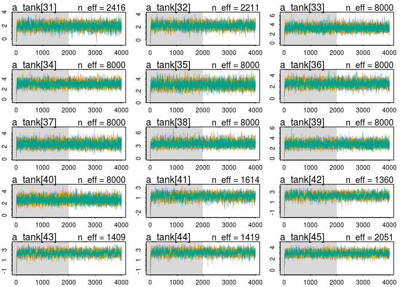
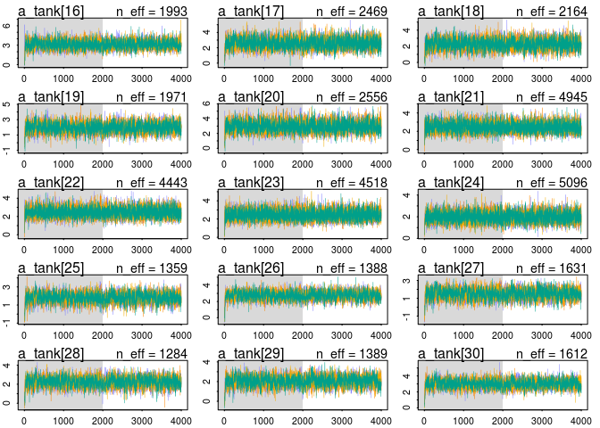
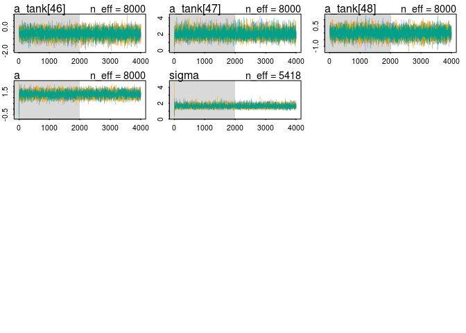
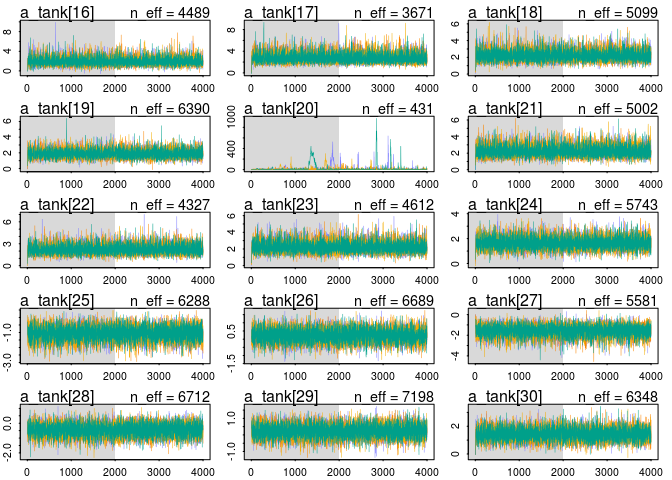
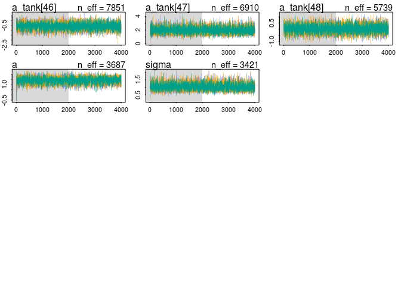

# Chapter 12 Problems
Julin Maloof  
10/27/2016  

## setup


```r
library(brms)
```

```
## Loading required package: rstan
```

```
## Loading required package: ggplot2
```

```
## Loading required package: StanHeaders
```

```
## rstan (Version 2.12.1, packaged: 2016-09-11 13:07:50 UTC, GitRev: 85f7a56811da)
```

```
## For execution on a local, multicore CPU with excess RAM we recommend calling
## rstan_options(auto_write = TRUE)
## options(mc.cores = parallel::detectCores())
```

```
## Loading 'brms' package (version 1.1.0). Useful instructions 
## can be found by typing help('brms'). A more detailed introduction 
## to the package is available through vignette('brms').
```

```r
library(rethinking)
```

```
## Loading required package: parallel
```

```
## rethinking (Version 1.58)
```

```
## 
## Attaching package: 'rethinking'
```

```
## The following objects are masked from 'package:brms':
## 
##     LOO, WAIC, stancode
```

```r
rstan_options(auto_write = TRUE)
options(mc.cores = parallel::detectCores())
```

## 12E1

The prior of normal(0,1) will provide more shrinkage

## 12E2

Instead of 

a_group ~ Normal(0,10)

use 

a_group ~ normal(a,sigma)
a ~ (0,10)
sigma ~ cacuhy(0,1)

## 12M1

alpha only


```r
data(reedfrogs)
d <- reedfrogs
d$tank <- 1:nrow(d)
m12m1.tank <- map2stan(
  alist(
    surv ~ dbinom( density , p ) ,
    logit(p) <- a_tank[tank] ,
    a_tank[tank] ~ dnorm( a , sigma ) ,
    a ~ dnorm(0,1) ,
    sigma ~ dcauchy(0,1)
  ), data=d , iter=4000 , chains=4 )
```

```
## Warning in FUN(X[[i]], ...): data with name pred is not numeric and not
## used
```

```
## Warning in FUN(X[[i]], ...): data with name size is not numeric and not
## used
```

```
## The following numerical problems occured the indicated number of times after warmup on chain 3
```

```
##                                                                                 count
## Exception thrown at line 17: normal_log: Scale parameter is 0, but must be > 0!     2
```

```
## When a numerical problem occurs, the Hamiltonian proposal gets rejected.
```

```
## See http://mc-stan.org/misc/warnings.html#exception-hamiltonian-proposal-rejected
```

```
## If the number in the 'count' column is small, do not ask about this message on stan-users.
```

```
## Warning in FUN(X[[i]], ...): data with name pred is not numeric and not
## used

## Warning in FUN(X[[i]], ...): data with name size is not numeric and not
## used
```

```
## Computing WAIC
```

```
## Constructing posterior predictions
```

```
## Aggregated binomial counts detected. Splitting to 0/1 outcome for WAIC calculation.
```


```r
plot(m12m1.tank,ask=FALSE)
```

```
## Waiting to draw page 2 of 4
```

<!-- -->

```
## Waiting to draw page 3 of 4
```

<!-- -->

```
## Waiting to draw page 4 of 4
```

<!-- -->

```r
precis(m12m1.tank)
```

```
## 48 vector or matrix parameters omitted in display. Use depth=2 to show them.
```

```
##       Mean StdDev lower 0.89 upper 0.89 n_eff Rhat
## a     1.30   0.25       0.88       1.68  8000    1
## sigma 1.62   0.21       1.29       1.95  4718    1
```

<!-- -->


with predation


```r
d$pred2 <- ifelse(d$pred=="pred",1,0)
m12m1.tank.pred <- map2stan(
  alist(
    surv ~ dbinom( density , p ) ,
    logit(p) <- a_tank[tank] + b_pred*pred2 ,
    a_tank[tank] ~ dnorm( a , sigma ) ,
    a ~ dnorm(0,1) ,
    sigma ~ dcauchy(0,1),
    b_pred ~ dnorm(0,5)
  ), data=d , iter=4000 , chains=4 )
```

```
## Warning in FUN(X[[i]], ...): data with name pred is not numeric and not
## used
```

```
## Warning in FUN(X[[i]], ...): data with name size is not numeric and not
## used
```

```
## The following numerical problems occured the indicated number of times after warmup on chain 1
```

```
##                                                                                 count
## Exception thrown at line 20: normal_log: Scale parameter is 0, but must be > 0!     1
```

```
## When a numerical problem occurs, the Hamiltonian proposal gets rejected.
```

```
## See http://mc-stan.org/misc/warnings.html#exception-hamiltonian-proposal-rejected
```

```
## If the number in the 'count' column is small, do not ask about this message on stan-users.
```

```
## The following numerical problems occured the indicated number of times after warmup on chain 3
```

```
##                                                                                 count
## Exception thrown at line 20: normal_log: Scale parameter is 0, but must be > 0!     1
```

```
## When a numerical problem occurs, the Hamiltonian proposal gets rejected.
```

```
## See http://mc-stan.org/misc/warnings.html#exception-hamiltonian-proposal-rejected
```

```
## If the number in the 'count' column is small, do not ask about this message on stan-users.
```

```
## The following numerical problems occured the indicated number of times after warmup on chain 4
```

```
##                                                                                 count
## Exception thrown at line 20: normal_log: Scale parameter is 0, but must be > 0!     2
```

```
## When a numerical problem occurs, the Hamiltonian proposal gets rejected.
```

```
## See http://mc-stan.org/misc/warnings.html#exception-hamiltonian-proposal-rejected
```

```
## If the number in the 'count' column is small, do not ask about this message on stan-users.
```

```
## Warning in FUN(X[[i]], ...): data with name pred is not numeric and not
## used

## Warning in FUN(X[[i]], ...): data with name size is not numeric and not
## used
```

```
## Computing WAIC
```

```
## Constructing posterior predictions
```

```
## Aggregated binomial counts detected. Splitting to 0/1 outcome for WAIC calculation.
```


```r
plot(m12m1.tank.pred,ask=FALSE)
```

```
## Waiting to draw page 2 of 4
```

<!-- -->

```
## Waiting to draw page 3 of 4
```

<!-- -->

```
## Waiting to draw page 4 of 4
```

<!-- -->

```r
precis(m12m1.tank.pred)
```

```
## 48 vector or matrix parameters omitted in display. Use depth=2 to show them.
```

```
##         Mean StdDev lower 0.89 upper 0.89 n_eff Rhat
## a       2.56   0.23       2.18       2.91  1379    1
## sigma   0.83   0.14       0.62       1.07  2784    1
## b_pred -2.52   0.30      -2.99      -2.04   987    1
```

<!-- -->

with size


```r
d$big <- ifelse(d$size=="big",1,0)
m12m1.tank.size <- map2stan(
  alist(
    surv ~ dbinom( density , p ) ,
    logit(p) <- a_tank[tank] + b_big*big ,
    a_tank[tank] ~ dnorm( a , sigma ) ,
    a ~ dnorm(0,1) ,
    sigma ~ dcauchy(0,1),
    b_big ~ dnorm(0,5)
  ), data=d , iter=4000 , chains=4 )
```

```
## Warning in FUN(X[[i]], ...): data with name pred is not numeric and not
## used
```

```
## Warning in FUN(X[[i]], ...): data with name size is not numeric and not
## used
```

```
## The following numerical problems occured the indicated number of times after warmup on chain 3
```

```
##                                                                                 count
## Exception thrown at line 20: normal_log: Scale parameter is 0, but must be > 0!     1
```

```
## When a numerical problem occurs, the Hamiltonian proposal gets rejected.
```

```
## See http://mc-stan.org/misc/warnings.html#exception-hamiltonian-proposal-rejected
```

```
## If the number in the 'count' column is small, do not ask about this message on stan-users.
```

```
## The following numerical problems occured the indicated number of times after warmup on chain 4
```

```
##                                                                                 count
## Exception thrown at line 20: normal_log: Scale parameter is 0, but must be > 0!     1
```

```
## When a numerical problem occurs, the Hamiltonian proposal gets rejected.
```

```
## See http://mc-stan.org/misc/warnings.html#exception-hamiltonian-proposal-rejected
```

```
## If the number in the 'count' column is small, do not ask about this message on stan-users.
```

```
## Warning in FUN(X[[i]], ...): data with name pred is not numeric and not
## used

## Warning in FUN(X[[i]], ...): data with name size is not numeric and not
## used
```

```
## Computing WAIC
```

```
## Constructing posterior predictions
```

```
## Aggregated binomial counts detected. Splitting to 0/1 outcome for WAIC calculation.
```


```r
plot(m12m1.tank.size,ask=FALSE)
```

```
## Waiting to draw page 2 of 4
```

<!-- -->

```
## Waiting to draw page 3 of 4
```

<!-- -->

```
## Waiting to draw page 4 of 4
```

<!-- -->

```r
precis(m12m1.tank.size)
```

```
## 48 vector or matrix parameters omitted in display. Use depth=2 to show them.
```

```
##        Mean StdDev lower 0.89 upper 0.89 n_eff Rhat
## a      1.42   0.35       0.86       1.98  1368 1.00
## sigma  1.63   0.22       1.28       1.96  5315 1.00
## b_big -0.25   0.50      -1.08       0.51   879 1.01
```

<!-- -->

additive, with pred and size


```r
m12m1.tank.pred.size <- map2stan(
  alist(
    surv ~ dbinom( density , p ) ,
    logit(p) <- a_tank[tank] + b_big*big + b_pred*pred2,
    a_tank[tank] ~ dnorm( a , sigma ) ,
    a ~ dnorm(0,1) ,
    sigma ~ dcauchy(0,1),
    c(b_big,b_pred) ~ dnorm(0,5)
  ), data=d , iter=4000 , chains=4 )
```

```
## Warning in FUN(X[[i]], ...): data with name pred is not numeric and not
## used
```

```
## Warning in FUN(X[[i]], ...): data with name size is not numeric and not
## used
```

```
## The following numerical problems occured the indicated number of times after warmup on chain 2
```

```
##                                                                                 count
## Exception thrown at line 23: normal_log: Scale parameter is 0, but must be > 0!     1
```

```
## When a numerical problem occurs, the Hamiltonian proposal gets rejected.
```

```
## See http://mc-stan.org/misc/warnings.html#exception-hamiltonian-proposal-rejected
```

```
## If the number in the 'count' column is small, do not ask about this message on stan-users.
```

```
## The following numerical problems occured the indicated number of times after warmup on chain 4
```

```
##                                                                                 count
## Exception thrown at line 23: normal_log: Scale parameter is 0, but must be > 0!     1
```

```
## When a numerical problem occurs, the Hamiltonian proposal gets rejected.
```

```
## See http://mc-stan.org/misc/warnings.html#exception-hamiltonian-proposal-rejected
```

```
## If the number in the 'count' column is small, do not ask about this message on stan-users.
```

```
## Warning in FUN(X[[i]], ...): data with name pred is not numeric and not
## used

## Warning in FUN(X[[i]], ...): data with name size is not numeric and not
## used
```

```
## Computing WAIC
```

```
## Constructing posterior predictions
```

```
## Aggregated binomial counts detected. Splitting to 0/1 outcome for WAIC calculation.
```


```r
plot(m12m1.tank.pred.size,ask=FALSE)
```

```
## Waiting to draw page 2 of 4
```

<!-- -->

```
## Waiting to draw page 3 of 4
```

<!-- -->

```
## Waiting to draw page 4 of 4
```

<!-- -->

```r
precis(m12m1.tank.pred.size)
```

```
## 48 vector or matrix parameters omitted in display. Use depth=2 to show them.
```

```
##         Mean StdDev lower 0.89 upper 0.89 n_eff Rhat
## a       2.73   0.27       2.32       3.17  1007    1
## sigma   0.78   0.15       0.55       1.00  2667    1
## b_big  -0.38   0.29      -0.86       0.08  1755    1
## b_pred -2.51   0.30      -2.99      -2.03  1198    1
```

<!-- -->

interaction, with pred and size


```r
m12m1.tank.pred.size.int <- map2stan(
  alist(
    surv ~ dbinom( density , p ) ,
    logit(p) <- a_tank[tank] + b_big*big + b_pred*pred2 + b_big_pred*big*pred2,
    a_tank[tank] ~ dnorm( a , sigma ) ,
    a ~ dnorm(0,1) ,
    sigma ~ dcauchy(0,1),
    c(b_big,b_pred,b_big_pred) ~ dnorm(0,5)
  ), data=d , iter=4000 , chains=4 )
```

```
## Warning in FUN(X[[i]], ...): data with name pred is not numeric and not
## used
```

```
## Warning in FUN(X[[i]], ...): data with name size is not numeric and not
## used
```

```
## The following numerical problems occured the indicated number of times after warmup on chain 2
```

```
##                                                                                 count
## Exception thrown at line 25: normal_log: Scale parameter is 0, but must be > 0!     1
```

```
## When a numerical problem occurs, the Hamiltonian proposal gets rejected.
```

```
## See http://mc-stan.org/misc/warnings.html#exception-hamiltonian-proposal-rejected
```

```
## If the number in the 'count' column is small, do not ask about this message on stan-users.
```

```
## The following numerical problems occured the indicated number of times after warmup on chain 3
```

```
##                                                                                 count
## Exception thrown at line 25: normal_log: Scale parameter is 0, but must be > 0!     2
```

```
## When a numerical problem occurs, the Hamiltonian proposal gets rejected.
```

```
## See http://mc-stan.org/misc/warnings.html#exception-hamiltonian-proposal-rejected
```

```
## If the number in the 'count' column is small, do not ask about this message on stan-users.
```

```
## Warning in FUN(X[[i]], ...): data with name pred is not numeric and not
## used

## Warning in FUN(X[[i]], ...): data with name size is not numeric and not
## used
```

```
## Computing WAIC
```

```
## Constructing posterior predictions
```

```
## Aggregated binomial counts detected. Splitting to 0/1 outcome for WAIC calculation.
```


```r
plot(m12m1.tank.pred.size.int,ask=FALSE)
```

```
## Waiting to draw page 2 of 4
```

<!-- -->

```
## Waiting to draw page 3 of 4
```

<!-- -->

```
## Waiting to draw page 4 of 4
```

<!-- -->

```r
precis(m12m1.tank.pred.size.int)
```

```
## 48 vector or matrix parameters omitted in display. Use depth=2 to show them.
```

```
##             Mean StdDev lower 0.89 upper 0.89 n_eff Rhat
## a           2.36   0.30       1.88       2.84   661    1
## sigma       0.75   0.14       0.52       0.97  1922    1
## b_big       0.42   0.45      -0.30       1.14  1025    1
## b_pred     -1.88   0.39      -2.52      -1.27   886    1
## b_big_pred -1.35   0.58      -2.25      -0.40  1416    1
```

```r
par(mfrow=c(1,1))
```

<!-- -->

_Focus on the inferred variation across tanks.  Explain why it changes as it does across models_

At first pass we can just look at the `sigma` parameter from each model as this is the estimate of adaptive estimate of standard deviation from tank to tank.


```r
precis(m12m1.tank)
```

```
## 48 vector or matrix parameters omitted in display. Use depth=2 to show them.
```

```
##       Mean StdDev lower 0.89 upper 0.89 n_eff Rhat
## a     1.30   0.25       0.88       1.68  8000    1
## sigma 1.62   0.21       1.29       1.95  4718    1
```

```r
precis(m12m1.tank.pred)
```

```
## 48 vector or matrix parameters omitted in display. Use depth=2 to show them.
```

```
##         Mean StdDev lower 0.89 upper 0.89 n_eff Rhat
## a       2.56   0.23       2.18       2.91  1379    1
## sigma   0.83   0.14       0.62       1.07  2784    1
## b_pred -2.52   0.30      -2.99      -2.04   987    1
```

```r
precis(m12m1.tank.size)
```

```
## 48 vector or matrix parameters omitted in display. Use depth=2 to show them.
```

```
##        Mean StdDev lower 0.89 upper 0.89 n_eff Rhat
## a      1.42   0.35       0.86       1.98  1368 1.00
## sigma  1.63   0.22       1.28       1.96  5315 1.00
## b_big -0.25   0.50      -1.08       0.51   879 1.01
```

```r
precis(m12m1.tank.pred.size)
```

```
## 48 vector or matrix parameters omitted in display. Use depth=2 to show them.
```

```
##         Mean StdDev lower 0.89 upper 0.89 n_eff Rhat
## a       2.73   0.27       2.32       3.17  1007    1
## sigma   0.78   0.15       0.55       1.00  2667    1
## b_big  -0.38   0.29      -0.86       0.08  1755    1
## b_pred -2.51   0.30      -2.99      -2.03  1198    1
```

```r
precis(m12m1.tank.pred.size.int)
```

```
## 48 vector or matrix parameters omitted in display. Use depth=2 to show them.
```

```
##             Mean StdDev lower 0.89 upper 0.89 n_eff Rhat
## a           2.36   0.30       1.88       2.84   661    1
## sigma       0.75   0.14       0.52       0.97  1922    1
## b_big       0.42   0.45      -0.30       1.14  1025    1
## b_pred     -1.88   0.39      -2.52      -1.27   886    1
## b_big_pred -1.35   0.58      -2.25      -0.40  1416    1
```

Basically we see that having predation in the model reduces variance among tanks.  This is because predation is a strong predicor of survival, so including it in the model reduces the otherwise unexplained tank to tank variance.

## 12M2

_Compare the models you fit just above, using WAIC.  Can you reconcile the differences in WAIC with the posterior distributions of the models?_


```r
compare(m12m1.tank,m12m1.tank.pred,m12m1.tank.size,m12m1.tank.pred.size,m12m1.tank.pred.size.int)
```

```
##                            WAIC pWAIC dWAIC weight    SE  dSE
## m12m1.tank.pred          1000.1  28.7   0.0   0.38 37.39   NA
## m12m1.tank.pred.size     1000.3  27.8   0.2   0.35 37.34 1.64
## m12m1.tank.pred.size.int 1000.9  27.9   0.8   0.26 37.65 3.00
## m12m1.tank               1008.8  37.4   8.6   0.01 37.95 6.51
## m12m1.tank.size          1010.1  38.0   9.9   0.00 38.13 6.62
```

Models that include `pred` have a smaller number of effective parameters and a lower WAIC.  This makes sense w.r.t. the posterior distributions; tanks 

## Fit one of these with brms


```r
m12m1.tank.pred.size.int.b <- 
  brm(surv | trials(density) ~ 0 + (1| tank) + pred*size,
               data=d,
               family=binomial(link = "logit"),
               prior=c(set_prior("cauchy(0,1)", class = "sd"),
                       set_prior("normal(0,5)", class = "b")))
```

```
## Compiling the C++ model
```


```r
plot(m12m1.tank.pred.size.int.b)
```

<!-- -->

```r
m12m1.tank.pred.size.int.b
```

```
##  Family: binomial (logit) 
## Formula: surv | trials(density) ~ 0 + (1 | tank) + pred * size 
##    Data: d (Number of observations: 48) 
## Samples: 4 chains, each with iter = 2000; warmup = 1000; thin = 1; 
##          total post-warmup samples = 4000
##    WAIC: Not computed
##  
## Group-Level Effects: 
## ~tank (Number of levels: 48) 
##               Estimate Est.Error l-95% CI u-95% CI Eff.Sample Rhat
## sd(Intercept)     0.74      0.14     0.49     1.06       1823    1
## 
## Population-Level Effects: 
##                    Estimate Est.Error l-95% CI u-95% CI Eff.Sample Rhat
## predno                 2.77      0.34     2.11     3.44       2161    1
## predpred              -0.44      0.25    -0.92     0.05       2022    1
## sizesmall             -0.15      0.47    -1.06     0.75       1835    1
## predpred:sizesmall     1.06      0.58    -0.09     2.24       1464    1
## 
## Samples were drawn using sampling(NUTS). For each parameter, Eff.Sample 
## is a crude measure of effective sample size, and Rhat is the potential 
## scale reduction factor on split chains (at convergence, Rhat = 1).
```

```r
precis(m12m1.tank.pred.size.int)
```

```
## 48 vector or matrix parameters omitted in display. Use depth=2 to show them.
```

```
##             Mean StdDev lower 0.89 upper 0.89 n_eff Rhat
## a           2.36   0.30       1.88       2.84   661    1
## sigma       0.75   0.14       0.52       0.97  1922    1
## b_big       0.42   0.45      -0.30       1.14  1025    1
## b_pred     -1.88   0.39      -2.52      -1.27   886    1
## b_big_pred -1.35   0.58      -2.25      -0.40  1416    1
```

## 12M3

_Refit reed frog data but use Cauchy prior for the varying intercepts.  Compare to Gaussian prior.  Explain._

First, with Gausian


```r
data(reedfrogs)

d <- reedfrogs

str(d)

# make the tank cluster variable
d$tank <- 1:nrow(d)
d$tank2 <- as.character(d$tank)

m12.2 <- map2stan(
  alist(
    surv ~ dbinom( density , p ) ,
    logit(p) <- a_tank[tank] ,
    a_tank[tank] ~ dnorm( a , sigma ) ,
    a ~ dnorm(0,1) ,
    sigma ~ dcauchy(0,1)
  ), data=d , iter=4000 , chains=4 )
```

```
## Warning in FUN(X[[i]], ...): data with name pred is not numeric and not
## used
```

```
## Warning in FUN(X[[i]], ...): data with name size is not numeric and not
## used
```

```
## Warning in FUN(X[[i]], ...): data with name tank2 is not numeric and not
## used
```

```
## The following numerical problems occured the indicated number of times after warmup on chain 1
```

```
##                                                                                 count
## Exception thrown at line 17: normal_log: Scale parameter is 0, but must be > 0!     1
```

```
## When a numerical problem occurs, the Hamiltonian proposal gets rejected.
```

```
## See http://mc-stan.org/misc/warnings.html#exception-hamiltonian-proposal-rejected
```

```
## If the number in the 'count' column is small, do not ask about this message on stan-users.
```

```
## The following numerical problems occured the indicated number of times after warmup on chain 4
```

```
##                                                                                 count
## Exception thrown at line 17: normal_log: Scale parameter is 0, but must be > 0!     1
```

```
## When a numerical problem occurs, the Hamiltonian proposal gets rejected.
```

```
## See http://mc-stan.org/misc/warnings.html#exception-hamiltonian-proposal-rejected
```

```
## If the number in the 'count' column is small, do not ask about this message on stan-users.
```

```
## Warning in FUN(X[[i]], ...): data with name pred is not numeric and not
## used
```

```
## Warning in FUN(X[[i]], ...): data with name size is not numeric and not
## used
```

```
## Warning in FUN(X[[i]], ...): data with name tank2 is not numeric and not
## used
```

```
## Computing WAIC
```

```
## Constructing posterior predictions
```

```
## Aggregated binomial counts detected. Splitting to 0/1 outcome for WAIC calculation.
```


```r
plot(m12.2,ask=FALSE)
```

```
## Waiting to draw page 2 of 4
```

<!-- -->

```
## Waiting to draw page 3 of 4
```

<!-- -->

```
## Waiting to draw page 4 of 4
```

<!-- -->

```r
precis(m12.2)
```

```
## 48 vector or matrix parameters omitted in display. Use depth=2 to show them.
```

```
##       Mean StdDev lower 0.89 upper 0.89 n_eff Rhat
## a     1.30   0.25       0.89       1.69  8000    1
## sigma 1.62   0.21       1.29       1.95  5418    1
```

<!-- -->

Now with Cauchy prior for a intercepts

```r
m12.2.cauchy <- map2stan(
  alist(
    surv ~ dbinom( density , p ) ,
    logit(p) <- a_tank[tank] ,
    a_tank[tank] ~ dcauchy( a , sigma ) ,
    a ~ dnorm(0,1) ,
    sigma ~ dcauchy(0,1)
  ), data=d , iter=4000 , chains=4 )
```

```
## Warning in FUN(X[[i]], ...): data with name pred is not numeric and not
## used
```

```
## Warning in FUN(X[[i]], ...): data with name size is not numeric and not
## used
```

```
## Warning in FUN(X[[i]], ...): data with name tank2 is not numeric and not
## used
```

```
## The following numerical problems occured the indicated number of times after warmup on chain 1
```

```
##                                                                                 count
## Exception thrown at line 17: cauchy_log: Scale parameter is 0, but must be > 0!     1
```

```
## When a numerical problem occurs, the Hamiltonian proposal gets rejected.
```

```
## See http://mc-stan.org/misc/warnings.html#exception-hamiltonian-proposal-rejected
```

```
## If the number in the 'count' column is small, do not ask about this message on stan-users.
```

```
## The following numerical problems occured the indicated number of times after warmup on chain 4
```

```
##                                                                                 count
## Exception thrown at line 17: cauchy_log: Scale parameter is 0, but must be > 0!     1
```

```
## When a numerical problem occurs, the Hamiltonian proposal gets rejected.
```

```
## See http://mc-stan.org/misc/warnings.html#exception-hamiltonian-proposal-rejected
```

```
## If the number in the 'count' column is small, do not ask about this message on stan-users.
```

```
## Warning in FUN(X[[i]], ...): data with name pred is not numeric and not
## used
```

```
## Warning in FUN(X[[i]], ...): data with name size is not numeric and not
## used
```

```
## Warning in FUN(X[[i]], ...): data with name tank2 is not numeric and not
## used
```

```
## Computing WAIC
```

```
## Constructing posterior predictions
```

```
## Aggregated binomial counts detected. Splitting to 0/1 outcome for WAIC calculation.
```


```r
plot(m12.2.cauchy,ask=FALSE)
```

```
## Waiting to draw page 2 of 4
```

<!-- -->

```
## Waiting to draw page 3 of 4
```

<!-- -->

```
## Waiting to draw page 4 of 4
```

<!-- -->

```r
precis(m12.2.cauchy,depth=2)
```

```
##             Mean StdDev lower 0.89 upper 0.89 n_eff Rhat
## a_tank[1]   2.01   0.87       0.76       3.30  3689 1.00
## a_tank[2]   6.89  13.45       0.62      11.03   445 1.01
## a_tank[3]   1.09   0.60       0.10       2.01  6200 1.00
## a_tank[4]   7.14  13.74       0.34      12.72   297 1.01
## a_tank[5]   1.99   0.82       0.66       3.16  5328 1.00
## a_tank[6]   2.01   0.84       0.67       3.16  4410 1.00
## a_tank[7]  19.08  84.60       0.63      17.77    67 1.06
## a_tank[8]   2.02   0.88       0.69       3.26  4003 1.00
## a_tank[9]  -0.07   0.65      -1.12       0.94  6902 1.00
## a_tank[10]  2.01   0.84       0.74       3.21  4993 1.00
## a_tank[11]  1.11   0.62       0.08       2.05  6419 1.00
## a_tank[12]  0.73   0.63      -0.23       1.76  6601 1.00
## a_tank[13]  1.09   0.62       0.19       2.14  7054 1.00
## a_tank[14]  0.35   0.65      -0.64       1.41  6686 1.00
## a_tank[15]  2.01   0.84       0.76       3.28  4424 1.00
## a_tank[16]  2.03   0.85       0.68       3.20  4489 1.00
## a_tank[17]  2.85   0.93       1.46       4.16  3671 1.00
## a_tank[18]  2.26   0.64       1.24       3.20  5099 1.00
## a_tank[19]  1.92   0.55       1.02       2.72  6390 1.00
## a_tank[20] 13.18  44.90       1.51      17.94   431 1.01
## a_tank[21]  2.27   0.67       1.22       3.24  5002 1.00
## a_tank[22]  2.30   0.68       1.26       3.32  4327 1.00
## a_tank[23]  2.28   0.67       1.29       3.32  4612 1.00
## a_tank[24]  1.66   0.48       0.87       2.36  5743 1.00
## a_tank[25] -1.05   0.47      -1.77      -0.29  6288 1.00
## a_tank[26]  0.24   0.41      -0.42       0.86  6689 1.00
## a_tank[27] -1.59   0.57      -2.46      -0.69  5581 1.00
## a_tank[28] -0.45   0.42      -1.16       0.20  6712 1.00
## a_tank[29]  0.24   0.40      -0.41       0.85  7198 1.00
## a_tank[30]  1.44   0.45       0.68       2.11  6348 1.00
## a_tank[31] -0.63   0.42      -1.28       0.06  7875 1.00
## a_tank[32] -0.28   0.42      -0.96       0.38  6667 1.00
## a_tank[33]  3.25   0.96       1.81       4.63  4269 1.00
## a_tank[34]  2.59   0.67       1.51       3.56  5612 1.00
## a_tank[35]  2.62   0.69       1.55       3.63  4282 1.00
## a_tank[36]  1.97   0.48       1.20       2.72  5869 1.00
## a_tank[37]  1.98   0.49       1.16       2.68  6045 1.00
## a_tank[38] 18.21  69.32       1.83      20.57   125 1.03
## a_tank[39]  2.60   0.67       1.56       3.57  4966 1.00
## a_tank[40]  2.24   0.57       1.35       3.09  5088 1.00
## a_tank[41] -2.01   0.55      -2.90      -1.18  5950 1.00
## a_tank[42] -0.57   0.36      -1.15       0.01  7017 1.00
## a_tank[43] -0.44   0.35      -1.02       0.10  7175 1.00
## a_tank[44] -0.32   0.35      -0.87       0.25  6700 1.00
## a_tank[45]  0.65   0.35       0.09       1.20  7161 1.00
## a_tank[46] -0.56   0.37      -1.16       0.00  7851 1.00
## a_tank[47]  1.97   0.49       1.20       2.73  6910 1.00
## a_tank[48]  0.04   0.34      -0.50       0.59  5739 1.00
## a           1.42   0.30       0.96       1.89  3687 1.00
## sigma       1.02   0.23       0.65       1.38  3421 1.00
```

<!-- -->

Get posterior estimates of a_tank intercepts

```r
library(reshape2)
post.gauss <- extract.samples(m12.2)
post.cauchy <- extract.samples(m12.2.cauchy)
d$est.gauss <- logistic(apply(post.gauss$a_tank,2,mean))
d$est.cauchy <- logistic(apply(post.cauchy$a_tank,2,mean) )
head(d)
```

```
##   density pred  size surv propsurv tank tank2 est.gauss est.cauchy
## 1      10   no   big    9      0.9    1     1 0.8917184  0.8822184
## 2      10   no   big   10      1.0    2     2 0.9545020  0.9989807
## 3      10   no   big    7      0.7    3     3 0.7313764  0.7484382
## 4      10   no   big   10      1.0    4     4 0.9547966  0.9992059
## 5      10   no small    9      0.9    5     5 0.8935928  0.8802017
## 6      10   no small    9      0.9    6     6 0.8930508  0.8814373
```

plot it

```r
library(ggplot2)
d.melt <- melt(d,measure.vars = c("propsurv","est.gauss","est.cauchy"))
head(d.melt)
```

```
##   density pred  size surv tank tank2 variable value
## 1      10   no   big    9    1     1 propsurv   0.9
## 2      10   no   big   10    2     2 propsurv   1.0
## 3      10   no   big    7    3     3 propsurv   0.7
## 4      10   no   big   10    4     4 propsurv   1.0
## 5      10   no small    9    5     5 propsurv   0.9
## 6      10   no small    9    6     6 propsurv   0.9
```

```r
pl <- ggplot(d.melt,aes(y=value,x=tank,color=variable,shape=variable))
pl <- pl + geom_point(size=2)
pl <- pl + facet_wrap(~ density, scales = "free_x")
pl <- pl + geom_hline(yintercept=logistic(mean(post.gauss$a)),lty=2)
pl
```

<!-- -->
For the most part, cauchy causes more shrinkage.  This is because it is a fat-tailed distrubution.  It does not shrink the most extreme tanks as much, however, and I do not understand why.


#12H1

_Analyze bangladeshi data to model contraception use by district.  Model using separate intercepts for each district and pooled information across districts_

get the data

```r
data("bangladesh")
colnames(bangladesh) <- sub(".","_",colnames(bangladesh),fixed=TRUE)
bangladesh$district_id <- coerce_index(bangladesh$district)
#bangladesh$district_id <- as.factor(as.numeric(bangladesh$district))
summary(bangladesh)
```

```
##      woman           district     use_contraception living_children
##  Min.   :   1.0   Min.   : 1.00   Min.   :0.0000    Min.   :1.000  
##  1st Qu.: 484.2   1st Qu.:14.00   1st Qu.:0.0000    1st Qu.:1.000  
##  Median : 967.5   Median :29.00   Median :0.0000    Median :3.000  
##  Mean   : 967.5   Mean   :29.35   Mean   :0.3925    Mean   :2.652  
##  3rd Qu.:1450.8   3rd Qu.:45.00   3rd Qu.:1.0000    3rd Qu.:4.000  
##  Max.   :1934.0   Max.   :61.00   Max.   :1.0000    Max.   :4.000  
##   age_centered            urban         district_id   
##  Min.   :-13.560000   Min.   :0.0000   Min.   : 1.00  
##  1st Qu.: -7.559900   1st Qu.:0.0000   1st Qu.:13.00  
##  Median : -1.559900   Median :0.0000   Median :29.00  
##  Mean   :  0.002198   Mean   :0.2906   Mean   :29.49  
##  3rd Qu.:  6.440000   3rd Qu.:1.0000   3rd Qu.:45.00  
##  Max.   : 19.440000   Max.   :1.0000   Max.   :60.00
```

```r
head(bangladesh)
```

```
##   woman district use_contraception living_children age_centered urban
## 1     1        1                 0               4      18.4400     1
## 2     2        1                 0               1      -5.5599     1
## 3     3        1                 0               3       1.4400     1
## 4     4        1                 0               4       8.4400     1
## 5     5        1                 0               1     -13.5590     1
## 6     6        1                 0               1     -11.5600     1
##   district_id
## 1           1
## 2           1
## 3           1
## 4           1
## 5           1
## 6           1
```

fixed intercepts model

```r
mb1 <- map2stan(alist(
  use_contraception ~ dbinom(1,p),
  logit(p) <- a[district_id],
  a[district_id] ~ dnorm(0,5)),
  data=bangladesh,
  chains = 4)
```

```
## Computing WAIC
```

```
## Constructing posterior predictions
```


```r
plot(mb1,ask=FALSE)
```

```
## Waiting to draw page 2 of 4
```

<!-- -->

```
## Waiting to draw page 3 of 4
```

<!-- -->

```
## Waiting to draw page 4 of 4
```

<!-- --><!-- -->

```r
precis(mb1,depth = 2)
```

```
##        Mean StdDev lower 0.89 upper 0.89 n_eff Rhat
## a[1]  -1.07   0.21      -1.37      -0.70  3472    1
## a[2]  -2.81   1.16      -4.46      -0.99  2565    1
## a[3]  -6.31   2.69     -10.05      -2.40  2868    1
## a[4]  -0.65   0.39      -1.27      -0.05  3751    1
## a[5]  -0.35   0.43      -1.08       0.28  4000    1
## a[6]   0.53   0.19       0.22       0.83  4000    1
## a[7]  -0.58   0.45      -1.24       0.17  4000    1
## a[8]   0.21   0.46      -0.53       0.92  4000    1
## a[9]  -0.92   0.46      -1.60      -0.14  4000    1
## a[10] -0.67   0.32      -1.19      -0.17  4000    1
## a[11] -0.50   0.40      -1.15       0.10  4000    1
## a[12] -0.63   0.47      -1.38       0.13  4000    1
## a[13] -0.44   0.56      -1.32       0.46  3907    1
## a[14] -0.47   0.49      -1.23       0.33  4000    1
## a[15] -1.48   0.59      -2.46      -0.57  4000    1
## a[16] -1.08   0.59      -2.06      -0.16  4000    1
## a[17] -2.83   1.10      -4.57      -1.13  3393    1
## a[18] -0.21   0.25      -0.62       0.15  4000    1
## a[19] -0.51   0.59      -1.49       0.41  4000    1
## a[20] -1.54   0.39      -2.13      -0.89  4000    1
## a[21] -1.16   0.33      -1.71      -0.64  3715    1
## a[22] -0.98   0.41      -1.62      -0.33  3682    1
## a[23]  4.31   3.01      -0.23       8.72  3058    1
## a[24] -0.04   0.25      -0.44       0.36  4000    1
## a[25] -0.18   0.36      -0.74       0.39  4000    1
## a[26] -1.40   0.52      -2.24      -0.61  3815    1
## a[27] -0.30   0.57      -1.13       0.68  3967    1
## a[28]  0.66   0.36       0.05       1.19  4000    1
## a[29]  0.00   0.29      -0.50       0.45  4000    1
## a[30] -0.63   0.53      -1.48       0.22  3959    1
## a[31]  0.17   0.58      -0.67       1.14  4000    1
## a[32] -0.98   0.60      -1.85       0.05  4000    1
## a[33] -0.01   0.40      -0.65       0.63  4000    1
## a[34]  0.00   0.37      -0.57       0.59  4000    1
## a[35] -0.14   0.31      -0.66       0.35  4000    1
## a[36]  0.00   0.39      -0.63       0.61  4000    1
## a[37]  0.20   0.63      -0.80       1.19  4000    1
## a[38]  0.14   0.31      -0.34       0.63  3943    1
## a[39] -1.31   0.48      -2.01      -0.50  4000    1
## a[40] -0.71   0.35      -1.24      -0.16  4000    1
## a[41]  0.10   0.22      -0.24       0.46  4000    1
## a[42] -0.14   0.54      -1.02       0.68  3740    1
## a[43]  0.10   0.31      -0.42       0.58  4000    1
## a[44] -5.01   2.94      -9.63      -0.70  2014    1
## a[45] -0.59   0.33      -1.13      -0.08  4000    1
## a[46] -0.10   0.48      -0.91       0.62  4000    1
## a[47] -0.17   0.34      -0.67       0.41  4000    1
## a[48] -0.24   0.26      -0.66       0.17  4000    1
## a[49] -0.35   0.48      -1.11       0.41  4000    1
## a[50] -1.89   1.20      -3.73      -0.12  3098    1
## a[51]  0.33   0.31      -0.16       0.83  3363    1
## a[52] -1.53   0.51      -2.37      -0.76  4000    1
## a[53] -0.19   0.35      -0.72       0.38  4000    1
## a[54] -2.47   1.12      -4.26      -0.86  4000    1
## a[55] -0.91   0.28      -1.34      -0.46  4000    1
## a[56] -1.31   0.44      -2.00      -0.62  4000    1
## a[57] -1.33   0.38      -1.91      -0.72  4000    1
## a[58] -1.01   0.54      -1.86      -0.13  2975    1
## a[59] -0.52   0.35      -1.12      -0.01  4000    1
## a[60] -0.85   0.46      -1.58      -0.12  4000    1
```


```r
mb2 <- map2stan(alist(
  use_contraception ~ dbinom(1,p),
  logit(p) <- a_district[district_id],
  a_district[district_id] ~ dnorm(a,sigma),
  a ~ dnorm(0,5),
  sigma ~ dcauchy(0,1)),
  data=bangladesh,
  chains = 4)
```

```
## The following numerical problems occured the indicated number of times after warmup on chain 1
```

```
##                                                                                 count
## Exception thrown at line 16: normal_log: Scale parameter is 0, but must be > 0!     1
```

```
## When a numerical problem occurs, the Hamiltonian proposal gets rejected.
```

```
## See http://mc-stan.org/misc/warnings.html#exception-hamiltonian-proposal-rejected
```

```
## If the number in the 'count' column is small, do not ask about this message on stan-users.
```

```
## Computing WAIC
```

```
## Constructing posterior predictions
```


```r
plot(mb2,ask=FALSE)
```

```
## Waiting to draw page 2 of 5
```

<!-- -->

```
## Waiting to draw page 3 of 5
```

<!-- -->

```
## Waiting to draw page 4 of 5
```

<!-- -->

```
## Waiting to draw page 5 of 5
```

<!-- -->

```r
precis(mb2,depth=2)
```

```
##                 Mean StdDev lower 0.89 upper 0.89 n_eff Rhat
## a_district[1]  -1.00   0.19      -1.29      -0.68  4000    1
## a_district[2]  -1.15   0.44      -1.83      -0.43  4000    1
## a_district[3]  -1.57   0.44      -2.25      -0.90  4000    1
## a_district[4]  -0.61   0.32      -1.11      -0.11  4000    1
## a_district[5]  -0.42   0.34      -0.94       0.13  4000    1
## a_district[6]   0.40   0.18       0.10       0.67  4000    1
## a_district[7]  -0.56   0.35      -1.09       0.01  4000    1
## a_district[8]  -0.11   0.35      -0.67       0.43  4000    1
## a_district[9]  -0.75   0.34      -1.27      -0.20  4000    1
## a_district[10] -0.64   0.26      -1.07      -0.23  4000    1
## a_district[11] -0.50   0.32      -1.01       0.00  4000    1
## a_district[12] -0.60   0.35      -1.14      -0.05  4000    1
## a_district[13] -0.48   0.37      -1.01       0.13  4000    1
## a_district[14] -0.51   0.35      -1.04       0.07  4000    1
## a_district[15] -0.97   0.37      -1.56      -0.38  4000    1
## a_district[16] -0.78   0.39      -1.44      -0.21  4000    1
## a_district[17] -1.21   0.43      -1.85      -0.50  4000    1
## a_district[18] -0.28   0.23      -0.64       0.09  4000    1
## a_district[19] -0.51   0.38      -1.11       0.10  4000    1
## a_district[20] -1.19   0.29      -1.65      -0.72  4000    1
## a_district[21] -0.97   0.28      -1.41      -0.52  4000    1
## a_district[22] -0.81   0.31      -1.28      -0.30  4000    1
## a_district[23] -0.23   0.51      -1.09       0.51  4000    1
## a_district[24] -0.14   0.24      -0.51       0.24  4000    1
## a_district[25] -0.30   0.29      -0.76       0.16  4000    1
## a_district[26] -0.99   0.37      -1.57      -0.41  4000    1
## a_district[27] -0.44   0.38      -1.06       0.16  4000    1
## a_district[28]  0.28   0.30      -0.20       0.74  4000    1
## a_district[29] -0.13   0.26      -0.53       0.30  4000    1
## a_district[30] -0.59   0.37      -1.20      -0.03  4000    1
## a_district[31] -0.23   0.38      -0.82       0.39  4000    1
## a_district[32] -0.73   0.40      -1.40      -0.12  4000    1
## a_district[33] -0.20   0.32      -0.71       0.29  4000    1
## a_district[34] -0.18   0.31      -0.66       0.32  4000    1
## a_district[35] -0.26   0.27      -0.68       0.19  4000    1
## a_district[36] -0.20   0.32      -0.67       0.36  4000    1
## a_district[37] -0.23   0.40      -0.86       0.40  4000    1
## a_district[38] -0.03   0.26      -0.41       0.42  4000    1
## a_district[39] -0.97   0.35      -1.47      -0.38  4000    1
## a_district[40] -0.66   0.28      -1.07      -0.17  4000    1
## a_district[41]  0.00   0.20      -0.29       0.33  4000    1
## a_district[42] -0.35   0.37      -0.96       0.21  4000    1
## a_district[43] -0.07   0.27      -0.51       0.35  4000    1
## a_district[44] -0.88   0.49      -1.66      -0.14  4000    1
## a_district[45] -0.58   0.28      -1.01      -0.14  4000    1
## a_district[46] -0.30   0.35      -0.88       0.24  4000    1
## a_district[47] -0.28   0.28      -0.73       0.20  4000    1
## a_district[48] -0.29   0.22      -0.64       0.06  4000    1
## a_district[49] -0.42   0.35      -0.99       0.12  4000    1
## a_district[50] -0.79   0.47      -1.53      -0.06  4000    1
## a_district[51]  0.10   0.27      -0.33       0.53  4000    1
## a_district[52] -1.08   0.35      -1.59      -0.50  4000    1
## a_district[53] -0.30   0.30      -0.76       0.18  4000    1
## a_district[54] -1.02   0.43      -1.68      -0.31  4000    1
## a_district[55] -0.81   0.24      -1.22      -0.45  4000    1
## a_district[56] -1.01   0.32      -1.50      -0.49  4000    1
## a_district[57] -1.06   0.30      -1.52      -0.58  4000    1
## a_district[58] -0.77   0.37      -1.39      -0.22  4000    1
## a_district[59] -0.52   0.29      -0.98      -0.06  4000    1
## a_district[60] -0.72   0.35      -1.32      -0.20  4000    1
## a              -0.54   0.09      -0.68      -0.40  2373    1
## sigma           0.52   0.08       0.40       0.66  1150    1
```

<!-- -->

3 ways of getting predictions

```r
library(reshape2)

pred.df <- data.frame(district_id = unique(bangladesh$district_id))
link.vary <- link(mb2,data=pred.df,n=4000) 
```

```
## [ 400 / 4000 ]
[ 800 / 4000 ]
[ 1200 / 4000 ]
[ 1600 / 4000 ]
[ 2000 / 4000 ]
[ 2400 / 4000 ]
[ 2800 / 4000 ]
[ 3200 / 4000 ]
[ 3600 / 4000 ]
[ 4000 / 4000 ]
```

```r
pred.df$est.vary.link <- apply(link.vary,2,mean)

pred.df$est.vary.coef <- logistic(coef(mb2)[1:60])
#these are the posterior means.  See help page for map2stan.

post.vary <- extract.samples(mb2)$a_district

pred.df$est.vary.extract.samples <- logistic(apply(post.vary,2,mean))
cor(pred.df[,2:4])
```

```
##                          est.vary.link est.vary.coef
## est.vary.link                1.0000000     0.0688281
## est.vary.coef                0.0688281     1.0000000
## est.vary.extract.samples     0.0688281     1.0000000
##                          est.vary.extract.samples
## est.vary.link                           0.0688281
## est.vary.coef                           1.0000000
## est.vary.extract.samples                1.0000000
```

So coef returns the same numbers as extracting the posterior samples and taking the mean.  Link is every so slightly different.


```r
plot.df <- data.frame(
  district_id=1:60,
  fixed=logistic(coef(mb1)),
  varying=logistic(coef(mb2)[1:60]),
  observed=tapply(bangladesh$use_contraception,bangladesh$district_id,function(x) sum(x)/length(x)))
plot.df.m <- melt(plot.df,id.var="district_id")
```

```
## Warning: attributes are not identical across measure variables; they will
## be dropped
```

```r
pl <- ggplot(plot.df.m,aes(x=district_id,y=value,color=variable,shape=variable))
pl+geom_point(size=3)+geom_hline(yintercept = logistic(coef(mb2)["a"]))
```

<!-- -->

