# Chapter 13 Problems


```r
library(rethinking)
```

```
## Loading required package: rstan
```

```
## Warning: package 'rstan' was built under R version 3.3.2
```

```
## Loading required package: ggplot2
```

```
## Warning: package 'ggplot2' was built under R version 3.3.2
```

```
## Loading required package: StanHeaders
```

```
## Warning: package 'StanHeaders' was built under R version 3.3.2
```

```
## rstan (Version 2.14.1, packaged: 2016-12-28 14:55:41 UTC, GitRev: 5fa1e80eb817)
```

```
## For execution on a local, multicore CPU with excess RAM we recommend calling
## rstan_options(auto_write = TRUE)
## options(mc.cores = parallel::detectCores())
```

```
## Loading required package: parallel
```

```
## rethinking (Version 1.59)
```

```r
library(ggplot2)
library(brms)
```

```
## Loading required package: Rcpp
```

```
## Warning: package 'Rcpp' was built under R version 3.3.2
```

```
## Loading 'brms' package (version 1.3.1.9000). Useful instructions 
## can be found by typing help('brms'). A more detailed introduction 
## to the package is available through vignette('brms_overview').
```

```
## 
## Attaching package: 'brms'
```

```
## The following objects are masked from 'package:rethinking':
## 
##     LOO, stancode, WAIC
```

```r
rstan_options(auto_write = TRUE)
options(mc.cores = parallel::detectCores())
knitr::opts_chunk$set(cache=TRUE,autodep=TRUE)
```

## 13E1

_Add to the following model varying slopes on the predictor x_

Too hard to figure out the LaTex code...

Basically we need a multivariate distrubtion on A and X,
A covariance matrix,
An adaptive prior on B
An a prior for the correlation matrix

## 13E2

_Think up a context inwhich varyign intervepts will b positively correlated with varying slopes.  Provide a mechanistic explanation for the correlation_

Automobile gas consumption at idle and at 60mph.  Larger engines consume more at idle and are generally less efficient.

## 13E3

_When is it possible for a varying slopes model to have fewer effective parameters than the corresponding model with fixed (unpooled) slopes?_

When the shared information across groups means that it is possible for the slopes to be shrunk towards the mean.

## 13M1


```r
a <- 3.5 # average morning wait time
b <- (-1) # average difference afternoon wait time
sigma_a <- 1 # std dev in intercepts
sigma_b <- 0.5 # std dev in slopes
rho <- 0 # correlation between intercepts and slopes

Mu <- c( a , b )

cov_ab <- sigma_a*sigma_b*rho
Sigma <- matrix( c(sigma_a^2,cov_ab,cov_ab,sigma_b^2) , ncol=2 )

sigmas <- c(sigma_a,sigma_b) # standard deviations

Rho <- matrix( c(1,rho,rho,1) , nrow=2 ) # correlation matrix
# now matrix multiply to get covariance matrix
Sigma <- diag(sigmas) %*% Rho %*% diag(sigmas)
```


```r
N_cafes <- 20
library(MASS)
set.seed(5) # used to replicate example
vary_effects <- mvrnorm( N_cafes , Mu , Sigma )
```


```r
a_cafe <- vary_effects[,1]
b_cafe <- vary_effects[,2]

plot( a_cafe , b_cafe , col=rangi2 ,
      xlab="intercepts (a_cafe)" , ylab="slopes (b_cafe)" )
# overlay population distribution
library(ellipse)
for ( l in c(0.1,0.3,0.5,0.8,0.99) )
  lines(ellipse(Sigma,centre=Mu,level=l),col=col.alpha("black",0.2))
```

<!-- -->

```r
#not quite the same: contours are based on actual data instead of Sigma matrix
pl <- qplot(x=a_cafe,y=b_cafe,color=I("skyblue"),geom="point")
pl + geom_density_2d(bins=5)
```

<!-- -->


```r
N_visits <- 10
afternoon <- rep(0:1,N_visits*N_cafes/2)
cafe_id <- rep( 1:N_cafes , each=N_visits )
mu <- a_cafe[cafe_id] + b_cafe[cafe_id]*afternoon
sigma <- 0.5 # std dev within cafes
wait <- rnorm( N_visits*N_cafes , mu , sigma )
d <- data.frame( cafe=cafe_id , afternoon=afternoon , wait=wait )
head(d)
```

```
##   cafe afternoon     wait
## 1    1         0 5.115886
## 2    1         1 2.489388
## 3    1         0 4.303566
## 4    1         1 3.838433
## 5    1         0 4.112571
## 6    1         1 3.171711
```

```r
summary(d)
```

```
##       cafe         afternoon        wait        
##  Min.   : 1.00   Min.   :0.0   Min.   :-0.4921  
##  1st Qu.: 5.75   1st Qu.:0.0   1st Qu.: 2.4084  
##  Median :10.50   Median :0.5   Median : 3.2697  
##  Mean   :10.50   Mean   :0.5   Mean   : 3.1889  
##  3rd Qu.:15.25   3rd Qu.:1.0   3rd Qu.: 3.9826  
##  Max.   :20.00   Max.   :1.0   Max.   : 6.3936
```


```r
m13.1.no.cor <- map2stan(
  alist(
    wait ~ dnorm( mu , sigma ),
    mu <- a_cafe[cafe] + b_cafe[cafe]*afternoon,
    c(a_cafe,b_cafe)[cafe] ~ dmvnorm2(c(a,b),sigma_cafe,Rho),
    a ~ dnorm(0,10),
    b ~ dnorm(0,10),
    sigma_cafe ~ dcauchy(0,2),
    sigma ~ dcauchy(0,2),
    Rho ~ dlkjcorr(2)
  ),
  data=d ,
  iter=5000 , warmup=2000 , chains=2 )
```

```
## Computing WAIC
```

```
## Constructing posterior predictions
```


```r
precis(m13.1.no.cor,depth = 2)
```

```
##                Mean StdDev lower 0.89 upper 0.89 n_eff Rhat
## b_cafe[1]     -1.20   0.25      -1.60      -0.80  6000    1
## b_cafe[2]     -1.83   0.25      -2.21      -1.41  6000    1
## b_cafe[3]     -1.09   0.24      -1.47      -0.70  6000    1
## b_cafe[4]     -1.49   0.25      -1.87      -1.10  6000    1
## b_cafe[5]     -2.05   0.26      -2.48      -1.64  6000    1
## b_cafe[6]     -1.06   0.24      -1.46      -0.70  6000    1
## b_cafe[7]     -1.29   0.24      -1.69      -0.92  6000    1
## b_cafe[8]     -1.27   0.24      -1.63      -0.85  6000    1
## b_cafe[9]     -0.85   0.25      -1.25      -0.46  6000    1
## b_cafe[10]    -1.09   0.24      -1.48      -0.72  6000    1
## b_cafe[11]    -1.35   0.25      -1.76      -0.95  6000    1
## b_cafe[12]    -1.05   0.24      -1.43      -0.66  6000    1
## b_cafe[13]    -1.36   0.25      -1.74      -0.95  6000    1
## b_cafe[14]    -1.67   0.25      -2.07      -1.28  6000    1
## b_cafe[15]    -1.69   0.28      -2.13      -1.25  4271    1
## b_cafe[16]    -1.21   0.25      -1.62      -0.83  6000    1
## b_cafe[17]    -0.70   0.24      -1.11      -0.33  6000    1
## b_cafe[18]    -0.22   0.27      -0.63       0.23  6000    1
## b_cafe[19]    -0.73   0.27      -1.17      -0.30  6000    1
## b_cafe[20]    -0.82   0.26      -1.23      -0.40  6000    1
## a_cafe[1]      4.22   0.19       3.93       4.53  6000    1
## a_cafe[2]      2.43   0.19       2.12       2.72  6000    1
## a_cafe[3]      4.15   0.19       3.85       4.44  6000    1
## a_cafe[4]      3.55   0.19       3.27       3.87  6000    1
## a_cafe[5]      2.20   0.20       1.87       2.50  6000    1
## a_cafe[6]      4.27   0.18       3.98       4.56  6000    1
## a_cafe[7]      3.72   0.19       3.43       4.03  6000    1
## a_cafe[8]      3.96   0.19       3.67       4.27  6000    1
## a_cafe[9]      3.81   0.19       3.50       4.10  6000    1
## a_cafe[10]     3.60   0.19       3.31       3.90  6000    1
## a_cafe[11]     2.40   0.20       2.09       2.71  6000    1
## a_cafe[12]     4.20   0.19       3.90       4.50  6000    1
## a_cafe[13]     4.16   0.19       3.87       4.47  6000    1
## a_cafe[14]     3.53   0.19       3.23       3.83  6000    1
## a_cafe[15]     4.54   0.20       4.21       4.85  6000    1
## a_cafe[16]     3.67   0.19       3.38       3.99  6000    1
## a_cafe[17]     4.32   0.19       4.02       4.62  6000    1
## a_cafe[18]     5.96   0.20       5.64       6.29  6000    1
## a_cafe[19]     3.27   0.20       2.97       3.60  6000    1
## a_cafe[20]     3.83   0.19       3.54       4.14  6000    1
## a              3.79   0.22       3.45       4.12  6000    1
## b             -1.20   0.14      -1.42      -0.98  6000    1
## sigma_cafe[1]  0.91   0.16       0.66       1.15  6000    1
## sigma_cafe[2]  0.52   0.12       0.33       0.71  3463    1
## sigma          0.49   0.03       0.44       0.53  6000    1
## Rho[1,1]       1.00   0.00       1.00       1.00  6000  NaN
## Rho[1,2]       0.43   0.23       0.09       0.79  3391    1
## Rho[2,1]       0.43   0.23       0.09       0.79  3391    1
## Rho[2,2]       1.00   0.00       1.00       1.00  5856    1
```

There is now a positive correlation, for reasons that I don't exactly understand.  I could go back and try to plot some of the posteriors out and see if it makes sense.

## 13M2

Fit a model without the multivariate gaussian prior.  Compare to model from chapter.

First, resimulate the data with rho -0.7 and run model from the chapter:


```r
a <- 3.5 # average morning wait time
b <- (-1) # average difference afternoon wait time
sigma_a <- 1 # std dev in intercepts
sigma_b <- 0.5 # std dev in slopes
rho <- (-0.7) # correlation between intercepts and slopes

Mu <- c( a , b )

cov_ab <- sigma_a*sigma_b*rho
Sigma <- matrix( c(sigma_a^2,cov_ab,cov_ab,sigma_b^2) , ncol=2 )

sigmas <- c(sigma_a,sigma_b) # standard deviations

Rho <- matrix( c(1,rho,rho,1) , nrow=2 ) # correlation matrix
# now matrix multiply to get covariance matrix
Sigma <- diag(sigmas) %*% Rho %*% diag(sigmas)
N_cafes <- 20
library(MASS)
set.seed(5) # used to replicate example
vary_effects <- mvrnorm( N_cafes , Mu , Sigma )

a_cafe <- vary_effects[,1]
b_cafe <- vary_effects[,2]

N_visits <- 10
afternoon <- rep(0:1,N_visits*N_cafes/2)
cafe_id <- rep( 1:N_cafes , each=N_visits )
mu <- a_cafe[cafe_id] + b_cafe[cafe_id]*afternoon
sigma <- 0.5 # std dev within cafes
wait <- rnorm( N_visits*N_cafes , mu , sigma )
d <- data.frame( cafe=cafe_id , afternoon=afternoon , wait=wait )
head(d)
```

```
##   cafe afternoon     wait
## 1    1         0 4.998993
## 2    1         1 2.213394
## 3    1         0 4.186673
## 4    1         1 3.562440
## 5    1         0 3.995678
## 6    1         1 2.895718
```

```r
summary(d)
```

```
##       cafe         afternoon        wait       
##  Min.   : 1.00   Min.   :0.0   Min.   :0.2443  
##  1st Qu.: 5.75   1st Qu.:0.0   1st Qu.:2.2991  
##  Median :10.50   Median :0.5   Median :3.0790  
##  Mean   :10.50   Mean   :0.5   Mean   :3.1200  
##  3rd Qu.:15.25   3rd Qu.:1.0   3rd Qu.:3.8716  
##  Max.   :20.00   Max.   :1.0   Max.   :6.5223
```

```r
save.image("chap13.Rdata")
```


```r
load("chap13.Rdata")
m13.1 <- map2stan(
  alist(
    wait ~ dnorm( mu , sigma ),
    mu <- a_cafe[cafe] + b_cafe[cafe]*afternoon,
    c(a_cafe,b_cafe)[cafe] ~ dmvnorm2(c(a,b),sigma_cafe,Rho),
    a ~ dnorm(0,10),
    b ~ dnorm(0,10),
    sigma_cafe ~ dcauchy(0,2),
    sigma ~ dcauchy(0,2),
    Rho ~ dlkjcorr(2)
  ),
  data=d ,
  iter=5000 , warmup=2000 , chains=2 )
```

```
## Warning: There were 37 divergent transitions after warmup. Increasing adapt_delta above 0.8 may help. See
## http://mc-stan.org/misc/warnings.html#divergent-transitions-after-warmup
```

```
## Warning: Examine the pairs() plot to diagnose sampling problems
```

```
## Computing WAIC
```

```
## Constructing posterior predictions
```

```
## Warning in map2stan(alist(wait ~ dnorm(mu, sigma), mu <- a_cafe[cafe] + : There were 37 divergent iterations during sampling.
## Check the chains (trace plots, n_eff, Rhat) carefully to ensure they are valid.
```

```r
save.image("chap13.Rdata")
```


```r
m13.1.nomv <- map2stan(
  alist(
    wait ~ dnorm( mu , sigma ),
    mu <- a_cafe[cafe] + b_cafe[cafe]*afternoon,
    a_cafe[cafe] ~ dnorm(a,sigma_a),
    b_cafe[cafe] ~ dnorm(b,sigma_b),
    a ~ dnorm(0,10),
    b ~ dnorm(0,10),
    sigma_a ~ dcauchy(0,1),
    sigma_b ~ dcauchy(0,1),
    sigma ~ dcauchy(0,1)
  ),
  data=d ,
  iter=5000 , warmup=2000 , chains=2 )
```

```
## Warning: There were 24 divergent transitions after warmup. Increasing adapt_delta above 0.8 may help. See
## http://mc-stan.org/misc/warnings.html#divergent-transitions-after-warmup
```

```
## Warning: Examine the pairs() plot to diagnose sampling problems
```

```
## Computing WAIC
```

```
## Constructing posterior predictions
```

```
## Warning in map2stan(alist(wait ~ dnorm(mu, sigma), mu <- a_cafe[cafe] + : There were 24 divergent iterations during sampling.
## Check the chains (trace plots, n_eff, Rhat) carefully to ensure they are valid.
```


```r
precis(m13.1,depth = 2)
```

```
## Warning in precis(m13.1, depth = 2): There were 37 divergent iterations during sampling.
## Check the chains (trace plots, n_eff, Rhat) carefully to ensure they are valid.
```

```
##                Mean StdDev lower 0.89 upper 0.89 n_eff Rhat
## b_cafe[1]     -1.30   0.19      -1.60      -0.99  2864    1
## b_cafe[2]     -1.20   0.20      -1.52      -0.88  3517    1
## b_cafe[3]     -1.26   0.18      -1.57      -0.98  3669    1
## b_cafe[4]     -1.29   0.19      -1.60      -0.99  3725    1
## b_cafe[5]     -1.26   0.20      -1.58      -0.96  3503    1
## b_cafe[6]     -1.28   0.19      -1.59      -0.99  4225    1
## b_cafe[7]     -1.23   0.18      -1.51      -0.94  4486    1
## b_cafe[8]     -1.26   0.18      -1.52      -0.94  4259    1
## b_cafe[9]     -1.12   0.19      -1.41      -0.81  2279    1
## b_cafe[10]    -1.19   0.19      -1.50      -0.90  4179    1
## b_cafe[11]    -1.02   0.22      -1.36      -0.67  1595    1
## b_cafe[12]    -1.21   0.18      -1.50      -0.92  3970    1
## b_cafe[13]    -1.33   0.19      -1.63      -1.04  2456    1
## b_cafe[14]    -1.38   0.20      -1.70      -1.07  1277    1
## b_cafe[15]    -1.56   0.26      -1.99      -1.18   745    1
## b_cafe[16]    -1.18   0.19      -1.45      -0.86  3883    1
## b_cafe[17]    -1.15   0.20      -1.47      -0.85  3187    1
## b_cafe[18]    -1.29   0.22      -1.64      -0.95  3281    1
## b_cafe[19]    -1.03   0.22      -1.37      -0.68  1600    1
## b_cafe[20]    -1.08   0.20      -1.39      -0.77  1829    1
## a_cafe[1]      4.09   0.18       3.81       4.39  4117    1
## a_cafe[2]      2.37   0.18       2.08       2.66  4464    1
## a_cafe[3]      3.94   0.18       3.65       4.23  3241    1
## a_cafe[4]      3.45   0.18       3.16       3.72  3511    1
## a_cafe[5]      2.15   0.18       1.85       2.43  4260    1
## a_cafe[6]      4.26   0.18       3.97       4.54  2877    1
## a_cafe[7]      3.56   0.18       3.29       3.85  6000    1
## a_cafe[8]      3.79   0.18       3.52       4.08  4093    1
## a_cafe[9]      3.88   0.18       3.60       4.17  3576    1
## a_cafe[10]     3.69   0.18       3.39       3.98  2405    1
## a_cafe[11]     2.46   0.19       2.15       2.76  2797    1
## a_cafe[12]     4.08   0.18       3.81       4.38  6000    1
## a_cafe[13]     3.88   0.18       3.60       4.18  3080    1
## a_cafe[14]     3.34   0.18       3.04       3.62  3098    1
## a_cafe[15]     4.25   0.21       3.92       4.58  1118    1
## a_cafe[16]     3.59   0.18       3.31       3.89  6000    1
## a_cafe[17]     4.43   0.18       4.15       4.74  3243    1
## a_cafe[18]     6.10   0.19       5.79       6.40  4022    1
## a_cafe[19]     3.49   0.19       3.20       3.80  2584    1
## a_cafe[20]     3.89   0.18       3.61       4.19  2978    1
## a              3.72   0.22       3.38       4.06  6000    1
## b             -1.23   0.09      -1.36      -1.08  1905    1
## sigma_cafe[1]  0.92   0.17       0.66       1.16  3987    1
## sigma_cafe[2]  0.23   0.11       0.05       0.36   497    1
## sigma          0.49   0.03       0.45       0.53  6000    1
## Rho[1,1]       1.00   0.00       1.00       1.00  6000  NaN
## Rho[1,2]      -0.18   0.32      -0.72       0.29  1343    1
## Rho[2,1]      -0.18   0.32      -0.72       0.29  1343    1
## Rho[2,2]       1.00   0.00       1.00       1.00  5506    1
```

```r
precis(m13.1.nomv,depth = 2)
```

```
## Warning in precis(m13.1.nomv, depth = 2): There were 24 divergent iterations during sampling.
## Check the chains (trace plots, n_eff, Rhat) carefully to ensure they are valid.
```

```
##             Mean StdDev lower 0.89 upper 0.89 n_eff Rhat
## a_cafe[1]   4.08   0.18       3.80       4.37  6000    1
## a_cafe[2]   2.39   0.18       2.12       2.68  6000    1
## a_cafe[3]   3.95   0.18       3.68       4.24  6000    1
## a_cafe[4]   3.46   0.17       3.19       3.75  6000    1
## a_cafe[5]   2.17   0.18       1.89       2.45  6000    1
## a_cafe[6]   4.26   0.18       3.97       4.54  6000    1
## a_cafe[7]   3.57   0.18       3.29       3.84  6000    1
## a_cafe[8]   3.80   0.18       3.51       4.08  6000    1
## a_cafe[9]   3.89   0.18       3.61       4.17  6000    1
## a_cafe[10]  3.69   0.17       3.41       3.96  6000    1
## a_cafe[11]  2.48   0.19       2.18       2.77  6000    1
## a_cafe[12]  4.08   0.18       3.80       4.37  6000    1
## a_cafe[13]  3.88   0.18       3.62       4.18  6000    1
## a_cafe[14]  3.34   0.18       3.05       3.62  6000    1
## a_cafe[15]  4.24   0.19       3.94       4.56  1949    1
## a_cafe[16]  3.60   0.18       3.32       3.89  6000    1
## a_cafe[17]  4.42   0.18       4.14       4.70  6000    1
## a_cafe[18]  6.07   0.18       5.79       6.36  6000    1
## a_cafe[19]  3.50   0.19       3.18       3.78  2788    1
## a_cafe[20]  3.89   0.19       3.60       4.19  6000    1
## b_cafe[1]  -1.30   0.19      -1.59      -1.01  4461    1
## b_cafe[2]  -1.25   0.18      -1.52      -0.95  6000    1
## b_cafe[3]  -1.26   0.18      -1.56      -0.98  4588    1
## b_cafe[4]  -1.31   0.19      -1.60      -1.00  4491    1
## b_cafe[5]  -1.32   0.18      -1.63      -1.05  6000    1
## b_cafe[6]  -1.27   0.18      -1.57      -0.98  6000    1
## b_cafe[7]  -1.24   0.19      -1.51      -0.93  6000    1
## b_cafe[8]  -1.26   0.18      -1.55      -0.96  6000    1
## b_cafe[9]  -1.11   0.19      -1.40      -0.79  2209    1
## b_cafe[10] -1.19   0.18      -1.47      -0.90  6000    1
## b_cafe[11] -1.05   0.21      -1.39      -0.74  1669    1
## b_cafe[12] -1.20   0.19      -1.48      -0.89  5150    1
## b_cafe[13] -1.34   0.19      -1.63      -1.04  3518    1
## b_cafe[14] -1.41   0.21      -1.72      -1.09  2332    1
## b_cafe[15] -1.56   0.25      -1.94      -1.16  1038    1
## b_cafe[16] -1.19   0.19      -1.49      -0.89  6000    1
## b_cafe[17] -1.13   0.19      -1.42      -0.82  2928    1
## b_cafe[18] -1.23   0.19      -1.52      -0.94  4862    1
## b_cafe[19] -1.03   0.22      -1.37      -0.69  1446    1
## b_cafe[20] -1.07   0.21      -1.39      -0.74  1953    1
## a           3.74   0.21       3.40       4.05  6000    1
## b          -1.24   0.09      -1.37      -1.09  2827    1
## sigma_a     0.88   0.16       0.62       1.10  6000    1
## sigma_b     0.22   0.10       0.05       0.36   607    1
## sigma       0.49   0.03       0.44       0.53  6000    1
```

```r
compare(m13.1,m13.1.nomv)
```

```
##             WAIC pWAIC dWAIC weight    SE  dSE
## m13.1.nomv 308.6  26.8   0.0   0.59 20.08   NA
## m13.1      309.4  27.0   0.7   0.41 20.10 0.77
```

So no real difference...note that the 95%PI for Rho crosses over 0.

## 13M3

Re-estimate varying slopes model for UCBadmit, using non-centered paramterization.

Refit the one from the book


```r
data(UCBadmit)
d <- UCBadmit
d$male <- ifelse( d$applicant.gender=="male" , 1 , 0 )
d$dept_id <- coerce_index( d$dept )
m13.3 <- map2stan(
    alist(
        admit ~ dbinom( applications , p ),
        logit(p) <- a_dept[dept_id] +
                    bm_dept[dept_id]*male,
        c(a_dept,bm_dept)[dept_id] ~ dmvnorm2( c(a,bm) , sigma_dept , Rho ),
        a ~ dnorm(0,10),
        bm ~ dnorm(0,1),
        sigma_dept ~ dcauchy(0,2),
        Rho ~ dlkjcorr(2)
),
data=d , warmup=1000 , iter=5000 , chains=4 , cores=3 )
```

```
## Warning: Variable 'applicant.gender' contains dots '.'.
## Will attempt to remove dots internally.
```

```
## Warning: There were 15 divergent transitions after warmup. Increasing adapt_delta above 0.8 may help. See
## http://mc-stan.org/misc/warnings.html#divergent-transitions-after-warmup
```

```
## Warning: Examine the pairs() plot to diagnose sampling problems
```

```
## Computing WAIC
```

```
## Constructing posterior predictions
```

```
## Aggregated binomial counts detected. Splitting to 0/1 outcome for WAIC calculation.
```

```
## Warning in map2stan(alist(admit ~ dbinom(applications, p), logit(p) <- a_dept[dept_id] + : There were 15 divergent iterations during sampling.
## Check the chains (trace plots, n_eff, Rhat) carefully to ensure they are valid.
```


```r
m13.3.alt <- map2stan(
    alist(
        admit ~ dbinom( applications , p ),
        logit(p) <- a + a_dept[dept_id] + bm*male + bm_dept[dept_id]*male,
        c(a_dept,bm_dept)[dept_id] ~ dmvnormNC( sigma_dept , Rho ),
        a ~ dnorm(0,10),
        bm ~ dnorm(0,1),
        sigma_dept ~ dcauchy(0,2),
        Rho ~ dlkjcorr(2)
),
data=d , warmup=1000 , iter=5000 , chains=4 , cores=3 )
```

```
## Warning: Variable 'applicant.gender' contains dots '.'.
## Will attempt to remove dots internally.
```

```
## Warning: There were 18 divergent transitions after warmup. Increasing adapt_delta above 0.8 may help. See
## http://mc-stan.org/misc/warnings.html#divergent-transitions-after-warmup
```

```
## Warning: Examine the pairs() plot to diagnose sampling problems
```

```
## Computing WAIC
```

```
## Constructing posterior predictions
```

```
## Aggregated binomial counts detected. Splitting to 0/1 outcome for WAIC calculation.
```

```
## Warning in map2stan(alist(admit ~ dbinom(applications, p), logit(p) <- a + : There were 18 divergent iterations during sampling.
## Check the chains (trace plots, n_eff, Rhat) carefully to ensure they are valid.
```


```r
precis(m13.3,depth = 2)
```

```
## Warning in precis(m13.3, depth = 2): There were 15 divergent iterations during sampling.
## Check the chains (trace plots, n_eff, Rhat) carefully to ensure they are valid.
```

```
##                Mean StdDev lower 0.89 upper 0.89 n_eff Rhat
## bm_dept[1]    -0.79   0.27      -1.22      -0.37  6395    1
## bm_dept[2]    -0.21   0.33      -0.74       0.29  9536    1
## bm_dept[3]     0.08   0.14      -0.14       0.30 12583    1
## bm_dept[4]    -0.09   0.14      -0.32       0.13 13281    1
## bm_dept[5]     0.12   0.18      -0.18       0.41 12446    1
## bm_dept[6]    -0.13   0.27      -0.56       0.29 10145    1
## a_dept[1]      1.30   0.25       0.88       1.69  6530    1
## a_dept[2]      0.74   0.32       0.22       1.25  9522    1
## a_dept[3]     -0.65   0.09      -0.79      -0.51 12503    1
## a_dept[4]     -0.62   0.10      -0.79      -0.45 13210    1
## a_dept[5]     -1.13   0.11      -1.31      -0.95 14296    1
## a_dept[6]     -2.60   0.20      -2.92      -2.30 10996    1
## a             -0.50   0.74      -1.59       0.67  7394    1
## bm            -0.16   0.24      -0.52       0.21  8832    1
## sigma_dept[1]  1.67   0.64       0.83       2.45  6239    1
## sigma_dept[2]  0.50   0.25       0.14       0.83  6553    1
## Rho[1,1]       1.00   0.00       1.00       1.00 16000  NaN
## Rho[1,2]      -0.32   0.35      -0.87       0.21 10992    1
## Rho[2,1]      -0.32   0.35      -0.87       0.21 10992    1
## Rho[2,2]       1.00   0.00       1.00       1.00 15968    1
```

```r
precis(m13.3.alt, depth = 2)
```

```
## Warning in precis(m13.3.alt, depth = 2): There were 18 divergent iterations during sampling.
## Check the chains (trace plots, n_eff, Rhat) carefully to ensure they are valid.
```

```
##                   Mean StdDev lower 0.89 upper 0.89 n_eff Rhat
## z_N_dept_id[1,1]  1.18   0.56       0.27       2.06  4747    1
## z_N_dept_id[1,2]  0.81   0.51      -0.01       1.62  4560    1
## z_N_dept_id[1,3] -0.11   0.42      -0.80       0.54  2944    1
## z_N_dept_id[1,4] -0.09   0.42      -0.77       0.57  2955    1
## z_N_dept_id[1,5] -0.43   0.44      -1.13       0.27  2812    1
## z_N_dept_id[1,6] -1.40   0.60      -2.36      -0.44  2923    1
## z_N_dept_id[2,1] -1.16   0.77      -2.39       0.06  9468    1
## z_N_dept_id[2,2]  0.18   0.77      -1.05       1.43 12566    1
## z_N_dept_id[2,3]  0.62   0.60      -0.31       1.57  7438    1
## z_N_dept_id[2,4]  0.15   0.57      -0.73       1.09  9040    1
## z_N_dept_id[2,5]  0.57   0.65      -0.48       1.59  8812    1
## z_N_dept_id[2,6] -0.44   0.81      -1.76       0.82 10667    1
## L_Rho[1,1]        1.00   0.00       1.00       1.00 16000  NaN
## L_Rho[1,2]        0.00   0.00       0.00       0.00 16000  NaN
## L_Rho[2,1]       -0.32   0.35      -0.87       0.22  8693    1
## L_Rho[2,2]        0.87   0.14       0.67       1.00  8106    1
## a                -0.48   0.74      -1.63       0.67  1781    1
## bm               -0.16   0.24      -0.53       0.21  5693    1
## sigma_dept[1]     1.68   0.61       0.83       2.46  3374    1
## sigma_dept[2]     0.50   0.26       0.14       0.83  5059    1
## a_dept[1]         1.79   0.77       0.59       2.97  1787    1
## a_dept[2]         1.23   0.79      -0.02       2.45  2379    1
## a_dept[3]        -0.16   0.74      -1.33       0.97  1818    1
## a_dept[4]        -0.13   0.74      -1.29       1.02  1797    1
## a_dept[5]        -0.65   0.74      -1.80       0.52  1773    1
## a_dept[6]        -2.12   0.75      -3.31      -0.97  1795    1
## bm_dept[1]       -0.64   0.33      -1.17      -0.14  6432    1
## bm_dept[2]       -0.05   0.35      -0.61       0.50 10172    1
## bm_dept[3]        0.24   0.26      -0.16       0.65  6344    1
## bm_dept[4]        0.07   0.26      -0.34       0.47  6297    1
## bm_dept[5]        0.28   0.29      -0.16       0.73  6639    1
## bm_dept[6]        0.03   0.33      -0.50       0.53  7697    1
## Rho[1,1]          1.00   0.00       1.00       1.00 16000  NaN
## Rho[1,2]         -0.32   0.35      -0.87       0.22  8693    1
## Rho[2,1]         -0.32   0.35      -0.87       0.22  8693    1
## Rho[2,2]          1.00   0.00       1.00       1.00 15462    1
```

```r
compare(m13.3, m13.3.alt)
```

```
##             WAIC pWAIC dWAIC weight    SE  dSE
## m13.3     5190.7  11.0   0.0   0.54 57.25   NA
## m13.3.alt 5191.1  11.2   0.3   0.46 57.25 0.08
```

# 13M4

_Use WAIC to compare the Oceanic tool models as oringinaly fit in Chatper 10 to the Gaussian Process model fit in chapter 13.  Pay particular attention to the number of effective parameters_

## original models:


```r
library(rethinking)
data(Kline)
d <- Kline
d
```

```
##       culture population contact total_tools mean_TU
## 1    Malekula       1100     low          13     3.2
## 2     Tikopia       1500     low          22     4.7
## 3  Santa Cruz       3600     low          24     4.0
## 4         Yap       4791    high          43     5.0
## 5    Lau Fiji       7400    high          33     5.0
## 6   Trobriand       8000    high          19     4.0
## 7       Chuuk       9200    high          40     3.8
## 8       Manus      13000     low          28     6.6
## 9       Tonga      17500    high          55     5.4
## 10     Hawaii     275000     low          71     6.6
```

```r
#10.40
d$log_pop <- log(d$population)
d$contact_high <- ifelse(d$contact=="high",1,0)

#10.41
m10.10 <- map(
  alist(
    total_tools ~ dpois(lambda),
    log(lambda) <- a + bp*log_pop + bc*contact_high + bpc*contact_high*log_pop,
    a ~ dnorm(0,100),
    c(bp,bc,bpc) ~ dnorm(0,1)
  ),
  data=d)

#10.42
precis(m10.10,corr = TRUE)
```

```
##      Mean StdDev  5.5% 94.5%     a    bp    bc   bpc
## a    0.94   0.36  0.37  1.52  1.00 -0.98 -0.13  0.07
## bp   0.26   0.03  0.21  0.32 -0.98  1.00  0.12 -0.08
## bc  -0.09   0.84 -1.44  1.25 -0.13  0.12  1.00 -0.99
## bpc  0.04   0.09 -0.10  0.19  0.07 -0.08 -0.99  1.00
```

```r
plot(precis(m10.10))
```

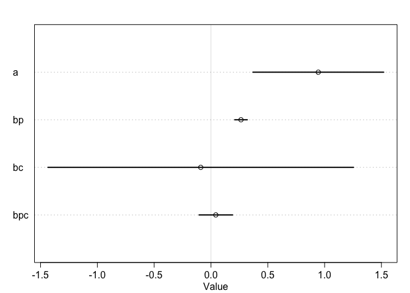<!-- -->

```r
#10.43
post <- extract.samples(m10.10)
lambda_high <- exp(post$a + post$bc + (post$bp + post$bpc)*8)
lambda_low <- exp(post$a + post$bp*8) 

diff <- lambda_high - lambda_low
sum(diff>0) / length(diff)
```

```
## [1] 0.9543
```

```r
#10.45
#no interaction
m10.11 <- map(
  alist(
    total_tools ~ dpois(lambda),
    log(lambda) <- a + bp*log_pop + bc*contact_high,
    a ~ dnorm(0,100),
    c(bp,bc) ~ dnorm(0,1)),
  data=d)
precis(m10.11)
```

```
##    Mean StdDev 5.5% 94.5%
## a  0.93   0.36 0.36  1.51
## bp 0.27   0.03 0.21  0.32
## bc 0.29   0.11 0.11  0.47
```

```r
#10.46
# no contact rate
m10.12 <- map(
  alist(
    total_tools ~ dpois( lambda ),
    log(lambda) <- a + bp*log_pop,
    a ~ dnorm(0,100),
    bp ~ dnorm( 0 , 1 )
  ), data=d )

# no log-population
m10.13 <- map(
  alist(
    total_tools ~ dpois( lambda ),
    log(lambda) <- a + bc*contact_high,
    a ~ dnorm(0,100),
    bc ~ dnorm( 0 , 1 )
  ), data=d )

# intercept only
m10.14 <- map(
  alist(
    total_tools ~ dpois( lambda ),
    log(lambda) <- a,
    a ~ dnorm(0,100)
  ), data=d )
```


```r
data(islandsDistMatrix)
# display short column names, so fits on screen
Dmat <- islandsDistMatrix
colnames(Dmat) <- c("Ml","Ti","SC","Ya","Fi","Tr","Ch","Mn","To","Ha")
round(Dmat,1)
```

```
##             Ml  Ti  SC  Ya  Fi  Tr  Ch  Mn  To  Ha
## Malekula   0.0 0.5 0.6 4.4 1.2 2.0 3.2 2.8 1.9 5.7
## Tikopia    0.5 0.0 0.3 4.2 1.2 2.0 2.9 2.7 2.0 5.3
## Santa Cruz 0.6 0.3 0.0 3.9 1.6 1.7 2.6 2.4 2.3 5.4
## Yap        4.4 4.2 3.9 0.0 5.4 2.5 1.6 1.6 6.1 7.2
## Lau Fiji   1.2 1.2 1.6 5.4 0.0 3.2 4.0 3.9 0.8 4.9
## Trobriand  2.0 2.0 1.7 2.5 3.2 0.0 1.8 0.8 3.9 6.7
## Chuuk      3.2 2.9 2.6 1.6 4.0 1.8 0.0 1.2 4.8 5.8
## Manus      2.8 2.7 2.4 1.6 3.9 0.8 1.2 0.0 4.6 6.7
## Tonga      1.9 2.0 2.3 6.1 0.8 3.9 4.8 4.6 0.0 5.0
## Hawaii     5.7 5.3 5.4 7.2 4.9 6.7 5.8 6.7 5.0 0.0
```

```r
data(Kline2)
d <- Kline2
d$society <- 1:10 # index observations
m13.7 <- map2stan(
  alist(
    total_tools ~ dpois(lambda),
    log(lambda) <- a + g[society] + bp*logpop,
    g[society] ~ GPL2( Dmat , etasq , rhosq , 0.01 ),
    a ~ dnorm(0,10),
    bp ~ dnorm(0,1),
    etasq ~ dcauchy(0,1),
    rhosq ~ dcauchy(0,1)
  ),
  data=list(
    total_tools=d$total_tools,
    logpop=d$logpop,
    society=d$society,
    Dmat=islandsDistMatrix),
  warmup=2000 , iter=1e4 , chains=4 )
```

```
## In file included from file592a7bee79e2.cpp:8:
## In file included from /Library/Frameworks/R.framework/Versions/3.3/Resources/library/StanHeaders/include/src/stan/model/model_header.hpp:4:
## In file included from /Library/Frameworks/R.framework/Versions/3.3/Resources/library/StanHeaders/include/stan/math.hpp:4:
## In file included from /Library/Frameworks/R.framework/Versions/3.3/Resources/library/StanHeaders/include/stan/math/rev/mat.hpp:4:
## In file included from /Library/Frameworks/R.framework/Versions/3.3/Resources/library/StanHeaders/include/stan/math/rev/core.hpp:12:
## In file included from /Library/Frameworks/R.framework/Versions/3.3/Resources/library/StanHeaders/include/stan/math/rev/core/gevv_vvv_vari.hpp:5:
## In file included from /Library/Frameworks/R.framework/Versions/3.3/Resources/library/StanHeaders/include/stan/math/rev/core/var.hpp:7:
## In file included from /Library/Frameworks/R.framework/Versions/3.3/Resources/library/BH/include/boost/math/tools/config.hpp:13:
## In file included from /Library/Frameworks/R.framework/Versions/3.3/Resources/library/BH/include/boost/config.hpp:39:
## /Library/Frameworks/R.framework/Versions/3.3/Resources/library/BH/include/boost/config/compiler/clang.hpp:196:11: warning: 'BOOST_NO_CXX11_RVALUE_REFERENCES' macro redefined [-Wmacro-redefined]
## #  define BOOST_NO_CXX11_RVALUE_REFERENCES
##           ^
## <command line>:6:9: note: previous definition is here
## #define BOOST_NO_CXX11_RVALUE_REFERENCES 1
##         ^
## 1 warning generated.
## 
## SAMPLING FOR MODEL 'total_tools ~ dpois(lambda)' NOW (CHAIN 1).
## 
## Chain 1, Iteration:    1 / 10000 [  0%]  (Warmup)
## Chain 1, Iteration: 1000 / 10000 [ 10%]  (Warmup)
## Chain 1, Iteration: 2000 / 10000 [ 20%]  (Warmup)
## Chain 1, Iteration: 2001 / 10000 [ 20%]  (Sampling)
## Chain 1, Iteration: 3000 / 10000 [ 30%]  (Sampling)
## Chain 1, Iteration: 4000 / 10000 [ 40%]  (Sampling)
## Chain 1, Iteration: 5000 / 10000 [ 50%]  (Sampling)
## Chain 1, Iteration: 6000 / 10000 [ 60%]  (Sampling)
## Chain 1, Iteration: 7000 / 10000 [ 70%]  (Sampling)
## Chain 1, Iteration: 8000 / 10000 [ 80%]  (Sampling)
## Chain 1, Iteration: 9000 / 10000 [ 90%]  (Sampling)
## Chain 1, Iteration: 10000 / 10000 [100%]  (Sampling)
##  Elapsed Time: 3.23626 seconds (Warm-up)
##                11.8989 seconds (Sampling)
##                15.1351 seconds (Total)
## 
## 
## SAMPLING FOR MODEL 'total_tools ~ dpois(lambda)' NOW (CHAIN 2).
## 
## Chain 2, Iteration:    1 / 10000 [  0%]  (Warmup)
## Chain 2, Iteration: 1000 / 10000 [ 10%]  (Warmup)
## Chain 2, Iteration: 2000 / 10000 [ 20%]  (Warmup)
## Chain 2, Iteration: 2001 / 10000 [ 20%]  (Sampling)
## Chain 2, Iteration: 3000 / 10000 [ 30%]  (Sampling)
## Chain 2, Iteration: 4000 / 10000 [ 40%]  (Sampling)
## Chain 2, Iteration: 5000 / 10000 [ 50%]  (Sampling)
## Chain 2, Iteration: 6000 / 10000 [ 60%]  (Sampling)
## Chain 2, Iteration: 7000 / 10000 [ 70%]  (Sampling)
## Chain 2, Iteration: 8000 / 10000 [ 80%]  (Sampling)
## Chain 2, Iteration: 9000 / 10000 [ 90%]  (Sampling)
## Chain 2, Iteration: 10000 / 10000 [100%]  (Sampling)
##  Elapsed Time: 2.72199 seconds (Warm-up)
##                12.391 seconds (Sampling)
##                15.1129 seconds (Total)
```

```
## The following numerical problems occured the indicated number of times on chain 2
```

```
##                                                                                                      count
## Exception thrown at line 30: multi_normal_log: LDLT_Factor of covariance parameter is not positive d     1
```

```
## When a numerical problem occurs, the Hamiltonian proposal gets rejected.
```

```
## See http://mc-stan.org/misc/warnings.html#exception-hamiltonian-proposal-rejected
```

```
## If the number in the 'count' column is small, do not ask about this message on stan-users.
```

```
## 
## SAMPLING FOR MODEL 'total_tools ~ dpois(lambda)' NOW (CHAIN 3).
## 
## Chain 3, Iteration:    1 / 10000 [  0%]  (Warmup)
## Chain 3, Iteration: 1000 / 10000 [ 10%]  (Warmup)
## Chain 3, Iteration: 2000 / 10000 [ 20%]  (Warmup)
## Chain 3, Iteration: 2001 / 10000 [ 20%]  (Sampling)
## Chain 3, Iteration: 3000 / 10000 [ 30%]  (Sampling)
## Chain 3, Iteration: 4000 / 10000 [ 40%]  (Sampling)
## Chain 3, Iteration: 5000 / 10000 [ 50%]  (Sampling)
## Chain 3, Iteration: 6000 / 10000 [ 60%]  (Sampling)
## Chain 3, Iteration: 7000 / 10000 [ 70%]  (Sampling)
## Chain 3, Iteration: 8000 / 10000 [ 80%]  (Sampling)
## Chain 3, Iteration: 9000 / 10000 [ 90%]  (Sampling)
## Chain 3, Iteration: 10000 / 10000 [100%]  (Sampling)
##  Elapsed Time: 2.5927 seconds (Warm-up)
##                11.1319 seconds (Sampling)
##                13.7246 seconds (Total)
## 
## 
## SAMPLING FOR MODEL 'total_tools ~ dpois(lambda)' NOW (CHAIN 4).
## 
## Chain 4, Iteration:    1 / 10000 [  0%]  (Warmup)
## Chain 4, Iteration: 1000 / 10000 [ 10%]  (Warmup)
## Chain 4, Iteration: 2000 / 10000 [ 20%]  (Warmup)
## Chain 4, Iteration: 2001 / 10000 [ 20%]  (Sampling)
## Chain 4, Iteration: 3000 / 10000 [ 30%]  (Sampling)
## Chain 4, Iteration: 4000 / 10000 [ 40%]  (Sampling)
## Chain 4, Iteration: 5000 / 10000 [ 50%]  (Sampling)
## Chain 4, Iteration: 6000 / 10000 [ 60%]  (Sampling)
## Chain 4, Iteration: 7000 / 10000 [ 70%]  (Sampling)
## Chain 4, Iteration: 8000 / 10000 [ 80%]  (Sampling)
## Chain 4, Iteration: 9000 / 10000 [ 90%]  (Sampling)
## Chain 4, Iteration: 10000 / 10000 [100%]  (Sampling)
##  Elapsed Time: 2.82549 seconds (Warm-up)
##                9.30472 seconds (Sampling)
##                12.1302 seconds (Total)
```

```
## Warning: There were 1 divergent transitions after warmup. Increasing adapt_delta above 0.8 may help. See
## http://mc-stan.org/misc/warnings.html#divergent-transitions-after-warmup
```

```
## Warning: Examine the pairs() plot to diagnose sampling problems
```

```
## 
## SAMPLING FOR MODEL 'total_tools ~ dpois(lambda)' NOW (CHAIN 1).
## WARNING: No variance estimation is
##          performed for num_warmup < 20
## 
## 
## Chain 1, Iteration: 1 / 1 [100%]  (Sampling)
##  Elapsed Time: 3e-06 seconds (Warm-up)
##                5.9e-05 seconds (Sampling)
##                6.2e-05 seconds (Total)
```

```
## Computing WAIC
```

```
## Constructing posterior predictions
```

```
## [ 3200 / 32000 ]
[ 6400 / 32000 ]
[ 9600 / 32000 ]
[ 12800 / 32000 ]
[ 16000 / 32000 ]
[ 19200 / 32000 ]
[ 22400 / 32000 ]
[ 25600 / 32000 ]
[ 28800 / 32000 ]
[ 32000 / 32000 ]
```

```
## Warning in map2stan(alist(total_tools ~ dpois(lambda), log(lambda) <- a + : There were 1 divergent iterations during sampling.
## Check the chains (trace plots, n_eff, Rhat) carefully to ensure they are valid.
```


```r
# compare all using WAIC
# adding n=1e4 for more stable WAIC estimates
# will also plot the comparison
( islands.compare <- compare(m10.10,m10.11,m10.12,m10.13,m10.14,m13.7,n=1e4) )
```

```
## Warning in compare(m10.10, m10.11, m10.12, m10.13, m10.14, m13.7, n = 10000): Not all model fits of same class.
## This is usually a bad idea, because it implies they were fit by different algorithms.
## Check yourself, before you wreck yourself.
```

```
##         WAIC pWAIC dWAIC weight    SE   dSE
## m13.7   67.3   4.0   0.0      1  2.13    NA
## m10.11  79.0   4.2  11.7      0 11.22 11.67
## m10.10  80.0   4.8  12.7      0 11.38 11.73
## m10.12  84.5   3.8  17.1      0  8.88  8.15
## m10.14 141.7   8.4  74.3      0 31.64 32.53
## m10.13 150.0  16.8  82.6      0 44.03 45.51
```

```r
plot(islands.compare)
```

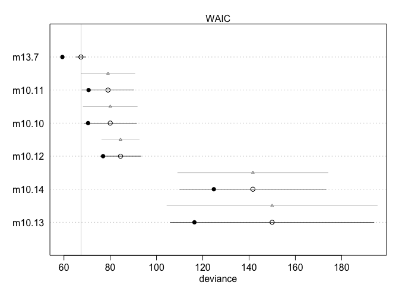<!-- -->

Am I supposed to refit these with map2stan?  Not doing so at this time.

m13.7 has the lowest WAIC and among the smallest number of effective parameters.  


# 13H1

_Revisit the `bangladesh` data from chapter 12.  Fit a model with both varying intercepts by `district_id` and vary slopes of `urban` by `district_id`.  Inspect the correlation between the slopes and intercepts.  Can you interpret this correlation, in terms of what it tells you about the pattern of contraceptive use in the sampe?  It might help to plot the mean (or median) varying effects estiamte for both the intercepts and slopes, by district.  Plotting predicted proportion of women using contraception, with urban women on one axis and rural on the other, might also help._


```r
data("bangladesh")
colnames(bangladesh) <- sub(".","_",colnames(bangladesh),fixed=TRUE)
bangladesh$district_id <- coerce_index(bangladesh$district)
#bangladesh$district_id <- as.factor(as.numeric(bangladesh$district))
summary(bangladesh)
```

```
##      woman           district     use_contraception living_children
##  Min.   :   1.0   Min.   : 1.00   Min.   :0.0000    Min.   :1.000  
##  1st Qu.: 484.2   1st Qu.:14.00   1st Qu.:0.0000    1st Qu.:1.000  
##  Median : 967.5   Median :29.00   Median :0.0000    Median :3.000  
##  Mean   : 967.5   Mean   :29.35   Mean   :0.3925    Mean   :2.652  
##  3rd Qu.:1450.8   3rd Qu.:45.00   3rd Qu.:1.0000    3rd Qu.:4.000  
##  Max.   :1934.0   Max.   :61.00   Max.   :1.0000    Max.   :4.000  
##   age_centered            urban         district_id   
##  Min.   :-13.560000   Min.   :0.0000   Min.   : 1.00  
##  1st Qu.: -7.559900   1st Qu.:0.0000   1st Qu.:13.00  
##  Median : -1.559900   Median :0.0000   Median :29.00  
##  Mean   :  0.002198   Mean   :0.2906   Mean   :29.49  
##  3rd Qu.:  6.440000   3rd Qu.:1.0000   3rd Qu.:45.00  
##  Max.   : 19.440000   Max.   :1.0000   Max.   :60.00
```

```r
head(bangladesh)
```

```
##   woman district use_contraception living_children age_centered urban
## 1     1        1                 0               4      18.4400     1
## 2     2        1                 0               1      -5.5599     1
## 3     3        1                 0               3       1.4400     1
## 4     4        1                 0               4       8.4400     1
## 5     5        1                 0               1     -13.5590     1
## 6     6        1                 0               1     -11.5600     1
##   district_id
## 1           1
## 2           1
## 3           1
## 4           1
## 5           1
## 6           1
```

varying intercepts and slope model

```r
m13h1.1 <- map2stan(alist(
  use_contraception ~ dbinom(1,p),
  logit(p) <- a_district[district_id] + b_urban_dept[district_id]*urban,
  c(a_district,b_urban_dept)[district_id] ~ dmvnorm2(c(a,b), sigma_district, Rho),
  a ~ dnorm(0,5),
  b ~ dnorm(0,5),
  sigma_district ~ dcauchy(0,1),
  Rho ~ dlkjcorr(2)),
  data=bangladesh,
  chains = 4)
```

```
## The following numerical problems occured the indicated number of times on chain 1
```

```
##                                                                        count
## Exception thrown at line 32: lkj_corr_log: y is not positive definite.     1
```

```
## When a numerical problem occurs, the Hamiltonian proposal gets rejected.
```

```
## See http://mc-stan.org/misc/warnings.html#exception-hamiltonian-proposal-rejected
```

```
## If the number in the 'count' column is small, do not ask about this message on stan-users.
```

```
## The following numerical problems occured the indicated number of times on chain 2
```

```
##                                                                        count
## Exception thrown at line 32: lkj_corr_log: y is not positive definite.     1
```

```
## When a numerical problem occurs, the Hamiltonian proposal gets rejected.
```

```
## See http://mc-stan.org/misc/warnings.html#exception-hamiltonian-proposal-rejected
```

```
## If the number in the 'count' column is small, do not ask about this message on stan-users.
```

```
## The following numerical problems occured the indicated number of times on chain 4
```

```
##                                                                        count
## Exception thrown at line 32: lkj_corr_log: y is not positive definite.     1
```

```
## When a numerical problem occurs, the Hamiltonian proposal gets rejected.
```

```
## See http://mc-stan.org/misc/warnings.html#exception-hamiltonian-proposal-rejected
```

```
## If the number in the 'count' column is small, do not ask about this message on stan-users.
```

```
## Computing WAIC
```

```
## Constructing posterior predictions
```


```r
plot(m13h1.1, ask=FALSE)
```

```
## Waiting to draw page 2 of 9
```

<!-- -->

```
## Waiting to draw page 3 of 9
```

<!-- -->

```
## Waiting to draw page 4 of 9
```

<!-- -->

```
## Waiting to draw page 5 of 9
```

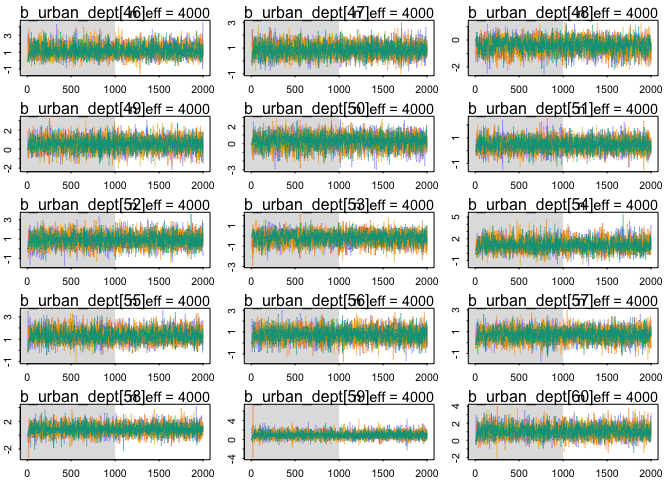<!-- -->

```
## Waiting to draw page 6 of 9
```

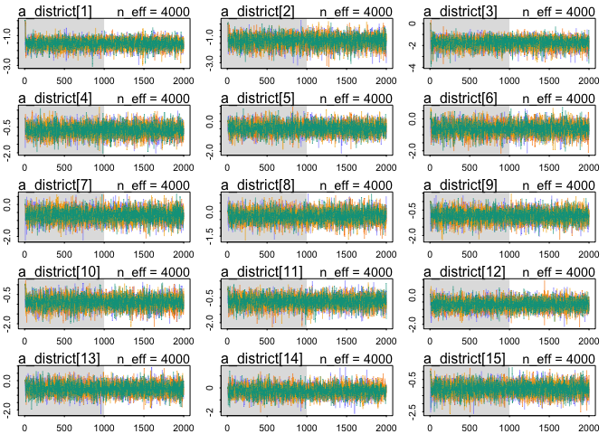<!-- -->

```
## Waiting to draw page 7 of 9
```

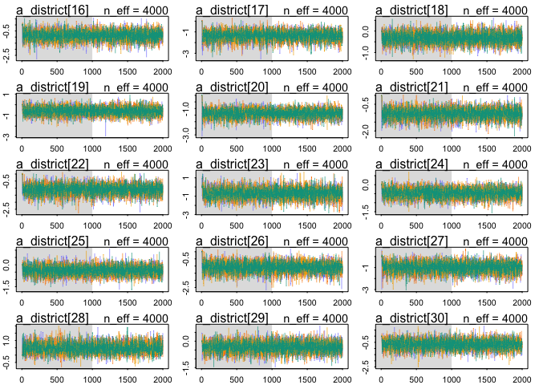<!-- -->

```
## Waiting to draw page 8 of 9
```

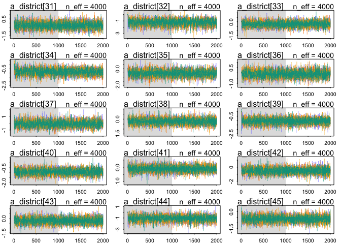<!-- -->

```
## Waiting to draw page 9 of 9
```

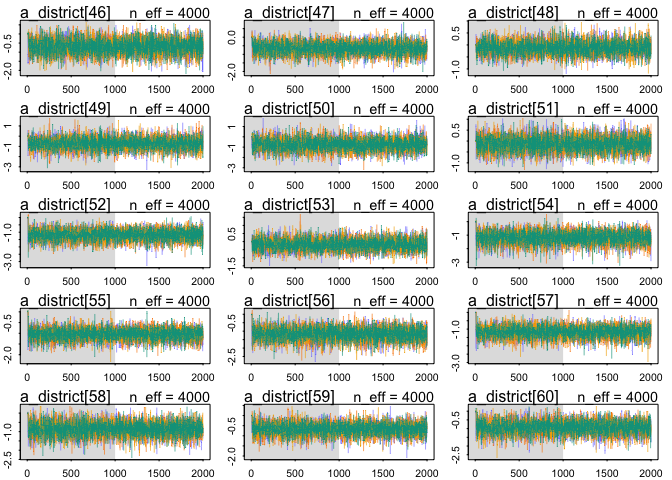<!-- -->

```r
precis(m13h1.1,depth=2)
```

```
##                    Mean StdDev lower 0.89 upper 0.89 n_eff Rhat
## b_urban_dept[1]    1.07   0.40       0.40       1.66  4000 1.00
## b_urban_dept[2]    1.27   0.79       0.05       2.46  4000 1.00
## b_urban_dept[3]    1.68   0.83       0.33       2.92  4000 1.00
## b_urban_dept[4]    0.45   0.59      -0.49       1.36  4000 1.00
## b_urban_dept[5]    0.28   0.58      -0.65       1.19  4000 1.00
## b_urban_dept[6]    1.26   0.43       0.55       1.93  4000 1.00
## b_urban_dept[7]    0.47   0.60      -0.51       1.38  4000 1.00
## b_urban_dept[8]    0.61   0.70      -0.43       1.79  4000 1.00
## b_urban_dept[9]    0.85   0.69      -0.25       1.91  4000 1.00
## b_urban_dept[10]   0.90   0.49       0.11       1.67  4000 1.00
## b_urban_dept[11]   1.00   0.62       0.06       1.99  4000 1.00
## b_urban_dept[12]   0.66   0.70      -0.43       1.75  4000 1.00
## b_urban_dept[13]   0.58   0.72      -0.56       1.70  4000 1.00
## b_urban_dept[14]  -0.34   0.71      -1.43       0.78  4000 1.00
## b_urban_dept[15]   1.08   0.74      -0.05       2.26  4000 1.00
## b_urban_dept[16]   0.88   0.73      -0.25       2.09  4000 1.00
## b_urban_dept[17]   1.31   0.78       0.17       2.62  4000 1.00
## b_urban_dept[18]   0.21   0.46      -0.53       0.92  4000 1.00
## b_urban_dept[19]   0.62   0.71      -0.54       1.68  4000 1.00
## b_urban_dept[20]   1.21   0.61       0.28       2.22  4000 1.00
## b_urban_dept[21]   0.77   0.60      -0.22       1.72  4000 1.00
## b_urban_dept[22]   1.19   0.59       0.30       2.16  4000 1.00
## b_urban_dept[23]   1.00   0.82      -0.20       2.37  4000 1.00
## b_urban_dept[24]   1.06   0.49       0.29       1.86  4000 1.00
## b_urban_dept[25]   0.41   0.59      -0.52       1.31  4000 1.00
## b_urban_dept[26]   1.06   0.73      -0.10       2.17  4000 1.00
## b_urban_dept[27]   1.30   0.68       0.23       2.36  4000 1.00
## b_urban_dept[28]  -0.70   0.63      -1.67       0.32  4000 1.00
## b_urban_dept[29]   0.48   0.48      -0.33       1.19  4000 1.00
## b_urban_dept[30]   0.54   0.65      -0.48       1.55  4000 1.00
## b_urban_dept[31]   0.31   0.73      -0.82       1.46  4000 1.00
## b_urban_dept[32]   1.31   0.70       0.21       2.45  4000 1.00
## b_urban_dept[33]   0.30   0.65      -0.66       1.39  4000 1.00
## b_urban_dept[34]   1.66   0.65       0.59       2.60  4000 1.00
## b_urban_dept[35]   0.51   0.51      -0.33       1.30  4000 1.00
## b_urban_dept[36]  -0.27   0.70      -1.36       0.81  4000 1.00
## b_urban_dept[37]  -0.25   0.72      -1.37       0.87  4000 1.00
## b_urban_dept[38]   0.46   0.49      -0.30       1.24  4000 1.00
## b_urban_dept[39]   1.05   0.71      -0.01       2.22  4000 1.00
## b_urban_dept[40]   1.27   0.62       0.29       2.23  4000 1.00
## b_urban_dept[41]   0.47   0.47      -0.29       1.23  4000 1.00
## b_urban_dept[42]   0.53   0.65      -0.53       1.54  4000 1.00
## b_urban_dept[43]   0.40   0.50      -0.35       1.21  4000 1.00
## b_urban_dept[44]   1.06   0.82      -0.15       2.44  4000 1.00
## b_urban_dept[45]   0.65   0.62      -0.28       1.65  4000 1.00
## b_urban_dept[46]   1.21   0.68       0.12       2.28  4000 1.00
## b_urban_dept[47]   0.86   0.50       0.05       1.61  4000 1.00
## b_urban_dept[48]  -0.44   0.51      -1.21       0.38  4000 1.00
## b_urban_dept[49]   0.52   0.67      -0.54       1.56  4000 1.00
## b_urban_dept[50]   0.27   0.76      -0.89       1.51  4000 1.00
## b_urban_dept[51]   0.46   0.47      -0.25       1.26  4000 1.00
## b_urban_dept[52]   0.92   0.64      -0.08       1.96  4000 1.00
## b_urban_dept[53]  -0.20   0.57      -1.13       0.68  4000 1.00
## b_urban_dept[54]   1.14   0.77      -0.07       2.35  4000 1.00
## b_urban_dept[55]   1.34   0.54       0.49       2.21  4000 1.00
## b_urban_dept[56]   0.78   0.58      -0.07       1.72  4000 1.00
## b_urban_dept[57]   0.72   0.56      -0.13       1.65  4000 1.00
## b_urban_dept[58]   0.86   0.70      -0.19       2.04  4000 1.00
## b_urban_dept[59]   0.97   0.65      -0.06       1.98  4000 1.00
## b_urban_dept[60]   1.06   0.67      -0.01       2.12  4000 1.00
## a_district[1]     -1.54   0.32      -2.07      -1.06  4000 1.00
## a_district[2]     -1.32   0.47      -2.10      -0.62  4000 1.00
## a_district[3]     -1.77   0.47      -2.48      -1.01  4000 1.00
## a_district[4]     -0.68   0.36      -1.23      -0.09  4000 1.00
## a_district[5]     -0.48   0.38      -1.08       0.14  4000 1.00
## a_district[6]     -0.63   0.39      -1.24       0.00  4000 1.00
## a_district[7]     -0.67   0.40      -1.33      -0.06  4000 1.00
## a_district[8]     -0.28   0.39      -0.88       0.34  4000 1.00
## a_district[9]     -0.84   0.36      -1.42      -0.29  4000 1.00
## a_district[10]    -0.90   0.32      -1.41      -0.41  4000 1.00
## a_district[11]    -0.74   0.35      -1.28      -0.18  4000 1.00
## a_district[12]    -0.67   0.36      -1.23      -0.09  4000 1.00
## a_district[13]    -0.56   0.40      -1.19       0.08  4000 1.00
## a_district[14]    -0.25   0.45      -0.98       0.48  4000 1.00
## a_district[15]    -1.10   0.39      -1.70      -0.46  4000 1.00
## a_district[16]    -0.88   0.42      -1.59      -0.23  4000 1.00
## a_district[17]    -1.36   0.46      -2.09      -0.65  4000 1.00
## a_district[18]    -0.32   0.26      -0.71       0.13  4000 1.00
## a_district[19]    -0.61   0.41      -1.22       0.06  4000 1.00
## a_district[20]    -1.37   0.33      -1.90      -0.84  4000 1.00
## a_district[21]    -1.03   0.30      -1.51      -0.56  4000 1.00
## a_district[22]    -1.11   0.36      -1.74      -0.59  4000 1.00
## a_district[23]    -0.68   0.61      -1.65       0.23  4000 1.00
## a_district[24]    -0.47   0.28      -0.89      -0.01  4000 1.00
## a_district[25]    -0.39   0.33      -0.96       0.10  4000 1.00
## a_district[26]    -1.09   0.37      -1.65      -0.49  4000 1.00
## a_district[27]    -1.00   0.49      -1.82      -0.25  4000 1.00
## a_district[28]     0.48   0.37      -0.10       1.06  4000 1.00
## a_district[29]    -0.33   0.31      -0.80       0.18  4000 1.00
## a_district[30]    -0.68   0.40      -1.31      -0.02  4000 1.00
## a_district[31]    -0.28   0.42      -1.02       0.35  4000 1.00
## a_district[32]    -1.24   0.52      -2.06      -0.42  4000 1.00
## a_district[33]    -0.26   0.34      -0.78       0.29  4000 1.00
## a_district[34]    -0.87   0.40      -1.50      -0.22  4000 1.00
## a_district[35]    -0.55   0.41      -1.23       0.08  4000 1.00
## a_district[36]    -0.10   0.35      -0.65       0.48  4000 1.00
## a_district[37]    -0.07   0.49      -0.85       0.69  4000 1.00
## a_district[38]    -0.23   0.32      -0.74       0.28  4000 1.00
## a_district[39]    -1.07   0.35      -1.60      -0.49  4000 1.00
## a_district[40]    -0.92   0.32      -1.44      -0.42  4000 1.00
## a_district[41]    -0.11   0.22      -0.47       0.23  4000 1.00
## a_district[42]    -0.52   0.45      -1.28       0.14  4000 1.00
## a_district[43]    -0.24   0.34      -0.82       0.27  4000 1.00
## a_district[44]    -1.08   0.55      -1.89      -0.16  4000 1.00
## a_district[45]    -0.65   0.30      -1.10      -0.16  4000 1.00
## a_district[46]    -0.69   0.41      -1.36      -0.05  4000 1.00
## a_district[47]    -0.66   0.36      -1.20      -0.07  4000 1.00
## a_district[48]    -0.12   0.29      -0.58       0.33  4000 1.00
## a_district[49]    -0.73   0.58      -1.60       0.24  4000 1.00
## a_district[50]    -0.75   0.59      -1.67       0.19  4000 1.00
## a_district[51]    -0.13   0.34      -0.65       0.43  4000 1.00
## a_district[52]    -1.20   0.38      -1.81      -0.59  4000 1.00
## a_district[53]    -0.18   0.37      -0.75       0.42  4000 1.00
## a_district[54]    -1.19   0.47      -1.91      -0.45  4000 1.00
## a_district[55]    -1.05   0.27      -1.48      -0.62  4000 1.00
## a_district[56]    -1.18   0.39      -1.80      -0.55  4000 1.00
## a_district[57]    -1.18   0.36      -1.71      -0.60  4000 1.00
## a_district[58]    -0.87   0.38      -1.48      -0.29  4000 1.00
## a_district[59]    -0.67   0.30      -1.14      -0.19  4000 1.00
## a_district[60]    -0.94   0.38      -1.54      -0.31  4000 1.00
## a                 -0.72   0.10      -0.87      -0.55  4000 1.00
## b                  0.72   0.17       0.45       0.99  2205 1.00
## sigma_district[1]  0.58   0.10       0.41       0.72  1308 1.00
## sigma_district[2]  0.79   0.20       0.48       1.10   588 1.01
## Rho[1,1]           1.00   0.00       1.00       1.00  4000  NaN
## Rho[1,2]          -0.66   0.16      -0.90      -0.43   899 1.01
## Rho[2,1]          -0.66   0.16      -0.90      -0.43   899 1.01
## Rho[2,2]           1.00   0.00       1.00       1.00  3931 1.00
```

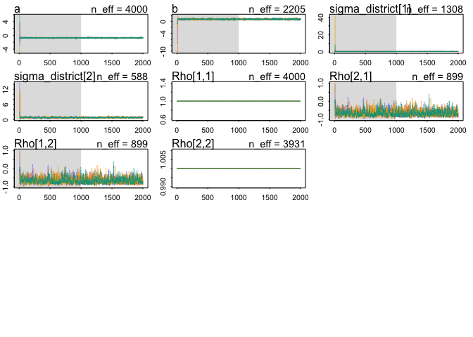<!-- -->

The correlation between intercept and slope is negative, and on average the intercept (non-urban) is low and the slope is positive.  So urban areas tend to have more contraceptive use.  However if the district already has high use everywhere it can't get that much higher, so lower slope.


```r
newdata <- data.frame(
  district_id = rep(1:60,2),
  urban = rep(c(0,1),each=60)
)
post <- link(m13h1.1,newdata)
```

```
## [ 100 / 1000 ]
[ 200 / 1000 ]
[ 300 / 1000 ]
[ 400 / 1000 ]
[ 500 / 1000 ]
[ 600 / 1000 ]
[ 700 / 1000 ]
[ 800 / 1000 ]
[ 900 / 1000 ]
[ 1000 / 1000 ]
```

```r
dim(post)
```

```
## [1] 1000  120
```

```r
mu <- apply(post,2,mean)
PI <- apply(post,2,PI)
newdata$mean <- mu
newdata$low <- PI[1,]
newdata$high <- PI[2,]
```


```r
pl <- ggplot(newdata,aes(x=as.factor(district_id),y=mean,fill=as.factor(urban)))
pl <- pl + geom_bar(position="dodge",stat="identity")
pl 
```

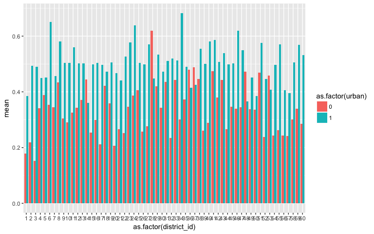<!-- -->

```r
with(newdata, qplot(x=mean[urban==0],y=mean[urban==1]))
```

<!-- -->

```r
with(newdata, qplot(x=mean[urban==0],y=mean[urban==1]-mean[urban==0]) + 
       xlab("percent use rural") + 
       ylab ("percent increase in urban") + 
       ggtitle("contraceptive use"))
```

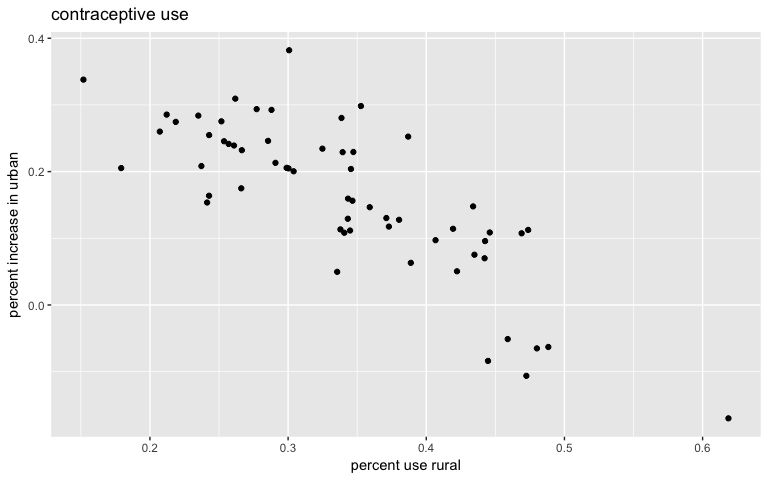<!-- -->

# 13H2
_Predict height as a function of age in Oxboys data set.  Cluster by subject (i.e. boy).  Fit a model with varying intercepts and slopes (on age) clustered by subject.  

```r
data("Oxboys")
summary(Oxboys)
```

```
##     Subject          age               height         Occasion
##  Min.   : 1.0   Min.   :-1.00000   Min.   :126.2   Min.   :1  
##  1st Qu.: 7.0   1st Qu.:-0.46300   1st Qu.:143.8   1st Qu.:3  
##  Median :13.5   Median :-0.00270   Median :149.5   Median :5  
##  Mean   :13.5   Mean   : 0.02263   Mean   :149.5   Mean   :5  
##  3rd Qu.:20.0   3rd Qu.: 0.55620   3rd Qu.:155.5   3rd Qu.:7  
##  Max.   :26.0   Max.   : 1.00550   Max.   :174.8   Max.   :9
```

```r
Oxboys$subj_id <- coerce_index(Oxboys$Subject)
```


```r
pl <- ggplot(Oxboys,aes(x=age,y=height,group=Subject))
pl <- pl + geom_line()
pl
```

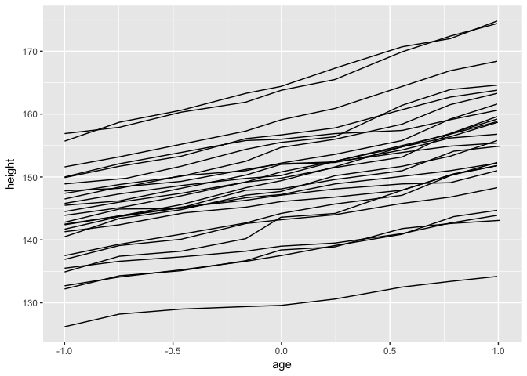<!-- -->


```r
m.ox1 <- map2stan(alist(
  height ~ dnorm(mu,sigma),
  mu <- a + a_subj[subj_id] + b_age*age + b_age_subj[subj_id]*age,
  a ~ dnorm(140,10),
  b_age ~ dnorm(0,5),
  c(a_subj,b_age_subj)[subj_id] ~ dmvnorm2(0,sigma_subj,Rho_subj),
  sigma_subj ~ dcauchy(0,1),
  sigma ~ dcauchy(0,1),
  Rho_subj ~ dlkjcorr(2)),
  data=Oxboys,
  chains=4,
  iter = 5000,
  warmup = 1500,
  cores = 2)
```

```
## In file included from file592ab63ee75.cpp:8:
## In file included from /Library/Frameworks/R.framework/Versions/3.3/Resources/library/StanHeaders/include/src/stan/model/model_header.hpp:4:
## In file included from /Library/Frameworks/R.framework/Versions/3.3/Resources/library/StanHeaders/include/stan/math.hpp:4:
## In file included from /Library/Frameworks/R.framework/Versions/3.3/Resources/library/StanHeaders/include/stan/math/rev/mat.hpp:4:
## In file included from /Library/Frameworks/R.framework/Versions/3.3/Resources/library/StanHeaders/include/stan/math/rev/core.hpp:12:
## In file included from /Library/Frameworks/R.framework/Versions/3.3/Resources/library/StanHeaders/include/stan/math/rev/core/gevv_vvv_vari.hpp:5:
## In file included from /Library/Frameworks/R.framework/Versions/3.3/Resources/library/StanHeaders/include/stan/math/rev/core/var.hpp:7:
## In file included from /Library/Frameworks/R.framework/Versions/3.3/Resources/library/BH/include/boost/math/tools/config.hpp:13:
## In file included from /Library/Frameworks/R.framework/Versions/3.3/Resources/library/BH/include/boost/config.hpp:39:
## /Library/Frameworks/R.framework/Versions/3.3/Resources/library/BH/include/boost/config/compiler/clang.hpp:196:11: warning: 'BOOST_NO_CXX11_RVALUE_REFERENCES' macro redefined [-Wmacro-redefined]
## #  define BOOST_NO_CXX11_RVALUE_REFERENCES
##           ^
## <command line>:6:9: note: previous definition is here
## #define BOOST_NO_CXX11_RVALUE_REFERENCES 1
##         ^
## 1 warning generated.
## 
## SAMPLING FOR MODEL 'height ~ dnorm(mu, sigma)' NOW (CHAIN 1).
## WARNING: No variance estimation is
##          performed for num_warmup < 20
## 
## 
## Chain 1, Iteration: 1 / 1 [100%]  (Sampling)
##  Elapsed Time: 3e-06 seconds (Warm-up)
##                0.000187 seconds (Sampling)
##                0.00019 seconds (Total)
```

```
## Computing WAIC
```

```
## Constructing posterior predictions
```

```
## [ 1400 / 14000 ]
[ 2800 / 14000 ]
[ 4200 / 14000 ]
[ 5600 / 14000 ]
[ 7000 / 14000 ]
[ 8400 / 14000 ]
[ 9800 / 14000 ]
[ 11200 / 14000 ]
[ 12600 / 14000 ]
[ 14000 / 14000 ]
```


```r
precis(m.ox1,depth = 2)
```

```
##                  Mean StdDev lower 0.89 upper 0.89 n_eff Rhat
## a              149.05   1.57     146.46     151.45  1162    1
## b_age            6.48   0.34       5.96       7.01  1530    1
## b_age_subj[1]    0.65   0.46      -0.08       1.39  3361    1
## b_age_subj[2]   -2.72   0.46      -3.44      -1.98  3263    1
## b_age_subj[3]    1.91   0.46       1.18       2.66  2590    1
## b_age_subj[4]    0.56   0.46      -0.18       1.30  3278    1
## b_age_subj[5]    1.94   0.47       1.19       2.69  3162    1
## b_age_subj[6]    2.13   0.46       1.41       2.88  2888    1
## b_age_subj[7]    0.57   0.47      -0.19       1.30  3174    1
## b_age_subj[8]   -1.82   0.46      -2.54      -1.07  3338    1
## b_age_subj[9]    1.96   0.47       1.25       2.73  3194    1
## b_age_subj[10]  -0.47   0.47      -1.23       0.26  3096    1
## b_age_subj[11]   2.54   0.46       1.81       3.28  2564    1
## b_age_subj[12]  -1.02   0.46      -1.79      -0.32  2859    1
## b_age_subj[13]  -1.95   0.46      -2.67      -1.21  3357    1
## b_age_subj[14]   0.96   0.47       0.22       1.70  3447    1
## b_age_subj[15]   1.55   0.46       0.81       2.28  3204    1
## b_age_subj[16]   0.67   0.47      -0.05       1.43  3235    1
## b_age_subj[17]   0.30   0.46      -0.43       1.03  3022    1
## b_age_subj[18]  -2.38   0.47      -3.11      -1.63  2926    1
## b_age_subj[19]  -0.92   0.47      -1.65      -0.15  3397    1
## b_age_subj[20]  -1.55   0.46      -2.27      -0.80  3281    1
## b_age_subj[21]   2.82   0.46       2.09       3.56  3116    1
## b_age_subj[22]  -0.20   0.46      -0.92       0.55  2593    1
## b_age_subj[23]  -2.38   0.46      -3.11      -1.63  3322    1
## b_age_subj[24]  -1.42   0.46      -2.14      -0.68  2877    1
## b_age_subj[25]  -0.02   0.47      -0.78       0.70  2787    1
## b_age_subj[26]  -0.52   0.46      -1.29       0.18  3340    1
## a_subj[1]       -0.93   1.59      -3.46       1.56  1185    1
## a_subj[2]      -18.78   1.58     -21.19     -16.15  1181    1
## a_subj[3]        1.00   1.59      -1.43       3.64  1177    1
## a_subj[4]        7.75   1.59       5.28      10.33  1186    1
## a_subj[5]        7.02   1.58       4.62       9.64  1175    1
## a_subj[6]       10.42   1.58       7.91      12.95  1188    1
## a_subj[7]       -4.77   1.58      -7.34      -2.31  1182    1
## a_subj[8]       -1.51   1.59      -4.12       0.95  1186    1
## a_subj[9]       -6.06   1.58      -8.54      -3.51  1183    1
## a_subj[10]       2.12   1.59      -0.34       4.70  1187    1
## a_subj[11]      15.51   1.59      13.05      18.08  1181    1
## a_subj[12]      -6.19   1.59      -8.63      -3.57  1177    1
## a_subj[13]       2.41   1.59      -0.13       4.92  1167    1
## a_subj[14]       1.47   1.58      -1.09       3.94  1181    1
## a_subj[15]       5.51   1.59       3.05       8.10  1198    1
## a_subj[16]       2.01   1.58      -0.57       4.46  1174    1
## a_subj[17]       4.08   1.58       1.51       6.54  1181    1
## a_subj[18]      -9.84   1.58     -12.26      -7.23  1189    1
## a_subj[19]     -11.05   1.59     -13.56      -8.50  1350    1
## a_subj[20]       6.58   1.59       4.01       9.02  1188    1
## a_subj[21]      16.01   1.59      13.38      18.40  1166    1
## a_subj[22]       2.37   1.59      -0.13       4.89  1178    1
## a_subj[23]      -2.27   1.58      -4.81       0.24  1185    1
## a_subj[24]      -2.92   1.59      -5.49      -0.45  1183    1
## a_subj[25]      -0.75   1.58      -3.43       1.61  1183    1
## a_subj[26]     -10.90   1.59     -13.39      -8.35  1179    1
## sigma_subj[1]    8.01   1.10       6.33       9.70 10671    1
## sigma_subj[2]    1.68   0.24       1.31       2.04 10818    1
## sigma            0.66   0.04       0.61       0.72  8463    1
## Rho_subj[1,1]    1.00   0.00       1.00       1.00 14000  NaN
## Rho_subj[1,2]    0.55   0.13       0.36       0.77 10501    1
## Rho_subj[2,1]    0.55   0.13       0.36       0.77 10501    1
## Rho_subj[2,2]    1.00   0.00       1.00       1.00 14000    1
```

a: this is the overall intercept
a_subj[]: these are variations around that mean by subject
b: this is the overall slope of height vs age
b_subj[]: this is the variation around that slope by subject
sigma_subj[1]: staandard deviation in intercepts among subjects
sigma_subj[2]: standard devation in slopes among subjects
sigma: standard deviation
Rho_ correlation between slope and intercept.  Indicates that those with higher heights grow faster

We see that there is strong evidence for height increasing with age, for varying intercepts and varying slopes by boy (since there are some boys where the 89% confidence intervals on these coefficients do not cross zero)

Compare to models without varying intercept or without varying slope:

First no varying intercept

```r
m.ox2 <- map2stan(alist(
  height ~ dnorm(mu,sigma),
  mu <- a + b_age*age + b_age_subj[subj_id]*age,
  a ~ dnorm(140,10),
  b_age ~ dnorm(0,5),
  b_age_subj[subj_id] ~ dnorm(0,sigma_subj),
  sigma_subj ~ dexp(1),
  sigma ~ dcauchy(0,1)),
  data=Oxboys,
  chains=4,
  iter = 6000,
  warmup = 1500,
  cores = 2)
```

```
## In file included from file592a645e65b8.cpp:8:
## In file included from /Library/Frameworks/R.framework/Versions/3.3/Resources/library/StanHeaders/include/src/stan/model/model_header.hpp:4:
## In file included from /Library/Frameworks/R.framework/Versions/3.3/Resources/library/StanHeaders/include/stan/math.hpp:4:
## In file included from /Library/Frameworks/R.framework/Versions/3.3/Resources/library/StanHeaders/include/stan/math/rev/mat.hpp:4:
## In file included from /Library/Frameworks/R.framework/Versions/3.3/Resources/library/StanHeaders/include/stan/math/rev/core.hpp:12:
## In file included from /Library/Frameworks/R.framework/Versions/3.3/Resources/library/StanHeaders/include/stan/math/rev/core/gevv_vvv_vari.hpp:5:
## In file included from /Library/Frameworks/R.framework/Versions/3.3/Resources/library/StanHeaders/include/stan/math/rev/core/var.hpp:7:
## In file included from /Library/Frameworks/R.framework/Versions/3.3/Resources/library/BH/include/boost/math/tools/config.hpp:13:
## In file included from /Library/Frameworks/R.framework/Versions/3.3/Resources/library/BH/include/boost/config.hpp:39:
## /Library/Frameworks/R.framework/Versions/3.3/Resources/library/BH/include/boost/config/compiler/clang.hpp:196:11: warning: 'BOOST_NO_CXX11_RVALUE_REFERENCES' macro redefined [-Wmacro-redefined]
## #  define BOOST_NO_CXX11_RVALUE_REFERENCES
##           ^
## <command line>:6:9: note: previous definition is here
## #define BOOST_NO_CXX11_RVALUE_REFERENCES 1
##         ^
## 1 warning generated.
```

```
## Warning: There were 13 divergent transitions after warmup. Increasing adapt_delta above 0.8 may help. See
## http://mc-stan.org/misc/warnings.html#divergent-transitions-after-warmup
```

```
## Warning: There were 4 chains where the estimated Bayesian Fraction of Missing Information was low. See
## http://mc-stan.org/misc/warnings.html#bfmi-low
```

```
## Warning: Examine the pairs() plot to diagnose sampling problems
```

```
## 
## SAMPLING FOR MODEL 'height ~ dnorm(mu, sigma)' NOW (CHAIN 1).
## WARNING: No variance estimation is
##          performed for num_warmup < 20
## 
## 
## Chain 1, Iteration: 1 / 1 [100%]  (Sampling)
##  Elapsed Time: 3e-06 seconds (Warm-up)
##                7.4e-05 seconds (Sampling)
##                7.7e-05 seconds (Total)
```

```
## Computing WAIC
```

```
## Constructing posterior predictions
```

```
## [ 1800 / 18000 ]
[ 3600 / 18000 ]
[ 5400 / 18000 ]
[ 7200 / 18000 ]
[ 9000 / 18000 ]
[ 10800 / 18000 ]
[ 12600 / 18000 ]
[ 14400 / 18000 ]
[ 16200 / 18000 ]
[ 18000 / 18000 ]
```

```
## Warning in map2stan(alist(height ~ dnorm(mu, sigma), mu <- a + b_age * age + : There were 13 divergent iterations during sampling.
## Check the chains (trace plots, n_eff, Rhat) carefully to ensure they are valid.
```


```r
precis(m.ox2,depth=2)
```

```
## Warning in precis(m.ox2, depth = 2): There were 13 divergent iterations during sampling.
## Check the chains (trace plots, n_eff, Rhat) carefully to ensure they are valid.
```

```
##                  Mean StdDev lower 0.89 upper 0.89 n_eff Rhat
## a              149.35   0.53     148.48     150.18  8603 1.00
## b_age            6.35   0.83       5.00       7.65  8569 1.00
## b_age_subj[1]    0.03   0.69      -1.06       1.01 18000 1.00
## b_age_subj[2]   -0.09   0.70      -1.18       0.91 18000 1.00
## b_age_subj[3]    0.06   0.71      -0.97       1.12 18000 1.00
## b_age_subj[4]    0.03   0.68      -1.03       1.03 18000 1.00
## b_age_subj[5]    0.07   0.70      -0.92       1.14 18000 1.00
## b_age_subj[6]    0.08   0.69      -0.99       1.08 18000 1.00
## b_age_subj[7]    0.01   0.69      -1.04       1.05 18000 1.00
## b_age_subj[8]   -0.05   0.69      -1.09       0.97 18000 1.00
## b_age_subj[9]    0.06   0.69      -0.91       1.15 18000 1.00
## b_age_subj[10]  -0.01   0.69      -1.07       1.01 18000 1.00
## b_age_subj[11]   0.10   0.71      -0.90       1.18 18000 1.00
## b_age_subj[12]  -0.03   0.70      -1.12       0.99 18000 1.00
## b_age_subj[13]  -0.05   0.72      -1.15       0.97 18000 1.00
## b_age_subj[14]   0.04   0.69      -0.95       1.08 18000 1.00
## b_age_subj[15]   0.06   0.69      -0.96       1.12 18000 1.00
## b_age_subj[16]   0.03   0.69      -0.99       1.05 18000 1.00
## b_age_subj[17]   0.02   0.70      -0.99       1.06 18000 1.00
## b_age_subj[18]  -0.07   0.69      -1.12       0.94 18000 1.00
## b_age_subj[19]  -0.04   0.69      -1.12       0.95 18000 1.00
## b_age_subj[20]  -0.04   0.68      -1.10       0.95 18000 1.00
## b_age_subj[21]   0.11   0.70      -1.00       1.09 18000 1.00
## b_age_subj[22]   0.00   0.69      -0.98       1.07 18000 1.00
## b_age_subj[23]  -0.07   0.69      -1.09       0.95 18000 1.00
## b_age_subj[24]  -0.04   0.71      -1.16       0.97 18000 1.00
## b_age_subj[25]   0.01   0.68      -1.02       1.00 18000 1.00
## b_age_subj[26]  -0.03   0.69      -1.03       1.02 18000 1.00
## sigma_subj       0.57   0.44       0.05       1.16   359 1.01
## sigma            8.10   0.38       7.52       8.72  6057 1.00
```


```r
m.ox3 <- map2stan(alist(
  height ~ dnorm(mu,sigma),
  mu <- a + a_subj[subj_id] + b_age*age,
  a ~ dnorm(140,10),
  b_age ~ dnorm(0,5),
  a_subj[subj_id] ~ dnorm(0,sigma_subj),
  sigma_subj ~ dexp(1),
  sigma ~ dcauchy(0,1)),
  data=Oxboys,
  chains=4,
  iter = 6000,
  warmup = 1500,
  cores = 2)
```

```
## In file included from file592a64a82dfa.cpp:8:
## In file included from /Library/Frameworks/R.framework/Versions/3.3/Resources/library/StanHeaders/include/src/stan/model/model_header.hpp:4:
## In file included from /Library/Frameworks/R.framework/Versions/3.3/Resources/library/StanHeaders/include/stan/math.hpp:4:
## In file included from /Library/Frameworks/R.framework/Versions/3.3/Resources/library/StanHeaders/include/stan/math/rev/mat.hpp:4:
## In file included from /Library/Frameworks/R.framework/Versions/3.3/Resources/library/StanHeaders/include/stan/math/rev/core.hpp:12:
## In file included from /Library/Frameworks/R.framework/Versions/3.3/Resources/library/StanHeaders/include/stan/math/rev/core/gevv_vvv_vari.hpp:5:
## In file included from /Library/Frameworks/R.framework/Versions/3.3/Resources/library/StanHeaders/include/stan/math/rev/core/var.hpp:7:
## In file included from /Library/Frameworks/R.framework/Versions/3.3/Resources/library/BH/include/boost/math/tools/config.hpp:13:
## In file included from /Library/Frameworks/R.framework/Versions/3.3/Resources/library/BH/include/boost/config.hpp:39:
## /Library/Frameworks/R.framework/Versions/3.3/Resources/library/BH/include/boost/config/compiler/clang.hpp:196:11: warning: 'BOOST_NO_CXX11_RVALUE_REFERENCES' macro redefined [-Wmacro-redefined]
## #  define BOOST_NO_CXX11_RVALUE_REFERENCES
##           ^
## <command line>:6:9: note: previous definition is here
## #define BOOST_NO_CXX11_RVALUE_REFERENCES 1
##         ^
## 1 warning generated.
## 
## SAMPLING FOR MODEL 'height ~ dnorm(mu, sigma)' NOW (CHAIN 1).
## WARNING: No variance estimation is
##          performed for num_warmup < 20
## 
## 
## Chain 1, Iteration: 1 / 1 [100%]  (Sampling)
##  Elapsed Time: 3e-06 seconds (Warm-up)
##                7.2e-05 seconds (Sampling)
##                7.5e-05 seconds (Total)
```

```
## Computing WAIC
```

```
## Constructing posterior predictions
```

```
## [ 1800 / 18000 ]
[ 3600 / 18000 ]
[ 5400 / 18000 ]
[ 7200 / 18000 ]
[ 9000 / 18000 ]
[ 10800 / 18000 ]
[ 12600 / 18000 ]
[ 14400 / 18000 ]
[ 16200 / 18000 ]
[ 18000 / 18000 ]
```


```r
precis(m.ox3,depth=2)
```

```
##              Mean StdDev lower 0.89 upper 0.89 n_eff Rhat
## a          149.18   1.47     146.92     151.57   655    1
## b_age        6.52   0.13       6.32       6.74  4304    1
## a_subj[1]   -1.04   1.53      -3.54       1.30   706    1
## a_subj[2]  -18.90   1.53     -21.29     -16.46   707    1
## a_subj[3]    0.91   1.53      -1.55       3.30   699    1
## a_subj[4]    7.61   1.53       5.21      10.05   701    1
## a_subj[5]    6.92   1.52       4.51       9.35   703    1
## a_subj[6]   10.31   1.53       7.82      12.65   704    1
## a_subj[7]   -4.87   1.53      -7.29      -2.41   703    1
## a_subj[8]   -1.67   1.53      -4.13       0.75   713    1
## a_subj[9]   -6.13   1.53      -8.54      -3.72   696    1
## a_subj[10]   1.98   1.53      -0.40       4.44   709    1
## a_subj[11]  15.40   1.53      12.96      17.81   715    1
## a_subj[12]  -6.32   1.53      -8.81      -3.97   711    1
## a_subj[13]   2.24   1.53      -0.16       4.69   698    1
## a_subj[14]   1.37   1.52      -1.11       3.73   707    1
## a_subj[15]   5.41   1.53       2.97       7.80   707    1
## a_subj[16]   1.90   1.53      -0.49       4.38   708    1
## a_subj[17]   3.96   1.53       1.54       6.39   725    1
## a_subj[18]  -9.98   1.53     -12.50      -7.65   704    1
## a_subj[19] -11.16   1.53     -13.64      -8.77   699    1
## a_subj[20]   6.41   1.53       3.97       8.81   703    1
## a_subj[21]  15.90   1.53      13.42      18.25   702    1
## a_subj[22]   2.24   1.53      -0.20       4.63   706    1
## a_subj[23]  -2.43   1.53      -4.89      -0.02   708    1
## a_subj[24]  -3.07   1.53      -5.49      -0.64   702    1
## a_subj[25]  -0.88   1.53      -3.36       1.51   700    1
## a_subj[26] -11.01   1.53     -13.39      -8.51   707    1
## sigma_subj   7.39   0.91       5.94       8.74  3716    1
## sigma        1.31   0.07       1.21       1.41  3361    1
```


```r
compare(m.ox1,m.ox2,m.ox3)
```

```
##         WAIC pWAIC  dWAIC weight    SE   dSE
## m.ox1  529.5  48.5    0.0      1 23.42    NA
## m.ox3  821.2  26.6  291.7      0 20.52 26.95
## m.ox2 1647.2   3.8 1117.7      0 22.59 32.78
```
the model with varying intercepts and slopes fits the best, followed by varying intervepts only.  varying slopes only fits least well, so the varying intercepts provide more info than the varying slopes.

