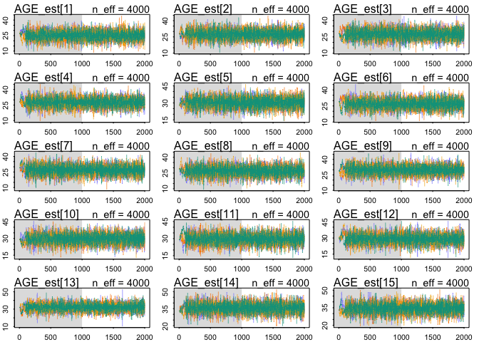
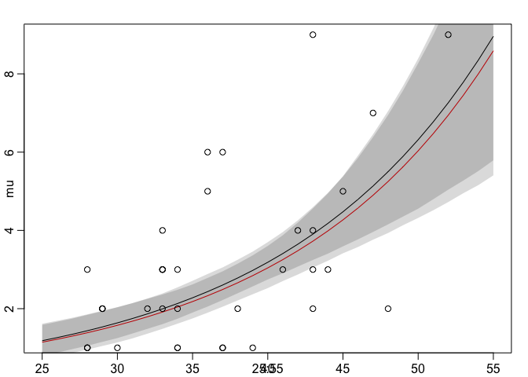
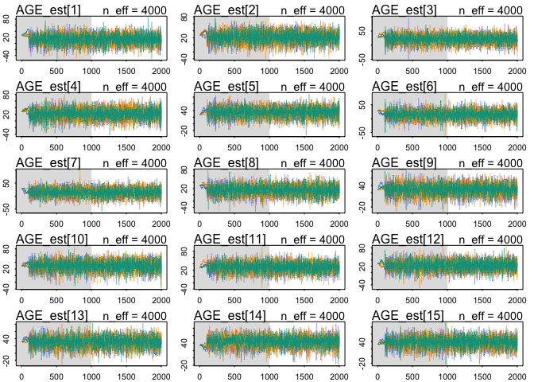
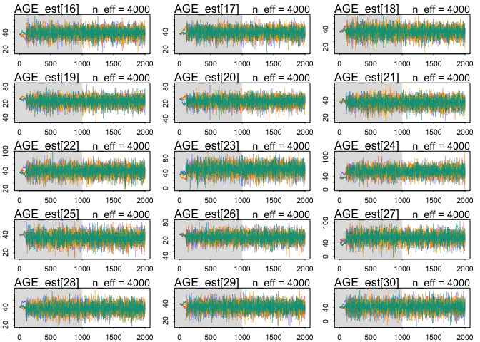
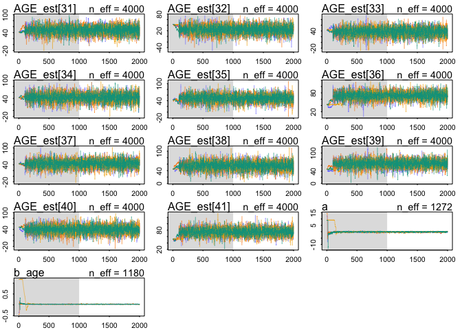
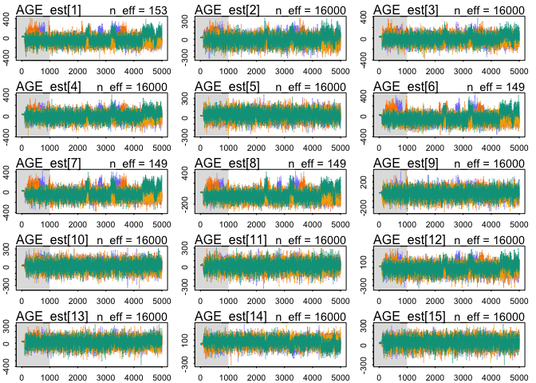
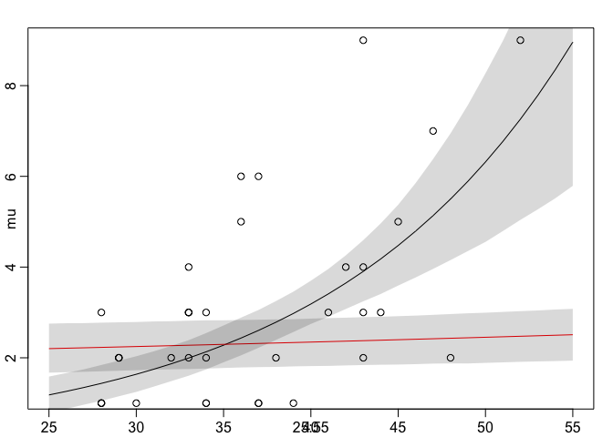

# Chapter 14 Problems
Julin N Maloof  
3/8/2017  


## 14E1

Specify a distribition that the observations come from (actually each observation has a separate set of parameters).  Have the linear model use the distribution as predictors rather than the observations themselves

T_i ~ Poission(mu_i)
log(mu_i) = a + B*logPi_est
logPi_obs ~ dnorm(logPi_est_i, logPi_sigma_i)
A ~ dnorm(0,10)
B ~ dnorm(0,10)

## 14E2

## 14M1

They all come from the same distribution, with mean v and sd sigma_n

## 14M2

_Repeat WAIC comparison on milk primate data models from chapter 6, but include missing data (via imputation).  Does this affect model performance?_

### Without imputation

Updated code to use map2stan 


```r
# Rcode 6.21
library(rethinking)
data(milk)
d <- milk[ complete.cases(milk) , ]
d$neocortex <- d$neocortex.perc / 100
d$logmass <- log(d$mass)
dim(d)
```

```
## [1] 17 10
```

```r
d_list <- list(
kcal = d$kcal,
neocortex = d$neocortex,
logmass = d$logmass )

# Rcode 6.22

m6.11 <- map2stan(
  alist(
    kcal ~ dnorm( mu , sigma) ,
    mu <- a,
    a ~ dnorm(0,100),
    sigma ~ dcauchy(0,1)),
  data=d_list , 
  chains = 4, cores = 1)
```

```
## In file included from file289c3eae60f5.cpp:8:
## In file included from /Library/Frameworks/R.framework/Versions/3.3/Resources/library/StanHeaders/include/src/stan/model/model_header.hpp:4:
## In file included from /Library/Frameworks/R.framework/Versions/3.3/Resources/library/StanHeaders/include/stan/math.hpp:4:
## In file included from /Library/Frameworks/R.framework/Versions/3.3/Resources/library/StanHeaders/include/stan/math/rev/mat.hpp:4:
## In file included from /Library/Frameworks/R.framework/Versions/3.3/Resources/library/StanHeaders/include/stan/math/rev/core.hpp:12:
## In file included from /Library/Frameworks/R.framework/Versions/3.3/Resources/library/StanHeaders/include/stan/math/rev/core/gevv_vvv_vari.hpp:5:
## In file included from /Library/Frameworks/R.framework/Versions/3.3/Resources/library/StanHeaders/include/stan/math/rev/core/var.hpp:7:
## In file included from /Library/Frameworks/R.framework/Versions/3.3/Resources/library/BH/include/boost/math/tools/config.hpp:13:
## In file included from /Library/Frameworks/R.framework/Versions/3.3/Resources/library/BH/include/boost/config.hpp:39:
## /Library/Frameworks/R.framework/Versions/3.3/Resources/library/BH/include/boost/config/compiler/clang.hpp:196:11: warning: 'BOOST_NO_CXX11_RVALUE_REFERENCES' macro redefined [-Wmacro-redefined]
## #  define BOOST_NO_CXX11_RVALUE_REFERENCES
##           ^
## <command line>:6:9: note: previous definition is here
## #define BOOST_NO_CXX11_RVALUE_REFERENCES 1
##         ^
## 1 warning generated.
## 
## SAMPLING FOR MODEL 'kcal ~ dnorm(mu, sigma)' NOW (CHAIN 1).
## 
## Chain 1, Iteration:    1 / 2000 [  0%]  (Warmup)
## Chain 1, Iteration:  200 / 2000 [ 10%]  (Warmup)
## Chain 1, Iteration:  400 / 2000 [ 20%]  (Warmup)
## Chain 1, Iteration:  600 / 2000 [ 30%]  (Warmup)
## Chain 1, Iteration:  800 / 2000 [ 40%]  (Warmup)
## Chain 1, Iteration: 1000 / 2000 [ 50%]  (Warmup)
## Chain 1, Iteration: 1001 / 2000 [ 50%]  (Sampling)
## Chain 1, Iteration: 1200 / 2000 [ 60%]  (Sampling)
## Chain 1, Iteration: 1400 / 2000 [ 70%]  (Sampling)
## Chain 1, Iteration: 1600 / 2000 [ 80%]  (Sampling)
## Chain 1, Iteration: 1800 / 2000 [ 90%]  (Sampling)
## Chain 1, Iteration: 2000 / 2000 [100%]  (Sampling)
##  Elapsed Time: 0.028083 seconds (Warm-up)
##                0.013848 seconds (Sampling)
##                0.041931 seconds (Total)
## 
## 
## SAMPLING FOR MODEL 'kcal ~ dnorm(mu, sigma)' NOW (CHAIN 2).
## 
## Chain 2, Iteration:    1 / 2000 [  0%]  (Warmup)
## Chain 2, Iteration:  200 / 2000 [ 10%]  (Warmup)
## Chain 2, Iteration:  400 / 2000 [ 20%]  (Warmup)
## Chain 2, Iteration:  600 / 2000 [ 30%]  (Warmup)
## Chain 2, Iteration:  800 / 2000 [ 40%]  (Warmup)
## Chain 2, Iteration: 1000 / 2000 [ 50%]  (Warmup)
## Chain 2, Iteration: 1001 / 2000 [ 50%]  (Sampling)
## Chain 2, Iteration: 1200 / 2000 [ 60%]  (Sampling)
## Chain 2, Iteration: 1400 / 2000 [ 70%]  (Sampling)
## Chain 2, Iteration: 1600 / 2000 [ 80%]  (Sampling)
## Chain 2, Iteration: 1800 / 2000 [ 90%]  (Sampling)
## Chain 2, Iteration: 2000 / 2000 [100%]  (Sampling)
##  Elapsed Time: 0.016065 seconds (Warm-up)
##                0.015001 seconds (Sampling)
##                0.031066 seconds (Total)
## 
## 
## SAMPLING FOR MODEL 'kcal ~ dnorm(mu, sigma)' NOW (CHAIN 3).
## 
## Chain 3, Iteration:    1 / 2000 [  0%]  (Warmup)
## Chain 3, Iteration:  200 / 2000 [ 10%]  (Warmup)
## Chain 3, Iteration:  400 / 2000 [ 20%]  (Warmup)
## Chain 3, Iteration:  600 / 2000 [ 30%]  (Warmup)
## Chain 3, Iteration:  800 / 2000 [ 40%]  (Warmup)
## Chain 3, Iteration: 1000 / 2000 [ 50%]  (Warmup)
## Chain 3, Iteration: 1001 / 2000 [ 50%]  (Sampling)
## Chain 3, Iteration: 1200 / 2000 [ 60%]  (Sampling)
## Chain 3, Iteration: 1400 / 2000 [ 70%]  (Sampling)
## Chain 3, Iteration: 1600 / 2000 [ 80%]  (Sampling)
## Chain 3, Iteration: 1800 / 2000 [ 90%]  (Sampling)
## Chain 3, Iteration: 2000 / 2000 [100%]  (Sampling)
##  Elapsed Time: 0.017809 seconds (Warm-up)
##                0.013016 seconds (Sampling)
##                0.030825 seconds (Total)
## 
## 
## SAMPLING FOR MODEL 'kcal ~ dnorm(mu, sigma)' NOW (CHAIN 4).
## 
## Chain 4, Iteration:    1 / 2000 [  0%]  (Warmup)
## Chain 4, Iteration:  200 / 2000 [ 10%]  (Warmup)
## Chain 4, Iteration:  400 / 2000 [ 20%]  (Warmup)
## Chain 4, Iteration:  600 / 2000 [ 30%]  (Warmup)
## Chain 4, Iteration:  800 / 2000 [ 40%]  (Warmup)
## Chain 4, Iteration: 1000 / 2000 [ 50%]  (Warmup)
## Chain 4, Iteration: 1001 / 2000 [ 50%]  (Sampling)
## Chain 4, Iteration: 1200 / 2000 [ 60%]  (Sampling)
## Chain 4, Iteration: 1400 / 2000 [ 70%]  (Sampling)
## Chain 4, Iteration: 1600 / 2000 [ 80%]  (Sampling)
## Chain 4, Iteration: 1800 / 2000 [ 90%]  (Sampling)
## Chain 4, Iteration: 2000 / 2000 [100%]  (Sampling)
##  Elapsed Time: 0.023267 seconds (Warm-up)
##                0.015378 seconds (Sampling)
##                0.038645 seconds (Total)
## 
## 
## SAMPLING FOR MODEL 'kcal ~ dnorm(mu, sigma)' NOW (CHAIN 1).
## WARNING: No variance estimation is
##          performed for num_warmup < 20
## 
## 
## Chain 1, Iteration: 1 / 1 [100%]  (Sampling)
##  Elapsed Time: 5e-06 seconds (Warm-up)
##                3.7e-05 seconds (Sampling)
##                4.2e-05 seconds (Total)
```

```
## Computing WAIC
```

```
## Constructing posterior predictions
```

```
## [ 400 / 4000 ]
[ 800 / 4000 ]
[ 1200 / 4000 ]
[ 1600 / 4000 ]
[ 2000 / 4000 ]
[ 2400 / 4000 ]
[ 2800 / 4000 ]
[ 3200 / 4000 ]
[ 3600 / 4000 ]
[ 4000 / 4000 ]
```

```r
m6.12 <- map2stan(
  alist(
    kcal ~ dnorm( mu , sigma ) ,
    mu <- a + bn*neocortex,
    a ~ dnorm(0,100),
    bn ~ dnorm(0,10),
    sigma ~ dcauchy(0,1)),
  data=d_list , 
  chains = 4, cores = 1)
```

```
## In file included from file289c6c939a74.cpp:8:
## In file included from /Library/Frameworks/R.framework/Versions/3.3/Resources/library/StanHeaders/include/src/stan/model/model_header.hpp:4:
## In file included from /Library/Frameworks/R.framework/Versions/3.3/Resources/library/StanHeaders/include/stan/math.hpp:4:
## In file included from /Library/Frameworks/R.framework/Versions/3.3/Resources/library/StanHeaders/include/stan/math/rev/mat.hpp:4:
## In file included from /Library/Frameworks/R.framework/Versions/3.3/Resources/library/StanHeaders/include/stan/math/rev/core.hpp:12:
## In file included from /Library/Frameworks/R.framework/Versions/3.3/Resources/library/StanHeaders/include/stan/math/rev/core/gevv_vvv_vari.hpp:5:
## In file included from /Library/Frameworks/R.framework/Versions/3.3/Resources/library/StanHeaders/include/stan/math/rev/core/var.hpp:7:
## In file included from /Library/Frameworks/R.framework/Versions/3.3/Resources/library/BH/include/boost/math/tools/config.hpp:13:
## In file included from /Library/Frameworks/R.framework/Versions/3.3/Resources/library/BH/include/boost/config.hpp:39:
## /Library/Frameworks/R.framework/Versions/3.3/Resources/library/BH/include/boost/config/compiler/clang.hpp:196:11: warning: 'BOOST_NO_CXX11_RVALUE_REFERENCES' macro redefined [-Wmacro-redefined]
## #  define BOOST_NO_CXX11_RVALUE_REFERENCES
##           ^
## <command line>:6:9: note: previous definition is here
## #define BOOST_NO_CXX11_RVALUE_REFERENCES 1
##         ^
## 1 warning generated.
## 
## SAMPLING FOR MODEL 'kcal ~ dnorm(mu, sigma)' NOW (CHAIN 1).
## 
## Chain 1, Iteration:    1 / 2000 [  0%]  (Warmup)
## Chain 1, Iteration:  200 / 2000 [ 10%]  (Warmup)
## Chain 1, Iteration:  400 / 2000 [ 20%]  (Warmup)
## Chain 1, Iteration:  600 / 2000 [ 30%]  (Warmup)
## Chain 1, Iteration:  800 / 2000 [ 40%]  (Warmup)
## Chain 1, Iteration: 1000 / 2000 [ 50%]  (Warmup)
## Chain 1, Iteration: 1001 / 2000 [ 50%]  (Sampling)
## Chain 1, Iteration: 1200 / 2000 [ 60%]  (Sampling)
## Chain 1, Iteration: 1400 / 2000 [ 70%]  (Sampling)
## Chain 1, Iteration: 1600 / 2000 [ 80%]  (Sampling)
## Chain 1, Iteration: 1800 / 2000 [ 90%]  (Sampling)
## Chain 1, Iteration: 2000 / 2000 [100%]  (Sampling)
##  Elapsed Time: 0.172361 seconds (Warm-up)
##                0.184133 seconds (Sampling)
##                0.356494 seconds (Total)
## 
## 
## SAMPLING FOR MODEL 'kcal ~ dnorm(mu, sigma)' NOW (CHAIN 2).
## 
## Chain 2, Iteration:    1 / 2000 [  0%]  (Warmup)
## Chain 2, Iteration:  200 / 2000 [ 10%]  (Warmup)
## Chain 2, Iteration:  400 / 2000 [ 20%]  (Warmup)
## Chain 2, Iteration:  600 / 2000 [ 30%]  (Warmup)
## Chain 2, Iteration:  800 / 2000 [ 40%]  (Warmup)
## Chain 2, Iteration: 1000 / 2000 [ 50%]  (Warmup)
## Chain 2, Iteration: 1001 / 2000 [ 50%]  (Sampling)
## Chain 2, Iteration: 1200 / 2000 [ 60%]  (Sampling)
## Chain 2, Iteration: 1400 / 2000 [ 70%]  (Sampling)
## Chain 2, Iteration: 1600 / 2000 [ 80%]  (Sampling)
## Chain 2, Iteration: 1800 / 2000 [ 90%]  (Sampling)
## Chain 2, Iteration: 2000 / 2000 [100%]  (Sampling)
##  Elapsed Time: 0.190695 seconds (Warm-up)
##                0.180002 seconds (Sampling)
##                0.370697 seconds (Total)
## 
## 
## SAMPLING FOR MODEL 'kcal ~ dnorm(mu, sigma)' NOW (CHAIN 3).
## 
## Chain 3, Iteration:    1 / 2000 [  0%]  (Warmup)
## Chain 3, Iteration:  200 / 2000 [ 10%]  (Warmup)
## Chain 3, Iteration:  400 / 2000 [ 20%]  (Warmup)
## Chain 3, Iteration:  600 / 2000 [ 30%]  (Warmup)
## Chain 3, Iteration:  800 / 2000 [ 40%]  (Warmup)
## Chain 3, Iteration: 1000 / 2000 [ 50%]  (Warmup)
## Chain 3, Iteration: 1001 / 2000 [ 50%]  (Sampling)
## Chain 3, Iteration: 1200 / 2000 [ 60%]  (Sampling)
## Chain 3, Iteration: 1400 / 2000 [ 70%]  (Sampling)
## Chain 3, Iteration: 1600 / 2000 [ 80%]  (Sampling)
## Chain 3, Iteration: 1800 / 2000 [ 90%]  (Sampling)
## Chain 3, Iteration: 2000 / 2000 [100%]  (Sampling)
##  Elapsed Time: 0.173188 seconds (Warm-up)
##                0.169641 seconds (Sampling)
##                0.342829 seconds (Total)
## 
## 
## SAMPLING FOR MODEL 'kcal ~ dnorm(mu, sigma)' NOW (CHAIN 4).
## 
## Chain 4, Iteration:    1 / 2000 [  0%]  (Warmup)
## Chain 4, Iteration:  200 / 2000 [ 10%]  (Warmup)
## Chain 4, Iteration:  400 / 2000 [ 20%]  (Warmup)
## Chain 4, Iteration:  600 / 2000 [ 30%]  (Warmup)
## Chain 4, Iteration:  800 / 2000 [ 40%]  (Warmup)
## Chain 4, Iteration: 1000 / 2000 [ 50%]  (Warmup)
## Chain 4, Iteration: 1001 / 2000 [ 50%]  (Sampling)
## Chain 4, Iteration: 1200 / 2000 [ 60%]  (Sampling)
## Chain 4, Iteration: 1400 / 2000 [ 70%]  (Sampling)
## Chain 4, Iteration: 1600 / 2000 [ 80%]  (Sampling)
## Chain 4, Iteration: 1800 / 2000 [ 90%]  (Sampling)
## Chain 4, Iteration: 2000 / 2000 [100%]  (Sampling)
##  Elapsed Time: 0.184361 seconds (Warm-up)
##                0.216013 seconds (Sampling)
##                0.400374 seconds (Total)
## 
## 
## SAMPLING FOR MODEL 'kcal ~ dnorm(mu, sigma)' NOW (CHAIN 1).
## WARNING: No variance estimation is
##          performed for num_warmup < 20
## 
## 
## Chain 1, Iteration: 1 / 1 [100%]  (Sampling)
##  Elapsed Time: 5e-06 seconds (Warm-up)
##                5.9e-05 seconds (Sampling)
##                6.4e-05 seconds (Total)
```

```
## Computing WAIC
## Constructing posterior predictions
```

```
## [ 400 / 4000 ]
[ 800 / 4000 ]
[ 1200 / 4000 ]
[ 1600 / 4000 ]
[ 2000 / 4000 ]
[ 2400 / 4000 ]
[ 2800 / 4000 ]
[ 3200 / 4000 ]
[ 3600 / 4000 ]
[ 4000 / 4000 ]
```

```r
m6.13 <- map2stan(
  alist(
    kcal ~ dnorm( mu , sigma ) ,
    mu <- a + bm*logmass,
    a ~ dnorm(0,100),
    bm ~ dnorm(0,10),
    sigma ~ dcauchy(0,1)),
  data=d_list , 
  chains = 4, cores = 1)
```

```
## In file included from file289c61da2c70.cpp:8:
## In file included from /Library/Frameworks/R.framework/Versions/3.3/Resources/library/StanHeaders/include/src/stan/model/model_header.hpp:4:
## In file included from /Library/Frameworks/R.framework/Versions/3.3/Resources/library/StanHeaders/include/stan/math.hpp:4:
## In file included from /Library/Frameworks/R.framework/Versions/3.3/Resources/library/StanHeaders/include/stan/math/rev/mat.hpp:4:
## In file included from /Library/Frameworks/R.framework/Versions/3.3/Resources/library/StanHeaders/include/stan/math/rev/core.hpp:12:
## In file included from /Library/Frameworks/R.framework/Versions/3.3/Resources/library/StanHeaders/include/stan/math/rev/core/gevv_vvv_vari.hpp:5:
## In file included from /Library/Frameworks/R.framework/Versions/3.3/Resources/library/StanHeaders/include/stan/math/rev/core/var.hpp:7:
## In file included from /Library/Frameworks/R.framework/Versions/3.3/Resources/library/BH/include/boost/math/tools/config.hpp:13:
## In file included from /Library/Frameworks/R.framework/Versions/3.3/Resources/library/BH/include/boost/config.hpp:39:
## /Library/Frameworks/R.framework/Versions/3.3/Resources/library/BH/include/boost/config/compiler/clang.hpp:196:11: warning: 'BOOST_NO_CXX11_RVALUE_REFERENCES' macro redefined [-Wmacro-redefined]
## #  define BOOST_NO_CXX11_RVALUE_REFERENCES
##           ^
## <command line>:6:9: note: previous definition is here
## #define BOOST_NO_CXX11_RVALUE_REFERENCES 1
##         ^
## 1 warning generated.
## 
## SAMPLING FOR MODEL 'kcal ~ dnorm(mu, sigma)' NOW (CHAIN 1).
## 
## Chain 1, Iteration:    1 / 2000 [  0%]  (Warmup)
## Chain 1, Iteration:  200 / 2000 [ 10%]  (Warmup)
## Chain 1, Iteration:  400 / 2000 [ 20%]  (Warmup)
## Chain 1, Iteration:  600 / 2000 [ 30%]  (Warmup)
## Chain 1, Iteration:  800 / 2000 [ 40%]  (Warmup)
## Chain 1, Iteration: 1000 / 2000 [ 50%]  (Warmup)
## Chain 1, Iteration: 1001 / 2000 [ 50%]  (Sampling)
## Chain 1, Iteration: 1200 / 2000 [ 60%]  (Sampling)
## Chain 1, Iteration: 1400 / 2000 [ 70%]  (Sampling)
## Chain 1, Iteration: 1600 / 2000 [ 80%]  (Sampling)
## Chain 1, Iteration: 1800 / 2000 [ 90%]  (Sampling)
## Chain 1, Iteration: 2000 / 2000 [100%]  (Sampling)
##  Elapsed Time: 0.027953 seconds (Warm-up)
##                0.024111 seconds (Sampling)
##                0.052064 seconds (Total)
## 
## 
## SAMPLING FOR MODEL 'kcal ~ dnorm(mu, sigma)' NOW (CHAIN 2).
## 
## Chain 2, Iteration:    1 / 2000 [  0%]  (Warmup)
## Chain 2, Iteration:  200 / 2000 [ 10%]  (Warmup)
## Chain 2, Iteration:  400 / 2000 [ 20%]  (Warmup)
## Chain 2, Iteration:  600 / 2000 [ 30%]  (Warmup)
## Chain 2, Iteration:  800 / 2000 [ 40%]  (Warmup)
## Chain 2, Iteration: 1000 / 2000 [ 50%]  (Warmup)
## Chain 2, Iteration: 1001 / 2000 [ 50%]  (Sampling)
## Chain 2, Iteration: 1200 / 2000 [ 60%]  (Sampling)
## Chain 2, Iteration: 1400 / 2000 [ 70%]  (Sampling)
## Chain 2, Iteration: 1600 / 2000 [ 80%]  (Sampling)
## Chain 2, Iteration: 1800 / 2000 [ 90%]  (Sampling)
## Chain 2, Iteration: 2000 / 2000 [100%]  (Sampling)
##  Elapsed Time: 0.031824 seconds (Warm-up)
##                0.025098 seconds (Sampling)
##                0.056922 seconds (Total)
## 
## 
## SAMPLING FOR MODEL 'kcal ~ dnorm(mu, sigma)' NOW (CHAIN 3).
## 
## Chain 3, Iteration:    1 / 2000 [  0%]  (Warmup)
## Chain 3, Iteration:  200 / 2000 [ 10%]  (Warmup)
## Chain 3, Iteration:  400 / 2000 [ 20%]  (Warmup)
## Chain 3, Iteration:  600 / 2000 [ 30%]  (Warmup)
## Chain 3, Iteration:  800 / 2000 [ 40%]  (Warmup)
## Chain 3, Iteration: 1000 / 2000 [ 50%]  (Warmup)
## Chain 3, Iteration: 1001 / 2000 [ 50%]  (Sampling)
## Chain 3, Iteration: 1200 / 2000 [ 60%]  (Sampling)
## Chain 3, Iteration: 1400 / 2000 [ 70%]  (Sampling)
## Chain 3, Iteration: 1600 / 2000 [ 80%]  (Sampling)
## Chain 3, Iteration: 1800 / 2000 [ 90%]  (Sampling)
## Chain 3, Iteration: 2000 / 2000 [100%]  (Sampling)
##  Elapsed Time: 0.033947 seconds (Warm-up)
##                0.025882 seconds (Sampling)
##                0.059829 seconds (Total)
## 
## 
## SAMPLING FOR MODEL 'kcal ~ dnorm(mu, sigma)' NOW (CHAIN 4).
## 
## Chain 4, Iteration:    1 / 2000 [  0%]  (Warmup)
## Chain 4, Iteration:  200 / 2000 [ 10%]  (Warmup)
## Chain 4, Iteration:  400 / 2000 [ 20%]  (Warmup)
## Chain 4, Iteration:  600 / 2000 [ 30%]  (Warmup)
## Chain 4, Iteration:  800 / 2000 [ 40%]  (Warmup)
## Chain 4, Iteration: 1000 / 2000 [ 50%]  (Warmup)
## Chain 4, Iteration: 1001 / 2000 [ 50%]  (Sampling)
## Chain 4, Iteration: 1200 / 2000 [ 60%]  (Sampling)
## Chain 4, Iteration: 1400 / 2000 [ 70%]  (Sampling)
## Chain 4, Iteration: 1600 / 2000 [ 80%]  (Sampling)
## Chain 4, Iteration: 1800 / 2000 [ 90%]  (Sampling)
## Chain 4, Iteration: 2000 / 2000 [100%]  (Sampling)
##  Elapsed Time: 0.033628 seconds (Warm-up)
##                0.027368 seconds (Sampling)
##                0.060996 seconds (Total)
## 
## 
## SAMPLING FOR MODEL 'kcal ~ dnorm(mu, sigma)' NOW (CHAIN 1).
## WARNING: No variance estimation is
##          performed for num_warmup < 20
## 
## 
## Chain 1, Iteration: 1 / 1 [100%]  (Sampling)
##  Elapsed Time: 3e-06 seconds (Warm-up)
##                2.2e-05 seconds (Sampling)
##                2.5e-05 seconds (Total)
```

```
## Computing WAIC
## Constructing posterior predictions
```

```
## [ 400 / 4000 ]
[ 800 / 4000 ]
[ 1200 / 4000 ]
[ 1600 / 4000 ]
[ 2000 / 4000 ]
[ 2400 / 4000 ]
[ 2800 / 4000 ]
[ 3200 / 4000 ]
[ 3600 / 4000 ]
[ 4000 / 4000 ]
```

```r
m6.14 <- map2stan(
  alist(
    kcal ~ dnorm( mu , sigma ) ,
    mu <- a + bn*neocortex + bm*logmass,
    a ~ dnorm(0,100),
    c(bn,bm) ~ dnorm(0,10),
    sigma ~ dcauchy(0,1)),
  data=d_list , 
  chains = 4, cores = 1)
```

```
## In file included from file289c3b0aaf7d.cpp:8:
## In file included from /Library/Frameworks/R.framework/Versions/3.3/Resources/library/StanHeaders/include/src/stan/model/model_header.hpp:4:
## In file included from /Library/Frameworks/R.framework/Versions/3.3/Resources/library/StanHeaders/include/stan/math.hpp:4:
## In file included from /Library/Frameworks/R.framework/Versions/3.3/Resources/library/StanHeaders/include/stan/math/rev/mat.hpp:4:
## In file included from /Library/Frameworks/R.framework/Versions/3.3/Resources/library/StanHeaders/include/stan/math/rev/core.hpp:12:
## In file included from /Library/Frameworks/R.framework/Versions/3.3/Resources/library/StanHeaders/include/stan/math/rev/core/gevv_vvv_vari.hpp:5:
## In file included from /Library/Frameworks/R.framework/Versions/3.3/Resources/library/StanHeaders/include/stan/math/rev/core/var.hpp:7:
## In file included from /Library/Frameworks/R.framework/Versions/3.3/Resources/library/BH/include/boost/math/tools/config.hpp:13:
## In file included from /Library/Frameworks/R.framework/Versions/3.3/Resources/library/BH/include/boost/config.hpp:39:
## /Library/Frameworks/R.framework/Versions/3.3/Resources/library/BH/include/boost/config/compiler/clang.hpp:196:11: warning: 'BOOST_NO_CXX11_RVALUE_REFERENCES' macro redefined [-Wmacro-redefined]
## #  define BOOST_NO_CXX11_RVALUE_REFERENCES
##           ^
## <command line>:6:9: note: previous definition is here
## #define BOOST_NO_CXX11_RVALUE_REFERENCES 1
##         ^
## 1 warning generated.
## 
## SAMPLING FOR MODEL 'kcal ~ dnorm(mu, sigma)' NOW (CHAIN 1).
## 
## Chain 1, Iteration:    1 / 2000 [  0%]  (Warmup)
## Chain 1, Iteration:  200 / 2000 [ 10%]  (Warmup)
## Chain 1, Iteration:  400 / 2000 [ 20%]  (Warmup)
## Chain 1, Iteration:  600 / 2000 [ 30%]  (Warmup)
## Chain 1, Iteration:  800 / 2000 [ 40%]  (Warmup)
## Chain 1, Iteration: 1000 / 2000 [ 50%]  (Warmup)
## Chain 1, Iteration: 1001 / 2000 [ 50%]  (Sampling)
## Chain 1, Iteration: 1200 / 2000 [ 60%]  (Sampling)
## Chain 1, Iteration: 1400 / 2000 [ 70%]  (Sampling)
## Chain 1, Iteration: 1600 / 2000 [ 80%]  (Sampling)
## Chain 1, Iteration: 1800 / 2000 [ 90%]  (Sampling)
## Chain 1, Iteration: 2000 / 2000 [100%]  (Sampling)
##  Elapsed Time: 0.215047 seconds (Warm-up)
##                0.26579 seconds (Sampling)
##                0.480837 seconds (Total)
## 
## 
## SAMPLING FOR MODEL 'kcal ~ dnorm(mu, sigma)' NOW (CHAIN 2).
## 
## Chain 2, Iteration:    1 / 2000 [  0%]  (Warmup)
## Chain 2, Iteration:  200 / 2000 [ 10%]  (Warmup)
## Chain 2, Iteration:  400 / 2000 [ 20%]  (Warmup)
## Chain 2, Iteration:  600 / 2000 [ 30%]  (Warmup)
## Chain 2, Iteration:  800 / 2000 [ 40%]  (Warmup)
## Chain 2, Iteration: 1000 / 2000 [ 50%]  (Warmup)
## Chain 2, Iteration: 1001 / 2000 [ 50%]  (Sampling)
## Chain 2, Iteration: 1200 / 2000 [ 60%]  (Sampling)
## Chain 2, Iteration: 1400 / 2000 [ 70%]  (Sampling)
## Chain 2, Iteration: 1600 / 2000 [ 80%]  (Sampling)
## Chain 2, Iteration: 1800 / 2000 [ 90%]  (Sampling)
## Chain 2, Iteration: 2000 / 2000 [100%]  (Sampling)
##  Elapsed Time: 0.257501 seconds (Warm-up)
##                0.24197 seconds (Sampling)
##                0.499471 seconds (Total)
## 
## 
## SAMPLING FOR MODEL 'kcal ~ dnorm(mu, sigma)' NOW (CHAIN 3).
## 
## Chain 3, Iteration:    1 / 2000 [  0%]  (Warmup)
## Chain 3, Iteration:  200 / 2000 [ 10%]  (Warmup)
## Chain 3, Iteration:  400 / 2000 [ 20%]  (Warmup)
## Chain 3, Iteration:  600 / 2000 [ 30%]  (Warmup)
## Chain 3, Iteration:  800 / 2000 [ 40%]  (Warmup)
## Chain 3, Iteration: 1000 / 2000 [ 50%]  (Warmup)
## Chain 3, Iteration: 1001 / 2000 [ 50%]  (Sampling)
## Chain 3, Iteration: 1200 / 2000 [ 60%]  (Sampling)
## Chain 3, Iteration: 1400 / 2000 [ 70%]  (Sampling)
## Chain 3, Iteration: 1600 / 2000 [ 80%]  (Sampling)
## Chain 3, Iteration: 1800 / 2000 [ 90%]  (Sampling)
## Chain 3, Iteration: 2000 / 2000 [100%]  (Sampling)
##  Elapsed Time: 0.225511 seconds (Warm-up)
##                0.299695 seconds (Sampling)
##                0.525206 seconds (Total)
## 
## 
## SAMPLING FOR MODEL 'kcal ~ dnorm(mu, sigma)' NOW (CHAIN 4).
## 
## Chain 4, Iteration:    1 / 2000 [  0%]  (Warmup)
## Chain 4, Iteration:  200 / 2000 [ 10%]  (Warmup)
## Chain 4, Iteration:  400 / 2000 [ 20%]  (Warmup)
## Chain 4, Iteration:  600 / 2000 [ 30%]  (Warmup)
## Chain 4, Iteration:  800 / 2000 [ 40%]  (Warmup)
## Chain 4, Iteration: 1000 / 2000 [ 50%]  (Warmup)
## Chain 4, Iteration: 1001 / 2000 [ 50%]  (Sampling)
## Chain 4, Iteration: 1200 / 2000 [ 60%]  (Sampling)
## Chain 4, Iteration: 1400 / 2000 [ 70%]  (Sampling)
## Chain 4, Iteration: 1600 / 2000 [ 80%]  (Sampling)
## Chain 4, Iteration: 1800 / 2000 [ 90%]  (Sampling)
## Chain 4, Iteration: 2000 / 2000 [100%]  (Sampling)
##  Elapsed Time: 0.233965 seconds (Warm-up)
##                0.233112 seconds (Sampling)
##                0.467077 seconds (Total)
```

```
## Warning: There were 1 divergent transitions after warmup. Increasing adapt_delta above 0.8 may help. See
## http://mc-stan.org/misc/warnings.html#divergent-transitions-after-warmup
```

```
## Warning: Examine the pairs() plot to diagnose sampling problems
```

```
## 
## SAMPLING FOR MODEL 'kcal ~ dnorm(mu, sigma)' NOW (CHAIN 1).
## WARNING: No variance estimation is
##          performed for num_warmup < 20
## 
## 
## Chain 1, Iteration: 1 / 1 [100%]  (Sampling)
##  Elapsed Time: 4e-06 seconds (Warm-up)
##                2.8e-05 seconds (Sampling)
##                3.2e-05 seconds (Total)
```

```
## Computing WAIC
## Constructing posterior predictions
```

```
## [ 400 / 4000 ]
[ 800 / 4000 ]
[ 1200 / 4000 ]
[ 1600 / 4000 ]
[ 2000 / 4000 ]
[ 2400 / 4000 ]
[ 2800 / 4000 ]
[ 3200 / 4000 ]
[ 3600 / 4000 ]
[ 4000 / 4000 ]
```

```
## Warning in map2stan(alist(kcal ~ dnorm(mu, sigma), mu <- a + bn * neocortex + : There were 1 divergent iterations during sampling.
## Check the chains (trace plots, n_eff, Rhat) carefully to ensure they are valid.
```

```r
#Rcode 6.24
( milk.models <- compare( m6.11 , m6.12 , m6.13 , m6.14 ) )
```

```
##        WAIC pWAIC dWAIC weight   SE  dSE
## m6.14 -16.6   3.2   0.0   0.95 5.03   NA
## m6.13  -9.0   2.0   7.6   0.02 4.07 3.50
## m6.11  -8.8   1.3   7.8   0.02 3.63 4.94
## m6.12  -7.2   2.0   9.4   0.01 3.20 5.05
```

```r
save.image("chapter14.Rdata")
```

### Now with missing data imputation


```r
library(rethinking)
load("chapter14.Rdata")
# Rcode 6.21
d.all <- milk
d.all$neocortex <- d.all$neocortex.perc / 100
d.all$logmass <- log(d.all$mass)
dim(d.all)
```

```
## [1] 29 10
```

```r
d.all_list <- list(
kcal = d.all$kcal,
neocortex = d.all$neocortex,
logmass = d.all$logmass )

# Rcode 6.22

m6.11.all <- map2stan(
  alist(
    kcal ~ dnorm( mu , sigma) ,
    mu <- a,
    a ~ dnorm(0,100),
    sigma ~ dcauchy(0,1)),
  data=d.all_list , 
  chains = 4, cores = 1)
```

```
## In file included from file2c1620e62c38.cpp:8:
## In file included from /Library/Frameworks/R.framework/Versions/3.3/Resources/library/StanHeaders/include/src/stan/model/model_header.hpp:4:
## In file included from /Library/Frameworks/R.framework/Versions/3.3/Resources/library/StanHeaders/include/stan/math.hpp:4:
## In file included from /Library/Frameworks/R.framework/Versions/3.3/Resources/library/StanHeaders/include/stan/math/rev/mat.hpp:4:
## In file included from /Library/Frameworks/R.framework/Versions/3.3/Resources/library/StanHeaders/include/stan/math/rev/core.hpp:12:
## In file included from /Library/Frameworks/R.framework/Versions/3.3/Resources/library/StanHeaders/include/stan/math/rev/core/gevv_vvv_vari.hpp:5:
## In file included from /Library/Frameworks/R.framework/Versions/3.3/Resources/library/StanHeaders/include/stan/math/rev/core/var.hpp:7:
## In file included from /Library/Frameworks/R.framework/Versions/3.3/Resources/library/BH/include/boost/math/tools/config.hpp:13:
## In file included from /Library/Frameworks/R.framework/Versions/3.3/Resources/library/BH/include/boost/config.hpp:39:
## /Library/Frameworks/R.framework/Versions/3.3/Resources/library/BH/include/boost/config/compiler/clang.hpp:196:11: warning: 'BOOST_NO_CXX11_RVALUE_REFERENCES' macro redefined [-Wmacro-redefined]
## #  define BOOST_NO_CXX11_RVALUE_REFERENCES
##           ^
## <command line>:6:9: note: previous definition is here
## #define BOOST_NO_CXX11_RVALUE_REFERENCES 1
##         ^
## 1 warning generated.
## 
## SAMPLING FOR MODEL 'kcal ~ dnorm(mu, sigma)' NOW (CHAIN 1).
## 
## Chain 1, Iteration:    1 / 2000 [  0%]  (Warmup)
## Chain 1, Iteration:  200 / 2000 [ 10%]  (Warmup)
## Chain 1, Iteration:  400 / 2000 [ 20%]  (Warmup)
## Chain 1, Iteration:  600 / 2000 [ 30%]  (Warmup)
## Chain 1, Iteration:  800 / 2000 [ 40%]  (Warmup)
## Chain 1, Iteration: 1000 / 2000 [ 50%]  (Warmup)
## Chain 1, Iteration: 1001 / 2000 [ 50%]  (Sampling)
## Chain 1, Iteration: 1200 / 2000 [ 60%]  (Sampling)
## Chain 1, Iteration: 1400 / 2000 [ 70%]  (Sampling)
## Chain 1, Iteration: 1600 / 2000 [ 80%]  (Sampling)
## Chain 1, Iteration: 1800 / 2000 [ 90%]  (Sampling)
## Chain 1, Iteration: 2000 / 2000 [100%]  (Sampling)
##  Elapsed Time: 0.017498 seconds (Warm-up)
##                0.014347 seconds (Sampling)
##                0.031845 seconds (Total)
## 
## 
## SAMPLING FOR MODEL 'kcal ~ dnorm(mu, sigma)' NOW (CHAIN 2).
## 
## Chain 2, Iteration:    1 / 2000 [  0%]  (Warmup)
## Chain 2, Iteration:  200 / 2000 [ 10%]  (Warmup)
## Chain 2, Iteration:  400 / 2000 [ 20%]  (Warmup)
## Chain 2, Iteration:  600 / 2000 [ 30%]  (Warmup)
## Chain 2, Iteration:  800 / 2000 [ 40%]  (Warmup)
## Chain 2, Iteration: 1000 / 2000 [ 50%]  (Warmup)
## Chain 2, Iteration: 1001 / 2000 [ 50%]  (Sampling)
## Chain 2, Iteration: 1200 / 2000 [ 60%]  (Sampling)
## Chain 2, Iteration: 1400 / 2000 [ 70%]  (Sampling)
## Chain 2, Iteration: 1600 / 2000 [ 80%]  (Sampling)
## Chain 2, Iteration: 1800 / 2000 [ 90%]  (Sampling)
## Chain 2, Iteration: 2000 / 2000 [100%]  (Sampling)
##  Elapsed Time: 0.017641 seconds (Warm-up)
##                0.015737 seconds (Sampling)
##                0.033378 seconds (Total)
## 
## 
## SAMPLING FOR MODEL 'kcal ~ dnorm(mu, sigma)' NOW (CHAIN 3).
## 
## Chain 3, Iteration:    1 / 2000 [  0%]  (Warmup)
## Chain 3, Iteration:  200 / 2000 [ 10%]  (Warmup)
## Chain 3, Iteration:  400 / 2000 [ 20%]  (Warmup)
## Chain 3, Iteration:  600 / 2000 [ 30%]  (Warmup)
## Chain 3, Iteration:  800 / 2000 [ 40%]  (Warmup)
## Chain 3, Iteration: 1000 / 2000 [ 50%]  (Warmup)
## Chain 3, Iteration: 1001 / 2000 [ 50%]  (Sampling)
## Chain 3, Iteration: 1200 / 2000 [ 60%]  (Sampling)
## Chain 3, Iteration: 1400 / 2000 [ 70%]  (Sampling)
## Chain 3, Iteration: 1600 / 2000 [ 80%]  (Sampling)
## Chain 3, Iteration: 1800 / 2000 [ 90%]  (Sampling)
## Chain 3, Iteration: 2000 / 2000 [100%]  (Sampling)
##  Elapsed Time: 0.019067 seconds (Warm-up)
##                0.015688 seconds (Sampling)
##                0.034755 seconds (Total)
## 
## 
## SAMPLING FOR MODEL 'kcal ~ dnorm(mu, sigma)' NOW (CHAIN 4).
## 
## Chain 4, Iteration:    1 / 2000 [  0%]  (Warmup)
## Chain 4, Iteration:  200 / 2000 [ 10%]  (Warmup)
## Chain 4, Iteration:  400 / 2000 [ 20%]  (Warmup)
## Chain 4, Iteration:  600 / 2000 [ 30%]  (Warmup)
## Chain 4, Iteration:  800 / 2000 [ 40%]  (Warmup)
## Chain 4, Iteration: 1000 / 2000 [ 50%]  (Warmup)
## Chain 4, Iteration: 1001 / 2000 [ 50%]  (Sampling)
## Chain 4, Iteration: 1200 / 2000 [ 60%]  (Sampling)
## Chain 4, Iteration: 1400 / 2000 [ 70%]  (Sampling)
## Chain 4, Iteration: 1600 / 2000 [ 80%]  (Sampling)
## Chain 4, Iteration: 1800 / 2000 [ 90%]  (Sampling)
## Chain 4, Iteration: 2000 / 2000 [100%]  (Sampling)
##  Elapsed Time: 0.024141 seconds (Warm-up)
##                0.013771 seconds (Sampling)
##                0.037912 seconds (Total)
## 
## 
## SAMPLING FOR MODEL 'kcal ~ dnorm(mu, sigma)' NOW (CHAIN 1).
## WARNING: No variance estimation is
##          performed for num_warmup < 20
## 
## 
## Chain 1, Iteration: 1 / 1 [100%]  (Sampling)
##  Elapsed Time: 2e-06 seconds (Warm-up)
##                2.2e-05 seconds (Sampling)
##                2.4e-05 seconds (Total)
```

```
## Computing WAIC
```

```
## Constructing posterior predictions
```

```
## [ 400 / 4000 ]
[ 800 / 4000 ]
[ 1200 / 4000 ]
[ 1600 / 4000 ]
[ 2000 / 4000 ]
[ 2400 / 4000 ]
[ 2800 / 4000 ]
[ 3200 / 4000 ]
[ 3600 / 4000 ]
[ 4000 / 4000 ]
```

```r
m6.12.all <- map2stan(
  alist(
    kcal ~ dnorm( mu , sigma ) ,
    mu <- a + bn*neocortex,
    a ~ dnorm(0,100),
    bn ~ dnorm(0,10),
    neocortex ~ dnorm(nu,sigma_nu),
    nu ~ dnorm(0.5,1),
    sigma_nu ~ dcauchy(0,1),
    sigma ~ dcauchy(0,1)),
  data=d.all_list , 
  chains = 4, cores = 1)
```

```
## Imputing 12 missing values (NA) in variable 'neocortex'.
```

```
## In file included from file2c163ddd017b.cpp:8:
## In file included from /Library/Frameworks/R.framework/Versions/3.3/Resources/library/StanHeaders/include/src/stan/model/model_header.hpp:4:
## In file included from /Library/Frameworks/R.framework/Versions/3.3/Resources/library/StanHeaders/include/stan/math.hpp:4:
## In file included from /Library/Frameworks/R.framework/Versions/3.3/Resources/library/StanHeaders/include/stan/math/rev/mat.hpp:4:
## In file included from /Library/Frameworks/R.framework/Versions/3.3/Resources/library/StanHeaders/include/stan/math/rev/core.hpp:12:
## In file included from /Library/Frameworks/R.framework/Versions/3.3/Resources/library/StanHeaders/include/stan/math/rev/core/gevv_vvv_vari.hpp:5:
## In file included from /Library/Frameworks/R.framework/Versions/3.3/Resources/library/StanHeaders/include/stan/math/rev/core/var.hpp:7:
## In file included from /Library/Frameworks/R.framework/Versions/3.3/Resources/library/BH/include/boost/math/tools/config.hpp:13:
## In file included from /Library/Frameworks/R.framework/Versions/3.3/Resources/library/BH/include/boost/config.hpp:39:
## /Library/Frameworks/R.framework/Versions/3.3/Resources/library/BH/include/boost/config/compiler/clang.hpp:196:11: warning: 'BOOST_NO_CXX11_RVALUE_REFERENCES' macro redefined [-Wmacro-redefined]
## #  define BOOST_NO_CXX11_RVALUE_REFERENCES
##           ^
## <command line>:6:9: note: previous definition is here
## #define BOOST_NO_CXX11_RVALUE_REFERENCES 1
##         ^
## 1 warning generated.
## 
## SAMPLING FOR MODEL 'kcal ~ dnorm(mu, sigma)' NOW (CHAIN 1).
## 
## Chain 1, Iteration:    1 / 2000 [  0%]  (Warmup)
## Chain 1, Iteration:  200 / 2000 [ 10%]  (Warmup)
## Chain 1, Iteration:  400 / 2000 [ 20%]  (Warmup)
## Chain 1, Iteration:  600 / 2000 [ 30%]  (Warmup)
## Chain 1, Iteration:  800 / 2000 [ 40%]  (Warmup)
## Chain 1, Iteration: 1000 / 2000 [ 50%]  (Warmup)
## Chain 1, Iteration: 1001 / 2000 [ 50%]  (Sampling)
## Chain 1, Iteration: 1200 / 2000 [ 60%]  (Sampling)
## Chain 1, Iteration: 1400 / 2000 [ 70%]  (Sampling)
## Chain 1, Iteration: 1600 / 2000 [ 80%]  (Sampling)
## Chain 1, Iteration: 1800 / 2000 [ 90%]  (Sampling)
## Chain 1, Iteration: 2000 / 2000 [100%]  (Sampling)
##  Elapsed Time: 1.27093 seconds (Warm-up)
##                0.387292 seconds (Sampling)
##                1.65822 seconds (Total)
```

```
## The following numerical problems occured the indicated number of times on chain 1
```

```
##                                                                                 count
## Exception thrown at line 26: normal_log: Scale parameter is 0, but must be > 0!     2
```

```
## When a numerical problem occurs, the Hamiltonian proposal gets rejected.
```

```
## See http://mc-stan.org/misc/warnings.html#exception-hamiltonian-proposal-rejected
```

```
## If the number in the 'count' column is small, do not ask about this message on stan-users.
```

```
## 
## SAMPLING FOR MODEL 'kcal ~ dnorm(mu, sigma)' NOW (CHAIN 2).
## 
## Chain 2, Iteration:    1 / 2000 [  0%]  (Warmup)
## Chain 2, Iteration:  200 / 2000 [ 10%]  (Warmup)
## Chain 2, Iteration:  400 / 2000 [ 20%]  (Warmup)
## Chain 2, Iteration:  600 / 2000 [ 30%]  (Warmup)
## Chain 2, Iteration:  800 / 2000 [ 40%]  (Warmup)
## Chain 2, Iteration: 1000 / 2000 [ 50%]  (Warmup)
## Chain 2, Iteration: 1001 / 2000 [ 50%]  (Sampling)
## Chain 2, Iteration: 1200 / 2000 [ 60%]  (Sampling)
## Chain 2, Iteration: 1400 / 2000 [ 70%]  (Sampling)
## Chain 2, Iteration: 1600 / 2000 [ 80%]  (Sampling)
## Chain 2, Iteration: 1800 / 2000 [ 90%]  (Sampling)
## Chain 2, Iteration: 2000 / 2000 [100%]  (Sampling)
##  Elapsed Time: 0.593169 seconds (Warm-up)
##                0.352277 seconds (Sampling)
##                0.945446 seconds (Total)
```

```
## The following numerical problems occured the indicated number of times on chain 2
```

```
##                                                                                 count
## Exception thrown at line 26: normal_log: Scale parameter is 0, but must be > 0!     2
```

```
## When a numerical problem occurs, the Hamiltonian proposal gets rejected.
```

```
## See http://mc-stan.org/misc/warnings.html#exception-hamiltonian-proposal-rejected
```

```
## If the number in the 'count' column is small, do not ask about this message on stan-users.
```

```
## 
## SAMPLING FOR MODEL 'kcal ~ dnorm(mu, sigma)' NOW (CHAIN 3).
## 
## Chain 3, Iteration:    1 / 2000 [  0%]  (Warmup)
## Chain 3, Iteration:  200 / 2000 [ 10%]  (Warmup)
## Chain 3, Iteration:  400 / 2000 [ 20%]  (Warmup)
## Chain 3, Iteration:  600 / 2000 [ 30%]  (Warmup)
## Chain 3, Iteration:  800 / 2000 [ 40%]  (Warmup)
## Chain 3, Iteration: 1000 / 2000 [ 50%]  (Warmup)
## Chain 3, Iteration: 1001 / 2000 [ 50%]  (Sampling)
## Chain 3, Iteration: 1200 / 2000 [ 60%]  (Sampling)
## Chain 3, Iteration: 1400 / 2000 [ 70%]  (Sampling)
## Chain 3, Iteration: 1600 / 2000 [ 80%]  (Sampling)
## Chain 3, Iteration: 1800 / 2000 [ 90%]  (Sampling)
## Chain 3, Iteration: 2000 / 2000 [100%]  (Sampling)
##  Elapsed Time: 0.437522 seconds (Warm-up)
##                0.419161 seconds (Sampling)
##                0.856683 seconds (Total)
## 
## 
## SAMPLING FOR MODEL 'kcal ~ dnorm(mu, sigma)' NOW (CHAIN 4).
## 
## Chain 4, Iteration:    1 / 2000 [  0%]  (Warmup)
## Chain 4, Iteration:  200 / 2000 [ 10%]  (Warmup)
## Chain 4, Iteration:  400 / 2000 [ 20%]  (Warmup)
## Chain 4, Iteration:  600 / 2000 [ 30%]  (Warmup)
## Chain 4, Iteration:  800 / 2000 [ 40%]  (Warmup)
## Chain 4, Iteration: 1000 / 2000 [ 50%]  (Warmup)
## Chain 4, Iteration: 1001 / 2000 [ 50%]  (Sampling)
## Chain 4, Iteration: 1200 / 2000 [ 60%]  (Sampling)
## Chain 4, Iteration: 1400 / 2000 [ 70%]  (Sampling)
## Chain 4, Iteration: 1600 / 2000 [ 80%]  (Sampling)
## Chain 4, Iteration: 1800 / 2000 [ 90%]  (Sampling)
## Chain 4, Iteration: 2000 / 2000 [100%]  (Sampling)
##  Elapsed Time: 0.37371 seconds (Warm-up)
##                0.363724 seconds (Sampling)
##                0.737434 seconds (Total)
```

```
## The following numerical problems occured the indicated number of times on chain 4
```

```
##                                                                                 count
## Exception thrown at line 26: normal_log: Scale parameter is 0, but must be > 0!     2
```

```
## When a numerical problem occurs, the Hamiltonian proposal gets rejected.
```

```
## See http://mc-stan.org/misc/warnings.html#exception-hamiltonian-proposal-rejected
```

```
## If the number in the 'count' column is small, do not ask about this message on stan-users.
```

```
## 
## SAMPLING FOR MODEL 'kcal ~ dnorm(mu, sigma)' NOW (CHAIN 1).
## WARNING: No variance estimation is
##          performed for num_warmup < 20
## 
## 
## Chain 1, Iteration: 1 / 1 [100%]  (Sampling)
##  Elapsed Time: 3e-06 seconds (Warm-up)
##                3.5e-05 seconds (Sampling)
##                3.8e-05 seconds (Total)
```

```
## Computing WAIC
```

```
## Constructing posterior predictions
```

```
## [ 400 / 4000 ]
[ 800 / 4000 ]
[ 1200 / 4000 ]
[ 1600 / 4000 ]
[ 2000 / 4000 ]
[ 2400 / 4000 ]
[ 2800 / 4000 ]
[ 3200 / 4000 ]
[ 3600 / 4000 ]
[ 4000 / 4000 ]
```

```r
save.image("chapter14.Rdata")

m6.13.all <- map2stan(
  alist(
    kcal ~ dnorm( mu , sigma ) ,
    mu <- a + bm*logmass,
    a ~ dnorm(0,100),
    bm ~ dnorm(0,10),
    neocortex ~ dnorm(nu,sigma_nu),
    nu ~ dnorm(0.5,1),
    sigma_nu ~ dcauchy(0,1),
    sigma ~ dcauchy(0,1)),
  data=d.all_list , 
  chains = 4, cores = 1)
```

```
## Imputing 12 missing values (NA) in variable 'neocortex'.
```

```
## In file included from file2c1627e3fd98.cpp:8:
## In file included from /Library/Frameworks/R.framework/Versions/3.3/Resources/library/StanHeaders/include/src/stan/model/model_header.hpp:4:
## In file included from /Library/Frameworks/R.framework/Versions/3.3/Resources/library/StanHeaders/include/stan/math.hpp:4:
## In file included from /Library/Frameworks/R.framework/Versions/3.3/Resources/library/StanHeaders/include/stan/math/rev/mat.hpp:4:
## In file included from /Library/Frameworks/R.framework/Versions/3.3/Resources/library/StanHeaders/include/stan/math/rev/core.hpp:12:
## In file included from /Library/Frameworks/R.framework/Versions/3.3/Resources/library/StanHeaders/include/stan/math/rev/core/gevv_vvv_vari.hpp:5:
## In file included from /Library/Frameworks/R.framework/Versions/3.3/Resources/library/StanHeaders/include/stan/math/rev/core/var.hpp:7:
## In file included from /Library/Frameworks/R.framework/Versions/3.3/Resources/library/BH/include/boost/math/tools/config.hpp:13:
## In file included from /Library/Frameworks/R.framework/Versions/3.3/Resources/library/BH/include/boost/config.hpp:39:
## /Library/Frameworks/R.framework/Versions/3.3/Resources/library/BH/include/boost/config/compiler/clang.hpp:196:11: warning: 'BOOST_NO_CXX11_RVALUE_REFERENCES' macro redefined [-Wmacro-redefined]
## #  define BOOST_NO_CXX11_RVALUE_REFERENCES
##           ^
## <command line>:6:9: note: previous definition is here
## #define BOOST_NO_CXX11_RVALUE_REFERENCES 1
##         ^
## 1 warning generated.
## 
## SAMPLING FOR MODEL 'kcal ~ dnorm(mu, sigma)' NOW (CHAIN 1).
## 
## Chain 1, Iteration:    1 / 2000 [  0%]  (Warmup)
## Chain 1, Iteration:  200 / 2000 [ 10%]  (Warmup)
## Chain 1, Iteration:  400 / 2000 [ 20%]  (Warmup)
## Chain 1, Iteration:  600 / 2000 [ 30%]  (Warmup)
## Chain 1, Iteration:  800 / 2000 [ 40%]  (Warmup)
## Chain 1, Iteration: 1000 / 2000 [ 50%]  (Warmup)
## Chain 1, Iteration: 1001 / 2000 [ 50%]  (Sampling)
## Chain 1, Iteration: 1200 / 2000 [ 60%]  (Sampling)
## Chain 1, Iteration: 1400 / 2000 [ 70%]  (Sampling)
## Chain 1, Iteration: 1600 / 2000 [ 80%]  (Sampling)
## Chain 1, Iteration: 1800 / 2000 [ 90%]  (Sampling)
## Chain 1, Iteration: 2000 / 2000 [100%]  (Sampling)
##  Elapsed Time: 0.097318 seconds (Warm-up)
##                0.059068 seconds (Sampling)
##                0.156386 seconds (Total)
```

```
## The following numerical problems occured the indicated number of times on chain 1
```

```
##                                                                                 count
## Exception thrown at line 27: normal_log: Scale parameter is 0, but must be > 0!     2
```

```
## When a numerical problem occurs, the Hamiltonian proposal gets rejected.
```

```
## See http://mc-stan.org/misc/warnings.html#exception-hamiltonian-proposal-rejected
```

```
## If the number in the 'count' column is small, do not ask about this message on stan-users.
```

```
## 
## SAMPLING FOR MODEL 'kcal ~ dnorm(mu, sigma)' NOW (CHAIN 2).
## 
## Chain 2, Iteration:    1 / 2000 [  0%]  (Warmup)
## Chain 2, Iteration:  200 / 2000 [ 10%]  (Warmup)
## Chain 2, Iteration:  400 / 2000 [ 20%]  (Warmup)
## Chain 2, Iteration:  600 / 2000 [ 30%]  (Warmup)
## Chain 2, Iteration:  800 / 2000 [ 40%]  (Warmup)
## Chain 2, Iteration: 1000 / 2000 [ 50%]  (Warmup)
## Chain 2, Iteration: 1001 / 2000 [ 50%]  (Sampling)
## Chain 2, Iteration: 1200 / 2000 [ 60%]  (Sampling)
## Chain 2, Iteration: 1400 / 2000 [ 70%]  (Sampling)
## Chain 2, Iteration: 1600 / 2000 [ 80%]  (Sampling)
## Chain 2, Iteration: 1800 / 2000 [ 90%]  (Sampling)
## Chain 2, Iteration: 2000 / 2000 [100%]  (Sampling)
##  Elapsed Time: 0.096288 seconds (Warm-up)
##                0.064916 seconds (Sampling)
##                0.161204 seconds (Total)
## 
## 
## SAMPLING FOR MODEL 'kcal ~ dnorm(mu, sigma)' NOW (CHAIN 3).
## 
## Chain 3, Iteration:    1 / 2000 [  0%]  (Warmup)
## Chain 3, Iteration:  200 / 2000 [ 10%]  (Warmup)
## Chain 3, Iteration:  400 / 2000 [ 20%]  (Warmup)
## Chain 3, Iteration:  600 / 2000 [ 30%]  (Warmup)
## Chain 3, Iteration:  800 / 2000 [ 40%]  (Warmup)
## Chain 3, Iteration: 1000 / 2000 [ 50%]  (Warmup)
## Chain 3, Iteration: 1001 / 2000 [ 50%]  (Sampling)
## Chain 3, Iteration: 1200 / 2000 [ 60%]  (Sampling)
## Chain 3, Iteration: 1400 / 2000 [ 70%]  (Sampling)
## Chain 3, Iteration: 1600 / 2000 [ 80%]  (Sampling)
## Chain 3, Iteration: 1800 / 2000 [ 90%]  (Sampling)
## Chain 3, Iteration: 2000 / 2000 [100%]  (Sampling)
##  Elapsed Time: 0.75524 seconds (Warm-up)
##                0.057478 seconds (Sampling)
##                0.812718 seconds (Total)
```

```
## The following numerical problems occured the indicated number of times on chain 3
```

```
##                                                                                 count
## Exception thrown at line 27: normal_log: Scale parameter is 0, but must be > 0!     2
```

```
## When a numerical problem occurs, the Hamiltonian proposal gets rejected.
```

```
## See http://mc-stan.org/misc/warnings.html#exception-hamiltonian-proposal-rejected
```

```
## If the number in the 'count' column is small, do not ask about this message on stan-users.
```

```
## 
## SAMPLING FOR MODEL 'kcal ~ dnorm(mu, sigma)' NOW (CHAIN 4).
## 
## Chain 4, Iteration:    1 / 2000 [  0%]  (Warmup)
## Chain 4, Iteration:  200 / 2000 [ 10%]  (Warmup)
## Chain 4, Iteration:  400 / 2000 [ 20%]  (Warmup)
## Chain 4, Iteration:  600 / 2000 [ 30%]  (Warmup)
## Chain 4, Iteration:  800 / 2000 [ 40%]  (Warmup)
## Chain 4, Iteration: 1000 / 2000 [ 50%]  (Warmup)
## Chain 4, Iteration: 1001 / 2000 [ 50%]  (Sampling)
## Chain 4, Iteration: 1200 / 2000 [ 60%]  (Sampling)
## Chain 4, Iteration: 1400 / 2000 [ 70%]  (Sampling)
## Chain 4, Iteration: 1600 / 2000 [ 80%]  (Sampling)
## Chain 4, Iteration: 1800 / 2000 [ 90%]  (Sampling)
## Chain 4, Iteration: 2000 / 2000 [100%]  (Sampling)
##  Elapsed Time: 0.610381 seconds (Warm-up)
##                0.060765 seconds (Sampling)
##                0.671146 seconds (Total)
```

```
## The following numerical problems occured the indicated number of times on chain 4
```

```
##                                                                                 count
## Exception thrown at line 27: normal_log: Scale parameter is 0, but must be > 0!     2
```

```
## When a numerical problem occurs, the Hamiltonian proposal gets rejected.
```

```
## See http://mc-stan.org/misc/warnings.html#exception-hamiltonian-proposal-rejected
```

```
## If the number in the 'count' column is small, do not ask about this message on stan-users.
```

```
## 
## SAMPLING FOR MODEL 'kcal ~ dnorm(mu, sigma)' NOW (CHAIN 1).
## WARNING: No variance estimation is
##          performed for num_warmup < 20
## 
## 
## Chain 1, Iteration: 1 / 1 [100%]  (Sampling)
##  Elapsed Time: 3e-06 seconds (Warm-up)
##                3.5e-05 seconds (Sampling)
##                3.8e-05 seconds (Total)
```

```
## Computing WAIC
```

```
## Constructing posterior predictions
```

```
## [ 400 / 4000 ]
[ 800 / 4000 ]
[ 1200 / 4000 ]
[ 1600 / 4000 ]
[ 2000 / 4000 ]
[ 2400 / 4000 ]
[ 2800 / 4000 ]
[ 3200 / 4000 ]
[ 3600 / 4000 ]
[ 4000 / 4000 ]
```

```r
save.image("chapter14.Rdata")

m6.14.all <- map2stan(
  alist(
    kcal ~ dnorm( mu , sigma ) ,
    mu <- a + bn*neocortex + bm*logmass,
    a ~ dnorm(0,100),
    c(bn,bm) ~ dnorm(0,10),
    neocortex ~ dnorm(nu,sigma_nu),
    nu ~ dnorm(0.5,1),
    sigma_nu ~ dcauchy(0,1),
    sigma ~ dcauchy(0,1)),
  data=d.all_list , 
  chains = 4, cores = 1)
```

```
## Imputing 12 missing values (NA) in variable 'neocortex'.
```

```
## In file included from file2c162e9b3eb8.cpp:8:
## In file included from /Library/Frameworks/R.framework/Versions/3.3/Resources/library/StanHeaders/include/src/stan/model/model_header.hpp:4:
## In file included from /Library/Frameworks/R.framework/Versions/3.3/Resources/library/StanHeaders/include/stan/math.hpp:4:
## In file included from /Library/Frameworks/R.framework/Versions/3.3/Resources/library/StanHeaders/include/stan/math/rev/mat.hpp:4:
## In file included from /Library/Frameworks/R.framework/Versions/3.3/Resources/library/StanHeaders/include/stan/math/rev/core.hpp:12:
## In file included from /Library/Frameworks/R.framework/Versions/3.3/Resources/library/StanHeaders/include/stan/math/rev/core/gevv_vvv_vari.hpp:5:
## In file included from /Library/Frameworks/R.framework/Versions/3.3/Resources/library/StanHeaders/include/stan/math/rev/core/var.hpp:7:
## In file included from /Library/Frameworks/R.framework/Versions/3.3/Resources/library/BH/include/boost/math/tools/config.hpp:13:
## In file included from /Library/Frameworks/R.framework/Versions/3.3/Resources/library/BH/include/boost/config.hpp:39:
## /Library/Frameworks/R.framework/Versions/3.3/Resources/library/BH/include/boost/config/compiler/clang.hpp:196:11: warning: 'BOOST_NO_CXX11_RVALUE_REFERENCES' macro redefined [-Wmacro-redefined]
## #  define BOOST_NO_CXX11_RVALUE_REFERENCES
##           ^
## <command line>:6:9: note: previous definition is here
## #define BOOST_NO_CXX11_RVALUE_REFERENCES 1
##         ^
## 1 warning generated.
## 
## SAMPLING FOR MODEL 'kcal ~ dnorm(mu, sigma)' NOW (CHAIN 1).
## 
## Chain 1, Iteration:    1 / 2000 [  0%]  (Warmup)
## Chain 1, Iteration:  200 / 2000 [ 10%]  (Warmup)
## Chain 1, Iteration:  400 / 2000 [ 20%]  (Warmup)
## Chain 1, Iteration:  600 / 2000 [ 30%]  (Warmup)
## Chain 1, Iteration:  800 / 2000 [ 40%]  (Warmup)
## Chain 1, Iteration: 1000 / 2000 [ 50%]  (Warmup)
## Chain 1, Iteration: 1001 / 2000 [ 50%]  (Sampling)
## Chain 1, Iteration: 1200 / 2000 [ 60%]  (Sampling)
## Chain 1, Iteration: 1400 / 2000 [ 70%]  (Sampling)
## Chain 1, Iteration: 1600 / 2000 [ 80%]  (Sampling)
## Chain 1, Iteration: 1800 / 2000 [ 90%]  (Sampling)
## Chain 1, Iteration: 2000 / 2000 [100%]  (Sampling)
##  Elapsed Time: 0.515923 seconds (Warm-up)
##                0.760236 seconds (Sampling)
##                1.27616 seconds (Total)
```

```
## The following numerical problems occured the indicated number of times on chain 1
```

```
##                                                                                 count
## Exception thrown at line 28: normal_log: Scale parameter is 0, but must be > 0!     2
```

```
## When a numerical problem occurs, the Hamiltonian proposal gets rejected.
```

```
## See http://mc-stan.org/misc/warnings.html#exception-hamiltonian-proposal-rejected
```

```
## If the number in the 'count' column is small, do not ask about this message on stan-users.
```

```
## 
## SAMPLING FOR MODEL 'kcal ~ dnorm(mu, sigma)' NOW (CHAIN 2).
## 
## Chain 2, Iteration:    1 / 2000 [  0%]  (Warmup)
## Chain 2, Iteration:  200 / 2000 [ 10%]  (Warmup)
## Chain 2, Iteration:  400 / 2000 [ 20%]  (Warmup)
## Chain 2, Iteration:  600 / 2000 [ 30%]  (Warmup)
## Chain 2, Iteration:  800 / 2000 [ 40%]  (Warmup)
## Chain 2, Iteration: 1000 / 2000 [ 50%]  (Warmup)
## Chain 2, Iteration: 1001 / 2000 [ 50%]  (Sampling)
## Chain 2, Iteration: 1200 / 2000 [ 60%]  (Sampling)
## Chain 2, Iteration: 1400 / 2000 [ 70%]  (Sampling)
## Chain 2, Iteration: 1600 / 2000 [ 80%]  (Sampling)
## Chain 2, Iteration: 1800 / 2000 [ 90%]  (Sampling)
## Chain 2, Iteration: 2000 / 2000 [100%]  (Sampling)
##  Elapsed Time: 0.94698 seconds (Warm-up)
##                0.732054 seconds (Sampling)
##                1.67903 seconds (Total)
## 
## 
## SAMPLING FOR MODEL 'kcal ~ dnorm(mu, sigma)' NOW (CHAIN 3).
## 
## Chain 3, Iteration:    1 / 2000 [  0%]  (Warmup)
## Chain 3, Iteration:  200 / 2000 [ 10%]  (Warmup)
## Chain 3, Iteration:  400 / 2000 [ 20%]  (Warmup)
## Chain 3, Iteration:  600 / 2000 [ 30%]  (Warmup)
## Chain 3, Iteration:  800 / 2000 [ 40%]  (Warmup)
## Chain 3, Iteration: 1000 / 2000 [ 50%]  (Warmup)
## Chain 3, Iteration: 1001 / 2000 [ 50%]  (Sampling)
## Chain 3, Iteration: 1200 / 2000 [ 60%]  (Sampling)
## Chain 3, Iteration: 1400 / 2000 [ 70%]  (Sampling)
## Chain 3, Iteration: 1600 / 2000 [ 80%]  (Sampling)
## Chain 3, Iteration: 1800 / 2000 [ 90%]  (Sampling)
## Chain 3, Iteration: 2000 / 2000 [100%]  (Sampling)
##  Elapsed Time: 0.621274 seconds (Warm-up)
##                0.633901 seconds (Sampling)
##                1.25517 seconds (Total)
## 
## 
## SAMPLING FOR MODEL 'kcal ~ dnorm(mu, sigma)' NOW (CHAIN 4).
## 
## Chain 4, Iteration:    1 / 2000 [  0%]  (Warmup)
## Chain 4, Iteration:  200 / 2000 [ 10%]  (Warmup)
## Chain 4, Iteration:  400 / 2000 [ 20%]  (Warmup)
## Chain 4, Iteration:  600 / 2000 [ 30%]  (Warmup)
## Chain 4, Iteration:  800 / 2000 [ 40%]  (Warmup)
## Chain 4, Iteration: 1000 / 2000 [ 50%]  (Warmup)
## Chain 4, Iteration: 1001 / 2000 [ 50%]  (Sampling)
## Chain 4, Iteration: 1200 / 2000 [ 60%]  (Sampling)
## Chain 4, Iteration: 1400 / 2000 [ 70%]  (Sampling)
## Chain 4, Iteration: 1600 / 2000 [ 80%]  (Sampling)
## Chain 4, Iteration: 1800 / 2000 [ 90%]  (Sampling)
## Chain 4, Iteration: 2000 / 2000 [100%]  (Sampling)
##  Elapsed Time: 0.957839 seconds (Warm-up)
##                0.608814 seconds (Sampling)
##                1.56665 seconds (Total)
```

```
## The following numerical problems occured the indicated number of times on chain 4
```

```
##                                                                                 count
## Exception thrown at line 28: normal_log: Scale parameter is 0, but must be > 0!     2
```

```
## When a numerical problem occurs, the Hamiltonian proposal gets rejected.
```

```
## See http://mc-stan.org/misc/warnings.html#exception-hamiltonian-proposal-rejected
```

```
## If the number in the 'count' column is small, do not ask about this message on stan-users.
```

```
## 
## SAMPLING FOR MODEL 'kcal ~ dnorm(mu, sigma)' NOW (CHAIN 1).
## WARNING: No variance estimation is
##          performed for num_warmup < 20
## 
## 
## Chain 1, Iteration: 1 / 1 [100%]  (Sampling)
##  Elapsed Time: 3e-06 seconds (Warm-up)
##                3.4e-05 seconds (Sampling)
##                3.7e-05 seconds (Total)
```

```
## Computing WAIC
```

```
## Constructing posterior predictions
```

```
## [ 400 / 4000 ]
[ 800 / 4000 ]
[ 1200 / 4000 ]
[ 1600 / 4000 ]
[ 2000 / 4000 ]
[ 2400 / 4000 ]
[ 2800 / 4000 ]
[ 3200 / 4000 ]
[ 3600 / 4000 ]
[ 4000 / 4000 ]
```

```r
save.image("chapter14.Rdata")
```


```r
precis(m6.11.all, depth=2)
```

```
##       Mean StdDev lower 0.89 upper 0.89 n_eff Rhat
## a     0.64   0.03       0.59       0.69  3464    1
## sigma 0.17   0.02       0.13       0.20  3244    1
```

```r
precis(m6.12.all,depth=2)
```

```
##                      Mean StdDev lower 0.89 upper 0.89 n_eff Rhat
## neocortex_impute[1]  0.67   0.07       0.57       0.77  4000    1
## neocortex_impute[2]  0.67   0.07       0.56       0.77  3089    1
## neocortex_impute[3]  0.67   0.07       0.57       0.77  4000    1
## neocortex_impute[4]  0.67   0.07       0.57       0.78  4000    1
## neocortex_impute[5]  0.69   0.07       0.57       0.79  4000    1
## neocortex_impute[6]  0.68   0.07       0.57       0.78  4000    1
## neocortex_impute[7]  0.68   0.06       0.58       0.78  4000    1
## neocortex_impute[8]  0.68   0.07       0.57       0.78  4000    1
## neocortex_impute[9]  0.68   0.07       0.58       0.79  4000    1
## neocortex_impute[10] 0.67   0.07       0.57       0.78  4000    1
## neocortex_impute[11] 0.67   0.07       0.56       0.77  4000    1
## neocortex_impute[12] 0.67   0.07       0.57       0.78  4000    1
## a                    0.40   0.43      -0.30       1.05  1613    1
## bn                   0.36   0.64      -0.68       1.30  1606    1
## nu                   0.68   0.02       0.65       0.70  2496    1
## sigma_nu             0.06   0.01       0.05       0.08  1330    1
## sigma                0.17   0.02       0.13       0.21  4000    1
```

```r
precis(m6.13.all, depth=2)
```

```
##                       Mean StdDev lower 0.89 upper 0.89 n_eff Rhat
## neocortex_impute[1]   0.67   0.07       0.57       0.78  4000    1
## neocortex_impute[2]   0.68   0.07       0.58       0.79  4000    1
## neocortex_impute[3]   0.68   0.07       0.56       0.78  4000    1
## neocortex_impute[4]   0.67   0.07       0.57       0.78  4000    1
## neocortex_impute[5]   0.68   0.07       0.57       0.78  4000    1
## neocortex_impute[6]   0.68   0.07       0.56       0.78  4000    1
## neocortex_impute[7]   0.68   0.07       0.58       0.79  4000    1
## neocortex_impute[8]   0.67   0.07       0.56       0.77  4000    1
## neocortex_impute[9]   0.68   0.07       0.58       0.79  4000    1
## neocortex_impute[10]  0.68   0.07       0.57       0.79  4000    1
## neocortex_impute[11]  0.68   0.07       0.56       0.79  4000    1
## neocortex_impute[12]  0.68   0.07       0.56       0.78  4000    1
## a                     0.69   0.04       0.62       0.75  3502    1
## bm                   -0.03   0.02      -0.06       0.00  3356    1
## nu                    0.68   0.02       0.65       0.70  3073    1
## sigma_nu              0.06   0.01       0.04       0.08  1705    1
## sigma                 0.16   0.02       0.13       0.20  4000    1
```

```r
precis(m6.14.all, depth=2)
```

```
##                       Mean StdDev lower 0.89 upper 0.89 n_eff Rhat
## neocortex_impute[1]   0.63   0.05       0.55       0.71  3343    1
## neocortex_impute[2]   0.62   0.05       0.54       0.70  2925    1
## neocortex_impute[3]   0.62   0.05       0.54       0.71  2852    1
## neocortex_impute[4]   0.65   0.05       0.58       0.73  4000    1
## neocortex_impute[5]   0.70   0.05       0.62       0.77  4000    1
## neocortex_impute[6]   0.66   0.05       0.58       0.73  4000    1
## neocortex_impute[7]   0.69   0.05       0.61       0.76  4000    1
## neocortex_impute[8]   0.70   0.05       0.61       0.77  3600    1
## neocortex_impute[9]   0.71   0.05       0.64       0.79  4000    1
## neocortex_impute[10]  0.65   0.05       0.56       0.72  4000    1
## neocortex_impute[11]  0.66   0.05       0.57       0.73  3297    1
## neocortex_impute[12]  0.69   0.05       0.61       0.77  4000    1
## a                    -0.52   0.47      -1.34       0.17   804    1
## bn                    1.89   0.74       0.70       3.06   787    1
## bm                   -0.07   0.02      -0.10      -0.03  1009    1
## nu                    0.67   0.01       0.65       0.69  2638    1
## sigma_nu              0.06   0.01       0.04       0.08  2005    1
## sigma                 0.13   0.02       0.10       0.17  1797    1
```

```r
#Rcode 6.24
( milk.models <- compare( m6.11 , m6.12 , m6.13 , m6.14 ) )
```

```
##        WAIC pWAIC dWAIC weight   SE  dSE
## m6.14 -16.6   3.2   0.0   0.95 5.03   NA
## m6.13  -9.0   2.0   7.6   0.02 4.07 3.50
## m6.11  -8.8   1.3   7.8   0.02 3.63 4.94
## m6.12  -7.2   2.0   9.4   0.01 3.20 5.05
```

```r
( milk.models.all <- compare( m6.11.all, m6.12.all , m6.13.all , m6.14.all ) )
```

```
##            WAIC pWAIC dWAIC weight   SE  dSE
## m6.14.all -29.5   6.0   0.0   0.95 5.49   NA
## m6.13.all -22.4   2.1   7.2   0.03 5.66 3.00
## m6.11.all -20.8   1.4   8.7   0.01 5.36 4.61
## m6.12.all -19.5   2.6  10.0   0.01 5.03 4.78
```

This did not substantially change the ranking of the models.

## 14M3

_Repeat the divorce rate error models, but double the standard error.  Can you explain how doubling the errors affects the inference?_

original

```r
library(rethinking)
data("WaffleDivorce")
d <- WaffleDivorce
dlist <- list(
  div_obs=d$Divorce,
  div_sd=d$Divorce.SE,
  mar_obs=d$Marriage,
  mar_sd=d$Marriage.SE,
  A=d$MedianAgeMarriage )

m14.2 <- map2stan(
  alist(
    div_est ~ dnorm(mu,sigma),
    mu <- a + bA*A + bR*mar_est[i],
    div_obs ~ dnorm(div_est,div_sd),
    mar_obs ~ dnorm(mar_est,mar_sd),
    a ~ dnorm(0,10),
    bA ~ dnorm(0,10),
    bR ~ dnorm(0,10),
    sigma ~ dcauchy(0,2.5)
  ) ,
  data=dlist ,
  start=list(div_est=dlist$div_obs,mar_est=dlist$mar_obs) ,
  WAIC=FALSE , iter=5000 , warmup=1000, chains=3 , cores=3 ,
  control=list(adapt_delta=0.95) )
```

```
## In file included from file2c1671a2581.cpp:8:
## In file included from /Library/Frameworks/R.framework/Versions/3.3/Resources/library/StanHeaders/include/src/stan/model/model_header.hpp:4:
## In file included from /Library/Frameworks/R.framework/Versions/3.3/Resources/library/StanHeaders/include/stan/math.hpp:4:
## In file included from /Library/Frameworks/R.framework/Versions/3.3/Resources/library/StanHeaders/include/stan/math/rev/mat.hpp:4:
## In file included from /Library/Frameworks/R.framework/Versions/3.3/Resources/library/StanHeaders/include/stan/math/rev/core.hpp:12:
## In file included from /Library/Frameworks/R.framework/Versions/3.3/Resources/library/StanHeaders/include/stan/math/rev/core/gevv_vvv_vari.hpp:5:
## In file included from /Library/Frameworks/R.framework/Versions/3.3/Resources/library/StanHeaders/include/stan/math/rev/core/var.hpp:7:
## In file included from /Library/Frameworks/R.framework/Versions/3.3/Resources/library/BH/include/boost/math/tools/config.hpp:13:
## In file included from /Library/Frameworks/R.framework/Versions/3.3/Resources/library/BH/include/boost/config.hpp:39:
## /Library/Frameworks/R.framework/Versions/3.3/Resources/library/BH/include/boost/config/compiler/clang.hpp:196:11: warning: 'BOOST_NO_CXX11_RVALUE_REFERENCES' macro redefined [-Wmacro-redefined]
## #  define BOOST_NO_CXX11_RVALUE_REFERENCES
##           ^
## <command line>:6:9: note: previous definition is here
## #define BOOST_NO_CXX11_RVALUE_REFERENCES 1
##         ^
## 1 warning generated.
## 
## SAMPLING FOR MODEL 'div_est ~ dnorm(mu, sigma)' NOW (CHAIN 1).
## WARNING: No variance estimation is
##          performed for num_warmup < 20
## 
## 
## Chain 1, Iteration: 1 / 1 [100%]  (Sampling)
##  Elapsed Time: 3e-06 seconds (Warm-up)
##                6.4e-05 seconds (Sampling)
##                6.7e-05 seconds (Total)
```

```r
save.image("chapter14.Rdata")
```

double error

```r
library(rethinking)
load("chapter14.Rdata")
dlist <- list(
  div_obs=d$Divorce,
  div_sd=2*d$Divorce.SE,
  mar_obs=d$Marriage,
  mar_sd=d$Marriage.SE,
  A=d$MedianAgeMarriage )

m14.2.double <- map2stan(
  alist(
    div_est ~ dnorm(mu,sigma),
    mu <- a + bA*A + bR*mar_est[i],
    div_obs ~ dnorm(div_est,div_sd),
    mar_obs ~ dnorm(mar_est,mar_sd),
    a ~ dnorm(0,10),
    bA ~ dnorm(0,10),
    bR ~ dnorm(0,10),
    sigma ~ dcauchy(0,2.5)
  ) ,
  data=dlist ,
  start=list(div_est=dlist$div_obs,mar_est=dlist$mar_obs) ,
  WAIC=FALSE , iter=10000 , warmup=1000, chains=3 , cores=3 ,
  control=list(adapt_delta=0.95) )
```

```
## In file included from file37e0699da49d.cpp:8:
## In file included from /Library/Frameworks/R.framework/Versions/3.3/Resources/library/StanHeaders/include/src/stan/model/model_header.hpp:4:
## In file included from /Library/Frameworks/R.framework/Versions/3.3/Resources/library/StanHeaders/include/stan/math.hpp:4:
## In file included from /Library/Frameworks/R.framework/Versions/3.3/Resources/library/StanHeaders/include/stan/math/rev/mat.hpp:4:
## In file included from /Library/Frameworks/R.framework/Versions/3.3/Resources/library/StanHeaders/include/stan/math/rev/core.hpp:12:
## In file included from /Library/Frameworks/R.framework/Versions/3.3/Resources/library/StanHeaders/include/stan/math/rev/core/gevv_vvv_vari.hpp:5:
## In file included from /Library/Frameworks/R.framework/Versions/3.3/Resources/library/StanHeaders/include/stan/math/rev/core/var.hpp:7:
## In file included from /Library/Frameworks/R.framework/Versions/3.3/Resources/library/BH/include/boost/math/tools/config.hpp:13:
## In file included from /Library/Frameworks/R.framework/Versions/3.3/Resources/library/BH/include/boost/config.hpp:39:
## /Library/Frameworks/R.framework/Versions/3.3/Resources/library/BH/include/boost/config/compiler/clang.hpp:196:11: warning: 'BOOST_NO_CXX11_RVALUE_REFERENCES' macro redefined [-Wmacro-redefined]
## #  define BOOST_NO_CXX11_RVALUE_REFERENCES
##           ^
## <command line>:6:9: note: previous definition is here
## #define BOOST_NO_CXX11_RVALUE_REFERENCES 1
##         ^
## 1 warning generated.
```

```
## Warning: There were 2468 divergent transitions after warmup. Increasing adapt_delta above 0.95 may help. See
## http://mc-stan.org/misc/warnings.html#divergent-transitions-after-warmup
```

```
## Warning: There were 3 chains where the estimated Bayesian Fraction of Missing Information was low. See
## http://mc-stan.org/misc/warnings.html#bfmi-low
```

```
## Warning: Examine the pairs() plot to diagnose sampling problems
```

```
## 
## SAMPLING FOR MODEL 'fb7503ef9988fba7bef9e143a41c6548' NOW (CHAIN 1).
## WARNING: No variance estimation is
##          performed for num_warmup < 20
## 
## 
## Chain 1, Iteration: 1 / 1 [100%]  (Sampling)
##  Elapsed Time: 3e-06 seconds (Warm-up)
##                6.6e-05 seconds (Sampling)
##                6.9e-05 seconds (Total)
```

```
## Warning in map2stan(alist(div_est ~ dnorm(mu, sigma), mu <- a + bA * A + : There were 2468 divergent iterations during sampling.
## Check the chains (trace plots, n_eff, Rhat) carefully to ensure they are valid.
```


```r
compare(m14.2,m14.2.double)
```

```
##                 WAIC  pWAIC   dWAIC weight      SE     dSE
## m14.2.double  6772.7 3084.3     0.0      1 2141.96      NA
## m14.2        17087.1 8023.1 10314.4      0 5180.11 4745.49
```

```r
precis(m14.2,depth=2)
```

```
##              Mean StdDev lower 0.89 upper 0.89 n_eff Rhat
## div_est[1]  11.78   0.69      10.66      12.85 12000    1
## div_est[2]  11.29   1.11       9.61      13.12 12000    1
## div_est[3]  10.46   0.62       9.50      11.46 12000    1
## div_est[4]  12.36   0.88      10.91      13.73 12000    1
## div_est[5]   8.05   0.23       7.65       8.40 11059    1
## div_est[6]  11.03   0.74       9.87      12.22  9450    1
## div_est[7]   7.25   0.64       6.23       8.28 12000    1
## div_est[8]   9.35   0.93       7.89      10.83 12000    1
## div_est[9]   6.99   1.10       5.22       8.73  7790    1
## div_est[10]  8.54   0.30       8.06       9.02 12000    1
## div_est[11] 11.13   0.52      10.32      11.99 12000    1
## div_est[12]  9.11   0.92       7.66      10.60  9059    1
## div_est[13]  9.67   0.91       8.23      11.12  5910    1
## div_est[14]  8.12   0.41       7.47       8.79 12000    1
## div_est[15] 10.67   0.56       9.75      11.55 12000    1
## div_est[16] 10.17   0.71       9.11      11.36 12000    1
## div_est[17] 10.52   0.79       9.29      11.82 12000    1
## div_est[18] 11.94   0.63      10.93      12.95 12000    1
## div_est[19] 10.50   0.71       9.29      11.56 12000    1
## div_est[20] 10.13   1.02       8.56      11.77  6285    1
## div_est[21]  8.75   0.59       7.78       9.66 12000    1
## div_est[22]  7.77   0.48       7.02       8.53 12000    1
## div_est[23]  9.14   0.48       8.38       9.90 12000    1
## div_est[24]  7.73   0.54       6.85       8.58 12000    1
## div_est[25] 10.43   0.76       9.25      11.66 12000    1
## div_est[26]  9.54   0.57       8.63      10.46 12000    1
## div_est[27]  9.41   0.98       7.86      10.99 12000    1
## div_est[28]  9.25   0.73       8.05      10.37 12000    1
## div_est[29]  9.18   0.94       7.69      10.66 12000    1
## div_est[30]  6.39   0.44       5.66       7.05 12000    1
## div_est[31]  9.99   0.79       8.76      11.26 12000    1
## div_est[32]  6.70   0.30       6.22       7.18 11127    1
## div_est[33]  9.89   0.44       9.21      10.58 12000    1
## div_est[34]  9.73   0.98       8.21      11.31  8523    1
## div_est[35]  9.42   0.42       8.76      10.07 12000    1
## div_est[36] 11.97   0.77      10.74      13.20 10865    1
## div_est[37] 10.07   0.66       9.04      11.13  9775    1
## div_est[38]  7.80   0.41       7.15       8.45 12000    1
## div_est[39]  8.21   1.04       6.55       9.86  7767    1
## div_est[40]  8.40   0.58       7.48       9.35 11032    1
## div_est[41] 10.02   1.08       8.27      11.76 12000    1
## div_est[42] 10.93   0.63       9.91      11.90 12000    1
## div_est[43] 10.02   0.33       9.50      10.56 12000    1
## div_est[44] 11.11   0.80       9.83      12.38  7058    1
## div_est[45]  8.90   1.02       7.25      10.49 12000    1
## div_est[46]  9.00   0.47       8.27       9.75 12000    1
## div_est[47]  9.96   0.55       9.10      10.83 12000    1
## div_est[48] 10.63   0.88       9.17      11.97 12000    1
## div_est[49]  8.47   0.51       7.69       9.31 12000    1
## div_est[50] 11.50   1.15       9.68      13.34  7883    1
## mar_est[1]  20.54   1.30      18.51      22.65 12000    1
## mar_est[2]  26.32   2.87      21.75      30.91 12000    1
## mar_est[3]  20.38   0.98      18.83      21.94 12000    1
## mar_est[4]  26.69   1.71      23.91      29.35 12000    1
## mar_est[5]  19.08   0.40      18.46      19.74  9084    1
## mar_est[6]  23.62   1.21      21.66      25.56 12000    1
## mar_est[7]  16.96   1.05      15.31      18.61 12000    1
## mar_est[8]  22.70   2.77      18.34      27.21 12000    1
## mar_est[9]  17.46   2.49      13.48      21.43  9469    1
## mar_est[10] 17.00   0.57      16.13      17.94 12000    1
## mar_est[11] 22.18   0.81      20.95      23.55 12000    1
## mar_est[12] 24.34   2.52      20.36      28.35 10952    1
## mar_est[13] 24.93   1.89      21.86      27.92  9182    1
## mar_est[14] 17.87   0.58      16.94      18.79 12000    1
## mar_est[15] 19.87   0.81      18.60      21.19 12000    1
## mar_est[16] 21.50   1.44      19.27      23.88 12000    1
## mar_est[17] 22.10   1.45      19.76      24.39 12000    1
## mar_est[18] 22.39   1.09      20.55      24.03 12000    1
## mar_est[19] 20.71   1.19      18.80      22.59 12000    1
## mar_est[20] 13.91   1.43      11.65      16.25 10576    1
## mar_est[21] 18.31   1.02      16.65      19.91 12000    1
## mar_est[22] 15.79   0.70      14.67      16.92 12000    1
## mar_est[23] 16.52   0.69      15.47      17.66 12000    1
## mar_est[24] 15.22   0.76      13.93      16.37 12000    1
## mar_est[25] 19.54   1.52      17.21      22.07 11670    1
## mar_est[26] 18.60   0.82      17.28      19.88 12000    1
## mar_est[27] 18.41   2.27      14.83      22.04 11423    1
## mar_est[28] 19.44   1.44      17.12      21.71 11239    1
## mar_est[29] 16.88   1.74      14.11      19.65 10711    1
## mar_est[30] 14.74   0.59      13.80      15.68 12000    1
## mar_est[31] 20.48   1.84      17.61      23.44 11090    1
## mar_est[32] 16.77   0.47      16.00      17.49 12000    1
## mar_est[33] 20.41   0.97      18.88      21.95 12000    1
## mar_est[34] 25.64   2.97      20.82      30.25 10170    1
## mar_est[35] 16.92   0.61      15.94      17.88 12000    1
## mar_est[36] 23.98   1.29      21.81      25.94 12000    1
## mar_est[37] 18.99   1.09      17.25      20.74 12000    1
## mar_est[38] 15.49   0.49      14.71      16.27 12000    1
## mar_est[39] 15.22   2.08      11.93      18.49 11133    1
## mar_est[40] 17.98   1.16      16.14      19.81 12000    1
## mar_est[41] 20.22   2.59      16.14      24.30 12000    1
## mar_est[42] 19.50   0.85      18.13      20.87 11035    1
## mar_est[43] 21.50   0.61      20.51      22.45 12000    1
## mar_est[44] 29.08   1.77      26.26      31.88 12000    1
## mar_est[45] 16.55   2.40      12.46      20.13 12000    1
## mar_est[46] 20.45   0.83      19.19      21.83 12000    1
## mar_est[47] 21.41   1.01      19.82      23.01 12000    1
## mar_est[48] 22.25   1.67      19.51      24.85 12000    1
## mar_est[49] 17.17   0.79      15.95      18.47 12000    1
## mar_est[50] 29.81   3.85      23.74      36.06 12000    1
## a           20.65   6.71       9.32      30.81  3378    1
## bA          -0.53   0.21      -0.88      -0.20  3754    1
## bR           0.14   0.08       0.00       0.27  3028    1
## sigma        1.10   0.21       0.77       1.42  2989    1
```

```r
precis(m14.2.double,depth = 2)
```

```
## Warning in precis(m14.2.double, depth = 2): There were 2468 divergent iterations during sampling.
## Check the chains (trace plots, n_eff, Rhat) carefully to ensure they are valid.
```

```
##              Mean StdDev lower 0.89 upper 0.89 n_eff Rhat
## div_est[1]  10.13   0.56       9.29      10.99  1823 1.01
## div_est[2]  11.23   0.94       9.79      12.72  1343 1.01
## div_est[3]   9.71   0.49       9.00      10.52  2382 1.00
## div_est[4]  11.84   0.79      10.65      13.09   275 1.01
## div_est[5]   8.50   0.34       7.99       9.06  1154 1.01
## div_est[6]  10.44   0.61       9.50      11.42  1807 1.00
## div_est[7]   7.78   0.52       7.05       8.67   274 1.01
## div_est[8]   9.73   0.83       8.42      10.97   509 1.00
## div_est[9]   6.84   0.94       5.27       8.24  1896 1.00
## div_est[10]  8.55   0.37       7.96       9.14  2806 1.00
## div_est[11] 10.11   0.53       9.32      10.92   252 1.01
## div_est[12]  9.81   0.87       8.50      11.19   612 1.01
## div_est[13] 11.95   0.80      10.69      13.23  1296 1.00
## div_est[14]  8.35   0.39       7.73       8.96  3737 1.00
## div_est[15]  9.71   0.47       9.00      10.45  2076 1.00
## div_est[16] 10.10   0.56       9.26      11.00  2821 1.00
## div_est[17] 10.48   0.59       9.55      11.41  2704 1.00
## div_est[18] 10.78   0.54       9.94      11.65  2410 1.00
## div_est[19]  9.71   0.53       8.90      10.53  2494 1.00
## div_est[20]  7.98   0.69       6.92       9.07  1881 1.00
## div_est[21]  8.36   0.52       7.61       9.17   273 1.01
## div_est[22]  7.20   0.53       6.39       8.05   685 1.01
## div_est[23]  8.56   0.46       7.87       9.29   732 1.01
## div_est[24]  8.17   0.52       7.34       9.00  2114 1.00
## div_est[25]  9.50   0.56       8.66      10.42  2371 1.00
## div_est[26]  9.37   0.48       8.62      10.09   814 1.01
## div_est[27]  9.29   0.69       8.23      10.41  3292 1.00
## div_est[28]  9.63   0.57       8.74      10.51  2509 1.00
## div_est[29]  8.32   0.62       7.38       9.32   838 1.01
## div_est[30]  7.15   0.47       6.42       7.92  2278 1.00
## div_est[31]  9.71   0.62       8.76      10.68   883 1.00
## div_est[32]  7.14   0.42       6.51       7.84   607 1.01
## div_est[33]  9.75   0.44       9.07      10.46  3205 1.00
## div_est[34] 11.04   0.89       9.68      12.47  1869 1.00
## div_est[35]  8.75   0.44       8.08       9.46  1202 1.00
## div_est[36] 11.26   0.63      10.27      12.26  1871 1.00
## div_est[37]  9.30   0.49       8.56      10.09  1225 1.00
## div_est[38]  7.81   0.43       7.15       8.51  2458 1.00
## div_est[39]  7.19   0.73       6.12       8.40   813 1.01
## div_est[40]  8.74   0.48       7.99       9.50  3037 1.00
## div_est[41]  9.66   0.82       8.14      10.81    99 1.03
## div_est[42]  9.89   0.51       9.13      10.71  1029 1.01
## div_est[43] 10.16   0.40       9.55      10.80  2343 1.00
## div_est[44] 12.78   0.85      11.38      14.10  1455 1.00
## div_est[45]  8.23   0.72       7.09       9.37  2932 1.00
## div_est[46]  9.25   0.44       8.58       9.97  2377 1.00
## div_est[47]  9.83   0.48       9.09      10.58  2603 1.00
## div_est[48] 10.52   0.64       9.51      11.49  2370 1.00
## div_est[49]  8.62   0.45       7.93       9.36  2503 1.00
## div_est[50] 12.63   1.21      10.74      14.42   438 1.01
## mar_est[1]  20.54   1.24      18.55      22.55  5799 1.00
## mar_est[2]  26.11   2.85      21.74      30.85  1289 1.00
## mar_est[3]  20.43   0.95      18.89      21.92  5339 1.00
## mar_est[4]  26.44   1.77      23.31      28.87   144 1.02
## mar_est[5]  19.03   0.38      18.43      19.63  3011 1.00
## mar_est[6]  23.58   1.20      21.74      25.62  6673 1.00
## mar_est[7]  16.96   1.03      15.32      18.63  5309 1.00
## mar_est[8]  23.10   2.93      19.28      28.62   122 1.02
## mar_est[9]  17.87   2.67      14.25      22.88   122 1.02
## mar_est[10] 16.98   0.57      16.10      17.92  1622 1.01
## mar_est[11] 22.18   0.81      20.93      23.46   345 1.01
## mar_est[12] 24.41   2.48      20.44      28.35  1929 1.00
## mar_est[13] 25.11   1.83      22.26      28.15  4758 1.00
## mar_est[14] 17.94   0.62      17.12      19.09   119 1.02
## mar_est[15] 19.90   0.78      18.61      21.10  7773 1.00
## mar_est[16] 21.48   1.40      19.26      23.75  7177 1.00
## mar_est[17] 22.15   1.44      19.92      24.50  4799 1.00
## mar_est[18] 22.39   1.06      20.73      24.12  7301 1.00
## mar_est[19] 20.69   1.17      18.85      22.57  6983 1.00
## mar_est[20] 13.81   1.41      11.53      15.96   312 1.01
## mar_est[21] 18.35   0.98      16.80      19.95  8120 1.00
## mar_est[22] 15.90   0.69      14.77      16.92   440 1.01
## mar_est[23] 16.56   0.67      15.46      17.61  7843 1.00
## mar_est[24] 15.26   0.74      14.07      16.45  7175 1.00
## mar_est[25] 19.48   1.50      16.99      21.79  4747 1.00
## mar_est[26] 18.57   0.79      17.33      19.87  7130 1.00
## mar_est[27] 18.51   2.20      15.06      22.18  5515 1.00
## mar_est[28] 19.48   1.39      17.24      21.75  7593 1.00
## mar_est[29] 16.83   1.71      14.02      19.53  5284 1.00
## mar_est[30] 14.75   0.59      13.78      15.61   257 1.01
## mar_est[31] 20.66   1.97      18.05      24.39   138 1.02
## mar_est[32] 16.75   0.46      15.96      17.43  1865 1.00
## mar_est[33] 20.53   1.03      19.14      22.43   120 1.02
## mar_est[34] 26.00   2.84      21.42      30.63  5408 1.00
## mar_est[35] 16.99   0.59      16.05      17.96 10129 1.00
## mar_est[36] 23.85   1.29      21.87      25.93   419 1.01
## mar_est[37] 19.03   1.07      17.33      20.74  3863 1.00
## mar_est[38] 15.49   0.47      14.75      16.26  9169 1.00
## mar_est[39] 15.21   2.05      11.86      18.42  5423 1.00
## mar_est[40] 18.05   1.14      16.20      19.85  4712 1.00
## mar_est[41] 19.86   2.92      15.40      24.89    59 1.04
## mar_est[42] 19.48   0.84      18.17      20.85   897 1.00
## mar_est[43] 21.47   0.58      20.56      22.45  8876 1.00
## mar_est[44] 28.99   1.76      26.28      31.89  4579 1.00
## mar_est[45] 16.68   2.34      12.89      20.35  3311 1.00
## mar_est[46] 20.43   0.81      19.19      21.77  7383 1.00
## mar_est[47] 21.46   0.98      19.89      23.00   733 1.00
## mar_est[48] 22.29   1.67      19.61      24.92  3517 1.00
## mar_est[49] 17.18   0.75      15.97      18.40  8647 1.00
## mar_est[50] 30.31   3.97      24.06      36.32   219 1.01
## a           20.06   6.69       9.41      30.71   541 1.01
## bA          -0.57   0.21      -0.90      -0.23   458 1.01
## bR           0.21   0.09       0.08       0.36  1016 1.00
## sigma        0.35   0.21       0.04       0.64   337 1.01
```

## 14H1

_Fit a Poisson model predicting matings as a function of age in the elephants data set.  Age may not be measured acurately, so fit another model, including a standard error of +/-5 years.  Compare the models._


```r
library(rethinking)
data(elephants)
summary(elephants)
```

```
##       AGE           MATINGS     
##  Min.   :27.00   Min.   :0.000  
##  1st Qu.:29.00   1st Qu.:1.000  
##  Median :34.00   Median :2.000  
##  Mean   :35.85   Mean   :2.683  
##  3rd Qu.:42.00   3rd Qu.:3.000  
##  Max.   :52.00   Max.   :9.000
```

```r
plot(elephants$AGE, elephants$MATINGS)
```

<!-- -->

```r
mean(elephants$MATINGS)
m14h1a <- map2stan(alist(
  MATINGS ~ dpois(lambda),
  log(lambda) <- a + b_age*AGE,
  a ~ dnorm(2.5,5),
  b_age ~ dnorm(0,1)
), data = elephants,
chains = 4,
cores = 2)
```

```
## Computing WAIC
```

```
## Constructing posterior predictions
```


```r
plot(m14h1a)
precis(m14h1a)
```

```
##        Mean StdDev lower 0.89 upper 0.89 n_eff Rhat
## a     -1.52   0.54      -2.35      -0.63   511 1.01
## b_age  0.07   0.01       0.04       0.09   511 1.01
```

```r
exp(0.07)
```

```
## [1] 1.072508
```

```r
exp(-1.54)
```

```
## [1] 0.2143811
```

```r
post <- link(m14h1a,data=data.frame(AGE=25:55))
```

```
## [ 100 / 1000 ]
[ 200 / 1000 ]
[ 300 / 1000 ]
[ 400 / 1000 ]
[ 500 / 1000 ]
[ 600 / 1000 ]
[ 700 / 1000 ]
[ 800 / 1000 ]
[ 900 / 1000 ]
[ 1000 / 1000 ]
```

```r
head(post)
```

```
##           [,1]      [,2]      [,3]     [,4]     [,5]     [,6]     [,7]
## [1,] 1.1863095 1.2782311 1.3772754 1.483994 1.598982 1.722880 1.856378
## [2,] 1.3680710 1.4390792 1.5137729 1.592344 1.674992 1.761931 1.853382
## [3,] 1.2387225 1.3093539 1.3840127 1.462929 1.546344 1.634516 1.727715
## [4,] 0.7911586 0.8605141 0.9359495 1.017998 1.107239 1.204303 1.309876
## [5,] 0.8668637 0.9483723 1.0375450 1.135102 1.241833 1.358598 1.486343
## [6,] 0.9381945 1.0130318 1.0938386 1.181091 1.275304 1.377031 1.486874
##          [,8]     [,9]    [,10]    [,11]    [,12]    [,13]    [,14]
## [1,] 2.000220 2.155208 2.322205 2.502142 2.696022 2.904924 3.130013
## [2,] 1.949580 2.050770 2.157213 2.269181 2.386960 2.510852 2.641175
## [3,] 1.826229 1.930360 2.040428 2.156772 2.279751 2.409741 2.547143
## [4,] 1.424704 1.549598 1.685441 1.833192 1.993896 2.168687 2.358801
## [5,] 1.626100 1.778997 1.946271 2.129273 2.329482 2.548517 2.788146
## [6,] 1.605478 1.733542 1.871822 2.021133 2.182353 2.356434 2.544400
##         [,15]    [,16]    [,17]    [,18]    [,19]    [,20]    [,21]
## [1,] 3.372543 3.633866 3.915438 4.218827 4.545725 4.897952 5.277472
## [2,] 2.778262 2.922465 3.074152 3.233713 3.401555 3.578108 3.763826
## [3,] 2.692380 2.845899 3.008171 3.179695 3.361000 3.552643 3.755213
## [4,] 2.565581 2.790488 3.035111 3.301179 3.590571 3.905332 4.247686
## [5,] 3.050307 3.337119 3.650898 3.994181 4.369742 4.780616 5.230124
## [6,] 2.747360 2.966510 3.203141 3.458647 3.734534 4.032428 4.354084
##         [,22]    [,23]    [,24]    [,25]    [,26]    [,27]    [,28]
## [1,] 5.686399 6.127012 6.601766 7.113306 7.664484 8.258370 8.898273
## [2,] 3.959183 4.164680 4.380843 4.608225 4.847410 5.099009 5.363668
## [3,] 3.969334 4.195663 4.434898 4.687774 4.955069 5.237605 5.536251
## [4,] 4.620052 5.025060 5.465573 5.944703 6.465834 7.032650 7.649155
## [5,] 5.721897 6.259910 6.848510 7.492456 8.196949 8.967684 9.810889
## [6,] 4.701398 5.076416 5.481348 5.918581 6.390690 6.900459 7.450890
##          [,29]     [,30]     [,31]
## [1,]  9.587759 10.330670 11.131147
## [2,]  5.642063  5.934907  6.242952
## [3,]  5.851925  6.185600  6.538300
## [4,]  8.319705  9.049037  9.842304
## [5,] 10.733377 11.742605 12.846728
## [6,]  8.045228  8.686975  9.379912
```

```r
mu <- apply(post,2,mean)
PI <- apply(post,2,PI)

plot(x=25:55,y=mu,type="l")
points(elephants$AGE,elephants$MATINGS)
shade(PI,lim=25:55)
```

<!-- -->

```r
save.image("chapter14.Rdata")
```

model with error

```r
elephants$AGE_SE <- 5
m14h1b <- map2stan(alist(
  MATINGS ~ dpois(lambda),
  log(lambda) <- a + b_age*AGE_est[i],
  a ~ dnorm(2.5,5),
  b_age ~ dnorm(0,1),
  AGE ~ dnorm(AGE_est,AGE_SE)
), data = elephants,
start=list(AGE_est=elephants$AGE),
chains = 4,
cores = 2)
```

```
## Computing WAIC
```

```
## Constructing posterior predictions
```


```r
plot(m14h1b,ask=FALSE)
```

```
## Waiting to draw page 2 of 3
```

<!-- -->

```
## Waiting to draw page 3 of 3
```

<!-- -->

```r
par(mfrow=c(1,1))
```

<!-- -->

```r
precis(m14h1b,depth = 2)
```

```
##              Mean StdDev lower 0.89 upper 0.89 n_eff Rhat
## AGE_est[1]  25.15   4.85      17.42      32.58  4000    1
## AGE_est[2]  27.52   4.69      20.54      35.32  4000    1
## AGE_est[3]  27.27   4.67      20.20      34.83  4000    1
## AGE_est[4]  27.30   4.64      20.34      35.10  4000    1
## AGE_est[5]  30.19   4.66      22.56      37.45  4000    1
## AGE_est[6]  26.75   4.52      19.82      34.24  4000    1
## AGE_est[7]  26.86   4.73      19.78      34.99  4000    1
## AGE_est[8]  26.88   4.69      19.08      34.13  4000    1
## AGE_est[9]  29.67   4.71      22.65      37.64  4000    1
## AGE_est[10] 29.73   4.66      22.42      37.44  4000    1
## AGE_est[11] 29.64   4.65      22.57      37.36  4000    1
## AGE_est[12] 28.98   4.62      21.61      36.09  4000    1
## AGE_est[13] 32.19   4.69      24.34      39.38  4000    1
## AGE_est[14] 35.76   4.47      28.74      42.78  4000    1
## AGE_est[15] 34.38   4.52      27.64      41.79  4000    1
## AGE_est[16] 34.33   4.58      27.19      41.69  4000    1
## AGE_est[17] 34.37   4.54      27.43      41.80  4000    1
## AGE_est[18] 32.96   4.48      26.35      40.38  4000    1
## AGE_est[19] 32.47   4.58      25.63      40.11  4000    1
## AGE_est[20] 32.56   4.49      25.42      39.57  4000    1
## AGE_est[21] 33.92   4.62      26.15      40.89  4000    1
## AGE_est[22] 35.14   4.40      27.69      41.75  4000    1
## AGE_est[23] 39.27   4.36      32.51      46.50  4000    1
## AGE_est[24] 40.48   4.32      33.87      47.64  4000    1
## AGE_est[25] 34.98   4.61      27.59      42.28  4000    1
## AGE_est[26] 35.00   4.45      27.65      41.76  4000    1
## AGE_est[27] 41.08   4.37      34.57      48.49  4000    1
## AGE_est[28] 37.08   4.45      30.03      44.17  4000    1
## AGE_est[29] 36.58   4.43      29.17      43.22  4000    1
## AGE_est[30] 40.39   4.40      33.73      47.61  4000    1
## AGE_est[31] 42.41   4.28      35.78      49.43  4000    1
## AGE_est[32] 38.40   4.55      30.49      44.95  4000    1
## AGE_est[33] 40.84   4.32      34.20      48.00  4000    1
## AGE_est[34] 42.02   4.31      34.85      48.72  4000    1
## AGE_est[35] 43.14   4.18      36.16      49.34  4000    1
## AGE_est[36] 48.46   3.95      42.31      54.83  4000    1
## AGE_est[37] 42.68   4.27      35.63      49.21  4000    1
## AGE_est[38] 45.62   4.26      38.74      52.38  4000    1
## AGE_est[39] 49.04   4.03      42.50      55.22  4000    1
## AGE_est[40] 44.44   4.44      37.74      51.77  4000    1
## AGE_est[41] 53.85   4.03      47.57      60.49  4000    1
## a           -1.55   0.61      -2.46      -0.55  1671    1
## b_age        0.07   0.02       0.04       0.09  1595    1
```

```r
exp(0.07)
```

```
## [1] 1.072508
```

```r
exp(-1.57)
```

```
## [1] 0.2080452
```

```r
post <- link(m14h1b,data=data.frame(AGE_est=25:55))
```

```
## [ 100 / 1000 ]
[ 200 / 1000 ]
[ 300 / 1000 ]
[ 400 / 1000 ]
[ 500 / 1000 ]
[ 600 / 1000 ]
[ 700 / 1000 ]
[ 800 / 1000 ]
[ 900 / 1000 ]
[ 1000 / 1000 ]
```

```r
head(post)
```

```
##           [,1]      [,2]     [,3]     [,4]     [,5]     [,6]     [,7]
## [1,] 1.3109328 1.3940029 1.482337 1.576268 1.676152 1.782365 1.895308
## [2,] 1.4967416 1.5584336 1.622668 1.689551 1.759190 1.831699 1.907197
## [3,] 0.8919435 0.9833612 1.084148 1.195266 1.317772 1.452834 1.601738
## [4,] 1.1539774 1.2251598 1.300733 1.380968 1.466152 1.556591 1.652608
## [5,] 1.5877217 1.6686887 1.753785 1.843220 1.937216 2.036006 2.139834
## [6,] 1.3303679 1.4108081 1.496112 1.586574 1.682506 1.784238 1.892121
##          [,8]     [,9]    [,10]    [,11]    [,12]    [,13]    [,14]
## [1,] 2.015409 2.143119 2.278923 2.423332 2.576891 2.740182 2.913819
## [2,] 1.985807 2.067657 2.152881 2.241617 2.334011 2.430213 2.530381
## [3,] 1.765905 1.946897 2.146440 2.366434 2.608976 2.876377 3.171185
## [4,] 1.754549 1.862777 1.977681 2.099673 2.229190 2.366697 2.512685
## [5,] 2.248956 2.363643 2.484179 2.610861 2.744004 2.883937 3.031005
## [6,] 2.006527 2.127851 2.256511 2.392950 2.537639 2.691076 2.853791
##         [,15]    [,16]    [,17]    [,18]    [,19]    [,20]    [,21]
## [1,] 3.098460 3.294800 3.503582 3.725595 3.961675 4.212715 4.479663
## [2,] 2.634677 2.743272 2.856343 2.974074 3.096658 3.224294 3.357192
## [3,] 3.496208 3.854544 4.249606 4.685160 5.165355 5.694765 6.278437
## [4,] 2.667678 2.832233 3.006937 3.192418 3.389341 3.598410 3.820376
## [5,] 3.185573 3.348024 3.518759 3.698200 3.886793 4.085002 4.293320
## [6,] 3.026345 3.209331 3.403382 3.609167 3.827394 4.058815 4.304230
##         [,22]    [,23]    [,24]    [,25]     [,26]     [,27]     [,28]
## [1,] 4.763526 5.065377 5.386356 5.727674  6.090621  6.476566  6.886968
## [2,] 3.495567 3.639645 3.789663 3.945863  4.108502  4.277844  4.454166
## [3,] 6.921931 7.631378 8.413539 9.275865 10.226573 11.274721 12.430298
## [4,] 4.056034 4.306228 4.571855 4.853867  5.153275  5.471152  5.808637
## [5,] 4.512261 4.742367 4.984207 5.238380  5.505515  5.786273  6.081348
## [6,] 4.564484 4.840474 5.133151 5.443525  5.772666  6.121708  6.491855
##          [,29]     [,30]     [,31]
## [1,]  7.323375  7.787437  8.280904
## [2,]  4.637756  4.828913  5.027948
## [3,] 13.704312 15.108904 16.657456
## [4,]  6.166939  6.547343  6.951212
## [5,]  6.391471  6.717409  7.059968
## [6,]  6.884382  7.300644  7.742075
```

```r
mu.error <- apply(post,2,mean)
PI.error <- apply(post,2,PI)

plot(x=25:55,y=mu,type="l")
lines(x=25:55,y=mu.error,col="red")
points(elephants$AGE,elephants$MATINGS)
shade(PI.error,lim = 25:55)
shade(PI,lim=25:55)
```

<!-- -->

Essentially no difference in the models

## 14H2

_expand error_


```r
elephants$AGE_SE <- 20
m14h1c <- map2stan(alist(
  MATINGS ~ dpois(lambda),
  log(lambda) <- a + b_age*AGE_est[i],
  a ~ dnorm(2.5,5),
  b_age ~ dnorm(0,1),
  AGE ~ dnorm(AGE_est,AGE_SE)
), data = elephants,
start=list(AGE_est=elephants$AGE),
chains = 4,
cores = 2)
```

```
## Computing WAIC
```

```
## Constructing posterior predictions
```


```r
plot(m14h1c,ask=FALSE)
```

```
## Waiting to draw page 2 of 3
```

<!-- -->

```
## Waiting to draw page 3 of 3
```

<!-- -->

```r
par(mfrow=c(1,1))
```

<!-- -->

```r
precis(m14h1c)
```

```
## 41 vector or matrix parameters omitted in display. Use depth=2 to show them.
```

```
##        Mean StdDev lower 0.89 upper 0.89 n_eff Rhat
## a     -0.17   0.33      -0.70       0.33  1536    1
## b_age  0.03   0.01       0.02       0.04  1418    1
```

```r
post <- link(m14h1c,data=data.frame(AGE_est=25:55))
```

```
## [ 100 / 1000 ]
[ 200 / 1000 ]
[ 300 / 1000 ]
[ 400 / 1000 ]
[ 500 / 1000 ]
[ 600 / 1000 ]
[ 700 / 1000 ]
[ 800 / 1000 ]
[ 900 / 1000 ]
[ 1000 / 1000 ]
```

```r
mu.error <- apply(post,2,mean)
PI.error <- apply(post,2,PI)

plot(x=25:55,y=mu,type="l")
lines(x=25:55,y=mu.error,col="red")
points(elephants$AGE,elephants$MATINGS)
shade(PI.error,lim = 25:55)
shade(PI,lim=25:55)
```

<!-- -->

still a positive relationship with error of 20


```r
elephants$AGE_SE <- 40
m14h1d <- map2stan(alist(
  MATINGS ~ dpois(lambda),
  log(lambda) <- a + b_age*AGE_est[i],
  a ~ dnorm(2.5,5),
  b_age ~ dnorm(0,1),
  AGE ~ dnorm(AGE_est,AGE_SE)
), data = elephants,
start=list(AGE_est=elephants$AGE),
chains = 4,
cores = 2)
```

```
## Computing WAIC
```

```
## Constructing posterior predictions
```


```r
plot(m14h1d,ask=FALSE)
```

```
## Waiting to draw page 2 of 3
```

<!-- -->

```
## Waiting to draw page 3 of 3
```

<!-- -->

```r
par(mfrow=c(1,1))
```

<!-- -->

```r
precis(m14h1d)
```

```
## 41 vector or matrix parameters omitted in display. Use depth=2 to show them.
```

```
##       Mean StdDev lower 0.89 upper 0.89 n_eff Rhat
## a     0.31   0.23      -0.06       0.66  1844    1
## b_age 0.01   0.00       0.01       0.02  1666    1
```

```r
post <- link(m14h1d,data=data.frame(AGE_est=25:55))
```

```
## [ 100 / 1000 ]
[ 200 / 1000 ]
[ 300 / 1000 ]
[ 400 / 1000 ]
[ 500 / 1000 ]
[ 600 / 1000 ]
[ 700 / 1000 ]
[ 800 / 1000 ]
[ 900 / 1000 ]
[ 1000 / 1000 ]
```

```r
mu.error <- apply(post,2,mean)
PI.error <- apply(post,2,PI)

plot(x=25:55,y=mu,type="l")
lines(x=25:55,y=mu.error,col="red")
points(elephants$AGE,elephants$MATINGS)
shade(PI.error,lim = 25:55)
shade(PI,lim=25:55)
```

<!-- -->


```r
elephants$AGE_SE <- 100
m14h1e <- map2stan(alist(
  MATINGS ~ dpois(lambda),
  log(lambda) <- a + b_age*AGE_est[i],
  a ~ dnorm(2.5,5),
  b_age ~ dnorm(0,1),
  AGE ~ dnorm(AGE_est,AGE_SE)
), data = elephants,
start=list(AGE_est=elephants$AGE),
chains = 4, 
iter = 5000,
warmup = 1000,
cores = 2)
```

```
## Warning: There were 36 divergent transitions after warmup. Increasing adapt_delta above 0.8 may help. See
## http://mc-stan.org/misc/warnings.html#divergent-transitions-after-warmup
```

```
## Warning: Examine the pairs() plot to diagnose sampling problems
```

```
## Computing WAIC
```

```
## Constructing posterior predictions
```

```
## Warning in map2stan(alist(MATINGS ~ dpois(lambda), log(lambda) <- a + b_age * : There were 36 divergent iterations during sampling.
## Check the chains (trace plots, n_eff, Rhat) carefully to ensure they are valid.
```


```r
plot(m14h1e,ask=FALSE)
```

```
## Waiting to draw page 2 of 3
```

<!-- -->

```
## Waiting to draw page 3 of 3
```

<!-- -->

```r
par(mfrow=c(1,1))
```

<!-- -->

```r
precis(m14h1e)
```

```
## Warning in precis(m14h1e): There were 36 divergent iterations during sampling.
## Check the chains (trace plots, n_eff, Rhat) carefully to ensure they are valid.
```

```
## 41 vector or matrix parameters omitted in display. Use depth=2 to show them.
```

```
##       Mean StdDev lower 0.89 upper 0.89 n_eff Rhat
## a     0.67   0.22       0.32       1.05    74 1.06
## b_age 0.00   0.00      -0.01       0.01    33 1.14
```

```r
post <- link(m14h1e,data=data.frame(AGE_est=25:55))
```

```
## [ 100 / 1000 ]
[ 200 / 1000 ]
[ 300 / 1000 ]
[ 400 / 1000 ]
[ 500 / 1000 ]
[ 600 / 1000 ]
[ 700 / 1000 ]
[ 800 / 1000 ]
[ 900 / 1000 ]
[ 1000 / 1000 ]
```

```r
mu.error <- apply(post,2,mean)
PI.error <- apply(post,2,PI)

plot(x=25:55,y=mu,type="l")
lines(x=25:55,y=mu.error,col="red")
points(elephants$AGE,elephants$MATINGS)
shade(PI.error,lim = 25:55)
shade(PI,lim=25:55)
```

<!-- -->

at SE of 100 we no longer see an AGE effect
