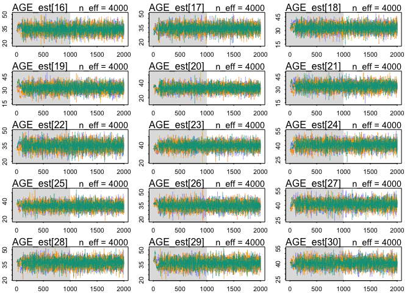
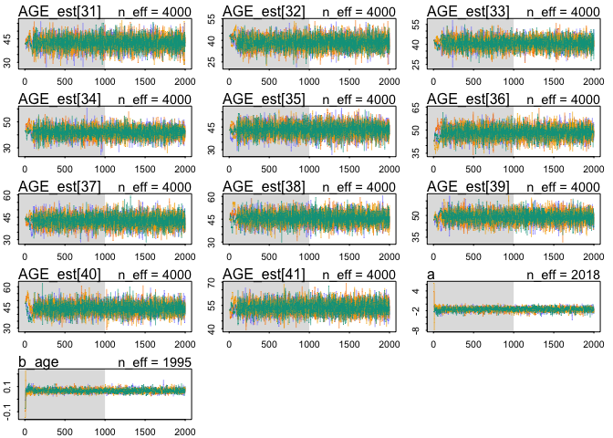
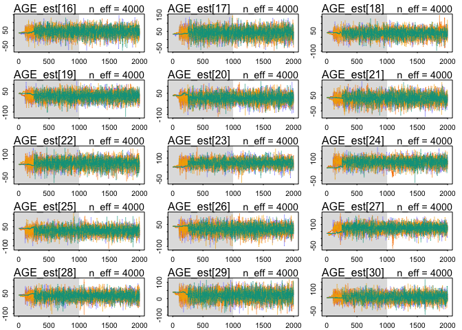

# Chapter 14 Problems
Julin N Maloof  
3/8/2017  


## 14E1

Specify a distribition that the observations come from (actually each observation has a separate set of parameters).  Have the linear model use the distribution as predictors rather than the observations themselves

T_i ~ Poission(mu_i)
log(mu_i) = a + B*logPi_est
logPi_obs ~ dnorm(logPi_est_i, logPi_sigma_i)
A ~ dnorm(0,10)
B ~ dnorm(0,10)

## 14E2

## 14M1

They all come from the same distribution, with mean v and sd sigma_n

## 14M2

_Repeat WAIC comparison on milk primate data models from chapter 6, but include missing data (via imputation).  Does this affect model performance?_

### Without imputation

Updated code to use map2stan 


```r
# Rcode 6.21
library(rethinking)
```

```
## Loading required package: rstan
```

```
## Warning: package 'rstan' was built under R version 3.2.5
```

```
## Loading required package: ggplot2
```

```
## Warning: package 'ggplot2' was built under R version 3.2.5
```

```
## Loading required package: StanHeaders
```

```
## Warning: package 'StanHeaders' was built under R version 3.2.5
```

```
## rstan (Version 2.14.1, packaged: 2016-12-28 14:55:41 UTC, GitRev: 5fa1e80eb817)
```

```
## For execution on a local, multicore CPU with excess RAM we recommend calling
## rstan_options(auto_write = TRUE)
## options(mc.cores = parallel::detectCores())
```

```
## Loading required package: parallel
```

```
## rethinking (Version 1.62)
```

```r
data(milk)
d <- milk[ complete.cases(milk) , ]
d$neocortex <- d$neocortex.perc / 100
d$logmass <- log(d$mass)
dim(d)
```

```
## [1] 17 10
```

```r
d_list <- list(
kcal = d$kcal,
neocortex = d$neocortex,
logmass = d$logmass )

# Rcode 6.22

m6.11 <- map2stan(
  alist(
    kcal ~ dnorm( mu , sigma) ,
    mu <- a,
    a ~ dnorm(0,100),
    sigma ~ dcauchy(0,1)),
  data=d_list , 
  chains = 4, cores = 1)
```

```
## In file included from filebcb91f7f023d.cpp:8:
## In file included from /Library/Frameworks/R.framework/Versions/3.2/Resources/library/StanHeaders/include/src/stan/model/model_header.hpp:4:
## In file included from /Library/Frameworks/R.framework/Versions/3.2/Resources/library/StanHeaders/include/stan/math.hpp:4:
## In file included from /Library/Frameworks/R.framework/Versions/3.2/Resources/library/StanHeaders/include/stan/math/rev/mat.hpp:4:
## In file included from /Library/Frameworks/R.framework/Versions/3.2/Resources/library/StanHeaders/include/stan/math/rev/core.hpp:12:
## In file included from /Library/Frameworks/R.framework/Versions/3.2/Resources/library/StanHeaders/include/stan/math/rev/core/gevv_vvv_vari.hpp:5:
## In file included from /Library/Frameworks/R.framework/Versions/3.2/Resources/library/StanHeaders/include/stan/math/rev/core/var.hpp:7:
## In file included from /Library/Frameworks/R.framework/Versions/3.2/Resources/library/BH/include/boost/math/tools/config.hpp:13:
## In file included from /Library/Frameworks/R.framework/Versions/3.2/Resources/library/BH/include/boost/config.hpp:39:
## /Library/Frameworks/R.framework/Versions/3.2/Resources/library/BH/include/boost/config/compiler/clang.hpp:171:11: warning: 'BOOST_NO_CXX11_RVALUE_REFERENCES' macro redefined [-Wmacro-redefined]
## #  define BOOST_NO_CXX11_RVALUE_REFERENCES
##           ^
## <command line>:6:9: note: previous definition is here
## #define BOOST_NO_CXX11_RVALUE_REFERENCES 1
##         ^
## 1 warning generated.
## 
## SAMPLING FOR MODEL 'a1b88d0a7a0b5acfd2d9015baa1fd714' NOW (CHAIN 1).
## 
## Chain 1, Iteration:    1 / 2000 [  0%]  (Warmup)
## Chain 1, Iteration:  200 / 2000 [ 10%]  (Warmup)
## Chain 1, Iteration:  400 / 2000 [ 20%]  (Warmup)
## Chain 1, Iteration:  600 / 2000 [ 30%]  (Warmup)
## Chain 1, Iteration:  800 / 2000 [ 40%]  (Warmup)
## Chain 1, Iteration: 1000 / 2000 [ 50%]  (Warmup)
## Chain 1, Iteration: 1001 / 2000 [ 50%]  (Sampling)
## Chain 1, Iteration: 1200 / 2000 [ 60%]  (Sampling)
## Chain 1, Iteration: 1400 / 2000 [ 70%]  (Sampling)
## Chain 1, Iteration: 1600 / 2000 [ 80%]  (Sampling)
## Chain 1, Iteration: 1800 / 2000 [ 90%]  (Sampling)
## Chain 1, Iteration: 2000 / 2000 [100%]  (Sampling)
##  Elapsed Time: 0.017526 seconds (Warm-up)
##                0.015215 seconds (Sampling)
##                0.032741 seconds (Total)
## 
## 
## SAMPLING FOR MODEL 'a1b88d0a7a0b5acfd2d9015baa1fd714' NOW (CHAIN 2).
## 
## Chain 2, Iteration:    1 / 2000 [  0%]  (Warmup)
## Chain 2, Iteration:  200 / 2000 [ 10%]  (Warmup)
## Chain 2, Iteration:  400 / 2000 [ 20%]  (Warmup)
## Chain 2, Iteration:  600 / 2000 [ 30%]  (Warmup)
## Chain 2, Iteration:  800 / 2000 [ 40%]  (Warmup)
## Chain 2, Iteration: 1000 / 2000 [ 50%]  (Warmup)
## Chain 2, Iteration: 1001 / 2000 [ 50%]  (Sampling)
## Chain 2, Iteration: 1200 / 2000 [ 60%]  (Sampling)
## Chain 2, Iteration: 1400 / 2000 [ 70%]  (Sampling)
## Chain 2, Iteration: 1600 / 2000 [ 80%]  (Sampling)
## Chain 2, Iteration: 1800 / 2000 [ 90%]  (Sampling)
## Chain 2, Iteration: 2000 / 2000 [100%]  (Sampling)
##  Elapsed Time: 0.018685 seconds (Warm-up)
##                0.01794 seconds (Sampling)
##                0.036625 seconds (Total)
## 
## 
## SAMPLING FOR MODEL 'a1b88d0a7a0b5acfd2d9015baa1fd714' NOW (CHAIN 3).
## 
## Chain 3, Iteration:    1 / 2000 [  0%]  (Warmup)
## Chain 3, Iteration:  200 / 2000 [ 10%]  (Warmup)
## Chain 3, Iteration:  400 / 2000 [ 20%]  (Warmup)
## Chain 3, Iteration:  600 / 2000 [ 30%]  (Warmup)
## Chain 3, Iteration:  800 / 2000 [ 40%]  (Warmup)
## Chain 3, Iteration: 1000 / 2000 [ 50%]  (Warmup)
## Chain 3, Iteration: 1001 / 2000 [ 50%]  (Sampling)
## Chain 3, Iteration: 1200 / 2000 [ 60%]  (Sampling)
## Chain 3, Iteration: 1400 / 2000 [ 70%]  (Sampling)
## Chain 3, Iteration: 1600 / 2000 [ 80%]  (Sampling)
## Chain 3, Iteration: 1800 / 2000 [ 90%]  (Sampling)
## Chain 3, Iteration: 2000 / 2000 [100%]  (Sampling)
##  Elapsed Time: 0.019738 seconds (Warm-up)
##                0.014531 seconds (Sampling)
##                0.034269 seconds (Total)
## 
## 
## SAMPLING FOR MODEL 'a1b88d0a7a0b5acfd2d9015baa1fd714' NOW (CHAIN 4).
## 
## Chain 4, Iteration:    1 / 2000 [  0%]  (Warmup)
## Chain 4, Iteration:  200 / 2000 [ 10%]  (Warmup)
## Chain 4, Iteration:  400 / 2000 [ 20%]  (Warmup)
## Chain 4, Iteration:  600 / 2000 [ 30%]  (Warmup)
## Chain 4, Iteration:  800 / 2000 [ 40%]  (Warmup)
## Chain 4, Iteration: 1000 / 2000 [ 50%]  (Warmup)
## Chain 4, Iteration: 1001 / 2000 [ 50%]  (Sampling)
## Chain 4, Iteration: 1200 / 2000 [ 60%]  (Sampling)
## Chain 4, Iteration: 1400 / 2000 [ 70%]  (Sampling)
## Chain 4, Iteration: 1600 / 2000 [ 80%]  (Sampling)
## Chain 4, Iteration: 1800 / 2000 [ 90%]  (Sampling)
## Chain 4, Iteration: 2000 / 2000 [100%]  (Sampling)
##  Elapsed Time: 0.018135 seconds (Warm-up)
##                0.014905 seconds (Sampling)
##                0.03304 seconds (Total)
## 
## 
## SAMPLING FOR MODEL 'a1b88d0a7a0b5acfd2d9015baa1fd714' NOW (CHAIN 1).
## WARNING: No variance estimation is
##          performed for num_warmup < 20
## 
## 
## Chain 1, Iteration: 1 / 1 [100%]  (Sampling)
##  Elapsed Time: 4e-06 seconds (Warm-up)
##                2.5e-05 seconds (Sampling)
##                2.9e-05 seconds (Total)
```

```
## Computing WAIC
```

```
## Constructing posterior predictions
```

```
## [ 400 / 4000 ]
[ 800 / 4000 ]
[ 1200 / 4000 ]
[ 1600 / 4000 ]
[ 2000 / 4000 ]
[ 2400 / 4000 ]
[ 2800 / 4000 ]
[ 3200 / 4000 ]
[ 3600 / 4000 ]
[ 4000 / 4000 ]
```

```r
m6.12 <- map2stan(
  alist(
    kcal ~ dnorm( mu , sigma ) ,
    mu <- a + bn*neocortex,
    a ~ dnorm(0,100),
    bn ~ dnorm(0,10),
    sigma ~ dcauchy(0,1)),
  data=d_list , 
  chains = 4, cores = 1)
```

```
## In file included from filebcb942f2f537.cpp:8:
## In file included from /Library/Frameworks/R.framework/Versions/3.2/Resources/library/StanHeaders/include/src/stan/model/model_header.hpp:4:
## In file included from /Library/Frameworks/R.framework/Versions/3.2/Resources/library/StanHeaders/include/stan/math.hpp:4:
## In file included from /Library/Frameworks/R.framework/Versions/3.2/Resources/library/StanHeaders/include/stan/math/rev/mat.hpp:4:
## In file included from /Library/Frameworks/R.framework/Versions/3.2/Resources/library/StanHeaders/include/stan/math/rev/core.hpp:12:
## In file included from /Library/Frameworks/R.framework/Versions/3.2/Resources/library/StanHeaders/include/stan/math/rev/core/gevv_vvv_vari.hpp:5:
## In file included from /Library/Frameworks/R.framework/Versions/3.2/Resources/library/StanHeaders/include/stan/math/rev/core/var.hpp:7:
## In file included from /Library/Frameworks/R.framework/Versions/3.2/Resources/library/BH/include/boost/math/tools/config.hpp:13:
## In file included from /Library/Frameworks/R.framework/Versions/3.2/Resources/library/BH/include/boost/config.hpp:39:
## /Library/Frameworks/R.framework/Versions/3.2/Resources/library/BH/include/boost/config/compiler/clang.hpp:171:11: warning: 'BOOST_NO_CXX11_RVALUE_REFERENCES' macro redefined [-Wmacro-redefined]
## #  define BOOST_NO_CXX11_RVALUE_REFERENCES
##           ^
## <command line>:6:9: note: previous definition is here
## #define BOOST_NO_CXX11_RVALUE_REFERENCES 1
##         ^
## 1 warning generated.
## 
## SAMPLING FOR MODEL 'f9c639b0c405cb47722fedc603b8316b' NOW (CHAIN 1).
## 
## Chain 1, Iteration:    1 / 2000 [  0%]  (Warmup)
## Chain 1, Iteration:  200 / 2000 [ 10%]  (Warmup)
## Chain 1, Iteration:  400 / 2000 [ 20%]  (Warmup)
## Chain 1, Iteration:  600 / 2000 [ 30%]  (Warmup)
## Chain 1, Iteration:  800 / 2000 [ 40%]  (Warmup)
## Chain 1, Iteration: 1000 / 2000 [ 50%]  (Warmup)
## Chain 1, Iteration: 1001 / 2000 [ 50%]  (Sampling)
## Chain 1, Iteration: 1200 / 2000 [ 60%]  (Sampling)
## Chain 1, Iteration: 1400 / 2000 [ 70%]  (Sampling)
## Chain 1, Iteration: 1600 / 2000 [ 80%]  (Sampling)
## Chain 1, Iteration: 1800 / 2000 [ 90%]  (Sampling)
## Chain 1, Iteration: 2000 / 2000 [100%]  (Sampling)
##  Elapsed Time: 0.241802 seconds (Warm-up)
##                0.248631 seconds (Sampling)
##                0.490433 seconds (Total)
## 
## 
## SAMPLING FOR MODEL 'f9c639b0c405cb47722fedc603b8316b' NOW (CHAIN 2).
## 
## Chain 2, Iteration:    1 / 2000 [  0%]  (Warmup)
## Chain 2, Iteration:  200 / 2000 [ 10%]  (Warmup)
## Chain 2, Iteration:  400 / 2000 [ 20%]  (Warmup)
## Chain 2, Iteration:  600 / 2000 [ 30%]  (Warmup)
## Chain 2, Iteration:  800 / 2000 [ 40%]  (Warmup)
## Chain 2, Iteration: 1000 / 2000 [ 50%]  (Warmup)
## Chain 2, Iteration: 1001 / 2000 [ 50%]  (Sampling)
## Chain 2, Iteration: 1200 / 2000 [ 60%]  (Sampling)
## Chain 2, Iteration: 1400 / 2000 [ 70%]  (Sampling)
## Chain 2, Iteration: 1600 / 2000 [ 80%]  (Sampling)
## Chain 2, Iteration: 1800 / 2000 [ 90%]  (Sampling)
## Chain 2, Iteration: 2000 / 2000 [100%]  (Sampling)
##  Elapsed Time: 0.203747 seconds (Warm-up)
##                0.222963 seconds (Sampling)
##                0.42671 seconds (Total)
## 
## 
## SAMPLING FOR MODEL 'f9c639b0c405cb47722fedc603b8316b' NOW (CHAIN 3).
## 
## Chain 3, Iteration:    1 / 2000 [  0%]  (Warmup)
## Chain 3, Iteration:  200 / 2000 [ 10%]  (Warmup)
## Chain 3, Iteration:  400 / 2000 [ 20%]  (Warmup)
## Chain 3, Iteration:  600 / 2000 [ 30%]  (Warmup)
## Chain 3, Iteration:  800 / 2000 [ 40%]  (Warmup)
## Chain 3, Iteration: 1000 / 2000 [ 50%]  (Warmup)
## Chain 3, Iteration: 1001 / 2000 [ 50%]  (Sampling)
## Chain 3, Iteration: 1200 / 2000 [ 60%]  (Sampling)
## Chain 3, Iteration: 1400 / 2000 [ 70%]  (Sampling)
## Chain 3, Iteration: 1600 / 2000 [ 80%]  (Sampling)
## Chain 3, Iteration: 1800 / 2000 [ 90%]  (Sampling)
## Chain 3, Iteration: 2000 / 2000 [100%]  (Sampling)
##  Elapsed Time: 0.220669 seconds (Warm-up)
##                0.292096 seconds (Sampling)
##                0.512765 seconds (Total)
## 
## 
## SAMPLING FOR MODEL 'f9c639b0c405cb47722fedc603b8316b' NOW (CHAIN 4).
## 
## Chain 4, Iteration:    1 / 2000 [  0%]  (Warmup)
## Chain 4, Iteration:  200 / 2000 [ 10%]  (Warmup)
## Chain 4, Iteration:  400 / 2000 [ 20%]  (Warmup)
## Chain 4, Iteration:  600 / 2000 [ 30%]  (Warmup)
## Chain 4, Iteration:  800 / 2000 [ 40%]  (Warmup)
## Chain 4, Iteration: 1000 / 2000 [ 50%]  (Warmup)
## Chain 4, Iteration: 1001 / 2000 [ 50%]  (Sampling)
## Chain 4, Iteration: 1200 / 2000 [ 60%]  (Sampling)
## Chain 4, Iteration: 1400 / 2000 [ 70%]  (Sampling)
## Chain 4, Iteration: 1600 / 2000 [ 80%]  (Sampling)
## Chain 4, Iteration: 1800 / 2000 [ 90%]  (Sampling)
## Chain 4, Iteration: 2000 / 2000 [100%]  (Sampling)
##  Elapsed Time: 0.278413 seconds (Warm-up)
##                0.197563 seconds (Sampling)
##                0.475976 seconds (Total)
## 
## 
## SAMPLING FOR MODEL 'f9c639b0c405cb47722fedc603b8316b' NOW (CHAIN 1).
## WARNING: No variance estimation is
##          performed for num_warmup < 20
## 
## 
## Chain 1, Iteration: 1 / 1 [100%]  (Sampling)
##  Elapsed Time: 5e-06 seconds (Warm-up)
##                4.5e-05 seconds (Sampling)
##                5e-05 seconds (Total)
```

```
## Computing WAIC
## Constructing posterior predictions
```

```
## [ 400 / 4000 ]
[ 800 / 4000 ]
[ 1200 / 4000 ]
[ 1600 / 4000 ]
[ 2000 / 4000 ]
[ 2400 / 4000 ]
[ 2800 / 4000 ]
[ 3200 / 4000 ]
[ 3600 / 4000 ]
[ 4000 / 4000 ]
```

```r
m6.13 <- map2stan(
  alist(
    kcal ~ dnorm( mu , sigma ) ,
    mu <- a + bm*logmass,
    a ~ dnorm(0,100),
    bm ~ dnorm(0,10),
    sigma ~ dcauchy(0,1)),
  data=d_list , 
  chains = 4, cores = 1)
```

```
## In file included from filebcb9b4ab51c.cpp:8:
## In file included from /Library/Frameworks/R.framework/Versions/3.2/Resources/library/StanHeaders/include/src/stan/model/model_header.hpp:4:
## In file included from /Library/Frameworks/R.framework/Versions/3.2/Resources/library/StanHeaders/include/stan/math.hpp:4:
## In file included from /Library/Frameworks/R.framework/Versions/3.2/Resources/library/StanHeaders/include/stan/math/rev/mat.hpp:4:
## In file included from /Library/Frameworks/R.framework/Versions/3.2/Resources/library/StanHeaders/include/stan/math/rev/core.hpp:12:
## In file included from /Library/Frameworks/R.framework/Versions/3.2/Resources/library/StanHeaders/include/stan/math/rev/core/gevv_vvv_vari.hpp:5:
## In file included from /Library/Frameworks/R.framework/Versions/3.2/Resources/library/StanHeaders/include/stan/math/rev/core/var.hpp:7:
## In file included from /Library/Frameworks/R.framework/Versions/3.2/Resources/library/BH/include/boost/math/tools/config.hpp:13:
## In file included from /Library/Frameworks/R.framework/Versions/3.2/Resources/library/BH/include/boost/config.hpp:39:
## /Library/Frameworks/R.framework/Versions/3.2/Resources/library/BH/include/boost/config/compiler/clang.hpp:171:11: warning: 'BOOST_NO_CXX11_RVALUE_REFERENCES' macro redefined [-Wmacro-redefined]
## #  define BOOST_NO_CXX11_RVALUE_REFERENCES
##           ^
## <command line>:6:9: note: previous definition is here
## #define BOOST_NO_CXX11_RVALUE_REFERENCES 1
##         ^
## 1 warning generated.
## 
## SAMPLING FOR MODEL '12a503d5f95b8c44885f64802ddf4b7a' NOW (CHAIN 1).
## 
## Chain 1, Iteration:    1 / 2000 [  0%]  (Warmup)
## Chain 1, Iteration:  200 / 2000 [ 10%]  (Warmup)
## Chain 1, Iteration:  400 / 2000 [ 20%]  (Warmup)
## Chain 1, Iteration:  600 / 2000 [ 30%]  (Warmup)
## Chain 1, Iteration:  800 / 2000 [ 40%]  (Warmup)
## Chain 1, Iteration: 1000 / 2000 [ 50%]  (Warmup)
## Chain 1, Iteration: 1001 / 2000 [ 50%]  (Sampling)
## Chain 1, Iteration: 1200 / 2000 [ 60%]  (Sampling)
## Chain 1, Iteration: 1400 / 2000 [ 70%]  (Sampling)
## Chain 1, Iteration: 1600 / 2000 [ 80%]  (Sampling)
## Chain 1, Iteration: 1800 / 2000 [ 90%]  (Sampling)
## Chain 1, Iteration: 2000 / 2000 [100%]  (Sampling)
##  Elapsed Time: 0.047675 seconds (Warm-up)
##                0.035745 seconds (Sampling)
##                0.08342 seconds (Total)
## 
## 
## SAMPLING FOR MODEL '12a503d5f95b8c44885f64802ddf4b7a' NOW (CHAIN 2).
## 
## Chain 2, Iteration:    1 / 2000 [  0%]  (Warmup)
## Chain 2, Iteration:  200 / 2000 [ 10%]  (Warmup)
## Chain 2, Iteration:  400 / 2000 [ 20%]  (Warmup)
## Chain 2, Iteration:  600 / 2000 [ 30%]  (Warmup)
## Chain 2, Iteration:  800 / 2000 [ 40%]  (Warmup)
## Chain 2, Iteration: 1000 / 2000 [ 50%]  (Warmup)
## Chain 2, Iteration: 1001 / 2000 [ 50%]  (Sampling)
## Chain 2, Iteration: 1200 / 2000 [ 60%]  (Sampling)
## Chain 2, Iteration: 1400 / 2000 [ 70%]  (Sampling)
## Chain 2, Iteration: 1600 / 2000 [ 80%]  (Sampling)
## Chain 2, Iteration: 1800 / 2000 [ 90%]  (Sampling)
## Chain 2, Iteration: 2000 / 2000 [100%]  (Sampling)
##  Elapsed Time: 0.052349 seconds (Warm-up)
##                0.039232 seconds (Sampling)
##                0.091581 seconds (Total)
## 
## 
## SAMPLING FOR MODEL '12a503d5f95b8c44885f64802ddf4b7a' NOW (CHAIN 3).
## 
## Chain 3, Iteration:    1 / 2000 [  0%]  (Warmup)
## Chain 3, Iteration:  200 / 2000 [ 10%]  (Warmup)
## Chain 3, Iteration:  400 / 2000 [ 20%]  (Warmup)
## Chain 3, Iteration:  600 / 2000 [ 30%]  (Warmup)
## Chain 3, Iteration:  800 / 2000 [ 40%]  (Warmup)
## Chain 3, Iteration: 1000 / 2000 [ 50%]  (Warmup)
## Chain 3, Iteration: 1001 / 2000 [ 50%]  (Sampling)
## Chain 3, Iteration: 1200 / 2000 [ 60%]  (Sampling)
## Chain 3, Iteration: 1400 / 2000 [ 70%]  (Sampling)
## Chain 3, Iteration: 1600 / 2000 [ 80%]  (Sampling)
## Chain 3, Iteration: 1800 / 2000 [ 90%]  (Sampling)
## Chain 3, Iteration: 2000 / 2000 [100%]  (Sampling)
##  Elapsed Time: 0.049348 seconds (Warm-up)
##                0.040515 seconds (Sampling)
##                0.089863 seconds (Total)
## 
## 
## SAMPLING FOR MODEL '12a503d5f95b8c44885f64802ddf4b7a' NOW (CHAIN 4).
## 
## Chain 4, Iteration:    1 / 2000 [  0%]  (Warmup)
## Chain 4, Iteration:  200 / 2000 [ 10%]  (Warmup)
## Chain 4, Iteration:  400 / 2000 [ 20%]  (Warmup)
## Chain 4, Iteration:  600 / 2000 [ 30%]  (Warmup)
## Chain 4, Iteration:  800 / 2000 [ 40%]  (Warmup)
## Chain 4, Iteration: 1000 / 2000 [ 50%]  (Warmup)
## Chain 4, Iteration: 1001 / 2000 [ 50%]  (Sampling)
## Chain 4, Iteration: 1200 / 2000 [ 60%]  (Sampling)
## Chain 4, Iteration: 1400 / 2000 [ 70%]  (Sampling)
## Chain 4, Iteration: 1600 / 2000 [ 80%]  (Sampling)
## Chain 4, Iteration: 1800 / 2000 [ 90%]  (Sampling)
## Chain 4, Iteration: 2000 / 2000 [100%]  (Sampling)
##  Elapsed Time: 0.043518 seconds (Warm-up)
##                0.040536 seconds (Sampling)
##                0.084054 seconds (Total)
## 
## 
## SAMPLING FOR MODEL '12a503d5f95b8c44885f64802ddf4b7a' NOW (CHAIN 1).
## WARNING: No variance estimation is
##          performed for num_warmup < 20
## 
## 
## Chain 1, Iteration: 1 / 1 [100%]  (Sampling)
##  Elapsed Time: 5e-06 seconds (Warm-up)
##                3.3e-05 seconds (Sampling)
##                3.8e-05 seconds (Total)
```

```
## Computing WAIC
## Constructing posterior predictions
```

```
## [ 400 / 4000 ]
[ 800 / 4000 ]
[ 1200 / 4000 ]
[ 1600 / 4000 ]
[ 2000 / 4000 ]
[ 2400 / 4000 ]
[ 2800 / 4000 ]
[ 3200 / 4000 ]
[ 3600 / 4000 ]
[ 4000 / 4000 ]
```

```r
m6.14 <- map2stan(
  alist(
    kcal ~ dnorm( mu , sigma ) ,
    mu <- a + bn*neocortex + bm*logmass,
    a ~ dnorm(0,100),
    c(bn,bm) ~ dnorm(0,10),
    sigma ~ dcauchy(0,1)),
  data=d_list , 
  chains = 4, cores = 1)
```

```
## In file included from filebcb950d3002.cpp:8:
## In file included from /Library/Frameworks/R.framework/Versions/3.2/Resources/library/StanHeaders/include/src/stan/model/model_header.hpp:4:
## In file included from /Library/Frameworks/R.framework/Versions/3.2/Resources/library/StanHeaders/include/stan/math.hpp:4:
## In file included from /Library/Frameworks/R.framework/Versions/3.2/Resources/library/StanHeaders/include/stan/math/rev/mat.hpp:4:
## In file included from /Library/Frameworks/R.framework/Versions/3.2/Resources/library/StanHeaders/include/stan/math/rev/core.hpp:12:
## In file included from /Library/Frameworks/R.framework/Versions/3.2/Resources/library/StanHeaders/include/stan/math/rev/core/gevv_vvv_vari.hpp:5:
## In file included from /Library/Frameworks/R.framework/Versions/3.2/Resources/library/StanHeaders/include/stan/math/rev/core/var.hpp:7:
## In file included from /Library/Frameworks/R.framework/Versions/3.2/Resources/library/BH/include/boost/math/tools/config.hpp:13:
## In file included from /Library/Frameworks/R.framework/Versions/3.2/Resources/library/BH/include/boost/config.hpp:39:
## /Library/Frameworks/R.framework/Versions/3.2/Resources/library/BH/include/boost/config/compiler/clang.hpp:171:11: warning: 'BOOST_NO_CXX11_RVALUE_REFERENCES' macro redefined [-Wmacro-redefined]
## #  define BOOST_NO_CXX11_RVALUE_REFERENCES
##           ^
## <command line>:6:9: note: previous definition is here
## #define BOOST_NO_CXX11_RVALUE_REFERENCES 1
##         ^
## 1 warning generated.
## 
## SAMPLING FOR MODEL '45f1fa2a682a10a914bb91c8198fbf15' NOW (CHAIN 1).
## 
## Chain 1, Iteration:    1 / 2000 [  0%]  (Warmup)
## Chain 1, Iteration:  200 / 2000 [ 10%]  (Warmup)
## Chain 1, Iteration:  400 / 2000 [ 20%]  (Warmup)
## Chain 1, Iteration:  600 / 2000 [ 30%]  (Warmup)
## Chain 1, Iteration:  800 / 2000 [ 40%]  (Warmup)
## Chain 1, Iteration: 1000 / 2000 [ 50%]  (Warmup)
## Chain 1, Iteration: 1001 / 2000 [ 50%]  (Sampling)
## Chain 1, Iteration: 1200 / 2000 [ 60%]  (Sampling)
## Chain 1, Iteration: 1400 / 2000 [ 70%]  (Sampling)
## Chain 1, Iteration: 1600 / 2000 [ 80%]  (Sampling)
## Chain 1, Iteration: 1800 / 2000 [ 90%]  (Sampling)
## Chain 1, Iteration: 2000 / 2000 [100%]  (Sampling)
##  Elapsed Time: 0.406318 seconds (Warm-up)
##                0.438118 seconds (Sampling)
##                0.844436 seconds (Total)
## 
## 
## SAMPLING FOR MODEL '45f1fa2a682a10a914bb91c8198fbf15' NOW (CHAIN 2).
## 
## Chain 2, Iteration:    1 / 2000 [  0%]  (Warmup)
## Chain 2, Iteration:  200 / 2000 [ 10%]  (Warmup)
## Chain 2, Iteration:  400 / 2000 [ 20%]  (Warmup)
## Chain 2, Iteration:  600 / 2000 [ 30%]  (Warmup)
## Chain 2, Iteration:  800 / 2000 [ 40%]  (Warmup)
## Chain 2, Iteration: 1000 / 2000 [ 50%]  (Warmup)
## Chain 2, Iteration: 1001 / 2000 [ 50%]  (Sampling)
## Chain 2, Iteration: 1200 / 2000 [ 60%]  (Sampling)
## Chain 2, Iteration: 1400 / 2000 [ 70%]  (Sampling)
## Chain 2, Iteration: 1600 / 2000 [ 80%]  (Sampling)
## Chain 2, Iteration: 1800 / 2000 [ 90%]  (Sampling)
## Chain 2, Iteration: 2000 / 2000 [100%]  (Sampling)
##  Elapsed Time: 0.392521 seconds (Warm-up)
##                0.550527 seconds (Sampling)
##                0.943048 seconds (Total)
## 
## 
## SAMPLING FOR MODEL '45f1fa2a682a10a914bb91c8198fbf15' NOW (CHAIN 3).
## 
## Chain 3, Iteration:    1 / 2000 [  0%]  (Warmup)
## Chain 3, Iteration:  200 / 2000 [ 10%]  (Warmup)
## Chain 3, Iteration:  400 / 2000 [ 20%]  (Warmup)
## Chain 3, Iteration:  600 / 2000 [ 30%]  (Warmup)
## Chain 3, Iteration:  800 / 2000 [ 40%]  (Warmup)
## Chain 3, Iteration: 1000 / 2000 [ 50%]  (Warmup)
## Chain 3, Iteration: 1001 / 2000 [ 50%]  (Sampling)
## Chain 3, Iteration: 1200 / 2000 [ 60%]  (Sampling)
## Chain 3, Iteration: 1400 / 2000 [ 70%]  (Sampling)
## Chain 3, Iteration: 1600 / 2000 [ 80%]  (Sampling)
## Chain 3, Iteration: 1800 / 2000 [ 90%]  (Sampling)
## Chain 3, Iteration: 2000 / 2000 [100%]  (Sampling)
##  Elapsed Time: 0.470516 seconds (Warm-up)
##                0.463818 seconds (Sampling)
##                0.934334 seconds (Total)
## 
## 
## SAMPLING FOR MODEL '45f1fa2a682a10a914bb91c8198fbf15' NOW (CHAIN 4).
## 
## Chain 4, Iteration:    1 / 2000 [  0%]  (Warmup)
## Chain 4, Iteration:  200 / 2000 [ 10%]  (Warmup)
## Chain 4, Iteration:  400 / 2000 [ 20%]  (Warmup)
## Chain 4, Iteration:  600 / 2000 [ 30%]  (Warmup)
## Chain 4, Iteration:  800 / 2000 [ 40%]  (Warmup)
## Chain 4, Iteration: 1000 / 2000 [ 50%]  (Warmup)
## Chain 4, Iteration: 1001 / 2000 [ 50%]  (Sampling)
## Chain 4, Iteration: 1200 / 2000 [ 60%]  (Sampling)
## Chain 4, Iteration: 1400 / 2000 [ 70%]  (Sampling)
## Chain 4, Iteration: 1600 / 2000 [ 80%]  (Sampling)
## Chain 4, Iteration: 1800 / 2000 [ 90%]  (Sampling)
## Chain 4, Iteration: 2000 / 2000 [100%]  (Sampling)
##  Elapsed Time: 0.392437 seconds (Warm-up)
##                0.351994 seconds (Sampling)
##                0.744431 seconds (Total)
```

```
## Warning: There were 3 divergent transitions after warmup. Increasing adapt_delta above 0.8 may help. See
## http://mc-stan.org/misc/warnings.html#divergent-transitions-after-warmup
```

```
## Warning: Examine the pairs() plot to diagnose sampling problems
```

```
## 
## SAMPLING FOR MODEL '45f1fa2a682a10a914bb91c8198fbf15' NOW (CHAIN 1).
## WARNING: No variance estimation is
##          performed for num_warmup < 20
## 
## 
## Chain 1, Iteration: 1 / 1 [100%]  (Sampling)
##  Elapsed Time: 6e-06 seconds (Warm-up)
##                3.6e-05 seconds (Sampling)
##                4.2e-05 seconds (Total)
```

```
## Computing WAIC
## Constructing posterior predictions
```

```
## [ 400 / 4000 ]
[ 800 / 4000 ]
[ 1200 / 4000 ]
[ 1600 / 4000 ]
[ 2000 / 4000 ]
[ 2400 / 4000 ]
[ 2800 / 4000 ]
[ 3200 / 4000 ]
[ 3600 / 4000 ]
[ 4000 / 4000 ]
```

```
## Warning in map2stan(alist(kcal ~ dnorm(mu, sigma), mu <- a + bn * neocortex + : There were 3 divergent iterations during sampling.
## Check the chains (trace plots, n_eff, Rhat) carefully to ensure they are valid.
```

```r
#Rcode 6.24
( milk.models <- compare( m6.11 , m6.12 , m6.13 , m6.14 ) )
```

```
##        WAIC pWAIC dWAIC weight   SE  dSE
## m6.14 -17.0   3.1   0.0   0.96 5.02   NA
## m6.13  -8.8   2.0   8.2   0.02 4.03 3.52
## m6.11  -8.6   1.4   8.4   0.01 3.62 4.92
## m6.12  -7.1   2.0   9.9   0.01 3.18 5.04
```

```r
save.image("chapter14.Rdata")
```

### Now with missing data imputation


```r
library(rethinking)
load("chapter14.Rdata")
# Rcode 6.21
d.all <- milk
d.all$neocortex <- d.all$neocortex.perc / 100
d.all$logmass <- log(d.all$mass)
dim(d.all)
```

```
## [1] 29 10
```

```r
d.all_list <- list(
kcal = d.all$kcal,
neocortex = d.all$neocortex,
logmass = d.all$logmass )

# Rcode 6.22

m6.11.all <- map2stan(
  alist(
    kcal ~ dnorm( mu , sigma) ,
    mu <- a,
    a ~ dnorm(0,100),
    sigma ~ dcauchy(0,1)),
  data=d.all_list , 
  chains = 4, cores = 1)
```

```
## In file included from filebcb96db8344c.cpp:8:
## In file included from /Library/Frameworks/R.framework/Versions/3.2/Resources/library/StanHeaders/include/src/stan/model/model_header.hpp:4:
## In file included from /Library/Frameworks/R.framework/Versions/3.2/Resources/library/StanHeaders/include/stan/math.hpp:4:
## In file included from /Library/Frameworks/R.framework/Versions/3.2/Resources/library/StanHeaders/include/stan/math/rev/mat.hpp:4:
## In file included from /Library/Frameworks/R.framework/Versions/3.2/Resources/library/StanHeaders/include/stan/math/rev/core.hpp:12:
## In file included from /Library/Frameworks/R.framework/Versions/3.2/Resources/library/StanHeaders/include/stan/math/rev/core/gevv_vvv_vari.hpp:5:
## In file included from /Library/Frameworks/R.framework/Versions/3.2/Resources/library/StanHeaders/include/stan/math/rev/core/var.hpp:7:
## In file included from /Library/Frameworks/R.framework/Versions/3.2/Resources/library/BH/include/boost/math/tools/config.hpp:13:
## In file included from /Library/Frameworks/R.framework/Versions/3.2/Resources/library/BH/include/boost/config.hpp:39:
## /Library/Frameworks/R.framework/Versions/3.2/Resources/library/BH/include/boost/config/compiler/clang.hpp:171:11: warning: 'BOOST_NO_CXX11_RVALUE_REFERENCES' macro redefined [-Wmacro-redefined]
## #  define BOOST_NO_CXX11_RVALUE_REFERENCES
##           ^
## <command line>:6:9: note: previous definition is here
## #define BOOST_NO_CXX11_RVALUE_REFERENCES 1
##         ^
## 1 warning generated.
## 
## SAMPLING FOR MODEL '8f20e69403ad36bf0076d7e4abf1912d' NOW (CHAIN 1).
## 
## Chain 1, Iteration:    1 / 2000 [  0%]  (Warmup)
## Chain 1, Iteration:  200 / 2000 [ 10%]  (Warmup)
## Chain 1, Iteration:  400 / 2000 [ 20%]  (Warmup)
## Chain 1, Iteration:  600 / 2000 [ 30%]  (Warmup)
## Chain 1, Iteration:  800 / 2000 [ 40%]  (Warmup)
## Chain 1, Iteration: 1000 / 2000 [ 50%]  (Warmup)
## Chain 1, Iteration: 1001 / 2000 [ 50%]  (Sampling)
## Chain 1, Iteration: 1200 / 2000 [ 60%]  (Sampling)
## Chain 1, Iteration: 1400 / 2000 [ 70%]  (Sampling)
## Chain 1, Iteration: 1600 / 2000 [ 80%]  (Sampling)
## Chain 1, Iteration: 1800 / 2000 [ 90%]  (Sampling)
## Chain 1, Iteration: 2000 / 2000 [100%]  (Sampling)
##  Elapsed Time: 0.034416 seconds (Warm-up)
##                0.024566 seconds (Sampling)
##                0.058982 seconds (Total)
## 
## 
## SAMPLING FOR MODEL '8f20e69403ad36bf0076d7e4abf1912d' NOW (CHAIN 2).
## 
## Chain 2, Iteration:    1 / 2000 [  0%]  (Warmup)
## Chain 2, Iteration:  200 / 2000 [ 10%]  (Warmup)
## Chain 2, Iteration:  400 / 2000 [ 20%]  (Warmup)
## Chain 2, Iteration:  600 / 2000 [ 30%]  (Warmup)
## Chain 2, Iteration:  800 / 2000 [ 40%]  (Warmup)
## Chain 2, Iteration: 1000 / 2000 [ 50%]  (Warmup)
## Chain 2, Iteration: 1001 / 2000 [ 50%]  (Sampling)
## Chain 2, Iteration: 1200 / 2000 [ 60%]  (Sampling)
## Chain 2, Iteration: 1400 / 2000 [ 70%]  (Sampling)
## Chain 2, Iteration: 1600 / 2000 [ 80%]  (Sampling)
## Chain 2, Iteration: 1800 / 2000 [ 90%]  (Sampling)
## Chain 2, Iteration: 2000 / 2000 [100%]  (Sampling)
##  Elapsed Time: 0.030718 seconds (Warm-up)
##                0.023443 seconds (Sampling)
##                0.054161 seconds (Total)
## 
## 
## SAMPLING FOR MODEL '8f20e69403ad36bf0076d7e4abf1912d' NOW (CHAIN 3).
## 
## Chain 3, Iteration:    1 / 2000 [  0%]  (Warmup)
## Chain 3, Iteration:  200 / 2000 [ 10%]  (Warmup)
## Chain 3, Iteration:  400 / 2000 [ 20%]  (Warmup)
## Chain 3, Iteration:  600 / 2000 [ 30%]  (Warmup)
## Chain 3, Iteration:  800 / 2000 [ 40%]  (Warmup)
## Chain 3, Iteration: 1000 / 2000 [ 50%]  (Warmup)
## Chain 3, Iteration: 1001 / 2000 [ 50%]  (Sampling)
## Chain 3, Iteration: 1200 / 2000 [ 60%]  (Sampling)
## Chain 3, Iteration: 1400 / 2000 [ 70%]  (Sampling)
## Chain 3, Iteration: 1600 / 2000 [ 80%]  (Sampling)
## Chain 3, Iteration: 1800 / 2000 [ 90%]  (Sampling)
## Chain 3, Iteration: 2000 / 2000 [100%]  (Sampling)
##  Elapsed Time: 0.02854 seconds (Warm-up)
##                0.028226 seconds (Sampling)
##                0.056766 seconds (Total)
## 
## 
## SAMPLING FOR MODEL '8f20e69403ad36bf0076d7e4abf1912d' NOW (CHAIN 4).
## 
## Chain 4, Iteration:    1 / 2000 [  0%]  (Warmup)
## Chain 4, Iteration:  200 / 2000 [ 10%]  (Warmup)
## Chain 4, Iteration:  400 / 2000 [ 20%]  (Warmup)
## Chain 4, Iteration:  600 / 2000 [ 30%]  (Warmup)
## Chain 4, Iteration:  800 / 2000 [ 40%]  (Warmup)
## Chain 4, Iteration: 1000 / 2000 [ 50%]  (Warmup)
## Chain 4, Iteration: 1001 / 2000 [ 50%]  (Sampling)
## Chain 4, Iteration: 1200 / 2000 [ 60%]  (Sampling)
## Chain 4, Iteration: 1400 / 2000 [ 70%]  (Sampling)
## Chain 4, Iteration: 1600 / 2000 [ 80%]  (Sampling)
## Chain 4, Iteration: 1800 / 2000 [ 90%]  (Sampling)
## Chain 4, Iteration: 2000 / 2000 [100%]  (Sampling)
##  Elapsed Time: 0.038357 seconds (Warm-up)
##                0.023768 seconds (Sampling)
##                0.062125 seconds (Total)
## 
## 
## SAMPLING FOR MODEL '8f20e69403ad36bf0076d7e4abf1912d' NOW (CHAIN 1).
## WARNING: No variance estimation is
##          performed for num_warmup < 20
## 
## 
## Chain 1, Iteration: 1 / 1 [100%]  (Sampling)
##  Elapsed Time: 6e-06 seconds (Warm-up)
##                3.4e-05 seconds (Sampling)
##                4e-05 seconds (Total)
```

```
## Computing WAIC
```

```
## Constructing posterior predictions
```

```
## [ 400 / 4000 ]
[ 800 / 4000 ]
[ 1200 / 4000 ]
[ 1600 / 4000 ]
[ 2000 / 4000 ]
[ 2400 / 4000 ]
[ 2800 / 4000 ]
[ 3200 / 4000 ]
[ 3600 / 4000 ]
[ 4000 / 4000 ]
```

```r
m6.12.all <- map2stan(
  alist(
    kcal ~ dnorm( mu , sigma ) ,
    mu <- a + bn*neocortex,
    a ~ dnorm(0,100),
    bn ~ dnorm(0,10),
    neocortex ~ dnorm(nu,sigma_nu),
    nu ~ dnorm(0.5,1),
    sigma_nu ~ dcauchy(0,1),
    sigma ~ dcauchy(0,1)),
  data=d.all_list , 
  chains = 4, cores = 1)
```

```
## Imputing 12 missing values (NA) in variable 'neocortex'.
```

```
## In file included from filebcb97f7bdb3d.cpp:8:
## In file included from /Library/Frameworks/R.framework/Versions/3.2/Resources/library/StanHeaders/include/src/stan/model/model_header.hpp:4:
## In file included from /Library/Frameworks/R.framework/Versions/3.2/Resources/library/StanHeaders/include/stan/math.hpp:4:
## In file included from /Library/Frameworks/R.framework/Versions/3.2/Resources/library/StanHeaders/include/stan/math/rev/mat.hpp:4:
## In file included from /Library/Frameworks/R.framework/Versions/3.2/Resources/library/StanHeaders/include/stan/math/rev/core.hpp:12:
## In file included from /Library/Frameworks/R.framework/Versions/3.2/Resources/library/StanHeaders/include/stan/math/rev/core/gevv_vvv_vari.hpp:5:
## In file included from /Library/Frameworks/R.framework/Versions/3.2/Resources/library/StanHeaders/include/stan/math/rev/core/var.hpp:7:
## In file included from /Library/Frameworks/R.framework/Versions/3.2/Resources/library/BH/include/boost/math/tools/config.hpp:13:
## In file included from /Library/Frameworks/R.framework/Versions/3.2/Resources/library/BH/include/boost/config.hpp:39:
## /Library/Frameworks/R.framework/Versions/3.2/Resources/library/BH/include/boost/config/compiler/clang.hpp:171:11: warning: 'BOOST_NO_CXX11_RVALUE_REFERENCES' macro redefined [-Wmacro-redefined]
## #  define BOOST_NO_CXX11_RVALUE_REFERENCES
##           ^
## <command line>:6:9: note: previous definition is here
## #define BOOST_NO_CXX11_RVALUE_REFERENCES 1
##         ^
## 1 warning generated.
## 
## SAMPLING FOR MODEL '29fca152d6c00c52ad371be23af29751' NOW (CHAIN 1).
## 
## Chain 1, Iteration:    1 / 2000 [  0%]  (Warmup)
## Chain 1, Iteration:  200 / 2000 [ 10%]  (Warmup)
## Chain 1, Iteration:  400 / 2000 [ 20%]  (Warmup)
## Chain 1, Iteration:  600 / 2000 [ 30%]  (Warmup)
## Chain 1, Iteration:  800 / 2000 [ 40%]  (Warmup)
## Chain 1, Iteration: 1000 / 2000 [ 50%]  (Warmup)
## Chain 1, Iteration: 1001 / 2000 [ 50%]  (Sampling)
## Chain 1, Iteration: 1200 / 2000 [ 60%]  (Sampling)
## Chain 1, Iteration: 1400 / 2000 [ 70%]  (Sampling)
## Chain 1, Iteration: 1600 / 2000 [ 80%]  (Sampling)
## Chain 1, Iteration: 1800 / 2000 [ 90%]  (Sampling)
## Chain 1, Iteration: 2000 / 2000 [100%]  (Sampling)
##  Elapsed Time: 1.36535 seconds (Warm-up)
##                0.655004 seconds (Sampling)
##                2.02035 seconds (Total)
```

```
## The following numerical problems occured the indicated number of times on chain 1
```

```
##                                                                                 count
## Exception thrown at line 27: normal_log: Scale parameter is 0, but must be > 0!     2
```

```
## When a numerical problem occurs, the Hamiltonian proposal gets rejected.
```

```
## See http://mc-stan.org/misc/warnings.html#exception-hamiltonian-proposal-rejected
```

```
## If the number in the 'count' column is small, do not ask about this message on stan-users.
```

```
## 
## SAMPLING FOR MODEL '29fca152d6c00c52ad371be23af29751' NOW (CHAIN 2).
## 
## Chain 2, Iteration:    1 / 2000 [  0%]  (Warmup)
## Chain 2, Iteration:  200 / 2000 [ 10%]  (Warmup)
## Chain 2, Iteration:  400 / 2000 [ 20%]  (Warmup)
## Chain 2, Iteration:  600 / 2000 [ 30%]  (Warmup)
## Chain 2, Iteration:  800 / 2000 [ 40%]  (Warmup)
## Chain 2, Iteration: 1000 / 2000 [ 50%]  (Warmup)
## Chain 2, Iteration: 1001 / 2000 [ 50%]  (Sampling)
## Chain 2, Iteration: 1200 / 2000 [ 60%]  (Sampling)
## Chain 2, Iteration: 1400 / 2000 [ 70%]  (Sampling)
## Chain 2, Iteration: 1600 / 2000 [ 80%]  (Sampling)
## Chain 2, Iteration: 1800 / 2000 [ 90%]  (Sampling)
## Chain 2, Iteration: 2000 / 2000 [100%]  (Sampling)
##  Elapsed Time: 0.775265 seconds (Warm-up)
##                0.648849 seconds (Sampling)
##                1.42411 seconds (Total)
```

```
## The following numerical problems occured the indicated number of times on chain 2
```

```
##                                                                                 count
## Exception thrown at line 27: normal_log: Scale parameter is 0, but must be > 0!     2
```

```
## When a numerical problem occurs, the Hamiltonian proposal gets rejected.
```

```
## See http://mc-stan.org/misc/warnings.html#exception-hamiltonian-proposal-rejected
```

```
## If the number in the 'count' column is small, do not ask about this message on stan-users.
```

```
## 
## SAMPLING FOR MODEL '29fca152d6c00c52ad371be23af29751' NOW (CHAIN 3).
## 
## Chain 3, Iteration:    1 / 2000 [  0%]  (Warmup)
## Chain 3, Iteration:  200 / 2000 [ 10%]  (Warmup)
## Chain 3, Iteration:  400 / 2000 [ 20%]  (Warmup)
## Chain 3, Iteration:  600 / 2000 [ 30%]  (Warmup)
## Chain 3, Iteration:  800 / 2000 [ 40%]  (Warmup)
## Chain 3, Iteration: 1000 / 2000 [ 50%]  (Warmup)
## Chain 3, Iteration: 1001 / 2000 [ 50%]  (Sampling)
## Chain 3, Iteration: 1200 / 2000 [ 60%]  (Sampling)
## Chain 3, Iteration: 1400 / 2000 [ 70%]  (Sampling)
## Chain 3, Iteration: 1600 / 2000 [ 80%]  (Sampling)
## Chain 3, Iteration: 1800 / 2000 [ 90%]  (Sampling)
## Chain 3, Iteration: 2000 / 2000 [100%]  (Sampling)
##  Elapsed Time: 1.24021 seconds (Warm-up)
##                0.557769 seconds (Sampling)
##                1.79798 seconds (Total)
```

```
## The following numerical problems occured the indicated number of times on chain 3
```

```
##                                                                                 count
## Exception thrown at line 27: normal_log: Scale parameter is 0, but must be > 0!     1
```

```
## When a numerical problem occurs, the Hamiltonian proposal gets rejected.
```

```
## See http://mc-stan.org/misc/warnings.html#exception-hamiltonian-proposal-rejected
```

```
## If the number in the 'count' column is small, do not ask about this message on stan-users.
```

```
## 
## SAMPLING FOR MODEL '29fca152d6c00c52ad371be23af29751' NOW (CHAIN 4).
## 
## Chain 4, Iteration:    1 / 2000 [  0%]  (Warmup)
## Chain 4, Iteration:  200 / 2000 [ 10%]  (Warmup)
## Chain 4, Iteration:  400 / 2000 [ 20%]  (Warmup)
## Chain 4, Iteration:  600 / 2000 [ 30%]  (Warmup)
## Chain 4, Iteration:  800 / 2000 [ 40%]  (Warmup)
## Chain 4, Iteration: 1000 / 2000 [ 50%]  (Warmup)
## Chain 4, Iteration: 1001 / 2000 [ 50%]  (Sampling)
## Chain 4, Iteration: 1200 / 2000 [ 60%]  (Sampling)
## Chain 4, Iteration: 1400 / 2000 [ 70%]  (Sampling)
## Chain 4, Iteration: 1600 / 2000 [ 80%]  (Sampling)
## Chain 4, Iteration: 1800 / 2000 [ 90%]  (Sampling)
## Chain 4, Iteration: 2000 / 2000 [100%]  (Sampling)
##  Elapsed Time: 1.41609 seconds (Warm-up)
##                0.590225 seconds (Sampling)
##                2.00631 seconds (Total)
## 
## 
## SAMPLING FOR MODEL '29fca152d6c00c52ad371be23af29751' NOW (CHAIN 1).
## WARNING: No variance estimation is
##          performed for num_warmup < 20
## 
## 
## Chain 1, Iteration: 1 / 1 [100%]  (Sampling)
##  Elapsed Time: 5e-06 seconds (Warm-up)
##                5.5e-05 seconds (Sampling)
##                6e-05 seconds (Total)
```

```
## Computing WAIC
```

```
## Constructing posterior predictions
```

```
## [ 400 / 4000 ]
[ 800 / 4000 ]
[ 1200 / 4000 ]
[ 1600 / 4000 ]
[ 2000 / 4000 ]
[ 2400 / 4000 ]
[ 2800 / 4000 ]
[ 3200 / 4000 ]
[ 3600 / 4000 ]
[ 4000 / 4000 ]
```

```r
save.image("chapter14.Rdata")

m6.13.all <- map2stan(
  alist(
    kcal ~ dnorm( mu , sigma ) ,
    mu <- a + bm*logmass,
    a ~ dnorm(0,100),
    bm ~ dnorm(0,10),
    neocortex ~ dnorm(nu,sigma_nu),
    nu ~ dnorm(0.5,1),
    sigma_nu ~ dcauchy(0,1),
    sigma ~ dcauchy(0,1)),
  data=d.all_list , 
  chains = 4, cores = 1)
```

```
## Imputing 12 missing values (NA) in variable 'neocortex'.
```

```
## In file included from filebcb9a2aff79.cpp:8:
## In file included from /Library/Frameworks/R.framework/Versions/3.2/Resources/library/StanHeaders/include/src/stan/model/model_header.hpp:4:
## In file included from /Library/Frameworks/R.framework/Versions/3.2/Resources/library/StanHeaders/include/stan/math.hpp:4:
## In file included from /Library/Frameworks/R.framework/Versions/3.2/Resources/library/StanHeaders/include/stan/math/rev/mat.hpp:4:
## In file included from /Library/Frameworks/R.framework/Versions/3.2/Resources/library/StanHeaders/include/stan/math/rev/core.hpp:12:
## In file included from /Library/Frameworks/R.framework/Versions/3.2/Resources/library/StanHeaders/include/stan/math/rev/core/gevv_vvv_vari.hpp:5:
## In file included from /Library/Frameworks/R.framework/Versions/3.2/Resources/library/StanHeaders/include/stan/math/rev/core/var.hpp:7:
## In file included from /Library/Frameworks/R.framework/Versions/3.2/Resources/library/BH/include/boost/math/tools/config.hpp:13:
## In file included from /Library/Frameworks/R.framework/Versions/3.2/Resources/library/BH/include/boost/config.hpp:39:
## /Library/Frameworks/R.framework/Versions/3.2/Resources/library/BH/include/boost/config/compiler/clang.hpp:171:11: warning: 'BOOST_NO_CXX11_RVALUE_REFERENCES' macro redefined [-Wmacro-redefined]
## #  define BOOST_NO_CXX11_RVALUE_REFERENCES
##           ^
## <command line>:6:9: note: previous definition is here
## #define BOOST_NO_CXX11_RVALUE_REFERENCES 1
##         ^
## 1 warning generated.
## 
## SAMPLING FOR MODEL 'a93431b1a14b2726c2ba495b6f0c837c' NOW (CHAIN 1).
## 
## Chain 1, Iteration:    1 / 2000 [  0%]  (Warmup)
## Chain 1, Iteration:  200 / 2000 [ 10%]  (Warmup)
## Chain 1, Iteration:  400 / 2000 [ 20%]  (Warmup)
## Chain 1, Iteration:  600 / 2000 [ 30%]  (Warmup)
## Chain 1, Iteration:  800 / 2000 [ 40%]  (Warmup)
## Chain 1, Iteration: 1000 / 2000 [ 50%]  (Warmup)
## Chain 1, Iteration: 1001 / 2000 [ 50%]  (Sampling)
## Chain 1, Iteration: 1200 / 2000 [ 60%]  (Sampling)
## Chain 1, Iteration: 1400 / 2000 [ 70%]  (Sampling)
## Chain 1, Iteration: 1600 / 2000 [ 80%]  (Sampling)
## Chain 1, Iteration: 1800 / 2000 [ 90%]  (Sampling)
## Chain 1, Iteration: 2000 / 2000 [100%]  (Sampling)
##  Elapsed Time: 1.20012 seconds (Warm-up)
##                0.09906 seconds (Sampling)
##                1.29917 seconds (Total)
## 
## 
## SAMPLING FOR MODEL 'a93431b1a14b2726c2ba495b6f0c837c' NOW (CHAIN 2).
## 
## Chain 2, Iteration:    1 / 2000 [  0%]  (Warmup)
## Chain 2, Iteration:  200 / 2000 [ 10%]  (Warmup)
## Chain 2, Iteration:  400 / 2000 [ 20%]  (Warmup)
## Chain 2, Iteration:  600 / 2000 [ 30%]  (Warmup)
## Chain 2, Iteration:  800 / 2000 [ 40%]  (Warmup)
## Chain 2, Iteration: 1000 / 2000 [ 50%]  (Warmup)
## Chain 2, Iteration: 1001 / 2000 [ 50%]  (Sampling)
## Chain 2, Iteration: 1200 / 2000 [ 60%]  (Sampling)
## Chain 2, Iteration: 1400 / 2000 [ 70%]  (Sampling)
## Chain 2, Iteration: 1600 / 2000 [ 80%]  (Sampling)
## Chain 2, Iteration: 1800 / 2000 [ 90%]  (Sampling)
## Chain 2, Iteration: 2000 / 2000 [100%]  (Sampling)
##  Elapsed Time: 0.594765 seconds (Warm-up)
##                0.090436 seconds (Sampling)
##                0.685201 seconds (Total)
```

```
## The following numerical problems occured the indicated number of times on chain 2
```

```
##                                                                                 count
## Exception thrown at line 28: normal_log: Scale parameter is 0, but must be > 0!     1
```

```
## When a numerical problem occurs, the Hamiltonian proposal gets rejected.
```

```
## See http://mc-stan.org/misc/warnings.html#exception-hamiltonian-proposal-rejected
```

```
## If the number in the 'count' column is small, do not ask about this message on stan-users.
```

```
## 
## SAMPLING FOR MODEL 'a93431b1a14b2726c2ba495b6f0c837c' NOW (CHAIN 3).
## 
## Chain 3, Iteration:    1 / 2000 [  0%]  (Warmup)
## Chain 3, Iteration:  200 / 2000 [ 10%]  (Warmup)
## Chain 3, Iteration:  400 / 2000 [ 20%]  (Warmup)
## Chain 3, Iteration:  600 / 2000 [ 30%]  (Warmup)
## Chain 3, Iteration:  800 / 2000 [ 40%]  (Warmup)
## Chain 3, Iteration: 1000 / 2000 [ 50%]  (Warmup)
## Chain 3, Iteration: 1001 / 2000 [ 50%]  (Sampling)
## Chain 3, Iteration: 1200 / 2000 [ 60%]  (Sampling)
## Chain 3, Iteration: 1400 / 2000 [ 70%]  (Sampling)
## Chain 3, Iteration: 1600 / 2000 [ 80%]  (Sampling)
## Chain 3, Iteration: 1800 / 2000 [ 90%]  (Sampling)
## Chain 3, Iteration: 2000 / 2000 [100%]  (Sampling)
##  Elapsed Time: 0.667311 seconds (Warm-up)
##                0.095884 seconds (Sampling)
##                0.763195 seconds (Total)
## 
## 
## SAMPLING FOR MODEL 'a93431b1a14b2726c2ba495b6f0c837c' NOW (CHAIN 4).
## 
## Chain 4, Iteration:    1 / 2000 [  0%]  (Warmup)
## Chain 4, Iteration:  200 / 2000 [ 10%]  (Warmup)
## Chain 4, Iteration:  400 / 2000 [ 20%]  (Warmup)
## Chain 4, Iteration:  600 / 2000 [ 30%]  (Warmup)
## Chain 4, Iteration:  800 / 2000 [ 40%]  (Warmup)
## Chain 4, Iteration: 1000 / 2000 [ 50%]  (Warmup)
## Chain 4, Iteration: 1001 / 2000 [ 50%]  (Sampling)
## Chain 4, Iteration: 1200 / 2000 [ 60%]  (Sampling)
## Chain 4, Iteration: 1400 / 2000 [ 70%]  (Sampling)
## Chain 4, Iteration: 1600 / 2000 [ 80%]  (Sampling)
## Chain 4, Iteration: 1800 / 2000 [ 90%]  (Sampling)
## Chain 4, Iteration: 2000 / 2000 [100%]  (Sampling)
##  Elapsed Time: 0.591184 seconds (Warm-up)
##                0.094104 seconds (Sampling)
##                0.685288 seconds (Total)
## 
## 
## SAMPLING FOR MODEL 'a93431b1a14b2726c2ba495b6f0c837c' NOW (CHAIN 1).
## WARNING: No variance estimation is
##          performed for num_warmup < 20
## 
## 
## Chain 1, Iteration: 1 / 1 [100%]  (Sampling)
##  Elapsed Time: 5e-06 seconds (Warm-up)
##                5e-05 seconds (Sampling)
##                5.5e-05 seconds (Total)
```

```
## Computing WAIC
```

```
## Constructing posterior predictions
```

```
## [ 400 / 4000 ]
[ 800 / 4000 ]
[ 1200 / 4000 ]
[ 1600 / 4000 ]
[ 2000 / 4000 ]
[ 2400 / 4000 ]
[ 2800 / 4000 ]
[ 3200 / 4000 ]
[ 3600 / 4000 ]
[ 4000 / 4000 ]
```

```r
save.image("chapter14.Rdata")

m6.14.all <- map2stan(
  alist(
    kcal ~ dnorm( mu , sigma ) ,
    mu <- a + bn*neocortex + bm*logmass,
    a ~ dnorm(0,100),
    c(bn,bm) ~ dnorm(0,10),
    neocortex ~ dnorm(nu,sigma_nu),
    nu ~ dnorm(0.5,1),
    sigma_nu ~ dcauchy(0,1),
    sigma ~ dcauchy(0,1)),
  data=d.all_list , 
  chains = 4, cores = 1)
```

```
## Imputing 12 missing values (NA) in variable 'neocortex'.
```

```
## In file included from filebcb93aeb48b2.cpp:8:
## In file included from /Library/Frameworks/R.framework/Versions/3.2/Resources/library/StanHeaders/include/src/stan/model/model_header.hpp:4:
## In file included from /Library/Frameworks/R.framework/Versions/3.2/Resources/library/StanHeaders/include/stan/math.hpp:4:
## In file included from /Library/Frameworks/R.framework/Versions/3.2/Resources/library/StanHeaders/include/stan/math/rev/mat.hpp:4:
## In file included from /Library/Frameworks/R.framework/Versions/3.2/Resources/library/StanHeaders/include/stan/math/rev/core.hpp:12:
## In file included from /Library/Frameworks/R.framework/Versions/3.2/Resources/library/StanHeaders/include/stan/math/rev/core/gevv_vvv_vari.hpp:5:
## In file included from /Library/Frameworks/R.framework/Versions/3.2/Resources/library/StanHeaders/include/stan/math/rev/core/var.hpp:7:
## In file included from /Library/Frameworks/R.framework/Versions/3.2/Resources/library/BH/include/boost/math/tools/config.hpp:13:
## In file included from /Library/Frameworks/R.framework/Versions/3.2/Resources/library/BH/include/boost/config.hpp:39:
## /Library/Frameworks/R.framework/Versions/3.2/Resources/library/BH/include/boost/config/compiler/clang.hpp:171:11: warning: 'BOOST_NO_CXX11_RVALUE_REFERENCES' macro redefined [-Wmacro-redefined]
## #  define BOOST_NO_CXX11_RVALUE_REFERENCES
##           ^
## <command line>:6:9: note: previous definition is here
## #define BOOST_NO_CXX11_RVALUE_REFERENCES 1
##         ^
## 1 warning generated.
## 
## SAMPLING FOR MODEL '267a672aaf3e021e2bd321fadcd95015' NOW (CHAIN 1).
## 
## Chain 1, Iteration:    1 / 2000 [  0%]  (Warmup)
## Chain 1, Iteration:  200 / 2000 [ 10%]  (Warmup)
## Chain 1, Iteration:  400 / 2000 [ 20%]  (Warmup)
## Chain 1, Iteration:  600 / 2000 [ 30%]  (Warmup)
## Chain 1, Iteration:  800 / 2000 [ 40%]  (Warmup)
## Chain 1, Iteration: 1000 / 2000 [ 50%]  (Warmup)
## Chain 1, Iteration: 1001 / 2000 [ 50%]  (Sampling)
## Chain 1, Iteration: 1200 / 2000 [ 60%]  (Sampling)
## Chain 1, Iteration: 1400 / 2000 [ 70%]  (Sampling)
## Chain 1, Iteration: 1600 / 2000 [ 80%]  (Sampling)
## Chain 1, Iteration: 1800 / 2000 [ 90%]  (Sampling)
## Chain 1, Iteration: 2000 / 2000 [100%]  (Sampling)
##  Elapsed Time: 1.19858 seconds (Warm-up)
##                1.32195 seconds (Sampling)
##                2.52053 seconds (Total)
## 
## 
## SAMPLING FOR MODEL '267a672aaf3e021e2bd321fadcd95015' NOW (CHAIN 2).
## 
## Chain 2, Iteration:    1 / 2000 [  0%]  (Warmup)
## Chain 2, Iteration:  200 / 2000 [ 10%]  (Warmup)
## Chain 2, Iteration:  400 / 2000 [ 20%]  (Warmup)
## Chain 2, Iteration:  600 / 2000 [ 30%]  (Warmup)
## Chain 2, Iteration:  800 / 2000 [ 40%]  (Warmup)
## Chain 2, Iteration: 1000 / 2000 [ 50%]  (Warmup)
## Chain 2, Iteration: 1001 / 2000 [ 50%]  (Sampling)
## Chain 2, Iteration: 1200 / 2000 [ 60%]  (Sampling)
## Chain 2, Iteration: 1400 / 2000 [ 70%]  (Sampling)
## Chain 2, Iteration: 1600 / 2000 [ 80%]  (Sampling)
## Chain 2, Iteration: 1800 / 2000 [ 90%]  (Sampling)
## Chain 2, Iteration: 2000 / 2000 [100%]  (Sampling)
##  Elapsed Time: 1.81858 seconds (Warm-up)
##                0.963826 seconds (Sampling)
##                2.7824 seconds (Total)
```

```
## The following numerical problems occured the indicated number of times on chain 2
```

```
##                                                                                 count
## Exception thrown at line 29: normal_log: Scale parameter is 0, but must be > 0!     1
```

```
## When a numerical problem occurs, the Hamiltonian proposal gets rejected.
```

```
## See http://mc-stan.org/misc/warnings.html#exception-hamiltonian-proposal-rejected
```

```
## If the number in the 'count' column is small, do not ask about this message on stan-users.
```

```
## 
## SAMPLING FOR MODEL '267a672aaf3e021e2bd321fadcd95015' NOW (CHAIN 3).
## 
## Chain 3, Iteration:    1 / 2000 [  0%]  (Warmup)
## Chain 3, Iteration:  200 / 2000 [ 10%]  (Warmup)
## Chain 3, Iteration:  400 / 2000 [ 20%]  (Warmup)
## Chain 3, Iteration:  600 / 2000 [ 30%]  (Warmup)
## Chain 3, Iteration:  800 / 2000 [ 40%]  (Warmup)
## Chain 3, Iteration: 1000 / 2000 [ 50%]  (Warmup)
## Chain 3, Iteration: 1001 / 2000 [ 50%]  (Sampling)
## Chain 3, Iteration: 1200 / 2000 [ 60%]  (Sampling)
## Chain 3, Iteration: 1400 / 2000 [ 70%]  (Sampling)
## Chain 3, Iteration: 1600 / 2000 [ 80%]  (Sampling)
## Chain 3, Iteration: 1800 / 2000 [ 90%]  (Sampling)
## Chain 3, Iteration: 2000 / 2000 [100%]  (Sampling)
##  Elapsed Time: 0.818354 seconds (Warm-up)
##                1.27354 seconds (Sampling)
##                2.0919 seconds (Total)
```

```
## The following numerical problems occured the indicated number of times on chain 3
```

```
##                                                                                 count
## Exception thrown at line 29: normal_log: Scale parameter is 0, but must be > 0!     2
```

```
## When a numerical problem occurs, the Hamiltonian proposal gets rejected.
```

```
## See http://mc-stan.org/misc/warnings.html#exception-hamiltonian-proposal-rejected
```

```
## If the number in the 'count' column is small, do not ask about this message on stan-users.
```

```
## 
## SAMPLING FOR MODEL '267a672aaf3e021e2bd321fadcd95015' NOW (CHAIN 4).
## 
## Chain 4, Iteration:    1 / 2000 [  0%]  (Warmup)
## Chain 4, Iteration:  200 / 2000 [ 10%]  (Warmup)
## Chain 4, Iteration:  400 / 2000 [ 20%]  (Warmup)
## Chain 4, Iteration:  600 / 2000 [ 30%]  (Warmup)
## Chain 4, Iteration:  800 / 2000 [ 40%]  (Warmup)
## Chain 4, Iteration: 1000 / 2000 [ 50%]  (Warmup)
## Chain 4, Iteration: 1001 / 2000 [ 50%]  (Sampling)
## Chain 4, Iteration: 1200 / 2000 [ 60%]  (Sampling)
## Chain 4, Iteration: 1400 / 2000 [ 70%]  (Sampling)
## Chain 4, Iteration: 1600 / 2000 [ 80%]  (Sampling)
## Chain 4, Iteration: 1800 / 2000 [ 90%]  (Sampling)
## Chain 4, Iteration: 2000 / 2000 [100%]  (Sampling)
##  Elapsed Time: 0.803816 seconds (Warm-up)
##                0.769752 seconds (Sampling)
##                1.57357 seconds (Total)
```

```
## The following numerical problems occured the indicated number of times on chain 4
```

```
##                                                                                 count
## Exception thrown at line 29: normal_log: Scale parameter is 0, but must be > 0!     2
```

```
## When a numerical problem occurs, the Hamiltonian proposal gets rejected.
```

```
## See http://mc-stan.org/misc/warnings.html#exception-hamiltonian-proposal-rejected
```

```
## If the number in the 'count' column is small, do not ask about this message on stan-users.
```

```
## Warning: There were 7 divergent transitions after warmup. Increasing adapt_delta above 0.8 may help. See
## http://mc-stan.org/misc/warnings.html#divergent-transitions-after-warmup
```

```
## Warning: Examine the pairs() plot to diagnose sampling problems
```

```
## 
## SAMPLING FOR MODEL '267a672aaf3e021e2bd321fadcd95015' NOW (CHAIN 1).
## WARNING: No variance estimation is
##          performed for num_warmup < 20
## 
## 
## Chain 1, Iteration: 1 / 1 [100%]  (Sampling)
##  Elapsed Time: 5e-06 seconds (Warm-up)
##                5.8e-05 seconds (Sampling)
##                6.3e-05 seconds (Total)
```

```
## Computing WAIC
```

```
## Constructing posterior predictions
```

```
## [ 400 / 4000 ]
[ 800 / 4000 ]
[ 1200 / 4000 ]
[ 1600 / 4000 ]
[ 2000 / 4000 ]
[ 2400 / 4000 ]
[ 2800 / 4000 ]
[ 3200 / 4000 ]
[ 3600 / 4000 ]
[ 4000 / 4000 ]
```

```
## Warning in map2stan(alist(kcal ~ dnorm(mu, sigma), mu <- a + bn * neocortex + : There were 7 divergent iterations during sampling.
## Check the chains (trace plots, n_eff, Rhat) carefully to ensure they are valid.
```

```r
save.image("chapter14.Rdata")
```


```r
precis(m6.11.all, depth=2)
```

```
##       Mean StdDev lower 0.89 upper 0.89 n_eff Rhat
## a     0.64   0.03       0.59       0.69  3430    1
## sigma 0.17   0.02       0.13       0.20  3505    1
```

```r
precis(m6.12.all,depth=2)
```

```
##                      Mean StdDev lower 0.89 upper 0.89 n_eff Rhat
## neocortex_impute[1]  0.67   0.07       0.56       0.77  4000    1
## neocortex_impute[2]  0.67   0.07       0.56       0.77  4000    1
## neocortex_impute[3]  0.67   0.07       0.56       0.77  4000    1
## neocortex_impute[4]  0.67   0.07       0.58       0.78  4000    1
## neocortex_impute[5]  0.69   0.07       0.57       0.80  4000    1
## neocortex_impute[6]  0.68   0.07       0.57       0.77  4000    1
## neocortex_impute[7]  0.68   0.07       0.57       0.78  4000    1
## neocortex_impute[8]  0.68   0.07       0.57       0.78  4000    1
## neocortex_impute[9]  0.68   0.07       0.58       0.78  4000    1
## neocortex_impute[10] 0.67   0.07       0.56       0.77  4000    1
## neocortex_impute[11] 0.67   0.07       0.56       0.78  4000    1
## neocortex_impute[12] 0.67   0.07       0.56       0.77  4000    1
## a                    0.41   0.43      -0.22       1.14  1846    1
## bn                   0.35   0.64      -0.65       1.36  1821    1
## nu                   0.67   0.02       0.65       0.70  2744    1
## sigma_nu             0.06   0.01       0.05       0.08  1734    1
## sigma                0.17   0.02       0.13       0.20  4000    1
```

```r
precis(m6.13.all, depth=2)
```

```
##                       Mean StdDev lower 0.89 upper 0.89 n_eff Rhat
## neocortex_impute[1]   0.68   0.07       0.57       0.78  4000    1
## neocortex_impute[2]   0.68   0.07       0.58       0.78  4000    1
## neocortex_impute[3]   0.68   0.07       0.57       0.78  4000    1
## neocortex_impute[4]   0.67   0.07       0.57       0.77  4000    1
## neocortex_impute[5]   0.68   0.07       0.58       0.79  4000    1
## neocortex_impute[6]   0.67   0.07       0.57       0.78  4000    1
## neocortex_impute[7]   0.68   0.07       0.58       0.79  4000    1
## neocortex_impute[8]   0.68   0.07       0.57       0.78  4000    1
## neocortex_impute[9]   0.67   0.07       0.56       0.78  4000    1
## neocortex_impute[10]  0.67   0.07       0.57       0.79  4000    1
## neocortex_impute[11]  0.68   0.07       0.57       0.78  4000    1
## neocortex_impute[12]  0.68   0.07       0.57       0.78  4000    1
## a                     0.69   0.04       0.63       0.75  3402    1
## bm                   -0.03   0.02      -0.06       0.00  3446    1
## nu                    0.68   0.02       0.65       0.70  3097    1
## sigma_nu              0.06   0.01       0.05       0.08  2036    1
## sigma                 0.16   0.02       0.12       0.19  4000    1
```

```r
precis(m6.14.all, depth=2)
```

```
## Warning in precis(m6.14.all, depth = 2): There were 7 divergent iterations during sampling.
## Check the chains (trace plots, n_eff, Rhat) carefully to ensure they are valid.
```

```
##                       Mean StdDev lower 0.89 upper 0.89 n_eff Rhat
## neocortex_impute[1]   0.63   0.05       0.56       0.72  2857 1.00
## neocortex_impute[2]   0.63   0.05       0.55       0.71  2507 1.00
## neocortex_impute[3]   0.62   0.05       0.54       0.70  2871 1.00
## neocortex_impute[4]   0.65   0.05       0.57       0.73  3114 1.00
## neocortex_impute[5]   0.70   0.05       0.63       0.78  2921 1.00
## neocortex_impute[6]   0.66   0.05       0.57       0.73  3011 1.00
## neocortex_impute[7]   0.69   0.05       0.62       0.77  4000 1.00
## neocortex_impute[8]   0.69   0.05       0.62       0.77  4000 1.00
## neocortex_impute[9]   0.71   0.05       0.64       0.79  4000 1.00
## neocortex_impute[10]  0.65   0.05       0.57       0.73  4000 1.00
## neocortex_impute[11]  0.66   0.05       0.57       0.73  4000 1.00
## neocortex_impute[12]  0.69   0.05       0.62       0.78  2846 1.00
## a                    -0.55   0.48      -1.32       0.23   861 1.01
## bn                    1.92   0.75       0.70       3.13   924 1.01
## bm                   -0.07   0.02      -0.11      -0.03  1372 1.00
## nu                    0.67   0.01       0.65       0.69  3001 1.00
## sigma_nu              0.06   0.01       0.05       0.08  2044 1.00
## sigma                 0.13   0.02       0.10       0.17  1792 1.01
```

```r
#Rcode 6.24
( milk.models <- compare( m6.11 , m6.12 , m6.13 , m6.14 ) )
```

```
##        WAIC pWAIC dWAIC weight   SE  dSE
## m6.14 -17.0   3.1   0.0   0.96 5.02   NA
## m6.13  -8.8   2.0   8.2   0.02 4.03 3.52
## m6.11  -8.6   1.4   8.4   0.01 3.62 4.92
## m6.12  -7.1   2.0   9.9   0.01 3.18 5.04
```

```r
( milk.models.all <- compare( m6.11.all, m6.12.all , m6.13.all , m6.14.all ) )
```

```
##            WAIC pWAIC dWAIC weight   SE  dSE
## m6.14.all -29.3   6.2   0.0   0.95 5.46   NA
## m6.13.all -22.6   2.0   6.7   0.03 5.66 3.09
## m6.11.all -20.8   1.5   8.5   0.01 5.39 4.67
## m6.12.all -19.6   2.5   9.7   0.01 4.99 4.79
```

This did not substantially change the ranking of the models.

## 14M3

_Repeat the divorce rate error models, but double the standard error.  Can you explain how doubling the errors affects the inference?_

original

```r
library(rethinking)
data("WaffleDivorce")
d <- WaffleDivorce
dlist <- list(
  div_obs=d$Divorce,
  div_sd=d$Divorce.SE,
  mar_obs=d$Marriage,
  mar_sd=d$Marriage.SE,
  A=d$MedianAgeMarriage )

m14.2 <- map2stan(
  alist(
    div_est ~ dnorm(mu,sigma),
    mu <- a + bA*A + bR*mar_est[i],
    div_obs ~ dnorm(div_est,div_sd),
    mar_obs ~ dnorm(mar_est,mar_sd),
    a ~ dnorm(0,10),
    bA ~ dnorm(0,10),
    bR ~ dnorm(0,10),
    sigma ~ dcauchy(0,2.5)
  ) ,
  data=dlist ,
  start=list(div_est=dlist$div_obs,mar_est=dlist$mar_obs) ,
  WAIC=FALSE , iter=5000 , warmup=1000, chains=3 , cores=3 ,
  control=list(adapt_delta=0.95) )
```

```
## In file included from filebcb916c15232.cpp:8:
## In file included from /Library/Frameworks/R.framework/Versions/3.2/Resources/library/StanHeaders/include/src/stan/model/model_header.hpp:4:
## In file included from /Library/Frameworks/R.framework/Versions/3.2/Resources/library/StanHeaders/include/stan/math.hpp:4:
## In file included from /Library/Frameworks/R.framework/Versions/3.2/Resources/library/StanHeaders/include/stan/math/rev/mat.hpp:4:
## In file included from /Library/Frameworks/R.framework/Versions/3.2/Resources/library/StanHeaders/include/stan/math/rev/core.hpp:12:
## In file included from /Library/Frameworks/R.framework/Versions/3.2/Resources/library/StanHeaders/include/stan/math/rev/core/gevv_vvv_vari.hpp:5:
## In file included from /Library/Frameworks/R.framework/Versions/3.2/Resources/library/StanHeaders/include/stan/math/rev/core/var.hpp:7:
## In file included from /Library/Frameworks/R.framework/Versions/3.2/Resources/library/BH/include/boost/math/tools/config.hpp:13:
## In file included from /Library/Frameworks/R.framework/Versions/3.2/Resources/library/BH/include/boost/config.hpp:39:
## /Library/Frameworks/R.framework/Versions/3.2/Resources/library/BH/include/boost/config/compiler/clang.hpp:171:11: warning: 'BOOST_NO_CXX11_RVALUE_REFERENCES' macro redefined [-Wmacro-redefined]
## #  define BOOST_NO_CXX11_RVALUE_REFERENCES
##           ^
## <command line>:6:9: note: previous definition is here
## #define BOOST_NO_CXX11_RVALUE_REFERENCES 1
##         ^
## 1 warning generated.
```

```
## Warning: There were 1 divergent transitions after warmup. Increasing adapt_delta above 0.95 may help. See
## http://mc-stan.org/misc/warnings.html#divergent-transitions-after-warmup
```

```
## Warning: Examine the pairs() plot to diagnose sampling problems
```

```
## 
## SAMPLING FOR MODEL 'bf8e5714b1db8ddfadd3a7685702b425' NOW (CHAIN 1).
## WARNING: No variance estimation is
##          performed for num_warmup < 20
## 
## 
## Chain 1, Iteration: 1 / 1 [100%]  (Sampling)
##  Elapsed Time: 5e-06 seconds (Warm-up)
##                9.9e-05 seconds (Sampling)
##                0.000104 seconds (Total)
```

```
## Warning in map2stan(alist(div_est ~ dnorm(mu, sigma), mu <- a + bA * A + : There were 1 divergent iterations during sampling.
## Check the chains (trace plots, n_eff, Rhat) carefully to ensure they are valid.
```

```r
save.image("chapter14.Rdata")
```

double error

```r
library(rethinking)
load("chapter14.Rdata")
dlist <- list(
  div_obs=d$Divorce,
  div_sd=2*d$Divorce.SE,
  mar_obs=d$Marriage,
  mar_sd=d$Marriage.SE,
  A=d$MedianAgeMarriage )

m14.2.double <- map2stan(
  alist(
    div_est ~ dnorm(mu,sigma),
    mu <- a + bA*A + bR*mar_est[i],
    div_obs ~ dnorm(div_est,div_sd),
    mar_obs ~ dnorm(mar_est,mar_sd),
    a ~ dnorm(0,10),
    bA ~ dnorm(0,10),
    bR ~ dnorm(0,10),
    sigma ~ dcauchy(0,2.5)
  ) ,
  data=dlist ,
  start=list(div_est=dlist$div_obs,mar_est=dlist$mar_obs) ,
  WAIC=FALSE , iter=10000 , warmup=1000, chains=3 , cores=3 ,
  control=list(adapt_delta=0.95) )
```

```
## In file included from filebcb9512e4cff.cpp:8:
## In file included from /Library/Frameworks/R.framework/Versions/3.2/Resources/library/StanHeaders/include/src/stan/model/model_header.hpp:4:
## In file included from /Library/Frameworks/R.framework/Versions/3.2/Resources/library/StanHeaders/include/stan/math.hpp:4:
## In file included from /Library/Frameworks/R.framework/Versions/3.2/Resources/library/StanHeaders/include/stan/math/rev/mat.hpp:4:
## In file included from /Library/Frameworks/R.framework/Versions/3.2/Resources/library/StanHeaders/include/stan/math/rev/core.hpp:12:
## In file included from /Library/Frameworks/R.framework/Versions/3.2/Resources/library/StanHeaders/include/stan/math/rev/core/gevv_vvv_vari.hpp:5:
## In file included from /Library/Frameworks/R.framework/Versions/3.2/Resources/library/StanHeaders/include/stan/math/rev/core/var.hpp:7:
## In file included from /Library/Frameworks/R.framework/Versions/3.2/Resources/library/BH/include/boost/math/tools/config.hpp:13:
## In file included from /Library/Frameworks/R.framework/Versions/3.2/Resources/library/BH/include/boost/config.hpp:39:
## /Library/Frameworks/R.framework/Versions/3.2/Resources/library/BH/include/boost/config/compiler/clang.hpp:171:11: warning: 'BOOST_NO_CXX11_RVALUE_REFERENCES' macro redefined [-Wmacro-redefined]
## #  define BOOST_NO_CXX11_RVALUE_REFERENCES
##           ^
## <command line>:6:9: note: previous definition is here
## #define BOOST_NO_CXX11_RVALUE_REFERENCES 1
##         ^
## 1 warning generated.
```

```
## Warning: There were 5007 divergent transitions after warmup. Increasing adapt_delta above 0.95 may help. See
## http://mc-stan.org/misc/warnings.html#divergent-transitions-after-warmup
```

```
## Warning: There were 3 chains where the estimated Bayesian Fraction of Missing Information was low. See
## http://mc-stan.org/misc/warnings.html#bfmi-low
```

```
## Warning: Examine the pairs() plot to diagnose sampling problems
```

```
## 
## SAMPLING FOR MODEL 'd4a7acbe27380d7b4c4a76d5d3357e70' NOW (CHAIN 1).
## WARNING: No variance estimation is
##          performed for num_warmup < 20
## 
## 
## Chain 1, Iteration: 1 / 1 [100%]  (Sampling)
##  Elapsed Time: 7e-06 seconds (Warm-up)
##                0.000171 seconds (Sampling)
##                0.000178 seconds (Total)
```

```
## Warning in map2stan(alist(div_est ~ dnorm(mu, sigma), mu <- a + bA * A + : There were 5007 divergent iterations during sampling.
## Check the chains (trace plots, n_eff, Rhat) carefully to ensure they are valid.
```


```r
compare(m14.2,m14.2.double)
```

```
##                 WAIC  pWAIC   dWAIC weight      SE    dSE
## m14.2.double  6837.6 3121.4     0.0      1 2165.09     NA
## m14.2        17416.2 8201.3 10578.6      0 5265.13 4822.8
```

```r
precis(m14.2,depth=2)
```

```
## Warning in precis(m14.2, depth = 2): There were 1 divergent iterations during sampling.
## Check the chains (trace plots, n_eff, Rhat) carefully to ensure they are valid.
```

```
##              Mean StdDev lower 0.89 upper 0.89 n_eff Rhat
## div_est[1]  11.78   0.67      10.66      12.79 12000    1
## div_est[2]  11.28   1.09       9.53      13.01 12000    1
## div_est[3]  10.46   0.61       9.50      11.44 12000    1
## div_est[4]  12.37   0.89      10.92      13.74 12000    1
## div_est[5]   8.05   0.23       7.68       8.42 12000    1
## div_est[6]  11.03   0.73       9.89      12.20 12000    1
## div_est[7]   7.24   0.65       6.22       8.28 12000    1
## div_est[8]   9.37   0.93       7.89      10.85 12000    1
## div_est[9]   7.01   1.11       5.24       8.79  7991    1
## div_est[10]  8.54   0.30       8.09       9.05 12000    1
## div_est[11] 11.14   0.52      10.34      11.99 12000    1
## div_est[12]  9.11   0.90       7.66      10.53 12000    1
## div_est[13]  9.68   0.90       8.22      11.11  5656    1
## div_est[14]  8.11   0.41       7.47       8.78 12000    1
## div_est[15] 10.68   0.55       9.80      11.55 12000    1
## div_est[16] 10.17   0.72       9.00      11.28 12000    1
## div_est[17] 10.53   0.79       9.32      11.85 12000    1
## div_est[18] 11.95   0.64      10.96      12.99 12000    1
## div_est[19] 10.51   0.71       9.42      11.66 12000    1
## div_est[20] 10.11   1.01       8.46      11.67  6479    1
## div_est[21]  8.75   0.59       7.79       9.69 12000    1
## div_est[22]  7.77   0.48       7.03       8.57 12000    1
## div_est[23]  9.13   0.48       8.37       9.89 12000    1
## div_est[24]  7.72   0.54       6.84       8.57 12000    1
## div_est[25] 10.42   0.76       9.24      11.64 12000    1
## div_est[26]  9.53   0.57       8.62      10.43 12000    1
## div_est[27]  9.41   0.97       7.84      10.95 12000    1
## div_est[28]  9.25   0.74       8.00      10.37 12000    1
## div_est[29]  9.17   0.94       7.64      10.64 12000    1
## div_est[30]  6.38   0.43       5.71       7.07 12000    1
## div_est[31]  9.98   0.80       8.74      11.28 12000    1
## div_est[32]  6.70   0.30       6.21       7.18 12000    1
## div_est[33]  9.89   0.44       9.17      10.56 12000    1
## div_est[34]  9.73   0.97       8.15      11.22 12000    1
## div_est[35]  9.42   0.42       8.75      10.10 12000    1
## div_est[36] 11.97   0.77      10.77      13.22 12000    1
## div_est[37] 10.05   0.64       9.06      11.10 12000    1
## div_est[38]  7.79   0.41       7.13       8.44 12000    1
## div_est[39]  8.21   1.03       6.57       9.88 12000    1
## div_est[40]  8.40   0.60       7.48       9.37 12000    1
## div_est[41] 10.03   1.07       8.37      11.80 12000    1
## div_est[42] 10.93   0.63       9.90      11.92 12000    1
## div_est[43] 10.02   0.33       9.49      10.56 12000    1
## div_est[44] 11.11   0.80       9.81      12.37 12000    1
## div_est[45]  8.89   1.00       7.29      10.47 12000    1
## div_est[46]  9.00   0.48       8.23       9.75 12000    1
## div_est[47]  9.97   0.56       9.08      10.88 12000    1
## div_est[48] 10.63   0.89       9.28      12.11 12000    1
## div_est[49]  8.47   0.51       7.67       9.28 12000    1
## div_est[50] 11.51   1.15       9.70      13.37 12000    1
## mar_est[1]  20.54   1.27      18.60      22.66 12000    1
## mar_est[2]  26.30   2.86      21.71      30.81 12000    1
## mar_est[3]  20.40   0.97      18.78      21.87 12000    1
## mar_est[4]  26.67   1.67      23.94      29.27 12000    1
## mar_est[5]  19.08   0.39      18.44      19.71 12000    1
## mar_est[6]  23.62   1.24      21.65      25.60 12000    1
## mar_est[7]  16.96   1.05      15.26      18.62 12000    1
## mar_est[8]  22.76   2.83      18.04      27.05 12000    1
## mar_est[9]  17.50   2.50      13.57      21.56 12000    1
## mar_est[10] 16.99   0.58      16.04      17.89 12000    1
## mar_est[11] 22.17   0.81      20.84      23.43 12000    1
## mar_est[12] 24.36   2.48      20.39      28.28 12000    1
## mar_est[13] 24.94   1.90      21.82      27.84 12000    1
## mar_est[14] 17.87   0.58      16.92      18.76 12000    1
## mar_est[15] 19.88   0.81      18.58      21.14 12000    1
## mar_est[16] 21.51   1.45      19.16      23.77 12000    1
## mar_est[17] 22.10   1.47      19.70      24.38 12000    1
## mar_est[18] 22.40   1.12      20.57      24.16 12000    1
## mar_est[19] 20.72   1.19      18.94      22.77 12000    1
## mar_est[20] 13.88   1.41      11.67      16.19 12000    1
## mar_est[21] 18.31   1.00      16.72      19.92 12000    1
## mar_est[22] 15.81   0.70      14.71      16.93 12000    1
## mar_est[23] 16.52   0.68      15.45      17.61 12000    1
## mar_est[24] 15.24   0.76      14.03      16.45 12000    1
## mar_est[25] 19.54   1.52      17.08      21.92 12000    1
## mar_est[26] 18.60   0.82      17.23      19.84 12000    1
## mar_est[27] 18.42   2.29      14.90      22.17 12000    1
## mar_est[28] 19.45   1.44      17.08      21.69 12000    1
## mar_est[29] 16.86   1.76      14.07      19.70 12000    1
## mar_est[30] 14.73   0.58      13.82      15.67 12000    1
## mar_est[31] 20.47   1.85      17.57      23.46 12000    1
## mar_est[32] 16.77   0.47      16.02      17.54 12000    1
## mar_est[33] 20.39   0.97      18.82      21.92 12000    1
## mar_est[34] 25.61   2.87      21.08      30.16 12000    1
## mar_est[35] 16.93   0.61      15.94      17.90 12000    1
## mar_est[36] 23.97   1.29      21.93      26.04 12000    1
## mar_est[37] 18.99   1.10      17.24      20.75 12000    1
## mar_est[38] 15.48   0.48      14.68      16.22 12000    1
## mar_est[39] 15.22   2.11      11.78      18.50 12000    1
## mar_est[40] 17.99   1.16      16.21      19.92 12000    1
## mar_est[41] 20.26   2.59      16.06      24.32 12000    1
## mar_est[42] 19.49   0.84      18.16      20.85 12000    1
## mar_est[43] 21.49   0.62      20.53      22.51 12000    1
## mar_est[44] 29.08   1.78      26.21      31.88 12000    1
## mar_est[45] 16.58   2.35      12.92      20.40 12000    1
## mar_est[46] 20.46   0.83      19.13      21.78 12000    1
## mar_est[47] 21.39   0.98      19.84      22.98 12000    1
## mar_est[48] 22.25   1.67      19.65      24.96 12000    1
## mar_est[49] 17.16   0.79      15.91      18.41 12000    1
## mar_est[50] 29.87   3.82      23.70      35.93 12000    1
## a           20.66   6.74       9.63      31.06  3115    1
## bA          -0.53   0.22      -0.86      -0.17  3349    1
## bR           0.14   0.08       0.01       0.27  3240    1
## sigma        1.10   0.21       0.78       1.43  2820    1
```

```r
precis(m14.2.double,depth = 2)
```

```
## Warning in precis(m14.2.double, depth = 2): There were 5007 divergent iterations during sampling.
## Check the chains (trace plots, n_eff, Rhat) carefully to ensure they are valid.
```

```
##              Mean StdDev lower 0.89 upper 0.89 n_eff Rhat
## div_est[1]  10.21   0.55       9.30      11.01   144 1.02
## div_est[2]  11.36   0.98       9.76      12.64    39 1.07
## div_est[3]   9.73   0.48       8.95      10.47  4109 1.00
## div_est[4]  11.89   0.75      10.67      13.09  3096 1.00
## div_est[5]   8.49   0.33       7.97       9.02  2203 1.00
## div_est[6]  10.45   0.60       9.47      11.38  3776 1.00
## div_est[7]   7.84   0.51       6.99       8.58   189 1.02
## div_est[8]   9.71   0.80       8.44      10.96  3913 1.00
## div_est[9]   6.85   0.90       5.38       8.29  5530 1.00
## div_est[10]  8.60   0.38       7.96       9.14    86 1.03
## div_est[11] 10.15   0.51       9.35      10.96  1792 1.00
## div_est[12]  9.85   0.82       8.50      11.11  2895 1.00
## div_est[13] 11.95   0.78      10.70      13.18   590 1.01
## div_est[14]  8.37   0.40       7.70       8.98  2230 1.01
## div_est[15]  9.74   0.46       9.02      10.49  2423 1.00
## div_est[16] 10.15   0.56       9.26      10.98   135 1.02
## div_est[17] 10.45   0.57       9.56      11.38  5747 1.00
## div_est[18] 10.78   0.55       9.87      11.64  3350 1.00
## div_est[19]  9.75   0.51       8.96      10.55  2733 1.01
## div_est[20]  8.03   0.67       6.96       9.12  2710 1.00
## div_est[21]  8.38   0.49       7.61       9.16  4265 1.00
## div_est[22]  7.23   0.52       6.37       8.03  3711 1.00
## div_est[23]  8.59   0.46       7.86       9.32  4870 1.00
## div_est[24]  8.26   0.57       7.35       9.01    37 1.08
## div_est[25]  9.58   0.56       8.68      10.41   100 1.03
## div_est[26]  9.38   0.47       8.64      10.12  4357 1.00
## div_est[27]  9.31   0.67       8.25      10.38  7038 1.00
## div_est[28]  9.65   0.55       8.77      10.50  3008 1.00
## div_est[29]  8.42   0.61       7.38       9.29   121 1.02
## div_est[30]  7.16   0.48       6.40       7.93  1221 1.01
## div_est[31]  9.69   0.59       8.76      10.66  6867 1.00
## div_est[32]  7.18   0.43       6.47       7.82   136 1.03
## div_est[33]  9.75   0.44       9.04      10.43  5007 1.00
## div_est[34] 11.05   0.86       9.61      12.37  3742 1.01
## div_est[35]  8.78   0.43       8.10       9.46  2744 1.00
## div_est[36] 11.26   0.61      10.24      12.21  3764 1.00
## div_est[37]  9.34   0.50       8.53      10.08  2826 1.00
## div_est[38]  7.81   0.43       7.12       8.49  2772 1.01
## div_est[39]  7.15   0.72       6.05       8.34   152 1.02
## div_est[40]  8.77   0.49       7.93       9.48   370 1.01
## div_est[41]  9.76   0.72       8.60      10.89   395 1.01
## div_est[42]  9.93   0.50       9.10      10.66  3315 1.00
## div_est[43] 10.18   0.40       9.52      10.79   983 1.01
## div_est[44] 12.72   0.84      11.37      14.08  1801 1.00
## div_est[45]  8.29   0.69       7.18       9.35   156 1.02
## div_est[46]  9.26   0.44       8.56       9.96  4465 1.00
## div_est[47]  9.86   0.49       9.05      10.58   151 1.02
## div_est[48] 10.50   0.62       9.51      11.47  4998 1.00
## div_est[49]  8.66   0.45       7.90       9.33   343 1.01
## div_est[50] 12.59   1.13      10.72      14.32  3764 1.00
## mar_est[1]  20.79   1.33      18.78      22.69    28 1.12
## mar_est[2]  26.89   3.30      22.28      32.14    17 1.20
## mar_est[3]  20.38   0.90      18.90      21.84 27000 1.00
## mar_est[4]  26.63   1.56      24.11      29.17 27000 1.00
## mar_est[5]  19.01   0.37      18.46      19.64 27000 1.03
## mar_est[6]  23.66   1.15      21.80      25.55 27000 1.01
## mar_est[7]  17.00   0.99      15.36      18.64 27000 1.00
## mar_est[8]  23.15   2.71      18.50      27.26   139 1.02
## mar_est[9]  17.83   2.37      13.80      21.40   158 1.02
## mar_est[10] 17.03   0.54      16.13      17.87 27000 1.01
## mar_est[11] 22.28   0.76      21.01      23.47 27000 1.01
## mar_est[12] 24.76   2.36      20.75      28.23    87 1.03
## mar_est[13] 24.88   1.78      22.36      27.95    71 1.04
## mar_est[14] 17.86   0.54      16.98      18.74 27000 1.00
## mar_est[15] 19.76   0.84      18.60      21.07    25 1.11
## mar_est[16] 21.52   1.33      19.27      23.62 27000 1.00
## mar_est[17] 22.08   1.34      19.96      24.35 27000 1.00
## mar_est[18] 22.43   1.00      20.74      24.03 27000 1.00
## mar_est[19] 20.56   1.16      18.94      22.46    49 1.06
## mar_est[20] 13.61   1.35      11.60      15.86    86 1.03
## mar_est[21] 18.27   0.96      16.77      19.89 27000 1.01
## mar_est[22] 15.78   0.67      14.83      16.92 27000 1.04
## mar_est[23] 16.54   0.64      15.54      17.61 27000 1.01
## mar_est[24] 15.44   0.87      14.30      16.84    17 1.20
## mar_est[25] 19.64   1.47      17.18      21.79    59 1.05
## mar_est[26] 18.40   0.92      16.87      19.60    17 1.20
## mar_est[27] 18.52   2.11      15.10      21.96 27000 1.00
## mar_est[28] 19.52   1.32      17.30      21.66 27000 1.00
## mar_est[29] 17.04   1.70      14.18      19.48    54 1.05
## mar_est[30] 14.68   0.55      13.84      15.58 27000 1.02
## mar_est[31] 20.53   1.73      17.63      23.28 27000 1.00
## mar_est[32] 16.84   0.51      16.14      17.62    19 1.17
## mar_est[33] 20.41   0.89      19.02      21.95 27000 1.00
## mar_est[34] 26.23   2.75      21.62      30.50   180 1.02
## mar_est[35] 16.90   0.59      16.07      17.89 27000 1.05
## mar_est[36] 23.89   1.19      22.10      25.97 27000 1.00
## mar_est[37] 19.02   1.02      17.33      20.66 27000 1.00
## mar_est[38] 15.50   0.44      14.74      16.17 27000 1.00
## mar_est[39] 14.99   2.01      11.89      18.35   188 1.01
## mar_est[40] 17.90   1.11      16.26      19.81   100 1.03
## mar_est[41] 20.22   2.41      16.26      24.10 17489 1.00
## mar_est[42] 19.59   0.82      18.21      20.76 27000 1.04
## mar_est[43] 21.47   0.56      20.53      22.34 27000 1.00
## mar_est[44] 28.75   1.84      26.09      31.52    27 1.11
## mar_est[45] 16.78   2.28      12.88      20.10    79 1.03
## mar_est[46] 20.42   0.77      19.13      21.63 27000 1.00
## mar_est[47] 21.53   0.96      19.89      22.88    57 1.05
## mar_est[48] 22.12   1.61      19.89      25.07   208 1.02
## mar_est[49] 17.23   0.73      16.00      18.36 27000 1.01
## mar_est[50] 30.33   3.59      24.28      35.91 27000 1.01
## a           20.45   6.27       9.91      30.01   364 1.02
## bA          -0.58   0.20      -0.89      -0.26   678 1.02
## bR           0.21   0.08       0.07       0.34  1507 1.01
## sigma        0.37   0.21       0.10       0.66    36 1.10
```

## 14H1

_Fit a Poisson model predicting matings as a function of age in the elephants data set.  Age may not be measured acurately, so fit another model, including a standard error of +/-5 years.  Compare the models._


```r
library(rethinking)
data(elephants)
summary(elephants)
```

```
##       AGE           MATINGS     
##  Min.   :27.00   Min.   :0.000  
##  1st Qu.:29.00   1st Qu.:1.000  
##  Median :34.00   Median :2.000  
##  Mean   :35.85   Mean   :2.683  
##  3rd Qu.:42.00   3rd Qu.:3.000  
##  Max.   :52.00   Max.   :9.000
```

```r
plot(elephants$AGE, elephants$MATINGS)
```

<!-- -->

```r
mean(elephants$MATINGS)
m14h1a <- map2stan(alist(
  MATINGS ~ dpois(lambda),
  log(lambda) <- a + b_age*AGE,
  a ~ dnorm(2.5,5),
  b_age ~ dnorm(0,1)
), data = elephants,
chains = 4,
cores = 2)
```

```
## Computing WAIC
```

```
## Constructing posterior predictions
```


```r
plot(m14h1a)
precis(m14h1a)
```

```
##        Mean StdDev lower 0.89 upper 0.89 n_eff Rhat
## a     -1.53   0.52      -2.34      -0.65   777    1
## b_age  0.07   0.01       0.04       0.09   783    1
```

```r
exp(0.07)
```

```
## [1] 1.072508
```

```r
exp(-1.54)
```

```
## [1] 0.2143811
```

```r
post <- link(m14h1a,data=data.frame(AGE=25:55))
```

```
## [ 100 / 1000 ]
[ 200 / 1000 ]
[ 300 / 1000 ]
[ 400 / 1000 ]
[ 500 / 1000 ]
[ 600 / 1000 ]
[ 700 / 1000 ]
[ 800 / 1000 ]
[ 900 / 1000 ]
[ 1000 / 1000 ]
```

```r
head(post)
```

```
##           [,1]      [,2]      [,3]      [,4]      [,5]     [,6]     [,7]
## [1,] 1.5212899 1.6067149 1.6969368 1.7922249 1.8928637 1.999154 2.111412
## [2,] 0.6300193 0.7006484 0.7791955 0.8665482 0.9636937 1.071730 1.191877
## [3,] 1.2720024 1.3562109 1.4459941 1.5417211 1.6437854 1.752606 1.868632
## [4,] 1.0777011 1.1528094 1.2331522 1.3190943 1.4110260 1.509365 1.614557
## [5,] 0.8243481 0.9043096 0.9920272 1.0882534 1.1938135 1.309613 1.436645
## [6,] 0.9430460 1.0158204 1.0942107 1.1786503 1.2696061 1.367581 1.473116
##          [,8]     [,9]    [,10]    [,11]    [,12]    [,13]    [,14]
## [1,] 2.229974 2.355194 2.487445 2.627123 2.774644 2.930448 3.095002
## [2,] 1.325494 1.474091 1.639346 1.823126 2.027510 2.254807 2.507585
## [3,] 1.992338 2.124234 2.264861 2.414798 2.574662 2.745108 2.926838
## [4,] 1.727080 1.847446 1.976200 2.113927 2.261253 2.418847 2.587424
## [5,] 1.575999 1.728870 1.896570 2.080536 2.282347 2.503734 2.746595
## [6,] 1.586796 1.709248 1.841150 1.983230 2.136275 2.301130 2.478707
##         [,15]    [,16]    [,17]    [,18]    [,19]    [,20]    [,21]
## [1,] 3.268796 3.452348 3.646208 3.850954 4.067196 4.295582 4.536792
## [2,] 2.788701 3.101332 3.449011 3.835667 4.265669 4.743877 5.275696
## [3,] 3.120600 3.327188 3.547453 3.782300 4.032694 4.299664 4.584308
## [4,] 2.767749 2.960642 3.166978 3.387695 3.623794 3.876347 4.146501
## [5,] 3.013014 3.305275 3.625885 3.977594 4.363419 4.786669 5.250974
## [6,] 2.669987 2.876029 3.097970 3.337039 3.594556 3.871946 4.170742
##         [,22]    [,23]    [,24]    [,25]    [,26]    [,27]     [,28]
## [1,] 4.791546 5.060606 5.344774 5.644899 5.961877 6.296655  6.650231
## [2,] 5.867134 6.524877 7.256357 8.069840 8.974520 9.980620 11.099510
## [3,] 4.887796 5.211376 5.556377 5.924217 6.316409 6.734565  7.180404
## [4,] 4.435484 4.744606 5.075272 5.428983 5.807346 6.212077  6.645016
## [5,] 5.760316 6.319065 6.932011 7.604413 8.342038 9.151212 10.038876
## [6,] 4.492596 4.839287 5.212732 5.614996 6.048302 6.515046  7.017808
##          [,29]     [,30]     [,31]
## [1,]  7.023661  7.418061  7.834608
## [2,] 12.343835 13.727656 15.266613
## [3,]  7.655757  8.162580  8.702955
## [4,]  7.108127  7.603514  8.133427
## [5,] 11.012643 12.080865 13.252703
## [6,]  7.559369  8.142721  8.771090
```

```r
mu <- apply(post,2,mean)
PI <- apply(post,2,PI)

plot(x=25:55,y=mu,type="l")
points(elephants$AGE,elephants$MATINGS)
shade(PI,lim=25:55)
```

<!-- -->

```r
save.image("chapter14.Rdata")
```

model with error

```r
elephants$AGE_SE <- 5
m14h1b <- map2stan(alist(
  MATINGS ~ dpois(lambda),
  log(lambda) <- a + b_age*AGE_est[i],
  a ~ dnorm(2.5,5),
  b_age ~ dnorm(0,1),
  AGE ~ dnorm(AGE_est,AGE_SE)
), data = elephants,
start=list(AGE_est=elephants$AGE),
chains = 4,
cores = 2)
```

```
## Computing WAIC
```

```
## Constructing posterior predictions
```


```r
plot(m14h1b,ask=FALSE)
```

```
## Waiting to draw page 2 of 3
```

<!-- -->

```
## Waiting to draw page 3 of 3
```

<!-- -->

```r
par(mfrow=c(1,1))
```

<!-- -->

```r
precis(m14h1b,depth = 2)
```

```
##              Mean StdDev lower 0.89 upper 0.89 n_eff Rhat
## AGE_est[1]  25.08   4.72      17.92      32.98  4000    1
## AGE_est[2]  27.42   4.56      19.85      34.42  4000    1
## AGE_est[3]  27.51   4.58      20.75      35.16  4000    1
## AGE_est[4]  27.40   4.55      20.74      35.11  4000    1
## AGE_est[5]  30.20   4.71      22.89      37.66  4000    1
## AGE_est[6]  26.82   4.59      19.81      34.33  4000    1
## AGE_est[7]  26.85   4.62      19.31      34.13  4000    1
## AGE_est[8]  26.93   4.70      19.35      34.22  4000    1
## AGE_est[9]  29.77   4.51      22.88      37.08  4000    1
## AGE_est[10] 29.74   4.71      22.29      37.25  4000    1
## AGE_est[11] 29.65   4.59      21.97      36.86  4000    1
## AGE_est[12] 29.06   4.68      22.04      37.11  4000    1
## AGE_est[13] 32.21   4.66      24.25      39.23  4000    1
## AGE_est[14] 35.67   4.65      27.85      42.64  4000    1
## AGE_est[15] 34.39   4.51      27.52      41.89  4000    1
## AGE_est[16] 34.28   4.53      26.69      41.38  4000    1
## AGE_est[17] 34.35   4.42      27.48      41.51  4000    1
## AGE_est[18] 32.96   4.51      26.09      40.44  4000    1
## AGE_est[19] 32.54   4.46      24.95      39.01  4000    1
## AGE_est[20] 32.48   4.61      25.17      39.76  4000    1
## AGE_est[21] 33.82   4.55      26.94      41.25  4000    1
## AGE_est[22] 35.05   4.46      27.89      42.03  4000    1
## AGE_est[23] 39.29   4.42      32.42      46.62  4000    1
## AGE_est[24] 40.46   4.25      33.90      47.21  4000    1
## AGE_est[25] 34.91   4.50      27.38      41.84  4000    1
## AGE_est[26] 34.99   4.42      27.74      41.90  4000    1
## AGE_est[27] 41.18   4.28      34.28      48.09  4000    1
## AGE_est[28] 37.01   4.26      30.11      43.70  4000    1
## AGE_est[29] 36.52   4.43      29.67      43.67  4000    1
## AGE_est[30] 40.55   4.31      33.69      47.21  4000    1
## AGE_est[31] 42.48   4.31      35.91      49.55  4000    1
## AGE_est[32] 38.39   4.53      31.04      45.52  4000    1
## AGE_est[33] 40.77   4.32      33.15      47.27  4000    1
## AGE_est[34] 41.94   4.14      35.51      48.59  4000    1
## AGE_est[35] 43.09   4.36      36.10      49.93  4000    1
## AGE_est[36] 48.40   3.96      42.01      54.64  4000    1
## AGE_est[37] 42.74   4.33      35.94      49.45  4000    1
## AGE_est[38] 45.59   4.12      38.66      51.83  4000    1
## AGE_est[39] 48.91   4.01      42.63      55.21  4000    1
## AGE_est[40] 44.34   4.20      37.77      51.18  4000    1
## AGE_est[41] 53.72   4.04      47.17      60.13  4000    1
## a           -1.57   0.63      -2.60      -0.61  2018    1
## b_age        0.07   0.02       0.04       0.09  1995    1
```

```r
exp(0.07)
```

```
## [1] 1.072508
```

```r
exp(-1.57)
```

```
## [1] 0.2080452
```

```r
post <- link(m14h1b,data=data.frame(AGE_est=25:55))
```

```
## [ 100 / 1000 ]
[ 200 / 1000 ]
[ 300 / 1000 ]
[ 400 / 1000 ]
[ 500 / 1000 ]
[ 600 / 1000 ]
[ 700 / 1000 ]
[ 800 / 1000 ]
[ 900 / 1000 ]
[ 1000 / 1000 ]
```

```r
head(post)
```

```
##           [,1]      [,2]     [,3]     [,4]     [,5]     [,6]     [,7]
## [1,] 1.1491015 1.2294320 1.315378 1.407332 1.505715 1.610975 1.723594
## [2,] 1.3031442 1.3813394 1.464227 1.552088 1.645221 1.743942 1.848587
## [3,] 1.2149676 1.2891280 1.367815 1.451305 1.539891 1.633885 1.733615
## [4,] 1.3032953 1.3744030 1.449390 1.528469 1.611862 1.699805 1.792546
## [5,] 1.4518093 1.5372099 1.627634 1.723377 1.824752 1.932091 2.045743
## [6,] 0.8648687 0.9303687 1.000829 1.076626 1.158163 1.245875 1.340230
##          [,8]     [,9]    [,10]    [,11]    [,12]    [,13]    [,14]
## [1,] 1.844086 1.973000 2.110927 2.258496 2.416381 2.585303 2.766035
## [2,] 1.959512 2.077092 2.201728 2.333843 2.473885 2.622331 2.779684
## [3,] 1.839434 1.951711 2.070841 2.197243 2.331361 2.473665 2.624655
## [4,] 1.890348 1.993485 2.102249 2.216948 2.337904 2.465460 2.599975
## [5,] 2.166081 2.293498 2.428409 2.571257 2.722507 2.882655 3.052223
## [6,] 1.441731 1.550919 1.668376 1.794729 1.930651 2.076867 2.234156
##         [,15]    [,16]    [,17]    [,18]    [,19]    [,20]    [,21]
## [1,] 2.959400 3.166284 3.387629 3.624449 3.877824 4.148911 4.438950
## [2,] 2.946479 3.123282 3.310695 3.509353 3.719932 3.943147 4.179755
## [3,] 2.784861 2.954846 3.135207 3.326576 3.529627 3.745072 3.973668
## [4,] 2.741830 2.891424 3.049180 3.215543 3.390982 3.575994 3.771100
## [5,] 3.231765 3.421869 3.623155 3.836282 4.061946 4.300884 4.553877
## [6,] 2.403357 2.585373 2.781174 2.991803 3.218384 3.462125 3.724325
##         [,22]    [,23]    [,24]    [,25]    [,26]    [,27]    [,28]
## [1,] 4.749264 5.081272 5.436489 5.816539 6.223157 6.658200 7.123656
## [2,] 4.430561 4.696417 4.978226 5.276944 5.593588 5.929231 6.285014
## [3,] 4.216216 4.473570 4.746632 5.036361 5.343776 5.669955 6.016043
## [4,] 3.976851 4.193828 4.422642 4.663942 4.918406 5.186754 5.469742
## [5,] 4.821752 5.105385 5.405702 5.723684 6.060371 6.416864 6.794327
## [6,] 4.006383 4.309802 4.636200 4.987318 5.365027 5.771341 6.208428
##         [,29]    [,30]    [,31]
## [1,] 7.621650 8.154458 8.724513
## [2,] 6.662147 7.061909 7.485659
## [3,] 6.383256 6.772883 7.186293
## [4,] 5.768171 6.082882 6.414764
## [5,] 7.193993 7.617169 8.065238
## [6,] 6.678616 7.184414 7.728518
```

```r
mu.error <- apply(post,2,mean)
PI.error <- apply(post,2,PI)

plot(x=25:55,y=mu,type="l")
lines(x=25:55,y=mu.error,col="red")
points(elephants$AGE,elephants$MATINGS)
shade(PI.error,lim = 25:55)
shade(PI,lim=25:55)
```

<!-- -->

Essentially no difference in the models

## 14H2

_expand error_


```r
elephants$AGE_SE <- 20
m14h1c <- map2stan(alist(
  MATINGS ~ dpois(lambda),
  log(lambda) <- a + b_age*AGE_est[i],
  a ~ dnorm(2.5,5),
  b_age ~ dnorm(0,1),
  AGE ~ dnorm(AGE_est,AGE_SE)
), data = elephants,
start=list(AGE_est=elephants$AGE),
chains = 4,
cores = 2)
```

```
## Computing WAIC
```

```
## Constructing posterior predictions
```


```r
plot(m14h1c,ask=FALSE)
```

```
## Waiting to draw page 2 of 3
```

<!-- -->

```
## Waiting to draw page 3 of 3
```

<!-- -->

```r
par(mfrow=c(1,1))
```

<!-- -->

```r
precis(m14h1c)
```

```
## 41 vector or matrix parameters omitted in display. Use depth=2 to show them.
```

```
##        Mean StdDev lower 0.89 upper 0.89 n_eff Rhat
## a     -0.18   0.34      -0.70       0.36  1272    1
## b_age  0.03   0.01       0.02       0.04  1180    1
```

```r
post <- link(m14h1c,data=data.frame(AGE_est=25:55))
```

```
## [ 100 / 1000 ]
[ 200 / 1000 ]
[ 300 / 1000 ]
[ 400 / 1000 ]
[ 500 / 1000 ]
[ 600 / 1000 ]
[ 700 / 1000 ]
[ 800 / 1000 ]
[ 900 / 1000 ]
[ 1000 / 1000 ]
```

```r
mu.error <- apply(post,2,mean)
PI.error <- apply(post,2,PI)

plot(x=25:55,y=mu,type="l")
lines(x=25:55,y=mu.error,col="red")
points(elephants$AGE,elephants$MATINGS)
shade(PI.error,lim = 25:55)
shade(PI,lim=25:55)
```

<!-- -->

still a positive relationship with error of 20


```r
elephants$AGE_SE <- 40
m14h1d <- map2stan(alist(
  MATINGS ~ dpois(lambda),
  log(lambda) <- a + b_age*AGE_est[i],
  a ~ dnorm(2.5,5),
  b_age ~ dnorm(0,1),
  AGE ~ dnorm(AGE_est,AGE_SE)
), data = elephants,
start=list(AGE_est=elephants$AGE),
chains = 4,
cores = 2)
```

```
## Computing WAIC
```

```
## Constructing posterior predictions
```


```r
plot(m14h1d,ask=FALSE)
```

```
## Waiting to draw page 2 of 3
```

<!-- -->

```
## Waiting to draw page 3 of 3
```

<!-- -->

```r
par(mfrow=c(1,1))
```

<!-- -->

```r
precis(m14h1d)
```

```
## 41 vector or matrix parameters omitted in display. Use depth=2 to show them.
```

```
##       Mean StdDev lower 0.89 upper 0.89 n_eff Rhat
## a     0.31   0.25      -0.05       0.69   883    1
## b_age 0.01   0.00       0.01       0.02   552    1
```

```r
post <- link(m14h1d,data=data.frame(AGE_est=25:55))
```

```
## [ 100 / 1000 ]
[ 200 / 1000 ]
[ 300 / 1000 ]
[ 400 / 1000 ]
[ 500 / 1000 ]
[ 600 / 1000 ]
[ 700 / 1000 ]
[ 800 / 1000 ]
[ 900 / 1000 ]
[ 1000 / 1000 ]
```

```r
mu.error <- apply(post,2,mean)
PI.error <- apply(post,2,PI)

plot(x=25:55,y=mu,type="l")
lines(x=25:55,y=mu.error,col="red")
points(elephants$AGE,elephants$MATINGS)
shade(PI.error,lim = 25:55)
shade(PI,lim=25:55)
```

<!-- -->


```r
elephants$AGE_SE <- 100
m14h1e <- map2stan(alist(
  MATINGS ~ dpois(lambda),
  log(lambda) <- a + b_age*AGE_est[i],
  a ~ dnorm(2.5,5),
  b_age ~ dnorm(0,1),
  AGE ~ dnorm(AGE_est,AGE_SE)
), data = elephants,
start=list(AGE_est=elephants$AGE),
chains = 4, 
iter = 5000,
warmup = 1000,
cores = 2)
```

```
## Warning: There were 2 divergent transitions after warmup. Increasing adapt_delta above 0.8 may help. See
## http://mc-stan.org/misc/warnings.html#divergent-transitions-after-warmup
```

```
## Warning: Examine the pairs() plot to diagnose sampling problems
```

```
## Computing WAIC
```

```
## Constructing posterior predictions
```

```
## Warning in map2stan(alist(MATINGS ~ dpois(lambda), log(lambda) <- a + b_age * : There were 2 divergent iterations during sampling.
## Check the chains (trace plots, n_eff, Rhat) carefully to ensure they are valid.
```


```r
plot(m14h1e,ask=FALSE)
```

```
## Waiting to draw page 2 of 3
```

<!-- -->

```
## Waiting to draw page 3 of 3
```

<!-- -->

```r
par(mfrow=c(1,1))
```

<!-- -->

```r
precis(m14h1e)
```

```
## Warning in precis(m14h1e): There were 2 divergent iterations during sampling.
## Check the chains (trace plots, n_eff, Rhat) carefully to ensure they are valid.
```

```
## 41 vector or matrix parameters omitted in display. Use depth=2 to show them.
```

```
##       Mean StdDev lower 0.89 upper 0.89 n_eff Rhat
## a     0.66   0.22       0.32       1.03   125 1.03
## b_age 0.00   0.00       0.00       0.01    52 1.08
```

```r
post <- link(m14h1e,data=data.frame(AGE_est=25:55))
```

```
## [ 100 / 1000 ]
[ 200 / 1000 ]
[ 300 / 1000 ]
[ 400 / 1000 ]
[ 500 / 1000 ]
[ 600 / 1000 ]
[ 700 / 1000 ]
[ 800 / 1000 ]
[ 900 / 1000 ]
[ 1000 / 1000 ]
```

```r
mu.error <- apply(post,2,mean)
PI.error <- apply(post,2,PI)

plot(x=25:55,y=mu,type="l")
lines(x=25:55,y=mu.error,col="red")
points(elephants$AGE,elephants$MATINGS)
shade(PI.error,lim = 25:55)
shade(PI,lim=25:55)
```

<!-- -->

at SE of 100 we no longer see an AGE effect, although note that the model is not being fit well.

## 14H3

explain why missing data imputation reversed direction of relationship


```r
set.seed(100)
x <- c( rnorm(10) , NA )
y <- c( rnorm(10,x) , 100 )
d <- list(x=x,y=y)
summary(as.data.frame(d))
```

```
##        x                  y           
##  Min.   :-0.82526   Min.   : -1.7391  
##  1st Qu.:-0.46661   1st Qu.: -0.3464  
##  Median : 0.01903   Median :  0.2404  
##  Mean   :-0.01796   Mean   :  9.2870  
##  3rd Qu.: 0.27186   3rd Qu.:  1.4260  
##  Max.   : 0.88678   Max.   :100.0000  
##  NA's   :1
```

I can already tell what the deal is, the missing X corresponds with an outlier y


```r
summary(lm(y~x))
```

```
## 
## Call:
## lm(formula = y ~ x)
## 
## Residuals:
##      Min       1Q   Median       3Q      Max 
## -0.80547 -0.40013 -0.18412  0.03772  2.22146 
## 
## Coefficients:
##             Estimate Std. Error t value Pr(>|t|)  
## (Intercept)   0.2413     0.2775   0.870   0.4098  
## x             1.4237     0.5209   2.733   0.0257 *
## ---
## Signif. codes:  0 '***' 0.001 '**' 0.01 '*' 0.05 '.' 0.1 ' ' 1
## 
## Residual standard error: 0.8769 on 8 degrees of freedom
##   (1 observation deleted due to missingness)
## Multiple R-squared:  0.4829,	Adjusted R-squared:  0.4182 
## F-statistic:  7.47 on 1 and 8 DF,  p-value: 0.02572
```

```r
m14h3 <- map2stan(
  alist(y ~ dnorm(mu,sigma),
        mu <- a + b*x,
        x ~ dnorm(0,1),
        a ~ dnorm(0,100),
        b ~ dnorm(0,100),
        sigma ~ dcauchy(0,1)),
  data=d,
  chains = 4,
  cores=2,
    control=list(adapt_delta=0.95),
  iter=10000)
```

```
## Imputing 1 missing values (NA) in variable 'x'.
```

```
## In file included from filebcb96d0d6125.cpp:8:
## In file included from /Library/Frameworks/R.framework/Versions/3.2/Resources/library/StanHeaders/include/src/stan/model/model_header.hpp:4:
## In file included from /Library/Frameworks/R.framework/Versions/3.2/Resources/library/StanHeaders/include/stan/math.hpp:4:
## In file included from /Library/Frameworks/R.framework/Versions/3.2/Resources/library/StanHeaders/include/stan/math/rev/mat.hpp:4:
## In file included from /Library/Frameworks/R.framework/Versions/3.2/Resources/library/StanHeaders/include/stan/math/rev/core.hpp:12:
## In file included from /Library/Frameworks/R.framework/Versions/3.2/Resources/library/StanHeaders/include/stan/math/rev/core/gevv_vvv_vari.hpp:5:
## In file included from /Library/Frameworks/R.framework/Versions/3.2/Resources/library/StanHeaders/include/stan/math/rev/core/var.hpp:7:
## In file included from /Library/Frameworks/R.framework/Versions/3.2/Resources/library/BH/include/boost/math/tools/config.hpp:13:
## In file included from /Library/Frameworks/R.framework/Versions/3.2/Resources/library/BH/include/boost/config.hpp:39:
## /Library/Frameworks/R.framework/Versions/3.2/Resources/library/BH/include/boost/config/compiler/clang.hpp:171:11: warning: 'BOOST_NO_CXX11_RVALUE_REFERENCES' macro redefined [-Wmacro-redefined]
## #  define BOOST_NO_CXX11_RVALUE_REFERENCES
##           ^
## <command line>:6:9: note: previous definition is here
## #define BOOST_NO_CXX11_RVALUE_REFERENCES 1
##         ^
## 1 warning generated.
```

```
## Warning: There were 3 divergent transitions after warmup. Increasing adapt_delta above 0.95 may help. See
## http://mc-stan.org/misc/warnings.html#divergent-transitions-after-warmup
```

```
## Warning: Examine the pairs() plot to diagnose sampling problems
```

```
## 
## SAMPLING FOR MODEL '91714cdbbee0311d41b72c6132fd6199' NOW (CHAIN 1).
## WARNING: No variance estimation is
##          performed for num_warmup < 20
## 
## 
## Chain 1, Iteration: 1 / 1 [100%]  (Sampling)
##  Elapsed Time: 5e-06 seconds (Warm-up)
##                8.8e-05 seconds (Sampling)
##                9.3e-05 seconds (Total)
```

```
## Computing WAIC
```

```
## Constructing posterior predictions
```

```
## [ 2000 / 20000 ]
[ 4000 / 20000 ]
[ 6000 / 20000 ]
[ 8000 / 20000 ]
[ 10000 / 20000 ]
[ 12000 / 20000 ]
[ 14000 / 20000 ]
[ 16000 / 20000 ]
[ 18000 / 20000 ]
[ 20000 / 20000 ]
```

```
## Warning in map2stan(alist(y ~ dnorm(mu, sigma), mu <- a + b * x, x ~ dnorm(0, : There were 3 divergent iterations during sampling.
## Check the chains (trace plots, n_eff, Rhat) carefully to ensure they are valid.
```

```r
plot(m14h3)
precis(m14h3)
```

```
## Warning in precis(m14h3): There were 3 divergent iterations during sampling.
## Check the chains (trace plots, n_eff, Rhat) carefully to ensure they are valid.
```

```
##           Mean StdDev lower 0.89 upper 0.89 n_eff Rhat
## x_impute  0.87   2.39      -3.06       3.79   423 1.01
## a         4.04   6.88      -5.85      15.30  5105 1.00
## b         8.63  25.37     -32.10      37.59   439 1.01
## sigma    20.05   7.48       9.39      29.93  3115 1.00
```

<!-- -->

```r
post <- extract.samples(m14h3)
dens(post$b)
```

<!-- -->

```r
pairs(m14h3)
```

<!-- -->


