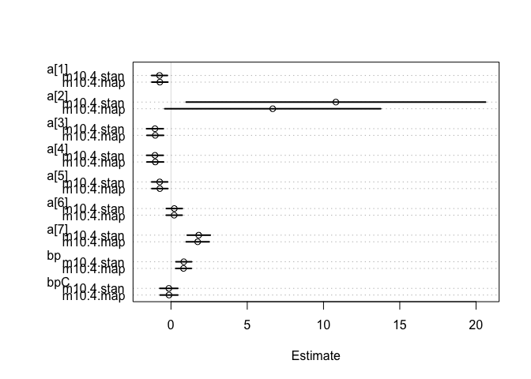
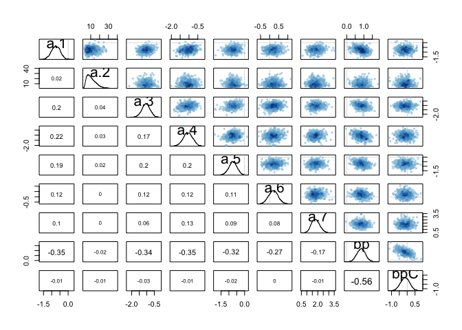

# Chapter_10_Assignment


```r
library(rethinking)
```

```
## Loading required package: rstan
```

```
## Warning: package 'rstan' was built under R version 3.2.5
```

```
## Loading required package: ggplot2
```

```
## Warning: package 'ggplot2' was built under R version 3.2.4
```

```
## Loading required package: StanHeaders
```

```
## Warning: package 'StanHeaders' was built under R version 3.2.5
```

```
## rstan (Version 2.11.1, packaged: 2016-07-28 18:19:31 UTC, GitRev: 85f7a56811da)
```

```
## For execution on a local, multicore CPU with excess RAM we recommend calling
## rstan_options(auto_write = TRUE)
## options(mc.cores = parallel::detectCores())
```

```
## Loading required package: parallel
```

```
## rethinking (Version 1.59)
```

```r
library(ggplot2)
```


## 10E1
_If an event has probability of 0.35 what are the log-odds of this event?_

The log odds are 

```r
log(.35/(1-.35))
```

```
## [1] -0.6190392
```

## 10E2
_If an event has log-odds of 3.2, what is the probability of this event?_

The probability is

```r
logistic(3.2) # this is p/(1-p)
```

```
## [1] 0.9608343
```

## 10E3
_Suppose that a coefficient in a logistic regression has a value of 1.7.  What does this imply about the proportional change in odds ofthe outcome_

There is a proportional increase of

```r
exp(1.7)
```

```
## [1] 5.473947
```
in the odds of the event

## 10E4
_Why do Poisson regressons sometimes require an offset?_

An offset is required of the measurement interval is different for different observations.  Perhaps you are comparing transposon insertion rates in two different species and in one the reported rate is per 100kb and the other is per 10kb.

## 10M1
_Bionomial data can be organized as aggregated or disaggregated without any impact on inference.  The likelihood of the data does change.  Why?_


```r
dbinom(5,10,.5)
```

```
## [1] 0.2460938
```

```r
dbinom(rep(c(0,1),each=5),1,.5)
```

```
##  [1] 0.5 0.5 0.5 0.5 0.5 0.5 0.5 0.5 0.5 0.5
```

The latter does not take into account all of the different ways that the observations could have occured.

## 10M2
_If a coefficint in a Poisson regression has a value of 1.7, what does this imply about the change in outcome?_

For this we need to use the inverse function

```r
exp(1.7)
```

```
## [1] 5.473947
```
each unit of change in the predictor increases the lambda (aka the mean and variance) by 5.47.

## 10M3
_Explain why the logit link is appropriate for a binomial model_

Because it allows modeling of p, the important parameter for the binomial, as a linear function of the predictors, and limits p to between 0 and 1.

## 10M4
_Explain why the log link is appropriate for Poisson GLM_
The log link ensures that the outcome is positive.

## 10M5
_What would it impoly to use a logit link for a Poisson GLM?  Why might you want to_
IT implies that the mean is between 0 and 1.  This makes sense if it is an impossibilty for the event to occur more than once per unit of measurement.  So if you are measureing the number of balls per widget and each widget can only hold a single ball and you measure every widget.

## 10H1

_Use `map` to construct a quadractic approximation of the posterior distribution for m10.4.  Compare to MCMC and explain the similarities and differences_

### First set up the data and run the MCMC model

```r
data("chimpanzees")
d <- chimpanzees
d2 <- d
d2$recipient <- NULL
m10.4.stan <- map2stan(
  alist(
    pulled_left ~ dbinom( 1 , p ) ,
    logit(p) <- a[actor] + (bp + bpC*condition)*prosoc_left ,
    a[actor] ~ dnorm(0,10),
    bp ~ dnorm(0,10),
    bpC ~ dnorm(0,10)
  ),
  data=d2 , chains=2 , iter=2500 , warmup=500 )
```

```
## 
## SAMPLING FOR MODEL 'pulled_left ~ dbinom(1, p)' NOW (CHAIN 1).
## 
## Chain 1, Iteration:    1 / 2500 [  0%]  (Warmup)
## Chain 1, Iteration:  250 / 2500 [ 10%]  (Warmup)
## Chain 1, Iteration:  500 / 2500 [ 20%]  (Warmup)
## Chain 1, Iteration:  501 / 2500 [ 20%]  (Sampling)
## Chain 1, Iteration:  750 / 2500 [ 30%]  (Sampling)
## Chain 1, Iteration: 1000 / 2500 [ 40%]  (Sampling)
## Chain 1, Iteration: 1250 / 2500 [ 50%]  (Sampling)
## Chain 1, Iteration: 1500 / 2500 [ 60%]  (Sampling)
## Chain 1, Iteration: 1750 / 2500 [ 70%]  (Sampling)
## Chain 1, Iteration: 2000 / 2500 [ 80%]  (Sampling)
## Chain 1, Iteration: 2250 / 2500 [ 90%]  (Sampling)
## Chain 1, Iteration: 2500 / 2500 [100%]  (Sampling)
##  Elapsed Time: 0.647754 seconds (Warm-up)
##                1.95672 seconds (Sampling)
##                2.60448 seconds (Total)
## 
## 
## SAMPLING FOR MODEL 'pulled_left ~ dbinom(1, p)' NOW (CHAIN 2).
## 
## Chain 2, Iteration:    1 / 2500 [  0%]  (Warmup)
## Chain 2, Iteration:  250 / 2500 [ 10%]  (Warmup)
## Chain 2, Iteration:  500 / 2500 [ 20%]  (Warmup)
## Chain 2, Iteration:  501 / 2500 [ 20%]  (Sampling)
## Chain 2, Iteration:  750 / 2500 [ 30%]  (Sampling)
## Chain 2, Iteration: 1000 / 2500 [ 40%]  (Sampling)
## Chain 2, Iteration: 1250 / 2500 [ 50%]  (Sampling)
## Chain 2, Iteration: 1500 / 2500 [ 60%]  (Sampling)
## Chain 2, Iteration: 1750 / 2500 [ 70%]  (Sampling)
## Chain 2, Iteration: 2000 / 2500 [ 80%]  (Sampling)
## Chain 2, Iteration: 2250 / 2500 [ 90%]  (Sampling)
## Chain 2, Iteration: 2500 / 2500 [100%]  (Sampling)
##  Elapsed Time: 0.621152 seconds (Warm-up)
##                2.36161 seconds (Sampling)
##                2.98276 seconds (Total)
## 
## 
## SAMPLING FOR MODEL 'pulled_left ~ dbinom(1, p)' NOW (CHAIN 1).
## WARNING: No variance estimation is
##          performed for num_warmup < 20
## 
## 
## Chain 1, Iteration: 1 / 1 [100%]  (Sampling)
##  Elapsed Time: 4e-06 seconds (Warm-up)
##                0.000277 seconds (Sampling)
##                0.000281 seconds (Total)
```

```
## Computing WAIC
```

```
## Constructing posterior predictions
```

```
## [ 400 / 4000 ]
[ 800 / 4000 ]
[ 1200 / 4000 ]
[ 1600 / 4000 ]
[ 2000 / 4000 ]
[ 2400 / 4000 ]
[ 2800 / 4000 ]
[ 3200 / 4000 ]
[ 3600 / 4000 ]
[ 4000 / 4000 ]
```

```
## Warning in map2stan(alist(pulled_left ~ dbinom(1, p), logit(p) <- a[actor] + : There were 7 divergent iterations during sampling.
## Check the chains (trace plots, n_eff, Rhat) carefully to ensure they are valid.
```

### Now run the quadratic approximation

```r
m10.4.map <- map(  alist(
    pulled_left ~ dbinom( 1 , p ) ,
    logit(p) <- a[actor] + (bp + bpC*condition)*prosoc_left ,
    a[actor] ~ dnorm(0,10),
    bp ~ dnorm(0,10),
    bpC ~ dnorm(0,10)
  ),
  data=d2)
```

### compare

```r
precis(m10.4.stan,depth=2)
```

```
## Warning in precis(m10.4.stan, depth = 2): There were 7 divergent iterations during sampling.
## Check the chains (trace plots, n_eff, Rhat) carefully to ensure they are valid.
```

```
##       Mean StdDev lower 0.89 upper 0.89 n_eff Rhat
## a[1] -0.75   0.26      -1.15      -0.31  3125    1
## a[2] 10.91   5.17       3.83      18.26  1312    1
## a[3] -1.05   0.27      -1.47      -0.60  2438    1
## a[4] -1.06   0.27      -1.49      -0.62  2816    1
## a[5] -0.75   0.26      -1.15      -0.31  2843    1
## a[6]  0.20   0.26      -0.24       0.60  2729    1
## a[7]  1.81   0.39       1.20       2.42  2921    1
## bp    0.85   0.25       0.43       1.23  1780    1
## bpC  -0.13   0.29      -0.61       0.31  2661    1
```

```r
precis(m10.4.map,depth=2)
```

```
##       Mean StdDev  5.5% 94.5%
## a[1] -0.73   0.27 -1.16 -0.30
## a[2]  6.68   3.61  0.90 12.45
## a[3] -1.03   0.28 -1.48 -0.59
## a[4] -1.03   0.28 -1.48 -0.59
## a[5] -0.73   0.27 -1.16 -0.30
## a[6]  0.21   0.27 -0.21  0.64
## a[7]  1.75   0.38  1.14  2.37
## bp    0.82   0.26  0.40  1.24
## bpC  -0.13   0.30 -0.61  0.34
```

```r
compare(m10.4.stan,m10.4.map) # not a good idea?
```

```
## Warning in compare(m10.4.stan, m10.4.map): Not all model fits of same class.
## This is usually a bad idea, because it implies they were fit by different algorithms.
## Check yourself, before you wreck yourself.
```

```
##            WAIC pWAIC dWAIC weight    SE  dSE
## m10.4.stan  529   7.9     0      1 19.95   NA
## m10.4.map   551  15.8    22      0 18.58 2.47
```

```r
coeftab(m10.4.map,m10.4.stan)
```

```
##      m10.4.map m10.4.stan
## a[1]   -0.73     -0.75   
## a[2]    6.68     10.91   
## a[3]   -1.03     -1.05   
## a[4]   -1.03     -1.06   
## a[5]   -0.73     -0.75   
## a[6]    0.21      0.20   
## a[7]    1.75      1.81   
## bp      0.82      0.85   
## bpC    -0.13     -0.13   
## nobs     504       504
```

```r
plot(coeftab(m10.4.map,m10.4.stan))
```

<!-- -->

```r
pairs(m10.4.map)
```

<!-- -->

```r
pairs(m10.4.stan)
```

<!-- -->

The models differ the most in the posterior for a2 and a7.  These posteriors have the most non--Guassian distribution.

## 10H2
_Use WAIC to compare m10.4 to the simpler models fit to the same data_

So I guess I shoud fit the all with stan

```r
m10.1.stan <- map2stan(
  alist(
    pulled_left ~ dbinom(1,p),
    logit(p) <- a,
    a ~ dnorm(0,10)
  ),
  data=d2)
```

```
## 
## SAMPLING FOR MODEL 'pulled_left ~ dbinom(1, p)' NOW (CHAIN 1).
## 
## Chain 1, Iteration:    1 / 2000 [  0%]  (Warmup)
## Chain 1, Iteration:  200 / 2000 [ 10%]  (Warmup)
## Chain 1, Iteration:  400 / 2000 [ 20%]  (Warmup)
## Chain 1, Iteration:  600 / 2000 [ 30%]  (Warmup)
## Chain 1, Iteration:  800 / 2000 [ 40%]  (Warmup)
## Chain 1, Iteration: 1000 / 2000 [ 50%]  (Warmup)
## Chain 1, Iteration: 1001 / 2000 [ 50%]  (Sampling)
## Chain 1, Iteration: 1200 / 2000 [ 60%]  (Sampling)
## Chain 1, Iteration: 1400 / 2000 [ 70%]  (Sampling)
## Chain 1, Iteration: 1600 / 2000 [ 80%]  (Sampling)
## Chain 1, Iteration: 1800 / 2000 [ 90%]  (Sampling)
## Chain 1, Iteration: 2000 / 2000 [100%]  (Sampling)
##  Elapsed Time: 0.272146 seconds (Warm-up)
##                0.282721 seconds (Sampling)
##                0.554867 seconds (Total)
## 
## 
## SAMPLING FOR MODEL 'pulled_left ~ dbinom(1, p)' NOW (CHAIN 1).
## WARNING: No variance estimation is
##          performed for num_warmup < 20
## 
## 
## Chain 1, Iteration: 1 / 1 [100%]  (Sampling)
##  Elapsed Time: 4e-06 seconds (Warm-up)
##                0.00021 seconds (Sampling)
##                0.000214 seconds (Total)
```

```
## Computing WAIC
```

```
## Constructing posterior predictions
```

```
## [ 100 / 1000 ]
[ 200 / 1000 ]
[ 300 / 1000 ]
[ 400 / 1000 ]
[ 500 / 1000 ]
[ 600 / 1000 ]
[ 700 / 1000 ]
[ 800 / 1000 ]
[ 900 / 1000 ]
[ 1000 / 1000 ]
```

```r
m10.2.stan <- map2stan(
  alist(
    pulled_left ~ dbinom( 1 , p ) ,
    logit(p) <- a + bp*prosoc_left ,
    a ~ dnorm(0,10) ,
    bp ~ dnorm(0,10)
  ),
  data=d2 )
```

```
## 
## SAMPLING FOR MODEL 'pulled_left ~ dbinom(1, p)' NOW (CHAIN 1).
## 
## Chain 1, Iteration:    1 / 2000 [  0%]  (Warmup)
## Chain 1, Iteration:  200 / 2000 [ 10%]  (Warmup)
## Chain 1, Iteration:  400 / 2000 [ 20%]  (Warmup)
## Chain 1, Iteration:  600 / 2000 [ 30%]  (Warmup)
## Chain 1, Iteration:  800 / 2000 [ 40%]  (Warmup)
## Chain 1, Iteration: 1000 / 2000 [ 50%]  (Warmup)
## Chain 1, Iteration: 1001 / 2000 [ 50%]  (Sampling)
## Chain 1, Iteration: 1200 / 2000 [ 60%]  (Sampling)
## Chain 1, Iteration: 1400 / 2000 [ 70%]  (Sampling)
## Chain 1, Iteration: 1600 / 2000 [ 80%]  (Sampling)
## Chain 1, Iteration: 1800 / 2000 [ 90%]  (Sampling)
## Chain 1, Iteration: 2000 / 2000 [100%]  (Sampling)
##  Elapsed Time: 0.44034 seconds (Warm-up)
##                0.471916 seconds (Sampling)
##                0.912256 seconds (Total)
## 
## 
## SAMPLING FOR MODEL 'pulled_left ~ dbinom(1, p)' NOW (CHAIN 1).
## WARNING: No variance estimation is
##          performed for num_warmup < 20
## 
## 
## Chain 1, Iteration: 1 / 1 [100%]  (Sampling)
##  Elapsed Time: 4e-06 seconds (Warm-up)
##                0.000299 seconds (Sampling)
##                0.000303 seconds (Total)
```

```
## Computing WAIC
## Constructing posterior predictions
```

```
## [ 100 / 1000 ]
[ 200 / 1000 ]
[ 300 / 1000 ]
[ 400 / 1000 ]
[ 500 / 1000 ]
[ 600 / 1000 ]
[ 700 / 1000 ]
[ 800 / 1000 ]
[ 900 / 1000 ]
[ 1000 / 1000 ]
```

```r
m10.3.stan <- map2stan(
  alist(
    pulled_left ~ dbinom( 1 , p ) ,
    logit(p) <- a + (bp + bpC*condition)*prosoc_left ,
    a ~ dnorm(0,10) ,
    bp ~ dnorm(0,10) ,
    bpC ~ dnorm(0,10)
  ), data=d2 )
```

```
## 
## SAMPLING FOR MODEL 'pulled_left ~ dbinom(1, p)' NOW (CHAIN 1).
## 
## Chain 1, Iteration:    1 / 2000 [  0%]  (Warmup)
## Chain 1, Iteration:  200 / 2000 [ 10%]  (Warmup)
## Chain 1, Iteration:  400 / 2000 [ 20%]  (Warmup)
## Chain 1, Iteration:  600 / 2000 [ 30%]  (Warmup)
## Chain 1, Iteration:  800 / 2000 [ 40%]  (Warmup)
## Chain 1, Iteration: 1000 / 2000 [ 50%]  (Warmup)
## Chain 1, Iteration: 1001 / 2000 [ 50%]  (Sampling)
## Chain 1, Iteration: 1200 / 2000 [ 60%]  (Sampling)
## Chain 1, Iteration: 1400 / 2000 [ 70%]  (Sampling)
## Chain 1, Iteration: 1600 / 2000 [ 80%]  (Sampling)
## Chain 1, Iteration: 1800 / 2000 [ 90%]  (Sampling)
## Chain 1, Iteration: 2000 / 2000 [100%]  (Sampling)
##  Elapsed Time: 0.700338 seconds (Warm-up)
##                0.65195 seconds (Sampling)
##                1.35229 seconds (Total)
## 
## 
## SAMPLING FOR MODEL 'pulled_left ~ dbinom(1, p)' NOW (CHAIN 1).
## WARNING: No variance estimation is
##          performed for num_warmup < 20
## 
## 
## Chain 1, Iteration: 1 / 1 [100%]  (Sampling)
##  Elapsed Time: 4e-06 seconds (Warm-up)
##                0.000272 seconds (Sampling)
##                0.000276 seconds (Total)
```

```
## Computing WAIC
## Constructing posterior predictions
```

```
## [ 100 / 1000 ]
[ 200 / 1000 ]
[ 300 / 1000 ]
[ 400 / 1000 ]
[ 500 / 1000 ]
[ 600 / 1000 ]
[ 700 / 1000 ]
[ 800 / 1000 ]
[ 900 / 1000 ]
[ 1000 / 1000 ]
```

```r
compare(m10.1.stan,m10.2.stan,m10.3.stan,m10.4.stan)
```

```
##             WAIC pWAIC dWAIC weight    SE   dSE
## m10.4.stan 529.0   7.9   0.0      1 19.95    NA
## m10.2.stan 680.2   1.8 151.1      0  9.47 19.25
## m10.3.stan 682.0   2.8 153.0      0  9.46 19.17
## m10.1.stan 687.9   1.0 158.9      0  7.11 19.96
```

Conclusion: the model with an individual intercept for each actor is strongly favored.

## 10H4

__(a)__ _Model the relationship between density and percent cover.  In what way does the model do a good and bad job?_


__(b)__ _Can you improve the model by using the FORESTAGE predictor?  Try any models that may be useful.  Explain why FORESTAGE helps or does nothelp_
