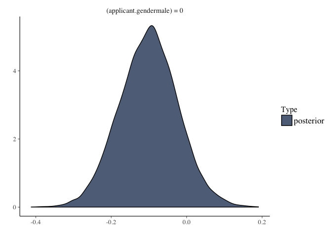
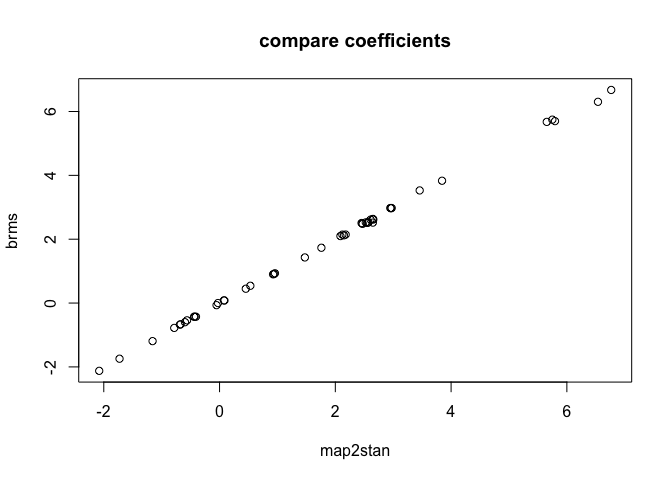
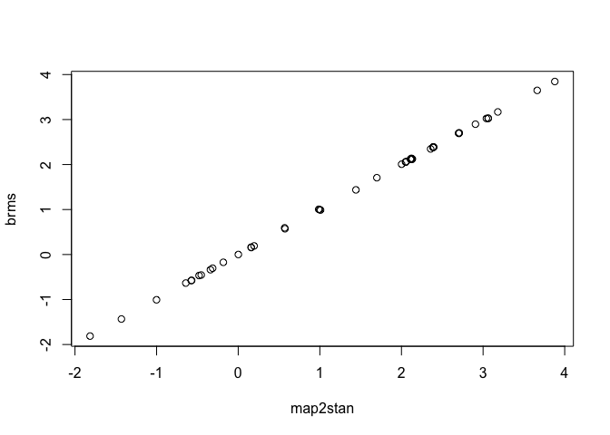

# BRMS homework


To gain familiarity with `brms` I am going to have you refit models from Statistical Rethinking with brms.  In all cases compare the brms and map2stan parameter estimates; they should be effectively the same if you have specified them correctly.

Setup:

```r
library(rethinking)
library(brms)
rstan_options(auto_write = TRUE)
options(mc.cores = parallel::detectCores())
```


## Q1

_Fit model 10.9 (R code 10.28) with brms.  Remember that you should not need to transform the predictors, create dummy variables, nor coerce indexes to use brms.  Compare to the map2stan fit.  Test whether the coefficient for gender is different from 0 in the brms model._

First using map2stan


```r
data(UCBadmit)
d <- UCBadmit
d$male <- ifelse( d$applicant.gender=="male" , 1 , 0 )
d$dept_id <- coerce_index( d$dept )
m10.9 <- map2stan(
  alist(
    admit ~ dbinom( applications , p ) ,
    logit(p) <- a[dept_id] + bm*male ,
    a[dept_id] ~ dnorm(0,10) ,
    bm ~ dnorm(0,10)
  ) , data=d, 
  chains=4,warmup = 1000,iter = 4000 )
```

```
## Warning: Variable 'applicant.gender' contains dots '.'.
## Will attempt to remove dots internally.
```

```
## Warning in FUN(X[[i]], ...): data with name dept is not numeric and not
## used
```

```
## Warning in FUN(X[[i]], ...): data with name applicant_gender is not numeric
## and not used
```

```
## Warning in FUN(X[[i]], ...): data with name dept is not numeric and not
## used
```

```
## Warning in FUN(X[[i]], ...): data with name applicant_gender is not numeric
## and not used
```

```
## Computing WAIC
```

```
## Constructing posterior predictions
```

```
## Aggregated binomial counts detected. Splitting to 0/1 outcome for WAIC calculation.
```


now brms

```r
head(d)
m10.9.brms <- brm(admit | trials(applications) ~ 0 + dept + applicant.gender,
                  family = "binomial",
                  prior = set_prior("normal(0,10)", class="b"),
                  data=d,
                  warmup = 1000,
                  iter = 4000
)
```

```
## Compiling the C++ model
```

```
## Start sampling
```


```r
precis(m10.9,depth=2)
```

```
##       Mean StdDev lower 0.89 upper 0.89 n_eff Rhat
## a[1]  0.68   0.09       0.53       0.84  6438    1
## a[2]  0.64   0.11       0.47       0.81  6555    1
## a[3] -0.58   0.07      -0.69      -0.46  9585    1
## a[4] -0.61   0.08      -0.75      -0.48  8678    1
## a[5] -1.06   0.09      -1.20      -0.91 10361    1
## a[6] -2.64   0.15      -2.88      -2.40 11092    1
## bm   -0.10   0.08      -0.22       0.02  5362    1
```

```r
summary(m10.9.brms)
```

```
##  Family: binomial (logit) 
## Formula: admit | trials(applications) ~ 0 + dept + applicant.gender 
##    Data: d (Number of observations: 12) 
## Samples: 4 chains, each with iter = 4000; warmup = 1000; thin = 1; 
##          total post-warmup samples = 12000
##    WAIC: Not computed
##  
## Population-Level Effects: 
##                      Estimate Est.Error l-95% CI u-95% CI Eff.Sample Rhat
## deptA                    0.68      0.10     0.50     0.87       6085    1
## deptB                    0.64      0.11     0.42     0.86       6305    1
## deptC                   -0.58      0.07    -0.72    -0.44       9172    1
## deptD                   -0.61      0.08    -0.78    -0.45       7864    1
## deptE                   -1.06      0.09    -1.25    -0.88       9254    1
## deptF                   -2.63      0.15    -2.94    -2.34       9366    1
## applicant.gendermale    -0.10      0.08    -0.25     0.05       5140    1
## 
## Samples were drawn using sampling(NUTS). For each parameter, Eff.Sample 
## is a crude measure of effective sample size, and Rhat is the potential 
## scale reduction factor on split chains (at convergence, Rhat = 1).
```

The fits are essentially identical.

To test the effect of gender:


```r
(hyp1 <- hypothesis(m10.9.brms, "applicant.gendermale = 0"))
```

```
## Hypothesis Tests for class b:
##                          Estimate Est.Error l-95% CI u-95% CI Evid.Ratio 
## (applicant.gender... = 0     -0.1      0.08    -0.25     0.05         NA 
## ---
## '*': The expected value under the hypothesis lies outside the 95% CI.
```

```r
plot(hyp1)
```

<!-- -->

No evidence of a gender effect

## Q2

_Refit models 12.1 and 12.2 (Rcode 12.2 and 12.3) with brms_

Get the data


```r
data(reedfrogs)
d <- reedfrogs
# make the tank cluster variable
d$tank <- 1:nrow(d)
head(d)
```

```
##   density pred  size surv propsurv tank
## 1      10   no   big    9      0.9    1
## 2      10   no   big   10      1.0    2
## 3      10   no   big    7      0.7    3
## 4      10   no   big   10      1.0    4
## 5      10   no small    9      0.9    5
## 6      10   no small    9      0.9    6
```


m12.1 with map2stan

```r
m12.1 <- map2stan(
  alist(
    surv ~ dbinom( density , p ) ,
    logit(p) <- a_tank[tank] ,
    a_tank[tank] ~ dnorm( 0 , 5 )
  ), data=d )
```

```
## Warning in FUN(X[[i]], ...): data with name pred is not numeric and not
## used
```

```
## Warning in FUN(X[[i]], ...): data with name size is not numeric and not
## used
```

```
## Warning in FUN(X[[i]], ...): data with name pred is not numeric and not
## used
```

```
## Warning in FUN(X[[i]], ...): data with name size is not numeric and not
## used
```

```
## Computing WAIC
```

```
## Constructing posterior predictions
```

```
## Aggregated binomial counts detected. Splitting to 0/1 outcome for WAIC calculation.
```

model m12.1 with brms


```r
m12.1.brms <- brm(surv | trials(density) ~ 0 + as.factor(tank),
                  prior = set_prior("normal(0,5)", class = "b"),
                  family = "binomial",
                  data=d)
```

```
## Compiling the C++ model
```

```
## Start sampling
```


```r
precis(m12.1, depth=2)
```

```
##             Mean StdDev lower 0.89 upper 0.89 n_eff Rhat
## a_tank[1]   2.45   1.11       0.78       4.29   681 1.00
## a_tank[2]   5.80   2.73       1.78       9.94   702 1.00
## a_tank[3]   0.92   0.72      -0.20       2.01   960 1.00
## a_tank[4]   5.75   2.82       1.49       9.48   479 1.00
## a_tank[5]   2.53   1.19       0.56       4.18   823 1.00
## a_tank[6]   2.46   1.12       0.78       4.21   827 1.00
## a_tank[7]   5.65   2.84       1.92       9.83   395 1.01
## a_tank[8]   2.57   1.28       0.63       4.52   615 1.00
## a_tank[9]  -0.43   0.70      -1.60       0.58  1000 1.00
## a_tank[10]  2.65   1.27       0.60       4.41   699 1.00
## a_tank[11]  0.94   0.75      -0.20       2.15   823 1.00
## a_tank[12]  0.45   0.69      -0.55       1.64  1000 1.00
## a_tank[13]  0.96   0.74      -0.27       2.05  1000 1.00
## a_tank[14] -0.03   0.69      -1.10       1.07  1000 1.00
## a_tank[15]  2.55   1.23       0.62       4.30   686 1.00
## a_tank[16]  2.55   1.23       0.67       4.49   707 1.00
## a_tank[17]  3.46   1.08       1.95       5.20   709 1.00
## a_tank[18]  2.66   0.82       1.34       3.81   722 1.00
## a_tank[19]  2.09   0.66       1.11       3.03   736 1.00
## a_tank[20]  6.54   2.69       2.63      10.34   585 1.00
## a_tank[21]  2.64   0.82       1.38       3.83   740 1.00
## a_tank[22]  2.65   0.78       1.37       3.77  1000 1.00
## a_tank[23]  2.61   0.78       1.42       3.81   845 1.00
## a_tank[24]  1.76   0.58       0.72       2.52   737 1.00
## a_tank[25] -1.16   0.48      -1.91      -0.37  1000 1.00
## a_tank[26]  0.08   0.41      -0.64       0.67  1000 1.00
## a_tank[27] -1.73   0.55      -2.57      -0.84   486 1.00
## a_tank[28] -0.60   0.42      -1.23       0.11   803 1.00
## a_tank[29]  0.08   0.41      -0.55       0.78   970 1.00
## a_tank[30]  1.47   0.55       0.65       2.37  1000 1.00
## a_tank[31] -0.78   0.42      -1.38      -0.05  1000 1.00
## a_tank[32] -0.44   0.39      -1.15       0.07   946 1.00
## a_tank[33]  3.84   1.09       2.34       5.67  1000 1.00
## a_tank[34]  2.95   0.77       1.80       4.13  1000 1.00
## a_tank[35]  2.96   0.82       1.80       4.25   642 1.00
## a_tank[36]  2.15   0.58       1.31       3.08   614 1.00
## a_tank[37]  2.18   0.58       1.32       3.09   786 1.00
## a_tank[38]  6.77   2.53       2.84      10.05   632 1.00
## a_tank[39]  2.97   0.78       1.74       4.14   824 1.00
## a_tank[40]  2.47   0.62       1.50       3.38   749 1.00
## a_tank[41] -2.08   0.54      -2.93      -1.25   784 1.00
## a_tank[42] -0.67   0.36      -1.26      -0.13   900 1.00
## a_tank[43] -0.56   0.35      -1.12      -0.02  1000 1.00
## a_tank[44] -0.41   0.34      -0.93       0.12   821 1.00
## a_tank[45]  0.53   0.36       0.00       1.11   974 1.00
## a_tank[46] -0.68   0.38      -1.34      -0.12  1000 1.00
## a_tank[47]  2.12   0.51       1.37       2.97   960 1.00
## a_tank[48] -0.05   0.33      -0.53       0.53   952 1.00
```

```r
summary(m12.1.brms)
```

```
##  Family: binomial (logit) 
## Formula: surv | trials(density) ~ 0 + as.factor(tank) 
##    Data: d (Number of observations: 48) 
## Samples: 4 chains, each with iter = 2000; warmup = 1000; thin = 1; 
##          total post-warmup samples = 4000
##    WAIC: Not computed
##  
## Population-Level Effects: 
##                 Estimate Est.Error l-95% CI u-95% CI Eff.Sample Rhat
## as.factortank1      2.51      1.14     0.61     5.08       3220    1
## as.factortank2      5.70      2.72     1.75    12.12       2722    1
## as.factortank3      0.90      0.70    -0.39     2.40       4000    1
## as.factortank4      5.74      2.76     1.73    12.32       2897    1
## as.factortank5      2.53      1.20     0.59     5.31       2754    1
## as.factortank6      2.49      1.15     0.64     5.31       4000    1
## as.factortank7      5.67      2.74     1.74    12.39       2768    1
## as.factortank8      2.53      1.18     0.68     5.26       2963    1
## as.factortank9     -0.43      0.66    -1.77     0.83       4000    1
## as.factortank10     2.52      1.18     0.62     5.28       4000    1
## as.factortank11     0.91      0.73    -0.43     2.46       4000    1
## as.factortank12     0.45      0.68    -0.80     1.85       4000    1
## as.factortank13     0.93      0.73    -0.42     2.48       4000    1
## as.factortank14     0.00      0.67    -1.32     1.33       4000    1
## as.factortank15     2.52      1.20     0.57     5.35       2905    1
## as.factortank16     2.51      1.15     0.68     5.21       3076    1
## as.factortank17     3.53      1.15     1.76     6.14       2583    1
## as.factortank18     2.62      0.80     1.29     4.40       4000    1
## as.factortank19     2.10      0.62     0.99     3.46       4000    1
## as.factortank20     6.30      2.48     2.70    12.20       2805    1
## as.factortank21     2.63      0.81     1.30     4.48       3199    1
## as.factortank22     2.64      0.81     1.33     4.49       3416    1
## as.factortank23     2.61      0.79     1.27     4.42       4000    1
## as.factortank24     1.73      0.55     0.74     2.93       4000    1
## as.factortank25    -1.19      0.47    -2.18    -0.33       4000    1
## as.factortank26     0.08      0.40    -0.72     0.87       4000    1
## as.factortank27    -1.74      0.56    -2.93    -0.74       4000    1
## as.factortank28    -0.60      0.43    -1.46     0.23       4000    1
## as.factortank29     0.08      0.42    -0.75     0.90       4000    1
## as.factortank30     1.43      0.51     0.49     2.49       4000    1
## as.factortank31    -0.78      0.44    -1.69     0.04       4000    1
## as.factortank32    -0.43      0.42    -1.29     0.36       4000    1
## as.factortank33     3.83      1.12     2.12     6.44       2439    1
## as.factortank34     2.98      0.77     1.70     4.74       4000    1
## as.factortank35     2.97      0.76     1.70     4.65       4000    1
## as.factortank36     2.12      0.53     1.18     3.25       4000    1
## as.factortank37     2.15      0.56     1.16     3.33       4000    1
## as.factortank38     6.68      2.59     3.06    12.98       2643    1
## as.factortank39     2.98      0.77     1.68     4.73       4000    1
## as.factortank40     2.48      0.65     1.37     3.90       4000    1
## as.factortank41    -2.12      0.54    -3.31    -1.16       4000    1
## as.factortank42    -0.66      0.36    -1.37     0.03       4000    1
## as.factortank43    -0.54      0.36    -1.27     0.15       4000    1
## as.factortank44    -0.43      0.36    -1.13     0.26       4000    1
## as.factortank45     0.54      0.36    -0.16     1.28       4000    1
## as.factortank46    -0.68      0.36    -1.43     0.02       4000    1
## as.factortank47     2.14      0.56     1.17     3.37       4000    1
## as.factortank48    -0.07      0.35    -0.73     0.60       4000    1
## 
## Samples were drawn using sampling(NUTS). For each parameter, Eff.Sample 
## is a crude measure of effective sample size, and Rhat is the potential 
## scale reduction factor on split chains (at convergence, Rhat = 1).
```

```r
plot(coef(m12.1),fixef(m12.1.brms), xlab="map2stan", ylab="brms",main= "compare coefficients")
```

<!-- -->

same estimates


```r
m12.2 <- map2stan(
  alist(
    surv ~ dbinom( density , p ) ,
    logit(p) <- a_tank[tank] ,
    a_tank[tank] ~ dnorm( a , sigma ) ,
    a ~ dnorm(0,1) ,
    sigma ~ dcauchy(0,1)
  ), data=d , iter=4000 , chains=4 )
```

```
## Warning in FUN(X[[i]], ...): data with name pred is not numeric and not
## used
```

```
## Warning in FUN(X[[i]], ...): data with name size is not numeric and not
## used
```

```
## The following numerical problems occured the indicated number of times on chain 1
```

```
##                                                                                 count
## Exception thrown at line 17: normal_log: Scale parameter is 0, but must be > 0!     1
```

```
## When a numerical problem occurs, the Hamiltonian proposal gets rejected.
```

```
## See http://mc-stan.org/misc/warnings.html#exception-hamiltonian-proposal-rejected
```

```
## If the number in the 'count' column is small, do not ask about this message on stan-users.
```

```
## The following numerical problems occured the indicated number of times on chain 4
```

```
##                                                                                 count
## Exception thrown at line 17: normal_log: Scale parameter is 0, but must be > 0!     1
```

```
## When a numerical problem occurs, the Hamiltonian proposal gets rejected.
```

```
## See http://mc-stan.org/misc/warnings.html#exception-hamiltonian-proposal-rejected
```

```
## If the number in the 'count' column is small, do not ask about this message on stan-users.
```

```
## Warning in FUN(X[[i]], ...): data with name pred is not numeric and not
## used

## Warning in FUN(X[[i]], ...): data with name size is not numeric and not
## used
```

```
## Computing WAIC
```

```
## Constructing posterior predictions
```

```
## Aggregated binomial counts detected. Splitting to 0/1 outcome for WAIC calculation.
```


In map2stan you can set a prior on the mean of the random effect.  I am not sure how to do that in brms, so I just include a normal intercept.

```r
m12.2.brms <- brm( surv | trials(density) ~ (1|tank),
                   family="binomial",
                   prior=c(
                     set_prior("normal(0,1)", class="Intercept"),
                     set_prior("cauchy(0,1)", class="sd")),
                   data=d,
                   iter=4000)
```

```
## Compiling the C++ model
```

```
## Start sampling
```


```r
print("map2stan")
```

```
## [1] "map2stan"
```

```r
precis(m12.2,depth=2)
```

```
##             Mean StdDev lower 0.89 upper 0.89 n_eff Rhat
## a_tank[1]   2.12   0.87       0.71       3.40  8000    1
## a_tank[2]   3.06   1.10       1.30       4.69  8000    1
## a_tank[3]   1.01   0.68      -0.05       2.09  8000    1
## a_tank[4]   3.06   1.12       1.27       4.73  8000    1
## a_tank[5]   2.11   0.87       0.76       3.46  8000    1
## a_tank[6]   2.12   0.88       0.72       3.48  8000    1
## a_tank[7]   3.04   1.10       1.32       4.74  8000    1
## a_tank[8]   2.13   0.88       0.75       3.50  8000    1
## a_tank[9]  -0.18   0.62      -1.19       0.79  8000    1
## a_tank[10]  2.13   0.86       0.75       3.43  8000    1
## a_tank[11]  0.99   0.66      -0.06       2.04  8000    1
## a_tank[12]  0.57   0.63      -0.50       1.50  8000    1
## a_tank[13]  1.00   0.68      -0.06       2.07  8000    1
## a_tank[14]  0.19   0.61      -0.80       1.15  8000    1
## a_tank[15]  2.13   0.88       0.67       3.40  8000    1
## a_tank[16]  2.11   0.87       0.76       3.44  8000    1
## a_tank[17]  2.91   0.78       1.61       4.02  8000    1
## a_tank[18]  2.39   0.66       1.37       3.41  8000    1
## a_tank[19]  2.00   0.58       1.09       2.92  8000    1
## a_tank[20]  3.66   1.02       2.07       5.19  8000    1
## a_tank[21]  2.39   0.67       1.36       3.45  8000    1
## a_tank[22]  2.40   0.66       1.30       3.37  8000    1
## a_tank[23]  2.39   0.67       1.29       3.36  8000    1
## a_tank[24]  1.70   0.53       0.88       2.54  8000    1
## a_tank[25] -1.00   0.44      -1.65      -0.25  8000    1
## a_tank[26]  0.16   0.40      -0.50       0.78  8000    1
## a_tank[27] -1.43   0.50      -2.20      -0.64  8000    1
## a_tank[28] -0.48   0.40      -1.13       0.15  8000    1
## a_tank[29]  0.16   0.40      -0.47       0.80  8000    1
## a_tank[30]  1.44   0.48       0.71       2.22  8000    1
## a_tank[31] -0.64   0.42      -1.33       0.00  8000    1
## a_tank[32] -0.31   0.40      -0.92       0.36  8000    1
## a_tank[33]  3.18   0.76       1.95       4.32  8000    1
## a_tank[34]  2.70   0.64       1.69       3.68  8000    1
## a_tank[35]  2.71   0.65       1.66       3.68  8000    1
## a_tank[36]  2.05   0.51       1.25       2.86  8000    1
## a_tank[37]  2.05   0.50       1.19       2.79  8000    1
## a_tank[38]  3.88   0.98       2.30       5.28  8000    1
## a_tank[39]  2.71   0.65       1.67       3.69  8000    1
## a_tank[40]  2.36   0.57       1.48       3.27  8000    1
## a_tank[41] -1.82   0.48      -2.56      -1.03  8000    1
## a_tank[42] -0.57   0.34      -1.14      -0.04  8000    1
## a_tank[43] -0.45   0.33      -0.96       0.11  8000    1
## a_tank[44] -0.34   0.34      -0.89       0.18  8000    1
## a_tank[45]  0.57   0.34       0.01       1.10  8000    1
## a_tank[46] -0.58   0.35      -1.12      -0.02  8000    1
## a_tank[47]  2.06   0.51       1.24       2.86  8000    1
## a_tank[48]  0.00   0.33      -0.52       0.55  8000    1
## a           1.30   0.25       0.88       1.68  8000    1
## sigma       1.62   0.21       1.29       1.95  5064    1
```

```r
print("----------")
```

```
## [1] "----------"
```

```r
print("brms")
```

```
## [1] "brms"
```

```r
summary(m12.2.brms)
```

```
##  Family: binomial (logit) 
## Formula: surv | trials(density) ~ (1 | tank) 
##    Data: d (Number of observations: 48) 
## Samples: 4 chains, each with iter = 4000; warmup = 2000; thin = 1; 
##          total post-warmup samples = 8000
##    WAIC: Not computed
##  
## Group-Level Effects: 
## ~tank (Number of levels: 48) 
##               Estimate Est.Error l-95% CI u-95% CI Eff.Sample Rhat
## sd(Intercept)     1.59       0.2     1.24     2.04       2087    1
## 
## Population-Level Effects: 
##           Estimate Est.Error l-95% CI u-95% CI Eff.Sample Rhat
## Intercept      1.3      0.24     0.84     1.78       1410    1
## 
## Samples were drawn using sampling(NUTS). For each parameter, Eff.Sample 
## is a crude measure of effective sample size, and Rhat is the potential 
## scale reduction factor on split chains (at convergence, Rhat = 1).
```

To get the coefficients to line up I need to add the fixed effect intercept from brms to the ranef estimates

```r
plot(coef(m12.2)[1:48],ranef(m12.2.brms)$tank+fixef(m12.2.brms)[,"mean"],xlab="map2stan",ylab="brms")
```

<!-- -->


## Q3

Use both brms and map2stan to fit a model for `intleng` as a function of `species`, `trt` and their interaction, and include `shelf` as a random effect.

Get the data and set it up for map2stan

```r
tomato <- read.csv("../Assignment_Chapter_09/TomatoR2CSHL.csv")
d.tomato <- tomato #for map2stan
d.tomato$species_id <- coerce_index(tomato$species)
d.tomato$shelf_id <- coerce_index(tomato$shelf)
d.tomato$shade <- ifelse(tomato$trt=="L",1,0)
d.tomato <- na.omit(d.tomato[,c("intleng","species_id","shelf_id","shade","species")])
mean(d.tomato$intleng)
```

```
## [1] 20.34021
```

map2stan fit

```r
mq3 <- map2stan(alist(
  intleng ~ dnorm(mu,sigma),
  mu <- a_species[species_id] + b_shade_species[species_id]*shade + a_shelf[shelf_id],
  sigma ~ dcauchy(0,1),
  a_species[species_id] ~ dnorm(20,10),
  a_shelf[shelf_id] ~ dnorm(0,sigma_shelf),
  sigma_shelf ~ dcauchy(0,1),
  b_shade_species[species_id] ~ dnorm(0,10)
),
data=d.tomato,
chains = 4,
iter=5000
)
```

```
## Warning in FUN(X[[i]], ...): data with name species is not numeric and not
## used
```

```
## The following numerical problems occured the indicated number of times on chain 3
```

```
##                                                                                 count
## Exception thrown at line 27: normal_log: Scale parameter is 0, but must be > 0!     2
```

```
## When a numerical problem occurs, the Hamiltonian proposal gets rejected.
```

```
## See http://mc-stan.org/misc/warnings.html#exception-hamiltonian-proposal-rejected
```

```
## If the number in the 'count' column is small, do not ask about this message on stan-users.
```

```
## Warning: There were 2 divergent transitions after warmup. Increasing adapt_delta above 0.8 may help. See
## http://mc-stan.org/misc/warnings.html#divergent-transitions-after-warmup
```

```
## Warning: Examine the pairs() plot to diagnose sampling problems
```

```
## Warning in FUN(X[[i]], ...): data with name species is not numeric and not
## used
```

```
## Computing WAIC
```

```
## Constructing posterior predictions
```

```
## Warning in map2stan(alist(intleng ~ dnorm(mu, sigma), mu <- a_species[species_id] + : There were 2 divergent iterations during sampling.
## Check the chains (trace plots, n_eff, Rhat) carefully to ensure they are valid.
```

brms fit

the prior specification gets ugly here becuase I am trying to match the individual intercept paramterization that I used for map2stan

```r
mq3.brms <- brm(intleng ~ 0 + species*trt + (1|shelf),
                prior = c(
                  set_prior("normal(0,10)",class = "b"), #for trtL and interactions
                  set_prior("normal(20,10)", class = "b", coef = "speciesS.chilense"),
                  set_prior("normal(20,10)", class = "b", coef = "speciesS.chmielewskii"),
                  set_prior("normal(20,10)", class = "b", coef = "speciesS.habrochaites"),
                  set_prior("normal(20,10)", class = "b", coef = "speciesS.pennellii"),
                  set_prior("normal(20,10)", class = "b", coef = "speciesS.peruvianum"),
                  
                  set_prior("cauchy(0,1)", class = "sigma"), #for overall sigma
                  set_prior("cauchy(0,1)", class = "sd") # for shelf
                ),
                data=tomato,
                iter=5000
)
```

```
## Compiling the C++ model
```

```
## Start sampling
```

```
## Warning: There were 9 divergent transitions after warmup. Increasing adapt_delta above 0.8 may help. See
## http://mc-stan.org/misc/warnings.html#divergent-transitions-after-warmup
```

```
## Warning: Examine the pairs() plot to diagnose sampling problems
```


```r
precis(mq3,depth=2)
```

```
## Warning in precis(mq3, depth = 2): There were 2 divergent iterations during sampling.
## Check the chains (trace plots, n_eff, Rhat) carefully to ensure they are valid.
```

```
##                     Mean StdDev lower 0.89 upper 0.89 n_eff Rhat
## sigma              10.60   0.23      10.23      10.96  3819 1.00
## a_species[1]        9.26   3.22       4.66      14.20   652 1.00
## a_species[2]       17.32   3.24      12.75      22.38   646 1.00
## a_species[3]       18.86   3.23      14.30      23.90   645 1.00
## a_species[4]        9.29   3.29       4.23      14.24   683 1.00
## a_species[5]       16.97   3.23      12.36      21.98   653 1.00
## a_shelf[1]          0.77   2.66      -2.84       4.76  1005 1.00
## a_shelf[2]          4.61   2.96       0.47       8.92   835 1.00
## a_shelf[3]          1.57   2.71      -1.96       5.69   973 1.00
## a_shelf[4]         -3.53   3.23      -8.40       0.89   624 1.00
## a_shelf[5]         -3.97   3.30      -8.93       0.53   623 1.00
## a_shelf[6]         -2.88   3.15      -7.76       1.29   628 1.00
## sigma_shelf         3.91   3.03       0.55       7.77   700 1.00
## b_shade_species[1] 15.84   4.97       8.06      22.85   588 1.01
## b_shade_species[2]  8.02   4.97       0.60      15.45   581 1.01
## b_shade_species[3] 11.33   4.94       3.72      18.38   583 1.00
## b_shade_species[4] 11.23   5.06       3.38      18.72   598 1.00
## b_shade_species[5] 12.28   4.96       4.54      19.39   585 1.01
```

```r
summary(mq3.brms)
```

```
##  Family: gaussian (identity) 
## Formula: intleng ~ 0 + species * trt + (1 | shelf) 
##    Data: tomato (Number of observations: 1008) 
## Samples: 4 chains, each with iter = 5000; warmup = 2500; thin = 1; 
##          total post-warmup samples = 10000
##    WAIC: Not computed
##  
## Group-Level Effects: 
## ~shelf (Number of levels: 6) 
##               Estimate Est.Error l-95% CI u-95% CI Eff.Sample Rhat
## sd(Intercept)     1.66      0.94     0.39      4.1       2074    1
## 
## Population-Level Effects: 
##                            Estimate Est.Error l-95% CI u-95% CI Eff.Sample
## speciesS.chilense              6.72      1.48     4.02     9.99       2545
## speciesS.chmielewskii         14.40      1.50    11.75    17.68       2609
## speciesS.habrochaites         15.94      1.46    13.33    19.29       2729
## speciesS.pennellii             6.30      1.72     3.10     9.94       3303
## speciesS.peruvianum           14.08      1.50    11.40    17.45       2716
## trtL                          20.23      2.07    15.52    23.94       2542
## speciesS.chmielewskii:trtL    -7.03      1.90   -10.84    -3.36       5869
## speciesS.habrochaites:trtL    -3.80      1.90    -7.51    -0.08       5559
## speciesS.pennellii:trtL       -3.60      2.21    -7.91     0.77       5711
## speciesS.peruvianum:trtL      -2.79      1.92    -6.55     1.04       5666
##                            Rhat
## speciesS.chilense             1
## speciesS.chmielewskii         1
## speciesS.habrochaites         1
## speciesS.pennellii            1
## speciesS.peruvianum           1
## trtL                          1
## speciesS.chmielewskii:trtL    1
## speciesS.habrochaites:trtL    1
## speciesS.pennellii:trtL       1
## speciesS.peruvianum:trtL      1
## 
## Family Specific Parameters: 
##       Estimate Est.Error l-95% CI u-95% CI Eff.Sample Rhat
## sigma     10.6      0.24    10.15    11.07       8852    1
## 
## Samples were drawn using sampling(NUTS). For each parameter, Eff.Sample 
## is a crude measure of effective sample size, and Rhat is the potential 
## scale reduction factor on split chains (at convergence, Rhat = 1).
```

```r
ranef(mq3.brms)
```

```
## $shelf
##    Intercept
## U -1.0298602
## V  2.0940525
## W -0.4051713
## X -0.7331507
## Y -1.0669493
## Z -0.1575901
```

The shelf effects are too large in the map2stan model.

## Try with intercept being equal to S.chilense


```r
library(reshape2)
d.tomato$index <- 1:nrow(d.tomato)
d.tomato2 <- dcast(d.tomato,index + intleng + shelf_id + shade ~ species, value.var="species",fun.aggregate = length )
colnames(d.tomato2) <- sub(". ","_",colnames(d.tomato2),fixed=T)
head(d.tomato2)
```

```
##   index intleng shelf_id shade S_chilense S_chmielewskii S_habrochaites
## 1     1    6.34        6     0          0              0              0
## 2     2   14.16        6     0          0              0              0
## 3     3   21.21        6     0          0              0              0
## 4     4    2.77        6     0          1              0              0
## 5     5    2.79        6     0          1              0              0
## 6     6   18.24        6     0          0              1              0
##   S_pennellii S_peruvianum
## 1           1            0
## 2           0            1
## 3           0            1
## 4           0            0
## 5           0            0
## 6           0            0
```
map2stan fit

```r
mq3.2 <- map2stan(alist(
  intleng ~ dnorm(mu,sigma),
  mu <- a + 
    b_chm * S_chmielewskii +
    b_hab * S_habrochaites +
    b_pen * S_pennellii +
    b_per * S_peruvianum +
    b_shade * shade + 
    b_chm_shade * S_chmielewskii * shade +
    b_hab_shade * S_habrochaites * shade +
    b_pen_shade * S_pennellii * shade +
    b_per_shade * S_peruvianum * shade +    
    a_shelf[shelf_id],
  a ~ dnorm(20,10),
  c(b_chm,b_hab,b_pen,b_per,b_shade,b_chm_shade,b_hab_shade,b_pen_shade,b_per_shade) ~ dnorm(0,10),
  sigma ~ dcauchy(0,1),
  a_shelf[shelf_id] ~ dnorm(0,sigma_shelf),
  sigma_shelf ~ dcauchy(0,1)
),
data=d.tomato2,
chains = 4,
iter=5000
)
```

```
## The following numerical problems occured the indicated number of times on chain 3
```

```
##                                                                                 count
## Exception thrown at line 45: normal_log: Scale parameter is 0, but must be > 0!     1
```

```
## When a numerical problem occurs, the Hamiltonian proposal gets rejected.
```

```
## See http://mc-stan.org/misc/warnings.html#exception-hamiltonian-proposal-rejected
```

```
## If the number in the 'count' column is small, do not ask about this message on stan-users.
```

```
## Warning: There were 1 divergent transitions after warmup. Increasing adapt_delta above 0.8 may help. See
## http://mc-stan.org/misc/warnings.html#divergent-transitions-after-warmup
```

```
## Warning: Examine the pairs() plot to diagnose sampling problems
```

```
## Computing WAIC
```

```
## Constructing posterior predictions
```

```
## Warning in map2stan(alist(intleng ~ dnorm(mu, sigma), mu <- a + b_chm * : There were 1 divergent iterations during sampling.
## Check the chains (trace plots, n_eff, Rhat) carefully to ensure they are valid.
```

brms fit


```r
mq3.2.brms <- brm(intleng ~ + species*trt + (1|shelf),
                prior = c(
                  set_prior("normal(20,10)",class = "Intercept"),
                  set_prior("normal(0,10)",class = "b"), #for species, shade, and interactions
                  set_prior("cauchy(0,1)", class = "sigma"), #for overall sigma
                  set_prior("cauchy(0,1)", class = "sd") # for shelf
                ),
                data=tomato,
                iter=5000
)
```

```
## Compiling the C++ model
```

```
## Start sampling
```

```
## Warning: There were 10 divergent transitions after warmup. Increasing adapt_delta above 0.8 may help. See
## http://mc-stan.org/misc/warnings.html#divergent-transitions-after-warmup
```

```
## Warning: Examine the pairs() plot to diagnose sampling problems
```


```r
print("map2stan")
```

```
## [1] "map2stan"
```

```r
precis(mq3.2,depth=2)
```

```
## Warning in precis(mq3.2, depth = 2): There were 1 divergent iterations during sampling.
## Check the chains (trace plots, n_eff, Rhat) carefully to ensure they are valid.
```

```
##              Mean StdDev lower 0.89 upper 0.89 n_eff Rhat
## a            6.71   1.50       4.35       8.73  2049    1
## b_chm        7.31   1.36       5.20       9.54  5503    1
## b_hab        8.88   1.31       6.76      10.93  5543    1
## b_pen       -0.91   1.62      -3.49       1.65  5307    1
## b_per        6.98   1.38       4.76       9.16  5545    1
## b_shade     20.26   2.11      17.37      23.41  1959    1
## b_chm_shade -6.68   1.90      -9.67      -3.63  5375    1
## b_hab_shade -3.46   1.86      -6.37      -0.43  5697    1
## b_pen_shade -3.12   2.20      -6.75       0.33  5235    1
## b_per_shade -2.42   1.91      -5.42       0.63  5270    1
## sigma       10.60   0.23      10.22      10.96  9285    1
## a_shelf[1]  -1.02   1.22      -2.86       0.70  3784    1
## a_shelf[2]   2.07   1.37       0.04       3.98  2605    1
## a_shelf[3]  -0.41   1.21      -2.33       1.24  3227    1
## a_shelf[4]  -0.49   1.32      -2.27       1.37  2194    1
## a_shelf[5]  -0.81   1.36      -2.67       1.01  1897    1
## a_shelf[6]   0.10   1.29      -1.63       1.91  1995    1
## sigma_shelf  1.61   1.00       0.34       2.67  1708    1
```

```r
print("----------------")
```

```
## [1] "----------------"
```

```r
print("brms")
```

```
## [1] "brms"
```

```r
summary(mq3.2.brms)
```

```
##  Family: gaussian (identity) 
## Formula: intleng ~ +species * trt + (1 | shelf) 
##    Data: tomato (Number of observations: 1008) 
## Samples: 4 chains, each with iter = 5000; warmup = 2500; thin = 1; 
##          total post-warmup samples = 10000
##    WAIC: Not computed
##  
## Group-Level Effects: 
## ~shelf (Number of levels: 6) 
##               Estimate Est.Error l-95% CI u-95% CI Eff.Sample Rhat
## sd(Intercept)     1.52       0.8     0.34     3.48       2198    1
## 
## Population-Level Effects: 
##                            Estimate Est.Error l-95% CI u-95% CI Eff.Sample
## Intercept                      6.33      1.36     3.77     9.05       3428
## speciesS.chmielewskii          7.46      1.37     4.81    10.07       4868
## speciesS.habrochaites          9.01      1.35     6.29    11.57       4730
## speciesS.pennellii            -0.76      1.62    -3.96     2.38       5622
## speciesS.peruvianum            7.14      1.40     4.37     9.90       5153
## trtL                          20.67      1.86    16.78    24.13       3138
## speciesS.chmielewskii:trtL    -6.84      1.86   -10.51    -3.23       4623
## speciesS.habrochaites:trtL    -3.60      1.93    -7.37     0.24       4575
## speciesS.pennellii:trtL       -3.28      2.20    -7.59     1.03       5398
## speciesS.peruvianum:trtL      -2.59      1.92    -6.27     1.19       4677
##                            Rhat
## Intercept                     1
## speciesS.chmielewskii         1
## speciesS.habrochaites         1
## speciesS.pennellii            1
## speciesS.peruvianum           1
## trtL                          1
## speciesS.chmielewskii:trtL    1
## speciesS.habrochaites:trtL    1
## speciesS.pennellii:trtL       1
## speciesS.peruvianum:trtL      1
## 
## Family Specific Parameters: 
##       Estimate Est.Error l-95% CI u-95% CI Eff.Sample Rhat
## sigma     10.6      0.23    10.17    11.07      10000    1
## 
## Samples were drawn using sampling(NUTS). For each parameter, Eff.Sample 
## is a crude measure of effective sample size, and Rhat is the potential 
## scale reduction factor on split chains (at convergence, Rhat = 1).
```

```r
ranef(mq3.2.brms)
```

```
## $shelf
##    Intercept
## U -1.0239044
## V  2.0075573
## W -0.4036826
## X -0.2679950
## Y -0.5909341
## Z  0.3211905
```

Okay, these are really similar.  Not sure what is going wrong with the earlier specification.
