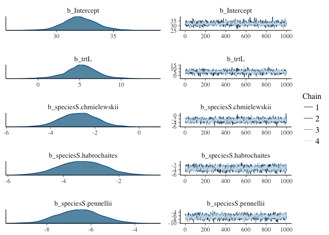
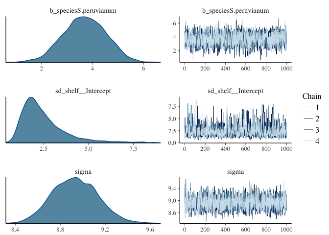
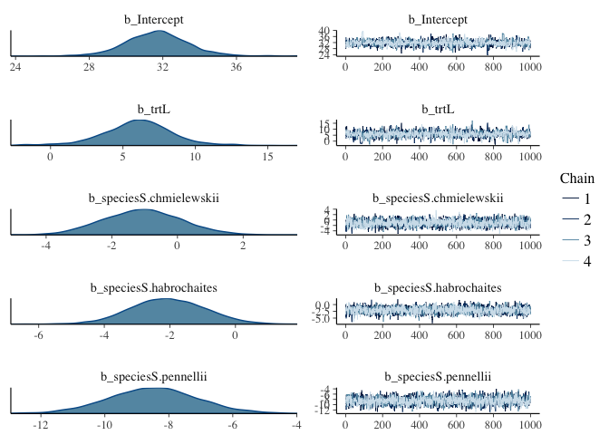
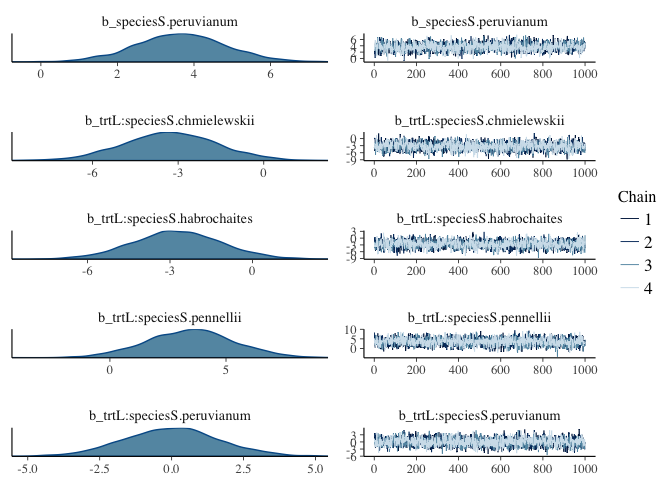
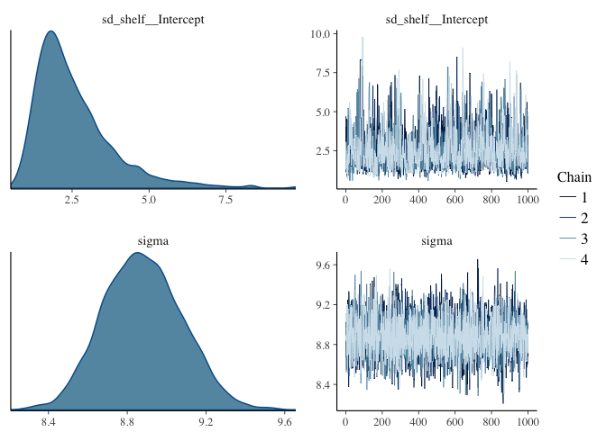
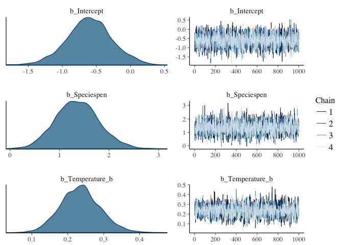
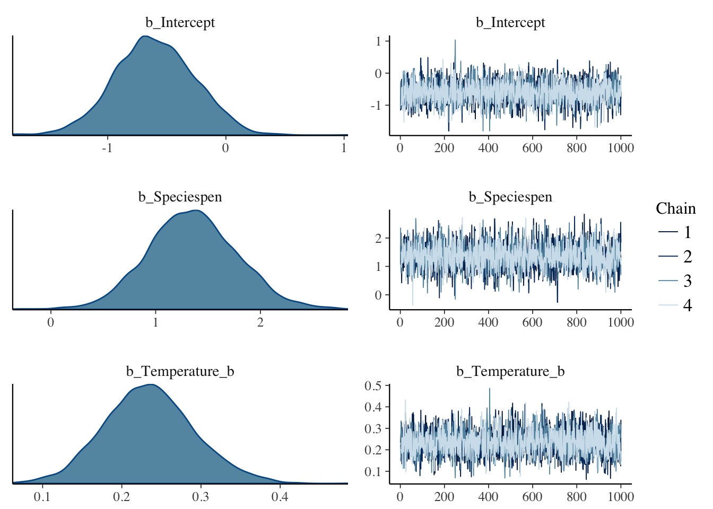
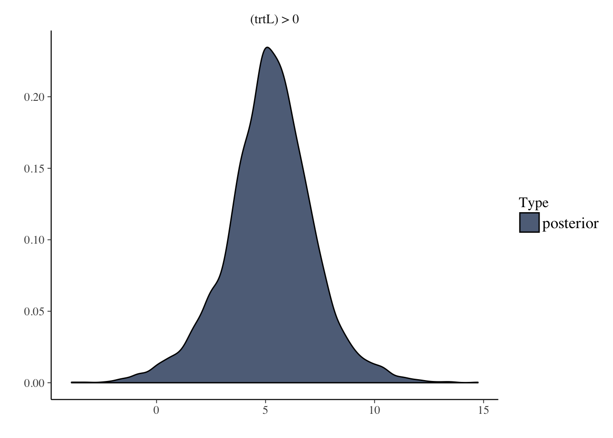
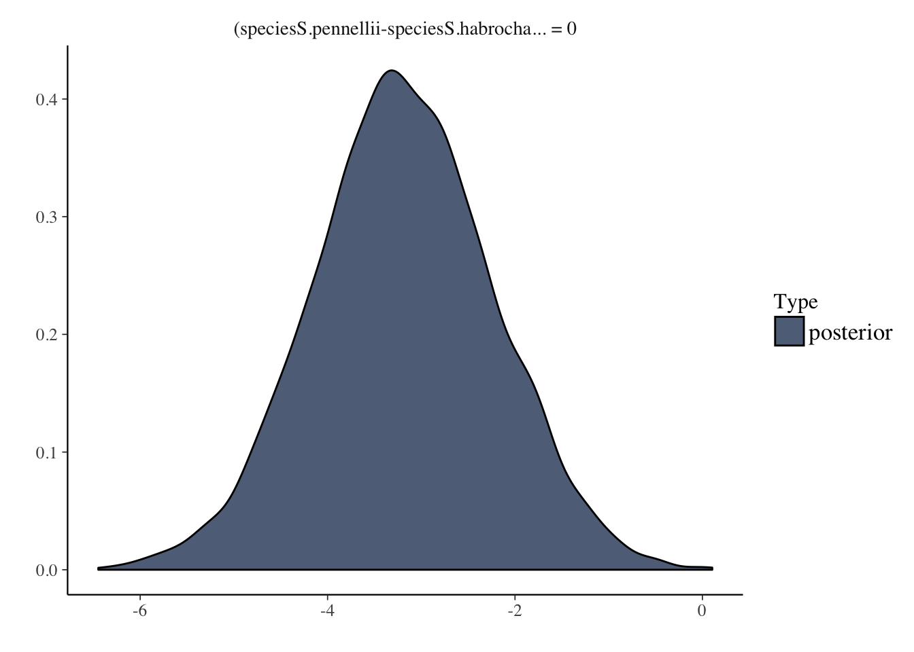

# BRMS Intro and practice


## BRMS background

This week I want to introduce [`brms`](https://github.com/paul-buerkner/brms) (Bayesian Regression Modelling using Stan) , an alternative to `map2stan` for interfacting with [`Stan`](http://mc-stan.org/).  While `map2stan` is a fantastic tool for learning model specification and being very explicit about the models being fit, `brms` has a more intuitive model specification and requires less data reformatting.  `brms` will be particularly familiar to those used to fitting models with `lmer`.

If you want to read someone else's introduction to `brms` you can do so [here](https://thinkinator.com/2016/01/12/r-users-will-now-inevitably-become-bayesians/).

You can also read the package author's README by scrolling down at the [github repo](https://github.com/paul-buerkner/brms)

Finally, the author provides a very detailed [description](https://cran.r-project.org/web/packages/brms/vignettes/brms_overview.pdf);also available by typing `vignette("brms_overview")` after you have brms installed.

## Installation

Because `brms` is in rapid development I prefer to install the most recent version from github:


```r
library(devtools)
install_github("paul-buerkner/brms")
```

(If you don't have `devtools` installed then you will first need to run `install.packages("devtools")`)

## Model specification in brms

Model specification is very similar to that in lmer, namely,

```
repsonse ~ predictor1 + (1|random_predictor2) ...
```

So to use the familiar `Tomato` dataset


```r
library(brms)
library(rstan)
rstan_options(auto_write = TRUE)
options(mc.cores = parallel::detectCores())
tomato <- read.csv("../Assignment_Chapter_09/TomatoR2CSHL.csv") #adjust path as necesary
summary(tomato)
head(tomato)
```

Fit model hypoocytl length as function of treatment and species, and include a "random" effect for shelf.  


```r
hyp1 <- brm(hyp ~ trt + species + (1|shelf),
            data = tomato,
            prior = set_prior("normal(0,10)",class="b") # I'll explain setting priors in the next section
) 
```

```
## Compiling the C++ model
```

```
## Start sampling
```

```
## Warning: There were 2 divergent transitions after warmup. Increasing adapt_delta above 0.8 may help. See
## http://mc-stan.org/misc/warnings.html#divergent-transitions-after-warmup
```

```
## Warning: Examine the pairs() plot to diagnose sampling problems
```

Note:

* __I did not have to create dummy variables for trt, species, or shelf !!__ 
* I did not have to specify priors for sigma or the random effects (although you can, see below)
* The default number of chains is 4

```r
summary(hyp1)
```

```
##  Family: gaussian (identity) 
## Formula: hyp ~ trt + species + (1 | shelf) 
##    Data: tomato (Number of observations: 1008) 
## Samples: 4 chains, each with iter = 2000; warmup = 1000; thin = 1; 
##          total post-warmup samples = 4000
##    WAIC: Not computed
##  
## Group-Level Effects: 
## ~shelf (Number of levels: 6) 
##               Estimate Est.Error l-95% CI u-95% CI Eff.Sample Rhat
## sd(Intercept)     2.47      1.24     1.01     5.92        768    1
## 
## Population-Level Effects: 
##                       Estimate Est.Error l-95% CI u-95% CI Eff.Sample Rhat
## Intercept                32.09      1.52    29.22    35.19       1255    1
## trtL                      5.19      2.02     0.80     9.32       1158    1
## speciesS.chmielewskii    -2.74      0.82    -4.35    -1.16       2114    1
## speciesS.habrochaites    -3.35      0.82    -4.96    -1.75       2373    1
## speciesS.pennellii       -6.54      0.98    -8.41    -4.63       2121    1
## speciesS.peruvianum       3.69      0.84     2.03     5.27       2182    1
## 
## Family Specific Parameters: 
##       Estimate Est.Error l-95% CI u-95% CI Eff.Sample Rhat
## sigma     8.93       0.2     8.56     9.33       3053    1
## 
## Samples were drawn using sampling(NUTS). For each parameter, Eff.Sample 
## is a crude measure of effective sample size, and Rhat is the potential 
## scale reduction factor on split chains (at convergence, Rhat = 1).
```

```r
plot(hyp1,ask=FALSE)
```

<!-- --><!-- -->

Note:

* __The summary automatically displays informative coefficient names__ Compare this to using a "coerced index" in rethinking.

## Interactive model viewer

Run the following for cool interactive exploration of your posteriors.  Click on the various 

```r
launch_shiny(hyp1) #interactive graphical exploration
```


## Prior specification in brms

brms will automatically set priors for many model parameters, but it uses non-sensical priors (uniform across all real numbers) for main-effect coefficients, so __you must set priors for your main-effect coefficients__.  Most other priors have reasonable defaults.

The function for setting priors is `set_priors()`.  

Priors in brms have different classes.

* The "Intercept" class is for the overall intercept
* The "b" class is for coefficients on fixed effects (You can think of "b" as standing for "beta" coefficients)
* The "sigma" class is for the overall standard deviation.  Defaults to `student_t(3, 0, 10)`
* The "sd" class is for the standard deviation of random effects terms.  Defaults to `student_t(3, 0, 10)`

If you want to give the same prior to all members of a class, then just name the class.  In the example I gave above (repeated below) I am setting the priors for all beta coefficients in this case (trtL and the various species) to be normal(0,10).


```r
hyp1 <- brm(hyp ~ trt + species + (1|shelf),
            data = tomato,
            prior = set_prior("normal(0,10)",class="b") # I'll explain priors in the next section
) 
```

Multiple `set_prior` calls can be combined using `c()`.  If you want to specify different priors for specific coefficients, then you can name them in separate `set_prior` calls:


```r
hyp2 <- brm(hyp ~ trt + species + (1|shelf),
            data = tomato,
            prior = c(set_prior("normal(0,10)",class="b"), # sets prior for all b coefficients not otherwise specified
                      set_prior("normal(0,5)",class="b", coef = "trtL")) #sets a different prior for the "trtL" coefficient
) 
```

```
## Compiling the C++ model
```

```
## Start sampling
```

```
## Warning: There were 9 divergent transitions after warmup. Increasing adapt_delta above 0.8 may help. See
## http://mc-stan.org/misc/warnings.html#divergent-transitions-after-warmup
```

```
## Warning: Examine the pairs() plot to diagnose sampling problems
```

To see all priors that you could specify for a given model and how they are specified, use `get_prior()`


```r
get_prior(hyp ~ trt + species + (1|shelf),
          data = tomato)
```

```
##                  prior     class                  coef group nlpar bound
## 1                              b                                        
## 2                              b             Intercept                  
## 3                              b speciesS.chmielewskii                  
## 4                              b speciesS.habrochaites                  
## 5                              b    speciesS.pennellii                  
## 6                              b   speciesS.peruvianum                  
## 7                              b                  trtL                  
## 8                      Intercept                                        
## 9  student_t(3, 0, 10)        sd                                        
## 10                            sd                       shelf            
## 11                            sd             Intercept shelf            
## 12 student_t(3, 0, 10)     sigma
```

For a model you have already fit you can see how the priors were set with:


```r
hyp2$prior
```

```
##                  prior class                  coef group nlpar bound
## 1         normal(0,10)     b                                        
## 2                          b speciesS.chmielewskii                  
## 3                          b speciesS.habrochaites                  
## 4                          b    speciesS.pennellii                  
## 5                          b   speciesS.peruvianum                  
## 6          normal(0,5)     b                  trtL                  
## 7  student_t(3, 0, 10)    sd                                        
## 8                         sd                       shelf            
## 9                         sd             Intercept shelf            
## 10 student_t(3, 0, 10) sigma                                        
## 11                      temp             Intercept
```


Example of setting priors similar to Statistical Rethinking:


```r
hyp3 <- brm(hyp ~ trt + species + (1|shelf),
            data = tomato,
            prior = c(
              set_prior("normal(33,10)",class="Intercept"), # prior for the intercept
              set_prior("normal(0,10)",class="b"), # sets prior for all b coefficients not otherwise specified
              set_prior("normal(0,5)",class="b", coef = "trtL"), #set prior for "trtL"
              set_prior("cauchy(0,1)", class = "sigma"), #half cauchy prior for sigma
              set_prior("normal(0,1)", class = "sd", group = "shelf") #prior for variation due to shelf
            ) 
)
```

```
## Compiling the C++ model
```

```
## Start sampling
```

More information can be found in section 4 of `vignette("brms_overview")` or by `?set_prior`

## Stan parameters

You can specify various Stan parameters similar to the way you would in map2stan:


```r
hyp4 <- brm(hyp ~ trt + species + (1|shelf),
            data = tomato,
            prior = set_prior("normal(0,10)",class="b"), 
            chains = 4, #the default anyway
            iter=4000,
            warmup = 1000,
            cores = 2
)
summary(hyp4)
plot(hyp4)
```

## Interactions

To specify interactions between predictors just replace the '+' with a '*':


```r
hyp5 <- brm(hyp ~ trt * species + (1|shelf), #trt by species interaction
            data = tomato,
            prior = set_prior("normal(0,10)",class="b"), 
)
```

```
## Compiling the C++ model
```

```
## Start sampling
```

```
## Warning: There were 3 divergent transitions after warmup. Increasing adapt_delta above 0.8 may help. See
## http://mc-stan.org/misc/warnings.html#divergent-transitions-after-warmup
```

```
## Warning: Examine the pairs() plot to diagnose sampling problems
```


```r
summary(hyp5)
```

```
##  Family: gaussian (identity) 
## Formula: hyp ~ trt * species + (1 | shelf) 
##    Data: tomato (Number of observations: 1008) 
## Samples: 4 chains, each with iter = 2000; warmup = 1000; thin = 1; 
##          total post-warmup samples = 4000
##    WAIC: Not computed
##  
## Group-Level Effects: 
## ~shelf (Number of levels: 6) 
##               Estimate Est.Error l-95% CI u-95% CI Eff.Sample Rhat
## sd(Intercept)     2.57      1.28     1.01     6.06        933    1
## 
## Population-Level Effects: 
##                            Estimate Est.Error l-95% CI u-95% CI Eff.Sample
## Intercept                     31.68      1.75    28.28    35.26       1378
## trtL                           6.01      2.43     0.72    10.83       1294
## speciesS.chmielewskii         -1.06      1.17    -3.31     1.27       1936
## speciesS.habrochaites         -2.05      1.13    -4.23     0.15       2006
## speciesS.pennellii            -8.48      1.38   -11.25    -5.67       2152
## speciesS.peruvianum            3.66      1.18     1.33     6.02       1954
## trtL:speciesS.chmielewskii    -3.27      1.62    -6.47    -0.08       2032
## trtL:speciesS.habrochaites    -2.74      1.61    -5.91     0.43       1700
## trtL:speciesS.pennellii        3.47      1.87    -0.27     7.12       2186
## trtL:speciesS.peruvianum       0.01      1.64    -3.16     3.28       1912
##                            Rhat
## Intercept                     1
## trtL                          1
## speciesS.chmielewskii         1
## speciesS.habrochaites         1
## speciesS.pennellii            1
## speciesS.peruvianum           1
## trtL:speciesS.chmielewskii    1
## trtL:speciesS.habrochaites    1
## trtL:speciesS.pennellii       1
## trtL:speciesS.peruvianum      1
## 
## Family Specific Parameters: 
##       Estimate Est.Error l-95% CI u-95% CI Eff.Sample Rhat
## sigma     8.88       0.2     8.51     9.28       4000    1
## 
## Samples were drawn using sampling(NUTS). For each parameter, Eff.Sample 
## is a crude measure of effective sample size, and Rhat is the potential 
## scale reduction factor on split chains (at convergence, Rhat = 1).
```

```r
plot(hyp5, ask=FALSE)
```

<!-- --><!-- --><!-- -->


## Comparing models

Models can be compared using WAIC or another procedure, leave one out cross validation, using loo:


```r
waic(hyp1,hyp5)
```

```
##                WAIC    SE
## hyp1        7285.73 57.86
## hyp5        7276.94 57.97
## hyp1 - hyp5    8.79  7.11
```

```r
loo(hyp1,hyp5)
```

```
##               LOOIC    SE
## hyp1        7285.73 57.86
## hyp5        7276.94 57.97
## hyp1 - hyp5    8.78  7.11
```

So hyp5 is favored, but not by much.

At this point I am not sure how to do the model weighting that rethinking can report when comparing models.

## Unique intercepts

In map2stan we saw how to fit models where each level of a predictor had its own intercept.  In brms including a "0" tells brms to fit a separate interecept for each level of the following predictor.

For example, if we used the default of `hyp ~ trt + species` then the intercept would correspond to the first level of trt and the first level of species.  That is, the intercept would be for speciesS.chillense in trtH.

If instead we used `hyp ~ 0 + trt + species` then there is a separate intercept for each species in trtH.


```r
hyp6 <- brm(hyp ~ species + trt,
            prior = set_prior("normal(0,10)",class="b"),
            data = tomato)
```

```
## Compiling the C++ model
```

```
## Start sampling
```

```r
hyp7 <- brm(hyp ~ 0 + species + trt,
            prior = c(
              set_prior("normal(33,10)", class = "b"), #average species height
              set_prior("normal(0,10)", class = "b", coef = "trtL")
              ),
            data=tomato)
```

```
## Compiling the C++ model
## Start sampling
```

Compare the summaries:


```r
summary(hyp6)
```

```
##  Family: gaussian (identity) 
## Formula: hyp ~ species + trt 
##    Data: tomato (Number of observations: 1008) 
## Samples: 4 chains, each with iter = 2000; warmup = 1000; thin = 1; 
##          total post-warmup samples = 4000
##    WAIC: Not computed
##  
## Population-Level Effects: 
##                       Estimate Est.Error l-95% CI u-95% CI Eff.Sample Rhat
## Intercept                32.01      0.66    30.71    33.33       1652    1
## speciesS.chmielewskii    -2.66      0.84    -4.34    -1.01       1874    1
## speciesS.habrochaites    -3.42      0.83    -5.01    -1.78       1838    1
## speciesS.pennellii       -6.09      0.98    -8.00    -4.16       2153    1
## speciesS.peruvianum       3.76      0.86     2.05     5.44       1808    1
## trtL                      5.30      0.55     4.23     6.41       2951    1
## 
## Family Specific Parameters: 
##       Estimate Est.Error l-95% CI u-95% CI Eff.Sample Rhat
## sigma     9.05      0.19     8.68     9.46       3242    1
## 
## Samples were drawn using sampling(NUTS). For each parameter, Eff.Sample 
## is a crude measure of effective sample size, and Rhat is the potential 
## scale reduction factor on split chains (at convergence, Rhat = 1).
```

```r
summary(hyp7)
```

```
##  Family: gaussian (identity) 
## Formula: hyp ~ 0 + species + trt 
##    Data: tomato (Number of observations: 1008) 
## Samples: 4 chains, each with iter = 2000; warmup = 1000; thin = 1; 
##          total post-warmup samples = 4000
##    WAIC: Not computed
##  
## Population-Level Effects: 
##                       Estimate Est.Error l-95% CI u-95% CI Eff.Sample Rhat
## speciesS.chilense        32.10      0.65    30.84    33.37       2611    1
## speciesS.chmielewskii    29.33      0.66    28.03    30.58       2299    1
## speciesS.habrochaites    28.60      0.64    27.38    29.86       2630    1
## speciesS.pennellii       25.91      0.80    24.36    27.52       2826    1
## speciesS.peruvianum      35.76      0.65    34.51    37.06       2310    1
## trtL                      5.29      0.54     4.21     6.36       1822    1
## 
## Family Specific Parameters: 
##       Estimate Est.Error l-95% CI u-95% CI Eff.Sample Rhat
## sigma     9.05       0.2     8.67     9.44       2845    1
## 
## Samples were drawn using sampling(NUTS). For each parameter, Eff.Sample 
## is a crude measure of effective sample size, and Rhat is the potential 
## scale reduction factor on split chains (at convergence, Rhat = 1).
```

```r
loo(hyp6,hyp7)
```

```
##               LOOIC    SE
## hyp6        7308.02 57.46
## hyp7        7308.14 57.45
## hyp6 - hyp7   -0.13  0.33
```


## Binomial and other models

To specify a non-Gaussian model use the `family` parameter in your call to brm.  I will illustrate with Liron's germination data.


```r
germination <- read.csv("../Assignment_Chapter_10/LironDataTime1.csv")
summary(germination)
head(germination)
germination$Germination2 <- ifelse(germination$Germination=="Yes",1,0) #need numeric response
germination$Temperature_b <- germination$Temperature - min(germination$Temperature) #baseline it
```

The `trials(1)` in the formula below indicates how many trials per row in the data frame.  Instead of a numeric this could also refer to a column in the data frame (if a column specified the number of trials represented in each row).


```r
germ1 <- brm(Germination2 | trials(1) ~ Species + Temperature_b,
             family = "binomial",
             prior=set_prior("normal(0,10)", class="b"),
             data = germination
             )
```

```
## Only 2 levels detected so that family 'bernoulli' might be a more efficient choice.
```

```
## Compiling the C++ model
```

```
## Start sampling
```

```
## Only 2 levels detected so that family 'bernoulli' might be a more efficient choice.
```


```r
summary(germ1)
```

```
##  Family: binomial (logit) 
## Formula: Germination2 | trials(1) ~ Species + Temperature_b 
##    Data: germination (Number of observations: 120) 
## Samples: 4 chains, each with iter = 2000; warmup = 1000; thin = 1; 
##          total post-warmup samples = 4000
##    WAIC: Not computed
##  
## Population-Level Effects: 
##               Estimate Est.Error l-95% CI u-95% CI Eff.Sample Rhat
## Intercept        -0.60      0.33    -1.27     0.07       3613    1
## Speciespen        1.36      0.44     0.53     2.27       3217    1
## Temperature_b     0.24      0.06     0.13     0.35       2585    1
## 
## Samples were drawn using sampling(NUTS). For each parameter, Eff.Sample 
## is a crude measure of effective sample size, and Rhat is the potential 
## scale reduction factor on split chains (at convergence, Rhat = 1).
```

```r
plot(germ1, ask=FALSE)
```

<!-- -->

Note: __I did not have to specify the link function__, `logit` is automatically used as a link function.

Available families (and their link functions) are described by typing `?family` and `?brmsfamily`

You will note that there was a message that "that family 'bernoulli' might be a more efficient choice."  The Bernoulli family is specific for binomial problems where each row of data corresponds to a single trial, so in this case we could have used the code below, which indeed does run faster.


```r
germ2 <- brm(Germination2  ~ Species + Temperature_b,
             family = "bernoulli",
             prior=set_prior("normal(0,10)", class="b"),
             data = germination
             )
```

```
## Compiling the C++ model
```

```
## Start sampling
```


```r
summary(germ2)
```

```
##  Family: bernoulli (logit) 
## Formula: Germination2 ~ Species + Temperature_b 
##    Data: germination (Number of observations: 120) 
## Samples: 4 chains, each with iter = 2000; warmup = 1000; thin = 1; 
##          total post-warmup samples = 4000
##    WAIC: Not computed
##  
## Population-Level Effects: 
##               Estimate Est.Error l-95% CI u-95% CI Eff.Sample Rhat
## Intercept        -0.60      0.34    -1.27     0.05       3504    1
## Speciespen        1.35      0.43     0.54     2.21       2979    1
## Temperature_b     0.23      0.06     0.13     0.35       2470    1
## 
## Samples were drawn using sampling(NUTS). For each parameter, Eff.Sample 
## is a crude measure of effective sample size, and Rhat is the potential 
## scale reduction factor on split chains (at convergence, Rhat = 1).
```

```r
plot(germ2,ask=FALSE)
```

<!-- -->

## Hypothesis testing

brms includes a function for Bayesian hypothesis testing.  See below for an example of how to test if the effect of "trtL" is non-zero (two-sided hypothesis test).  Plotting the hypothesis test shows the relevant posterior distributions.


```r
summary(hyp1)
```

```
##  Family: gaussian (identity) 
## Formula: hyp ~ trt + species + (1 | shelf) 
##    Data: tomato (Number of observations: 1008) 
## Samples: 4 chains, each with iter = 2000; warmup = 1000; thin = 1; 
##          total post-warmup samples = 4000
##    WAIC: Not computed
##  
## Group-Level Effects: 
## ~shelf (Number of levels: 6) 
##               Estimate Est.Error l-95% CI u-95% CI Eff.Sample Rhat
## sd(Intercept)     2.47      1.24     1.01     5.92        768    1
## 
## Population-Level Effects: 
##                       Estimate Est.Error l-95% CI u-95% CI Eff.Sample Rhat
## Intercept                32.09      1.52    29.22    35.19       1255    1
## trtL                      5.19      2.02     0.80     9.32       1158    1
## speciesS.chmielewskii    -2.74      0.82    -4.35    -1.16       2114    1
## speciesS.habrochaites    -3.35      0.82    -4.96    -1.75       2373    1
## speciesS.pennellii       -6.54      0.98    -8.41    -4.63       2121    1
## speciesS.peruvianum       3.69      0.84     2.03     5.27       2182    1
## 
## Family Specific Parameters: 
##       Estimate Est.Error l-95% CI u-95% CI Eff.Sample Rhat
## sigma     8.93       0.2     8.56     9.33       3053    1
## 
## Samples were drawn using sampling(NUTS). For each parameter, Eff.Sample 
## is a crude measure of effective sample size, and Rhat is the potential 
## scale reduction factor on split chains (at convergence, Rhat = 1).
```

```r
hypothesis(hyp1,"trtL = 0")
```

```
## Hypothesis Tests for class b:
##            Estimate Est.Error l-95% CI u-95% CI Evid.Ratio  
## (trtL) = 0     5.19      2.02      0.8     9.32         NA *
## ---
## '*': The expected value under the hypothesis lies outside the 95% CI.
```

```r
plot(hypothesis(hyp1,"trtL = 0"))
```

<!-- -->

To test if the effect of "trtL" is positive (one-sided hypothesis test):


```r
summary(hyp1)
```

```
##  Family: gaussian (identity) 
## Formula: hyp ~ trt + species + (1 | shelf) 
##    Data: tomato (Number of observations: 1008) 
## Samples: 4 chains, each with iter = 2000; warmup = 1000; thin = 1; 
##          total post-warmup samples = 4000
##    WAIC: Not computed
##  
## Group-Level Effects: 
## ~shelf (Number of levels: 6) 
##               Estimate Est.Error l-95% CI u-95% CI Eff.Sample Rhat
## sd(Intercept)     2.47      1.24     1.01     5.92        768    1
## 
## Population-Level Effects: 
##                       Estimate Est.Error l-95% CI u-95% CI Eff.Sample Rhat
## Intercept                32.09      1.52    29.22    35.19       1255    1
## trtL                      5.19      2.02     0.80     9.32       1158    1
## speciesS.chmielewskii    -2.74      0.82    -4.35    -1.16       2114    1
## speciesS.habrochaites    -3.35      0.82    -4.96    -1.75       2373    1
## speciesS.pennellii       -6.54      0.98    -8.41    -4.63       2121    1
## speciesS.peruvianum       3.69      0.84     2.03     5.27       2182    1
## 
## Family Specific Parameters: 
##       Estimate Est.Error l-95% CI u-95% CI Eff.Sample Rhat
## sigma     8.93       0.2     8.56     9.33       3053    1
## 
## Samples were drawn using sampling(NUTS). For each parameter, Eff.Sample 
## is a crude measure of effective sample size, and Rhat is the potential 
## scale reduction factor on split chains (at convergence, Rhat = 1).
```

```r
hypothesis(hyp1,"trtL > 0")
```

```
## Hypothesis Tests for class b:
##            Estimate Est.Error l-95% CI u-95% CI Evid.Ratio  
## (trtL) > 0     5.19      2.02     1.74      Inf      84.11 *
## ---
## '*': The expected value under the hypothesis lies outside the 95% CI.
```

```r
plot(hypothesis(hyp1,"trtL > 0"))
```

<!-- -->

To test if the coefficients for S.pennellii and S.habrochaites are different:


```r
hypothesis(hyp1, "speciesS.pennellii-speciesS.habrochaites = 0")
```

```
## Hypothesis Tests for class b:
##                          Estimate Est.Error l-95% CI u-95% CI Evid.Ratio  
## (speciesS.pennell... = 0    -3.19      0.96     -5.1     -1.3         NA *
## ---
## '*': The expected value under the hypothesis lies outside the 95% CI.
```

```r
plot(hypothesis(hyp1, "speciesS.pennellii-speciesS.habrochaites = 0"))
```

<!-- -->

# Exercises

To gain familiarity with `brms` I am going to have you refit models from Statistical Rethinking with brms.  In all cases compare the brms and map2stan parameter estimates; they should be effectively the same if you have specified them correctly.

## Q1

Fit model 10.9 (R code 10.28) with brms.  Remember that you should not need to transform the predictors, create dummy variables, nor coerce indexes to use brms.  Compare to the map2stan fit.  Test whether the coefficient for gender is different from 0 in the brms model.  

## Q2

Refit models 12.1 and 12.2 (Rcode 12.2 and 12.3) with brms

## Q3

Use both brms and map2stan to fit a model for `intleng` as a function of `species`, `trt` and their interaction, and include `shelf` as a random effect.
